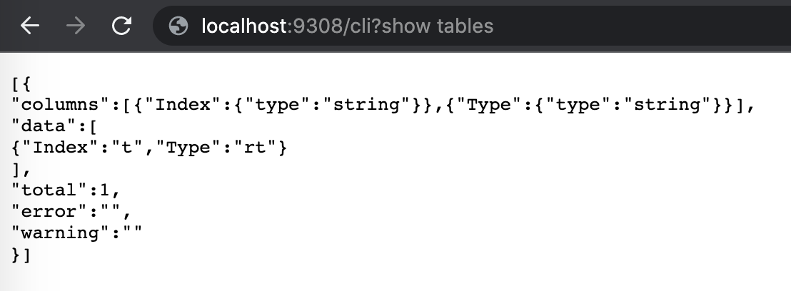

# HTTP

You can connect to Manticore Search through HTTP/HTTPS.

## Configuration
<!-- example HTTP -->
By default, Manticore listens for HTTP, HTTPS, and binary requests on ports 9308 and 9312.

In the "searchd" section of your configuration file, you can define the HTTP port using the `listen` directive as follows:

Both lines are valid and have the same meaning (except for the port number). They both define listeners that will serve all API/HTTP/HTTPS protocols. There are no special requirements, and any HTTP client can be used to connect to Manticore.

<!-- request HTTP -->
```ini
searchd {
...
   listen = 127.0.0.1:9308
   listen = 127.0.0.1:9312:http
...
}
```
<!-- end -->

All HTTP endpoints return `application/json` content type. For the most part, endpoints use JSON payloads for requests. However, there are some exceptions that use NDJSON or simple URL-encoded payloads.

Currently, there is no user authentication. Therefore, make sure that the HTTP interface is not accessible to anyone outside your network. As Manticore functions like any other web server, you can use a reverse proxy, such as Nginx, to implement HTTP authentication or caching.

<!-- example HTTPS -->
The HTTP protocol also supports [SSL encryption](../Security/SSL.md):
If you specify `:https` instead of `:http` **only** secured connections will be accepted. Otherwise in case of no valid key/certificate provided, but the client trying to connect via https - the connection will be dropped. If you make not HTTPS, but an HTTP request to 9443 it will respond with HTTP code 400.

<!-- request HTTPS -->
```ini
searchd {
...
   listen = 127.0.0.1:9308
   listen = 127.0.0.1:9443:https
...
}
```
<!-- end --> 

### VIP Connection
<!-- example VIP -->
Separate HTTP interface can be used for 'VIP' connections. In this case, the connection bypasses a thread pool and always creates a new dedicated thread. This is useful for managing Manticore Search during periods of severe overload when the server might stall or not allow regular port connections.

For more information on the `listen` directive, see [this section](../Server_settings/Searchd.md#listen).

<!-- request VIP -->
```ini
searchd {
...
   listen = 127.0.0.1:9308
   listen = 127.0.0.1:9318:_vip
...
}
```
<!-- end -->

## SQL over HTTP

Endpoints `/sql` and `/cli` allow running SQL queries via HTTP.

* `/sql` endpoint accepts only SELECT statements and returns the response in HTTP JSON format. The query parameter should be URL-encoded.
* The `/sql?mode=raw` endpoint accepts any SQL query and returns the response in raw format, similar to what you would receive via mysql. The `query` parameter should also be URL-encoded.
* The `/cli` endpoint accepts any SQL query and returns the response in raw format, similar to what you would receive via mysql. Unlike the `/sql` and `/sql?mode=raw` endpoints, the `query` parameter should not be URL-encoded. This endpoint is intended for manual actions using a browser or command line HTTP clients such as curl. It is not recommended to use the `/cli` endpoint in scripts.


### /sql

<!-- example SQL_over_HTTP -->

`/sql` accepts an **SQL [SELECT](../Searching/Full_text_matching/Basic_usage.md#SQL) query** via HTTP JSON interface.

Query payload **must** be URL encoded, otherwise query statements with `=` (filtering or setting options) will result in an error.

It returns a JSON response which contains hits information and execution time. The response has the same format as [json/search](../Searching/Full_text_matching/Basic_usage.md#HTTP-JSON) endpoint. Note, that `/sql` endpoint supports only single search requests. If you are looking for processing a multi-query see below.

<!-- request HTTP -->
```bash
POST /sql -d "query=select%20id%2Csubject%2Cauthor_id%20%20from%20forum%20where%20match%28%27%40subject%20php%20manticore%27%29%20group%20by%20author_id%20order%20by%20id%20desc%20limit%200%2C5"
```

<!-- response HTTP -->
```json
{
  "took": 0,
  "timed_out": false,
  "hits": {
    "total": 2,
    "total_relation": "eq",
    "hits": [
      {
        "_id": "2",
        "_score": 2356,
        "_source": {
          "subject": "php manticore",
          "author_id": 12
        }
      },
      {
        "_id": "1",
        "_score": 2356,
        "_source": {
          "subject": "php manticore",
          "author_id": 11
        }
      }
    ]
  }
}
```

<!-- end -->

<!-- example SQL_over_HTTP_2 -->
### /sql?mode=raw

`/sql` endpoint also has a special mode **"raw"**, which allows to send **any valid sphinxql queries including multi-queries**. The returned value is a json array of one or more result sets.

<!-- request HTTP -->
```bash
POST /sql?mode=raw -d "query=desc%20test"
```

<!-- response HTTP -->
```json
[
  {
    "columns": [
      {
        "Field": {
          "type": "string"
        }
      },
      {
        "Type": {
          "type": "string"
        }
      },
      {
        "Properties": {
          "type": "string"
        }
      }
    ],
    "data": [
      {
        "Field": "id",
        "Type": "bigint",
        "Properties": ""
      },
      {
        "Field": "title",
        "Type": "text",
        "Properties": "indexed"
      },
      {
        "Field": "gid",
        "Type": "uint",
        "Properties": ""
      },
      {
        "Field": "title",
        "Type": "string",
        "Properties": ""
      },
      {
        "Field": "j",
        "Type": "json",
        "Properties": ""
      },
      {
        "Field": "new1",
        "Type": "uint",
        "Properties": ""
      }
    ],
    "total": 6,
    "error": "",
    "warning": ""
  }
]
```
<!-- end -->

<!-- example SQL_over_HTTP_4 -->
### /cli
While the `/sql` endpoint is useful to control Manticore programmatically from your application, there's also endpoint `/cli` which makes it easier to maintain a Manticore instance via curl or your browser manually. It accepts POST and GET HTTP methods. Everything after `/cli?` is taken by Manticore as is, even if you don't escape it manually via curl or let the browser encode it automatically. The `+` sign is not decoded to a space as well, eliminating the necessity of encoding it. The response format is tabular, similar to the one returned by  MySQL console.


<!-- request HTTP -->

```bash
POST /cli -d "desc test"
```

<!-- response HTTP -->

```bash
+-------+--------+----------------+
| Field | Type   | Properties     |
+-------+--------+----------------+
| id    | bigint |                |
| body  | text   | indexed stored |
| title | string |                |
+-------+--------+----------------+
3 rows in set (0.001 sec)
```


<!-- request Browser -->



<!-- end -->

<!-- example SQL_over_HTTP_cli_json -->

### /cli_json

The `/cli_json` endpoint provides the same functionality as `/cli` , but returns the response in JSON format. 


<!-- request HTTP -->

```bash
POST /cli_json -d "desc test"
```

<!-- response HTTP -->

```json
[{
"columns":[{"Field":{"type":"string"}},{"Type":{"type":"string"}},{"Properties":{"type":"string"}}],
"data":[
{"Field":"id","Type":"bigint","Properties":""},
{"Field":"body","Type":"text","Properties":"indexed stored"},
{"Field":"title","Type":"string","Properties":""}
],
"total":3,
"error":"",
"warning":""
}]
```

<!-- end -->


### Keep-alive

HTTP keep-alive is also supported, which makes working via the HTTP JSON interface stateful as long as the client supports keep-alive too. For example, using the new [/cli](../Connecting_to_the_server/HTTP.md#/cli) endpoint you can call `SHOW META` after `SELECT` and it will work the same way it works via mysql.
<!-- proofread -->