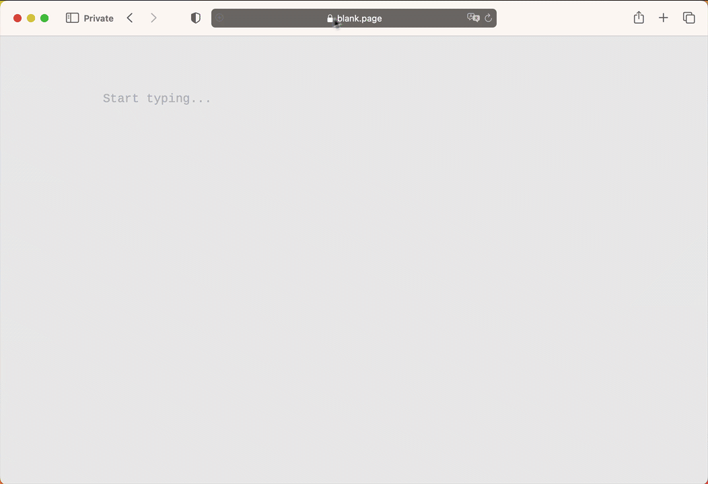

# Read this first

## About this manual

The manual is arranged to reflect the most likely way you would use Manticore:

* starting with basic information about it and how to install and connect
* essential things like adding documents and running searches
* performance optimization tips, tricks and extending Manticore with the help of plugins and custom functions

##### Do not skip 1️⃣ 2️⃣ 3️⃣
Key sections of the manual are marked with 1️⃣, 2️⃣, 3️⃣ etc. in the menu for your convenience since their corresponding functionality is most used. If you are new to Manticore **we highly recommend not skipping them**.

##### Quick start guide
If you are looking for a quick understanding of how Manticore works in general [⚡ Quick start guide](Quick_start_guide.md) is a good place to start.

##### Using examples
Each query example has a little icon 📋 in the top-right corner:

You can use it to copy examples to the clipboard. **If the query is an HTTP request it will be copied as a CURL command**. You can configure the host/port if you press ⚙️.

##### Search in this manual

We love search and we've made our best to make searching in this manual as convenient as possible. Of course it's backed by Manticore Search. Besides using the search bar which requires opening the manual first there is a very easy way to find something by just opening **mnt.cr/your-search-keyword** :

## Best practices
There are few things you need to understand about Manticore Search that can help you follow the best practices of using it.

#### Real-time table vs plain table
* **[Real-time table](Creating_a_table/Local_tables/Real-time_table.md)** allows adding, updating and deleting documents with immediate availability of the changes.
* **[Plain table](Creating_a_table/Local_tables/Plain_table.md)** is a mostly immutable data structure and a basic element used by real-time tables. Plain table stores a set of documents, their common dictionary and indexation settings. One real-time table can consist of multiple plain tables (chunks), but **besides that Manticore provides direct access to building plain tables** using tool [indexer](Data_creation_and_modification/Adding_data_from_external_storages/Plain_tables_creation.md#Indexer-tool). It makes sense when your data is mostly immutable, therefore you don't need a real-time table for that.

#### Real-time mode vs plain mode
Manticore Search works in two modes:
* **Real-time mode** (RT mode). This is a default one and allows to manage your data schema **imperatively**:
  * allows managing your data schema online using SQL commands `CREATE`/`ALTER`/`DROP TABLE` and their equivalents in non-SQL clients
  * in the configuration file you need to define only server-related settings including [data_dir](Server_settings/Searchd.md#data_dir)
* **Plain mode** allows to define your data schemas in a configuration file, i.e. provides **declarative** kind of schema management. It makes sense in three cases:
  * when you only deal with plain tables
  * or when your data schema is very stable and you don't need replication (as it's available only in the RT mode)
  * when you have to make your data schema portable (e.g. for easier deployment of it on a new server)

You cannot combine the 2 modes and need to decide which one you want to follow by specifying [data_dir](Server_settings/Searchd.md#data_dir) in your configuration file (which is the default behaviour). If you are unsure **our recommendation is to follow the RT mode** as if even you need a plain table you can [build](Data_creation_and_modification/Adding_data_from_external_storages/Plain_tables_creation.md) it with a separate plain table config and [import](Data_creation_and_modification/Adding_data_from_external_storages/Adding_data_to_tables/Importing_table.md) to your main Manticore instance.

Real-time tables can be used in both RT and plain modes. In the RT mode a real-time table is defined with a `CREATE TABLE` command, while in the plain mode it is defined in the configuration file. Plain (offline) tables are supported only in the plain mode. Plain tables cannot be created in the RT mode, but existing plain tables made in the plain mode can be [converted](Data_creation_and_modification/Adding_data_from_external_storages/Adding_data_to_tables/Attaching_one_table_to_another.md) to real-time tables and [imported](Data_creation_and_modification/Adding_data_from_external_storages/Adding_data_to_tables/Importing_table.md) in the RT mode.

#### SQL vs JSON
Manticore provides multiple ways and interfaces to manage your schemas and data, but the two main are:
* **SQL**. This is a native Manticore's language which enables all Manticore's functionality. **The best practice is to use SQL to**:
  * manage your schemas and do other DBA routines as it's the easiest way to do that
  * design your queries as SQL is much closer to natural language than the JSON DSL which is important when you design something new. You can use Manticore SQL via any MySQL client or [/sql](Connecting_to_the_server/MySQL_protocol.md).
* **JSON**. Most functionality is also available via JSON domain specific language. This is especially useful when you integrate Manticore with your application as with JSON you can do it more programmatically than with SQL. The best practice is to **first explore how to do something via SQL and then use JSON to integrate it into your application.**

<!-- proofread -->
