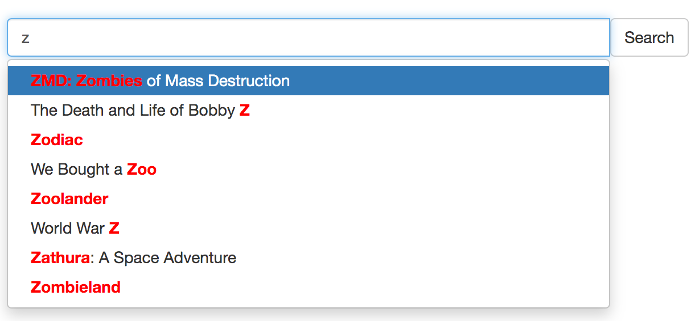

# Autocomplete

Autocomplete (or word completion) is a feature in which an application predicts the rest of a word a user is typing. On websites it's used in search boxes, where a user starts to type a word and a dropdown with suggestions pops up so the user can select the ending from the list.



There are few ways how you can do autocomplete in Manticore:
##### Autocomplete a sentence
To autocomplete a sentence you can use [infixed search](../Creating_a_table/NLP_and_tokenization/Wildcard_searching_settings.md#min_infix_len). You can find endings of a document's field by providing its beginning and:

* using [full-text operators](../Searching/Full_text_matching/Operators.md) `*` to match anything it substitutes
* and optionally `^` to start from the beginning of the field
* and perhaps `""` for phrase matching
* and optionally [highlight the results](../Searching/Highlighting.md) so you don't have to fetch them in full to your application

There is an [article about it in our blog](https://manticoresearch.com/2020/03/31/simple-autocomplete-with-manticore/) and an [interactive course](../Searching/Spell_correction.md#Interactive-course). A quick example is:

* Let's assume you have a document: `My cat loves my dog. The cat (Felis catus) is a domestic species of small carnivorous mammal.`
* Then you can use `^`, `""` and `*` so as the user is typing you make queries like: `^"m*"`, `^"my *"`, `^"my c*"`, `^"my ca*"` and so on
* It will find the document and if you also do [highlighting](../Searching/Highlighting.md) you will get something like: `<b>My cat</b> loves my dog. The cat ( ...`

##### Autocomplete a word
In some cases all you need is just autocomplete a single word or a couple of words. In this case you can use `CALL KEYWORDS`.

### CALL KEYWORDS
`CALL KEYWORDS` is available via the SQL interface and provides a way to check how keywords are tokenized or to retrieve the tokenized forms of particular keywords. If the table enables [infixes](../Creating_a_table/NLP_and_tokenization/Wildcard_searching_settings.md#min_infix_len) it allows to quickly find possible endings for given keywords which makes it possible for use for autocomplete.

This is a good alternative to just general infixed search as it provides higher performance since all it needs for work is table's dictionary, not the documents themselves.

### General syntax
<!-- example keywords -->
```sql
CALL KEYWORDS(text, table [, options])
```
`CALL KEYWORDS` statement splits text into keywords. It returns tokenized and normalized forms of the keywords, and, optionally, keyword statistics. It also returns the position of each keyword in the query and all forms of tokenized keywords in case the table enables [lemmatizers](../Creating_a_table/NLP_and_tokenization/Morphology.md).

| Parameter | Description |
| - | - |
| text | Text to break down to keywords |
| table | Name of the table from which to take the text processing settings |  
| 0/1 as stats | Show statistics of keywords, default is 0 |
| 0/1 as fold_wildcards | Fold wildcards, default is 0 |
| 0/1 as fold_lemmas | Fold morphological lemmas, default is 0 |
| 0/1 as fold_blended | Fold blended words, default is 0 |
| N as expansion_limit | Override [expansion_limit](../Creating_a_table/NLP_and_tokenization/Wildcard_searching_settings.md#expansion_limit) defined in the server configuration, default is 0 (use value from the configuration) |
| docs/hits as sort_mode | Sort output results by either 'docs' or 'hits'. Default no sorting |

The examples show how it works if assuming the user is trying to get an autocomplete for "my cat ...". So on the application side all you need to do is to suggest the user the endings from the column "normalized" for each new word. It often makes sense to sort by hits or docs using `'hits' as sort_mode` or `'docs' as sort_mode`.

<!-- intro -->
##### Examples:

<!-- request Examples -->

```sql
MySQL [(none)]> CALL KEYWORDS('m*', 't', 1 as stats);
+------+-----------+------------+------+------+
| qpos | tokenized | normalized | docs | hits |
+------+-----------+------------+------+------+
| 1    | m*        | my         | 1    | 2    |
| 1    | m*        | mammal     | 1    | 1    |
+------+-----------+------------+------+------+

MySQL [(none)]> CALL KEYWORDS('my*', 't', 1 as stats);
+------+-----------+------------+------+------+
| qpos | tokenized | normalized | docs | hits |
+------+-----------+------------+------+------+
| 1    | my*       | my         | 1    | 2    |
+------+-----------+------------+------+------+

MySQL [(none)]> CALL KEYWORDS('c*', 't', 1 as stats, 'hits' as sort_mode);
+------+-----------+-------------+------+------+
| qpos | tokenized | normalized  | docs | hits |
+------+-----------+-------------+------+------+
| 1    | c*        | cat         | 1    | 2    |
| 1    | c*        | carnivorous | 1    | 1    |
| 1    | c*        | catus       | 1    | 1    |
+------+-----------+-------------+------+------+

MySQL [(none)]> CALL KEYWORDS('ca*', 't', 1 as stats, 'hits' as sort_mode);
+------+-----------+-------------+------+------+
| qpos | tokenized | normalized  | docs | hits |
+------+-----------+-------------+------+------+
| 1    | ca*       | cat         | 1    | 2    |
| 1    | ca*       | carnivorous | 1    | 1    |
| 1    | ca*       | catus       | 1    | 1    |
+------+-----------+-------------+------+------+

MySQL [(none)]> CALL KEYWORDS('cat*', 't', 1 as stats, 'hits' as sort_mode);
+------+-----------+------------+------+------+
| qpos | tokenized | normalized | docs | hits |
+------+-----------+------------+------+------+
| 1    | cat*      | cat        | 1    | 2    |
| 1    | cat*      | catus      | 1    | 1    |
+------+-----------+------------+------+------+
```
<!-- end -->
<!-- example bigram -->
There is a nice trick how you can improve the above algorithm - use [bigram_index](../Creating_a_table/NLP_and_tokenization/Low-level_tokenization.md#bigram_index). When you have it enabled for the table what you get in it is not just a single word, but each pair of words standing one after another indexed as a separate token.

This allows to predict not just the current word's ending, but the next word too which is especially beneficial for the purpose of autocomplete.

<!-- intro -->
##### Examples:

<!-- request Examples -->

```sql
MySQL [(none)]> CALL KEYWORDS('m*', 't', 1 as stats, 'hits' as sort_mode);
+------+-----------+------------+------+------+
| qpos | tokenized | normalized | docs | hits |
+------+-----------+------------+------+------+
| 1    | m*        | my         | 1    | 2    |
| 1    | m*        | mammal     | 1    | 1    |
| 1    | m*        | my cat     | 1    | 1    |
| 1    | m*        | my dog     | 1    | 1    |
+------+-----------+------------+------+------+

MySQL [(none)]> CALL KEYWORDS('my*', 't', 1 as stats, 'hits' as sort_mode);
+------+-----------+------------+------+------+
| qpos | tokenized | normalized | docs | hits |
+------+-----------+------------+------+------+
| 1    | my*       | my         | 1    | 2    |
| 1    | my*       | my cat     | 1    | 1    |
| 1    | my*       | my dog     | 1    | 1    |
+------+-----------+------------+------+------+

MySQL [(none)]> CALL KEYWORDS('c*', 't', 1 as stats, 'hits' as sort_mode);
+------+-----------+--------------------+------+------+
| qpos | tokenized | normalized         | docs | hits |
+------+-----------+--------------------+------+------+
| 1    | c*        | cat                | 1    | 2    |
| 1    | c*        | carnivorous        | 1    | 1    |
| 1    | c*        | carnivorous mammal | 1    | 1    |
| 1    | c*        | cat felis          | 1    | 1    |
| 1    | c*        | cat loves          | 1    | 1    |
| 1    | c*        | catus              | 1    | 1    |
| 1    | c*        | catus is           | 1    | 1    |
+------+-----------+--------------------+------+------+

MySQL [(none)]> CALL KEYWORDS('ca*', 't', 1 as stats, 'hits' as sort_mode);
+------+-----------+--------------------+------+------+
| qpos | tokenized | normalized         | docs | hits |
+------+-----------+--------------------+------+------+
| 1    | ca*       | cat                | 1    | 2    |
| 1    | ca*       | carnivorous        | 1    | 1    |
| 1    | ca*       | carnivorous mammal | 1    | 1    |
| 1    | ca*       | cat felis          | 1    | 1    |
| 1    | ca*       | cat loves          | 1    | 1    |
| 1    | ca*       | catus              | 1    | 1    |
| 1    | ca*       | catus is           | 1    | 1    |
+------+-----------+--------------------+------+------+

MySQL [(none)]> CALL KEYWORDS('cat*', 't', 1 as stats, 'hits' as sort_mode);
+------+-----------+------------+------+------+
| qpos | tokenized | normalized | docs | hits |
+------+-----------+------------+------+------+
| 1    | cat*      | cat        | 1    | 2    |
| 1    | cat*      | cat felis  | 1    | 1    |
| 1    | cat*      | cat loves  | 1    | 1    |
| 1    | cat*      | catus      | 1    | 1    |
| 1    | cat*      | catus is   | 1    | 1    |
+------+-----------+------------+------+------+
```
<!-- end -->

`CALL KEYWORDS` supports distributed tables so no matter how big your data set you can benefit from using it.
