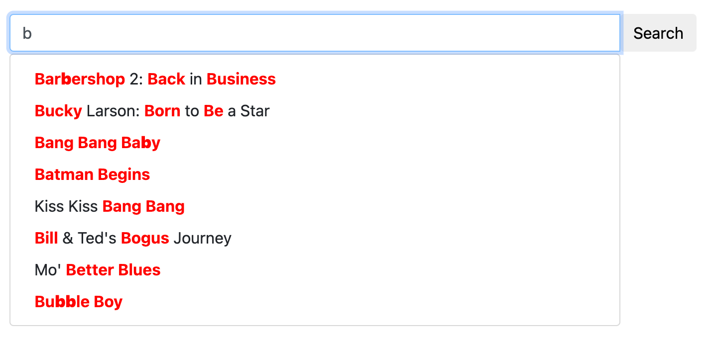

# Autocomplete

Autocomplete, or word completion, predicts and suggests the end of a word or phrase as you type. It's commonly used in:
- Search boxes on websites
- Suggestions in search engines
- Text fields in apps

Manticore offers an advanced autocomplete feature that gives suggestions while you type, similar to those in well-known search engines. This helps speed up searches and lets users find what they need faster.

In addition to basic autocomplete functionality, Manticore includes advanced features to enhance the user experience:

1. **Spell Correction (Fuzziness):** Manticore's autocomplete helps correct spelling mistakes by using algorithms that recognize and fix common errors. This means even if you type something wrong, you can still find what you were looking for.
2. **Keyboard Layout Autodetection:** Manticore can figure out which keyboard layout you are using. This is really useful in places where many languages are used, or if you accidentally type in the wrong language. For example, if you type "ghbdtn" by mistake, Manticore knows you meant to say "привет" (hello in Russian) and suggests the correct word.

Manticore's autocomplete can be tailored to match different needs and settings, making it a flexible tool for many applications.



## CALL AUTOCOMPLETE

> NOTE: `CALL AUTOCOMPLETE` and `/autocomplete` require [Manticore Buddy](../Installation/Manticore_Buddy.md). If it doesn't work, make sure Buddy is installed.

<!-- example call_autocomplete -->
To use autocomplete in Manticore, use the `CALL AUTOCOMPLETE` SQL statement or its JSON equivalent `/autocomplete`. This feature provides word completion suggestions based on your indexed data.

Before you proceed, ensure that the table you intend to use for autocomplete has [infixes](../Creating_a_table/NLP_and_tokenization/Wildcard_searching_settings.md#min_infix_len) enabled.

**Note:** There's an automatic check for `min_infix_len` in the table settings, which uses a 30-second cache to improve the performance of `CALL AUTOCOMPLETE`. After making changes to your table, there may be a brief delay the first time you use `CALL AUTOCOMPLETE` (though this is usually not noticeable). Only successful results are cached, so if you remove the table or disable `min_infix_len`, `CALL AUTOCOMPLETE` may temporarily return incorrect results until it eventually starts showing an error related to `min_infix_len`.

### General syntax

#### SQL
```sql
CALL AUTOCOMPLETE('query_beginning', 'table', [...options]);
```

#### JSON
```json
POST /autocomplete
{
	"table":"table_name",
	"query":"query_beginning"
	[,"options": {<autocomplete options>}]
}
```

#### Options
- `layouts`: A comma-separated string of keyboard layout codes to validate and check for spell correction. Available options: us, ru, ua, se, pt, no, it, gr, uk, fr, es, dk, de, ch, br, bg, be (more details [here](../../Searching/Spell_correction.md#Options)). Default: all enabled
- `fuzziness`: `0`, `1`, or `2` (default: `2`). Maximum Levenshtein distance for finding typos. Set to `0` to disable fuzzy matching
- `prepend`: Boolean (0/1 in SQL). If true(1), adds an asterisk before the last word for prefix expansion (e.g., `*word`)
- `append`: Boolean (0/1 in SQL). If true(1), adds an asterisk after the last word for suffix expansion (e.g., `word*`)
- `expansion_len`: Number of characters to expand in the last word. Default: `10`

<!-- request SQL -->

```sql
mysql> CALL AUTOCOMPLETE('hello', 'comment');
+------------+
| query      |
+------------+
| hello      |
| helio      |
| hell       |
| shell      |
| nushell    |
| powershell |
| well       |
| help       |
+------------+
```

<!-- request SQL with no fuzzy search -->

```sql
mysql> CALL AUTOCOMPLETE('hello', 'comment', 0 as fuzziness);
+-------+
| query |
+-------+
| hello |
+-------+
```

<!-- request JSON -->

```json
POST /autocomplete
{
	"table":"comment",
	"query":"hello"
}
```

<!-- response JSON -->
```json
[
  {
    "total": 8,
    "error": "",
    "warning": "",
    "columns": [
      {
        "query": {
          "type": "string"
        }
      }
    ],
    "data": [
      {
        "query": "hello"
      },
      {
        "query": "helio"
      },
      {
        "query": "hell"
      },
      {
        "query": "shell"
      },
      {
        "query": "nushell"
      },
      {
        "query": "powershell"
      },
      {
        "query": "well"
      },
      {
        "query": "help"
      }
    ]
  }
]
```

<!-- end -->

#### Links
* [This demo](https://github.manticoresearch.com/manticoresoftware/manticoresearch) demonstrates the autocomplete functionality:
  {.scale-0.7}
* Blog post about Fuzzy Search and Autocomplete - https://manticoresearch.com/blog/new-fuzzy-search-and-autocomplete/

## Alternative autocomplete methods

While `CALL AUTOCOMPLETE` is the recommended method for most use cases, Manticore also supports other controllable and customizable approaches to implement autocomplete functionality:

##### Autocomplete a sentence
To autocomplete a sentence, you can use [infixed search](../Creating_a_table/NLP_and_tokenization/Wildcard_searching_settings.md#min_infix_len). You can find the end of a document field by providing its beginning and:
* using the [full-text wildcard operator](../Searching/Full_text_matching/Operators.md) `*` to match any characters
* optionally using `^` to start from the beginning of the field
* optionally using `""` for phrase matching
* and using [result highlighting](../Searching/Highlighting.md)

There is an [article about it in our blog](https://manticoresearch.com/blog/simple-autocomplete-with-manticore/) and an [interactive course](https://play.manticoresearch.com/simpleautocomplete/). A quick example is:
* Let's assume you have a document: `My cat loves my dog. The cat (Felis catus) is a domestic species of small carnivorous mammal.`
* Then you can use `^`, `""`, and `*` so as the user is typing, you make queries like: `^"m*"`, `^"my *"`, `^"my c*"`, `^"my ca*"` and so on
* It will find the document, and if you also do [highlighting](../Searching/Highlighting.md), you will get something like: `<b>My cat</b> loves my dog. The cat ( ...`

##### Autocomplete a word
In some cases, all you need is to autocomplete a single word or a couple of words. In this case, you can use `CALL KEYWORDS`.

### CALL KEYWORDS
`CALL KEYWORDS` is available through the SQL interface and offers a way to examine how keywords are tokenized or to obtain the tokenized forms of specific keywords. If the table enables [infixes](../Creating_a_table/NLP_and_tokenization/Wildcard_searching_settings.md#min_infix_len), it allows you to quickly find possible endings for given keywords, making it suitable for autocomplete functionality.

This is a great alternative to general infixed search, as it provides higher performance since it only needs the table's dictionary, not the documents themselves.

### General syntax
<!-- example keywords -->
```sql
CALL KEYWORDS(text, table [, options])
```
The `CALL KEYWORDS` statement divides text into keywords. It returns the tokenized and normalized forms of the keywords, and if desired, keyword statistics. Additionally, it provides the position of each keyword in the query and all forms of tokenized keywords when the table enables [lemmatizers](../Creating_a_table/NLP_and_tokenization/Morphology.md).

| Parameter | Description |
| - | - |
| text | Text to break down to keywords |
| table | Name of the table from which to take the text processing settings |
| 0/1 as stats | Show statistics of keywords, default is 0 |
| 0/1 as fold_wildcards | Fold wildcards, default is 0 |
| 0/1 as fold_lemmas | Fold morphological lemmas, default is 0 |
| 0/1 as fold_blended | Fold blended words, default is 0 |
| N as expansion_limit | Override [expansion_limit](../Creating_a_table/NLP_and_tokenization/Wildcard_searching_settings.md#expansion_limit) defined in the server configuration, default is 0 (use value from the configuration) |
| docs/hits as sort_mode | Sorts output results by either 'docs' or 'hits'. No sorting is applied by default. |
| jieba_mode | Jieba segmentation mode for the query. See [jieba_mode](Creating_a_table/NLP_and_tokenization/Morphology.md#jieba_mode) for more details |

The examples show how it works if assuming the user is trying to get an autocomplete for "my cat ...". So on the application side all you need to do is to suggest the user the endings from the column "normalized" for each new word. It often makes sense to sort by hits or docs using `'hits' as sort_mode` or `'docs' as sort_mode`.

<!-- intro -->
##### Examples:

<!-- request Examples -->

```sql
MySQL [(none)]> CALL KEYWORDS('m*', 't', 1 as stats);
+------+-----------+------------+------+------+
| qpos | tokenized | normalized | docs | hits |
+------+-----------+------------+------+------+
| 1    | m*        | my         | 1    | 2    |
| 1    | m*        | mammal     | 1    | 1    |
+------+-----------+------------+------+------+

MySQL [(none)]> CALL KEYWORDS('my*', 't', 1 as stats);
+------+-----------+------------+------+------+
| qpos | tokenized | normalized | docs | hits |
+------+-----------+------------+------+------+
| 1    | my*       | my         | 1    | 2    |
+------+-----------+------------+------+------+

MySQL [(none)]> CALL KEYWORDS('c*', 't', 1 as stats, 'hits' as sort_mode);
+------+-----------+-------------+------+------+
| qpos | tokenized | normalized  | docs | hits |
+------+-----------+-------------+------+------+
| 1    | c*        | cat         | 1    | 2    |
| 1    | c*        | carnivorous | 1    | 1    |
| 1    | c*        | catus       | 1    | 1    |
+------+-----------+-------------+------+------+

MySQL [(none)]> CALL KEYWORDS('ca*', 't', 1 as stats, 'hits' as sort_mode);
+------+-----------+-------------+------+------+
| qpos | tokenized | normalized  | docs | hits |
+------+-----------+-------------+------+------+
| 1    | ca*       | cat         | 1    | 2    |
| 1    | ca*       | carnivorous | 1    | 1    |
| 1    | ca*       | catus       | 1    | 1    |
+------+-----------+-------------+------+------+

MySQL [(none)]> CALL KEYWORDS('cat*', 't', 1 as stats, 'hits' as sort_mode);
+------+-----------+------------+------+------+
| qpos | tokenized | normalized | docs | hits |
+------+-----------+------------+------+------+
| 1    | cat*      | cat        | 1    | 2    |
| 1    | cat*      | catus      | 1    | 1    |
+------+-----------+------------+------+------+
```
<!-- end -->
<!-- example bigram -->
There is a nice trick how you can improve the above algorithm - use [bigram_index](../Creating_a_table/NLP_and_tokenization/Low-level_tokenization.md#bigram_index). When you have it enabled for the table what you get in it is not just a single word, but each pair of words standing one after another indexed as a separate token.

This allows to predict not just the current word's ending, but the next word too which is especially beneficial for the purpose of autocomplete.

<!-- intro -->
##### Examples:

<!-- request Examples -->

```sql
MySQL [(none)]> CALL KEYWORDS('m*', 't', 1 as stats, 'hits' as sort_mode);
+------+-----------+------------+------+------+
| qpos | tokenized | normalized | docs | hits |
+------+-----------+------------+------+------+
| 1    | m*        | my         | 1    | 2    |
| 1    | m*        | mammal     | 1    | 1    |
| 1    | m*        | my cat     | 1    | 1    |
| 1    | m*        | my dog     | 1    | 1    |
+------+-----------+------------+------+------+

MySQL [(none)]> CALL KEYWORDS('my*', 't', 1 as stats, 'hits' as sort_mode);
+------+-----------+------------+------+------+
| qpos | tokenized | normalized | docs | hits |
+------+-----------+------------+------+------+
| 1    | my*       | my         | 1    | 2    |
| 1    | my*       | my cat     | 1    | 1    |
| 1    | my*       | my dog     | 1    | 1    |
+------+-----------+------------+------+------+

MySQL [(none)]> CALL KEYWORDS('c*', 't', 1 as stats, 'hits' as sort_mode);
+------+-----------+--------------------+------+------+
| qpos | tokenized | normalized         | docs | hits |
+------+-----------+--------------------+------+------+
| 1    | c*        | cat                | 1    | 2    |
| 1    | c*        | carnivorous        | 1    | 1    |
| 1    | c*        | carnivorous mammal | 1    | 1    |
| 1    | c*        | cat felis          | 1    | 1    |
| 1    | c*        | cat loves          | 1    | 1    |
| 1    | c*        | catus              | 1    | 1    |
| 1    | c*        | catus is           | 1    | 1    |
+------+-----------+--------------------+------+------+

MySQL [(none)]> CALL KEYWORDS('ca*', 't', 1 as stats, 'hits' as sort_mode);
+------+-----------+--------------------+------+------+
| qpos | tokenized | normalized         | docs | hits |
+------+-----------+--------------------+------+------+
| 1    | ca*       | cat                | 1    | 2    |
| 1    | ca*       | carnivorous        | 1    | 1    |
| 1    | ca*       | carnivorous mammal | 1    | 1    |
| 1    | ca*       | cat felis          | 1    | 1    |
| 1    | ca*       | cat loves          | 1    | 1    |
| 1    | ca*       | catus              | 1    | 1    |
| 1    | ca*       | catus is           | 1    | 1    |
+------+-----------+--------------------+------+------+

MySQL [(none)]> CALL KEYWORDS('cat*', 't', 1 as stats, 'hits' as sort_mode);
+------+-----------+------------+------+------+
| qpos | tokenized | normalized | docs | hits |
+------+-----------+------------+------+------+
| 1    | cat*      | cat        | 1    | 2    |
| 1    | cat*      | cat felis  | 1    | 1    |
| 1    | cat*      | cat loves  | 1    | 1    |
| 1    | cat*      | catus      | 1    | 1    |
| 1    | cat*      | catus is   | 1    | 1    |
+------+-----------+------------+------+------+
```
<!-- end -->

`CALL KEYWORDS` supports distributed tables so no matter how big your data set you can benefit from using it.
<!-- proofread -->
