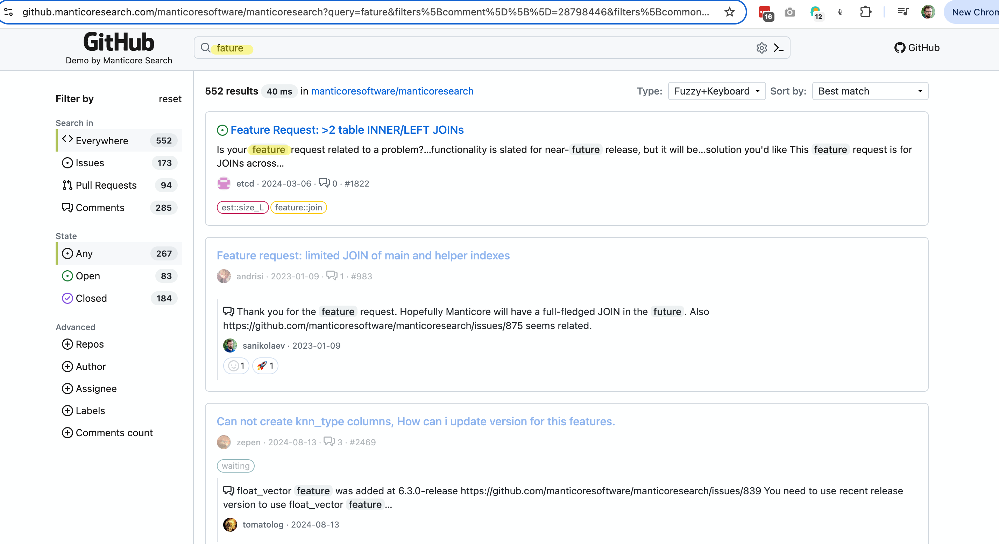

# Spell correction

Spell correction, also known as:

* Auto correction
* Text correction
* Fixing spelling errors
* Typo tolerance
* "Did you mean?"

and so on, is a software functionality that suggests alternatives to or makes automatic corrections of the text you have typed in. The concept of correcting typed text dates back to the 1960s when computer scientist Warren Teitelman, who also invented the "undo" command, introduced a philosophy of computing called D.W.I.M., or "Do What I Mean." Instead of programming computers to accept only perfectly formatted instructions, Teitelman argued that they should be programmed to recognize obvious mistakes.

The first well-known product to provide spell correction functionality was Microsoft Word 6.0, released in 1993.

### How it works

There are a few ways spell correction can be done, but it's important to note that there is no purely programmatic way to convert your mistyped "ipone" into "iphone" with decent quality. Mostly, there has to be a dataset the system is based on. The dataset can be:

* A dictionary of properly spelled words, which in turn can be:
  * Based on your real data. The idea here is that, for the most part, the spelling in the dictionary made up of your data is correct, and the system tries to find a word that is most similar to the typed word (we'll discuss how this can be done with Manticore shortly).
  * Or it can be based on an external dictionary unrelated to your data. The issue that may arise here is that your data and the external dictionary can be too different: some words may be missing in the dictionary, while others may be missing in your data.
* Not just dictionary-based, but also context-aware, e.g., "white ber" would be corrected to "white bear," while "dark ber" would be corrected to "dark beer." The context might not just be a neighboring word in your query, but also your location, time of day, the current sentence's grammar (to change "there" to "their" or not), your search history, and virtually any other factors that can affect your intent.
* Another classic approach is to use previous search queries as the dataset for spell correction. This is even more utilized in [autocomplete](../Searching/Autocomplete.md) functionality but makes sense for autocorrect too. The idea is that users are mostly right with spelling, so we can use words from their search history as a source of truth, even if we don't have the words in our documents or use an external dictionary. Context-awareness is also possible here.

Manticore provides the fuzzy search option and the commands `CALL QSUGGEST` and `CALL SUGGEST` that can be used for automatic spell correction purposes.

# Fuzzy Search

The Fuzzy Search feature allows for more flexible matching by accounting for slight variations or misspellings in the search query. It works similarly to a normal `SELECT` SQL statement or a `/search` JSON request but provides additional parameters to control the fuzzy matching behavior.

> NOTE: The `fuzzy` option requires [Manticore Buddy](../Installation/Manticore_Buddy.md). If it doesn't work, make sure Buddy is installed.

## General syntax

### SQL

<!-- example Fuzzy_Search_SQL -->

```sql
SELECT
  ...
  MATCH('...')
  ...
  OPTION fuzzy={0|1}
  [, distance=N]
  [, layouts='{be,bg,br,ch,de,dk,es,fr,uk,gr,it,no,pt,ru,se,ua,us}']
}
```

Note: When conducting a fuzzy search via SQL, the MATCH clause should not contain any full-text operators except the [phrase search operator](../Searching/Full_text_matching/Operators.md#Phrase-search-operator) and should only include the words you intend to match.

<!-- intro -->
##### SQL:

<!-- request SQL -->

```sql
SELECT * FROM mytable WHERE MATCH('someting') OPTION fuzzy=1, layouts='us,ua', distance=2;
```

<!-- request SQL with additional filters -->
Example of a more complex Fuzzy search query with additional filters:

```sql
SELECT * FROM mytable WHERE MATCH('someting') OPTION fuzzy=1 AND (category='books' AND price < 20);
```

<!-- request JSON -->

```json
POST /search
{
  "table": "test",
  "query": {
    "bool": {
      "must": [
        {
          "match": {
            "*": "ghbdtn"
          }
        }
      ]
    }
  },
  "options": {
    "fuzzy": true,
    "layouts": ["us", "ru"],
    "distance": 2
  }
}
```

<!-- response SQL -->

```sql
+------+-------------+
| id   | content     |
+------+-------------+
|    1 | something   |
|    2 | some thing  |
+------+-------------+
2 rows in set (0.00 sec)
```

<!-- end -->

### JSON

```json
POST /search
{
  "table": "table_name",
  "query": {
    <full-text query>
  },
  "options": {
    "fuzzy": {true|false}
    [,"layouts": ["be","bg","br","ch","de","dk","es","fr","uk","gr","it","no","pt","ru","se","ua","us"]]
    [,"distance": N]
  }
}
```

Note: If you use the [query_string](../../Searching/Full_text_matching/Basic_usage.md#query_string), be aware that it does not support full-text operators except the [phrase search operator](../Searching/Full_text_matching/Operators.md#Phrase-search-operator). The query string should consist solely of the words you wish to match.

### Options

- `fuzzy`: Turn fuzzy search on or off.
- `distance`: Set the Levenshtein distance for matching. The default is `2`.
- `layouts`: Keyboard layouts to check for typing errors. All layouts are used by default. Use an empty string `''` (SQL) or array `[]` (JSON) to turn this off. Supported layouts include:
  - `be` - Belgian AZERTY layout
  - `bg` - Standard Bulgarian layout
  - `br` - Brazilian QWERTY layout
  - `ch` - Swiss QWERTZ layout
  - `de` - German QWERTZ layout
  - `dk` - Danish QWERTY layout
  - `es` - Spanish QWERTY layout
  - `fr` - French AZERTY layout
  - `uk` - British QWERTY layout
  - `gr` - Greek QWERTY layout
  - `it` - Italian QWERTY layout
  - `no` - Norwegian QWERTY layout
  - `pt` - Portuguese QWERTY layout
  - `ru` - Russian JCUKEN layout
  - `se` - Swedish QWERTY layout
  - `ua` - Ukrainian JCUKEN layout
  - `us` - American QWERTY layout


### Links

* <a href="https://github.manticoresearch.com/manticoresoftware/manticoresearch?query=fature&filters%5Bcomment%5D%5B%5D=28798446&filters%5Bcommon%5D%5Brepo_id%5D%5B%5D=95614931&sort=&search=keyword-search-fuzzy-layouts">This demo</a> demonstrates the fuzzy search functionality:
  {.scale-0.7}
* Blog post about Fuzzy Search and Autocomplete - https://manticoresearch.com/blog/new-fuzzy-search-and-autocomplete/

## CALL QSUGGEST, CALL SUGGEST

Both commands are accessible via SQL and support querying both local (plain and real-time) and distributed tables. The syntax is as follows:
```sql
CALL QSUGGEST(<word or words>, <table name> [,options])
CALL SUGGEST(<word or words>, <table name> [,options])

options: N as option_name[, M as another_option, ...]
```

These commands provide all suggestions from the dictionary for a given word. They work only on tables with [infixing](../Creating_a_table/NLP_and_tokenization/Wildcard_searching_settings.md#min_infix_len) enabled and [dict=keywords](../Creating_a_table/NLP_and_tokenization/Low-level_tokenization.md#dict). They return the suggested keywords, Levenshtein distance between the suggested and original keywords, and the document statistics of the suggested keyword.

If the first parameter contains multiple words, then:
* `CALL QSUGGEST` will return suggestions only for the **last** word, ignoring the rest.
* `CALL SUGGEST` will return suggestions only for the **first** word.

That's the only difference between them. Several options are supported for customization:

| Option | Description | Default |
| - | - | - |
| limit | Returns N top matches | 5 |
| max_edits | Keeps only dictionary words with a Levenshtein distance less than or equal to N | 4 |
| result_stats | Provides Levenshtein distance and document count of the found words | 1 (enabled) |
| delta_len | Keeps only dictionary words with a length difference less than N | 3 |
| max_matches | Number of matches to keep | 25 |
| reject | Rejected words are matches that are not better than those already in the match queue. They are put in a rejected queue that gets reset in case one actually can go in the match queue. This parameter defines the size of the rejected queue (as reject*max(max_matched,limit)). If the rejected queue is filled, the engine stops looking for potential matches | 4 |
| result_line | alternate mode to display the data by returning all suggests, distances and docs each per one row | 0 |
| non_char | do not skip dictionary words with non alphabet symbols | 0 (skip such words) |
| sentence | Returns the original sentence along with the last word replaced by the matched one. | 0 (do not return the full sentence) |

To show how it works, let's create a table and add a few documents to it.

```sql
create table products(title text) min_infix_len='2';
insert into products values (0,'Crossbody Bag with Tassel'), (0,'microfiber sheet set'), (0,'Pet Hair Remover Glove');
```
<!-- example single -->
##### Single word example
As you can see, the mistyped word "crossb**U**dy" gets corrected to "crossbody". By default, `CALL SUGGEST/QSUGGEST` return:

* `distance` - the Levenshtein distance which means how many edits they had to make to convert the given word to the suggestion
* `docs` - number of documents containing the suggested word

To disable the display of these statistics, you can use the option `0 as result_stats`.


<!-- intro -->
##### Example:

<!-- request Example -->

```sql
call suggest('crossbudy', 'products');
```
<!-- response Example -->

```sql
+-----------+----------+------+
| suggest   | distance | docs |
+-----------+----------+------+
| crossbody | 1        | 1    |
+-----------+----------+------+
```
<!-- end -->
<!-- example first -->
##### CALL SUGGEST takes only the first word
If the first parameter is not a single word, but multiple, then `CALL SUGGEST` will return suggestions only for the first word.


<!-- intro -->
##### Example:

<!-- request Example -->

```sql
call suggest('bagg with tasel', 'products');
```
<!-- response Example -->

```sql
+---------+----------+------+
| suggest | distance | docs |
+---------+----------+------+
| bag     | 1        | 1    |
+---------+----------+------+
```
<!-- end -->
<!-- example last -->
##### CALL QSUGGEST takes only the last word
If the first parameter is not a single word, but multiple, then `CALL SUGGEST` will return suggestions only for the last word.


<!-- intro -->
##### Example:

<!-- request Example -->

```sql
CALL QSUGGEST('bagg with tasel', 'products');
```
<!-- response Example -->

```sql
+---------+----------+------+
| suggest | distance | docs |
+---------+----------+------+
| tassel  | 1        | 1    |
+---------+----------+------+
```
<!-- end -->

<!-- example last2 -->

Adding `1 as sentence` makes `CALL QSUGGEST` return the entire sentence with the last word corrected.

<!-- request Example -->
```sql
CALL QSUGGEST('bag with tasel', 'products', 1 as sentence);
```
<!-- response Example -->
```sql
+-------------------+----------+------+
| suggest           | distance | docs |
+-------------------+----------+------+
| bag with tassel   | 1        | 1    |
+-------------------+----------+------+
```
<!-- end -->

##### Different display mode
The `1 as result_line` option changes the way the suggestions are displayed in the output. Instead of showing each suggestion in a separate row, it displays all suggestions, distances, and docs in a single row. Here's an example to demonstrate this:

<!-- intro -->
##### Example:

<!-- request Example -->

```sql
CALL QSUGGEST('bagg with tasel', 'products', 1 as result_line);
```
<!-- response Example -->

```sql
+----------+--------+
| name     | value  |
+----------+--------+
| suggests | tassel |
| distance | 1      |
| docs     | 1      |
+----------+--------+
```
<!-- end -->

### Demo

* [This interactive course](https://play.manticoresearch.com/didyoumean/) shows how `CALL SUGGEST` works in a little web app.

{.scale-0.5}


<!-- proofread -->
