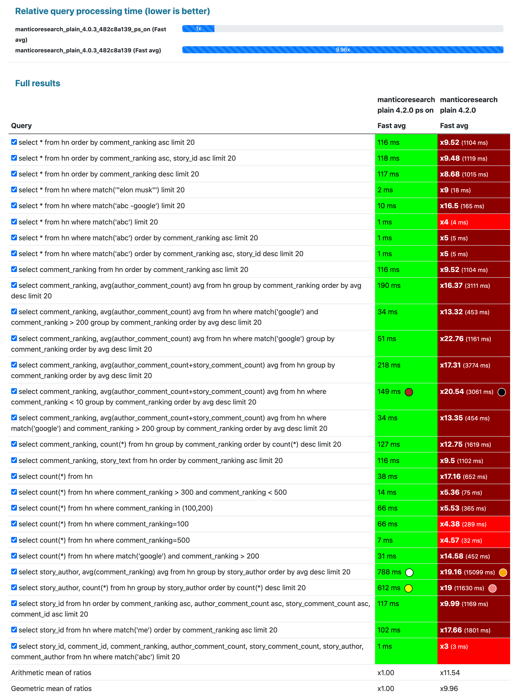

# 更新日志

## 版本 17.5.1
**发布日期**：2026 年 2 月 7 日

### 推荐库
- 推荐的 [MCL](https://github.com/manticoresoftware/columnar) 版本：10.20.0
- 推荐的 [Buddy](Installation/Manticore_Buddy.md#Manticore-Buddy) 版本：3.41.0

如果你遵循 [官方安装指南](https://manticoresearch.com/install/)，则无需担心此问题。

## 突破性变更
* ⚠️ [v17.0.0](https://github.com/manticoresoftware/manticoresearch/releases/tag/17.0.0) [ 问题 #4120](https://github.com/manticoresoftware/manticoresearch/issues/4120) MCL 10.0.0：增加了对 `DROP CACHE` 的支持。这更新了守护进程与 MCL 之间的接口。旧版 Manticore Search 不支持较新的 MCL。
* ⚠️ [v16.0.0](https://github.com/manticoresoftware/manticoresearch/releases/tag/16.0.0) [ 问题 #4019](https://github.com/manticoresoftware/manticoresearch/issues/4019) Percolate 查询的 JSON 响应现在将 hit 的 `_id` 和 `_score` 作为数字而不是字符串返回，与常规搜索一致；这对于依赖这些字段字符串类型的客户端来说是一个破坏性变更。

## 新功能和改进
* 🆕 [v17.5.0](https://github.com/manticoresoftware/manticoresearch/releases/tag/17.5.0) [ PR #130](https://github.com/manticoresoftware/columnar/pull/130) MCL 更新至 10.2.0：修复了 QWEN 模型支持并增加了对其他模型的支持。
* 🆕 [v17.3.0](https://github.com/manticoresoftware/manticoresearch/releases/tag/17.3.0) [ PR #4186](https://github.com/manticoresoftware/manticoresearch/pull/4186) Executor 更新至 1.4.0，包括更新的 PHP 版本和 llm-php-ext 扩展。
* 🆕 [v17.2.0](https://github.com/manticoresoftware/manticoresearch/releases/tag/17.2.0) [ PR #4195](https://github.com/manticoresoftware/manticoresearch/pull/4195) 更新 MCL 至 10.1.0；增加了对 Qwen 本地嵌入模型的支持。
* 🆕 [v17.1.0](https://github.com/manticoresoftware/manticoresearch/releases/tag/17.1.0) [ 问题 #3826](https://github.com/manticoresoftware/manticoresearch/issues/3826) Jieba 形态学实例现在在相同配置（模式、HMM 标志、用户字典路径）的表之间共享，当许多表使用 Jieba 时（例如许多空表不再导致约 20 GB 的内存使用），大大减少了内存使用。
* 🆕 [v17.0.7](https://github.com/manticoresoftware/manticoresearch/releases/tag/17.0.7) [ 问题 #2046](https://github.com/manticoresoftware/manticoresearch/issues/2046) 在 RT 模式下，停用词、词形变化、异常词和无命中词现在可以在 `CREATE TABLE` 中内联设置（分号分隔的值；词形变化/异常词使用 `>` 或 `=>` 表示对，`\` 用于转义），因此可以在不使用外部文件的情况下创建表；`SHOW CREATE TABLE` 返回这些内联值。
* 🆕 [v16.3.0](https://github.com/manticoresoftware/manticoresearch/releases/tag/16.3.0) KNN 搜索现在默认使用 oversampling=3 和 rescore=1，并支持省略 k 以使查询限制作为有效的 k；这减少了不必要的 oversampling，并改进了在列式表上使用 `SELECT *` 时的行为。
* 🆕 [v16.2.0](https://github.com/manticoresoftware/manticoresearch/releases/tag/16.2.0) [ PR #4088](https://github.com/manticoresoftware/manticoresearch/pull/4088) 添加了 searchd 的 `--quiet` (`-q`) 标志以抑制启动输出（横幅和预缓存消息），仅打印错误；在循环或从脚本启动和停止 searchd 时很有用。
* 🆕 [v16.0.1](https://github.com/manticoresoftware/manticoresearch/releases/tag/16.0.1) [ 问题 #3336](https://github.com/manticoresoftware/manticoresearch/issues/3336) 使用 HTTP/1.1 时，HTTP 连接现在默认是持久的：客户端不再需要显式发送 `Keep-Alive` 头，减少了 API 客户端（如 PHP、Go）中的随机连接失败。要关闭连接，客户端发送 `Connection: close`。HTTP/1.0 仍需要 `Connection: keep-alive` 以保持持久连接。

## 错误修复
* 🪲 [v17.5.1](https://github.com/manticoresoftware/manticoresearch/releases/tag/17.5.1) [ 问题 #3498](https://github.com/manticoresoftware/manticoresearch/issues/3498) 修复了当某一列同时是字符串属性和存储字段时，JOIN 查询结果返回空值或重复值的问题；现在可以正确返回属性值。
* 🪲 [v17.4.2](https://github.com/manticoresoftware/manticoresearch/releases/tag/17.4.2) [ 问题 #2559](https://github.com/manticoresoftware/manticoresearch/issues/2559) 修复了对 JSON 字符串属性（例如 `j.s`）进行 JOIN 时没有匹配项的问题；现在与普通字符串属性的 JOIN 一样正常工作。
* 🪲 [v17.4.1](https://github.com/manticoresoftware/manticoresearch/releases/tag/17.4.1) 修复了在设置 cutoff 时存储属性未在最终阶段进行评估的问题。
* 🪲 [v17.2.10](https://github.com/manticoresoftware/manticoresearch/releases/tag/17.2.10) [ 问题 #425](https://github.com/manticoresoftware/manticoresearch-buddy/issues/425) 自动表创建（自动模式）现在也适用于 `REPLACE INTO`，而不仅仅是 `INSERT INTO`，因此当缺少表时会按需创建表。
* 🪲 [v17.2.9](https://github.com/manticoresoftware/manticoresearch/releases/tag/17.2.9) [ 问题 #3226](https://github.com/manticoresoftware/manticoresearch/issues/3226) 修复了在具有多个 GROUP BY 列的列式 MVA 上返回错误的 `GROUP BY` 结果的问题，通过与行式处理相同的方式拒绝此类查询（"MVA 值不能在多个 group-by 中使用"）。
* 🪲 [v17.2.7](https://github.com/manticoresoftware/manticoresearch/releases/tag/17.2.7) [ 问题 #1737](https://github.com/manticoresoftware/manticoresearch/issues/1737) 修复了 `highlight()` 在 `html_strip_mode=strip` 模式下损坏内容的问题，通过解码实体和修改标签；现在高亮输出中保留原始实体形式。
* 🪲 [v17.2.6](https://github.com/manticoresoftware/manticoresearch/releases/tag/17.2.6) [ 问题 #3203](https://github.com/manticoresoftware/manticoresearch/issues/3203) 修复了当表具有多个磁盘块时 `ALTER TABLE REBUILD SECONDARY` 失败并报错 `failed to rename … .tmp.spjidx` 的问题。
* 🪲 [v17.2.5](https://github.com/manticoresoftware/manticoresearch/releases/tag/17.2.5) [ 问题 #3226](https://github.com/manticoresoftware/manticoresearch/issues/3226) 修复了在具有多个 GROUP BY 列的列式 MVA 上返回错误的 GROUP BY 结果的问题，通过与行式处理相同的方式拒绝此类查询（"MVA 值不能在多个 group-by 中使用"）。
* 🪲 [v17.2.4](https://github.com/manticoresoftware/manticoresearch/releases/tag/17.2.4) [ 问题 #4148](https://github.com/manticoresoftware/manticoresearch/issues/4148) 修复了在代理表包含重复文档 ID 时分布式查询返回错误本地索引存储字段的问题；现在存储字段遵循索引顺序，重复时使用第一个匹配的索引。
* 🪲 [v17.2.3](https://github.com/manticoresoftware/manticoresearch/releases/tag/17.2.3) [ 问题 #4176](https://github.com/manticoresoftware/manticoresearch/issues/4176) 修复了表重命名破坏使用外部停用词、词形变化或异常的表的问题：`ATTACH TABLE` 现在将这些文件迁移到新的基于块的格式并更新磁盘块头，因此在 `ALTER TABLE RENAME` 之后，守护进程在重启时不再报告缺失的外部文件。
* 🪲 [v17.2.2](https://github.com/manticoresoftware/manticoresearch/releases/tag/17.2.2) [ 问题 #1065](https://github.com/manticoresoftware/manticoresearch/issues/1065) 添加了 expand_blended 搜索选项，使得查询分词应用表的混合规则并扩展混合变体（例如 "well-being" → "well-being" | "wellbeing" | "well" "being"），允许一个查询匹配以任何这些形式索引的文档。
* 🪲 [v17.1.3](https://github.com/manticoresoftware/manticoresearch/releases/tag/17.1.3) [ 问题 #1618](https://github.com/manticoresoftware/manticoresearch/issues/1618) 将 Buddy 升级到 3.40.7。通过 Manticore Buddy 支持使用 Manticore 与 HikariCP 和 JPA/MyBatis（Spring Boot），它实现了所需的 MySQL 协议行为。
* 🪲 [v17.1.2](https://github.com/manticoresoftware/manticoresearch/releases/tag/17.1.2) [ 问题 #4128](https://github.com/manticoresoftware/manticoresearch/issues/4128) 修复了在不同字段中使用相同短语的 OR 匹配（例如 `(@name ="^New York$") | (@ascii_name ="^New York$")`）返回其他字段匹配项的问题；布尔简化不再在此情况下丢弃字段限制。
* 🪲 [v17.1.1](https://github.com/manticoresoftware/manticoresearch/releases/tag/17.1.1) [ 问题 #4131](https://github.com/manticoresoftware/manticoresearch/issues/4131) 修复了在具有自动嵌入的表上使用表级设置（例如 `html_strip='1'`）的 `ALTER TABLE` 失败的问题（"knn_dims 不能与 model_name 一起使用"）；当设置 model_name 时，序列化现在省略 knn_dims。
* 🪲 [v17.0.12](https://github.com/manticoresoftware/manticoresearch/releases/tag/17.0.12) [ PR #4188](https://github.com/manticoresoftware/manticoresearch/pull/4188) 修复了连接查询中过滤器和过滤器树的错误评估。
* 🪲 [v17.0.11](https://github.com/manticoresoftware/manticoresearch/releases/tag/17.0.11) [ 问题 #3661](https://github.com/manticoresoftware/manticoresearch/issues/3661) 通过修正 docstore 和 blob-pool 对列式 MVA64 数据的处理，修复了在使用列式 MVA64 属性时的间歇性崩溃（例如在合并/优化期间或选择存储/列式属性时）。
* 🪲 [v17.0.10](https://github.com/manticoresoftware/manticoresearch/releases/tag/17.0.10) [ 问题 #3944](https://github.com/manticoresoftware/manticoresearch/issues/3944) `HIGHLIGHT` 和片段生成现在支持在查询字符串中使用 `REGEX`，因此当相同的 `REGEX` 查询在 `MATCH` 和 `HIGHLIGHT` 中使用时，`REGEX` 匹配项会被正确高亮。
* 🪲 [v17.0.8](https://github.com/manticoresoftware/manticoresearch/releases/tag/17.0.8) [ 问题 #4159](https://github.com/manticoresoftware/manticoresearch/issues/4159) 修复了当第一个参数是浮点表达式（例如 `price*100`）时 `HISTOGRAM()` 返回错误值（例如零）的问题；现在直方图对类似浮点的参数使用浮点分桶，因此表达式结果会被正确分组。
* 🪲 [v17.0.5](https://github.com/manticoresoftware/manticoresearch/releases/tag/17.0.5) [ 问题 #4148](https://github.com/manticoresoftware/manticoresearch/issues/4148) 修复了当代理有多个本地索引且包含重复文档 ID 时分布式查询返回错误存储字段的问题；现在存储字段根据索引顺序从匹配的索引中获取（首次遇到的索引优先），并已记录该行为。
* 🪲 [v17.0.3](https://github.com/manticoresoftware/manticoresearch/releases/tag/17.0.3) [ 问题 #4115](https://github.com/manticoresoftware/manticoresearch/issues/4115) `HIGHLIGHT()` 和片段生成现在支持在引号表达式中使用显式的 OR 运算符（`|`），使用与搜索相同的查询转换。
* 🪲 [v17.0.1](https://github.com/manticoresoftware/manticoresearch/releases/tag/17.0.1) [ 问题 #4118](https://github.com/manticoresoftware/manticoresearch/issues/4118) 在普通模式下，具有 model_name（自动嵌入）的 KNN 属性不再需要显式的 dims 属性；表使用模型的维度进行服务。
* 🪲 [v16.3.4](https://github.com/manticoresoftware/manticoresearch/releases/tag/16.3.4) [ PR #4121](https://github.com/manticoresoftware/manticoresearch/pull/4121) 改进了使用存储列式属性的查询性能（提前退出和缓存属性依赖检查，减少 docstore 读取器开销），并添加了 `DROP CACHE` 以清除查询、docstore、跳过和二级索引缓存。
* 🪲 [v16.3.3](https://github.com/manticoresoftware/manticoresearch/releases/tag/16.3.3) [ 问题 #3928](https://github.com/manticoresoftware/manticoresearch/issues/3928) 修复了当 `ORDER BY` 包含字符串列时的滚动分页问题：现在滚动标记正确应用并返回下一页而不是重复第一页。
* 🪲 [v16.3.2](https://github.com/manticoresoftware/manticoresearch/releases/tag/16.3.2) [ 问题 #4040](https://github.com/manticoresoftware/manticoresearch/issues/4040) 修复了在某些环境（例如 AlmaLinux 10、Docker/VM）启动时堆栈测量失败导致的段错误；现在堆栈模拟比较帧增量与剩余堆栈大小而不是使用可能导致溢出或错误的总和，因此测量不再进入无效状态，searchd 在 "Something wrong measuring stack" 警告后不再崩溃。
* 🪲 [v16.3.1](https://github.com/manticoresoftware/manticoresearch/releases/tag/16.3.1) [ 问题 #4062](https://github.com/manticoresoftware/manticoresearch/issues/4062) JOIN 查询现在在 `WHERE` 子句过滤器中使用左表属性前缀时一致地报告错误；之前在某些情况下（例如右表没有全文字段）查询会无错误运行并返回空结果集。
* 🪲 [v16.2.6](https://github.com/manticoresoftware/manticoresearch/releases/tag/16.2.6) [ 问题 #1827](https://github.com/manticoresoftware/manticoresearch/issues/1827) 现在在 `CREATE TABLE` 和表达式中接受反引号引用的保留关键字（例如 order、year、facet）作为属性和列名，因此表和查询可以在使用反引号转义时使用保留字作为标识符。
* 🪲 [v16.2.5](https://github.com/manticoresoftware/manticoresearch/releases/tag/16.2.5) [ 问题 #4107](https://github.com/manticoresoftware/manticoresearch/issues/4107) 修复了 SphinxQL 解析器，使以反引号列名结尾的表达式正确解析而不是引发语法错误。
* 🪲 [v16.2.4](https://github.com/manticoresoftware/manticoresearch/releases/tag/16.2.4) [ 问题 #4106](https://github.com/manticoresoftware/manticoresearch/issues/4106) `SHOW CREATE TABLE` 现在以反引号输出保留或特殊（例如 knn）的列名，因此当源表有此类列时，`CREATE TABLE ... LIKE` 和重新执行显示的 DDL 会正常工作。
* 🪲 [v16.2.3](https://github.com/manticoresoftware/manticoresearch/releases/tag/16.2.3) [ 问题 #3661](https://github.com/manticoresoftware/manticoresearch/issues/3661) 修正了 `ALTER` 期间 docstore 存储属性计数，使不存在的 `.spds` 重命名不再发生，并在添加列式属性时保留 blob 池中的现有 blob 数据，因此 "Blob offset out of bounds" 和查询/合并崩溃不再发生。
* 🪲 [v16.2.1](https://github.com/manticoresoftware/manticoresearch/releases/tag/16.2.1) [ PR #4083](https://github.com/manticoresoftware/manticoresearch/pull/4083) 修复了 CJK、日语和韩语字符集表中与变音符号相关的错误映射，使基本和发声/变音字符形式在索引和搜索时正确归一化。
* 🪲 [v16.1.4](https://github.com/manticoresoftware/manticoresearch/releases/tag/16.1.4) [ PR #4084](https://github.com/manticoresoftware/manticoresearch/pull/4084) 修复了在 joiner 节点上没有需要发送的文件时复制接收状态的内存泄漏；添加了一个集群 API 命令来清理 joiners 上的接收状态，以便在 donor 发现所有节点已同步时释放。
* 🪲 [v16.1.3](https://github.com/manticoresoftware/manticoresearch/releases/tag/16.1.3) [ 问题 #615](https://github.com/manticoresoftware/manticoresearch-buddy/issues/615) 将 Buddy 升级到 3.40.5。修复了 KNN 插件中当结果行包含 bigint 字段时的无效 JSON 错误：字符串值未加引号（例如像 `0000000000` 这样的数字外观字符串），生成无效 JSON；现在字符串属性始终以带引号的 JSON 字符串进行序列化。
* 🪲 [v16.1.2](https://github.com/manticoresoftware/manticoresearch/releases/tag/16.1.2) [ PR #4077](https://github.com/manticoresoftware/manticoresearch/pull/4077) 修复了大型双精度值的 JSON 字段输出和解析：当值超过默认缓冲区时，结果集打印现在使用回退格式，整数字面量溢出 int64 时解析为双精度而不是错误的整数。
* 🪲 [v16.1.1](https://github.com/manticoresoftware/manticoresearch/releases/tag/16.1.1) [ 问题 #2628](https://github.com/manticoresoftware/manticoresearch/issues/2628) 改进了 KNN 索引错误恢复：当 RT 索引无法加载 KNN 索引时，现在会清理部分加载的 HNSW 数据，因此删除磁盘块时守护进程不再崩溃。
* 🪲 [v16.0.13](https://github.com/manticoresoftware/manticoresearch/releases/tag/16.0.13) [ PR #4076](https://github.com/manticoresoftware/manticoresearch/pull/4076) 添加了 `searchd.attr_autoconv_strict` 选项（默认 0），用于控制在 RT 表中插入/替换时的字符串到数字转换：启用时，无效值（空字符串、非数字、尾随字符、溢出）会返回错误而不是静默转换为 0。
* 🪲 [v16.0.12](https://github.com/manticoresoftware/manticoresearch/releases/tag/16.0.12) [ 问题 #1751](https://github.com/manticoresoftware/manticoresearch/issues/1751) 修复了 JSON 搜索中的 `must_not`，使其表现为逻辑 NOT（返回不匹配内部查询的所有文档）；还修复了 SphinxQL 的 `WHERE NOT ...` 用于过滤表达式。
* 🪲 [v16.0.11](https://github.com/manticoresoftware/manticoresearch/releases/tag/16.0.11) [ PR #2990](https://github.com/manticoresoftware/manticoresearch/issues/2990) 更新了 Libstemmer 到包含修复希腊语词干提取器（`libstemmer_el`）错误 [#204](https://github.com/snowballstem/snowball/issues/204) 的版本，防止使用 `morphology='libstemmer_el'` 时某些希腊文本导致的服务器崩溃（参见问题 [#2888](https://github.com/manticoresoftware/manticoresearch/issues/2888)）。
* 🪲 [v16.0.10](https://github.com/manticoresoftware/manticoresearch/releases/tag/16.0.10) 存储属性评估在可能时移至 postlimit 阶段，提高性能。
* 🪲 [v16.0.9](https://github.com/manticoresoftware/manticoresearch/releases/tag/16.0.9) [ 问题 #3905](https://github.com/manticoresoftware/manticoresearch/issues/3905) 修复了当索引旋转与主节点上的 SIGHUP（例如配置重新加载）同时发生时的间歇性崩溃：使用动态配置时，fork() 会复制套接字，epoll 后续可能会报告一个其关联数据已释放的 fd。现在在关闭前使用 EPOLL_CTL_DEL 从 epoll 兴趣列表中移除套接字，防止 `LazyNetEvents_c::EventTick()` 中的使用后释放。
* 🪲 [v16.0.8](https://github.com/manticoresoftware/manticoresearch/releases/tag/16.0.8) [ 问题 #3418](https://github.com/manticoresoftware/manticoresearch/issues/3418) 将 Buddy 要求升级到 3.40.4，其中包括改进的处理错误日志格式：当查询失败（例如“未知本地表(s) 'index'”）时，Buddy 现在记录守护进程的失败原因，而不仅仅是“Failed to handle query”且没有上下文。
* 🪲 [v16.0.7](https://github.com/manticoresoftware/manticoresearch/releases/tag/16.0.7) [ 问题 #2281](https://github.com/manticoresoftware/manticoresearch/issues/2281) 解决了 percolate 表中多值属性的不一致类型名称问题：mva 和 mva64 现在被接受为 multi 和 multi64 的同义词，因此在定义表时可以使用任一命名（例如 `CREATE TABLE t (id bigint, tags mva64, ...) type='pq'`）。模式输出（例如 `DESC table`）继续使用现有类型名称以保持兼容性。
* 🪲 [v16.0.4](https://github.com/manticoresoftware/manticoresearch/releases/tag/16.0.4) [ PR #4047](https://github.com/manticoresoftware/manticoresearch/pull/4047) 将 MCL 版本更新到 9.0.1。修复了当 block_size 为 1 时 KNN 浮点向量处理的问题，通过在此情况下禁用表压缩（block size 为 1 时不使用压缩）。
* 🪲 [v16.0.3](https://github.com/manticoresoftware/manticoresearch/releases/tag/16.0.3) [ 问题 #4042](https://github.com/manticoresoftware/manticoresearch/issues/4042) 修复了 rejoined 节点在 joiner 重启并重新加入后运行 `ALTER CLUSTER ... ADD TABLE` 的另一个节点时的崩溃问题。
* 🪲 [v15.1.5](https://github.com/manticoresoftware/manticoresearch/releases/tag/15.1.5) [ 问题 #4009](https://github.com/manticoresoftware/manticoresearch/issues/4009) 修复了当通过提示强制使用二级索引时查询缓存仍被使用的问题；现在缓存被禁用，强制 SI 始终被尊重。
* 🪲 [v15.1.4](https://github.com/manticoresoftware/manticoresearch/releases/tag/15.1.4) [ 问题 #2591](https://github.com/manticoresoftware/manticoresearch/issues/2591) 修复了 `NOTNEAR` 全文操作符，使其在右项在指定距离内出现在左项之前或之后时正确排除匹配项（对称/反向匹配）。之前 NOTNEAR 仅考虑右项在左项之后出现的情况，例如 `d NOTNEAR/3 a` 可能错误匹配包含 "a b c d" 的文档。NEAR 现在在距离为 0 时也返回错误。
* 🪲 [v15.1.3](https://github.com/manticoresoftware/manticoresearch/releases/tag/15.1.3) [ 问题 #507](https://github.com/manticoresoftware/manticoresearch-buddy/issues/507) 将 Buddy 升级到 3.40.3。修复了使用模糊搜索（`OPTION fuzzy=1`）的多查询请求后在 `/cli` 和 `/sql?mode=raw` 上执行 show meta 的问题。
* 🪲 [v15.1.1](https://github.com/manticoresoftware/manticoresearch/releases/tag/15.1.1) [ 问题 #4009](https://github.com/manticoresoftware/manticoresearch/issues/4009) 通过使 SI 和查询缓存在每个查询中互斥并添加警告来修复使用 SecondaryIndex 提示和查询缓存时的错误结果，当强制 SI 因缓存命中被忽略时。

## 版本 15.1.0
**发布日期**：2025 年 12 月 7 日

### 推荐库
- 推荐 [MCL](https://github.com/manticoresoftware/columnar) 版本：9.0.0
- 推荐 [Buddy](Installation/Manticore_Buddy.md#Manticore-Buddy) 版本：3.40.2

如果您遵循[官方安装指南](https://manticoresearch.com/install/)，则无需担心此问题。

## 突破性变更
* ⚠️ [v15.0.0](https://github.com/manticoresoftware/manticoresearch/releases/tag/15.0.0) [ PR #4003](https://github.com/manticoresoftware/manticoresearch/pull/4003) 将 MCL 要求更新至 9.0.0，引入了非压缩浮点向量存储、KNN 向量的块大小更改以及非缓冲读取。此更新更改了数据格式。旧版 MCL 将无法读取此格式，但新版仍能无问题地读取您现有的列式表。

### 新功能与改进
* 🆕 [v15.1.0](https://github.com/manticoresoftware/manticoresearch/releases/tag/15.1.0) [ PR #3990](https://github.com/manticoresoftware/manticoresearch/pull/3990) 通过将总时间拆分为更清晰的部分，改进了磁盘块刷新日志记录。
* 🆕 [v14.7.0](https://github.com/manticoresoftware/manticoresearch/releases/tag/14.7.0) [ Issue #3860](https://github.com/manticoresoftware/manticoresearch/issues/3860) 将 Buddy 要求更新至 3.40.1，其中改进了自动补全功能：将大写分隔符字符标准化为空格，并过滤掉重复或格式错误的建议组合以提高建议质量。还包含修复 Kafka 视图中的无效 JSON 错误以及修复自动补全功能，使得当 score map 中缺少某些键时，排序组合不再抛出错误。
* 🆕 [v14.6.0](https://github.com/manticoresoftware/manticoresearch/releases/tag/14.6.0) [ Issue #615](https://github.com/manticoresoftware/manticoresearch-buddy/issues/615) 将 Manticore Buddy 要求更新至 3.39.1，其中包含修复 KNN 插件中的无效 JSON 错误，并允许 Buddy 处理器覆盖 HTTP `Content-Type`，因此 `/metrics` 现在返回 Prometheus 文本格式 (`text/plain; version=0.0.4`) 而非 JSON，修复了抓取失败的问题。
* 🆕 [v14.4.0](https://github.com/manticoresoftware/manticoresearch/releases/tag/14.4.0) [ PR #3942](https://github.com/manticoresoftware/manticoresearch/pull/3942) 将 Manticore Buddy 要求更新至 3.38.0，过滤掉零文档建议，改进 Ds\Map 中的字符串键处理，将 Buddy 中的内存使用报告格式从 KB 改为字节以提高精度，并增强性能、稳定性和可维护性。
* 🆕 [v14.5.0](https://github.com/manticoresoftware/manticoresearch/releases/tag/14.5.0) [ Issue #3329](https://github.com/manticoresoftware/manticoresearch/issues/3329) 在记录查询请求时修剪 JSON 负载中的多余空格和换行符——跳过首尾空格以避免记录格式错误的 JSON。
* 🆕 [v14.3.0](https://github.com/manticoresoftware/manticoresearch/releases/tag/14.3.0) [ PR #3932](https://github.com/manticoresoftware/manticoresearch/pull/3932) 改进了 `LOCK TABLES` / `UNLOCK TABLES` 的处理：写锁现在返回警告而非错误，读锁在 `SHOW LOCKS` 中正确显示，整体锁逻辑行为保持一致。
* 🆕 [v14.2.0](https://github.com/manticoresoftware/manticoresearch/releases/tag/14.2.0) [ Issue #3891](https://github.com/manticoresoftware/manticoresearch/issues/3891) 在 `JOIN ON` 子句中添加了任意过滤表达式的支持（不仅限于等值比较），启用类似 `... ON t1.id = t2.t1_id AND t2.value = 5` 的查询。

## Bug Fixes
* 🪲 [v15.0.6](https://github.com/manticoresoftware/manticoresearch/releases/tag/15.0.6) [ Issue #3601](https://github.com/manticoresoftware/manticoresearch/issues/3601) 固定了一个回归问题，当使用自定义配置路径安装时，原生Windows服务无法启动。
* 🪲 [v15.0.5](https://github.com/manticoresoftware/manticoresearch/releases/tag/15.0.5) [ Issue #3864](https://github.com/manticoresoftware/manticoresearch/issues/3864) 修复了SQL源中处理“连接字段”的方式，确保在迭代连接结果时正确设置了结束标记。
* 🪲 [v15.0.4](https://github.com/manticoresoftware/manticoresearch/releases/tag/15.0.4) [ Issue #4004](https://github.com/manticoresoftware/manticoresearch/issues/4004) 修复了一个回归问题，该问题导致守护进程的HTTP `/sql` 响应错误地使用了 `Content-Type: text/html` 头而不是 `application/json`。
* 🪲 [v15.0.3](https://github.com/manticoresoftware/manticoresearch/releases/tag/15.0.3) [ Issue #2727](https://github.com/manticoresoftware/manticoresearch/issues/2727) 修复了通过 `GROUP BY` / `FACET` 对属性进行分组时失败的问题，这些属性是通过JSON到属性映射生成的。
* 🪲 [v15.0.2](https://github.com/manticoresoftware/manticoresearch/releases/tag/15.0.2) [ Issue #3962](https://github.com/manticoresoftware/manticoresearch/issues/3962) 将Buddy要求更新为3.40.2，这增加了对 `/sql` 端点的支持模糊搜索，并包括其他模糊搜索修复。
* 🪲 [v15.0.1](https://github.com/manticoresoftware/manticoresearch/releases/tag/15.0.1) [ PR #3922](https://github.com/manticoresoftware/manticoresearch/pull/3922) 更新了支持Logstash 9.2的相关文档和测试。
* 🪲 [v14.7.6](https://github.com/manticoresoftware/manticoresearch/releases/tag/14.7.6) [ PR #4002](https://github.com/manticoresoftware/manticoresearch/pull/4002) 修复了KNN过采样行为：不再在不需要重新评分时计算重新评分的KNN距离，并将浮点向量访问提示传递给列存储层。
* 🪲 [v14.7.5](https://github.com/manticoresoftware/manticoresearch/releases/tag/14.7.5) [ PR #3999](https://github.com/manticoresoftware/manticoresearch/pull/3999) 修复了“test_298”模型以解决一个失败的KNN相关测试。
* 🪲 [v14.7.4](https://github.com/manticoresoftware/manticoresearch/releases/tag/14.7.4) [ Issue #3977](https://github.com/manticoresoftware/manticoresearch/issues/3977) 在Windows上有时会产生.mdmp崩溃转储——修复了“ubertests”不再在完成后留下最小转储。
* 🪲 [v14.7.3](https://github.com/manticoresoftware/manticoresearch/releases/tag/14.7.3) [ Issue #3832](https://github.com/manticoresoftware/manticoresearch/issues/3832) 修复了一个bug，即通过`/cli_json`进行的多查询请求包含分号（例如，组合SQL语句）时失败——分号现在在处理前不会被替换为空字符。
* 🪲 [v14.7.2](https://github.com/manticoresoftware/manticoresearch/releases/tag/14.7.2) [ Issue #1613](https://github.com/manticoresoftware/manticoresearch/issues/1613) 描述了用于计数短语/接近/NEAR操作符的排名因素内部32位掩码及其如何可能低估第31个关键字之后的术语。
* 🪲 [v14.7.1](https://github.com/manticoresoftware/manticoresearch/releases/tag/14.7.1) [ PR #3992](https://github.com/manticoresoftware/manticoresearch/pull/3992) 修复了分布式表通过代理处理的HTTP UPDATE和DELETE请求缺少错误消息的问题，因此客户端现在在操作失败时会收到正确的错误。
* 🪲 [v14.6.4](https://github.com/manticoresoftware/manticoresearch/releases/tag/14.6.4) [ Issue #3478](https://github.com/manticoresoftware/manticoresearch/issues/3478) 提升了更新验证，检查更新的属性是否与全文字段冲突；更新现在拒绝修改如果它们针对全文字段。
* 🪲 [v14.6.3](https://github.com/manticoresoftware/manticoresearch/releases/tag/14.6.3) [ Issue #2352](https://github.com/manticoresoftware/manticoresearch/issues/2352) 修复了使用带有`persistent_connections_limit`的分布式表时的内部错误。
* 🪲 [v14.6.2](https://github.com/manticoresoftware/manticoresearch/releases/tag/14.6.2) [ Issue #3757](https://github.com/manticoresoftware/manticoresearch/issues/3757) 修复了一个bug，其中表状态计数器错误地标记为以 "_sec" 结尾（例如 `query_time_1min`），实际上报告的是毫秒而不是秒。
* 🪲 [v14.6.1](https://github.com/manticoresoftware/manticoresearch/releases/tag/14.6.1) [ Issue #3979](https://github.com/manticoresoftware/manticoresearch/issues/3979) 修复了一个bug，其中 `SHOW INDEX <name> STATUS` 搜索时间统计（search_stats_ms_*）与从查询日志计算出的值不匹配；现在报告的时间反映了实际的日志查询时间。
* 🪲 [v14.5.8](https://github.com/manticoresoftware/manticoresearch/releases/tag/14.5.8) [ Issue #3517](https://github.com/manticoresoftware/manticoresearch/issues/3517) 更新了HTTP头处理方式，使得Buddy集成可以定义或覆盖头，而不仅仅是总是强制使用 `application/json`。
* 🪲 [v14.5.7](https://github.com/manticoresoftware/manticoresearch/releases/tag/14.5.7) 修复了测试226以确保稳定的返回结果顺序，并修正了JSON混合数组处理的GTest模型。
* 🪲 [v14.5.6](https://github.com/manticoresoftware/manticoresearch/releases/tag/14.5.6) 通过纠正 `binlog.cpp` 中的类型不匹配修复了Windows构建问题，确保 `DoSaveMeta()` 现在可以正确编译在Windows平台上。
* 🪲 [v14.5.5](https://github.com/manticoresoftware/manticoresearch/releases/tag/14.5.5) [Issue #805](https://github.com/manticoresoftware/manticoresearch/issues/805) [Issue #807](https://github.com/manticoresoftware/manticoresearch/issues/807) [Issue #3924](https://github.com/manticoresoftware/manticoresearch/issues/3924) 修复了JSON属性分面的一致性行为：在FACET子句中别名JSON数组的行为现在与直接分面数组的行为相同。
* 🪲 [v14.5.4](https://github.com/manticoresoftware/manticoresearch/releases/tag/14.5.4) [ Issue #3927](https://github.com/manticoresoftware/manticoresearch/issues/3927) 通过跳过空HNSW索引上的搜索修复了KNN向量搜索中的崩溃。
* 🪲 [v14.5.2](https://github.com/manticoresoftware/manticoresearch/releases/tag/14.5.2) [ Issue #3669](https://github.com/manticoresoftware/manticoresearch/issues/3669) 通过纠正 `MATCH()` 解析中的错误修复了空组（如 `()`）触发错误的问题（例如，查询 `camera()` 现在可以正确工作）。
* 🪲 [v14.5.1](https://github.com/manticoresoftware/manticoresearch/releases/tag/14.5.1) [ PR #3961](https://github.com/manticoresoftware/manticoresearch/pull/3961) 更新了mysqldump复制模式下的备份文档：解释了在导出复制表时使用 `--skip-lock-tables`，并修复了几处损坏的手动链接。
* 🪲 [v14.3.2](https://github.com/manticoresoftware/manticoresearch/releases/tag/14.3.2) [ Issue #2772](https://github.com/manticoresoftware/manticoresearch/issues/2772) 修复了一个bug，即某些通过MySQL客户端9执行的命令导致查询日志中的“意外$undefined近$”错误。
* 🪲 [v14.3.1](https://github.com/manticoresoftware/manticoresearch/releases/tag/14.3.1) [ PR #3934](https://github.com/manticoresoftware/manticoresearch/pull/3934) 将Manticore Buddy要求更新为3.37.2，移除了冗余的 `LOCK/UNLOCK TABLES` 检查（现在由守护进程处理），并修复了自动补全解析，使其能够正确处理带有转义引号（例如 `\"` 或 `\'`）的查询。
* 🪲 [v14.2.1](https://github.com/manticoresoftware/manticoresearch/releases/tag/14.2.1) [ Issue #3602](https://github.com/manticoresoftware/manticoresearch/issues/3602) 修复了在使用 `knn_dist()` 的自定义排名表达式与KNN+MATCH查询时出现的崩溃问题；此类查询现在返回清晰的错误而不是崩溃。
* 🪲 [v14.1.1](https://github.com/manticoresoftware/manticoresearch/releases/tag/14.1.1) docs: 修复了一些次要的翻译问题。

## 版本 14.1.0

**发布日期**：2025年11月7日

❤️ 我们衷心感谢[@ricardopintottrdata](https://github.com/ricardopintottrdata)在[PR #3792](https://github.com/manticoresoftware/manticoresearch/pull/3792)和[PR #3828](https://github.com/manticoresoftware/manticoresearch/pull/3828)中的工作——解决了与`HAVING`总计数和`filter with empty name`错误相关的问题——以及[@jdelStrother](https://github.com/jdelStrother)在[PR #3819](https://github.com/manticoresoftware/manticoresearch/pull/3819)中的贡献，该贡献改进了在未提供Jieba支持时对`ParseCJKSegmentation`的处理。

您的努力使项目更加强大——非常感谢！

### 推荐库
- 推荐的[MCL](https://github.com/manticoresoftware/columnar)版本：8.1.0
- 推荐的[Buddy](Installation/Manticore_Buddy.md#Manticore-Buddy)版本：3.37.0

如果您遵循[官方安装指南](https://manticoresearch.com/install/)，则无需担心此问题。

### ⚠️ 重要
版本[v14.0.0](https://github.com/manticoresoftware/manticoresearch/releases/tag/14.0.0)更新了复制协议。如果您正在运行复制集群，则需要：
  - 首先，干净地停止所有节点
  - 然后，使用工具`manticore_new_cluster`在Linux中以`--new-cluster`参数启动最后停止的节点。
  - 有关[重启集群](Creating_a_cluster/Setting_up_replication/Restarting_a_cluster.md#Restarting-a-cluster)的更多详细信息，请参阅相关文档。

### 新功能和改进
* 🆕 [v14.1.0](https://github.com/manticoresoftware/manticoresearch/releases/tag/14.1.0) [ Issue #3047](https://github.com/manticoresoftware/manticoresearch/issues/3047) 添加了对由mysqldump生成的`LOCK TABLES`语句的支持，提高了逻辑备份的安全性。
* ⚠️ [v14.0.0](https://github.com/manticoresoftware/manticoresearch/releases/tag/14.0.0) [ PR #3896](https://github.com/manticoresoftware/manticoresearch/pull/3896) 在复制SST的SHOW STATUS中为供体和加入节点添加了[进度计数器](../Creating_a_cluster/Setting_up_replication/Replication_cluster_status.md#SST-Progress-Metrics)。
* 🆕 [v13.16.0](https://github.com/manticoresoftware/manticoresearch/releases/tag/13.16.0) [ PR #3894](https://github.com/manticoresoftware/manticoresearch/pull/3894) 将buddy从3.36.1更新到3.37.0，新增了"quorum"选项。
* 🆕 [v13.15.0](https://github.com/manticoresoftware/manticoresearch/releases/tag/13.15.0) [ PR #3842](https://github.com/manticoresoftware/manticoresearch/pull/3842) [force_bigrams](../Searching/Spell_correction.md#Using-force_bigrams-for-better-transposition-handling)选项用于模糊和自动补全插件。

### 错误修复
* 🪲 [问题 #3994](https://github.com/manticoresoftware/manticoresearch/issues/3994) 为Grafana版本12.3添加了测试。
* 🪲 [v14.0.1](https://github.com/manticoresoftware/manticoresearch/releases/tag/14.0.1) [问题 #3844](https://github.com/manticoresoftware/manticoresearch/issues/3844) 修复了使用`max(ft field)`导致的崩溃问题。
* 🪲 [v13.15.13](https://github.com/manticoresoftware/manticoresearch/releases/tag/13.15.13) [PR #3828](https://github.com/manticoresoftware/manticoresearch/pull/3828) 修复了使用空过滤器名称时的错误。
* 🪲 [v13.15.12](https://github.com/manticoresoftware/manticoresearch/releases/tag/13.15.12) [PR #3873](https://github.com/manticoresoftware/manticoresearch/pull/3873) 将buddy从3.36.0升级到3.36.1，并在EmulateElastic插件中添加了RT模式检查。
* 🪲 [v13.15.11](https://github.com/manticoresoftware/manticoresearch/releases/tag/13.15.11) [PR #3857](https://github.com/manticoresoftware/manticoresearch/pull/3857) 为Filebeat版本9.2添加了测试。
* 🪲 [v13.15.10](https://github.com/manticoresoftware/manticoresearch/releases/tag/13.15.10) [PR #3880](https://github.com/manticoresoftware/manticoresearch/pull/3880) 在修复后测试了自动文档翻译功能。
* 🪲 [v13.15.9](https://github.com/manticoresoftware/manticoresearch/releases/tag/13.15.9) [问题 #3783](https://github.com/manticoresoftware/manticoresearch/issues/3783) 修复了阻止在FreeBSD上原生编译的问题。
* 🪲 [v13.15.8](https://github.com/manticoresoftware/manticoresearch/releases/tag/13.15.8) 修复了文档翻译。
* 🪲 [v13.15.7](https://github.com/manticoresoftware/manticoresearch/releases/tag/13.15.7) [PR #3868](https://github.com/manticoresoftware/manticoresearch/pull/3868) 将executor从1.3.5升级到1.3.6，并添加了对iconv扩展的支持。
* 🪲 [v13.15.6](https://github.com/manticoresoftware/manticoresearch/releases/tag/13.15.6) 修复了与[问题3817](https://github.com/manticoresoftware/manticoresearch/issues/3817)相关的模糊测试构建问题。
* 🪲 [v13.15.5](https://github.com/manticoresoftware/manticoresearch/releases/tag/13.15.5) [问题 #3644](https://github.com/manticoresoftware/manticoresearch/issues/3644) 修复了由特定全文查询导致的崩溃。
* 🪲 [v13.15.4](https://github.com/manticoresoftware/manticoresearch/releases/tag/13.15.4) [问题 #3686](https://github.com/manticoresoftware/manticoresearch/issues/3686) 修复了全文查询`"(abc|def)"`未按预期工作的问题。
* 🪲 [v13.15.3](https://github.com/manticoresoftware/manticoresearch/releases/tag/13.15.3) [问题 #3428](https://github.com/manticoresoftware/manticoresearch/issues/3428) 添加了使用`HAVING`的查询获取结果总数的功能。
* 🪲 [v13.15.2](https://github.com/manticoresoftware/manticoresearch/releases/tag/13.15.2) [问题 #3817](https://github.com/manticoresoftware/manticoresearch/issues/3817) 添加了选项[searchd.expansion_phrase_warning](../Server_settings/Searchd.md#expansion_phrase_warning)。
* 🪲 [v13.15.1](https://github.com/manticoresoftware/manticoresearch/releases/tag/13.15.1) [PR #3848](https://github.com/manticoresoftware/manticoresearch/pull/3848) 修复了复制事务键生成和处理冲突事务的问题。
* 🪲 [v13.14.0](https://github.com/manticoresoftware/manticoresearch/releases/tag/13.14.0) [问题 #3806](https://github.com/manticoresoftware/manticoresearch/issues/3806) 修复了`CALL SUGGEST`不匹配三元组的问题。
* 🪲 [v13.13.8](https://github.com/manticoresoftware/manticoresearch/releases/tag/13.13.8) [PR #3839](https://github.com/manticoresoftware/manticoresearch/pull/3839) 将buddy从3.35.4升级到3.35.5以更正SQL查询中匹配连接的正则表达式。
* 🪲 [v13.13.7](https://github.com/manticoresoftware/manticoresearch/releases/tag/13.13.7) [问题 #3815](https://github.com/manticoresoftware/manticoresearch/issues/3815) 将buddy从3.35.3升级到3.35.4以修复REPLACE中负ID的问题。
* 🪲 [v13.13.6](https://github.com/manticoresoftware/manticoresearch/releases/tag/13.13.6) [PR #3830](https://github.com/manticoresoftware/manticoresearch/pull/3830) 将buddy从3.35.1升级到3.35.3。
* 🪲 [v13.13.5](https://github.com/manticoresoftware/manticoresearch/releases/tag/13.13.5) [PR #3823](https://github.com/manticoresoftware/manticoresearch/pull/3823) 添加了Grafana集成测试。
* 🪲 [v13.13.4](https://github.com/manticoresoftware/manticoresearch/releases/tag/13.13.4) [PR #3819](https://github.com/manticoresoftware/manticoresearch/pull/3819) 修复了在没有Jieba支持时的`ParseCJKSegmentation`问题。
* 🪲 [v13.13.3](https://github.com/manticoresoftware/manticoresearch/releases/tag/13.13.3) [PR #3808](https://github.com/manticoresoftware/manticoresearch/pull/3808) 修复了在右连接JSON查询中使用过滤器时的错误处理。
* 🪲 [v13.13.2](https://github.com/manticoresoftware/manticoresearch/releases/tag/13.13.2) [PR #3789](https://github.com/manticoresoftware/manticoresearch/pull/3789) 验证了KNN参数。
* 🪲 [v13.13.1](https://github.com/manticoresoftware/manticoresearch/releases/tag/13.13.1) [问题 #3800](https://github.com/manticoresoftware/manticoresearch/issues/3800) 修复了在没有cjk/jieba支持时的构建问题。

## 版本 13.13.0
**发布日期**：2025年10月7日

### 推荐库
- 推荐的[MCL](https://github.com/manticoresoftware/columnar)版本：8.1.0
- 推荐的[Buddy](Installation/Manticore_Buddy.md#Manticore-Buddy)版本：3.35.1

如果你遵循[官方安装指南](https://manticoresearch.com/install/)，则无需担心此问题。

### ⚠️ 重要

由于配置文件已更新，**在 Linux 系统升级过程中可能会出现警告，询问您是要保留当前版本还是使用包中的新版本**。如果您使用的是自定义（非默认）配置，建议保留当前版本，并将 `pid_file` 路径更新为 `/run/manticore/searchd.pid`。即使不更改路径，它仍应正常工作。

### 新功能与改进
* 🆕 [v13.13.0](https://github.com/manticoresoftware/manticoresearch/releases/tag/13.13.0) 添加了对 MCL 8.1.0 和 SI 块缓存的支持。
* 🆕 [v13.12.0](https://github.com/manticoresoftware/manticoresearch/releases/tag/13.12.0) 实现了 [secondary_index_block_cache](../Server_settings/Searchd.md#secondary_index_block_cache) 选项，更新了二级索引 API，并内联了排序访问器。

### 错误修复
* 🪲 [v13.11.8](https://github.com/manticoresoftware/manticoresearch/releases/tag/13.11.8) [ Issue #3791](https://github.com/manticoresoftware/manticoresearch/issues/3791) 修复了检查和触发定时器之间的竞态条件。
* 🪲 [v13.11.7](https://github.com/manticoresoftware/manticoresearch/releases/tag/13.11.7) [ Issue #1045](https://github.com/manticoresoftware/manticoresearch/issues/1045) 在 systemd 更新期间通过将过时路径 `/var/run/manticore` 替换为正确的 `/run/manticore` 修复了 RHEL 8 上的 systemctl 警告。由于配置文件已更新，您可能在升级过程中看到警告，询问您是要保留当前版本还是使用包中的新版本。如果您使用的是自定义（非默认）配置，建议保留当前版本，并将 `pid_file` 路径更新为 `/run/manticore/searchd.pid`。
* 🪲 [v13.11.6](https://github.com/manticoresoftware/manticoresearch/releases/tag/13.11.6) [ PR #3766](https://github.com/manticoresoftware/manticoresearch/pull/3766) 添加了对 MCL 版本 8.0.6 的支持。
* 🪲 [v13.11.5](https://github.com/manticoresoftware/manticoresearch/releases/tag/13.11.5) [ PR #3767](https://github.com/manticoresoftware/manticoresearch/pull/3767) 改进了中文文档翻译并更新了子模块。
* 🪲 [v13.11.4](https://github.com/manticoresoftware/manticoresearch/releases/tag/13.11.4) [ PR #3765](https://github.com/manticoresoftware/manticoresearch/pull/3765) 修复了别名连接属性的处理。
* 🪲 [v13.11.3](https://github.com/manticoresoftware/manticoresearch/releases/tag/13.11.3) [ PR #3763](https://github.com/manticoresoftware/manticoresearch/pull/3763) 修复了在字符串属性上进行批量连接时可能发生崩溃的问题，并解决了 LEFT JOIN 中有时过滤器无法正常工作的问题。
* 🪲 [v13.11.2](https://github.com/manticoresoftware/manticoresearch/releases/tag/13.11.2) [ Issue #3065](https://github.com/manticoresoftware/manticoresearch/issues/3065) 修复了在启用 index_field_lengths 时向列式表插入数据时的崩溃问题。
* 🪲 [v13.11.1](https://github.com/manticoresoftware/manticoresearch/releases/tag/13.11.1) [ Issue #3751](https://github.com/manticoresoftware/manticoresearch/issues/3751) 修复了在启用嵌入时删除文档时的崩溃问题。

## 版本 13.11.1
**发布日期**：2025年9月13日

### 错误修复
* 🪲 [v13.11.1](https://github.com/manticoresoftware/manticoresearch/releases/tag/13.11.1) [ Issue #3751](https://github.com/manticoresoftware/manticoresearch/issues/3751) 修复了在启用嵌入时删除文档时的崩溃问题。

## 版本 13.11.0
**发布日期**：2025年9月13日

此版本的主要亮点是 [Auto Embeddings](Searching/KNN.md#Auto-Embeddings-%28Recommended%29) —— 一项新功能，使语义搜索像 SQL 一样简单。
无需外部服务或复杂流程：只需插入文本并使用自然语言进行搜索。

### Auto Embeddings 提供的功能

- **直接从文本生成嵌入**  
- **理解语义而非仅关键词的自然语言查询**  
- **支持多种模型**（OpenAI、Hugging Face、Voyage、Jina）  
- **与 SQL 和 JSON API 的无缝集成**

### 推荐库
- 推荐 [MCL](https://github.com/manticoresoftware/columnar) 版本：8.0.3  
- 推荐 [Buddy](Installation/Manticore_Buddy.md#Manticore-Buddy) 版本：3.35.1  

如果您遵循 [官方安装指南](https://manticoresearch.com/install/)，则无需担心此问题。

推荐 [MCL](https://github.com/manticoresoftware/columnar) 版本：8.0.1  
推荐 [Buddy](Installation/Manticore_Buddy.md#Manticore-Buddy) 版本：3.34.2  

### 新功能与改进
* 🆕 [v13.11.0](https://github.com/manticoresoftware/manticoresearch/releases/tag/13.11.0) [ PR #3746](https://github.com/manticoresoftware/manticoresearch/pull/3746) 在 JSON 查询中添加了对嵌入生成的 "query" 支持。
* 🆕 [v13.10.0](https://github.com/manticoresoftware/manticoresearch/releases/tag/13.10.0) [ Issue #3709](https://github.com/manticoresoftware/manticoresearch/issues/3709) manticore-server RPM 包不再拥有 `/run`。
* 🆕 [v13.9.0](https://github.com/manticoresoftware/manticoresearch/releases/tag/13.9.0) [ PR #3716](https://github.com/manticoresoftware/manticoresearch/pull/3716) 添加了对配置中 `boolean_simplify` 的支持。
* 🆕 [v13.8.0](https://github.com/manticoresoftware/manticoresearch/releases/tag/13.8.0) [ Issue #3253](https://github.com/manticoresoftware/manticoresearch/issues/3253) 安装了 sysctl 配置以增加 vm.max_map_count 以支持大型数据集。
* 🆕 [v13.7.0](https://github.com/manticoresoftware/manticoresearch/releases/tag/13.7.0) [ PR #3681](https://github.com/manticoresoftware/manticoresearch/pull/3681) 添加了对 `alter table <table> modify column <column> api_key=<key>` 的支持。

### 修复的错误
* 🪲 [v13.10.5](https://github.com/manticoresoftware/manticoresearch/releases/tag/13.10.5) [ PR #3737](https://github.com/manticoresoftware/manticoresearch/pull/3737) 滚动选项现在可以正确返回具有大64位ID的所有文档。
* 🪲 [v13.10.4](https://github.com/manticoresoftware/manticoresearch/releases/tag/13.10.4) [ PR #3736](https://github.com/manticoresoftware/manticoresearch/pull/3736) 修复了在使用KNN与过滤树时的崩溃问题。
* 🪲 [v13.10.3](https://github.com/manticoresoftware/manticoresearch/releases/tag/13.10.3) [ Issue #3520](https://github.com/manticoresoftware/manticoresearch/issues/3520) `/sql`端点不再允许使用SHOW VERSION命令。
* 🪲 [v13.10.2](https://github.com/manticoresoftware/manticoresearch/releases/tag/13.10.2) [ PR #3637](https://github.com/manticoresoftware/manticoresearch/pull/3637) 更新了Windows安装脚本。
* 🪲 [v13.10.1](https://github.com/manticoresoftware/manticoresearch/releases/tag/13.10.1) 修复了Linux上的本地时区检测问题。
* 🪲 [v13.9.2](https://github.com/manticoresoftware/manticoresearch/releases/tag/13.9.2) [ PR #3726](https://github.com/manticoresoftware/manticoresearch/pull/3726) 列模式下的重复ID现在可以正确返回错误。
* 🪲 [v13.9.1](https://github.com/manticoresoftware/manticoresearch/releases/tag/13.9.1) [ PR #3333](https://github.com/manticoresoftware/manticoresearch/pull/3333) 现在手册会自动翻译。
* 🪲 [v13.8.6](https://github.com/manticoresoftware/manticoresearch/releases/tag/13.8.6) [ PR #3715](https://github.com/manticoresoftware/manticoresearch/pull/3715) 修复了当一批文档全部被跳过时的嵌入生成问题。
* 🪲 [v13.8.5](https://github.com/manticoresoftware/manticoresearch/releases/tag/13.8.5) [ PR #3711](https://github.com/manticoresoftware/manticoresearch/pull/3711) 添加了Jina和Voyage嵌入模型，以及其它与自动嵌入相关的更改。
* 🪲 [v13.8.4](https://github.com/manticoresoftware/manticoresearch/releases/tag/13.8.4) [ PR #3710](https://github.com/manticoresoftware/manticoresearch/pull/3710) 修复了带有多个分面的连接查询时的崩溃问题。
* 🪲 [v13.8.3](https://github.com/manticoresoftware/manticoresearch/releases/tag/13.8.3) 修复了在_bulk端点使用多个语句的事务中，删除/更新提交未被计为错误的问题。
* 🪲 [v13.8.2](https://github.com/manticoresoftware/manticoresearch/releases/tag/13.8.2) [ PR #3705](https://github.com/manticoresoftware/manticoresearch/pull/3705) 修复了通过非列式字符串属性连接时的崩溃问题，并改进了错误报告。
* 🪲 [v13.8.1](https://github.com/manticoresoftware/manticoresearch/releases/tag/13.8.1) [ PR #3704](https://github.com/manticoresoftware/manticoresearch/pull/3704) 修复了未指定模型时查询嵌入的崩溃问题；向主代理通信中添加了嵌入字符串；添加了测试。
* 🪲 [v13.7.2](https://github.com/manticoresoftware/manticoresearch/releases/tag/13.7.2) [ PR #Buddy#589](https://github.com/manticoresoftware/manticoresearch-buddy/pull/589) 移除了模糊搜索的默认IDF技巧。
* 🪲 [v13.7.1](https://github.com/manticoresoftware/manticoresearch/releases/tag/13.7.1) [ Issue #3454](https://github.com/manticoresoftware/manticoresearch/issues/3454) 修复了与大64位ID相关的滚动解码错误。
* 🪲 [v13.6.9](https://github.com/manticoresoftware/manticoresearch/releases/tag/13.6.9) [ Issue #3674](https://github.com/manticoresoftware/manticoresearch/issues/3674) 修复了JDBC+MySQL驱动程序/连接池在transaction_read_only设置下的问题。
* 🪲 [v13.6.8](https://github.com/manticoresoftware/manticoresearch/releases/tag/13.6.8) [ PR #3676](https://github.com/manticoresoftware/manticoresearch/pull/3676) 修复了嵌入模型返回空结果集时的崩溃问题。

## 版本 13.6.7
**发布日期**：2025年8月8日

推荐的[MCL](https://github.com/manticoresoftware/columnar)版本：8.0.1
推荐的[Buddy](Installation/Manticore_Buddy.md#Manticore-Buddy)版本：3.34.2

如果你遵循[官方安装指南](https://manticoresearch.com/install/)，则无需担心此问题。

### 新功能和改进
* 🆕 [v13.6.0](https://github.com/manticoresoftware/manticoresearch/releases/tag/13.6.0) [ Issue #2226](https://github.com/manticoresoftware/manticoresearch/issues/2226) 在PHRASE、PROXIMITY和QUORUM运算符中支持显式的'|'（OR）操作符。
* 🆕 [v13.5.0](https://github.com/manticoresoftware/manticoresearch/releases/tag/13.5.0) [ PR #3591](https://github.com/manticoresoftware/manticoresearch/pull/3591) 查询中的自动嵌入生成（进行中，尚未准备好用于生产环境）。
* 🆕 [v13.4.0](https://github.com/manticoresoftware/manticoresearch/releases/tag/13.4.0) [ PR #3585](https://github.com/manticoresoftware/manticoresearch/pull/3585) 修复了逻辑，如果设置了buddy_path配置，则优先使用buddy线程数，而不是使用守护进程值。
* 🆕 [v13.3.0](https://github.com/manticoresoftware/manticoresearch/releases/tag/13.3.0) [ PR #3577](https://github.com/manticoresoftware/manticoresearch/pull/3577) 支持与本地分布式表的连接。
* 🆕 [#3647](https://github.com/manticoresoftware/manticoresearch/issues/3647) 添加了对Debian 13 "Trixie"的支持

### 错误修复
* 🪲 [v13.6.7](https://github.com/manticoresoftware/manticoresearch/releases/tag/13.6.7) [ Issue #3524](https://github.com/manticoresoftware/manticoresearch/issues/3524) 修复了保存生成的嵌入向量时行式存储的问题。
* 🪲 [v13.6.6](https://github.com/manticoresoftware/manticoresearch/releases/tag/13.6.6) [ Issue #3563](https://github.com/manticoresoftware/manticoresearch/issues/3563) 修复了由于“未知 sysvar”错误导致 Sequel Ace 和其他集成失败的问题。
* 🪲 [v13.6.5](https://github.com/manticoresoftware/manticoresearch/releases/tag/13.6.5) [ Issue #3467](https://github.com/manticoresoftware/manticoresearch/issues/3467) 修复了由于“未知 sysvar”错误导致 DBeaver 和其他集成失败的问题。
* 🪲 [v13.6.4](https://github.com/manticoresoftware/manticoresearch/releases/tag/13.6.4) [ Issue #3524](https://github.com/manticoresoftware/manticoresearch/issues/3524) 修复了连接多字段嵌入向量的问题；同时修复了从查询生成嵌入向量的问题。
* 🪲 [v13.6.3](https://github.com/manticoresoftware/manticoresearch/releases/tag/13.6.3) [ Issue #3641](https://github.com/manticoresoftware/manticoresearch/issues/3641) 修复了 13.6.0 版本中短语丢失除第一个外所有带括号的关键词的错误。
* 🪲 [v13.6.2](https://github.com/manticoresoftware/manticoresearch/releases/tag/13.6.2) 修复了 transform_phrase 中的内存泄漏问题。
* 🪲 [v13.6.1](https://github.com/manticoresoftware/manticoresearch/releases/tag/13.6.1) 修复了 13.6.0 版本中的内存泄漏问题。
* 🪲 [v13.5.2](https://github.com/manticoresoftware/manticoresearch/releases/tag/13.5.2) [ Issue #3651](https://github.com/manticoresoftware/manticoresearch/issues/3651) 修复了与全文搜索模糊测试相关的更多问题。
* 🪲 [v13.5.1](https://github.com/manticoresoftware/manticoresearch/releases/tag/13.5.1) [ Issue #3560](https://github.com/manticoresoftware/manticoresearch/issues/3560) 修复了 OPTIMIZE TABLE 在 KNN 数据情况下可能无限挂起的情况。
* 🪲 [v13.4.2](https://github.com/manticoresoftware/manticoresearch/releases/tag/13.4.2) [ Issue #2544](https://github.com/manticoresoftware/manticoresearch/issues/2544) 修复了添加 float_vector 列可能导致索引损坏的问题。
* 🪲 [v13.4.1](https://github.com/manticoresoftware/manticoresearch/releases/tag/13.4.1) [ Issue #3651](https://github.com/manticoresoftware/manticoresearch/issues/3651) 为全文解析添加了模糊测试并修复了测试中发现的多个问题。
* 🪲 [v13.3.1](https://github.com/manticoresoftware/manticoresearch/releases/tag/13.3.1) [ Issue #3583](https://github.com/manticoresoftware/manticoresearch/issues/3583) 修复了使用复杂布尔过滤器和高亮时的崩溃问题。
* 🪲 [v13.2.7](https://github.com/manticoresoftware/manticoresearch/releases/tag/13.2.7) [ Issue #3481](https://github.com/manticoresoftware/manticoresearch/issues/3481) 修复了在使用 HTTP 更新、分布式表和错误的复制集群时的崩溃问题。
* 🪲 [v13.2.6](https://github.com/manticoresoftware/manticoresearch/releases/tag/13.2.6) [ PR #3567](https://github.com/manticoresoftware/manticoresearch/pull/3567) 将 manticore-backup 依赖项更新到版本 1.9.6。
* 🪲 [v13.2.5](https://github.com/manticoresoftware/manticoresearch/releases/tag/13.2.5) [ PR #3565](https://github.com/manticoresoftware/manticoresearch/pull/3565) 修复了 CI 配置以提高 Docker 镜像兼容性。
* 🪲 [v13.2.4](https://github.com/manticoresoftware/manticoresearch/releases/tag/13.2.4) 修复了长令牌的处理。某些特殊令牌（如正则表达式模式）可能会生成过长的单词，因此现在在使用前会缩短这些令牌。

## 13.2.3 版本
**发布日期**：2025 年 7 月 8 日

### 突破性变更
* ⚠️ [PR #3586](https://github.com/manticoresoftware/manticoresearch/pull/3586) 已停止对 Debian 10（Buster）的支持。Debian 10 于 2024 年 6 月 30 日达到生命周期终点。建议用户升级到 Debian 11（Bullseye）或 Debian 12（Bookworm）。
* ⚠️ [v13.0.0](https://github.com/manticoresoftware/manticoresearch/releases/tag/13.0.0) 更新了 KNN 库 API 以支持空 [float_vector](https://manual.manticoresearch.com/Creating_a_table/Data_types#Float-vector) 值。此更新不会改变数据格式，但会增加 Manticore Search / MCL API 版本。
* ⚠️ [v12.0.0](https://github.com/manticoresoftware/manticoresearch/releases/tag/12.0.0) [ PR #3516](https://github.com/manticoresoftware/manticoresearch/pull/3516) 修复了 KNN 索引训练和构建期间源和目标行 ID 不正确的问题。此更新不会改变数据格式，但会增加 Manticore Search / MCL API 版本。
* ⚠️ [v11.0.0](https://github.com/manticoresoftware/manticoresearch/releases/tag/11.0.0) 添加了新的 KNN 向量搜索功能支持，如量化、重评分和过采样。此版本更改了 KNN 数据格式和 [KNN_DIST() SQL 语法](https://manual.manticoresearch.com/Searching/KNN?client=SQL#KNN-vector-search)。新版本可以读取旧数据，但旧版本无法读取新格式。

### 新功能和改进
* 🆕 [v13.2.0](https://github.com/manticoresoftware/manticoresearch/releases/tag/13.2.0) [ PR #3549](https://github.com/manticoresoftware/manticoresearch/issues/3525) 解决了导致某些mysqldump版本不兼容的问题 `@@collation_database`
* 🆕 [v13.1.0](https://github.com/manticoresoftware/manticoresearch/releases/tag/13.1.0) [ Issue #3489](https://github.com/manticoresoftware/manticoresearch/issues/3489) 解决了模糊搜索中的一个bug，该bug阻止解析某些SQL查询
* 🆕 [v12.1.0](https://github.com/manticoresoftware/manticoresearch/releases/tag/12.1.0) [ Issue #3426](https://github.com/manticoresoftware/manticoresearch/issues/3426) 添加了对RHEL 10操作系统的支持
* 🆕 [v11.1.0](https://github.com/manticoresoftware/manticoresearch/releases/tag/11.1.0) 添加了对空浮点向量的支持 [KNN搜索](https://manual.manticoresearch.com/Searching/KNN#KNN-vector-search)
* 🆕 [v10.2.0](https://github.com/manticoresoftware/manticoresearch/releases/tag/10.2.0) [ Issue #3252](https://github.com/manticoresoftware/manticoresearch/issues/3252) [log_level](https://manual.manticoresearch.com/Server_settings/Setting_variables_online#SET) 现在也调整了Buddy的日志详细程度

### 修复的错误
* 🪲 [v13.2.3](https://github.com/manticoresoftware/manticoresearch/releases/tag/13.2.3) [ PR #3556](https://github.com/manticoresoftware/manticoresearch/pull/3556) 解决了JSON查询中“过采样”选项解析的问题
* 🪲 [v13.2.2](https://github.com/manticoresoftware/manticoresearch/releases/tag/13.2.2) 解决了Linux和FreeBSD上的崩溃日志问题，通过移除Boost堆栈跟踪的使用
* 🪲 [v13.2.1](https://github.com/manticoresoftware/manticoresearch/releases/tag/13.2.1) [ Issue #3298](https://github.com/manticoresoftware/manticoresearch/issues/3298) 解决了容器内运行时的崩溃日志记录问题
* 🪲 [v12.0.2](https://github.com/manticoresoftware/manticoresearch/releases/tag/12.0.2) 提高了表统计的准确性，通过以微秒为单位计数
* 🪲 [v12.0.1](https://github.com/manticoresoftware/manticoresearch/releases/tag/12.0.1) [ PR #3522](https://github.com/manticoresoftware/manticoresearch/pull/3522) 解决了在联合查询中按MVA分组时的崩溃问题
* 🪲 [v11.0.3](https://github.com/manticoresoftware/manticoresearch/releases/tag/11.0.3) [ Issue #3502](https://github.com/manticoresoftware/manticoresearch/issues/3502) 解决了与向量搜索量化相关的崩溃问题
* 🪲 [v11.0.2](https://github.com/manticoresoftware/manticoresearch/releases/tag/11.0.2) [ Issue #3493](https://github.com/manticoresoftware/manticoresearch/issues/3493) 将`SHOW THREADS`改为显示CPU利用率作为整数
* 🪲 [v11.0.1](https://github.com/manticoresoftware/manticoresearch/releases/tag/11.0.1) 解决了列式和次要库路径问题
* 🪲 [v10.2.7](https://github.com/manticoresoftware/manticoresearch/releases/tag/10.2.7) 支持MCL 5.0.5，包括嵌入式库文件名的修复
* 🪲 [v10.2.6](https://github.com/manticoresoftware/manticoresearch/releases/tag/10.2.6) [ Issue #3469](https://github.com/manticoresoftware/manticoresearch/issues/3469) 应用了另一个与issue #3469相关的修复
* 🪲 [v10.2.4](https://github.com/manticoresoftware/manticoresearch/releases/tag/10.2.4) [ Issue #3469](https://github.com/manticoresoftware/manticoresearch/issues/3469) 解决了一个问题，即带有bool查询的HTTP请求返回空结果
* 🪲 [v10.2.5](https://github.com/manticoresoftware/manticoresearch/releases/tag/10.2.5) 更改了嵌入式库的默认文件名，并为KNN向量的'from'字段添加了检查
* 🪲 [v10.2.3](https://github.com/manticoresoftware/manticoresearch/releases/tag/10.2.3) [ PR #3464](https://github.com/manticoresoftware/manticoresearch/pull/3464) 更新Buddy到版本3.30.2，其中包括[关于内存使用和错误日志的PR #565](https://github.com/manticoresoftware/manticoresearch-buddy/pull/565)
* 🪲 [v10.2.2](https://github.com/manticoresoftware/manticoresearch/releases/tag/10.2.2) [ Issue #3470](https://github.com/manticoresoftware/manticoresearch/pull/3470) 解决了JSON字符串过滤器、null过滤器和JOIN查询排序问题
* 🪲 [v10.2.1](https://github.com/manticoresoftware/manticoresearch/releases/tag/10.2.1) 解决了`dist/test_kit_docker_build.sh`脚本中的一个bug，该bug导致Buddy提交缺失
* 🪲 [v10.1.4](https://github.com/manticoresoftware/manticoresearch/releases/tag/10.1.4) 解决了联合查询中按MVA分组时的崩溃问题
* 🪲 [v10.1.3](https://github.com/manticoresoftware/manticoresearch/releases/tag/10.1.3) [ Issue #3434](https://github.com/manticoresoftware/manticoresearch/issues/3434) 解决了过滤空字符串的bug
* 🪲 [v10.1.2](https://github.com/manticoresoftware/manticoresearch/releases/tag/10.1.2) [ PR #3452](https://github.com/manticoresoftware/manticoresearch/pull/3452) 更新Buddy到版本3.29.7，解决了[Buddy #507 - 多查询请求中的模糊搜索错误](https://github.com/manticoresoftware/manticoresearch-buddy/issues/507) 和 [Buddy #561 - 修复指标率](https://github.com/manticoresoftware/manticoresearch-buddy/pull/561)，这是[Helm发布10.1.0](https://github.com/manticoresoftware/manticoresearch-helm/releases/tag/manticoresearch-10.1.0) 所必需的
* 🪲 [v10.1.1](https://github.com/manticoresoftware/manticoresearch/releases/tag/10.1.1) 更新Buddy到版本3.29.4，解决了[#3388 - "未定义数组键'Field'"](https://github.com/manticoresoftware/manticoresearch/issues/3388) 和 [Buddy #547 - layouts='ru'可能不起作用](https://github.com/manticoresoftware/manticoresearch-buddy/issues/547)

## 版本10.1.0
**发布时间**: 2025年6月9日

此版本包含新功能、一个破坏性更改以及许多稳定性和错误修复。更改重点在于增强监控能力、改进搜索功能并修复了影响系统稳定性和性能的各种关键问题。

**从版本 10.1.0 开始，CentOS 7 将不再受支持。建议用户升级到受支持的操作系统。**

### 突破性变更
* ⚠️ [v10.0.0](https://github.com/manticoresoftware/manticoresearch/releases/tag/10.0.0) [ 问题 #540](https://github.com/manticoresoftware/manticoresearch-buddy/issues/540) 突破性变更：将 [模糊搜索](Searching/Spell_correction.md#Fuzzy-Search) 的 `layouts=''` 设为默认值

### 新功能和改进
* 🆕 [v10.1.0](https://github.com/manticoresoftware/manticoresearch/releases/tag/10.1.0) [ 问题 #537](https://github.com/manticoresoftware/manticoresearch-buddy/issues/537) 新增内置 [Prometheus 导出器](Node_info_and_management/Node_status.md#Prometheus-Exporter)
* 🆕 [v9.8.0](https://github.com/manticoresoftware/manticoresearch/releases/tag/9.8.0) [ 问题 #3409](https://github.com/manticoresoftware/manticoresearch/issues/3409) 新增 [ALTER TABLE tbl REBUILD KNN](Updating_table_schema_and_settings.md#Rebuilding-a-KNN-index)
* 🆕 [v9.7.0](https://github.com/manticoresoftware/manticoresearch/releases/tag/9.7.0) [ 问题 #1778](https://github.com/manticoresoftware/manticoresearch/issues/1778) 新增自动嵌入生成（我们尚未正式宣布此功能，因为代码已在主分支中，但仍需要更多测试）
* 🆕 [v9.6.0](https://github.com/manticoresoftware/manticoresearch/releases/tag/9.6.0) 为自动嵌入支持提升 KNN API 版本
* 🆕 [v9.5.0](https://github.com/manticoresoftware/manticoresearch/releases/tag/9.5.0) [ 问题 #1894](https://github.com/manticoresoftware/manticoresearch/issues/1894) 改进集群恢复：定期保存 `seqno` 以加快崩溃后的节点重启
* 🆕 [v9.4.0](https://github.com/manticoresoftware/manticoresearch/releases/tag/9.4.0) [ 问题 #2400](https://github.com/manticoresoftware/manticoresearch/issues/2400) 新增对最新 [Logstash](Integration/Logstash.md#Integration-with-Logstash) 和 Beats 的支持

### 错误修复
* 🪲 [v10.0.1](https://github.com/manticoresoftware/manticoresearch/releases/tag/10.0.1)  修复词形处理：用户定义的词形现在会覆盖自动生成的词形；为测试22添加了测试用例
* 🪲 [v9.8.2](https://github.com/manticoresoftware/manticoresearch/releases/tag/9.8.2)  修复：再次更新 deps.txt 以包含与嵌入库相关的 MCL 打包修复
* 🪲 [v9.8.1](https://github.com/manticoresoftware/manticoresearch/releases/tag/9.8.1)  修复：使用 MCL 和嵌入库的打包修复更新 deps.txt
* 🪲 [v9.7.3](https://github.com/manticoresoftware/manticoresearch/releases/tag/9.7.3) [ 问题 #3306](https://github.com/manticoresoftware/manticoresearch/issues/3306) 修复在索引期间信号11导致的崩溃
* 🪲 [v9.7.2](https://github.com/manticoresoftware/manticoresearch/releases/tag/9.7.2) [ 问题 #3109](https://github.com/manticoresoftware/manticoresearch/issues/3109) 修复非存在的 `@@variables` 总是返回0的问题
* 🪲 [v9.7.1](https://github.com/manticoresoftware/manticoresearch/releases/tag/9.7.1) [ 问题 #3377](https://github.com/manticoresoftware/manticoresearch/issues/3377) 修复与 [remove_repeats()](Functions/Searching_and_ranking_functions.md#REMOVE_REPEATS%28%29) 相关的崩溃
* 🪲 [v9.6.3](https://github.com/manticoresoftware/manticoresearch/releases/tag/9.6.3) [ PR #3411](https://github.com/manticoresoftware/manticoresearch/pull/3411) 修复：使用动态版本检测用于遥测指标
* 🪲 [v9.6.2](https://github.com/manticoresoftware/manticoresearch/releases/tag/9.6.2)  修复：[SHOW VERSION](Node_info_and_management/SHOW_VERSION.md#SHOW-VERSION) 输出中的小修复
* 🪲 [v9.6.1](https://github.com/manticoresoftware/manticoresearch/releases/tag/9.6.1)  修复：在创建带有 KNN 属性但没有模型的表时崩溃
* 🪲 [v9.5.16](https://github.com/manticoresoftware/manticoresearch/releases/tag/9.5.16) [ 问题 #3342](https://github.com/manticoresoftware/manticoresearch/issues/3342) 修复 `SELECT ... FUZZY=0` 不总是禁用模糊搜索的问题
* 🪲 [v9.5.15](https://github.com/manticoresoftware/manticoresearch/releases/tag/9.5.15) [ PR #3397](https://github.com/manticoresoftware/manticoresearch/pull/3397) 添加对 [MCL](https://github.com/manticoresoftware/columnar) 4.2.2 的支持；修复旧存储格式的错误
* 🪲 [v9.5.14](https://github.com/manticoresoftware/manticoresearch/releases/tag/9.5.14) [ 问题 #3392](https://github.com/manticoresoftware/manticoresearch/issues/3392) 修复 HTTP JSON 回复中字符串处理不正确的问题
* 🪲 [v9.5.13](https://github.com/manticoresoftware/manticoresearch/releases/tag/9.5.13) [ 问题 #3356](https://github.com/manticoresoftware/manticoresearch/issues/3356) 修复复杂全文查询案例（常见子词）中的崩溃
* 🪲 [v9.5.12](https://github.com/manticoresoftware/manticoresearch/releases/tag/9.5.12)  修复磁盘块自动刷新错误信息中的拼写错误
* 🪲 [v9.5.11](https://github.com/manticoresoftware/manticoresearch/releases/tag/9.5.11) [ 问题 #3195](https://github.com/manticoresoftware/manticoresearch/issues/3195) 改进 [自动磁盘块刷新](Securing_and_compacting_a_table/Flushing_RAM_chunk_to_disk.md#Flushing-RAM-chunk-to-disk)：如果正在进行优化，则跳过保存
* 🪲 [v9.5.10](https://github.com/manticoresoftware/manticoresearch/releases/tag/9.5.10) [ 问题 #3313](https://github.com/manticoresoftware/manticoresearch/issues/3313) 修复使用 [indextool](Miscellaneous_tools.md#indextool) 对 RT 表中所有磁盘块进行重复 ID 检查
* 🪲 [v9.5.9](https://github.com/manticoresoftware/manticoresearch/releases/tag/9.5.9) [ 问题 #3132](https://github.com/manticoresoftware/manticoresearch/issues/3132) 为 JSON API 添加对 `_random` 排序的支持
* 🪲 [v9.5.8](https://github.com/manticoresoftware/manticoresearch/releases/tag/9.5.8) [ 问题 #3382](https://github.com/manticoresoftware/manticoresearch/issues/3382) 修复问题：无法通过 JSON HTTP API 使用 uint64 文档 ID
* 🪲 [v9.5.7](https://github.com/manticoresoftware/manticoresearch/releases/tag/9.5.7) [ 问题 #3385](https://github.com/manticoresoftware/manticoresearch/issues/3385) 修复按 `id != value` 过滤时结果不正确的问题
* 🪲 [v9.5.6](https://github.com/manticoresoftware/manticoresearch/releases/tag/9.5.6) [ PR #538](https://github.com/manticoresoftware/manticoresearch-buddy/pull/538) 修复某些情况下模糊匹配的关键错误
* 🪲 [v9.5.5](https://github.com/manticoresoftware/manticoresearch/releases/tag/9.5.5) [ 问题 #3199](https://github.com/manticoresoftware/manticoresearch/issues/3199) 修复 Buddy HTTP 查询参数中的空格解码（例如，`%20` 和 `+`）
* 🪲 [v9.5.4](https://github.com/manticoresoftware/manticoresearch/releases/tag/9.5.4) [ 问题 #3133](https://github.com/manticoresoftware/manticoresearch/issues/3133) 修复在分面搜索中对 `json.field` 的排序不正确问题
* 🪲 [v9.5.3](https://github.com/manticoresoftware/manticoresearch/releases/tag/9.5.3) [ 问题 #3091](https://github.com/manticoresoftware/manticoresearch/issues/3091) 修复 SQL 与 JSON API 中分隔符的搜索结果不一致问题
* 🪲 [v9.5.2](https://github.com/manticoresoftware/manticoresearch/releases/tag/9.5.2) [ 问题 #2819](https://github.com/manticoresoftware/manticoresearch/issues/2819) 改进性能：将分布式表的 `DELETE FROM` 替换为 `TRUNCATE`
* 🪲 [v9.5.1](https://github.com/manticoresoftware/manticoresearch/releases/tag/9.5.1) [ 问题 #3080](https://github.com/manticoresoftware/manticoresearch/issues/3080) 修复使用 JSON 属性过滤别名 `geodist()` 时的崩溃

## 版本 9.3.2
发布日期：2025年5月2日

此版本包含多个错误修复和稳定性改进，更好的表使用跟踪，以及内存和资源管理的增强。

❤️ 特别感谢 [@cho-m](https://github.com/cho-m) 修复与 Boost 1.88.0 的构建兼容性问题，以及 [@benwills](https://github.com/benwills) 改进关于 `stored_only_fields` 的文档。

* 🪲 [v9.3.2](https://github.com/manticoresoftware/manticoresearch/releases/tag/9.3.2)  解决了“显示线程”列将CPU活动显示为浮点数而不是字符串的问题；还修复了一个由错误数据类型引起的PyMySQL结果集解析错误。
* 🪲 [v9.3.1](https://github.com/manticoresoftware/manticoresearch/releases/tag/9.3.1) [ Issue #3343](https://github.com/manticoresoftware/manticoresearch/issues/3343) 修复了优化过程中中断时遗留的`tmp.spidx`文件。
* 🆕 [v9.3.0](https://github.com/manticoresoftware/manticoresearch/releases/tag/9.3.0) [ PR #3337](https://github.com/manticoresoftware/manticoresearch/pull/3337) 添加了每张表的命令计数器和详细的表使用统计信息。
* 🪲 [v9.2.39](https://github.com/manticoresoftware/manticoresearch/releases/tag/9.2.39) [ Issue #3236](https://github.com/manticoresoftware/manticoresearch/issues/3236) 修复：通过移除复杂的块更新来防止表损坏。在序列化工作者内部使用等待函数破坏了序列化处理，可能导致表损坏。
	重新实现自动刷新。移除了外部轮询队列以避免不必要的表锁定。添加了“小表”条件：如果文档数量低于“小表限制”（8192）且未使用次级索引（SI），则跳过刷新。

* 🪲 [v9.2.38](https://github.com/manticoresoftware/manticoresearch/releases/tag/9.2.38)  修复：跳过创建使用`ALL`/`ANY`对字符串列表进行过滤且不涉及JSON属性的次级索引（SI）。
* 🪲 [v9.2.37](https://github.com/manticoresoftware/manticoresearch/releases/tag/9.2.37) [ Issue #2898](https://github.com/manticoresoftware/manticoresearch/issues/2898) 重新支持系统表中的反引号。
* 🪲 [v9.2.36](https://github.com/manticoresoftware/manticoresearch/releases/tag/9.2.36)  修复：在旧代码中使用占位符进行集群操作。现在在解析器中明确区分表名和集群名字段。
* 🪲 [v9.2.35](https://github.com/manticoresoftware/manticoresearch/releases/tag/9.2.35)  修复：解引用单个`'`时崩溃。
* 🪲 [v9.2.34](https://github.com/manticoresoftware/manticoresearch/releases/tag/9.2.34) [ Issue #3090](https://github.com/manticoresoftware/manticoresearch/issues/3090) 修复：处理大文档ID（之前可能无法找到它们）。
* 🪲 [v9.2.33](https://github.com/manticoresoftware/manticoresearch/releases/tag/9.2.33)  修复：使用无符号整数表示位向量大小。
* 🪲 [v9.2.32](https://github.com/manticoresoftware/manticoresearch/releases/tag/9.2.32)  修复：合并期间减少峰值内存使用量。docid-to-rowid查找现在每个文档使用12字节而不是16字节。例如：24 GB RAM用于20亿文档而不是36 GB。
* 🪲 [v9.2.31](https://github.com/manticoresoftware/manticoresearch/releases/tag/9.2.31) [ Issue #3238](https://github.com/manticoresoftware/manticoresearch/issues/3238) 修复：大型实时表中`COUNT(*)`值不正确。
* 🪲 [v9.2.30](https://github.com/manticoresoftware/manticoresearch/releases/tag/9.2.30)  修复：清零字符串属性时导致未定义行为。
* 🪲 [v9.2.29](https://github.com/manticoresoftware/manticoresearch/releases/tag/9.2.29)  微小修复：改进警告文本。
* 🪲 [v9.2.28](https://github.com/manticoresoftware/manticoresearch/releases/tag/9.2.28) [ Issue #3290](https://github.com/manticoresoftware/manticoresearch/issues/3290) 改进：增强`indextool --buildidf`
* 🪲 [v9.2.27](https://github.com/manticoresoftware/manticoresearch/releases/tag/9.2.27) [ Issue #3032](https://github.com/manticoresoftware/manticoresearch/issues/3032) 与Kafka集成后，现在可以为特定的Kafka分区创建源。
* 🪲 [v9.2.26](https://github.com/manticoresoftware/manticoresearch/releases/tag/9.2.26) [ Issue #3301](https://github.com/manticoresoftware/manticoresearch/issues/3301) 修复：`ORDER BY`和`WHERE`对`id`的操作可能导致OOM（内存不足）错误。
* 🪲 [v9.2.25](https://github.com/manticoresoftware/manticoresearch/releases/tag/9.2.25) [ Issue #3171](https://github.com/manticoresoftware/manticoresearch/issues/3171) 修复：使用grouper和多个JSON属性对具有多个磁盘块的RT表进行分组时导致的段错误崩溃。
* 🪲 [v9.2.24](https://github.com/manticoresoftware/manticoresearch/releases/tag/9.2.24) [ Issue #3246](https://github.com/manticoresoftware/manticoresearch/issues/3246) 修复：`WHERE string ANY(...)`查询在RAM块刷新后失败。
* 🪲 [v9.2.23](https://github.com/manticoresoftware/manticoresearch/releases/tag/9.2.23) [ PR #518](https://github.com/manticoresoftware/manticoresearch-buddy/pull/518) 微小的自动分片语法改进。
* 🪲 [v9.2.22](https://github.com/manticoresoftware/manticoresearch/releases/tag/9.2.22) [ Issue #2763](https://github.com/manticoresoftware/manticoresearch/issues/2763) 修复：使用`ALTER TABLE`时全局idf文件未加载。
* 🪲 [v9.2.21](https://github.com/manticoresoftware/manticoresearch/releases/tag/9.2.21)  修复：全局idf文件可能很大。我们现在更早地释放表以避免持有不必要的资源。
* 🪲 [v9.2.20](https://github.com/manticoresoftware/manticoresearch/releases/tag/9.2.20) [ PR #3277](https://github.com/manticoresoftware/manticoresearch/pull/3277) 改进：更好地验证分片选项。

* 🪲 [v9.2.19](https://github.com/manticoresoftware/manticoresearch/releases/tag/9.2.19) [ PR #3275](https://github.com/manticoresoftware/manticoresearch/pull/3275) 修复：与Boost 1.88.0兼容性问题。
* 🪲 [v9.2.18](https://github.com/manticoresoftware/manticoresearch/releases/tag/9.2.18) [ Issue #3228](https://github.com/manticoresoftware/manticoresearch/issues/3228) 修复：分布式表创建期间崩溃（无效指针问题）。

* 🪲 [v9.2.17](https://github.com/manticoresoftware/manticoresearch/releases/tag/9.2.17) [ PR #3272](https://github.com/manticoresoftware/manticoresearch/pull/3272) 修复：多行模糊 `FACET` 问题。
* 🪲 [v9.2.16](https://github.com/manticoresoftware/manticoresearch/releases/tag/9.2.16) [ Issue #3063](https://github.com/manticoresoftware/manticoresearch/issues/3063) 修复：使用 `GEODIST` 函数时距离计算的错误。
* 🪲 [v9.2.15](https://github.com/manticoresoftware/manticoresearch/releases/tag/9.2.15) [ Issue #3027](https://github.com/manticoresoftware/manticoresearch/issues/3027) 小改进：支持 Elastic 的 `query_string` 过滤器格式。

## 版本 9.2.14
发布日期：2025年3月28日

### 小改动
* [Commit ](https://github.com/manticoresoftware/manticoresearch/commit/fe9473dc3f4fcfa0eaae748b538fe853f4ce078b) 实现 `--mockstack` 标志以计算递归操作栈需求。新的 `--mockstack` 模式分析并报告递归表达式求值、模式匹配操作、过滤器处理所需的栈大小。计算出的栈需求输出到控制台，用于调试和优化。
* [Issue #3058](https://github.com/manticoresoftware/manticoresearch/pull/3058) 默认启用 [boolean_simplify](Searching/Options.md#boolean_simplify)。
* [Issue #3172](https://github.com/manticoresoftware/manticoresearch/issues/3172) 添加了新配置选项：`searchd.kibana_version_string`，当使用特定版本的 Kibana 或 OpenSearch Dashboards（期望特定 Elasticsearch 版本）时可能有用。
* [Issue #3211](https://github.com/manticoresoftware/manticoresearch/issues/3211) 修复 [CALL SUGGEST](Searching/Spell_correction.md#CALL-QSUGGEST,-CALL-SUGGEST) 以支持 2 字符单词。
* [Issue #490](https://github.com/manticoresoftware/manticoresearch-buddy/issues/490) 改进了 [模糊搜索](Searching/Spell_correction.md#Fuzzy-Search)：之前在搜索 "def ghi" 时，如果存在其他匹配文档，有时无法找到 "defghi"。
* ⚠️ BREAKING [Issue #3165](https://github.com/manticoresoftware/manticoresearch/issues/3165) 为一致性，将某些 HTTP JSON 响应中的 `_id` 更改为 `id`。请确保相应更新您的应用程序。
* ⚠️ BREAKING [Issue #3186](https://github.com/manticoresoftware/manticoresearch/issues/3186) 在集群加入期间添加了对 `server_id` 的检查，以确保每个节点具有唯一 ID。如果加入节点的 `server_id` 与集群中现有节点的 `server_id` 相同，`JOIN CLUSTER` 操作现在会失败，并显示重复 [server_id](Server_settings/Searchd.md#server_id) 的错误信息。为解决此问题，请确保复制集群中的每个节点具有唯一的 [server_id](Server_settings/Searchd.md#server_id)。您可以在配置文件的 "searchd" 部分将默认 [server_id](Server_settings/Searchd.md#server_id) 更改为唯一值，然后再尝试加入集群。此更改更新了复制协议。如果您正在运行复制集群，请执行以下操作：
  - 首先，干净地停止所有节点
  - 然后，使用 Linux 中的工具 `manticore_new_cluster`，以 `--new-cluster` 参数启动最后停止的节点
  - 有关 [重启集群](Creating_a_cluster/Setting_up_replication/Restarting_a_cluster.md#Restarting-a-cluster) 的更多详细信息，请参阅相关文档。

### 修复
* [Commit 6fda](https://github.com/manticoresoftware/manticoresearch/commit/6fdad3923dd6953f4b781943eed5ec5c28b7f808) 修复了等待后调度器丢失导致的崩溃；现在，像 `serializer` 这样的特定调度器可以正确恢复。
* [Commit c333](https://github.com/manticoresoftware/manticoresearch/commit/c333b277d4a504de5fe298e9ab570a9f9ea31e0a) 修复了右连接表中的权重无法在 `ORDER BY` 子句中使用的错误。
* [Issue #2644](https://github.com/manticoresoftware/manticoresearch/issues/2644) gcc 14.2.0：修复了 `lower_bound` 调用错误 `const knn::DocDist_t*&`。 ❤️ 感谢 [@Azq2](https://github.com/Azq2) 提交的 PR。
* [Issue #3018](https://github.com/manticoresoftware/manticoresearch/issues/3018) 修复了自动模式插入期间处理大写表名的问题。
* [Issue #3119](https://github.com/manticoresoftware/manticoresearch/issues/3119) 修复了解码无效 base64 输入时的崩溃。
* [Issue #3121](https://github.com/manticoresoftware/manticoresearch/issues/3121) 修复了 `ALTER` 上的两个相关 KNN 索引问题：浮点向量现在保留其原始维度，KNN 索引现在可以正确生成。
* [Issue #3123](https://github.com/manticoresoftware/manticoresearch/issues/3123) 修复了在空 JSON 列上构建二级索引时的崩溃。
* [Issue #3138](https://github.com/manticoresoftware/manticoresearch/issues/3138) 修复了由重复条目引起的崩溃。
* [Issue #3151](https://github.com/manticoresoftware/manticoresearch/issues/3151) 修复：`fuzzy=1` 选项无法与 `ranker` 或 `field_weights` 一起使用。
* [Issue #3163](https://github.com/manticoresoftware/manticoresearch/issues/3163) 修复了 `SET GLOBAL timezone` 无效果的错误。
* [Issue #3181](https://github.com/manticoresoftware/manticoresearch/issues/3181) 修复了使用大于 2^63 的 ID 时文本字段值可能丢失的问题。
* [Issue #3189](https://github.com/manticoresoftware/manticoresearch/issues/3189) 修复：`UPDATE` 语句现在正确尊重 `query_log_min_msec` 设置。
* [Issue #3247](https://github.com/manticoresoftware/manticoresearch/issues/3247) 修复了保存实时磁盘块时可能导致 `JOIN CLUSTER` 失败的竞态条件。


## 版本 7.4.6
发布日期：2025年2月28日

### 主要更改
* [Issue #832](https://github.com/manticoresoftware/manticoresearch/issues/832) 与 [Kibana](Integration/Kibana.md) 集成，以便更轻松、更高效地进行数据可视化。

### 小型更改
* [Issue #1727](https://github.com/manticoresoftware/manticoresearch/issues/1727) 修复了 arm64 和 x86_64 之间的浮点精度差异。
* [Issue #2995](https://github.com/manticoresoftware/manticoresearch/issues/2995) 实现了连接批处理的性能优化。
* [Issue #3039](https://github.com/manticoresoftware/manticoresearch/issues/3039) 实现了直方图中 EstimateValues 的性能优化。
* [Issue #3099](https://github.com/manticoresoftware/manticoresearch/issues/3099) 添加了对 Boost 1.87.0 的支持。 ❤️ 感谢 [@cho-m](https://github.com/cho-m) 提交的 PR。
* [Issue #77](https://github.com/manticoresoftware/columnar/issues/77) 优化了创建包含多个值的过滤器时的块数据重用；向属性元数据添加了 min/max；基于 min/max 实现了过滤器值的预过滤。

### 错误修复
* [Commit 73ac](https://github.com/manticoresoftware/manticoresearch/commit/73ac22f358a7a0e734b332c3943c86e6294c06c3) 修复了在连接查询中使用左右表属性时的表达式处理；修复了右表的 index_weights 选项。
* [Issue #2915](https://github.com/manticoresoftware/manticoresearch/issues/2915) 在 `SELECT ... JOIN` 查询中使用 `avg()` 可能导致结果不正确；现在已修复。
* [Issue #2996](https://github.com/manticoresoftware/manticoresearch/issues/2996) 修复了启用连接批处理时因隐式截断导致的错误结果集。
* [Issue #3031](https://github.com/manticoresoftware/manticoresearch/issues/3031) 修复了在关闭时进行活动块合并时守护进程崩溃的问题。
* [Issue #3037](http://github.com/manticoresoftware/manticoresearch/issues/3037) 修复了 `IN(...)` 可能产生错误结果的问题。
* [Issue #3038](https://github.com/manticoresoftware/manticoresearch/issues/3038) 在 7.0.0 版本中设置 `max_iops` / `max_iosize` 可能降低索引性能；现在已修复。
* [Issue #3042](https://github.com/manticoresoftware/manticoresearch/issues/3042) 修复了连接查询缓存中的内存泄漏问题。
* [Issue #3052](https://github.com/manticoresoftware/manticoresearch/issues/3052) 修复了连接 JSON 查询中的查询选项处理。
* [Issue #3054](https://github.com/manticoresoftware/manticoresearch/issues/3054) 修复了 ATTACH TABLE 命令的问题。
* [Issue #3079](https://github.com/manticoresoftware/manticoresearch/issues/3079) 修复了错误信息中的不一致问题。
* [Issue #3087](https://github.com/manticoresoftware/manticoresearch/issues/3087) 按表设置 `diskchunk_flush_write_timeout=-1` 无法禁用索引刷新；现在已修复。
* [Issue #3088](https://github.com/manticoresoftware/manticoresearch/issues/3088) 解决了批量替换大 ID 后的重复条目问题。
* [Issue #3126](https://github.com/manticoresoftware/manticoresearch/issues/3126) 修复了由单个 `NOT` 操作符的全文查询和表达式排名器导致的守护进程崩溃。
* [Issue #3128](https://github.com/manticoresoftware/manticoresearch/pull/3128) 修复了 CJSON 库中的潜在漏洞。 ❤️ 感谢 [@tabudz](https://github.com/tabudz) 提交的 PR。

## 版本 7.0.0
发布日期：2025年1月30日

### 重大更改
* [Issue #1497](https://github.com/manticoresoftware/manticoresearch/issues/1497) 添加了新的 [模糊搜索](Searching/Spell_correction.md#Fuzzy-Search) 和 [自动补全](Searching/Autocomplete.md#CALL-AUTOCOMPLETE) 功能，使搜索更加便捷。
* [Issue #1500](https://github.com/manticoresoftware/manticoresearch/issues/1500) [与 Kafka 集成](Integration/Kafka.md#Syncing-from-Kafka)。
* [Issue #1928](https://github.com/manticoresoftware/manticoresearch/issues/1928) 引入了 [JSON 的二级索引](Creating_a_table/Local_tables/Plain_and_real-time_table_settings.md#json_secondary_indexes)。
* [Issue #2361](https://github.com/manticoresoftware/manticoresearch/issues/2361) 更新和搜索期间不再因块合并而被阻塞。
* [Issue #2787](https://github.com/manticoresoftware/manticoresearch/issues/2787) 为 RT 表引入了自动 [磁盘块刷新](Server_settings/Searchd.md#diskchunk_flush_write_timeout) 以提高性能；现在，我们自动将 RAM 块刷新到磁盘块，防止因 RAM 块缺乏优化而导致的性能问题，这有时会根据块大小导致不稳定。
* [Issue #2811](https://github.com/manticoresoftware/manticoresearch/issues/2811) [滚动](Searching/Pagination.md#Scroll-Search-Option) 选项，便于分页。
* [Issue #931](https://github.com/manticoresoftware/manticoresearch/issues/931) 与 [Jieba](https://github.com/fxsjy/jieba) 集成，以实现更好的 [中文分词](Creating_a_table/NLP_and_tokenization/Languages_with_continuous_scripts.md)。

### 小幅更改
* ⚠️ BREAKING [Issue #1111](https://github.com/manticoresoftware/manticoresearch/issues/1111) 修复了对RT表中`global_idf`的支持。需要重新创建表。
* ⚠️ BREAKING [Issue #2103](https://github.com/manticoresoftware/manticoresearch/issues/2103) 移除了内部`cjk`字符集中的泰语字符。请相应地更新字符集定义：如果您有`cjk,non_cjk`且泰语字符对您很重要，请将其更改为`cjk,thai,non_cjk`，或`cont,non_cjk`，其中`cont`是所有连续书写字体语言的新标识（即`cjk` + `thai`）。使用[ALTER TABLE](Updating_table_schema_and_settings.md#Updating-table-FT-settings-in-RT-mode)修改现有表。
* ⚠️ BREAKING [Issue #2468](https://github.com/manticoresoftware/manticoresearch/issues/2468) [CALL SUGGEST / QSUGGEST](Searching/Spell_correction.md#CALL-QSUGGEST,-CALL-SUGGEST) 现在与分布式表兼容。这会增加主/代理协议版本。如果您在分布式环境中运行Manticore Search且有多实例，请确保首先升级代理，然后升级主节点。
* ⚠️ BREAKING [Issue #2889](https://github.com/manticoresoftware/manticoresearch/issues/2889) 将PQ [SHOW META](Node_info_and_management/SHOW_META.md#SHOW-META-for-PQ-tables) 中的列名从`Name`更改为`Variable name`。
* ⚠️ BREAKING [Issue #879](https://github.com/manticoresoftware/manticoresearch/issues/879) 引入了[表级别的binlog](Logging/Binary_logging.md#Per-table-binary-logging-configuration) 以及新的选项：[binlog_common](Logging/Binary_logging.md#Binary-logging-strategies) 和 [binlog](Logging/Binary_logging.md#Per-table-binary-logging-configuration) 用于`create table` / `alter table`。您需要在升级到新版本之前干净地关闭Manticore实例。
* ⚠️ BREAKING [Issue #1789](https://github.com/manticoresoftware/manticoresearch/issues/1789) 修复了节点加入具有错误复制协议版本的集群时的错误消息。此更改更新了复制协议。如果您正在运行复制集群，请执行以下操作：
  - 首先，干净地停止所有节点
  - 然后，使用工具`manticore_new_cluster`在Linux中以`--new-cluster`选项启动最后一个停止的节点。
  - 请参阅[重启集群](Creating_a_cluster/Setting_up_replication/Restarting_a_cluster.md#Restarting-a-cluster)以获取更多详细信息。
* ⚠️ BREAKING [Issue #2308](https://github.com/manticoresoftware/manticoresearch/issues/2308) 添加了对`ALTER CLUSTER ADD`和`DROP`中多个表的支持。此更改也影响了复制协议。请参阅上一节以了解如何处理此更新。
* [Issue #2997](https://github.com/manticoresoftware/manticoresearch/issues/2997) 修复了Macos上的dlopen问题。
* [Commit 4954](https://github.com/manticoresoftware/manticoresearch/commit/4954b5de7341a29902a9b8fbb9a040f7942c77c4) 将具有KNN索引的表的OPTIMIZE TABLE的默认截止值更改为提高搜索性能。
* [Commit cfc8](https://github.com/manticoresoftware/manticoresearch/commit/cfc87ecb6e33a8163c2235243b6b40e699dbf526) 为`FACET`和`GROUP BY`中的`ORDER BY`添加了`COUNT(DISTINCT)`支持。
* [Issue #1103](https://github.com/manticoresoftware/manticoresearch/issues/1103) 改进了[日志记录](Logging/Server_logging.md#Server-logging)中的块合并的清晰度。
* [Issue #1130](https://github.com/manticoresoftware/manticoresearch/issues/1130) 为[DBeaver](Integration/DBeaver.md)添加了支持。
* [Issue #1546](https://github.com/manticoresoftware/manticoresearch/issues/1546) 实现了[POLY2D()](Functions/Geo_spatial_functions.md#POLY2D%28%29)/[GEOPOLY2D()](Functions/Geo_spatial_functions.md#GEOPOLY2D%28%29)函数的二级索引。
* [Issue #1630](https://github.com/manticoresoftware/manticoresearch/issues/1630) HTTP请求现在支持`Content-Encoding: gzip`。
* [Issue #1831](https://github.com/manticoresoftware/manticoresearch/issues/1831) 为`FACET`和`GROUP BY`添加了`SHOW LOCKS`命令。
* [Issue #2187](https://github.com/manticoresoftware/manticoresearch/issues/2197) 允许Buddy请求到守护进程绕过[searchd.max_connections](Server_settings/Searchd.md#max_connections)约束。
* [Issue #2208](https://github.com/manticoresoftware/manticoresearch/issues/2208) 为通过JSON HTTP接口连接表添加了支持。
* [Issue #2235](https://github.com/manticoresoftware/manticoresearch/issues/2235) 通过Buddy在原始形式中记录成功处理的查询。
* [Issue #2249](https://github.com/manticoresoftware/manticoresearch/issues/2249) 为复制表添加了特殊模式以运行`mysqldump`。
* [Issue #2268](https://github.com/manticoresoftware/manticoresearch/issues/2268) 改进了`CREATE TABLE`和`ALTER TABLE`语句的外部文件重命名。
* [Issue #2402](https://github.com/manticoresoftware/manticoresearch/issues/2402) 将[searchd.max_packet_size](Server_settings/Searchd.md#max_packet_size)的默认值更新为128MB。
* [Issue #2419](https://github.com/manticoresoftware/manticoresearch/issues/2419) 为JSON中的["match"](Searching/Full_text_matching/Operators.md#IDF-boost-modifier)添加了[IDF增益修饰符](Searching/Full_text_matching/Basic_usage.md#match)支持。
* [Issue #2430](https://github.com/manticoresoftware/manticoresearch/issues/2430) 提高了[binlog](Logging/Binary_logging.md#Binary-logging)写入同步以防止错误。
* [Issue #2458](https://github.com/manticoresoftware/manticoresearch/issues/2458) 在Windows包中加入了zlib支持。
* [Issue #2479](https://github.com/manticoresoftware/manticoresearch/issues/2479) 为`SHOW TABLE INDEXES`命令添加了支持。
* [Issue #2485](https://github.com/manticoresoftware/manticoresearch/issues/2485) 为Buddy回复设置了会话元数据。
* [Issue #2490](https://github.com/manticoresoftware/manticoresearch/issues/2490) 在兼容性端点中添加了毫秒级聚合。
* [Issue #2500](https://github.com/manticoresoftware/manticoresearch/issues/2500) 当复制失败时更改了集群操作的错误消息。
* [Issue #2584](https://github.com/manticoresoftware/manticoresearch/pull/2584) 在[SHOW STATUS](Node_info_and_management/Node_status.md#Query-Time-Statistics)中添加了新的性能指标：过去1、5和15分钟内按查询类型划分的最小值/最大值/平均值/95th/99th百分位。
* [Issue #2639](https://github.com/manticoresoftware/manticoresearch/pull/2639) 将所有实例中的`index`替换为`table`。
* [Issue #2643](https://github.com/manticoresoftware/manticoresearch/issues/2643) 为HTTP `/sql`端点聚合结果添加了`distinct`列。
* [Issue #268
* [Issue #2744](https://github.com/manticoresoftware/manticoresearch/issues/2744) Added collation support for string JSON field comparison expressions.
* [Issue #2752](https://github.com/manticoresoftware/manticoresearch/issues/2752) Added support for `uuid_short` expression in the select list.
* [Issue #2783](https://github.com/manticoresoftware/manticoresearch/issues/2783) Manticore Search now runs Buddy directly without the `manticore-buddy` wrapper.
* [Issue #2785](https://github.com/manticoresoftware/manticoresearch/issues/2785) Differentiated error messages for missing tables and tables that do not support insert operations.
* [Issue #2789](https://github.com/manticoresoftware/manticoresearch/issues/2789) OpenSSL 3 is now statically built into `searchd`.
* [Issue #2790](https://github.com/manticoresoftware/manticoresearch/issues/2790) Added `CALL uuid_short` statement to generate sequences with multiple `uuid_short` values.
* [Issue #2803](https://github.com/manticoresoftware/manticoresearch/issues/2803) Added separate options for the right table in the JOIN operation.
* [Issue #2810](https://github.com/manticoresoftware/manticoresearch/issues/2810) Improved HTTP JSON aggregation performance to match `GROUP BY` in SphinxQL.
* [Issue #2854](https://github.com/manticoresoftware/manticoresearch/issues/2854) Added support for `fixed_interval` in Kibana date-related requests.
* [Issue #2909](https://github.com/manticoresoftware/manticoresearch/issues/2909) Implemented batching for JOIN queries, which improves the performance of certain JOIN queries by hundreds or even thousands of times.
* [Issue #2937](https://github.com/manticoresoftware/manticoresearch/issues/2937) Enabled the use of joined table weight in fullscan queries.
* [Issue #2953](https://github.com/manticoresoftware/manticoresearch/issues/2953) Fixed logging for join queries.
* [Issue #337](https://github.com/manticoresoftware/manticoresearch-buddy/issues/337) Hid Buddy exceptions from `searchd` log in non-debug mode.
* [Issue #2931](https://github.com/manticoresoftware/manticoresearch/issues/2931) Daemon shutdown with error message if user sets wrong ports for replication listener.

### 错误修复
* [提交 0c6b](https://github.com/manticoresoftware/manticoresearch/commit/0c6bdaf41ea3684e05952e1a8273893535b923f5) 修复：在 JOIN 查询中列数超过 32 时返回结果不正确的问题。
* [问题 #2335](https://github.com/manticoresoftware/manticoresearch/issues/2335) 解决了在条件中使用两个 json 属性时表连接失败的问题。
* [问题 #2338](https://github.com/manticoresoftware/manticoresearch/issues/2338) 修复了多查询中带有 [cutoff](Searching/Options.md#cutoff) 时 total_relation 不正确的问题。
* [问题 #2366](https://github.com/manticoresoftware/manticoresearch/issues/2366) 修正了在[表连接](Searching/Joining.md)时右表中按 `json.string` 过滤的问题。
* [问题 #2406](https://github.com/manticoresoftware/manticoresearch/issues/2406) 允许在任何 POST HTTP JSON 接口（insert/replace/bulk）中使用 `null` 作为所有值，使用默认值代替。
* [问题 #2418](https://github.com/manticoresoftware/manticoresearch/issues/2418) 通过调整初始 socket 探测的[最大数据包大小](Server_settings/Searchd.md#max_packet_size)网络缓冲区的分配，优化了内存消耗。
* [问题 #2420](https://github.com/manticoresoftware/manticoresearch/issues/2420) 修复了通过 JSON 接口插入无符号整型到 bigint 属性的问题。
* [问题 #2422](https://github.com/manticoresoftware/manticoresearch/issues/2422) 修复了启用 exclude 过滤器和 pseudo_sharding 时二级索引工作不正确的问题。
* [问题 #2423](https://github.com/manticoresoftware/manticoresearch/issues/2423) 修复了[ manticore_new_cluster](Starting_the_server/Manually.md#searchd-command-line-options)中的一个错误。
* [问题 #2448](https://github.com/manticoresoftware/manticoresearch/issues/2448) 解决了在格式错误的 `_update` 请求时守护进程崩溃的问题。
* [问题 #2452](https://github.com/manticoresoftware/manticoresearch/issues/2452) 修复了直方图无法处理排除的值过滤器的问题。
* [问题 #55](https://github.com/manticoresoftware/columnar/issues/55) 修复了针对分布式表的[knn](Searching/KNN.md#KNN-vector-search)查询的问题。
* [问题 #68](https://github.com/manticoresoftware/columnar/issues/68) 增强了列式访问器中对表编码的排除过滤器的处理。
* [提交 0eb1](https://github.com/manticoresoftware/manticoresearch/commit/0eb1579462013cb134bcaf74e06f6eeb0c2ecc4d) 修复了表达式解析器不遵守重新定义的 `thread_stack` 的问题。
* [提交 c304](https://github.com/manticoresoftware/manticoresearch/commit/c3041fd1d3e14773f3c5aa635343915a71f5cb95) 修复了克隆列式 IN 表达式时的崩溃。
* [提交 edad](https://github.com/manticoresoftware/columnar/commit/edadc694c68d6022bdd13134263667430a42cc1d) 修复了导致崩溃的位图迭代器反转问题。
* [提交 fc30](https://github.com/manticoresoftware/executor/commit/fc302ff1117b0b835a6f5a3c07057baf5fba14d9) 修复了一些 Manticore 包被 `unattended-upgrades` 自动删除的问题。
* [问题 #1019](https://github.com/manticoresoftware/manticoresearch/issues/1019) 改进了对 DbForge MySQL 工具查询的处理。
* [问题 #1107](https://github.com/manticoresoftware/manticoresearch/issues/1107) 修复了 `CREATE TABLE` 和 `ALTER TABLE` 中特殊字符转义问题。❤️ 感谢 [@subnix](https://github.com/subnix) 的 PR。
* [问题 #116](https://github.com/manticoresoftware/manticoresearch-backup/issues/116#issuecomment-2216597206) 修复了在冻结索引中更新 blob 属性时的死锁。死锁发生在尝试解冻索引时锁冲突，可能也导致 manticore-backup 失败。
* [问题 #1818](https://github.com/manticoresoftware/manticoresearch/issues/1818) `OPTIMIZE` 现在在表被冻结时抛出错误。
* [问题 #2001](https://github.com/manticoresoftware/manticoresearch/issues/2001) 允许函数名用作列名。
* [问题 #2153](https://github.com/manticoresoftware/manticoresearch/issues/2153) 修复了查询带有未知磁盘块的表设置时守护进程崩溃的问题。
* [问题 #2184](https://github.com/manticoresoftware/manticoresearch/issues/2184) 修复了执行 `FREEZE` 和 `FLUSH RAMCHUNK` 后 `searchd` 停止时挂起的问题。
* [问题 #2228](https://github.com/manticoresoftware/manticoresearch/issues/2228) 从保留字中移除了日期/时间相关的标记（和正则表达式）。
* [问题 #2255](https://github.com/manticoresoftware/manticoresearch/issues/2255) 修复了 `FACET` 超过 5 个排序字段时崩溃的问题。
* [问题 #2265](https://github.com/manticoresoftware/manticoresearch/issues/2265) 修正了启用 `index_field_lengths` 时恢复 `mysqldump` 失败的问题。
* [问题 #2291](https://github.com/manticoresoftware/manticoresearch/issues/2291) 修复了执行 `ALTER TABLE` 命令时崩溃的问题。
* [问题 #2333](https://github.com/manticoresoftware/manticoresearch/issues/2333) 修复了 Windows 包中 MySQL DLL 使索引器正常工作的错误。
* [问题 #2393](https://github.com/manticoresoftware/manticoresearch/issues/2393) 修复了 GCC 编译错误。❤️ 感谢 [@animetosho](https://github.com/animetosho) 的 PR。
* [问题 #2447](https://github.com/manticoresoftware/manticoresearch/issues/2447) 修复了[_update](Data_creation_and_modification/Updating_documents/REPLACE.md?client=Elasticsearch-like+partial)中的转义问题。
* [问题 #2460](https://github.com/manticoresoftware/manticoresearch/issues/2460) 修复了声明多个相同名称属性或字段时索引器崩溃的问题。
* [问题 #2467](https://github.com/manticoresoftware/manticoresearch/issues/2467) 解决了守护进程在“compat”搜索相关端点错误转换嵌套布尔查询时崩溃的问题。
* [问题 #2493](https://github.com/manticoresoftware/manticoresearch/issues/2493) 修复了带修饰符词组的展开问题。
* [问题 #2535](https://github.com/manticoresoftware/manticoresearch/issues/2535) 解决了使用 [ZONE](Searching/Full_text_matching/Operators.md#ZONE-limit-operator) 或 [ZONESPAN](Searching/Full_text_matching/Operators.md#ZONESPAN-limit-operator)全文操作符时守护进程崩溃的问题。
* [问题 #2552](https://github.com/manticoresoftware/manticoresearch/issues/2552) 修复了带关键字字典的普通和 RT 表中中缀生成的问题。
* [问题 #2571](https://github.com/manticoresoftware/manticoresearch/issues/2571) 修复了 `FACET` 查询错误回复；设置了带有 `COUNT(*)` 的 `FACET` 默认排序顺序为 `DESC`。
* [问题 #2580](https://github.com/manticoresoftware/manticoresearch/issues/2580) 修复了 Windows 启动期间守护进程崩溃的问题。
* [问题 #2603](https://github.com/manticoresoftware/manticoresearch/issues/2603) 修复了 HTTP 端点 `/sql` 和 `/sql?mode=raw` 查询截断问题；保证这些端点请求一致，无需 `query=` 头。
* [问题 #2623](https://github.com/manticoresoftware/manticoresearch/issues/2623) 修复了自动模式创建表但同时失败的问题。
* [问题 #2627](https://github.com/manticoresoftware/manticoresearch/issues/2627) 修复了 HNSW 库以支持加载多个 KNN 索引。
* [问题 #2630](https://github.com/manticoresoftware/manticoresearch/issues/2630) 修复了多条件同时发生时冻结问题。
* [问题 #2645](https://github.com/manticoresoftware/manticoresearch/issues/2645) 修复了使用 KNN 搜索时使用 `OR` 导致致命错误崩溃的问题。
* [问题 #2647](https://github.com/manticoresoftware/manticoresearch/issues/2647) 修正了 `indextool --mergeidf *.idf --out global.idf` 在创建输出文件后删除该文件的问题。
* [问题 #2658](https://github.com/manticoresoftware/manticoresearch/issues/2658) 修复了带有外层选择中 `ORDER BY` 字符串的子查询导致守护进程崩溃的问题。
* [问题 #2686](https://github.com/manticoresoftware/manticoresearch/issues/2686) 修复了同时更新浮点属性和字符串属性时崩溃的问题。
* [问题 #2704](https://github.com/manticoresoftware/manticoresearch/issues/2704) 修复了 `lemmatize_xxx_all` 分词器中多个停用词导致后续标记 `hitpos` 增加的问题。
* [问题 #2708](https://github.com/manticoresoftware/manticoresearch/issues/2708) 修复了 `ALTER ... ADD COLUMN ... TEXT` 时崩溃的问题。
* [问题 #2737](https://github.com/manticoresoftware/manticoresearch/issues/2737) 修复了在冻结表中更新包含至少一个 RAM 区块的 blob 属性导致后续 `SELECT` 查询等待解除冻结的问题。
* [问题 #2742](https://github.com/manticoresoftware/manticoresearch/issues/2742) 修复了打包因子的查询跳过缓存问题。
* [问题 #2775](https://github.com/manticoresoftware/manticoresearch/issues/2775) Manticore 现在在 `_bulk` 请求时对未知操作返回错误，而非崩溃。
* [问题 #2791](https://github.com/manticoresoftware/manticoresearch/issues/2791) 修复了 HTTP `_bulk` 端点返回插入文档 ID 的问题。
* [问题 #2797](https://github.com/manticoresoftware/manticoresearch/issues/2797) 修复了 grouper 对处理多个表时崩溃问题，其中一个为空另一个匹配条目数不同。
* [问题 #2835](https://github.com/manticoresoftware/manticoresearch/issues/2835) 修复了复杂 `SELECT` 查询中的崩溃。
* [问题 #2872](https://github.com/manticoresoftware/manticoresearch/issues/2872) 如果 `IN` 表达式中的 `ALL` 或 `ANY` 参数不是 JSON 属性，增加错误提示信息。
* [问题 #2882](https://github.com/manticoresoftware/manticoresearch/issues/2882) 修复了在大表更新 MVA 时守护进程崩溃的问题。
* [问题 #2888](https://github.com/manticoresoftware/manticoresearch/issues/2888) 修复了 `libstemmer` 分词失败时崩溃的问题。❤️ 感谢 [@subnix](https://github.com/subnix) 的 PR。
* [问题 #2919](https://github.com/manticoresoftware/manticoresearch/issues/2919) 修复了右表连接权重在表达式中未正常工作的情况。
* [问题 #2919](https://github.com/manticoresoftware/manticoresearch/issues/2919) 修复了右连接表权重在表达式中不生效的问题。
* [问题 #325](https://github.com/manticoresoftware/manticoresearch-buddy/issues/325) 修复了 `CREATE TABLE IF NOT EXISTS ... WITH DATA` 在表已存在时失败的问题。
* [问题 #351](https://github.com/manticoresoftware/manticoresearch-buddy/issues/351) 修复了使用文档 ID 按 KNN 计数时报“未定义数组键 id”错误。
* [问题 #359](https://github.com/manticoresoftware/manticoresearch-buddy/issues/359) 修复了 `REPLACE INTO cluster_name:table_name` 功能。
* [问题 #67](https://github.com/manticoresoftware/docker/issues/67) 修复了 Manticore Docker 容器使用 `--network=host` 时出现的致命错误。

## 版本 6.3.8
发布日期：2024年11月22日

版本 6.3.8 继续沿用 6.3 系列，仅包含错误修复。

### 错误修复

* [PR #2777](https://github.com/manticoresoftware/manticoresearch/pull/2777) 修复了在查询并发受 `threads` 或 `max_threads_per_query` 设置限制时可用线程的计算问题。

## manticore-extra v1.1.20

发布日期：2024年10月7日

### 错误修复

* [Issue #64](https://github.com/manticoresoftware/executor/issues/64) 解决了一个问题，即在基于 Debian 的系统上自动安装软件包更新的 `unattended-upgrades` 工具会错误地标记多个 Manticore 软件包（包括 `manticore-galera`、`manticore-executor` 和 `manticore-columnar-lib`）为待删除项。这是由于 `dpkg` 错误地将虚拟包 `manticore-extra` 视为冗余所致。已进行更改以确保 `unattended-upgrades` 不再尝试删除关键的 Manticore 组件。

## 版本 6.3.6
发布日期：2024年8月2日

版本 6.3.6 继续沿用 6.3 系列，仅包含错误修复。

### 错误修复

* [Issue #2477](https://github.com/manticoresoftware/manticoresearch/issues/2477) 修复了在 6.3.4 版本中引入的崩溃问题，该问题可能在处理表达式和分布式或多表时发生。
* [Issue #2352](https://github.com/manticoresoftware/manticoresearch/issues/2352) 修复了由于 `max_query_time` 设置导致查询多个索引时的守护进程崩溃或内部错误。

## 版本 6.3.4
发布日期：2024年7月31日

版本 6.3.4 继续沿用 6.3 系列，仅包含小幅改进和错误修复。

### 小幅改进
* [Issue #1130](https://github.com/manticoresoftware/manticoresearch/issues/1130) 添加了对 [DBeaver](Integration/DBeaver.md#Integration-with-DBeaver) 的支持。
* [Issue #2146](https://github.com/manticoresoftware/manticoresearch/issues/2146) 改进了词形和异常中的分隔符转义。
* [Issue #2315](https://github.com/manticoresoftware/manticoresearch/issues/2315) 在 SELECT 列表达式中添加了字符串比较运算符。
* [Issue #2363](https://github.com/manticoresoftware/manticoresearch/issues/2363) 添加了对 Elastic 风格批量请求中 null 值的支持。
* [Issue #2374](https://github.com/manticoresoftware/manticoresearch/issues/2374) 添加了对 mysqldump 版本 9 的支持。
* [Issue #2375](https://github.com/manticoresoftware/manticoresearch/issues/2375) 改进了 HTTP JSON 查询中带有 JSON 路径的错误处理，可定位到发生错误的节点。

### 错误修复
* [Issue #2280](https://github.com/manticoresoftware/manticoresearch/issues/2280) 修复了在 disk_chunks > 1 时通配符查询匹配项过多导致的性能下降问题。
* [Issue #2332](https://github.com/manticoresoftware/manticoresearch/issues/2332) 修复了 MVA MIN 或 MAX SELECT 列表达式在空 MVA 数组时的崩溃问题。
* [Issue #2339](https://github.com/manticoresoftware/manticoresearch/issues/2339) 修复了对 Kibana 无限范围请求的错误处理。
* [Issue #2342](https://github.com/manticoresoftware/manticoresearch/issues/2342) 修复了在右表属性不在 SELECT 列表中时对列属性的连接过滤问题。
* [Issue #2343](https://github.com/manticoresoftware/manticoresearch/issues/2343) 修复了 Manticore 6.3.2 中重复的 'static' 限定符问题。
* [Issue #2344](https://github.com/manticoresoftware/manticoresearch/issues/2344) 修复了在右表使用 MATCH() 时 LEFT JOIN 返回不匹配条目问题。
* [Issue #2350](https://github.com/manticoresoftware/manticoresearch/issues/2350) 修复了在 RT 索引中使用 `hitless_words` 保存磁盘块的问题。
* [Issue #2364](https://github.com/manticoresoftware/manticoresearch/issues/2364) 现在可以在其他属性之间以任意顺序添加 'aggs_node_sort' 属性。
* [Issue #2368](https://github.com/manticoresoftware/manticoresearch/issues/2368) 修复了 JSON 查询中全文与过滤顺序错误的问题。
* [Issue #2376](https://github.com/manticoresoftware/manticoresearch/issues/2376) 修复了与长 UTF-8 请求相关的 JSON 响应错误问题。
* [Issue #2684](https://github.com/manticoresoftware/dev/issues/2684) 修复了依赖连接属性的 presort/prefilter 表达式的计算问题。
* [Issue #301](https://github.com/manticoresoftware/manticoresearch-buddy/issues/301) 更改了计算指标数据大小的方法，从 `manticore.json` 文件读取而非检查整个数据目录大小。
* [Issue #302](https://github.com/manticoresoftware/manticoresearch-buddy/issues/302) 添加了对 Vector.dev 验证请求的处理。

## 版本 6.3.2
发布日期：2024年6月26日

版本 6.3.2 继续沿用 6.3 系列，包含多个错误修复，其中一些是在 6.3.0 发布后发现的。

### 突破性变更
* ⚠️[Issue #2305](https://github.com/manticoresoftware/manticoresearch/issues/2305) 更新了 aggs.range 值为数值类型。

### 修复
* [Commit c51c](https://github.com/manticoresoftware/manticoresearch/commit/c51c7fa4bd0ec4ad8d53188b888461bff29f1417) 修复了通过存储检查与rset合并的分组问题。
* [Commit 0e85](https://github.com/manticoresoftware/manticoresearch/commit/0e85b9d5682f51681750d798aef6a11cfb93d69e) 修复了在使用CRC字典和`local_df`启用的情况下，通过RT索引查询时守护进程的崩溃问题。
* [Issue #2200](https://github.com/manticoresoftware/manticoresearch/issues/2200) 修复了在没有GROUP BY的情况下JOIN `count(*)`时的崩溃问题。
* [Issue #2201](https://github.com/manticoresoftware/manticoresearch/issues/2201) 修复了尝试通过全文字段分组时JOIN未返回警告的问题。
* [Issue #2230](https://github.com/manticoresoftware/manticoresearch/issues/2230) 解决了通过`ALTER TABLE`添加属性时未考虑KNN选项的问题。
* [Issue #2231](https://github.com/manticoresoftware/manticoresearch/issues/2231) 修复了在6.3.0版本中删除`manticore-tools` Redhat包失败的问题。
* [Issue #2242](https://github.com/manticoresoftware/manticoresearch/issues/2242) 修正了JOIN和多个FACET语句返回错误结果的问题。
* [Issue #2250](https://github.com/manticoresoftware/manticoresearch/issues/2250) 修复了如果表在集群中，ALTER TABLE会产生错误的问题。
* [Issue #2252](https://github.com/manticoresoftware/manticoresearch/issues/2252) 修复了通过SphinxQL接口将原始查询传递给buddy的问题。
* [Issue #2267](https://github.com/manticoresoftware/manticoresearch/issues/2267) 改进了RT索引使用磁盘块时`CALL KEYWORDS`的通配符扩展。
* [Issue #271](https://github.com/manticoresoftware/manticoresearch-buddy/issues/271) 修复了错误的`/cli`请求挂起的问题。
* [Issue #274](https://github.com/manticoresoftware/manticoresearch-buddy/issues/274) 解决了并发请求可能导致Manticore卡住的问题。
* [Issue #275](https://github.com/manticoresoftware/manticoresearch-buddy/issues/275) 修复了通过`/cli`执行`drop table if exists t; create table t`时的挂起问题。

### 复制相关
* [Issue #2270](https://github.com/manticoresoftware/manticoresearch/issues/2270) 在`/_bulk` HTTP端点中添加了对`cluster:name`格式的支持。

## 6.3.0版本
发布日期：2024年5月23日

### 主要变更
* [Issue #839](https://github.com/manticoresoftware/manticoresearch/issues/839) 实现了[浮点向量](Creating_a_table/Data_types.md#Float-vector)数据类型；实现了[向量搜索](Searching/KNN.md#KNN-vector-search)。
* [Issue #1673](https://github.com/manticoresoftware/manticoresearch/issues/1673) [INNER/LEFT JOIN](Searching/Joining.md)（**测试阶段**）。
* [Issue #1744](https://github.com/manticoresoftware/manticoresearch/issues/1744) 实现了对[时间戳](Creating_a_table/Data_types.md#Timestamps)字段日期格式的自动检测。
* [Issue #1720](https://github.com/manticoresoftware/manticoresearch/pull/1720) 将Manticore Search许可证从GPLv2-or-later更改为GPLv3-or-later。
* [Commit 7a55](https://github.com/manticoresoftware/manticoresearch/commit/7a5508424) 现在在Windows上运行Manticore需要Docker来运行Buddy。
* [Issue #1541](https://github.com/manticoresoftware/manticoresearch/issues/1541) 添加了[REGEX](Searching/Full_text_matching/Operators.md#REGEX-operator)全文操作符。
* [Issue #2091](https://github.com/manticoresoftware/manticoresearch/issues/2091) 支持Ubuntu Noble 24.04。
* [Commit 514d](https://github.com/manticoresoftware/manticoresearch/commit/514d35b497f4bdb20b6473ff963752a978a4bb8d) 重构时间操作以提高性能并新增日期/时间函数：
  - [CURDATE()](Functions/Date_and_time_functions.md#CURDATE%28%29) - 返回本地时区的当前日期
  - [QUARTER()](Functions/Date_and_time_functions.md#QUARTER%28%29) - 返回时间戳参数的年份的整数季度
  - [DAYNAME()](Functions/Date_and_time_functions.md#DAYNAME%28%29) - 返回给定时间戳参数的星期几名称
  - [MONTHNAME()](Functions/Date_and_time_functions.md#MONTHNAME%28%29) - 返回给定时间戳参数的月份名称
  - [DAYOFWEEK()](Functions/Date_and_time_functions.md#DAYOFWEEK%28%29) - 返回给定时间戳参数的整数星期几索引
  - [DAYOFYEAR()](Functions/Date_and_time_functions.md#DAYOFYEAR%28%29) - 返回给定时间戳参数的整数年中第几天
  - [YEARWEEK()](Functions/Date_and_time_functions.md#YEARWEEK%28%29) - 返回给定时间戳参数的整数年份和当前周的第一天的日期代码
  - [DATEDIFF()](Functions/Date_and_time_functions.md#DATEDIFF%28%29) - 返回两个给定时间戳之间的天数
  - [DATE()](Functions/Date_and_time_functions.md#DATE%28%29) - 格式化时间戳参数的日期部分
  - [TIME()](Functions/Date_and_time_functions.md#TIME%28%29) - 格式化时间戳参数的时间部分
  - [timezone](Server_settings/Searchd.md#timezone) - 与日期/时间相关函数使用的时区。
* [Commit 30e7](https://github.com/manticoresoftware/manticoresearch/commit/30e789d9657f9b3093c280c6e5b0e46a021f6dc7) 向HTTP接口和SQL中添加了[range](Searching/Faceted_search.md#Facet-over-set-of-ranges)、[histogram](Searching/Faceted_search.md#Facet-over-histogram-values)、[date_range](Searching/Faceted_search.md#Facet-over-set-of-date-ranges)和[date_histogram](Searching/Faceted_search.md#Facet-over-histogram-date-values)聚合以及类似的表达式。

### 小幅更改
* [Issue #1285](https://github.com/manticoresoftware/manticoresearch/issues/1285) 支持 Filebeat 版本 8.10 - 8.11。
* [Issue #1771](https://github.com/manticoresoftware/manticoresearch/issues/1771) [ALTER TABLE ... type='distributed'](Updating_table_schema_and_settings.md#Changing-a-distributed-table)。
* [Issue #1788](https://github.com/manticoresoftware/manticoresearch/issues/1788) 添加了使用 [CREATE TABLE ... LIKE ... WITH DATA](Creating_a_table/Local_tables/Real-time_table.md#CREATE-TABLE-LIKE:) SQL 语句复制表的能力。
* [Issue #2072](https://github.com/manticoresoftware/manticoresearch/issues/2072) 优化了 [表压缩算法](Securing_and_compacting_a_table/Compacting_a_table.md#Compacting-a-Table)：之前，无论是手动的 [OPTIMIZE](Securing_and_compacting_a_table/Compacting_a_table.md#OPTIMIZE-TABLE) 还是自动的 [auto_optimize](Server_settings/Searchd.md#auto_optimize) 过程都会先合并块以确保计数不超过限制，然后再从包含已删除文档的所有其他块中删除已删除文档。这种方法有时会过于耗资源，并已被禁用。现在，块合并仅根据 [progressive_merge](Server_settings/Common.md#progressive_merge) 设置进行。然而，具有大量已删除文档的块更有可能被合并。
* [Commit ce6c](https://github.com/manticoresoftware/columnar/commit/ce6c5d3381edcdc411a00a5923d13d56dd9b3010) 添加了防止加载较新版本的次要索引的保护措施。
* [Issue #1417](https://github.com/manticoresoftware/manticoresearch/issues/1417) 使用 [REPLACE INTO ... SET](Data_creation_and_modification/Updating_documents/REPLACE.md#SQL-REPLACE) 进行部分替换。
* [Commit 7c16](https://github.com/manticoresoftware/manticoresearch/commit/7c167b934ce416d3dfbd658744a231e638b14d9a) 更新了默认合并缓冲区大小：`.spa`（标量属性）：256KB -> 8MB；`.spb`（二进制属性）：256KB -> 8MB；`.spc`（列式属性）：1MB，无变化；`.spds`（文档存储）：256KB -> 8MB；`.spidx`（次要索引）：256KB 缓冲区 -> 128MB 内存限制；`.spi`（字典）：256KB -> 16MB；`.spd`（文档列表）：8MB，无变化；`.spp`（命中列表）：8MB，无变化；`.spe`（跳跃列表）：256KB -> 8MB。
* [Issue #1859](https://github.com/manticoresoftware/manticoresearch/issues/1859) 通过 JSON 添加了 [复合聚合](Searching/Grouping.md#GROUP-BY-multiple-fields-at-once)。
* [Commit 216b](https://github.com/manticoresoftware/manticoresearch-buddy/commit/216b824) 禁用了 PCRE.JIT，由于某些正则表达式模式的问题以及没有显著的时间效益。
* [Commit 55cd](https://github.com/manticoresoftware/manticoresearch/commit/55cdce32) 添加了对纯 Galera v.3（API v25）的支持（来自 MySQL 5.x 的 `libgalera_smm.so`）。
* [Commit 86f9](https://github.com/manticoresoftware/manticoresearch-buddy/commit/86f98ab) 将度量后缀从 `_rate` 更改为 `_rps`。
* [Commit c0c1](https://github.com/manticoresoftware/manticoresearch-helm/commit/c0c1cff780031412ef57cefab987dfd16613368e) 提高了关于负载均衡器 HA 支持的文档。
* [Commit d1d2](https://github.com/manticoresoftware/manticoresearch/commit/d1d2ca18857c68106e89743756260e73285be739) 将 `index` 更改为 `table` 在错误消息中；修复了 Bison 解析器错误消息修复。
* [Commit fd26](https://github.com/manticoresoftware/manticoresearch/commit/fd26671b) 支持 `manticore.tbl` 作为表名。
* [Issue #1105](https://github.com/manticoresoftware/manticoresearch/issues/1105) 通过 systemd 运行索引器的支持（[文档](Data_creation_and_modification/Adding_data_from_external_storages/Plain_tables_creation.md#Schedule-indexer-via-systemd)）。❤️ 感谢 [@subnix](https://github.com/subnix) 的 PR。
* [Issue #1294](https://github.com/manticoresoftware/manticoresearch/issues/1294) 在 GEODIST() 中支持次要索引。
* [Issue #1394](https://github.com/manticoresoftware/manticoresearch/issues/1394) 简化了 [SHOW THREADS](Node_info_and_management/SHOW_THREADS.md#SHOW-THREADS)。
* [Issue #1424](https://github.com/manticoresoftware/manticoresearch/issues/1424) 为 `create distributed table` 语句添加了默认值支持（`agent_connect_timeout` 和 `agent_query_timeout`）。
* [Issue #1442](https://github.com/manticoresoftware/manticoresearch/issues/1442) 添加了 [expansion_limit](Searching/Options.md#expansion_limit) 搜索查询选项，该选项可覆盖 `searchd.expansion_limit`。
* [Issue #1448](https://github.com/manticoresoftware/manticoresearch/issues/1448) 实现了 [ALTER TABLE](Updating_table_schema_and_settings.md#Updating-table-schema-in-RT-mode) 用于 int->bigint 转换。
* [Issue #1456](https://github.com/manticoresoftware/manticoresearch/issues/1456) MySQL 响应中的元信息。
* [Issue #1494](https://github.com/manticoresoftware/manticoresearch/issues/1494) [SHOW VERSION](Node_info_and_management/SHOW_VERSION.md#SHOW-VERSION)。
* [Issue #1582](https://github.com/manticoresoftware/manticoresearch/issues/1582) 通过 JSON 支持按 ID 数组删除文档 [Deleting-documents]。
* [Issue #1589](https://github.com/manticoresoftware/manticoresearch/issues/1589) 改进错误 "unsupported value type"。
* [Issue #1634](https://github.com/manticoresoftware/manticoresearch/issues/1634) 在 `SHOW STATUS` 中添加 Buddy 版本。
* [Issue #1641](https://github.com/manticoresoftware/manticoresearch/issues/1641) 在零文档情况下优化匹配请求。
* [Issue #1712](https://github.com/manticoresoftware/manticoresearch/issues/1712) 在提交数据时将字符串值 "true" 和 "false" 转换为布尔属性。
* [Issue #1713](https://github.com/manticoresoftware/manticoresearch/issues/1713) 添加了 [access_dict](Server_settings/Searchd.md#access_dict) 表和 searchd 选项。
* [Issue #1767](https://github.com/manticoresoftware/manticoresearch/issues/1767) 添加了新的选项：[expansion_merge_threshold_docs](Server_settings/Searchd.md#expansion_merge_threshold_docs) 和 [expansion_merge_threshold_hits](Server_settings/Searchd.md#expansion_merge_threshold_hits)，使其能够配置扩展项中合并小词项的阈值。
* [Issue #1768](https://github.com/manticoresoftware/manticoresearch/issues/1768) 在 `@@system.sessions` 中显示最后命令时间。
* [Issue #1806](https://github.com/manticoresoftware/manticoresearch/issues/1806) 升级 Buddy 协议到版本 2。
* [Issue #1810](https://github.com/manticoresoftware/manticoresearch/issues/1810) 实现了 `/sql` 端点的额外请求格式，以简化与库的集成。
* [Issue #1825](https://github.com/manticoresoftware/manticoresearch/pull/1825) 向 SHOW BUDDY PLUGINS 添加了一个 Info 部分。
* [Issue #1837](https://github.com/manticoresoftware/manticoresearch/issues/1837) 改进了 `CALL PQ` 大包时的内存消耗。
* [Issue #1853](https://github.com/manticoresoftware/manticoresearch/pull/1853) 从 Clang 15 切换到 Clang 16。
* [Issue #1857](https://github.com/manticoresoftware/manticoresearch/issues/1857) 添加了字符串比较。❤️ 感谢 [@etcd](https://github.com/etcd) 的 PR。
* [Issue #1915](https://github.com/manticoresoftware/manticoresearch/issues/1915) 添加了对联合存储字段的支持。
* [Issue #1937](https://github.com/manticoresoftware/manticoresearch/issues/1937) 在查询日志中记录客户端的主机:端口。
* [Issue #1981](https://github.com/manticoresoftware/manticoresearch/issues/1981) 修复了错误。
* [Issue #1983](https://github.com/manticoresoftware/manticoresearch/issues/1983) 引入了通过 JSON [查询计划](Node_info_and_management/Profiling/Query_plan.md?client=JSON#Query-plan) 的可选级别。
* [Issue #2010](https://github.com/manticoresoftware/manticoresearch/issues/2010) 除非设置了 `log_level=debug`，否则禁用了 Buddy 查询的日志记录。
* [Issue #2035](https://github.com/manticoresoftware/manticoresearch/issues/2035) 支持 Linux Mint 21.3。
* [Issue #2056](https://github.com/manticoresoftware/manticoresearch/issues/2056) Manticore 无法构建于 Mysql 8.3+。
* [Issue #2112](https://github.com/manticoresoftware/manticoresearch/issues/2112) 对于可能在附加包含重复项的普通表后的实时表块，添加了 `DEBUG DEDUP` 命令。
* [Issue #212](https://github.com/manticoresoftware/manticoresearch-buddy/issues/212) 在 [SHOW QUERIES](Node_info_and_management/SHOW_QUERIES.md#SHOW-QUERIES) 中添加了时间。
* [Issue #218](https://github.com/manticoresoftware/manticoresearch-buddy/issues/218) 处理 `@timestamp` 列作为时间戳。
* [Issue #252](https://github.com/manticoresoftware/manticoresearch-buddy/issues/250) 实现了启用/禁用 buddy 插件的逻辑。
* [Issue #254](https://github.com/manticoresoftware/manticoresearch-buddy/issues/254) 更新了 composer 到一个更新版本，其中修复了最近的 CVE。
* [Issue #340](https://github.com/manticoresoftware/manticoresearch/issues/340) 与 Manticore systemd 单元相关的轻微优化。
* [Issue #51](https://github.com/manticoresoftware/executor/issues/51) 添加了 rdkafka 支持并更新到 PHP 8.3.3。
* [Issue #527](https://github.com/manticoresoftware/manticoresearch/issues/527) 支持 [附加](Data_creation_and_modification/Adding_data_from_external_storages/Adding_data_to_tables/Attaching_one_table_to_another.md#Attaching-one-table-to-another) 一个 RT 表。新命令 [ALTER TABLE ... RENAME](Updating_table_schema_and_settings.md#Renaming-a-real-time-table)。

### 重大变更和弃用项
* ⚠️[Issue #1436](https://github.com/manticoresoftware/manticoresearch/issues/1436) 修复了IDF计算问题。`local_df`现在是默认值。改进了主代理搜索协议（版本已更新）。如果您在分布式环境中运行Manticore Search并有多个实例，请确保首先升级代理，然后再升级主节点。
* ⚠️[Issue #1572](https://github.com/manticoresoftware/manticoresearch/issues/1572) 添加了分布式表的复制并更新了复制协议。如果您正在运行复制集群，请执行以下操作：
  - 首先，干净地停止所有节点
  - 然后，使用Linux中的工具`manticore_new_cluster`，以`--new-cluster`参数启动最后停止的节点。
  - 有关[重新启动集群](Creating_a_cluster/Setting_up_replication/Restarting_a_cluster.md#Restarting-a-cluster)的更多详细信息，请参阅相关文档。
* ⚠️[Issue #1763](https://github.com/manticoresoftware/manticoresearch/pull/1763) HTTP API端点别名`/json/*`已被弃用。
* ⚠️[Issue #1982](https://github.com/manticoresoftware/manticoresearch/issues/1982) 将JSON中的[profile](Node_info_and_management/Profiling/Query_profile.md#Query-profile)更改为[plan](Node_info_and_management/Profiling/Query_plan.md#Query-plan)，并为JSON添加了查询分析功能。
* ⚠️[Commit e235](https://github.com/manticoresoftware/manticoresearch-backup/commit/e23585a) manticore-backup不再备份`plugin_dir`。
* ⚠️[Issue #171](https://github.com/manticoresoftware/manticoresearch-buddy/issues/155) 将Buddy迁移到Swoole以提高性能和稳定性。切换到新版本时，请确保所有Manticore软件包都已更新。
* ⚠️[Issue #196](https://github.com/manticoresoftware/manticoresearch-buddy/pull/205) 将所有核心插件合并到Buddy中并更改了核心逻辑。
* ⚠️[Issue #2107](https://github.com/manticoresoftware/manticoresearch/issues/2107) 在`/search`响应中将文档ID视为数字。
* ⚠️[Issue #38](https://github.com/manticoresoftware/executor/issues/38) 添加了Swoole，禁用了ZTS，并移除了并行扩展。
* ⚠️[Issue #1929](https://github.com/manticoresoftware/manticoresearch/issues/1929) 在某些情况下`charset_table`中的覆盖功能未正常工作。

### 与复制相关的变更
* [Commit 3376](https://github.com/manticoresoftware/manticoresearch/commit/3376351f73db3ff0cb6cb708a304a7bd83e69cfb) 修复了大型文件SST过程中的复制错误。
* [Commit 6d36](https://github.com/manticoresoftware/manticoresearch/commit/6d36c68fb7ce3cb274b467aac435788905084952) 为复制命令添加了重试机制；修复了在繁忙网络和数据包丢失情况下复制加入失败的问题。
* [Commit 842e](https://github.com/manticoresoftware/manticoresearch/commit/842e27e71790833ab4125d49103d2933d5df60c3) 将复制中的FATAL消息更改为WARNING消息。
* [Commit 8c32](https://github.com/manticoresoftware/manticoresearch/commit/8c32bce7db39d8ed3b1a06aaa1d2c3ec372084f0) 修复了在没有表或空表的复制集群中`gcache.page_size`的计算；还修复了Galera选项的保存和加载。
* [Commit a2af](https://github.com/manticoresoftware/manticoresearch/commit/a2af06ca36abcbf893e43c8803853130b397c54b) 添加了功能，使加入集群的节点可以跳过更新节点的复制命令。
* [Commit c054](https://github.com/manticoresoftware/manticoresearch/commit/c0541e6892f5116b1f957b40060ba8ecd01a5afb) 修复了在更新blob属性与替换文档期间复制时的死锁问题。
* [Commit e80d](https://github.com/manticoresoftware/manticoresearch/commit/e80d505b963999016033613c40c1cf3151d648e7) 添加了[replication_connect_timeout](Server_settings/Searchd.md#replication_connect_timeout)、[replication_query_timeout](Server_settings/Searchd.md#replication_query_timeout)、[replication_retry_delay](Server_settings/Searchd.md#replication_retry_delay)、[replication_retry_count](Server_settings/Searchd.md#replication_retry_count) searchd配置选项，用于在复制期间控制网络，类似于`searchd.agent_*`但具有不同的默认值。
* [Issue #1356](https://github.com/manticoresoftware/manticoresearch/issues/1356) 修复了在某些节点丢失且这些节点的名称解析失败后复制节点的重试问题。
* [Issue #1445](https://github.com/manticoresoftware/manticoresearch/issues/1445) 修复了在`show variables`中复制日志的详细程度级别。
* [Issue #1482](https://github.com/manticoresoftware/manticoresearch/issues/1482) 修复了在Kubernetes中Pod重启后加入节点连接集群的复制问题。
* [Issue #1962](https://github.com/manticoresoftware/manticoresearch/issues/1962) 修复了在空集群中使用无效节点名称时复制的长时间等待问题。

### 错误修复
* [提交 8a48](https://github.com/manticoresoftware/manticoresearch/commit/8a486c7ba1a293879cdecc41fb52eb7ab0cbf832) 修复了 `count distinct` 中未使用的匹配项清理问题，该问题可能导致崩溃。
* [问题 #1569](https://github.com/manticoresoftware/manticoresearch/issues/1569) 二进制日志现在以事务粒度写入。
* [问题 #2089](https://github.com/manticoresoftware/manticoresearch/issues/2089) 修复了与 64 位 ID 相关的错误，该错误可能导致通过 MySQL 插入时出现“数据包格式错误”错误，进而导致[表损坏和重复 ID](https://github.com/manticoresoftware/manticoresearch/issues/2090)。
* [问题 #2160](https://github.com/manticoresoftware/manticoresearch/issues/2160) 修复了日期被插入时视为 UTC 时间而非本地时区时间的问题。
* [问题 #2177](https://github.com/manticoresoftware/manticoresearch/issues/2177) 修复了在具有非空 `index_token_filter` 的实时表中执行搜索时发生的崩溃。
* [问题 #2209](https://github.com/manticoresoftware/manticoresearch/issues/2209) 更改了 RT 列式存储中的重复过滤，以修复崩溃和错误的查询结果。
* [提交 001d](https://github.com/manticoresoftware/manticoresearch/commit/001d82904e4b887c49387308291aeefb07c0fbc4) 修复了 html 剥离器在处理连接字段后损坏内存的问题。
* [提交 00eb](https://github.com/manticoresoftware/manticoresearch/commit/00eb2ebf) 避免在刷新后回退流，以防止与 mysqldump 的通信问题。
* [提交 0553](https://github.com/manticoresoftware/manticoresearch/commit/05534114acf08c70ffcc41a23d558dec09a34373) 如果预读尚未开始，则不要等待其完成。
* [提交 055a](https://github.com/manticoresoftware/manticoresearch/commit/055aac09f877570cd29b6594cb283182eba7f73b) 修复了大型 Buddy 输出字符串，使其在 searchd 日志中拆分为多行。
* [提交 0a88](https://github.com/manticoresoftware/manticoresearch/commit/0a88056307f82c50fcdc458ad6dbc307a00e3f92) 将 MySQL 接口关于失败头文件 `debugv` 详细级别的警告移至适当位置。
* [提交 150a](https://github.com/manticoresoftware/manticoresearch/commit/150a20286b7d98d24b844ae577d7fda4a444798d) 修复了多个集群管理操作上的竞态条件；禁止创建具有相同名称或路径的多个集群。
* [提交 2e40](https://github.com/manticoresoftware/manticoresearch/commit/2e405c1c9ebac6f46206e3df17ac1c19129c9aa3) 修复了全文查询中的隐式截断；将 MatchExtended 拆分为模板部分 D。
* [提交 75f5](https://github.com/manticoresoftware/manticoresearch/commit/75f51421542a2a0658f9e2f9f31048c8c5224479) 修复了 `index_exact_words` 在索引和将表加载到守护进程时的不一致问题。
* [提交 7643](https://github.com/manticoresoftware/manticoresearch/commit/7643976bea142e08535d701000eff0d09a99fda2) 修复了无效集群删除时缺少错误消息的问题。
* [提交 7a03](https://github.com/manticoresoftware/manticoresearch/commit/7a034ac990d5ec9344320c05a6a2315583b9b858) 修复了 CBO 与队列联合的问题；修复了 CBO 与 RT 伪分片的问题。
* [提交 7b4e](https://github.com/manticoresoftware/manticoresearch/commit/7b4ea95e) 当启动时没有配置中的二级索引（SI）库和参数时，会发出误导性的警告消息“警告：设置了 secondary_indexes 但未能初始化二级库”。
* [提交 8496](https://github.com/manticoresoftware/manticoresearch/commit/8496317f099fade8d2db463fb88483e7fcdfe85b) 修复了法定人数中的命中排序。
* [提交 8973](https://github.com/manticoresoftware/manticoresearch-buddy/commit/8973ad3) 修复了 ModifyTable 插件中大写选项的问题。
* [提交 9935](https://github.com/manticoresoftware/manticoresearch-buddy/commit/99350d4c184379b19f3efa9751d9b5be5e6edfb5) 修复了从包含空 json 值（表示为 NULL）的转储中恢复的问题。
* [提交 a28f](https://github.com/manticoresoftware/manticoresearch/commit/a28f6e087b3d957e48816070be17d0823904936a) 通过使用 pcon 修复了接收 SST 时连接节点处的 SST 超时问题。
* [提交 b5a5](https://github.com/manticoresoftware/manticoresearch/commit/b5a55cc26debcddcda5d9caef8366a707e0dd763) 修复了选择别名字符串属性时的崩溃问题。
* [提交 c556](https://github.com/manticoresoftware/manticoresearch/commit/c556e7ed8b6da8eac8ef094650df5f0a8977916b) 为带有 `morphology_skip_fields` 字段的全文查询添加了将术语转换为 `=term` 的查询转换。
* [提交 cdc3](https://github.com/manticoresoftware/manticoresearch/commit/cdc38085145cd1025b96fcac2a46188a0425d9e1) 添加了缺失的配置键（skiplist_cache_size）。
* [提交 cf6e](https://github.com/manticoresoftware/manticoresearch/commit/cf6ec3bfdc3f0990fb31ff53822b2331a6667727) 修复了表达式排序器在处理大型复杂查询时的崩溃问题。
* [提交 e513](https://github.com/manticoresoftware/manticoresearch/commit/e5139ba75eef7223df375ae3cc3f138fa7d925f1) 修复了全文 CBO 与无效索引提示的问题。
* [提交 eb05](https://github.com/manticoresoftware/manticoresearch/commit/eb0514b3a6f57f278252b0724eebd112ec116e0f) 在关闭时中断预读以实现更快的关闭。
* [提交 f945](https://github.com/manticoresoftware/manticoresearch/commit/f94555a293cfa51004ff81135b8bd8500b955115) 更改了全文查询的堆栈计算，以避免在复杂查询情况下崩溃。
* [问题 #1262](https://github.com/manticoresoftware/manticoresearch/issues/1262) 修复了索引器在索引具有多个相同列名的 SQL 源时的崩溃问题。
* [问题 #1273](https://github.com/manticoresoftware/manticoresearch/issues/1273) 对于不存在的系统变量，返回 0 而不是 <empty>。
* [问题 #1289](https://github.com/manticoresoftware/manticoresearch/issues/1289) 修复了检查 RT 表外部文件时的 indextool 错误。
* [问题 #1335](https://github.com/manticoresoftware/manticoresearch/issues/1335) 修复了由于短语内多词形变化导致的查询解析错误。
* [问题 #1364](https://github.com/manticoresoftware/manticoresearch/issues/1364) 添加了对具有旧二进制日志版本的空二进制日志文件的重放支持。
* [问题 #1365](https://github.com/manticoresoftware/manticoresearch/issues/1365) 修复了最后一个空二进制日志文件的移除问题。
* [问题 #1372](https://github.com/manticoresoftware/manticoresearch/issues/1372) 修复了在 `data_dir` 更改影响守护进程启动时的当前工作目录后，相对路径（从守护进程的启动目录转换为绝对路径）不正确的问题。
* [问题 #1393](https://github.com/manticoresoftware/manticoresearch/issues/1393) hn_small 中最慢的时间退化：在守护进程启动时获取/缓存 CPU 信息。
* [问题 #1395](https://github.com/manticoresoftware/manticoresearch/issues/1395) 修复了关于索引加载期间缺少外部文件的警告。
* [问题 #1402](https://github.com/manticoresoftware/manticoresearch/issues/1402) 修复了全局分组器在释放数据指针属性时的崩溃问题。
* [问题 #1403](https://github.com/manticoresoftware/manticoresearch/issues/1403) _ADDITIONAL_SEARCHD_PARAMS 不起作用。
* [问题 #1427](https://github.com/manticoresoftware/manticoresearch/issues/1427) 修复了每个表的 `agent_query_timeout` 被默认查询选项 `agent_query_timeout` 替换的问题。
* [问题 #1444](https://github.com/manticoresoftware/manticoresearch/issues/1444) 修复了在使用 `packedfactors()` 且每个匹配有多个值时，分组器和排序器处的崩溃问题。
* [问题 #1458](https://github.com/manticoresoftware/manticoresearch/issues/1458) Manticore 在频繁索引更新时崩溃。
* [问题 #1481](https://github.com/manticoresoftware/manticoresearch/issues/1481) 修复了解析错误后清理已解析查询时的崩溃问题。
* [问题 #1484](https://github.com/manticoresoftware/manticoresearch/issues/1484) 修复了 HTTP JSON 请求未路由到 buddy 的问题。
* [问题 #1499](https://github.com/manticoresoftware/manticoresearch/issues/1499) JSON 属性根值不能是数组。已修复。
* [问题 #1507](https://github.com/manticoresoftware/manticoresearch/issues/1507) 修复了在事务内重新创建表时的崩溃问题。
* [问题 #1515](https://github.com/manticoresoftware/manticoresearch/issues/1515) 修复了俄语词元缩写形式的扩展问题。
* [问题 #1579](https://github.com/manticoresoftware/manticoresearch/issues/1579) 修复了 JSON 和 STRING 属性在 [date_format](Functions/Date_and_time_functions.md#DATE_FORMAT()) 表达式中的使用问题。
* [问题 #1580](https://github.com/manticoresoftware/manticoresearch/issues/1580) 修复了针对 JSON 字段多个别名的分组器。
* [问题 #1594](https://github.com/manticoresoftware/manticoresearch/issues/1594) dev 中的 total_related 错误：修复了隐式截断与限制；在 json 查询中添加了更好的全扫描检测。
* [问题 #1603](https://github.com/manticoresoftware/manticoresearch/issues/1603) 修复了 JSON 和 STRING 属性在所有日期表达式中的使用问题。
* [问题 #1609](https://github.com/manticoresoftware/manticoresearch/issues/1609) 使用 LEVENSHTEIN() 时崩溃。
* [问题 #1612](https://github.com/manticoresoftware/manticoresearch/issues/1612) 修复了带有高亮的搜索查询解析错误后的内存损坏问题。
* [问题 #1614](https://github.com/manticoresoftware/manticoresearch/issues/1614) 禁用了对短于 `min_prefix_len` / `min_infix_len` 的术语的通配符扩展。
* [问题 #1617](https://github.com/manticoresoftware/manticoresearch/issues/1617) 更改行为，如果 Buddy 成功处理请求，则不记录错误。
* [问题 #1635](https://github.com/manticoresoftware/manticoresearch/issues/1635) 修复了设置了限制的查询在搜索查询元数据中的总数问题。
* [问题 #1640](https://github.com/manticoresoftware/manticoresearch/issues/1640) 无法通过 JSON 在纯模式下使用大写表名。
* [问题 #1643](https://github.com/manticoresoftware/manticoresearch/issues/1643) 提供了默认的 `SPH_EXTNODE_STACK_SIZE` 值。
* [问题 #1646](https://github.com/manticoresoftware/manticoresearch/issues/1646) 修复了 SphinxQL 日志中关于 MVA 属性的负过滤与 ALL/ANY 的问题。
* [问题 #1660](https://github.com/manticoresoftware/manticoresearch/issues/1660) 修复了从其他索引应用文档 ID 删除列表的问题。❤️ 感谢 [@raxoft](https://github.com/raxoft) 的 PR。
* [问题 #1668](https://github.com/manticoresoftware/manticoresearch/issues/1668) 修复了由于原始索引全扫描（没有任何索引迭代器）提前退出而导致的匹配项缺失问题；从普通行迭代器中移除了截断。
* [问题 #1671](https://github.com/manticoresoftware/manticoresearch/issues/1671) 修复了查询包含代理和本地表的分布式表时的 `FACET` 错误。
* [问题 #1690](https://github.com/manticoresoftware/manticoresearch/issues/1690) 修复了针对大值进行直方图估计时的崩溃问题。
* [问题 #1692](https://github.com/manticoresoftware/manticoresearch/issues/1692) 执行 alter table tbl add column col uint 时崩溃。
* [问题 #1710](https://github.com/manticoresoftware/manticoresearch/issues/1710) 条件 `WHERE json.array IN (<value>)` 返回空结果。
* [问题 #172](https://github.com/manticoresoftware/manticoresearch-buddy/issues/172) 修复了向 `/cli` 发送请求时 TableFormatter 的问题。
* [问题 #1742](https://github.com/manticoresoftware/manticoresearch/issues/1742) `CREATE TABLE` 在缺少词形变化文件时未失败。
* [问题 #1762](https://github.com/manticoresoftware/manticoresearch/issues/1762) RT 表中的属性顺序现在遵循配置顺序。
* [问题 #1765](https://github.com/manticoresoftware/manticoresearch/issues/1765) 带有 'should' 条件的 HTTP 布尔查询返回不正确的结果。
* [问题 #1769](https://github.com/manticoresoftware/manticoresearch/issues/1769) 使用 `SPH_SORT_ATTR_DESC` 和 `SPH_SORT_ATTR_ASC` 时，按字符串属性排序不起作用。
* [问题 #177](https://github.com/manticoresoftware/manticoresearch-buddy/issues/177) 禁用了对 Buddy 的 curl 请求的 `Expect: 100-continue` HTTP 头。
* [问题 #1791](https://github.com/manticoresoftware/manticoresearch/issues/1791) 由 GROUP BY 别名引起的崩溃。
* [问题 #1792](https://github.com/manticoresoftware/manticoresearch/issues/1792) SQL 元数据摘要窗口显示错误时间。
* [问题 #1794](https://github.com/manticoresoftware/manticoresearch/issues/1794) 修复了 JSON 查询中单术语性能下降的问题。
* [问题 #1798](https://github.com/manticoresoftware/manticoresearch/issues/1798) 不兼容的过滤器在 `/search` 上未引发错误。
* [问题 #1802](https://github.com/manticoresoftware/manticoresearch/issues/1802) 修复了 `ALTER CLUSTER ADD` 和 `JOIN CLUSTER` 操作，使其相互等待，防止出现竞态条件，即 `ALTER` 向集群添加表时，捐赠者正在向连接节点发送表。
* [问题 #1811](https://github.com/manticoresoftware/manticoresearch/issues/1811) 对 `/pq/{table}/*` 请求的处理不正确。
* [问题 #1816](https://github.com/manticoresoftware/manticoresearch/issues/1816) `UNFREEZE` 在某些情况下不起作用。
* [问题 #183](https://github.com/manticoresoftware/manticoresearch-buddy/pull/183) 修复了某些情况下 MVA 恢复的问题。
* [问题 #1849](https://github.com/manticoresoftware/manticoresearch/issues/1849) 修复了与 MCL 一起使用时，indextool 在关闭时的崩溃问题。
* [问题 #1866](https://github.com/manticoresoftware/manticoresearch/issues/1866) 修复了对 `/cli_json` 请求进行不必要的 URL 解码的问题。
* [问题 #1872](https://github.com/manticoresoftware/manticoresearch/issues/1872) 更改了守护进程启动时 plugin_dir 的设置逻辑。
* [问题 #1874](https://github.com/manticoresoftware/manticoresearch/issues/1874) alter table ... exceptions 失败。
* [问题 #1891](https://github.com/manticoresoftware/manticoresearch/issues/1891#issuecomment-2051941200) Manticore 在插入数据时崩溃，出现 `signal 11`。
* [问题 #1920](https://github.com/manticoresoftware/manticoresearch/issues/1920) 减少了 [low_priority](Searching/Options.md#low_priority) 的节流。
* [问题 #1924](https://github.com/manticoresoftware/manticoresearch/issues/1924) Mysqldump + mysql 恢复错误。
* [问题 #1951](https://github.com/manticoresoftware/manticoresearch/issues/1951) 修复了在缺少本地表或代理描述不正确的情况下创建分布式表的问题；现在返回错误消息。
* [问题 #1972](https://github.com/manticoresoftware/manticoresearch/issues/1972) 实现了 `FREEZE` 计数器以避免冻结/解冻问题。
* [问题 #1980](https://github.com/manticoresoftware/manticoresearch/issues/1980) 在 OR 节点中遵守查询超时。之前 `max_query_time` 在某些情况下可能不起作用。
* [问题 #1986](https://github.com/manticoresoftware/manticoresearch/issues/1986) 未能将 new 重命名为 current [manticore.json]。
* [问题 #1988](https://github.com/manticoresoftware/manticoresearch/issues/1988) 全文查询可能忽略 `SecondaryIndex` CBO 提示。
* [问题 #1990](https://github.com/manticoresoftware/manticoresearch/issues/1990) 修复了 `expansion_limit`，以便为来自多个磁盘块或 RAM 块的调用关键字切片最终结果集。
* [问题 #1994](https://github.com/manticoresoftware/manticoresearch/issues/1994) 错误的外部文件。
* [问题 #2021](https://github.com/manticoresoftware/manticoresearch/issues/2021) 停止 Manticore 后，可能会留下几个 manticore-executor 进程仍在运行。
* [问题 #2029](https://github.com/manticoresoftware/manticoresearch/issues/2029) 使用 Levenshtein 距离时崩溃。
* [问题 #2037](https://github.com/manticoresoftware/manticoresearch/issues/2037) 在空索引上多次运行 max 运算符后出错。
* [问题 #2052](https://github.com/manticoresoftware/manticoresearch/issues/2052) 使用 JSON.field 进行多分组时崩溃。
* [问题 #2067](https://github.com/manticoresoftware/manticoresearch/issues/2067) Manticore 在对 _update 的请求不正确时崩溃。
* [问题 #2069](https://github.com/manticoresoftware/manticoresearch/issues/2069) 修复了 JSON 接口中针对闭区间的字符串过滤器比较器问题。
* [问题 #2082](https://github.com/manticoresoftware/manticoresearch/issues/2082) 当 data_dir 路径位于符号链接上时，`alter` 失败。
* [问题 #2102](https://github.com/manticoresoftware/manticoresearch/pull/2102) 改进了 mysqldump 中 SELECT 查询的特殊处理，以确保生成的 INSERT 语句与 Manticore 兼容。
* [问题 #2103](https://github.com/manticoresoftware/manticoresearch/issues/2103) 泰文字符位于错误的字符集中。
* [问题 #2124](https://github.com/manticoresoftware/manticoresearch/issues/2124) 如果使用带有保留字的 SQL 则崩溃。
* [问题 #2154](https://github.com/manticoresoftware/manticoresearch/issues/2154) 带有词形变化的表无法导入。
* [问题 #2176](https://github.com/manticoresoftware/manticoresearch/issues/2176) 修复了当引擎参数设置为 'columnar' 并通过 JSON 添加重复 ID 时发生的崩溃问题。
* [问题 #223](https://github.com/manticoresoftware/manticoresearch-buddy/issues/223) 尝试插入没有模式和没有列名的文档时提供适当的错误。
* [问题 #239](https://github.com/manticoresoftware/manticoresearch-buddy/issues/239) 自动模式多行插入可能失败。
* [问题 #399](https://github.com/manticoresoftware/manticoresearch/issues/399) 在数据源中声明了 id 属性时，索引时添加了错误消息。
* [问题 #59](https://github.com/manticoresoftware/manticoresearch-helm/issues/59) Manticore 集群故障。
* [问题 #68](https://github.com/manticoresoftware/manticoresearch-helm/issues/68) 如果存在渗透表，optimize.php 会崩溃。
* [问题 #77](https://github.com/manticoresoftware/manticoresearch-helm/issues/77) 修复了在 Kubernetes 上部署时的错误。
* [问题 #274](https://github.com/manticoresoftware/manticoresearch-buddy/issues/274) 修复了对 Buddy 的并发请求的错误处理问题。

### 与 manticore-backup 相关
* [Issue #97](https://github.com/manticoresoftware/manticoresearch-backup/pull/97) 当可用时将 VIP HTTP 端口设置为默认值。
各种改进：改进版本检查和流式 ZSTD 解压缩；在恢复期间添加用户提示以处理版本不匹配；修复恢复时不同版本的提示行为错误；增强解压缩逻辑以直接从流中读取而不是写入工作内存；添加 `--force` 标志
* [Commit 3b35](https://github.com/manticoresoftware/manticoresearch-backup/commit/3b357ea) 在 Manticore 搜索启动后添加备份版本显示，以便在此阶段识别问题。
* [Commit ad2e](https://github.com/manticoresoftware/manticoresearch-backup/commit/ad2e5da) 更新连接到守护进程失败时的错误信息。
* [Commit ce5e](https://github.com/manticoresoftware/manticoresearch-backup/commit/ce5ea85) 修复将绝对根备份路径转换为相对路径的问题，并移除恢复时的可写检查以启用从不同路径恢复。
* [Commit db7e](https://github.com/manticoresoftware/manticoresearch-backup/commit/db7e2b9) 为文件迭代器添加排序以确保在各种情况下的一致性。
* [Issue #106](https://github.com/manticoresoftware/manticoresearch-backup/issues/105) 多个配置的备份和恢复。
* [Issue #91](https://github.com/manticoresoftware/manticoresearch-backup/pull/91) 添加 defattr 以防止在 RHEL 上安装后文件出现异常用户权限。
* [Issue #91](https://github.com/manticoresoftware/manticoresearch-backup/pull/91) 添加额外的 chown 以确保在 Ubuntu 上文件默认属于 root 用户。

### 与 MCL（列式、二级、knn 库）相关
* [Commit f104](https://github.com/manticoresoftware/columnar/commit/f104a4709bbb144140d09a09bc0fc1db1895e331) 向量搜索支持。
* [Commit 2169](https://github.com/manticoresoftware/columnar/commit/216953beef6676f7e34c9f6f1a30c5980d746710) 修复在二级索引构建中断期间临时文件的清理。这解决了在创建 `tmp.spidx` 文件时守护进程超出打开文件限制的问题。
* [Commit 709b](https://github.com/manticoresoftware/columnar/commit/709b9acaaac97d9a1ca8796892f9ad432021c785) 为列式和 SI 使用单独的 streamvbyte 库。
* [Commit 1c26](https://github.com/manticoresoftware/manticoresearch/commit/1c2623763ced14bb94ad624dde9614a938408d89) 添加警告，说明列式存储不支持 json 属性。
* [Commit 3acd](https://github.com/manticoresoftware/columnar/commit/3acd6714ffce103447d7931dfc75bb1a7449f340) 修复 SI 中的数据解包。
* [Commit 574c](https://github.com/manticoresoftware/manticoresearch/commit/574c023152564fa72092c18ebd1f594abfd4b6d7) 修复在保存混合行式和列式存储的磁盘块时的崩溃。
* [Commit e87f](https://github.com/manticoresoftware/columnar/commit/e87f088b458d4c5b1b6159fc72ed0d57b786891a) 修复 SI 迭代器被提示处理已处理的块。
* [Issue #1474](https://github.com/manticoresoftware/manticoresearch/issues/1474) 行式 MVA 列与列式引擎的更新功能损坏。
* [Issue #1510](https://github.com/manticoresoftware/manticoresearch/issues/1510) 修复在 `HAVING` 中使用列式属性进行聚合时的崩溃。
* [Issue #1519](https://github.com/manticoresoftware/manticoresearch/issues/1519) 修复在 `expr` 排序器中使用列式属性时的崩溃。

### 与 Docker 相关
* ❗[Issue #42](https://github.com/manticoresoftware/docker/issues/42) 通过环境变量支持 [plain indexation](https://github.com/manticoresoftware/docker#building-plain-tables)。
* ❗[Issue #47](https://github.com/manticoresoftware/docker/issues/47) 通过环境变量改进配置的灵活性。
* [Issue #54](https://github.com/manticoresoftware/docker/pull/54) 改进 Docker 的 [备份和恢复](https://github.com/manticoresoftware/docker#backup-and-restore) 流程。
* [Issue #77](https://github.com/manticoresoftware/docker/issues/76) 改进入口点以仅在首次启动时处理备份恢复。
* [Commit a27c](https://github.com/manticoresoftware/docker/commit/a27c048dd9e73d8d6bea8d9a4830cafb486b82c5) 修复查询日志记录到 stdout。
* [Issue #38](https://github.com/manticoresoftware/docker/issues/38) 如果未设置 EXTRA，则静默 BUDDY 警告。
* [Issue #71](https://github.com/manticoresoftware/docker/pull/71) 修复 `manticore.conf.sh` 中的主机名。

## 版本 6.2.12
发布日期：2023 年 8 月 23 日

版本 6.2.12 继续 6.2 系列，并解决了 6.2.0 发布后发现的问题。

### 修复
* ❗[Issue #1351](https://github.com/manticoresoftware/manticoresearch/issues/1351) "Manticore 6.2.0 在 Centos 7 上无法通过 systemctl 启动": 将 `TimeoutStartSec` 从 `infinity` 修改为 `0`，以提高与 Centos 7 的兼容性。
* ❗[Issue #1364](https://github.com/manticoresoftware/manticoresearch/issues/1364) "从 6.0.4 升级到 6.2.0 后崩溃": 为来自旧版本 binlog 的空 binlog 文件添加了重放功能。
* [PR #1334](https://github.com/manticoresoftware/manticoresearch/pull/1334) "修复 searchdreplication.cpp 中的拼写错误": 修正了 `searchdreplication.cpp` 中的拼写错误：beggining -> beginning。
* [Issue #1337](https://github.com/manticoresoftware/manticoresearch/issues/1337) "Manticore 6.2.0 WARNING: conn (local)(12), sock=8088: 在 MySQL 头部失败后退出，AsyncNetInputBuffer_c::AppendData: 错误 11 (资源暂时不可用) 返回 -1": 将 MySQL 接口关于头部的警告日志级别降低到 logdebugv。
* [Issue #1355](https://github.com/manticoresoftware/manticoresearch/issues/1355) "当 node_address 无法解析时，join 集群会挂起": 改进了在某些节点不可达且名称解析失败时的复制重试机制。这应该解决 Kubernetes 和 Docker 节点与复制相关的問題。增强了复制启动失败的错误信息，并更新了测试模型 376。此外，为名称解析失败提供了明确的错误信息。
* [Issue #1361](https://github.com/manticoresoftware/manticoresearch/issues/1361) "在 charset non_cjk 中缺少 'Ø' 的小写映射": 调整了 'Ø' 字符的映射。
* [Issue #1365](https://github.com/manticoresoftware/manticoresearch/issues/1365) "searchd 在干净停止后留下 binlog.meta 和 binlog.001": 确保最后一个空 binlog 文件被正确删除。
* [Commit 0871](https://github.com/manticoresoftware/manticoresearch/commit/0871070845e93ad702ae0dfb89b35e5f24cd0851): 修复了 Windows 上与原子复制限制相关的 `Thd_t` 构建问题。
* [Commit 1cc0](https://github.com/manticoresoftware/manticoresearch/commit/1cc04bedc174737118fd5a3663e35f4e95bd4f8c): 解决了 FT CBO 与 `ColumnarScan` 的问题。
* [Commit c6bf](https://github.com/manticoresoftware/manticoresearch/commit/c6bfb30d53e3f4b67f17769667733677a661c95b): 对测试 376 进行了修正，并为测试中的 `AF_INET` 错误添加了替换。
* [Commit cbc3](https://github.com/manticoresoftware/manticoresearch/commit/cbc38705e0b4dcc9665e3e8cf64826290ebd11cf): 解决了在复制期间更新 blob 属性与替换文档时的死锁问题。此外，在提交期间移除了索引的 rlock，因为已在更基础的层级上加锁。

### 小改动
* [Commit 4f91](https://github.com/manticoresoftware/manticoresearch/commit/4f913a36e84e01f950b2797051222b0b1094d6fe) 更新了手册中关于 `/bulk` 端点的信息。

### MCL
* 支持 [Manticore Columnar Library](https://github.com/manticoresoftware/columnar) v2.2.4

## 版本 6.2.0
发布日期：2023 年 8 月 4 日

### 重大变更
* 查询优化器已增强以支持全文查询，显著提高了搜索效率和性能。
* 集成：
  - [mysqldump](https://dev.mysql.com/doc/refman/8.0/en/mysqldump.html) - 使用 `mysqldump` [进行逻辑备份](Securing_and_compacting_a_table/Backup_and_restore.md#Backup-and-restore-with-mysqldump)
  - [Apache Superset](https://manticoresearch.com/blog/manticoresearch-apache-superset-integration/) 和 [Grafana](https://manticoresearch.com/blog/manticoresearch-grafana-integration/) 以可视化存储在 Manticore 中的数据
  - [HeidiSQL](https://www.heidisql.com/) 和 [DBForge](https://www.devart.com/dbforge/) 以便于与 Manticore 的开发
* 我们开始使用 [GitHub workflows](https://github.com/manticoresoftware/manticoresearch/actions)，使贡献者更容易使用核心团队在准备软件包时所使用的相同持续集成（CI）流程。所有作业都可以在 GitHub 托管的运行器上运行，这有助于在您的 Manticore Search 分支中无缝测试更改。
* 我们开始使用 [CLT](https://github.com/manticoresoftware/clt) 来测试复杂场景。例如，我们现在能够确保在提交后构建的软件包可以正确安装在所有支持的 Linux 操作系统上。命令行测试器（CLT）提供了一种用户友好的方式，在交互模式下记录测试并轻松重放它们。
* 通过结合哈希表和 HyperLogLog 显著提高了 count distinct 操作的性能。
* 启用包含二级索引的查询的多线程执行，线程数限制为物理 CPU 核心数。这应显著提高查询执行速度。
* `pseudo_sharding` 已调整为限制在空闲线程数内。此更新显著提高了吞吐量性能。
* 用户现在可以通过配置设置指定 [默认属性存储引擎](Server_settings/Searchd.md#engine)，以更好地自定义以满足特定工作负载需求。
* 支持 [Manticore Columnar Library 2.2.0](https://github.com/manticoresoftware/columnar/)，包含众多错误修复和 [二级索引](Server_settings/Searchd.md#secondary_indexes) 的改进。

### 小型更改
* [Buddy #153](https://github.com/manticoresoftware/manticoresearch-buddy/issues/153): HTTP 端点 [/pq](Data_creation_and_modification/Adding_documents_to_a_table/Adding_rules_to_a_percolate_table.md?client=JSON#Adding-rules-to-a-percolate-table) 现在作为 `/json/pq` HTTP 端点的别名。
* [Commit 0bf1](https://github.com/manticoresoftware/manticoresearch/commit/0bf17d9e): 我们已确保 `upper()` 和 `lower()` 的多字节兼容性。
* [Commit 2bb9](https://github.com/manticoresoftware/manticoresearch/commit/2bb92765): 对于 `count(*)` 查询，现在返回预计算值，而不是扫描索引。
* [Commit 3c84](https://github.com/manticoresoftware/manticoresearch/commit/3c84091f): 现在可以使用 `SELECT` 进行任意计算并显示 `@@sysvars`。与之前不同，您不再仅限于一个计算。因此，类似 `select user(), database(), @@version_comment, version(), 1+1 as a limit 10` 的查询将返回所有列。请注意，可选的 'limit' 总是会被忽略。
* [Commit 6aca](https://github.com/manticoresoftware/manticoresearch/commit/6aca32f0): 实现了 `CREATE DATABASE` 的存根查询。
* [Commit 9dc1](https://github.com/manticoresoftware/manticoresearch/commit/9dc12334): 在执行 `ALTER TABLE table REBUILD SECONDARY` 时，现在即使属性未更新，也会始终重建二级索引。
* [Commit 46ed](https://github.com/manticoresoftware/manticoresearch/commit/46edb089): 在使用 CBO 之前，现在会先识别使用预计算数据的排序器，以避免不必要的 CBO 计算。
* [Commit 102a](https://github.com/manticoresoftware/manticoresearch/commit/102ac604): 实现并使用了完整的全文表达式堆栈模拟，以防止守护进程崩溃。
* [Commit 979f](https://github.com/manticoresoftware/manticoresearch/commit/979fa27c): 为不使用字符串/mvas/json 属性的匹配添加了快速代码路径用于匹配克隆。
* [Commit a073](https://github.com/manticoresoftware/manticoresearch/commit/a0735ffe): 添加了对 `SELECT DATABASE()` 命令的支持。但是，它将始终返回 `Manticore`。此添加对于与各种 MySQL 工具的集成至关重要。
* [Commit bc04](https://github.com/manticoresoftware/manticoresearch/commit/bc04908): 修改了 [/cli](Connecting_to_the_server/HTTP.md#/cli) 端点的响应格式，并添加了 `/cli_json` 端点以充当之前的 `/cli`。
* [Commit d70b](https://github.com/manticoresoftware/manticoresearch/commit/d70b0d58): 现在可以使用 `SET` 语句在运行时更改 `thread_stack`。会话本地和守护进程范围的变体都可用。当前值可以在 `show variables` 输出中访问。
* [Commit d96e](https://github.com/manticoresoftware/manticoresearch/commit/d96ec6b9): 已将代码集成到 CBO 中，以更准确地估计在字符串属性上执行过滤器的复杂性。
* [Commit e77d](https://github.com/manticoresoftware/manticoresearch/commit/e77dd72f5a04531c352fad0d7afcd2a1cbae2510): 已改进 DocidIndex 成本计算，提升了整体性能。
* [Commit f3ae](https://github.com/manticoresoftware/manticoresearch/commit/f3ae8bea): 现在可以在 `SHOW STATUS` 命令中看到类似 Linux 上 'uptime' 的负载指标。
* [Commit f3cc](https://github.com/manticoresoftware/manticoresearch/commit/f3cc0971): `DESC` 和 `SHOW CREATE TABLE` 的字段和属性顺序现在与 `SELECT * FROM` 一致。
* [Commit f3d2](https://github.com/manticoresoftware/manticoresearch/commit/f3d248a6): 不同的内部解析器现在在各种错误期间提供其内部助记符代码（例如，`P01`）。此增强功能有助于识别导致错误的解析器，并且隐藏了非必要的内部细节。
* [Issue #271](https://github.com/manticoresoftware/manticoresearch/issues/271) "有时 CALL SUGGEST 不会建议单字母拼写错误的更正": 改进了 [SUGGEST/QSUGGEST](Searching/Spell_correction.md#CALL-QSUGGEST,-CALL-SUGGEST) 对短词的行为：添加了 `sentence` 选项以显示整个句子
* [Issue #696](https://github.com/manticoresoftware/manticoresearch/issues/696) "当启用词干提取时，percolate 索引无法通过精确短语查询正确搜索": 已修改 percolate 查询以处理精确术语修饰符，从而改进搜索功能。
* [Issue #829](https://github.com/manticoresoftware/manticoresearch/issues/829) "DATE FORMATTING 方法": 添加了 [date_format()](Functions/Date_and_time_functions.md#DATE_FORMAT()) 选择列表表达式，该表达式暴露了 `strftime()` 函数。
* [Issue #961](https://github.com/manticoresoftware/manticoresearch/issues/961) "通过 HTTP JSON API 对桶进行排序": 在 HTTP 接口中为每个聚合桶引入了可选的 [sort 属性](Searching/Faceted_search.md#HTTP-JSON)。
* [Issue #1062](https://github.com/manticoresoftware/manticoresearch/issues/1062) "改进JSON插入API失败的错误日志记录 - "不支持的值类型"：在发生错误时，`/bulk`端点会报告有关处理和未处理字符串（文档）数量的信息。
* [Issue #1070](https://github.com/manticoresoftware/manticoresearch/issues/1070) "CBO 提示不支持多个属性": 启用索引提示以处理多个属性。
* [Issue #1106](https://github.com/manticoresoftware/manticoresearch/issues/1106) "向 HTTP 搜索查询添加标签": 已向 [HTTP PQ 响应](Data_creation_and_modification/Adding_documents_to_a_table/Adding_rules_to_a_percolate_table.md?client=JSON#Adding-rules-to-a-percolate-table) 添加了标签。
* [Issue #1301](https://github.com/manticoresoftware/manticoresearch/issues/1301) "buddy 不应在并行中创建表": 已解决导致并行 CREATE TABLE 操作失败的问题。现在，一次只能运行一个 `CREATE TABLE` 操作。
* [Issue #1303](https://github.com/manticoresoftware/manticoresearch/issues/1303) "添加对列名中 @ 的支持"。
* [Issue #1316](https://github.com/manticoresoftware/manticoresearch/issues/1316) "使用 ps=1 时出租车数据集的查询速度很慢": 已改进 CBO 逻辑，并将默认直方图分辨率为 8k，以提高对随机分布值属性的准确性。
* [Issue #1317](https://github.com/manticoresoftware/manticoresearch/issues/1317) "修复 CBO 与 hn 数据集上的全文搜索": 实现了增强逻辑以确定何时使用位图迭代器交集，何时使用优先队列。
* [Issue #1318](https://github.com/manticoresoftware/manticoresearch/issues/1318) "columnar: 将迭代器接口更改为单次调用" : 现在 columnar 迭代器使用单个 `Get` 调用，取代了之前的两步 `AdvanceTo` + `Get` 调用来检索值。
* [Issue #1319](https://github.com/manticoresoftware/manticoresearch/issues/1319) "聚合计算加速（移除 CheckReplaceEntry？）": 从 group sorter 中移除了 `CheckReplaceEntry` 调用，以加快聚合函数的计算速度。
* [Issue #1320](https://github.com/manticoresoftware/manticoresearch/issues/1320) "create table read_buffer_docs/hits 不理解 k/m/g 语法": `CREATE TABLE` 选项 `read_buffer_docs` 和 `read_buffer_hits` 现在支持 k/m/g 语法。
* [Language packs](Creating_a_table/NLP_and_tokenization/Morphology.md#morphology) 英语、德语和俄语现在可以通过在 Linux 上执行命令 `apt/yum install manticore-language-packs` 轻松安装。在 macOS 上，使用命令 `brew install manticoresoftware/tap/manticore-language-packs`。
* `SHOW CREATE TABLE` 和 `DESC` 操作之间的字段和属性顺序现在一致。
* 如果在执行 `INSERT` 查询时磁盘空间不足，新的 `INSERT` 查询将失败，直到有足够的磁盘空间可用。
* 已添加 [UINT64()](Functions/Type_casting_functions.md#UINT64%28%29) 类型转换函数。
* `/bulk` 端点现在将空行作为 [commit](Data_creation_and_modification/Transactions.md#BEGIN,-COMMIT,-and-ROLLBACK) 命令处理。更多信息 [here](Data_creation_and_modification/Adding_documents_to_a_table/Adding_documents_to_a_real-time_table.md?client=JSON#Bulk-adding-documents)。
* 已为 [无效的索引提示](Searching/Options.md#Query-optimizer-hints) 实现了警告，提供更多信息透明度并允许错误缓解。
* 当使用单个过滤器与 `count(*)` 时，查询现在在可用时利用二级索引的预计算数据，显著加快查询速度。

### ⚠️ 重大变更
* ⚠️ 在6.2.0版本中创建或修改的表格无法被旧版本读取。
* ⚠️ 在索引和INSERT操作期间，文档ID现在作为无符号64位整数处理。
* ⚠️ 查询优化器提示的语法已更新。新格式为`/*+ SecondaryIndex(uid) */`。请注意，旧语法不再受支持。
* ⚠️ [Issue #1160](https://github.com/manticoresoftware/manticoresearch/issues/1160)：为防止语法冲突，禁止在表名中使用`@`。
* ⚠️ 标记为`indexed`和`attribute`的字符串字段/属性现在在INSERT、DESC和ALTER操作期间被视为单个字段。
* ⚠️ [Issue #1057](https://github.com/manticoresoftware/manticoresearch/issues/1057)：不支持SSE 4.2的系统将不再加载MCL库。
* ⚠️ [Issue #1143](https://github.com/manticoresoftware/manticoresearch/issues/1143)：[agent_query_timeout](Creating_a_table/Creating_a_distributed_table/Remote_tables.md#agent_query_timeout)之前已损坏。现已修复并生效。

### Bugfixes
* [Commit 2a6e](https://github.com/manticoresoftware/manticoresearch/commit/2a6ea8f7) "Crash on DROP TABLE": 解决了在执行DROP TABLE语句时导致写操作（优化，磁盘块保存）长时间等待的问题。在执行DROP TABLE命令后添加了一个警告，以通知表目录不为空。
* [Commit 2ebd](https://github.com/manticoresoftware/manticoresearch/commit/2ebd424d): 添加了对多列属性分组的支持，之前代码中缺少此功能。
* [Commit 3be4](https://github.com/manticoresoftware/manticoresearch/commit/3be4503f752216b37b8cde8e47fd2d77bbce63ae) 解决了由于磁盘空间不足而导致的崩溃问题，通过正确处理binlog中的写错误。
* [Commit 6adb](https://github.com/manticoresoftware/manticoresearch/commit/6adb0934): 固定了在查询中使用多个列式扫描迭代器（或二级索引迭代器）时偶尔发生的崩溃问题。
* [Commit 6bd9](https://github.com/manticoresoftware/manticoresearch/commit/6bd9f709): 固定了排序器使用预计算数据时过滤器未被移除的问题。
* [Commit 6d03](https://github.com/manticoresoftware/manticoresearch/commit/6d03566a): 更新了CBO代码，为使用行式属性的过滤器在多线程执行时提供更好的估算。
* [Commit 6dd3](https://github.com/manticoresoftware/manticoresearch/commit/6dd3964)，[Helm #56](https://github.com/manticoresoftware/manticoresearch-helm/issues/56) "致命崩溃转储在Kubernetes集群中": 修复了JSON根对象的缺陷布隆过滤器；修复了由于过滤JSON字段而引发的守护程序崩溃。
* [Commit 6e1b](https://github.com/manticoresoftware/manticoresearch/commit/6e1b849) 修复了由无效`manticore.json`配置文件引起的守护程序崩溃。
* [Commit 6fbc](https://github.com/manticoresoftware/manticoresearch/commit/6fbc4189) 修复了JSON范围过滤器以支持int64值。
* [Commit 9c67](https://github.com/manticoresoftware/manticoresearch/commit/9c677426) `.sph`文件在`ALTER`操作后可能被损坏。已修复。
* [Commit 77cc](https://github.com/manticoresoftware/manticoresearch/commit/77ccd8f) 添加了一个共享密钥以解决从多个主节点复制替换语句时出现的`pre_commit`错误。
* [Commit 2884](https://github.com/manticoresoftware/manticoresearch/commit/2884519e) 解决了bigint检查函数如'date_format()'的问题。
* [Commit 9513](https://github.com/manticoresoftware/manticoresearch/commit/9513aca5): 当排序器使用预计算数据时，不再在[SHOW META](Node_info_and_management/SHOW_META.md#SHOW-META)中显示迭代器。
* [Commit a2a7](https://github.com/manticoresoftware/manticoresearch/commit/a2a70555): 更新全文节点堆栈大小以防止复杂全文查询时崩溃。
* [Commit a062](https://github.com/manticoresoftware/manticoresearch/commit/a0626d7e): 解决了复制更新时JSON和字符串属性导致的崩溃问题。
* [Commit b3e6](https://github.com/manticoresoftware/manticoresearch/commit/b3e63e5d): 更新了字符串构建器以使用64位整数，以避免处理大数据集时崩溃。
* [Commit c472](https://github.com/manticoresoftware/manticoresearch/commit/c472e5b): 解决了跨多个索引进行count distinct时出现的崩溃问题。
* [Commit d073](https://github.com/manticoresoftware/manticoresearch/commit/d0730272): 固定了查询执行时即使禁用了`pseudo_sharding`也能在磁盘块上并行执行的问题。
* [Commit d205](https://github.com/manticoresoftware/manticoresearch/commit/d205508e) 修改了`show index status`命令返回的值集，并根据使用的索引类型有所不同。
* [Commit e9bc](https://github.com/manticoresoftware/manticoresearch/commit/e9bc2f9) 解决了批量请求处理时的HTTP错误以及错误未从net循环返回给客户端的问题。
* [Commit f77c](https://github.com/manticoresoftware/manticoresearch/commit/f77ce0e6) 使用扩展堆栈的PQ。
* [Commit fac2](https://github.com/manticoresoftware/manticoresearch/commit/fac2d9687a20582765aaa89be9597804c4f845af) 更新了导出排名器输出以与[packedfactors()](Functions/Searching_and_ranking_functions.md#PACKEDFACTORS%28%29)对齐。
* [Commit ff87](https://github.com/manticoresoftware/manticoresearch/commit/ff87cc4) 修复了SphinxQL查询日志过滤器中的字符串列表问题。
* [Issue #589](https://github.com/manticoresoftware/manticoresearch/issues/589) "字符集定义似乎依赖于代码的顺序": 修复了重复项的错误字符映射。
* [Issue #811](https://github.com/manticoresoftware/manticoresearch/issues/811) "词形变体中的多个单词映射干扰了带有CJK标点符号之间的关键词短语搜索": 修复了词组查询中的ngram标记位置问题。
* [Issue #834](https://github.com/manticoresoftware/manticoresearch/issues/834) "搜索查询中的等号破坏了请求": 确保可以转义确切符号，并修复了`expand_keywords`选项引起的双精确扩展。
* [Issue #864](https://github.com/manticoresoftware/manticoresearch/issues/864) "exceptions/stopwords冲突"
* [Issue #910](https://github.com/manticoresoftware/manticoresearch/issues/910) "调用call snippets()时Manticore崩溃": 解决了当`SNIPPETS()`被调用时内部冲突导致的崩溃问题。
* [Issue #946](https://github.com/manticoresoftware/manticoresearch/issues/946) "SELECT查询中的重复记录": 修复了`not_terms_only_allowed`选项与RT索引中被杀死文档的查询结果集中的重复文档问题。
* [Issue #967](https://github.com/manticoresoftware/manticoresearch/issues/967) "UDF函数中的JSON参数导致崩溃": 修复了启用伪分割和具有JSON参数的搜索时的守护程序崩溃问题。
* [Issue #1050](https://github.com/manticoresoftware/manticoresearch/issues/1050) "FEDERATED中的count(*)": 修复了通过`FEDERATED`引擎执行聚合查询时的守护程序崩溃问题。
* [Issue #1052](https://github.com/manticoresoftware/manticoresearch/issues/1052) 修复了`rt_attr_json`列与列式存储不兼容的问题。
* [Issue #1072](https://github.com/manticoresoftware/manticoresearch/issues/1072) "* 被ignore_chars从搜索查询中移除": 修复了查询中的通配符不受`ignore_chars`影响的问题。
* [Issue #1075](https://github.com/manticoresoftware/manticoresearch/issues/1075) "indextool --check在存在分布式表时失败": indextool现在与包含'distributed'和'template'索引的json配置实例兼容。
* [Issue #1081](https://github.com/manticoresoftware/manticoresearch/issues/1081) "特定RT数据集上的特定选择导致搜索d进程崩溃": 解决了带有packedfactors和大型内部缓冲区的查询导致的守护程序崩溃问题。
* [Issue #1095](https://github.com/manticoresoftware/manticoresearch/issues/1095) "With not_terms_only_allowed 删除的文档被忽略"
* [Issue #1099](https://github.com/manticoresoftware/manticoresearch/issues/1099) "indextool --dumpdocids无法工作": 恢复了`--dumpdocids`命令的功能。
* [Issue #1100](https://github.com/manticoresoftware/manticoresearch/issues/1100) "indextool --buildidf无法工作": indextool现在在完成globalidf后关闭文件。
* [Issue #1104](https://github.com/manticoresoftware/manticoresearch/issues/1104) "Count(*)试图被视为远程表中的模式集": 解决了当代理返回空结果集时分布式索引中的查询发送错误消息的问题。
* [Issue #1109](https://github.com/manticoresoftware/manticoresearch/issues/1109) "FLUSH ATTRIBUTES在threads=1时挂起"。
* [Issue #1126](https://github.com/manticoresoftware/manticoresearch/issues/1126) "使用多个过滤器在列式属性上时发生连接到MySQL服务器期间的查询崩溃 - manticore 6.0.5": 解决了在使用多个过滤器在列式属性上时发生的崩溃问题。
* [Issue #1135](https://github.com/manticoresoftware/manticoresearch/issues/1135) "JSON字符串过滤大小写敏感性": 修正了用于HTTP搜索请求的过滤器的排序规则以使其正常工作。
* [Issue #1140](https://github.com/manticoresoftware/manticoresearch/issues/1140) "匹配错误字段": 修复了与`morphology_skip_fields`相关的损坏。
* [Issue #1155](https://github.com/manticoresoftware/manticoresearch/issues/1155) "系统远程命令通过API应传递g_iMaxPacketSize": 对节点之间复制命令进行了更新以绕过`max_packet_size`检查。此外，最新的集群错误已添加到状态显示中。
* [Issue #1302](https://github.com/manticoresoftware/manticoresearch/issues/1302) "优化过程中失败后遗留临时文件": 修复了在合并或优化过程中发生错误后遗留临时文件的问题。
* [Issue #1304](https://github.com/manticoresoftware/manticoresearch/issues/1304) "添加环境变量以控制buddy启动超时": 添加了环境变量`MANTICORE_BUDDY_TIMEOUT`（默认3秒），以控制守护程序在启动时等待buddy消息的时间。
* [Issue #1305](https://github.com/manticoresoftware/manticoresearch/issues/1305) "在保存PQ元数据时整数溢出": 通过改进守护程序在保存大型PQ索引时的内存消耗来缓解过度内存消耗问题。
* [Issue #1306](https://github.com/manticoresoftware/manticoresearch/issues/1306) "在更改外部文件后无法重新创建RT表": 修复了更改外部文件时的错误；修复了更改外部文件后的RT索引外部文件。
* [Issue #1307](https://github.com/manticoresoftware/manticoresearch/issues/1307) "SELECT语句sum(value) as value不能正确工作": 修复了选择列表表达式与别名隐藏索引属性的问题；还修复了int64整数的sum转换为count。
* [Issue #1308](https://github.com/manticoresoftware/manticoresearch/issues/1308) "避免在复制中绑定到localhost": 确保对于具有多个IP地址的主机名，复制不会绑定到localhost。
* [Issue #1309](https://github.com/manticoresoftware/manticoresearch/issues/1309) "回复给mysql客户端失败的数据大于16Mb": 修复了将SphinxQL包返回给客户端时超过16Mb的问题。
* [Issue #1310](https://github.com/manticoresoftware/manticoresearch/issues/1310) "SHOW CREATE TABLE中的外部文件路径不应是相对路径": 修正了`SHOW CREATE TABLE`中外部文件的完整路径显示。
* [Issue #1311](https://github.com/manticoresoftware/manticoresearch/issues/1311) "长字符串在片段中引用时调试构建崩溃": 现在，长度超过255个字符的长字符串可以在`SNIPPET()`函数的目标文本中使用。
* [Issue #1312](https://github.com/manticoresoftware/manticoresearch/issues/1312) "kqueue驱动系统（FreeBSD、MacOS等）上的master无法连接到agent时的use-after-delete错误": 修复了master在kqueue驱动系统（FreeBSD、MacOS等）上无法连接到agent时的崩溃问题。
* [Issue #1313](https://github.com/manticoresoftware/manticoresearch/issues/1313) "连接到自身的连接时间过长": 当从master连接到MacOS/BSD上的agent时，现在使用统一的连接+查询超时，而不是仅连接。
* [Issue #1314](https://github.com/manticoresoftware/manticoresearch/issues/1314) "pq（json元数据）嵌入式同义词未达到时加载失败": 修复了pq中的嵌入式同义词标志。
* [Issue #1315](https://github.com/manticoresoftware/manticoresearch/issues/1315) "允许某些函数（sint、fibonacci、second、minute、hour、day、month、year、yearmonth、yearmonthday）隐式地使用推广的参数值"。
* [Issue #1321](https://github.com/manticoresoftware/manticoresearch/issues/1321) "在全文查询中启用多线程SI，但限制线程数量": 已将此代码实现到CBO中，以便更好地预测在全文查询中使用二级索引时的多线程性能。
* [Issue #1322](https://github.com/manticoresoftware/manticoresearch/issues/1322) "使用预计算排序器的count(*)查询仍然缓慢": 当使用预计算数据的排序器时，不再初始化迭代器，从而避免了负面影响。
* [Issue #1411](https://github.com/manticoresoftware/manticoresearch/issues/1141) "sphinxql中的查询日志不保留MVA的原始查询": 现在，`all()/any()`被记录下来。

## 版本 6.0.4
发布日期：2023 年 3 月 15 日

### 新功能
* 改进与 Logstash、Beats 等的集成，包括：
  - 支持 Logstash 版本 7.6 - 7.15，Filebeat 版本 7.7 - 7.12
  - 自动模式支持。
  - 新增对 Elasticsearch 格式批量请求的处理。
* [Buddy 提交 ce90](https://github.com/manticoresoftware/manticoresearch-buddy/commit/ce907ea) Manticore 启动时的 Log Buddy 版本。

### 修复
* [问题 #588](https://github.com/manticoresoftware/manticoresearch/issues/588)，[问题 #942](https://github.com/manticoresoftware/manticoresearch/issues/942) 修复搜索元数据和大写索引的关键词中的错误字符。
* [问题 #1027](https://github.com/manticoresoftware/manticoresearch/issues/1027) 拒绝小写的 HTTP 头。
* ❗[问题 #1039](https://github.com/manticoresoftware/manticoresearch/issues/1039) 修复在读取 Buddy 控制台输出时守护进程的内存泄漏。
* [问题 #1056](https://github.com/manticoresoftware/manticoresearch/issues/1056) 修复问号的意外行为。
* [问题 #1064](https://github.com/manticoresoftware/manticoresearch/issues/1064) - 修复分词器小写表中的竞态条件导致的崩溃。
* [提交 59bb](https://github.com/manticoresoftware/manticoresearch/commit/59bb54c) 修复 JSON 接口对显式设置为 null 的文档的批量写入处理。
* [提交 7b6b](https://github.com/manticoresoftware/manticoresearch/commit/7b6b25f) 修复 CALL KEYWORDS 中多个相同术语的术语统计。
* [提交 f381](https://github.com/manticoresoftware/manticoresearch/commit/f381ad2) 现在由 Windows 安装程序创建默认配置；运行时不再替换路径。
* [提交 6940](https://github.com/manticoresoftware/manticoresearch/commit/6940e95)，[提交 cc5a](https://github.com/manticoresoftware/manticoresearch/commit/cc5a480) 修复多网络中节点的集群复制问题。
* [提交 4972](https://github.com/manticoresoftware/manticoresearch/commit/49722ab) 修复 `/pq` HTTP 端点作为 `/json/pq` HTTP 端点的别名。
* [提交 3b53](https://github.com/manticoresoftware/manticoresearch/commit/3b5385a) 修复 Buddy 重启时守护进程崩溃。
* [Buddy 提交 fba9](https://github.com/manticoresoftware/manticoresearch-buddy/commit/fba9c8c) 在接收到无效请求时显示原始错误。
* [Buddy 提交 db95](https://github.com/manticoresoftware/manticoresearch-buddy/commit/db9532c) 允许备份路径中的空格，并添加一些正则表达式魔术以支持单引号。

## 版本 6.0.2
发布日期：2023 年 2 月 10 日

### 修复
* [问题 #1024 crash 2](https://github.com/manticoresoftware/manticoresearch/issues/1024) 在较大结果数的 Facet 搜索中发生崩溃 / 分段错误
* ❗[问题 #1029](https://github.com/manticoresoftware/manticoresearch/issues/1029) - 警告：编译时的 KNOWN_CREATE_SIZE 值（16）小于测量值（208）。请考虑修复该值！
* ❗[问题 #1032](https://github.com/manticoresoftware/manticoresearch/issues/1032) - Manticore 6.0.0 普通索引崩溃
* ❗[问题 #1033](https://github.com/manticoresoftware/manticoresearch/issues/1033) - 守护进程重启时多个分布式丢失
* ❗[问题 #1064](https://github.com/manticoresoftware/manticoresearch/issues/1064) - 分词器小写表中的竞态条件

## 版本 6.0.0
发布日期：2023 年 2 月 7 日

从此次发布开始，Manticore Search 配备了 Manticore Buddy，这是一个用 PHP 编写的辅助守护进程，处理不需要超低延迟或高吞吐量的高级功能。Manticore Buddy 在后台运行，您可能甚至不会意识到它正在运行。尽管对最终用户是不可见的，但使 Manticore Buddy 容易安装并与主要的 C++ 守护进程兼容是一个重大挑战。这一重大变更将使团队能够开发一系列新的高级功能，如分片编排、访问控制和身份验证，以及各种集成，如 mysqldump、DBeaver、Grafana mysql 连接器。目前它已经处理 [SHOW QUERIES](Node_info_and_management/SHOW_QUERIES.md#SHOW-QUERIES)，[BACKUP](Securing_and_compacting_a_table/Backup_and_restore.md#BACKUP-SQL-command-reference) 和 [Auto schema](Data_creation_and_modification/Adding_documents_to_a_table/Adding_documents_to_a_real-time_table.md#Auto-schema)。

此版本还包括超过 130 个错误修复和众多功能，其中许多可以被视为重大更新。

### 主要变更
* 🔬 实验性功能：现在可以执行与 Elasticsearch 兼容的 [insert](Data_creation_and_modification/Adding_documents_to_a_table/Adding_documents_to_a_real-time_table.md?example=Elasticsearch#Adding-documents-to-a-real-time-table) 和 [replace](Data_creation_and_modification/Updating_documents/REPLACE.md?example=Elasticsearch#REPLACE) JSON 查询，这使得可以使用 Manticore 与 Logstash（版本 < 7.13）、Filebeat 和其他 Beats 家族工具。默认启用。你可以通过 `SET GLOBAL ES_COMPAT=off` 禁用它。
* 支持 [Manticore Columnar Library 2.0.0](https://github.com/manticoresoftware/columnar/)，在 [Secondary indexes](Server_settings/Searchd.md#secondary_indexes) 中包含大量修复和改进。**⚠️ 突破性变更**：从本次发布开始，二级索引默认是启用的。如果你是从 Manticore 5 升级而来，请务必执行 [ALTER TABLE table_name REBUILD SECONDARY](Updating_table_schema_and_settings.md#Rebuilding-a-secondary-index)。更多细节请参见下方。
* [Commit c436](https://github.com/manticoresoftware/manticoresearch/commit/c436f9023536f767610451911955ae36d90aa638) 自动模式：现在可以跳过创建表，只需插入第一个文档，Manticore 将根据其字段自动创建表。有关此功能的详细信息，请参见 [here](Data_creation_and_modification/Adding_documents_to_a_table/Adding_documents_to_a_real-time_table.md#Auto-schema)。你可以通过 [searchd.auto_schema](Data_creation_and_modification/Adding_documents_to_a_table/Adding_documents_to_a_real-time_table.md#Auto-schema) 开启或关闭此功能。
* [成本基于优化器](Searching/Cost_based_optimizer.md) 的大规模重构，这在许多情况下降低了查询响应时间。
  - [Issue #1008](https://github.com/manticoresoftware/manticoresearch/issues/1008) CBO 中的并行化性能估计。
  - [Issue #1014](https://github.com/manticoresoftware/manticoresearch/issues/1014) CBO 现在了解 [secondary indexes](Server_settings/Searchd.md#secondary_indexes)，并能做出更智能的决策。
  - [Commit cef9](https://github.com/manticoresoftware/columnar/commit/cef9b54dc3a4ee9138ebc4df3a671715b996d6b3) 列式表/字段的编码统计信息现在存储在元数据中，以帮助 CBO 做出更智能的决策。
  - [Commit 2b95](https://github.com/manticoresoftware/manticoresearch/commit/2b95fb8c2ba422c9c5a66e2b61c1f7922f31c7aa) 为微调其行为添加了 CBO 提示。
* [遥测](Telemetry.md#Telemetry)：我们很兴奋地宣布在此版本中添加了遥测功能。此功能允许我们收集匿名且去标识化的指标，这将帮助我们改进产品的性能和用户体验。请放心，所有收集的数据是 **完全匿名的，不会与任何个人信息相关联**。如果需要，此功能可以在设置中 [轻松关闭](Telemetry.md#Telemetry)。
* [Commit 5aaf](https://github.com/manticoresoftware/manticoresearch/commit/5aafb17d81b601e399e212a344a4738f65576cdd) [ALTER TABLE table_name REBUILD SECONDARY](Updating_table_schema_and_settings.md#Rebuilding-a-secondary-index) 用于在任何时候重建二级索引，例如：
  - 当你从 Manticore 5 迁移到更新版本时，
  - 当你对索引中的属性执行了 [UPDATE](Data_creation_and_modification/Updating_documents/UPDATE.md#UPDATE)（即 [原地更新，而非替换](Data_creation_and_modification/Updating_documents/REPLACE_vs_UPDATE.md)）时
* [Issue #821](https://github.com/manticoresoftware/manticoresearch/issues/821) 新工具 `manticore-backup` 用于 [备份和恢复 Manticore 实例](Securing_and_compacting_a_table/Backup_and_restore.md)
* SQL 命令 [BACKUP](Securing_and_compacting_a_table/Backup_and_restore.md#BACKUP-SQL-command-reference) 用于从 Manticore 内部执行备份。
* SQL 命令 [SHOW QUERIES](Node_info_and_management/SHOW_QUERIES.md#SHOW-QUERIES) 作为查看正在运行的查询的简便方法，而不是线程。
* [Issue #551](https://github.com/manticoresoftware/manticoresearch/issues/551) SQL 命令 `KILL` 用于终止长时间运行的 `SELECT`。
* 聚合查询的动态 `max_matches` 以提高准确性和降低响应时间。

### 次要变更
* [Issue #822](https://github.com/manticoresoftware/manticoresearch/issues/822) SQL 命令 [FREEZE/UNFREEZE](Securing_and_compacting_a_table/Freezing_and_locking_a_table.md) 用于为备份准备实时/普通表。
* [Commit c470](https://github.com/manticoresoftware/manticoresearch/commit/c47052f18ad4868134de1a97e8d7da570e531dfa) 新设置 `accurate_aggregation` 和 `max_matches_increase_threshold` 用于控制聚合准确性。
* [Issue #718](https://github.com/manticoresoftware/manticoresearch/issues/718) 支持带符号的负 64 位 ID。请注意，你仍然不能使用大于 2^63 的 ID，但你现在可以使用从 -2^63 到 0 的 ID。
* 鉴于我们最近添加了对二级索引的支持，"index" 可能指代二级索引、全文索引或普通/实时 `index`，这导致了一些混淆。为减少混淆，我们将后者重命名为 "table"。以下 SQL/命令行命令受此更改影响。它们的旧版本已弃用，但仍可用：
  - `index <table name>` => `table <table name>`，
  - `searchd -i / --index` => `searchd -t / --table`，
  - `SHOW INDEX STATUS` => `SHOW TABLE STATUS`，
  - `SHOW INDEX SETTINGS` => `SHOW TABLE SETTINGS`，
  - `FLUSH RTINDEX` => `FLUSH TABLE`，
  - `OPTIMIZE INDEX` => `OPTIMIZE TABLE`，
  - `ATTACH TABLE plain TO RTINDEX rt` => `ATTACH TABLE plain TO TABLE rt`，
  - `RELOAD INDEX` => `RELOAD TABLE`，
  - `RELOAD INDEXES` => `RELOAD TABLES`。

我们并不打算使旧的表单过时，但为了确保与文档的兼容性，我们建议在您的应用程序中更改名称。在未来的版本中，将更改的是各种SQL和JSON命令输出中"index"到"table"的重命名。
* 包含状态化UDF的查询现在必须强制在单线程中执行。
* [Issue #1011](https://github.com/manticoresoftware/manticoresearch/issues/1011) 重构所有与时间调度相关的内容，作为并行分块合并的前提条件。
* **⚠️ 突破性变更**：列式存储格式已更改。您需要重建那些具有列式属性的表。
* **⚠️ 突破性变更**：二级索引文件格式已更改，因此如果您使用二级索引进行搜索，并且配置文件中包含`searchd.secondary_indexes = 1`，请注意新版本的Manticore将**跳过加载具有二级索引的表**。建议您：
  - 在升级之前，将配置文件中的`searchd.secondary_indexes`更改为0。
  - 运行实例。Manticore将加载表并发出警告。
  - 对每个索引运行`ALTER TABLE <table name> REBUILD SECONDARY`以重建二级索引。

  如果您正在运行复制集群，则需要在所有节点上运行`ALTER TABLE <table name> REBUILD SECONDARY`，或按照[此说明](Securing_and_compacting_a_table/Compacting_a_table.md#Optimizing-clustered-tables)操作，只需更改：运行`ALTER .. REBUILD SECONDARY`而不是`OPTIMIZE`。
* **⚠️ 突破性变更**：binlog版本已更新，因此任何旧版本的binlog将不会被重放。在升级过程中确保Manticore Search干净关闭非常重要。这意味着在停止旧实例后，`/var/lib/manticore/binlog/`目录中除了`binlog.meta`外不应有其他binlog文件。
* [Issue #849](https://github.com/manticoresoftware/manticoresearch/issues/849) `SHOW SETTINGS`：现在可以从Manticore内部查看配置文件中的设置。
* [Issue #1007](https://github.com/manticoresoftware/manticoresearch/issues/1007) [SET GLOBAL CPUSTATS=1/0](Server_settings/Setting_variables_online.md#SET) 开启/关闭CPU时间跟踪；[SHOW THREADS](Node_info_and_management/SHOW_THREADS.md) 现在在CPU时间跟踪关闭时不再显示CPU统计信息。
* [Issue #1009](https://github.com/manticoresoftware/manticoresearch/issues/1009) RT表的RAM块段现在可以在RAM块被刷新时进行合并。
* [Issue #1012](https://github.com/manticoresoftware/manticoresearch/issues/1012) 在[indexer](Data_creation_and_modification/Adding_data_from_external_storages/Plain_tables_creation.md#Indexer-tool)的输出中添加了二级索引进度。
* [Issue #1013](https://github.com/manticoresoftware/manticoresearch/issues/1013) 之前，如果Manticore无法在启动时开始提供服务，表记录可能会从索引列表中被移除。新行为是保留它在列表中，以便在下次启动时尝试加载。
* [indextool --docextract](Miscellaneous_tools.md#indextool) 返回请求文档所属的所有单词和命中。
* [Commit 2b29](https://github.com/manticoresoftware/manticoresearch/commit/2b296ee20e520b85bcbb4383e87095d31e7165dc) 环境变量`dump_corrupt_meta`在searchd无法加载索引时启用将损坏的表元数据转储到日志中。
* [Commit c7a3](https://github.com/manticoresoftware/manticoresearch/commit/c7a3136eefe0eb2f69e3d99fae9c10beb5821ea6) `DEBUG META`可以显示`max_matches`和伪分片统计信息。
* [Commit 6bca](https://github.com/manticoresoftware/manticoresearch/commit/6bca4848dc5c8396dbc1e057be4b9b2d579794e8) 更好的错误提示，而不是令人困惑的"Index header format is not json, will try it as binary..."。
* [Commit bef3](https://github.com/manticoresoftware/lemmatizer-uk/commit/bef3ff0386d3ee87ec57619782100972c1122e47) 乌克兰语词干提取器路径已更改。
* [Commit 4ae7](https://github.com/manticoresoftware/manticoresearch/commit/4ae789595329a2951e194d1191ddb3121459a560) 已将二级索引统计信息添加到[SHOW META](Node_info_and_management/SHOW_META.md#SHOW-META)。
* [Commit 2e7c](https://github.com/manticoresoftware/manticoresearch/commit/2e7c585e) JSON接口现在可以使用Swagger Editor https://manual.manticoresearch.com/Openapi#OpenAPI-specification 轻松可视化。
* **⚠️ 突破性变更**：复制协议已更改。如果您正在运行复制集群，则在升级到Manticore 5时需要：
  - 首先干净地停止所有节点
  - 然后以`--new-cluster`参数启动最后停止的节点（在Linux中运行工具`manticore_new_cluster`）。
  - 有关[重启集群](Creating_a_cluster/Setting_up_replication/Restarting_a_cluster.md#Restarting-a-cluster)的更多详细信息，请参阅相关说明。

### 与Manticore列式库相关的更改
* 对二级索引与列式存储集成的重构。
* [提交 efe2](https://github.com/manticoresoftware/columnar/commit/efe26b2a) Manticore列式库优化，可通过部分初步的最小/最大评估降低响应时间。
* [提交 2757](https://github.com/manticoresoftware/columnar/commit/2757b99b) 如果磁盘块合并被中断，守护进程现在会清理与MCL相关的临时文件。
* [提交 e9c6](https://github.com/manticoresoftware/manticoresearch/commit/e9c672014b63e2b49e7a5a53880583af86c3ab4e) 在崩溃时将列式和二级库版本记录到日志中。
* [提交 f5e8](https://github.com/manticoresoftware/columnar/commit/f5e84eeb8b6cb102f13e3468246702427527fef9) 为二级索引添加快速文档列表回退支持。
* [提交 06df](https://github.com/manticoresoftware/manticoresearch/commit/06dfdd2e668933495dd6cb52d5ba2e0aa9b26e58) 对于类似 `select attr, count(*) from plain_index`（无过滤）的查询，如果使用MCL现在会更快。
* [提交 0a76](https://github.com/manticoresoftware/manticoresearch/commit/0a76ecb9adbe886868b962dd425de5f475bbf55e) HandleMysqlSelectSysvar中的@@autocommit用于与mysql 8.25以上版本的.net连接器兼容
* **⚠️ 破坏性变更**: [MCL问题 #17](https://github.com/manticoresoftware/columnar/issues/17) MCL: 向列式扫描添加SSE代码。MCL现在需要至少SSE4.2。

### 与打包相关的更改
* [提交 4d19](https://github.com/manticoresoftware/manticoresearch/commit/4d19f5cbe49a31228aa09253f061165bfe80e51b) **⚠️ 破坏性变更**: 已停止对Debian Stretch和Ubuntu Xenial的支持。
* 支持RHEL 9，包括Centos 9、Alma Linux 9和Oracle Linux 9。
* [问题 #924](https://github.com/manticoresoftware/manticoresearch/issues/924) Debian Bookworm支持。
* [问题 #636](https://github.com/manticoresoftware/manticoresearch/issues/636) 打包：为Linux和MacOS提供arm64构建。
* [PR #26](https://github.com/manticoresoftware/docker/pull/26) 多架构（x86_64 / arm64）Docker镜像。
* 现在可以使用APT安装特定版本。
* [提交 a6b8](https://github.com/manticoresoftware/manticoresearch/commit/51fddca5c2a3ebb8576fae4c18660656ba22de0f) Windows安装程序（之前我们只提供归档文件）。
* 切换为使用CLang 15进行编译。
* **⚠️ 破坏性变更**: 自定义Homebrew配方，包括Manticore列式库的配方。要安装Manticore、MCL和任何其他必要组件，请使用以下命令 `brew install manticoresoftware/manticore/manticoresearch manticoresoftware/manticore/manticore-extra`。
* **⚠️ BREAKING CHANGE**: Custom Homebrew formulas including the formula for Manticore Columnar Library. To install Manticore, MCL and any other necessary components, use the following command `brew install manticoresoftware/manticore/manticoresearch manticoresoftware/manticore/manticore-extra`.

### Bugfixes
* [Issue #479](https://github.com/manticoresoftware/manticoresearch/issues/479) Field with name `text`
* [Issue #501](https://github.com/manticoresoftware/manticoresearch/issues/501) id 不能是非bigint
* [Issue #646](https://github.com/manticoresoftware/manticoresearch/issues/646) ALTER vs field with name "text"
* ❗[Issue #652](https://github.com/manticoresoftware/manticoresearch/issues/652) 可能的BUG：HTTP（JSON）偏移量和限制影响分面结果
* ❗[Issue #827](https://github.com/manticoresoftware/manticoresearch/issues/827) 在高强度负载下searchd挂起或崩溃
* ❗[Issue #996](https://github.com/manticoresoftware/manticoresearch/issues/996) PQ索引内存不足
* ❗[Commit 1041](https://github.com/manticoresoftware/manticoresearch/commit/10416ef7dddf06c0d759e32ccd6ebaa2468f7cbf) `binlog_flush = 1` 从Sphinx以来一直被破坏。已修复。
* [MCL Issue #14](https://github.com/manticoresoftware/columnar/issues/14) MCL：在选择时因字段过多而崩溃
* [Issue #470](https://github.com/manticoresoftware/manticoresearch/issues/470) sql_joined_field 不能存储
* [Issue #713](https://github.com/manticoresoftware/manticoresearch/issues/713) 使用LEVENSHTEIN()时崩溃
* [Issue #743](https://github.com/manticoresoftware/manticoresearch/issues/743) Manticore意外崩溃且无法正常重启
* [Issue #788](https://github.com/manticoresoftware/manticoresearch/issues/788) CALL KEYWORDS 通过/sql返回控制字符，这会破坏json
* [Issue #789](https://github.com/manticoresoftware/manticoresearch/issues/789) mariadb 不能创建表FEDERATED
* [Issue #796](https://github.com/manticoresoftware/manticoresearch/issues/796) WARNING: dlopen() 失败：/usr/bin/lib_manticore_columnar.so：无法打开共享对象文件：没有这样的文件或目录
* [Issue #797](https://github.com/manticoresoftware/manticoresearch/issues/797) 在使用ZONESPAN通过api进行搜索时Manticore崩溃
* [Issue #799](https://github.com/manticoresoftware/manticoresearch/issues/799) 使用多个索引和facet distinct时权重错误
* [Issue #801](https://github.com/manticoresoftware/manticoresearch/issues/801) SphinxQL分组查询在SQL索引重新处理后挂起
* [Issue #802](https://github.com/manticoresoftware/manticoresearch/issues/802) MCL：在5.0.2和manticore-columnar-lib 1.15.4中索引器崩溃
* [Issue #813](https://github.com/manticoresoftware/manticoresearch/issues/813) Manticore 5.0.2 FEDERATED返回空集（MySQL 8.0.28）
* [Issue #824](https://github.com/manticoresoftware/manticoresearch/issues/824) 在两个索引上使用COUNT DISTINCT当结果为零时抛出内部错误
* [Issue #826](https://github.com/manticoresoftware/manticoresearch/issues/826) 删除查询时崩溃
* [Issue #843](https://github.com/manticoresoftware/manticoresearch/issues/843) MCL：长文本字段存在bug
* [Issue #856](https://github.com/manticoresoftware/manticoresearch/issues/856) 5.0.2 rtindex：聚合搜索限制行为不符合预期
* [Issue #863](https://github.com/manticoresoftware/manticoresearch/issues/863) 即使搜索应该返回多个结果，返回的结果也是NoneType对象
* [Issue #870](https://github.com/manticoresoftware/manticoresearch/issues/870) 使用Attribute和Stored Field在SELECT表达式中时崩溃
* [Issue #872](https://github.com/manticoresoftware/manticoresearch/issues/872) 表在崩溃后变得不可见
* [Issue #877](https://github.com/manticoresoftware/manticoresearch/issues/877) 搜索查询中有两个否定项时出现错误：查询不可计算
* [Issue #878](https://github.com/manticoresoftware/manticoresearch/issues/878) a -b -c 通过json查询字符串不工作
* [Issue #886](https://github.com/manticoresoftware/manticoresearch/issues/886) 假设查询匹配的伪分片
* [Issue #893](https://github.com/manticoresoftware/manticoresearch/issues/893) Manticore 5.0.2 min/max函数的行为不符合预期...
* [Issue #896](https://github.com/manticoresoftware/manticoresearch/issues/896) 字段"weight"解析不正确
* [Issue #897](https://github.com/manticoresoftware/manticoresearch/issues/897) Manticore服务启动时崩溃并不断重启
* [Issue #900](https://github.com/manticoresoftware/manticoresearch/issues/900) group by j.a, smth 工作不正确
* [Issue #913](https://github.com/manticoresoftware/manticoresearch/issues/913) 使用expr在ranker中时searchd崩溃，但仅限于包含两个proximity的查询
* [Issue #916](https://github.com/manticoresoftware/manticoresearch/issues/916) net_throttle_action 破坏
* [Issue #919](https://github.com/manticoresoftware/manticoresearch/issues/919) MCL：在查询执行期间Manticore崩溃，在集群恢复期间其他崩溃。
* [Issue #925](https://github.com/manticoresoftware/manticoresearch/issues/925) SHOW CREATE TABLE 输出无反引号
* [Issue #930](https://github.com/manticoresoftware/manticoresearch/issues/930) 现在可以通过Java JDBC连接器从Java查询Manticore
* [Issue #933](https://github.com/manticoresoftware/manticoresearch/issues/933) bm25f排名问题
* [Issue #934](https://github.com/manticoresoftware/manticoresearch/issues/934) 配置不到的索引在watchdog加载状态下冻结
* [Issue #937](https://github.com/manticoresoftware/manticoresearch/issues/937) 在内置sph04排名器中LCS计算不正确
* [Issue #955](https://github.com/manticoresoftware/manticoresearch/issues/940) 5.0.3 dev崩溃
* [Issue #963](https://github.com/manticoresoftware/manticoresearch/issues/947) 使用json对engine columnar进行facet时崩溃
* [Issue #982](https://github.com/manticoresoftware/manticoresearch/issues/948) MCL：5.0.3从次要索引崩溃
* [PR #984](https://github.com/manticoresoftware/manticoresearch/issues/950) @@autocommit在HandleMysqlSelectSysvar中的修复
* [PR #985](https://github.com/manticoresoftware/manticoresearch/issues/953) 修复RT索引中的线程-切片分布
* [Issue #985](https://github.com/manticoresoftware/manticoresearch/issues/955) 修复RT索引中的线程-切片分布
* [Issue #986](https://github.com/manticoresoftware/manticoresearch/issues/963) 错误的默认max_query_time
* [Issue #987](https://github.com/manticoresoftware/manticoresearch/issues/982) 使用正则表达式在多线程执行时崩溃
* [Issue #988](https://github.com/manticoresoftware/manticoresearch/pull/984) 向后索引兼容性损坏
* [Issue #989](https://github.com/manticoresoftware/manticoresearch/pull/985) indextool在检查columnar属性时报告错误
* [Issue #990](https://github.com/manticoresoftware/manticoresearch/issues/985) json分组器克隆的内存泄漏
* [Issue #991](https://github.com/manticoresoftware/manticoresearch/issues/986) levenshtein函数克隆的内存泄漏
* [Issue #992](https://github.com/manticoresoftware/manticoresearch/issues/987) 加载元数据时丢失错误消息
* [Issue #993](https://github.com/manticoresoftware/manticoresearch/issues/988) 从动态索引/子键和sysvars传播错误
* [Issue #994](https://github.com/manticoresoftware/manticoresearch/issues/989) 在columnar存储中对columnar字符串进行count distinct时崩溃
* [Issue #995](https://github.com/manticoresoftware/manticoresearch/issues/990) MCL：从没有columnar库运行的rt索引崩溃
* [Issue #997](https://github.com/manticoresoftware/manticoresearch/issues/991) 空排除JSON查询删除select列表中的列
* [Issue #998](https://github.com/manticoresoftware/manticoresearch/issues/992) 次级任务有时会在当前调度程序上运行并导致异常副作用
* [Issue #999](https://github.com/manticoresoftware/manticoresearch/issues/993) 使用不同的模式时facet distinct和不同模式崩溃
* [Issue #1000](https://github.com/manticoresoftware/manticoresearch/issues/994) MCL：在没有columnar库的情况下运行后columnar rt索引损坏
* [Issue #1001](https://github.com/manticoresoftware/manticoresearch/issues/995) 在json中隐式截断不起作用
* [Issue #1002](https://github.com/manticoresoftware/manticoresearch/issues/997) columnar分组器问题
* [Issue #1003](https://github.com/manticoresoftware/manticoresearch/issues/998) 无法从索引中删除最后一个字段
* [Issue #1004](https://github.com/manticoresoftware/manticoresearch/issues/999) 使用--new-cluster后行为错误
* [Issue #1005](https://github.com/manticoresoftware/manticoresearch/issues/1000) "columnar库未加载"，但实际上不需要
* [Issue #1006](https://github.com/manticoresoftware/manticoresearch/issues/1001) 删除查询没有错误
* [Issue #1010](https://github.com/manticoresoftware/manticoresearch/issues/1002) 在Windows构建中修复ICU数据文件位置
* [PR #1018](https://github.com/manticoresoftware/manticoresearch/issues/1003) 解决握手发送问题
* [Issue #1020](https://github.com/manticoresoftware/manticoresearch/issues/1004) 显示id在show create table中
* [Issue #1024 crash 1](https://github.com/manticoresoftware/manticoresearch/issues/1005) 在facet搜索结果较多时发生崩溃/段错误。
* [Issue #1026](https://github.com/manticoresoftware/manticoresearch/issues/1006) RT索引：当许多文档被插入并且RAMchunk满时，searchd“永远卡住”
* [Commit 4739](https://github.com/manticoresoftware/manticoresearch/issues/1010) 关闭时线程卡住，因为节点之间复制繁忙
* [Commit ab87](https://github.com/manticoresoftware/manticoresearch/pull/1018) 在JSON范围过滤器中混合浮点数和整数可能会让Manticore忽略该过滤器
* [Commit d001](https://github.com/manticoresoftware/manticoresearch/issues/1020) JSON中的浮点过滤器不准确
* [Commit 4092](https://github.com/manticoresoftware/manticoresearch/issues/1024) 如果索引被更改（或者会导致崩溃），丢弃未提交的事务
* [Commit 9692](https://github.com/manticoresoftware/manticoresearch/issues/1026) 使用反斜杠时查询语法错误
* [Commit 0c19](https://github.com/manticoresoftware/manticoresearch/commit/4739dafd) SHOW STATUS中的workers_clients可能错误
* [Commit 1772](https://github.com/manticoresoftware/manticoresearch/commit/ab87836782e7ae43fe5f9dea739eed0d336b42c1) 固定合并ram段而无docstores时的崩溃
* [Commit f45b](https://github.com/manticoresoftware/manticoresearch/commit/d00101c2905f6393ce3fca23c4f6dcb2506f4bd9) 修复了等于JSON过滤器的ALL/ANY条件遗漏的问题
* [Commit 3e83](https://github.com/manticoresoftware/manticoresearch/commit/4092c6a8) 如果searchd从它无法写入的目录启动，则复制可能会失败：`got exception while reading ist stream: mkstemp(./gmb_pF6TJi) failed: 13 (Permission denied)`
* [Commit 92e5](https://github.com/manticoresoftware/manticoresearch/commit/9692a840) 自从4.0.2以来，崩溃日志仅包括偏移量。此提交修复了这个问题。
* [Commit 0c19](https://github.com/manticoresoftware/manticoresearch/commit/0c19ad8d) workers_clients could be wrong in SHOW STATUS
* [Commit 1772](https://github.com/manticoresoftware/manticoresearch/commit/17720e1e2f2ec38337df565bee78f7ce9d9c744a) fixed a crash on merging ram segments w/o docstores
* [Commit f45b](https://github.com/manticoresoftware/manticoresearch/commit/f45b337b5c265433bb7d6262ad65d02f65edbaf3) Fixed missed ALL/ANY condition for equals JSON filter
* [Commit 3e83](https://github.com/manticoresoftware/manticoresearch/commit/3e83c1f0c0e6e7a9d4297113f69a112cbabd9e64) Replication could fail with `got exception while reading ist stream: mkstemp(./gmb_pF6TJi) failed: 13 (Permission denied)` if the searchd was started from a directory it can't write to.
* [Commit 92e5](https://github.com/manticoresoftware/manticoresearch/commit/92e5629f7150f62524b385fca670a01ba9590f5b) Since 4.0.2 crash log included only offsets. This commit fixes that.

## 版本 5.0.2
发布日期：2022年5月30日

### 修复
* ❗[问题 #791](https://github.com/manticoresoftware/manticoresearch/issues/791) - 错误的堆栈大小可能导致崩溃。

## 版本 5.0.0
发布日期：2022年5月18日


### 重大新功能
* 🔬 支持 [Manticore Columnar Library 1.15.2](https://github.com/manticoresoftware/columnar/)，这启用了 [二级索引](Server_settings/Searchd.md#secondary_indexes) 的测试版。对于普通和实时列式和行式索引，默认启用二级索引（如果使用了 [Manticore Columnar Library](https://github.com/manticoresoftware/columnar)），但要启用搜索功能，您需要在配置文件中或使用 [SET GLOBAL](Server_settings/Setting_variables_online.md) 设置 `secondary_indexes = 1`。新功能在所有操作系统中均受支持，除了旧版 Debian Stretch 和 Ubuntu Xenial。
* [只读模式](Security/Read_only.md)：现在您可以指定仅处理读取查询并丢弃任何写入的监听器。
* 新的 [/cli](Connecting_to_the_server/HTTP.md#/cli) 端点，通过 HTTP 更轻松地运行 SQL 查询。
* 通过 JSON 以 HTTP 进行更快的批量 INSERT/REPLACE/DELETE：之前您可以通过 HTTP JSON 协议提供多个写入命令，但它们是逐个处理的，现在它们作为单个事务处理。
* [#720](https://github.com/manticoresoftware/manticoresearch/issues/720) JSON 协议中支持 [嵌套过滤器](Searching/Filters.md#Nested-bool-query)。之前您无法在 JSON 中编写类似 `a=1 and (b=2 or c=3)` 的内容：`must`（AND）、`should`（OR）和 `must_not`（NOT）仅在最高级别上工作。现在它们可以嵌套。
* HTTP 协议中支持 [分块传输编码](https://en.wikipedia.org/wiki/Chunked_transfer_encoding)。现在您可以在应用程序中使用分块传输来传输大型批次，从而减少资源消耗（因为无需计算 `Content-Length`）。在服务器端，Manticore 现在始终以流式方式处理传入的 HTTP 数据，而无需等待整个批次传输完成，这：
  - 降低峰值 RAM 使用量，降低 OOM 风险
  - 减少响应时间（我们的测试表明处理 100MB 批次时减少了 11%）
  - 允许您绕过 [max_packet_size](Server_settings/Searchd.md#max_packet_size) 并传输比 `max_packet_size` 最大允许值（128MB）大得多的批次，例如每次传输 1GB。
* [#719](https://github.com/manticoresoftware/manticoresearch/issues/719) HTTP 接口支持 `100 Continue`：现在您可以从 `curl`（包括各种编程语言使用的 curl 库）传输大型批次，`curl` 默认执行 `Expect: 100-continue` 并在实际发送批次前等待一段时间。之前您需要添加 `Expect: ` 头，现在不需要了。

  <details>

  之前（注意响应时间）：

  ```bash
  $ time curl -v -sX POST http://localhost:9318/bulk -H "Content-Type: application/x-ndjson" --data '{"insert": {"index": "user", "doc":  {"name":"Prof. Matt Heaney IV","email":"ibergnaum@yahoo.com","description":"Tempora ullam eaque consequatur. Vero aut minima ut et ut omnis officiis vel. Molestiae quis voluptatum sint numquam.","age":15,"active":1}}}
  {"insert": {"index": "user", "doc":  {"name":"Prof. Boyd McKenzie","email":"carlotta11@hotmail.com","description":"Blanditiis maiores odio corporis eaque illum. Aut et rerum iste. Neque et ullam quisquam officia dignissimos quo cumque.","age":84,"active":1}}}
  {"insert": {"index": "user", "doc":  {"name":"Mr. Johann Smith","email":"stiedemann.tristin@ziemann.com","description":"Temporibus amet magnam consequatur omnis consequatur illo fugit. Debitis natus doloremque est tempore deserunt vero. Harum eos corrupti nemo ut.","age":89,"active":1}}}
  {"insert": {"index": "user", "doc":  {"name":"Hector Pouros","email":"hickle.mafalda@hotmail.com","description":" as voluptatem inventore sit. Aliquam fugit perferendis est id aut odio et sapiente.","age":64,"active":1}}}'
  *   Trying 127.0.0.1...
  * Connected to localhost (127.0.0.1) port 9318 (#0)
  > POST /bulk HTTP/1.1
  > Host: localhost:9318
  > User-Agent: curl/7.47.0
  > Accept: */*
  > Content-Type: application/x-ndjson
  > Content-Length: 1025
  > Expect: 100-continue
  >
  * Done waiting for 100-continue
  * We are completely uploaded and fine
  < HTTP/1.1 200 OK
  < Server: 4.2.0 15e927b@211223 release (columnar 1.11.4 327b3d4@211223)
  < Content-Type: application/json; charset=UTF-8
  < Content-Length: 434
  <
  * Connection #0 to host localhost left intact
  {"items":[{"insert":{"table":"user","_id":2811798918248005633,"created":true,"result":"created","status":201}},{"insert":{"table":"user","_id":2811798918248005634,"created":true,"result":"created","status":201}},{"insert":{"table":"user","_id":2811798918248005635,"created":true,"result":"created","status":201}},{"insert":{"table":"user","_id":2811798918248005636,"created":true,"result":"created","status":201}}],"errors":false}
  real	0m1.022s
  user	0m0.001s
  sys	0m0.010s
  ```

  现在：
  ```bash
  $ time curl -v -sX POST http://localhost:9318/bulk -H "Content-Type: application/x-ndjson" --data '{"insert": {"index": "user", "doc":  {"name":"Prof. Matt Heaney IV","email":"ibergnaum@yahoo.com","description":"Tempora ullam eaque consequatur. Vero aut minima ut et ut omnis officiis vel. Molestiae quis voluptatum sint numquam.","age":15,"active":1}}}
  {"insert": {"index": "user", "doc":  {"name":"Prof. Boyd McKenzie","email":"carlotta11@hotmail.com","description":"Blanditiis maiores odio corporis eaque illum. Aut et rerum iste. Neque et ullam quisquam officia dignissimos quo cumque.","age":84,"active":1}}}
  {"insert": {"index": "user", "doc":  {"name":"Mr. Johann Smith","email":"stiedemann.tristin@ziemann.com","description":"Temporibus amet magnam consequatur omnis consequatur illo fugit. Debitis natus doloremque est tempore deserunt vero. Harum eos corrupti nemo ut.","age":89,"active":1}}}
  {"insert": {"index": "user", "doc":  {"name":"Hector Pouros","email":"hickle.mafalda@hotmail.com","description":" as voluptatem inventore sit. Aliquam fugit perferendis est id aut odio et sapiente.","age":64,"active":1}}}'
  *   Trying 127.0.0.1...
  * Connected to localhost (127.0.0.1) port 9318 (#0)
  > POST /bulk HTTP/1.1
  > Host: localhost:9318
  > User-Agent: curl/7.47.0
  > Accept: */*
  > Content-Type: application/x-ndjson
  > Content-Length: 1025
  > Expect: 100-continue
  >
  < HTTP/1.1 100 Continue
  < Server: 4.2.1 63e5749@220405 dev
  < Content-Type: application/json; charset=UTF-8
  < Content-Length: 0
  * We are completely uploaded and fine
  < HTTP/1.1 200 OK
  < Server: 4.2.1 63e5749@220405 dev
  < Content-Type: application/json; charset=UTF-8
  < Content-Length: 147
  <
  * Connection #0 to host localhost left intact
  {"items":[{"bulk":{"table":"user","_id":2811798919590182916,"created":4,"deleted":0,"updated":0,"result":"created","status":201}}],"errors":false}
  real	0m0.015s
  user	0m0.005s
  sys	0m0.004s
  ```

  </details>

* **⚠️ 突破性变更**：[伪分片](Server_settings/Searchd.md#pseudo_sharding) 默认启用。如果您想禁用它，请确保在 Manticore 配置文件的 `searchd` 部分添加 `pseudo_sharding = 0`。
* 实时/普通索引中不再需要至少一个全文字段。现在即使不涉及全文搜索也可以使用 Manticore。
* [快速获取](Creating_a_table/Data_types.md#fast_fetch) 支持由 [Manticore Columnar Library](https://github.com/manticoresoftware/columnar) 提供支持的属性：类似 `select * from <columnar table>` 的查询现在比之前快得多，尤其是当模式中有许多字段时。
* **⚠️ 突破性变更**：隐式 [截断](Searching/Options.md#cutoff)。Manticore 现在不会花费时间和资源处理您不需要的结果集数据。缺点是它会影响 [SHOW META](Node_info_and_management/SHOW_META.md#SHOW-META) 中的 `total_found` 和 JSON 输出中的 [hits.total](Searching/Full_text_matching/Basic_usage.md#HTTP-JSON)。现在只有在看到 `total_relation: eq` 时才准确，而 `total_relation: gte` 表示实际匹配的文档数量大于您获得的 `total_found` 值。要保留之前的行为，您可以使用搜索选项 `cutoff=0`，这会使 `total_relation` 始终为 `eq`。
* **⚠️ 突破性变更**：所有全文字段现在默认 [存储](Creating_a_table/Local_tables/Plain_and_real-time_table_settings.md#stored_fields)。您需要使用 `stored_fields = `（空值）使所有字段不存储（即恢复到之前的行为）。
* [#715](https://github.com/manticoresoftware/manticoresearch/issues/715) HTTP JSON 支持 [搜索选项](Searching/Options.md#General-syntax)。

### 小改动
* **⚠️ 突破性变更**: 索引元数据文件格式更改。之前元数据文件（`.meta`，`.sph`）是二进制格式，现在只是 json。新的 Manticore 版本将自动转换旧索引，但：
  - 你可能会收到类似 `WARNING: ... 语法错误，意外的 TOK_IDENT` 的警告
  - 你将无法使用之前的 Manticore 版本运行该索引，请确保你有备份
* **⚠️ 突破性变更**: 使用 [HTTP keep-alive](Connecting_to_the_server/HTTP.md#HTTP-state) 的会话状态支持。这使得 HTTP 在客户端也支持时变为有状态。例如，使用新的 [/cli](Connecting_to_the_server/HTTP.md#/cli) 端点和 HTTP keep-alive（在所有浏览器中默认开启），你可以在 `SELECT` 之后调用 `SHOW META`，它将像通过 mysql 一样工作。注意，之前也支持 `Connection: keep-alive` HTTP 头，但它只会导致重用相同的连接。从这个版本开始，它还会使会话变为有状态。
* 现在你可以指定 `columnar_attrs = *` 来在 [plain mode](Read_this_first.md#Real-time-mode-vs-plain-mode) 中定义所有属性为列式，这在属性列表较长时很有用。
* 更快的复制 SST
* **⚠️ 突破性变更**: 复制协议已更改。如果你正在运行复制集群，那么在升级到 Manticore 5 时，你需要：
  - 首先干净地停止所有节点
  - 然后以 `--new-cluster` 启动最后停止的节点（在 Linux 中运行工具 `manticore_new_cluster`）。
  - 有关 [重新启动集群](Creating_a_cluster/Setting_up_replication/Restarting_a_cluster.md#Restarting-a-cluster) 的更多详细信息，请参阅。
* 复制改进：
  - 更快的 SST
  - 抗噪能力，这在复制节点之间网络不稳定时可能会有帮助
  - 改进的日志记录
* 安全性改进：如果没有在配置中指定任何 `listen`，Manticore 现在会监听 `127.0.0.1` 而不是 `0.0.0.0`。尽管在随 Manticore Search 提供的默认配置中指定了 `listen` 设置，并且通常不会有一个完全不指定 `listen` 的配置，但这种情况仍有可能。之前 Manticore 会监听 `0.0.0.0`，这不安全，现在它监听 `127.0.0.1`，通常不会暴露到互联网上。
* 更快的列式属性聚合。
* 提高 `AVG()` 准确性：之前 Manticore 在聚合时内部使用 `float`，现在使用 `double`，显著提高了准确性。
* 改进对 JDBC MySQL 驱动程序的支持。
* 支持 [jemalloc](https://github.com/jemalloc/jemalloc) 的 `DEBUG malloc_stats`。
* [optimize_cutoff](Creating_a_table/Local_tables/Plain_and_real-time_table_settings.md#optimize_cutoff) 现在作为每表设置可用，可以在创建或修改表时设置。
* **⚠️ 突破性变更**: [query_log_format](Server_settings/Searchd.md#query_log_format) 现在 **默认为 `sphinxql`**。如果你习惯使用 `plain` 格式，需要在配置文件中添加 `query_log_format = plain`。
* 显著的内存消耗改进：在使用存储字段的情况下，Manticore 在长时间和高强度的插入/替换/优化工作负载下现在消耗的 RAM 显著减少。
* [shutdown_timeout](Server_settings/Searchd.md#shutdown_timeout) 默认值已从 3 秒增加到 60 秒。
* [Commit ffd0](https://github.com/manticoresoftware/manticoresearch/commit/ffd0499d329d2c383f14c8a44c4cc84338ab56e7) 支持 Java mysql 连接器 >= 6.0.3：在 [Java mysql 连接 6.0.3](https://mvnrepository.com/artifact/mysql/mysql-connector-java/6.0.3) 中，他们更改了连接到 mysql 的方式，这破坏了与 Manticore 的兼容性。现在支持新的行为。
* [Commit 1da6](https://github.com/manticoresoftware/manticoresearch/commit/1da6dbec) 禁用在加载索引时保存新的磁盘块（例如在 searchd 启动时）。
* [Issue #746](https://github.com/manticoresoftware/manticoresearch/issues/746) 支持 glibc >= 2.34。
* [Issue #784](https://github.com/manticoresoftware/manticoresearch/issues/784) 将 'VIP' 连接与普通（非 VIP）连接分开计数。之前 VIP 连接会被计入 `max_connections` 限制，这可能导致非 VIP 连接出现“已满”错误。现在 VIP 连接不计入限制。当前 VIP 连接的数量也可以在 `SHOW STATUS` 和 `status` 中查看。
* [ID](Creating_a_table/Data_types.md#Document-ID) 现在可以显式指定。
* [Issue #687](https://github.com/manticoresoftware/manticoresearch/issues/687) 支持 mysql 协议的 zstd 压缩

### ⚠️ 其他次要破坏性变更
* ⚠️ BM25F 公式已稍作更新以提高搜索相关性。这仅在您使用函数 [BM25F()](Functions/Searching_and_ranking_functions.md#BM25F%28%29) 时会影响搜索结果，不会改变默认排序公式的功能。
* ⚠️ 更改了 REST [/sql](Connecting_to_the_server/HTTP.md#mode=raw) 端点的行为：`/sql?mode=raw` 现在需要转义并返回数组。
* ⚠️ `/bulk` INSERT/REPLACE/DELETE 请求的响应格式变更：
  - 之前每个子查询构成单独的事务并产生单独的响应
  - 现在整个批次被视为单个事务，返回单个响应
* ⚠️ 搜索选项 `low_priority` 和 `boolean_simplify` 现在需要指定值（`0/1`）：之前您可以使用 `SELECT ... OPTION low_priority, boolean_simplify`，现在需要使用 `SELECT ... OPTION low_priority=1, boolean_simplify=1`。
* ⚠️ 如果您使用旧版 [php](https://github.com/manticoresoftware/manticoresearch/blob/master/api/sphinxapi.php)、[python](https://github.com/manticoresoftware/manticoresearch/blob/master/api/sphinxapi.py) 或 [java](https://github.com/manticoresoftware/manticoresearch/tree/master/api/java) 客户端，请遵循相应链接查找更新版本。**旧版本与 Manticore 5 不完全兼容。**
* ⚠️ HTTP JSON 请求现在在 `query_log_format=sphinxql` 模式下以不同格式记录。之前仅记录全文部分，现在按原样记录。

### 新包
* **⚠️ 破坏性变更**：由于新结构，升级到 Manticore 5 时建议在安装新包前移除旧包：
  - 基于 RPM：`yum remove manticore*`
  - Debian 和 Ubuntu：`apt remove manticore*`
* 新的 deb/rpm 包结构。旧版本提供：
  - `manticore-server` 包含 `searchd`（主搜索守护进程）及其所需所有内容
  - `manticore-tools` 包含 `indexer` 和 `indextool`
  - `manticore` 包含所有内容
  - `manticore-all` RPM 作为元包，指向 `manticore-server` 和 `manticore-tools`

  新结构为：
  - `manticore` - deb/rpm 元包，安装时会将上述所有内容作为依赖项安装
  - `manticore-server-core` - `searchd` 及其单独运行所需的所有内容
  - `manticore-server` - systemd 文件和其他辅助脚本
  - `manticore-tools` - `indexer`、`indextool` 和其他工具
  - `manticore-common` - 默认配置文件、默认数据目录、默认停用词
  - `manticore-icudata`、`manticore-dev`、`manticore-converter` 变化不大
  - 包含所有包的 `.tgz` 压缩包
* 支持 Ubuntu Jammy
* 通过 [YUM repo](Installation/RHEL_and_Centos.md#YUM-repository) 支持 Amazon Linux 2

### 错误修复
* [Issue #815](https://github.com/manticoresoftware/manticoresearch/issues/815) 使用UDF函数时随机崩溃
* [Issue #287](https://github.com/manticoresoftware/manticoresearch/issues/287) 在对RT索引进行索引时内存不足
* [Issue #604](https://github.com/manticoresoftware/manticoresearch/issues/604) 突破性变更 3.6.0, 4.2.0 sphinxql-parser
* [Issue #667](https://github.com/manticoresoftware/manticoresearch/issues/667) 致命错误：无法分配9007199254740992字节内存
* [Issue #676](https://github.com/manticoresoftware/manticoresearch/issues/676) 字符串未正确传递到UDF
* ❗[Issue #698](https://github.com/manticoresoftware/manticoresearch/issues/698) 尝试向RT索引添加文本列后searchd崩溃
* [Issue #705](https://github.com/manticoresoftware/manticoresearch/issues/705) 索引器找不到所有列
* ❗[Issue #709](https://github.com/manticoresoftware/manticoresearch/issues/705) 对json.boolean进行分组时工作不正确
* [Issue #716](https://github.com/manticoresoftware/manticoresearch/issues/716) 与索引相关的indextool命令（例如--dumpdict）失败
* ❗[Issue #724](https://github.com/manticoresoftware/manticoresearch/issues/724) 字段从选择中消失
* [Issue #727](https://github.com/manticoresoftware/manticoresearch/issues/727) 使用`application/x-ndjson`时.NET HttpClient Content-Type不兼容
* [Issue #729](https://github.com/manticoresoftware/manticoresearch/issues/729) 字段长度计算
* ❗[Issue #730](https://github.com/manticoresoftware/manticoresearch/issues/730) 创建/插入到/删除列式表时存在内存泄漏
* [Issue #731](https://github.com/manticoresoftware/manticoresearch/issues/731) 在某些条件下结果中的空列
* ❗[Issue #749](https://github.com/manticoresoftware/manticoresearch/issues/749) 守护进程启动时崩溃
* ❗[Issue #750](https://github.com/manticoresoftware/manticoresearch/issues/750) 守护进程启动时挂起
* ❗[Issue #751](https://github.com/manticoresoftware/manticoresearch/issues/751) 在SST时崩溃
* [Issue #752](https://github.com/manticoresoftware/manticoresearch/issues/752) 当engine='columnar'时json属性被标记为列式
* [Issue #753](https://github.com/manticoresoftware/manticoresearch/issues/753) 复制监听在0上
* [Issue #754](https://github.com/manticoresoftware/manticoresearch/issues/754) columnar_attrs = * 与csvpipe不兼容
* ❗[Issue #755](https://github.com/manticoresoftware/manticoresearch/issues/755) 在RT中选择float列时崩溃
* ❗[Issue #756](https://github.com/manticoresoftware/manticoresearch/issues/756) Indextool在检查期间修改RT索引
* [Issue #757](https://github.com/manticoresoftware/manticoresearch/issues/757) 需要检查监听端口范围的交集
* [Issue #758](https://github.com/manticoresoftware/manticoresearch/issues/758) 在RT索引无法保存磁盘块时记录原始错误
* [Issue #759](https://github.com/manticoresoftware/manticoresearch/issues/759) 对于RE2配置仅报告一个错误
* ❗[Issue #760](https://github.com/manticoresoftware/manticoresearch/issues/760) 提交5463778558586d2508697fa82e71d657ac36510f中的RAM消耗变化
* [Issue #761](https://github.com/manticoresoftware/manticoresearch/issues/761) 在脏重启后第三个节点无法创建非主集群
* [Issue #762](https://github.com/manticoresoftware/manticoresearch/issues/762) 更新计数器增加2
* [Issue #763](https://github.com/manticoresoftware/manticoresearch/issues/763) 使用形态学的新版本4.2.1损坏了用4.2.0创建的索引
* [Issue #764](https://github.com/manticoresoftware/manticoresearch/issues/764) json键中没有转义/sql?mode=raw
* ❗[Issue #765](https://github.com/manticoresoftware/manticoresearch/issues/765) 使用函数会隐藏其他值
* ❗[Issue #766](https://github.com/manticoresoftware/manticoresearch/issues/766) FixupAttrForNetwork中的一行触发内存泄漏
* ❗[Issue #767](https://github.com/manticoresoftware/manticoresearch/issues/767) 与docstore缓存相关的4.2.0和4.2.1中的内存泄漏
* [Issue #768](https://github.com/manticoresoftware/manticoresearch/issues/768) 通过网络存储字段时出现奇怪的乒乓现象
* [Issue #769](https://github.com/manticoresoftware/manticoresearch/issues/769) 如果在'common'部分未提及，lemmatizer_base重置为空
* [Issue #770](https://github.com/manticoresoftware/manticoresearch/issues/770) pseudo_sharding使按id选择变慢
* [Issue #771](https://github.com/manticoresoftware/manticoresearch/issues/771) 使用jemalloc时DEBUG malloc_stats输出为零
* [Issue #772](https://github.com/manticoresoftware/manticoresearch/issues/772) 删除/添加列使值不可见
* [Issue #773](https://github.com/manticoresoftware/manticoresearch/issues/773) 无法将bit(N)列添加到列式表
* [Issue #774](https://github.com/manticoresoftware/manticoresearch/issues/774) 在manticore.json中启动时"cluster"变为空
* ❗[Commit 1da4](https://github.com/manticoresoftware/manticoresearch/commits/1da4ce891e4ff13727cfd3331d72771c64ee7949) HTTP操作未在SHOW STATUS中跟踪
* [Commit 3810](https://github.com/manticoresoftware/manticoresearch/commits/381000ab4af4c3c98ec8c730699ad7f39039cec8) 对低频率单关键字查询禁用pseudo_sharding
* [Commit 8003](https://github.com/manticoresoftware/manticoresearch/commits/800325cca283a87801b28929d82420fafc76a0ee) 修复存储属性与索引合并
* [Commit cddf](https://github.com/manticoresoftware/manticoresearch/commits/cddfeed6296f2041c6aae18414e5cd9cabf08281) 通用化distinct值获取器；为列式字符串添加专用distinct获取器
* [Commit fba4](https://github.com/manticoresoftware/manticoresearch/commits/fba4bb4f) 修复从docstore获取空整数属性
* [Commit f300](https://github.com/manticoresoftware/manticoresearch/commit/f3009a9242fa16956adf871c4887e6e0303ba364) 查询日志中可以两次指定`ranker`

## 版本 4.2.0，2021 年 12 月 23 日

### 主要新功能
* **实时索引和全文查询的伪分片支持**。在之前的版本中我们添加了有限的伪分片支持。从本版本开始，只需启用 [searchd.pseudo_sharding](Server_settings/Searchd.md#pseudo_sharding) 即可获得伪分片的所有优势以及多核处理器的性能。最棒的是，你无需对索引或查询做任何操作，只需启用它，如果 CPU 有空闲，它将被用来降低你的响应时间。它支持普通索引和实时索引的全文、过滤和分析查询。例如，启用伪分片可以使大多数查询的 **平均响应时间降低约 10 倍**，在 [Hacker news curated comments dataset](https://zenodo.org/record/45901/) 数据集（乘以 100 倍，普通索引中包含 1.16 亿个文档）中表现尤为明显。



* [**Debian Bullseye**](https://manticoresearch.com/install/) 现在已获得支持。

<!-- example pq_transactions_4.2.0 -->
* PQ 事务现在是原子性和隔离的。之前 PQ 事务支持是有限的。这使得 **批量替换大量规则时的 REPLACE into PQ 操作显著加快**。性能细节：

<!-- intro -->
#### 4.0.2

<!-- request 4.0.2 -->

插入 1M PQ 规则需要 **48 秒**，而以 10K 批次替换 40K 规则需要 **406 秒**。

```sql
root@perf3 ~ # mysql -P9306 -h0 -e "drop table if exists pq; create table pq (f text, f2 text, j json, s string) type='percolate';"; date; for m in `seq 1 1000`; do (echo -n "insert into pq (id,query,filters,tags) values "; for n in `seq 1 1000`; do echo -n "(0,'@f (cat | ( angry dog ) | (cute mouse)) @f2 def', 'j.json.language=\"en\"', '{\"tag1\":\"tag1\",\"tag2\":\"tag2\"}')"; [ $n != 1000 ] && echo -n ","; done; echo ";")|mysql -P9306 -h0; done; date; mysql -P9306 -h0 -e "select count(*) from pq"

Wed Dec 22 10:24:30 AM CET 2021
Wed Dec 22 10:25:18 AM CET 2021
+----------+
| count(*) |
+----------+
|  1000000 |
+----------+

root@perf3 ~ # date; (echo "begin;"; for offset in `seq 0 10000 30000`; do n=0; echo "replace into pq (id,query,filters,tags) values "; for id in `mysql -P9306 -h0 -NB -e "select id from pq limit $offset, 10000 option max_matches=1000000"`; do echo "($id,'@f (tiger | ( angry bear ) | (cute panda)) @f2 def', 'j.json.language=\"de\"', '{\"tag1\":\"tag1\",\"tag2\":\"tag2\"}')"; n=$((n+1)); [ $n != 10000 ] && echo -n ","; done; echo ";"; done; echo "commit;") > /tmp/replace.sql; date
Wed Dec 22 10:26:23 AM CET 2021
Wed Dec 22 10:26:27 AM CET 2021
root@perf3 ~ # time mysql -P9306 -h0 < /tmp/replace.sql

real	6m46.195s
user	0m0.035s
sys	0m0.008s
```

<!-- intro -->

#### 4.2.0

<!-- request 4.2.0 -->

插入 1M PQ 规则需要 **34 秒**，以 10K 批次替换它们需要 **23 秒**。

```sql
root@perf3 ~ # mysql -P9306 -h0 -e "drop table if exists pq; create table pq (f text, f2 text, j json, s string) type='percolate';"; date; for m in `seq 1 1000`; do (echo -n "insert into pq (id,query,filters,tags) values "; for n in `seq 1 1000`; do echo -n "(0,'@f (cat | ( angry dog ) | (cute mouse)) @f2 def', 'j.json.language=\"en\"', '{\"tag1\":\"tag1\",\"tag2\":\"tag2\"}')"; [ $n != 1000 ] && echo -n ","; done; echo ";")|mysql -P9306 -h0; done; date; mysql -P9306 -h0 -e "select count(*) from pq"

Wed Dec 22 10:06:38 AM CET 2021
Wed Dec 22 10:07:12 AM CET 2021
+----------+
| count(*) |
+----------+
|  1000000 |
+----------+

root@perf3 ~ # date; (echo "begin;"; for offset in `seq 0 10000 990000`; do n=0; echo "replace into pq (id,query,filters,tags) values "; for id in `mysql -P9306 -h0 -NB -e "select id from pq limit $offset, 10000 option max_matches=1000000"`; do echo "($id,'@f (tiger | ( angry bear ) | (cute panda)) @f2 def', 'j.json.language=\"de\"', '{\"tag1\":\"tag1\",\"tag2\":\"tag2\"}')"; n=$((n+1)); [ $n != 10000 ] && echo -n ","; done; echo ";"; done; echo "commit;") > /tmp/replace.sql; date
Wed Dec 22 10:12:31 AM CET 2021
Wed Dec 22 10:14:00 AM CET 2021
root@perf3 ~ # time mysql -P9306 -h0 < /tmp/replace.sql

real	0m23.248s
user	0m0.891s
sys	0m0.047s
```

<!-- end -->

### 小型变更
*  [optimize_cutoff](Server_settings/Searchd.md#optimize_cutoff) 现在作为配置选项在 `searchd` 部分中可用。当你希望全局限制所有索引中的 RT 块数量时，这很有用。
* [Commit 0087](https://github.com/manticoresoftware/manticoresearch/commit/00874743823eaf43e2a09a088392fd7e0a617f47) 准确计算多个本地物理索引（实时/普通）上 [count(distinct ...)](Searching/Grouping.md#COUNT%28DISTINCT-field%29) 和 [FACET ... distinct](Searching/Faceted_search.md#Faceting-without-duplicates) 的值，这些索引具有相同的字段集/顺序。
* [PR #598](https://github.com/manticoresoftware/manticoresearch/pull/598) 对 `YEAR()` 和其他时间戳函数的 bigint 支持。
* [Commit 8e85](https://github.com/manticoresoftware/manticoresearch/commit/8e85d4bce596cc88f9d9615ea243a27e4afde0f7) 自适应 [rt_mem_limit](Creating_a_table/Local_tables/Plain_and_real-time_table_settings.md#rt_mem_limit)。之前 Manticore Search 在保存新的磁盘块到磁盘之前会收集最多 `rt_mem_limit` 的数据，而在保存期间仍会收集最多 10% 的额外数据（即双缓冲）以尽量减少可能的插入暂停。如果该限制也被耗尽，添加新文档将被阻塞，直到磁盘块完全保存到磁盘。新的自适应限制基于我们现在有 [auto-optimize](Server_settings/Searchd.md#auto_optimize) 的事实，因此磁盘块不完全遵循 `rt_mem_limit` 并提前开始刷新磁盘块并不是大问题。因此，我们现在收集最多 `rt_mem_limit` 的 50%，并将其保存为磁盘块。在保存时，我们查看统计信息（已保存的数量、保存期间到达的新文档数量）并重新计算下次使用的初始速率。例如，如果我们保存了 9000 万文档，而在保存期间又到达了 1000 万文档，速率是 90%，因此我们知道下次可以收集最多 `rt_mem_limit` 的 90% 之后才开始刷新另一个磁盘块。速率值会自动从 33.3% 计算到 95%。
* [Issue #628](https://github.com/manticoresoftware/manticoresearch/issues/628) PostgreSQL 数据源的 [unpack_zlib](Data_creation_and_modification/Adding_data_from_external_storages/Fetching_from_databases/Database_connection.md#unpack_zlib)。感谢 [Dmitry Voronin](https://github.com/dimv36) 提供的 [贡献](https://github.com/manticoresoftware/manticoresearch/pull/630)。
* [Commit 6d54](https://github.com/manticoresoftware/manticoresearch/commit/6d54cf2b319b131970c29410cc21abcbdf8083b1) `indexer -v` 和 `--version`。之前你仍然可以看到 indexer 的版本，但 `-v`/`--version` 不被支持。
* [Issue #662](https://github.com/manticoresoftware/manticoresearch/issues/662) 默认情况下，当通过 systemd 启动 Manticore 时，无限 mlock 限制。
* [Commit 63c8](https://github.com/manticoresoftware/manticoresearch/commit/63c8cd05cf399e705c2c14939411a92cb784735a) spinlock -> op 队列用于 coro rwlock。
* [Commit 4113](https://github.com/manticoresoftware/manticoresearch/commit/41130ce30d1734bbf8e6b8b63c4e815caf9464f2) 环境变量 `MANTICORE_TRACK_RT_ERRORS`，用于调试 RT 段损坏问题。

### 突破性变更
* binlog 版本已提升，旧版本的 binlog 将不会被重放，因此在升级期间请确保干净地停止 Manticore Search：在停止旧实例后，`/var/lib/manticore/binlog/` 目录下不应有除 `binlog.meta` 以外的 binlog 文件。
* [Commit 3f65](https://github.com/manticoresoftware/manticoresearch/commit/3f659f36e87d99ee262205a8eae4663a255be630) 在 `show threads option format=all` 中新增列 "chain"。它显示某些任务信息票据的堆栈，对性能分析最有用，因此如果你正在解析 `show threads` 的输出，请注意这个新列。
* `searchd.workers` 自 3.5.0 版本起已被弃用，现在标记为已弃用。如果你的配置文件中仍有该参数，启动时会触发警告。Manticore Search 仍会启动，但会带有警告。
* 如果你使用 PHP 和 PDO 访问 Manticore，需要执行 `PDO::ATTR_EMULATE_PREPARES`

### 修复
* ❗[Issue #650](https://github.com/manticoresoftware/manticoresearch/issues/650) Manticore 4.0.2 比 Manticore 3.6.3 更慢。4.0.2 在批量插入方面比之前的版本更快，但在单个文档插入方面显著更慢。此问题已在 4.2.0 中修复。
* ❗[Commit 22f4](https://github.com/manticoresoftware/manticoresearch/commit/22f4141bed1411c83684ae6e0bae832071cce3df) 在高强度 REPLACE 负载下，RT 索引可能会损坏，或者导致崩溃
* [Commit 03be](https://github.com/manticoresoftware/manticoresearch/commit/03be91e4f720a3f20bee0278dd8f0d44abd3ef0e) 修复了合并分组器和分组 N 排序器的平均值；修复了聚合的合并
* [Commit 2ea5](https://github.com/manticoresoftware/manticoresearch/commit/2ea575d34efe38661f14d858f2b552456f29fe42) `indextool --check` 可能会崩溃
* [Commit 7ec7](https://github.com/manticoresoftware/manticoresearch/commit/7ec76d4abf01b5fca6f10a0000fe64d5d8e5fa52) 由 UPDATE 引起的内存耗尽问题
* [Commit 658a](https://github.com/manticoresoftware/manticoresearch/commit/658a727e41f3c3fbcde9754149528f34ed76ba19) 在 INSERT 时守护进程可能会挂起
* [Commit 46e4](https://github.com/manticoresoftware/manticoresearch/commit/46e42b9b386e31e53247ed634e158b533e28063e) 在关闭时守护进程可能会挂起
* [Commit f8d7](https://github.com/manticoresoftware/manticoresearch/commit/f8d7d5177cc83d250b493b4cfc619732b29cf072) 在关闭时守护进程可能会崩溃
* [Commit 733a](https://github.com/manticoresoftware/manticoresearch/commit/733accf165142a1d1574689525ccca8907971158) 在崩溃时守护进程可能会挂起
* [Commit f7f8](https://github.com/manticoresoftware/manticoresearch/commit/f7f8bd8c0dbb23a59a88502dcba16b0918fb2330) 在启动时尝试使用无效节点列表重新加入集群时守护进程可能会崩溃
* [Commit 1401](https://github.com/manticoresoftware/manticoresearch/commit/140155613821ecaddcd1a3dfc4f7369b0df6aef7) 在启动时如果无法解析其代理之一，分布式索引在 RT 模式下可能会被完全遗忘
* [Issue #683](https://github.com/manticoresoftware/manticoresearch/issues/683) attr bit(N) engine='columnar' 失败
* [Issue #682](https://github.com/manticoresoftware/manticoresearch/issues/682) 创建表失败，但会留下目录
* [Issue #663](https://github.com/manticoresoftware/manticoresearch/issues/663) 配置失败：未知键名 'attr_update_reserve'
* [Issue #632](https://github.com/manticoresoftware/manticoresearch/issues/632) Manticore 在批量查询时崩溃
* [Issue #679](https://github.com/manticoresoftware/manticoresearch/issues/679) 批量查询在 v4.0.3 中再次导致崩溃
* [Commit f7f8](https://github.com/manticoresoftware/manticoresearch/commit/f7f8bd8c0dbb23a59a88502dcba16b0918fb2330) 修复了在启动时尝试使用无效节点列表重新加入集群时守护进程崩溃的问题
* [Issue #643](https://github.com/manticoresoftware/manticoresearch/issues/643) Manticore 4.0.2 在批量插入后无法接受连接
* [Issue #635](https://github.com/manticoresoftware/manticoresearch/issues/635) 使用 ORDER BY JSON.field 或字符串属性的 FACET 查询可能导致崩溃
* [Issue #634](https://github.com/manticoresoftware/manticoresearch/issues/634) 在带有 packedfactors 的查询中发生 SIGSEGV 崩溃
* [Commit 4165](https://github.com/manticoresoftware/manticoresearch/commits/41657f15f8fcf1e93cfad7f835bcf705d6e8349e) morphology_skip_fields 不被 create table 支持

## 4.0.2 版本，2021 年 9 月 21 日

### 重大新功能
- **[Manticore Columnar Library](https://github.com/manticoresoftware/columnar) 的完整支持**。之前 Manticore Columnar Library 仅支持普通索引。现在支持：
  - 在实时索引中用于 `INSERT`、`REPLACE`、`DELETE`、`OPTIMIZE`
  - 在复制中
  - 在 `ALTER` 中
  - 在 `indextool --check` 中
- **自动索引压缩** ([Issue #478](https://github.com/manticoresoftware/manticoresearch/issues/478))。终于，您无需手动调用 OPTIMIZE 或通过 cron 任务或其他自动化方式。Manticore 现在会自动为您执行此操作，默认情况下也是如此。您可以通过 [optimize_cutoff](Server_settings/Setting_variables_online.md) 全局变量设置默认压缩阈值。
- **块快照和锁系统改进**。这些更改乍看之下可能对外部不可见，但它们显著改善了实时索引中许多操作的行为。简而言之，之前大多数 Manticore 数据操作依赖于锁，现在我们改用磁盘块快照。
- **实时索引中批量 INSERT 性能显著提升**。例如在 [Hetzner 的服务器 AX101](https://www.hetzner.com/dedicated-rootserver/ax101) 上，配备 SSD、128 GB 内存和 AMD 的 Ryzen™ 9 5950X（16*2 核心）**使用 3.6.0 版本每秒可插入 236K 文档**到具有模式 `name text, email string, description text, age int, active bit(1)` 的表中（默认 `rt_mem_limit`，批量大小 25000，16 个并发插入工作线程，总共插入 1600 万文档）。在 4.0.2 中，相同的并发/批量/数量可达到 **每秒 357K 文档**。

  <details>

  - 读取操作（例如 SELECT、复制）通过快照执行  
  - 仅更改内部索引结构而不修改模式/文档的操作（例如合并 RAM 段、保存磁盘块、合并磁盘块）通过只读快照执行，并最终替换现有块  
  - UPDATE 和 DELETE 针对现有块执行，但在合并的情况下，写入会被收集，然后应用于新块  
  - UPDATE 为每个块按顺序获取独占锁。合并在从块收集属性的阶段获取共享锁。因此，同一时间只有一个（合并或更新）操作可以访问块的属性。  
  - 当合并进入需要属性的阶段时，会设置一个特殊标志。当 UPDATE 完成时，它会检查该标志，如果已设置，则整个更新会被存储到一个特殊集合中。最后，当合并完成时，它会将设置的更新应用到新生成的磁盘块上。  
  - ALTER 通过独占锁运行  
  - 复制作为常规读取操作运行，但除此之外还会在 SST 之前保存属性，并在 SST 期间禁止更新  

  </details>

- **[ALTER](Updating_table_schema_and_settings.md) 可以添加/移除一个全文字段**（在 RT 模式下）。之前只能添加/移除一个属性。  
- 🔬 **实验性功能：全扫描查询的伪分片** - 允许并行执行任何非全文搜索查询。现在无需手动准备分片，只需启用新选项 [searchd.pseudo_sharding](Server_settings/Searchd.md#pseudo_sharding)，即可期待非全文搜索查询的响应时间降低至 `CPU 核心数` 的水平。请注意，它可能会轻松占用所有现有 CPU 核心，因此如果您不仅关注延迟，还关注吞吐量，请谨慎使用。  

### 小型变更  
<!-- example -->
- Linux Mint 和 Ubuntu Hirsute Hippo 通过 [APT 仓库](Installation/Debian_and_Ubuntu.md#APT-repository) 支持  
- 在某些情况下，通过 HTTP 在大型索引中通过 ID 更新更快（取决于 ID 分布）  
- [671e65a2](https://github.com/manticoresoftware/lemmatizer-uk/commit/671e65a296800537123a3f8b324eeaa3f58b9632) - 为 lemmatizer-uk 添加了缓存  


<!-- intro -->
#### 3.6.0  

<!-- request 3.6.0 -->
```
time curl -X POST -d '{"update":{"index":"idx","id":4611686018427387905,"doc":{"mode":0}}}' -H "Content-Type: application/x-ndjson" http://127.0.0.1:6358/json/bulk

real    0m43.783s
user    0m0.008s
sys     0m0.007s
```

<!-- intro -->
#### 4.0.2  

<!-- request 4.0.2 -->
```
time curl -X POST -d '{"update":{"index":"idx","id":4611686018427387905,"doc":{"mode":0}}}' -H "Content-Type: application/x-ndjson" http://127.0.0.1:6358/json/bulk

real    0m0.006s
user    0m0.004s
sys     0m0.001s
```
<!-- end -->
- [systemd 的自定义启动标志](Starting_the_server/Linux.md#Custom-startup-flags-using-systemd)。现在，如果您需要以特定启动标志运行 Manticore，无需手动启动 searchd  
- 新增函数 [LEVENSHTEIN()](Functions/String_functions.md#LEVENSHTEIN%28%29) 用于计算 Levenshtein 距离  
- 新增 [searchd 启动标志](Starting_the_server/Manually.md#searchd-command-line-options) `--replay-flags=ignore-trx-errors` 和 `--replay-flags=ignore-all-errors`，以便在 binlog 被损坏时仍可启动 searchd  
- [Issue #621](https://github.com/manticoresoftware/manticoresearch/issues/621) - 暴露 RE2 的错误  
- 更精确的 [COUNT(DISTINCT)](Searching/Grouping.md#COUNT%28DISTINCT-field%29) 用于由本地普通索引组成的分布式索引  
- [FACET DISTINCT](Searching/Faceted_search.md#Faceting-without-duplicates) 用于在进行分面搜索时去除重复项  
- [精确形式修饰符](Searching/Full_text_matching/Operators.md#Exact-form-modifier) 现在不再需要 [形态](Creating_a_table/NLP_and_tokenization/Morphology.md#morphology)，并且适用于启用了 [前缀/中缀](Creating_a_table/NLP_and_tokenization/Morphology.md#morphology) 搜索的索引  

### 突破性变更  
- 新版本可以读取旧版索引，但旧版无法读取 Manticore 4 的索引  
- 移除了隐式的按 ID 排序。如果需要，请显式排序  
- `charset_table` 的默认值从 `0..9, A..Z->a..z, _, a..z, U+410..U+42F->U+430..U+44F, U+430..U+44F, U+401->U+451, U+451` 更改为 `non_cjk`  
- `OPTIMIZE` 会自动执行。如果您不需要，请确保在配置文件的 `searchd` 部分设置 `auto_optimize=0`  
- [Issue #616](https://github.com/manticoresoftware/manticoresearch/issues/616) `ondisk_attrs_default` 已弃用，现在已被移除  
- 对于贡献者：我们现在使用 Clang 编译器进行 Linux 构建，根据我们的测试，它能够构建更快的 Manticore Search 和 Manticore Columnar Library  
- 如果在搜索查询中未指定 [max_matches](Searching/Options.md#max_matches)，则会隐式更新为新列式存储性能所需的最低值。这可能会影响 [SHOW META](Node_info_and_management/SHOW_META.md#SHOW-META) 中的 `total` 指标，但不会影响 `total_found`，后者是实际找到的文档数量。  

### 从 Manticore 3 迁移  
- 确保您干净地停止 Manticore 3：  
  - `/var/lib/manticore/binlog/` 目录中不应有 binlog 文件（目录中仅应包含 `binlog.meta`）  
  - 否则，Manticore 4 将无法为未运行的 binlog 执行索引  
- 新版本可以读取旧版索引，但旧版无法读取 Manticore 4 的索引，因此如果您希望轻松回滚新版本，请确保进行备份  
- 如果您运行复制集群，请确保：  
  - 首先干净地停止所有节点  
  - 然后使用 `--new-cluster` 启动最后停止的节点（在 Linux 中运行工具 `manticore_new_cluster`）  
  - 有关更多详细信息，请阅读 [重启集群](Creating_a_cluster/Setting_up_replication/Restarting_a_cluster.md#Restarting-a-cluster)

### 修复
- 修复了许多复制问题：
  - [Commit 696f](https://github.com/manticoresoftware/manticoresearch/commit/696f8649535f2b5285b878c9581c0d2b1139ae09) - 在连接器上进行SST时修复崩溃；在连接器节点写入文件块时添加sha1验证以加快索引加载；在连接器节点加载索引时添加更改索引文件的轮换；当活动索引被供体节点的新索引替换时，添加在连接器节点删除索引文件；在供体节点添加用于发送文件和块的复制日志点
  - [Commit b296](https://github.com/manticoresoftware/manticoresearch/commit/b296c55af68314a8fc66f8b104e7301d673c3b68) - 在JOIN CLUSTER时地址错误导致崩溃
  - [Commit 418b](https://github.com/manticoresoftware/manticoresearch/commit/418bf880a5e05ffbb68f311a1c23006a9df3220e) - 在初始复制大型索引时，连接节点可能因 `ERROR 1064 (42000): invalid GTID, (null)` 而失败，供体节点在另一个节点连接时可能无响应
  - [Commit 6fd3](https://github.com/manticoresoftware/manticoresearch/commit/6fd350d28e4905211cf8a7298cbf7cdda101c83d) - 对于大型索引，哈希可能计算错误，可能导致复制失败
  - [Issue #615](https://github.com/manticoresoftware/manticoresearch/issues/615) - 集群重启后复制失败
- [Issue #574](https://github.com/manticoresoftware/manticoresearch/issues/574) - `indextool --help` 不显示参数 `--rotate`
- [Issue #578](https://github.com/manticoresoftware/manticoresearch/issues/578) - searchd 在空闲约一天后CPU使用率过高
- [Issue #587](https://github.com/manticoresoftware/manticoresearch/issues/587) - 立即刷新 .meta
- [Issue #617](https://github.com/manticoresoftware/manticoresearch/issues/617) - manticore.json 被清空
- [Issue #618](https://github.com/manticoresoftware/manticoresearch/issues/618) - 以root身份运行 searchd --stopwait 失败。它还修复了systemctl行为（之前它会在ExecStop时显示失败且未等待足够时间让searchd正确停止）
- [Issue #619](https://github.com/manticoresoftware/manticoresearch/issues/619) - INSERT/REPLACE/DELETE 与 SHOW STATUS。`command_insert`、`command_replace` 等显示了错误的指标
- [Issue #620](https://github.com/manticoresoftware/manticoresearch/issues/620) - 普通索引的 `charset_table` 有错误的默认值
- [Commit 8f75](https://github.com/manticoresoftware/manticoresearch/commit/8f7536887d4b58a5bab5647fc067b2d0482c2038) - 新的磁盘块不会被锁定
- [Issue #607](https://github.com/manticoresoftware/manticoresearch/issues/607) - 当无法通过名称解析节点时，Manticore 集群节点崩溃
- [Issue #623](https://github.com/manticoresoftware/manticoresearch/issues/623) - 更新的索引复制可能导致未定义状态
- [Commit ca03](https://github.com/manticoresoftware/manticoresearch/commit/ca03d2280c5197e9b311f0f03f551e3b702a8130) - 在对带有json属性的普通索引源进行索引时，indexer可能会挂起
- [Commit 53c7](https://github.com/manticoresoftware/manticoresearch/commit/53c753054558ff3f82c7af365273d32537c5338b) - 修复PQ索引的不等表达式过滤
- [Commit ccf9](https://github.com/manticoresoftware/manticoresearch/commit/ccf94e022ba6763d6286ab5bac767b6f6a846846) - 修复列表查询中超过1000个匹配项的窗口选择。`SELECT * FROM pq ORDER BY id desc LIMIT 1000 , 100 OPTION max_matches=1100` 之前无法正常工作
- [Commit a048](https://github.com/manticoresoftware/manticoresearch/commit/a0483fe9bef3c45dffe96f5df4f4382aee29c072) - HTTPS请求到Manticore可能导致警告如 "max packet size(8388608) exceeded"
- [Issue #648](https://github.com/manticoresoftware/manticoresearch/issues/648) - Manticore 3在更新字符串属性几次后可能挂起


## 版本 3.6.0，2021年5月3日
**Manticore 4之前的维护版本**

### 重大新功能
- 支持 [Manticore Columnar Library](https://github.com/manticoresoftware/columnar/) 用于普通索引。普通索引的新设置 [columnar_attrs](Creating_a_table/Local_tables/Plain_and_real-time_table_settings.md#columnar_attrs)
- 支持 [乌克兰语词干提取器](https://github.com/manticoresoftware/lemmatizer-uk)
- 完全修订的直方图。在构建索引时，Manticore还会为每个字段构建直方图，然后用于更快的过滤。在3.6.0中，算法完全修订，如果您有大量数据并进行大量过滤，可以提高性能。

### 小型更改
- 工具 `manticore_new_cluster [--force]` 用于通过systemd重启复制集群
- `indexer --merge` 的 [--drop-src](Data_creation_and_modification/Adding_data_from_external_storages/Adding_data_to_tables/Merging_tables.md#Merging-tables)
- [新模式](Creating_a_table/NLP_and_tokenization/Morphology.md#morphology) `blend_mode='trim_all'`
- 添加了使用反引号的 [JSON路径转义](Searching/Full_text_matching/Escaping.md#Escaping-json-node-names-in-SQL)
- [indextool --check](Miscellaneous_tools.md#indextool) 可以在RT模式下工作
- [FORCE/IGNORE INDEX(id)](Data_creation_and_modification/Updating_documents/UPDATE.md#Updates-via-SQL) 用于 SELECT/UPDATE
- 合并磁盘块的块id现在是唯一的
- [indextool --check-disk-chunk CHUNK_NAME](Miscellaneous_tools.md#indextool)

### 优化
- [更快的JSON解析](https://github.com/manticoresoftware/manticoresearch/commit/0c25fc1788e3f77f60cb7fb8f1623d8466bba606)，我们的测试显示在类似 `WHERE json.a = 1` 的查询上延迟降低了3-4%
- 作为自动分片/重新平衡的前提条件，未记录的命令 `DEBUG SPLIT`

### 修复
- [Issue #584](https://github.com/manticoresoftware/manticoresearch/issues/524) - FACET 结果不准确且不稳定
- [Issue #506](https://github.com/manticoresoftware/manticoresearch/issues/506) - 使用 MATCH 时出现奇怪行为：受此问题影响的用户需要重建索引，因为问题出现在构建索引阶段
- [Issue #387](https://github.com/manticoresoftware/manticoresearch/issues/387) - 在使用 SNIPPET() 函数运行查询时出现间歇性核心转储
- 用于处理复杂查询的堆栈优化：
  - [Issue #469](https://github.com/manticoresoftware/manticoresearch/issues/469) - SELECT 导致崩溃转储
  - [e8420cc7](https://github.com/manticoresoftware/manticoresearch/tree/e8420cc789149c84731be0874be916e33b263bd6) - 过滤树的堆栈大小检测
- [Issue #461](https://github.com/manticoresoftware/manticoresearch/issues/461) - 使用 IN 条件更新未正确生效
- [Issue #464](https://github.com/manticoresoftware/manticoresearch/issues/464) - 在 CALL PQ 后立即执行 SHOW STATUS - [Issue #481](https://github.com/manticoresoftware/manticoresearch/issues/481) - 修复静态二进制构建
- [Issue #502](https://github.com/manticoresoftware/manticoresearch/issues/502) - 多查询中的错误
- [Issue #514](https://github.com/manticoresoftware/manticoresearch/issues/514) - 使用 'create table' 时无法使用非常规列名
- [Commit d1db](https://github.com/manticoresoftware/manticoresearch/commit/d1dbe771288328c963ca8512f564c6b7cf4f466c) - 在回放带有字符串属性更新的 binlog 时守护进程崩溃；将 binlog 版本设置为 10
- [Commit 775d](https://github.com/manticoresoftware/manticoresearch/commit/775d0555562f121911d3c30085947e743fadac2d)  - 修复表达式堆栈帧检测运行时（测试 207）
- [Commit 4795](https://github.com/manticoresoftware/manticoresearch/commit/4795dc49194c7745761bb5006ecb266e8a9224fa)  - 空存储查询的 percolate 索引过滤器和标签为空（测试 369）
- [Commit c3f0](https://github.com/manticoresoftware/manticoresearch/commit/c3f0bf4dca0e4eae6ea899dd566878df57eba085)  - 在具有长延迟和高错误率的网络中复制 SST 流中断（不同数据中心复制）；将复制命令版本更新到 1.03
- [Commit ba2d](https://github.com/manticoresoftware/manticoresearch/commit/ba2d6619b8107f3fb177741bbdff3709bac248cd)  - 在加入集群后对写操作锁定集群（测试 385）
- [Commit de4d](https://github.com/manticoresoftware/manticoresearch/commit/de4dcb9ff6c316bc2a9ef6c62eb64769f04ee103)  - 通配符与精确修饰符匹配（测试 321）
- [Commit 6524](https://github.com/manticoresoftware/manticoresearch/commit/6524fc6af032a0932bd42c37874a619e1fb7f075)  - docid 检查点与 docstore
- [Commit f4ab](https://github.com/manticoresoftware/manticoresearch/commit/f4ab83c291e65a5873d271c67b5491f629544f1d)  - 解析无效 xml 时索引器行为不一致
- [Commit 7b72](https://github.com/manticoresoftware/manticoresearch/commit/7b727e22fe01b1a180d4a8d3a3fea92c18eac707)  - 存储的 percolate 查询带有 NOTNEAR 会无限运行（测试 349）
- [Commit 812d](https://github.com/manticoresoftware/manticoresearch/commit/812dab745f0c972ecde5d5b3d4a313cd6e1e143e)  - 以通配符开头的短语权重错误
- [Commit 1771](https://github.com/manticoresoftware/manticoresearch/commit/1771afc669c75670b3511bf02ab9bfc8982b94d2)  - 带有通配符的 percolate 查询在匹配时生成无负载的术语导致交错命中并破坏匹配（测试 417）
- [Commit aa0d](https://github.com/manticoresoftware/manticoresearch/commit/aa0d8c2bcb41428d41dbfb66e42a872a79a4ee4b)  - 修复并行查询情况下 'total' 的计算
- [Commit 18d8](https://github.com/manticoresoftware/manticoresearch/commit/18d81b3cfbb930b7361dae645fe13283d4fbf6ef)  - Windows 下多个并发会话导致守护进程崩溃
- [Commit 8443](https://github.com/manticoresoftware/manticoresearch/commit/84432f23d6fbf7a7d0b67c8c9412eb5933b03596)  - 某些索引设置无法复制
- [Commit 9341](https://github.com/manticoresoftware/manticoresearch/commit/93411fe6af4246ca4acce758944d513a1660b92b)  - 在高频率添加新事件时，netloop 有时会因原子 'kick' 事件一次处理多个事件而冻结，从而丢失实际操作
status of the query, not the server status
- [Commit d805](https://github.com/manticoresoftware/manticoresearch/commit/d805fc125244ef08d14fb3d1826e2c356862d539)  - 新刷新的磁盘块在提交时可能丢失
- [Commit 63cb](https://github.com/manticoresoftware/manticoresearch/commit/63cbf008d50979cdf7062664fb02a672a3bb1131)  - profiler 中 'net_read' 不准确
- [Commit f537](https://github.com/manticoresoftware/manticoresearch/commit/f5379bb27234b25919966c50ccb6f469ead646e2)  - 与阿拉伯语（从右到左文本）相关的 percolate 问题
- [Commit 49ee](https://github.com/manticoresoftware/manticoresearch/commit/49eeb4202d4ce4875c07c35087d7108c1e177328)  - 在列名重复时 id 未正确选择
- [Commit refa](https://github.com/manticoresoftware/manticoresearch/commit/4b7df262bbfec9b9e95a44e72ad326ac8a786c49) of network events to fix a crash in rare cases
- [e8420cc7](https://github.com/manticoresoftware/manticoresearch/tree/e8420cc789149c84731be0874be916e33b263bd6) fix in `indextool --dumpheader`
- [Commit ff71](https://github.com/manticoresoftware/manticoresearch/commit/ff7163532ed39042c0d3c3c2b902ff41f94d7f0c) - TRUNCATE WITH RECONFIGURE 在存储字段上工作不正确

### 重大变更：
- 新的 binlog 格式：在升级之前需要对 Manticore 进行干净的停止
- 索引格式略有变化：新版本可以正常读取您现有的索引，但如果您决定从 3.6.0 降级到旧版本，较新的索引将无法读取
- 复制格式更改：不要从旧版本复制到 3.6.0 或相反，所有节点同时切换到新版本
- `reverse_scan` 已弃用。确保从 3.6.0 开始不要在查询中使用此选项，否则它们将失败
- 从本次发布开始，我们不再为 RHEL6、Debian Jessie 和 Ubuntu Trusty 提供构建版本。如果您需要这些版本的支持 [联系我们](https://manticoresearch.com/contact-us/)

### 已弃用功能
- 不再有按 id 的隐式排序。如果您依赖此功能，请确保相应更新您的查询
- 搜索选项 `reverse_scan` 已弃用

## 版本 3.5.4，2020 年 12 月 10 日

### 新功能
- 新的 Python、Javascript 和 Java 客户端现在已普遍可用，并在本手册中有详细文档。
- 实时索引的磁盘块自动删除。此优化功能在 [OPTIMIZing](Securing_and_compacting_a_table/Compacting_a_table.md#OPTIMIZE-TABLE) 实时索引时，当磁盘块显然不再需要（所有文档都被抑制）时，可以自动删除磁盘块。之前仍需要合并，现在可以立即删除该块。[cutoff](Securing_and_compacting_a_table/Compacting_a_table.md#Number-of-optimized-disk-chunks) 选项被忽略，即即使实际上没有合并，过时的磁盘块也会被删除。这在您维护索引中的保留期并删除较旧文档时很有用。现在压缩此类索引将更快。
- [standalone NOT](Searching/Options.md#not_terms_only_allowed) 作为 SELECT 的选项

### 小型变更
- [Issue #453](https://github.com/manticoresoftware/manticoresearch/issues/453) 新选项 [indexer.ignore_non_plain=1](Data_creation_and_modification/Adding_data_from_external_storages/Plain_tables_creation.md#ignore_non_plain) 在您运行 `indexer --all` 且配置文件中不仅有 plain 索引时很有用。没有 `ignore_non_plain=1`，您将收到警告和相应的退出代码。
- [SHOW PLAN ... OPTION format=dot](Node_info_and_management/Profiling/Query_plan.md#Dot-format-for-SHOW-PLAN) 和 [EXPLAIN QUERY ... OPTION format=dot](Searching/Full_text_matching/Profiling.md#Profiling-without-running-a-query) 可以可视化全文查询计划执行。这对于理解复杂查询很有用。

### 已弃用功能
- `indexer --verbose` 已弃用，因为它从未在索引器输出中添加任何内容
- 为了转储 watchdog 的回溯信号，现在应使用 `USR2` 而不是 `USR1`

### 错误修复
- [Issue #423](https://github.com/manticoresoftware/manticoresearch/issues/423) 俄语字符句点调用片段保留模式不突出显示
- [Issue #435](https://github.com/manticoresoftware/manticoresearch/issues/435) RTINDEX - GROUP N BY 表达式选择 = 致命崩溃
- [Commit 2b3b](https://github.com/manticoresoftware/manticoresearch/commit/2b3b62bd0ce2b54544733d524a169e81f71b5388) 在集群中 searchd 状态显示分段错误
- [Commit 9dd2](https://github.com/manticoresoftware/manticoresearch/commit/9dd25c193ed2a53750a0e0e68566fd2b833fcb0c) 'SHOW INDEX index.N SETTINGS' 不处理大于 9 的块
- [Issue #389](https://github.com/manticoresoftware/manticoresearch/issues/389) 导致 Manticore 崩溃的错误
- [Commit fba1](https://github.com/manticoresoftware/manticoresearch/commit/fba166178ff35c73a0c70d131cf3aca4a635e961) 转换器创建损坏的索引
- [Commit eecd](https://github.com/manticoresoftware/manticoresearch/commit/eecd61d861c742471175be19a5e5455034b5db5f) stopword_step=0 与 CALL SNIPPETS()
- [Commit ea68](https://github.com/manticoresoftware/manticoresearch/commit/ea6850e449601199190f38a387c04b8a7b7e90f6) 在本地索引上低 max_matches 时 count distinct 返回 0
- [Commit 362f](https://github.com/manticoresoftware/manticoresearch/commit/362f27db3421f09a41c6cce04b5baace00fa4c4d) 使用聚合时存储的文本在命中结果中未返回


## 版本 3.5.2，2020 年 10 月 1 日

### 新功能

* OPTIMIZE 将磁盘块减少到一定数量的块（默认是 `2* 核心数`）而不是一个。可以通过 [cutoff](Securing_and_compacting_a_table/Compacting_a_table.md#Number-of-optimized-disk-chunks) 选项控制最佳块数。
* NOT 运算符现在可以单独使用。默认情况下它是禁用的，因为意外的单个 NOT 查询可能很慢。可以通过将新的 searchd 指令 [not_terms_only_allowed](Server_settings/Searchd.md#not_terms_only_allowed) 设置为 `0` 来启用它。
* 新设置 [max_threads_per_query](Server_settings/Searchd.md#max_threads_per_query) 设置查询可以使用的线程数。如果未设置该指令，查询可以使用的线程数最多为 [threads](Server_settings/Searchd.md#threads) 的值。
每个 `SELECT` 查询可以通过 [OPTION threads=N](Searching/Options.md#threads) 限制线程数，覆盖全局的 `max_threads_per_query`。
* 现在可以使用 [IMPORT TABLE](Data_creation_and_modification/Adding_data_from_external_storages/Adding_data_to_tables/Importing_table.md) 导入 percolate 索引。
* HTTP API `/search` 现在通过新查询节点 `aggs` 支持 [faceting](Searching/Faceted_search.md#HTTP-JSON)/[grouping](Searching/Grouping.md)。

### 小型变更

* 如果未声明 replication listen 指令，引擎将尝试使用定义的 'sphinx' 端口之后的端口，最多到 200。
* `listen=...:sphinx` 需要显式设置用于 SphinxSE 连接或 SphinxAPI 客户端。
* [SHOW INDEX STATUS](Node_info_and_management/Table_settings_and_status/SHOW_TABLE_STATUS.md) 输出新指标：`killed_documents`、`killed_rate`、`disk_mapped_doclists`、`disk_mapped_cached_doclists`、`disk_mapped_hitlists` 和 `disk_mapped_cached_hitlists`。
* SQL 命令 `status` 现在输出 `Queue\Threads` 和 `Tasks\Threads`。

### 已弃用功能：

* `dist_threads` 已完全弃用，如果仍使用该指令，searchd 将记录警告。

### Docker

官方的 Docker 镜像现在基于 Ubuntu 20.04 LTS

### Packaging

除了常规的 `manticore` 包，您还可以通过组件安装 Manticore Search：

- `manticore-server-core` - 提供 `searchd`、手册页、日志目录、API 和 galera 模块。它还将安装 `manticore-common` 作为依赖项。
- `manticore-server` - 提供核心自动化脚本（init.d、systemd）以及 `manticore_new_cluster` 包装器。它还将安装 `manticore-server-core` 作为依赖项。
- `manticore-common` - 提供配置、停用词、通用文档和骨架文件夹（datadir、modules 等）。
- `manticore-tools` - 提供辅助工具（`indexer`、`indextool` 等）、它们的手册页和示例。它还将安装 `manticore-common` 作为依赖项。
- `manticore-icudata` (RPM) 或 `manticore-icudata-65l` (DEB) - 提供 icu 形态分析使用的 ICU 数据文件。
- `manticore-devel` (RPM) 或 `manticore-dev` (DEB) - 提供 UDF 的开发头文件。

### Bugifixes

1. [Commit 2a47](https://github.com/manticoresoftware/manticoresearch/commit/2a474dc1a26e8b0f8aaaae95669caf2f1d4b7746) 在 RT 索引不同分块时守护进程崩溃
2. [Commit 57a1](https://github.com/manticoresoftware/manticoresearch/commit/57a19e5ad5663ef0ca7436595218fb1221d28c8e) 为空远程文档的快速路径
3. [Commit 07dd](https://github.com/manticoresoftware/manticoresearch/commit/07dd3f313c63fb82c22092f9907ef24e3475250e) 表达式堆栈帧检测运行时
4. [Commit 08ae](https://github.com/manticoresoftware/manticoresearch/commit/08ae357cf1012bc8e2da54c20b205b592efda3d4) 在 percolate 索引中匹配超过 32 个字段
5. [Commit 16b9](https://github.com/manticoresoftware/manticoresearch/commit/16b9390fd4cdb07a77ac4497adb935573a1710e5) 复制监听端口范围
6. [Commit 5fa6](https://github.com/manticoresoftware/manticoresearch/commit/5fa671affeacb6441a59c8a88479bfd423df7c81) 在 pq 上显示创建表
7. [Commit 54d1](https://github.com/manticoresoftware/manticoresearch/commit/54d133b6449105a9fb0168db3f1fbb05fb5aa1f6) HTTPS 端口行为
8. [Commit fdbb](https://github.com/manticoresoftware/manticoresearch/commit/fdbbe5245cc296cc5c1ae3ae2fb9cb08fb66a248) 替换时混合 docstore 行
9. [Commit afb5](https://github.com/manticoresoftware/manticoresearch/commit/afb53f648ef4e64fa1776c58e66f6e716ac730ad) 将 TFO 不可用消息级别切换到 'info'
10. [Commit 59d9](https://github.com/manticoresoftware/manticoresearch/commit/59d94cefc6e88af360b8046726a16b7eaa9f0b71) 在 strcmp 无效使用时崩溃
11. [Commit 04af](https://github.com/manticoresoftware/manticoresearch/commit/04af0349c1e784c2230d204592d6272b440bb375) 添加包含系统（停用词）文件的索引到集群
12. [Commit 5014](https://github.com/manticoresoftware/manticoresearch/commit/50148b4eae9f3a924082005cf5d2f9c8339af7f5) 合并具有大型字典的索引；RT 优化大型磁盘分块
13. [Commit a2ad](https://github.com/manticoresoftware/manticoresearch/commit/a2adf1582843f63d4dcc1dab8f7598e0917094a2) Indextool 可以从当前版本转储元数据
14. [Commit 69f6](https://github.com/manticoresoftware/manticoresearch/commit/69f6d5f77c64b97e3f395aea8c555b11c77fb732) GROUP N 中的组顺序问题
15. [Commit 24d5](https://github.com/manticoresoftware/manticoresearch/commit/24d5d80f508576794b751d70f9f9b524564e3c14) SphinxSE 握手后显式刷新
16. [Commit 31c4](https://github.com/manticoresoftware/manticoresearch/commit/31c4d78ac03ee85d9a02b86075448a04ac80f9e2) 避免在不需要时复制大描述
17. [Commit 2959](https://github.com/manticoresoftware/manticoresearch/commit/2959e2caa8610f98fcdf2e5a82160f58687f4a27) 在 show threads 中的负时间
18. [Commit f0b3](https://github.com/manticoresoftware/manticoresearch/commit/f0b357102c70f3ac1d7da260c60b67322940e647) 令牌过滤器插件与零位置增量
19. [Commit a49e](https://github.com/manticoresoftware/manticoresearch/commit/a49e5bc13ea763e6f01dd5993e891858a84d1846) 将 'FAIL' 改为 'WARNING' 多个命中时

## 版本 3.5.0，2020 年 7 月 22 日

### 重大新功能：
* 此版本发布耗时较长，因为我们正在努力将多任务模式从线程改为 **协程**。这使配置更简单，查询并行化也更直接：Manticore 只需使用给定数量的线程（参见新设置 [threads](Server_settings/Searchd.md#threads)），新模式确保以最优化的方式完成。
* [高亮](Searching/Highlighting.md#Highlighting-options) 的更改：
  - 任何与多个字段一起工作的高亮（`highlight({},'field1, field2'`）或 JSON 查询中的 `highlight` 现在默认按字段应用限制。
  - 任何与纯文本一起工作的高亮（`highlight({}, string_attr` 或 `snippet()` 现在对整个文档应用限制。
  - [按字段限制](Searching/Highlighting.md#limits_per_field) 可通过 `limits_per_field=0` 选项切换为全局限制（默认为 `1`）。
  - [allow_empty](Searching/Highlighting.md#allow_empty) 现在默认为 `0`，用于通过 HTTP JSON 的高亮。

* 现在可以使用 [相同的端口](Server_settings/Searchd.md#listen) 接受 http、https 和二进制 API（以接受来自远程 Manticore 实例的连接）。仍需要 `listen = *:mysql` 以通过 mysql 协议连接。Manticore 现在会自动检测尝试连接到它的客户端类型，除了 MySQL（由于协议的限制）。

* 在 RT 模式下，一个字段现在可以同时是 [文本和字符串属性](Creating_a_table/Data_types.md#String) - [GitHub 问题 #331](https://github.com/manticoresoftware/manticoresearch/issues/331)。

  在 [普通模式](Read_this_first.md#Real-time-mode-vs-plain-mode) 中，它被称为 `sql_field_string`。现在它也适用于 [RT 模式](Read_this_first.md#Real-time-mode-vs-plain-mode) 的实时索引。您可以按照示例中所示使用它：

  <!-- more -->
  ```sql
  create table t(f string attribute indexed);
  insert into t values(0,'abc','abc');
  select * from t where match('abc');
  +---------------------+------+
  | id                  | f    |
  +---------------------+------+
  | 2810845392541843463 | abc  |
  +---------------------+------+
  1 row in set (0.01 sec)

  mysql> select * from t where f='abc';
  +---------------------+------+
  | id                  | f    |
  +---------------------+------+
  | 2810845392541843463 | abc  |
  +---------------------+------+
  1 row in set (0.00 sec)
  ```
  <!-- \more -->

### 小改动
* 现在可以[突出显示字符串属性](Searching/Highlighting.md#Highlighting-via-SQL)。
* SQL接口支持SSL和压缩
* 支持mysql客户端 [`status`](Node_info_and_management/Node_status.md#STATUS) 命令。
* [复制](Creating_a_cluster/Setting_up_replication/Setting_up_replication.md#Setting-up-replication) 现在可以复制外部文件（停用词、例外等）。
* 过滤操作符 [`in`](Searching/Filters.md#Set-filters) 现在可通过HTTP JSON接口使用。
* HTTP JSON中的 [`expressions`](Searching/Expressions.md#expressions)。
* [现在可以在RT模式下随时更改 `rt_mem_limit`](https://github.com/manticoresoftware/manticoresearch/issues/344)，即可以执行 `ALTER ... rt_mem_limit=<新值>`。
* 现在可以使用[单独的CJK字符集表](Creating_a_table/NLP_and_tokenization/Morphology.md#morphology)：`chinese`、`japanese` 和 `korean`。
* [thread_stack](Server_settings/Searchd.md#thread_stack) 现在限制最大线程栈，而不是初始值。
* 改进了 `SHOW THREADS` 的输出。
* 在 `SHOW THREADS` 中显示长时间 `CALL PQ` 的进度。
* 可以在运行时使用 [SET](Server_settings/Setting_variables_online.md#SET) 更改 cpustat、iostat、coredump。
* 实现了 `SET [GLOBAL] wait_timeout=NUM` ，

### 突破性改动：
* **索引格式已更改。** 在3.5.0中创建的索引无法被Manticore版本<3.5.0加载，但Manticore 3.5.0可以理解旧格式。
* [`INSERT INTO PQ VALUES()`](Data_creation_and_modification/Adding_documents_to_a_table/Adding_rules_to_a_percolate_table.md)（即不提供列列表）之前预期值为`(query, tags)`。现在已更改为`(id,query,tags,filters)`。如果希望自动生成id，可以将其设置为0。
* [`allow_empty=0`](Searching/Highlighting.md#allow_empty) 是通过HTTP JSON接口进行高亮显示的新默认值。
* 在 `CREATE TABLE`/`ALTER TABLE` 中，外部文件（停用词、例外等）仅允许使用绝对路径。

### 废弃项：
* `ram_chunks_count` 在 `SHOW INDEX STATUS` 中已重命名为 `ram_chunk_segments_count`。
* `workers` 已过时。现在只有一种workers模式。
* `dist_threads` 已过时。所有查询现在尽可能并行（受 `threads` 和 `jobs_queue_size` 限制）。
* `max_children` 已过时。使用 [threads](Server_settings/Searchd.md#threads) 来设置Manticore使用的线程数（默认设置为CPU核心数）。
* `queue_max_length` 已过时。如果确实需要，可以改用 [jobs_queue_size](Server_settings/Searchd.md#jobs_queue_size) 来微调内部作业队列大小（默认为无限制）。
* 所有 `/json/*` 端点现在都可以不带 `/json/` 使用，例如 `/search`、`/insert`、`/delete`、`/pq` 等。
* `field` 表示“全文字段”在 `describe` 中已重命名为 “text”。
  <!-- more -->
  **3.4.2:**
  ```sql
  mysql> describe t;
  +-------+--------+----------------+
  | Field | Type   | Properties     |
  +-------+--------+----------------+
  | id    | bigint |                |
  | f     | field  | indexed stored |
  +-------+--------+----------------+
  ```
  **3.5.0**:
  ```sql
  mysql> describe t;
  +-------+--------+----------------+
  | Field | Type   | Properties     |
  +-------+--------+----------------+
  | id    | bigint |                |
  | f     | text   | indexed stored |
  +-------+--------+----------------+
  ```
  <!-- \more -->
* 在 `non_cjk` 字符集表（默认）中，西里尔字母 `и` 不再映射到 `i`，因为这影响了俄语词干提取器和词形还原器。
* `read_timeout`。改用 [network_timeout](Server_settings/Searchd.md#network_timeout)，它控制读取和写入。


### 包

* Ubuntu Focal 20.04 官方包
* deb 包名称从 `manticore-bin` 更改为 `manticore`

### 修复：
1. [问题 #351](https://github.com/manticoresoftware/manticoresearch/issues/351) searchd 内存泄漏
2. [提交 ceab](https://github.com/manticoresoftware/manticoresearch/commit/ceabe44f) 在片段中读取越界的小错误
3. [提交 1c3e](https://github.com/manticoresoftware/manticoresearch/commit/1c3e84a3) 对于崩溃查询，危险地写入局部变量
4. [提交 26e0](https://github.com/manticoresoftware/manticoresearch/commit/26e094ab) 测试 226 中排序器的小内存泄漏
5. [提交 d2c7](https://github.com/manticoresoftware/manticoresearch/commit/d2c7f86a) 测试 226 中的巨大内存泄漏
6. [提交 0dd8](https://github.com/manticoresoftware/manticoresearch/commit/0dd80122) 集群显示节点已同步，但 `count(*)` 显示不同数字
7. [提交 f1c1](https://github.com/manticoresoftware/manticoresearch/commit/f1c1ac3f) 外观：日志中重复且有时丢失的警告信息
8. [提交 f1c1](https://github.com/manticoresoftware/manticoresearch/commit/f1c1ac3f) 外观：日志中的 (null) 索引名称
9. [提交 359d](https://github.com/manticoresoftware/manticoresearch/commit/359dbd30) 无法检索超过 70M 的结果
10. [提交 19f3](https://github.com/manticoresoftware/manticoresearch/commit/19f328ee) 无法使用无列语法插入 PQ 规则
11. [提交 bf68](https://github.com/manticoresoftware/manticoresearch/commit/bf685d5d) 在集群中向索引插入文档时出现误导性错误信息
12. [提交 2cf1](https://github.com/manticoresoftware/manticoresearch/commit/2cf18c83) `/json/replace` 和 `json/update` 以指数形式返回 id
13. [问题 #324](https://github.com/manticoresoftware/manticoresearch/issues/324) 在同一查询中更新 json 标量属性和 mva
14. [提交 d384](https://github.com/manticoresoftware/manticoresearch/commit/d38409eb) `hitless_words` 在 RT 模式下不起作用
15. [提交 5813](https://github.com/manticoresoftware/manticoresearch/commit/5813d639) RT 模式下应禁止使用 `ALTER RECONFIGURE`
16. [提交 5813](https://github.com/manticoresoftware/manticoresearch/commit/5813d639) `rt_mem_limit` 在 searchd 重启后重置为 128M
17. highlight() 有时会挂起
18. [提交 7cd8](https://github.com/manticoresoftware/manticoresearch/commit/7cd878f4) 在 RT 模式下无法使用 U+代码
19. [提交 2b21](https://github.com/manticoresoftware/manticoresearch/commit/2b213de4) 在 RT 模式下无法在词形转换中使用通配符
20. [提交 e9d0](https://github.com/manticoresoftware/manticoresearch/commit/e9d07e68) 修复 `SHOW CREATE TABLE` 与多个词形转换文件的冲突
21. [提交 fc90](https://github.com/manticoresoftware/manticoresearch/commit/fc90a84f) 没有 "query" 的 JSON 查询会导致 searchd 崩溃
22. Manticore [官方 docker](https://hub.docker.com/r/manticoresearch/manticore) 无法从 mysql 8 索引
23. [提交 23e0](https://github.com/manticoresoftware/manticoresearch/commit/23e05d32) HTTP /json/insert 需要 id
24. [提交 bd67](https://github.com/manticoresoftware/manticoresearch/commit/bd679af0) `SHOW CREATE TABLE` 对于 PQ 不起作用
25. [提交 bd67](https://github.com/manticoresoftware/manticoresearch/commit/bd679af0) `CREATE TABLE LIKE` 对于 PQ 无法正常工作
26. [提交 5eac](https://github.com/manticoresoftware/manticoresearch/commit/5eacf28f) 显示索引状态中的设置行尾
27. [提交 cb15](https://github.com/manticoresoftware/manticoresearch/commit/cb153228) HTTP JSON 响应中的 "highlight" 空标题
28. [问题 #318](https://github.com/manticoresoftware/manticoresearch/issues/318) `CREATE TABLE LIKE` 内嵌错误
29. [提交 9040](https://github.com/manticoresoftware/manticoresearch/commit/9040d22c) RT 在负载下崩溃
30. [cd512c7d ](https://github.com/manticoresoftware/manticoresearch/commit/cd512c7d) RT 磁盘块崩溃时丢失崩溃日志
31. [问题 #323](https://github.com/manticoresoftware/manticoresearch/issues/323) 导入表失败并关闭连接
32. [提交 6275](https://github.com/manticoresoftware/manticoresearch/commit/6275316a) `ALTER reconfigure` 破坏 PQ 索引
33. [提交 9c1d](https://github.com/manticoresoftware/manticoresearch/commit/9c1d221e) 更改索引类型后 searchd 重新加载问题
34. [提交 71e2](https://github.com/manticoresoftware/manticoresearch/commit/71e2b5bb) 导入表时缺少文件导致守护进程崩溃
35. [问题 #322](https://github.com/manticoresoftware/manticoresearch/issues/322) 使用多个索引、group by 和 ranker = none 时选择崩溃
36. [提交 c3f5](https://github.com/manticoresoftware/manticoresearch/commit/c3f58490) `HIGHLIGHT()` 不会在字符串属性中高亮
37. [问题 #320](https://github.com/manticoresoftware/manticoresearch/issues/320) `FACET` 无法按字符串属性排序
38. [提交 4f1a](https://github.com/manticoresoftware/manticoresearch/commit/4f1a1f25) 缺少数据目录时的错误
39. [提交 04f4](https://github.com/manticoresoftware/manticoresearch/commit/04f4ddd4) RT 模式下不支持 access_*
40. [提交 1c06](https://github.com/manticoresoftware/manticoresearch/commit/1c0616a2) 字符串中的错误 JSON 对象：1. `CALL PQ` 在 json 大于某个值时返回 "字符串中的错误 JSON 对象：1"。
41. [提交 32f9](https://github.com/manticoresoftware/manticoresearch/commit/32f943d6) RT 模式不一致。在某些情况下，我无法删除索引，因为它未知，也无法创建它，因为目录不为空。
42. [问题 #319](https://github.com/manticoresoftware/manticoresearch/issues/319) 选择时崩溃
43. [提交 22a2](https://github.com/manticoresoftware/manticoresearch/commit/22a28dd7) `max_xmlpipe2_field` = 2M 在 2M 字段上返回警告
44. [问题 #342](https://github.com/manticoresoftware/manticoresearch/issues/342) 查询条件执行错误
45. [提交 dd8d](https://github.com/manticoresoftware/manticoresearch/commit/dd8dcab2) 简单的两个词搜索找到仅包含一个词的文档
46. [提交 9091](https://github.com/manticoresoftware/manticoresearch/commit/90919e62) 在 PQ 中无法匹配键中带有大写字母的 json
47. [提交 56da](https://github.com/manticoresoftware/manticoresearch/commit/56da086a) 在 csv+docstore 上索引器崩溃
48. [问题 #363](https://github.com/manticoresoftware/manticoresearch/issues/363) 在 centos 7 中使用 `[null]` 作为 json 属性会导致插入数据损坏
49. 重大 [问题 #345](https://github.com/manticoresoftware/manticoresearch/issues/345) 记录未被插入，count() 是随机的，"replace into" 返回 OK
50. max_query_time 使 SELECT 过于缓慢
51. [问题 #352](https://github.com/manticoresoftware/manticoresearch/issues/352) Mac OS 上主代理通信失败
52. [问题 #328](https://github.com/manticoresoftware/manticoresearch/issues/328) 使用 Connector.Net/Mysql 8.0.19 连接到 Manticore 时出错
53. [提交 daa7](https://github.com/manticoresoftware/manticoresearch/commit/daa760d2fe83668038318f0f384ceefc0d075e18) 修复 \0 转义并优化性能
54. [提交 9bc5](https://github.com/manticoresoftware/manticoresearch/commit/9bc5c01a493db993b90ff6c1ad51aeae028f629c) 修复 count distinct 与 json 的冲突
55. [提交 4f89](https://github.com/manticoresoftware/manticoresearch/commit/4f89a965a3af0db548ae9d1763731ebaebe21f5a) 修复其他节点上 drop table 失败
56. [提交 952a](https://github.com/manticoresoftware/manticoresearch/commit/952af5a5931fd72b87edc169588777778b365231) 修复紧密运行 call pq 时的崩溃


## 版本 3.4.2，2020 年 4 月 10 日
### 严重错误修复
* [提交 2ffe](https://github.com/manticoresoftware/manticoresearch/commit/2ffe2d261793f9681265bc4abe38d695e72c121e) 修复旧版本的 RT 索引无法正确索引数据的问题

## 版本 3.4.0，2020 年 3 月 26 日
### 重大变更
* 服务器工作在两种模式下：rt 模式和平模式
   *   rt 模式需要 data_dir 且配置中不允许索引定义
   *   在平模式下，索引在配置中定义；不允许使用 data_dir
* 仅在 rt 模式下支持复制

### 小型变更
* charset_table 默认使用 non_cjk 别名
* 在 rt 模式下，全文字段默认被索引并存储
* rt 模式下的全文字段从 'field' 重命名为 'text'
* ALTER RTINDEX 重命名为 ALTER TABLE
* TRUNCATE RTINDEX 重命名为 TRUNCATE TABLE

### 功能
* 仅存储字段
* SHOW CREATE TABLE，IMPORT TABLE

### 改进
* 更快的无锁 PQ
* /sql 可以在 mode=raw 模式下执行任何类型的 SQL 语句
* 为 mysql41 协议添加 mysql 别名
* data_dir 中的默认 state.sql

### 错误修复
* [提交 a533](https://github.com/manticoresoftware/manticoresearch/commit/a5333644e8e0c69746a9f24da8221fc965478e4a) 修复 highlight() 中字段语法错误导致的崩溃
* [提交 7fbb](https://github.com/manticoresoftware/manticoresearch/commit/7fbb9f2e618096289cba7f8b834530b46aa94055) 修复在使用 docstore 复制 RT 索引时服务器崩溃的问题
* [提交 24a0](https://github.com/manticoresoftware/manticoresearch/commit/24a04687eb43b4f4719c7c4a5fe3c19099240467) 修复在 highlight 使用 infix 或 prefix 选项且未启用存储字段时索引崩溃的问题
* [提交 3465](https://github.com/manticoresoftware/manticoresearch/commit/3465c1ce9c860c09f6ccc5b83a63e3c68c241d8d) 修复关于空 docstore 和空索引 dock-id 查找的错误
* [提交 a707](https://github.com/manticoresoftware/manticoresearch/commit/b8601b4144b9092be43a7caa7cd6b19cb37e14c7) 修复 #314 SQL 插入命令末尾分号问题
* [提交 9562](https://github.com/manticoresoftware/manticoresearch/commit/95628c9b9b8f16fe1bd18599a84e9673575adf1a) 移除查询词不匹配的警告
* [提交 b860](https://github.com/manticoresoftware/manticoresearch/commit/b8601b4144b9092be43a7caa7cd6b19cb37e14c7) 修复通过 ICU 分割的片段中的查询
* [提交 5275](https://github.com/manticoresoftware/manticoresearch/commit/5275516ca4631c584e6e0127fa161a18d2658fd0) 修复 docstore 块缓存中的 find/add 竞态条件
* [提交 f06e](https://github.com/manticoresoftware/manticoresearch/commit/f06ef97af5c7390427e82525c150535290e42c3e) 修复 docstore 中的内存泄漏
* [提交 a725](https://github.com/manticoresoftware/manticoresearch/commit/a7258ba8340e246c0d8aaeb4a7a74129eba807eb) 修复 #316 INSERT 后 LAST_INSERT_ID 返回空的问题
* [提交 1ebd](https://github.com/manticoresoftware/manticoresearch/commit/1ebd5bf8d74113bcfa138ce63ce11966990a4215) 修复 #317 json/update HTTP 端点以支持 MVA 的数组和 JSON 属性的对象
* [提交 e426](https://github.com/manticoresoftware/manticoresearch/commit/e426950a536382a142e2a42ed207c341149ff685) 修复在没有显式 id 的情况下 indexer 倾倒 rt 的问题

## 版本 3.3.0，2020 年 2 月 4 日
### 功能
* 并行实时索引搜索
* EXPLAIN QUERY 命令
* 无索引定义的配置文件（alpha 版本）
* CREATE/DROP TABLE 命令（alpha 版本）
* indexer --print-rt - 可以从源读取并打印用于实时索引的 INSERT 语句

### 改进
* 更新到 Snowball 2.0 词干提取器
* SHOW INDEX STATUS 的 LIKE 过滤器
* 高 max_matches 情况下的内存使用优化
* SHOW INDEX STATUS 为 RT 索引添加 ram_chunks_count
* 无锁 PQ
* 将 LimitNOFILE 更改为 65536


### 修复
* [Commit 9c33](https://github.com/manticoresoftware/manticoresearch/commit/9c33aab8c1fd9059c8644d23d5f58f03010043c6) 添加了对索引模式中重复属性的检查 #293
* [Commit a008](https://github.com/manticoresoftware/manticoresearch/commit/a0085f9477e191da9e0e835b91583fb9cfde698e) 修复无命中术语的崩溃
* [Commit 6895](https://github.com/manticoresoftware/manticoresearch/commit/68953740af8dca1833026d0f448c71416ed3044a) 修复 ATTACH 后的松散 docstore
* [Commit d6f6](https://github.com/manticoresoftware/manticoresearch/commit/d6f696edea53ea2b9a68251e4054e4816082c285) 修复分布式设置中的 docstore 问题
* [Commit bce2](https://github.com/manticoresoftware/manticoresearch/commit/bce2b7ec883d208f31094ee42a5b6f01d18a998f) 在排序器中将 FixedHash 替换为 OpenHash
* [Commit e0ba](https://github.com/manticoresoftware/manticoresearch/commit/e0baf7392937969e640fb5d10e8ccb312fe36446) 修复索引定义中重复名称的属性
* [Commit ca81](https://github.com/manticoresoftware/manticoresearch/commit/ca81114bf1ac7ea7adcc8509bdc14d1f30b4f461) 修复 HIGHLIGHT() 中的 html_strip
* [Commit 493a](https://github.com/manticoresoftware/manticoresearch/commit/493a5e916d70fd4a3f14d1ee487234434f4a7ce3) 修复 HIGHLIGHT() 中的 passage 宏
* [Commit a82d](https://github.com/manticoresoftware/manticoresearch/commit/a82d41c775692f837f267d554d7d4a4b499d69f0) 修复 RT 索引创建小或大磁盘块时的双缓冲问题
* [Commit a404](https://github.com/manticoresoftware/manticoresearch/commit/a404c85de0d41d9d1c75b7540479d8a3af9e61aa) 修复 kqueue 的事件删除
* [Commit 8bea](https://github.com/manticoresoftware/manticoresearch/commit/8bea0f6fd1666b817995c4dd6e67f6f1c9161638) 修复 RT 索引的 rt_mem_limit 大值时磁盘块保存
* [Commit 8707](https://github.com/manticoresoftware/manticoresearch/commit/8707f0395b7ace52dc0cba9c8ed92a2bc4392932) 修复索引时的浮点溢出
* [Commit a564](https://github.com/manticoresoftware/manticoresearch/commit/a56434ce71bb7714b4d8e75278aaa075b27ece80) 修复插入负 ID 文档到 RT 索引现在会报错
* [Commit bbeb](https://github.com/manticoresoftware/manticoresearch/commit/bbebfd7551a68641154761cac962053b54806759) 修复 ranker fieldmask 上的服务器崩溃
* [Commit 3809](https://github.com/manticoresoftware/manticoresearch/commit/3809cc1b0863e3a5a200dc423be3f7c38be56113) 修复使用查询缓存时的崩溃
* [Commit dc2a](https://github.com/manticoresoftware/manticoresearch/commit/dc2a585bc724678679e4297362200bbd49ce32bb) 修复使用 RT 索引 RAM 段并行插入时的崩溃

## 3.2.2 版本，2019年12月19日
### 功能
* RT 索引的自动递增 ID
* 通过新的 HIGHLIGHT() 函数支持 docstore 的高亮，HTTP API 也可用
* SNIPPET() 可以使用特殊函数 QUERY()，返回当前 MATCH 查询
* 高亮函数的新 field_separator 选项

### 改进和变更
* 远程节点延迟获取存储字段（可显著提高性能）
* 字符串和表达式不再破坏多查询和 FACET 优化
* RHEL/CentOS 8 构建现在使用 mariadb-connector-c-devel 中的 mysql libclient
* ICU 数据文件现在随软件包一起提供，icu_data_dir 已移除
* systemd 服务文件包含 'Restart=on-failure' 策略
* indextool 现在可以在线检查实时索引
* 默认配置文件现在为 /etc/manticoresearch/manticore.conf
* RHEL/CentOS 上的服务名称从 'searchd' 更改为 'manticore'
* 移除了 query_mode 和 exact_phrase 的片段选项

### 修复
* [Commit 6ae4](https://github.com/manticoresoftware/manticoresearch/commit/6ae474c7894a6bee222d5b18e59a44fdbf57843a) 修复通过HTTP接口执行SELECT查询时的崩溃问题
* [Commit 5957](https://github.com/manticoresoftware/manticoresearch/commit/59577513a49eac5a4a3c5e2cb38394d3246b5d35) 修复RT索引保存磁盘块但未标记某些文档已删除的问题
* [Commit e861](https://github.com/manticoresoftware/manticoresearch/commit/e861f0fca0e88924450695d4e9d6acff7a36558a) 修复使用dist_threads进行多索引或多查询搜索时的崩溃问题
* [Commit 4409](https://github.com/manticoresoftware/manticoresearch/commit/440991fc977b8479800b45cdbc862eeb1ba5d965) 修复对长术语生成前缀时宽UTF8代码点的崩溃问题
* [Commit 5fd5](https://github.com/manticoresoftware/manticoresearch/commit/5fd599b48bba527c023e6aa0b262dca51ffb8a1c) 修复将套接字添加到IOCP时的竞争条件
* [Commit cf10](https://github.com/manticoresoftware/manticoresearch/commit/cf10d7d3589f77adfaefbe52a51777bc9c67cf99) 修复布尔查询与JSON选择列表的问题
* [Commit 996d](https://github.com/manticoresoftware/manticoresearch/commit/996de77f4c3ec103d965e28c36098fd07dba50c4) 修复indextool检查报告错误的跳过列表偏移量，检查doc2row查找
* [Commit 6e3f](https://github.com/manticoresoftware/manticoresearch/commit/6e3fc9e88941c9427410f9d0adeebb7dd09a900f) 修复索引器在处理大数据时生成带有负跳过列表偏移量的错误索引
* [Commit faed](https://github.com/manticoresoftware/manticoresearch/commit/faed3220b423a96401982bf47117edf1f62c584e) 修复JSON仅将数字转换为字符串以及JSON字符串在表达式中的数值转换
* [Commit 5331](https://github.com/manticoresoftware/manticoresearch/commit/533197200249d648ebcbdaca5d605861ee566348) 修复在命令行设置多个命令时indextool以错误代码退出的问题
* [Commit 7955](https://github.com/manticoresoftware/manticoresearch/commit/795520ac351d22e4497ebaf6c249bf25081842b6) 修复#275在磁盘空间不足错误时binlog的无效状态
* [Commit 2284](https://github.com/manticoresoftware/manticoresearch/commit/2284da5e3ff77bf7be4038a4d950c0580e4159c8) 修复#279在JSON属性上使用IN过滤器时的崩溃
* [Commit ce2e](https://github.com/manticoresoftware/manticoresearch/commit/ce2e4b4765111a7d331ffc256911f12770a8942d) 修复#281错误的管道关闭调用
* [Commit 5355](https://github.com/manticoresoftware/manticoresearch/commit/535589ba8a37baf5c6056afb5ff969fd70476feb) 修复服务器在CALL PQ时因递归JSON属性编码为字符串而挂起
* [Commit a5fc](https://github.com/manticoresoftware/manticoresearch/commit/a5fc8a36e1644ee051632408ab8b53e79aeb9ff4) 修复在multiand节点中超出文档列表末尾的问题
* [Commit a362](https://github.com/manticoresoftware/manticoresearch/commit/a3628617ef4ee89a811d4ba2c4a04cbbc298c1b5) 修复检索线程公共信息的问题
* [Commit f8d2](https://github.com/manticoresoftware/manticoresearch/commit/f8d2d7bbbb90af3d2ee97424f97b05927f09d42b) 修复docstore缓存锁的问题

## 版本 3.2.0，2019年10月17日
### 功能
* 文档存储
* 新增指令 stored_fields, docstore_cache_size, docstore_block_size, docstore_compression, docstore_compression_level

### 改进和变更
* 改进的SSL支持
* 更新了非CJK内置字符集
* 禁用UPDATE/DELETE语句在查询日志中记录SELECT
* RHEL/CentOS 8软件包

### 修复
* [Commit 301a](https://github.com/manticoresoftware/manticoresearch/commit/301a806b14725e842300ee225521407464374c41) 修复在RT索引的磁盘块中替换文档时的崩溃问题
* [Commit 46c1](https://github.com/manticoresoftware/manticoresearch/commit/46c1cad8fa11c1fc09cc34b20d978fdfcd4e6d27) 修复\#269 LIMIT N OFFSET M
* [Commit 92a4](https://github.com/manticoresoftware/manticoresearch/commit/92a46edaa196ef33f3ac2225fbdba2c2b88ee45d) 修复带有显式设置的id或提供id列表以跳过搜索的DELETE语句
* [Commit 8ca7](https://github.com/manticoresoftware/manticoresearch/commit/8ca78c138d837caab30dc6e2343a3c4d1687bb87) 修复在windowspoll轮询器的netloop中移除事件后的错误索引
* [Commit 6036](https://github.com/manticoresoftware/manticoresearch/commit/603631e2bff5cb0acf25f68b85621742490eccd9) 修复通过HTTP的JSON中浮点数的四舍五入问题
* [Commit 62f6](https://github.com/manticoresoftware/manticoresearch/commit/62f64cb9e75ec28fc3c29f8414ce9656f5580254) 修复远程片段以首先检查空路径；修复Windows测试
* [Commit aba2](https://github.com/manticoresoftware/manticoresearch/commit/aba274c2c5abc1029894ba9f95b786bda93e8f22) 修复配置重新加载在Windows上与Linux相同方式工作
* [Commit 6b8c](https://github.com/manticoresoftware/manticoresearch/commit/6b8c4242ef77c3fa4d0ccb7d76d81714b6728f0b) 修复\#194 PQ与形态学和词干提取器一起工作
* [Commit 174d](https://github.com/manticoresoftware/manticoresearch/commit/174d312905285aa5746f4f404c53e6dc669ef42f) 修复RT已退休段管理

## 版本 3.1.2，2019年8月22日
### 功能和改进
* HTTP API的实验性SSL支持
* CALL KEYWORDS的字段过滤
* /json/search的max_matches
* 默认Galera gcache.size的自动调整
* 改进的FreeBSD支持

### 修复
* [Commit 0a1a](https://github.com/manticoresoftware/manticoresearch/commit/0a1a2c81038794983b4e30c8aefc7cc20e89b03f) 修复了将RT索引复制到存在相同RT索引但路径不同的节点的问题
* [Commit 4adc](https://github.com/manticoresoftware/manticoresearch/commit/4adc075294ac823289f745e2cc419f18c7dcf2e2) 修复了对无活动索引的刷新重新调度
* [Commit d6c0](https://github.com/manticoresoftware/manticoresearch/commit/d6c00a6f750c04021747e9c99e0f77707a4cbfc3) 改进了RT/PQ索引的刷新重新调度
* [Commit d0a7](https://github.com/manticoresoftware/manticoresearch/commit/d0a7c95906b9b5ba33c98267d54501cfe27508d6) 修复了\#250 index_field_lengths索引选项对TSV和CSV管道源的问题
* [Commit 1266](https://github.com/manticoresoftware/manticoresearch/commit/1266d54800242709fbe2c34e72eb69b6595b23bd) 修复了indextool在空索引上进行块索引检查时的错误报告
* [Commit 553c](https://github.com/manticoresoftware/manticoresearch/commit/553ca73ca111f28e0888d59cd48b0d6df181ecd6) 修复了Manticore SQL查询日志中的空选择列表
* [Commit 56c8](https://github.com/manticoresoftware/manticoresearch/commit/56c8584456293665ddd4ce4c94307d74473a78b9) 修复了indexer -h/--help响应

## 版本 3.1.0，2019年7月16日
### 功能和改进
* 实时索引的复制
* 中文的ICU分词器
* 新的形态选项 icu_chinese
* 新指令 icu_data_dir
* 复制的多语句事务
* LAST_INSERT_ID() 和 @session.last_insert_id
* SHOW VARIABLES 的 LIKE 'pattern'
* 每个percolate索引的多文档INSERT
* 配置中添加了时间解析器
* 内部任务管理器
* 文档和命中列表组件的mlock
* 监狱片段路径

### 移除
* 支持RLP库已被弃用，所有rlp\*指令已移除
* 禁用使用UPDATE更新文档ID

### 修复
* [Commit f047](https://github.com/manticoresoftware/manticoresearch/commit/f047222339fd0e62a07e9ca8b2a829297d5db861) 修复concat和group_concat中的缺陷
* [Commit b081](https://github.com/manticoresoftware/manticoresearch/commit/b08147ee24712b5eaa51f261626b5d16c6242fdd) 修复percolate索引中查询uid为BIGINT属性类型
* [Commit 4cd8](https://github.com/manticoresoftware/manticoresearch/commit/4cd85afaf76eef0ce9fa1cd073f3fed160279890) 如果无法预分配新磁盘块则不崩溃
* [Commit 1a55](https://github.com/manticoresoftware/manticoresearch/commit/1a551227886474054111088412f2b2396f485652) 在ALTER中添加缺失的时间戳数据类型
* [Commit f3a8](https://github.com/manticoresoftware/manticoresearch/commit/f3a8e096fd496a6b001d398aadbb781b2dbad929) 修复错误的mmap读取导致的崩溃
* [Commit 4475](https://github.com/manticoresoftware/manticoresearch/commit/447577115192db7ac7bfea70b5ba58ee2c61229f) 修复复制中集群锁的哈希
* [Commit ff47](https://github.com/manticoresoftware/manticoresearch/commit/ff476df955f057bd38e8b6ad6056325e9d6fbb9c) 修复复制中提供者的泄漏
* [Commit 58dc](https://github.com/manticoresoftware/manticoresearch/commit/58dcbb779c4c30ca1560460c78e35ba114b83716) 修复\#246 indexer中未定义的sigmask
* [Commit 3dd8](https://github.com/manticoresoftware/manticoresearch/commit/3dd8278e747d534f69fe9c3d360eef188ab7b6d5) 修复netloop报告中的竞争
* [Commit a02a](https://github.com/manticoresoftware/manticoresearch/commit/a02aae05a3fa3d1caf2821f43c7e237b6de76336) HA策略再平衡器的零间隙

## 版本 3.0.2，2019年5月31日
### 改进
* 为文档和命中列表添加了mmap读取器
* /sql HTTP端点响应现在与/json/search响应相同
* 新指令 `access_plain_attrs`、`access_blob_attrs`、`access_doclists`、`access_hitlists`
* 复制设置的新指令 `server_id`

### 移除
* 移除了HTTP /search端点

### 废弃
* `read_buffer`、`ondisk_attrs`、`ondisk_attrs_default`、`mlock` 被 `access_*` 指令取代

### 修复
* [Commit 849c](https://github.com/manticoresoftware/manticoresearch/commit/849c16e1040f382795ba0635cb48686f9db4f2d8) 允许选择列表中属性名以数字开头
* [Commit 48e6](https://github.com/manticoresoftware/manticoresearch/commit/48e6c302ca37bec0bc49c79619c60bf787ed0708) 修复UDF中的MVAs，修复MVA别名
* [Commit 0555](https://github.com/manticoresoftware/manticoresearch/commit/055586a9a2ebfa8874f68099c5bc798a145fd4ef) 修复\#187在使用SENTENCE查询时的崩溃
* [Commit 93bf](https://github.com/manticoresoftware/manticoresearch/commit/93bf52f23f1c53c8a93a603387ca5463e1fc2ae8) 修复\#143支持MATCH()周围的()
* [Commit 599e](https://github.com/manticoresoftware/manticoresearch/commit/599ee79ccd38cce0023a55cbce8f50c3dca62e38) 修复在ALTER cluster语句中保存集群状态
* [Commit 230c](https://github.com/manticoresoftware/manticoresearch/commit/230c321e277514b191629538eb3f02d219113d95) 修复在ALTER索引时使用blob属性导致的服务器崩溃
* [Commit 5802](https://github.com/manticoresoftware/manticoresearch/commit/5802b85aa93a81caea77073a3381ef912fdd677c) 修复\#196按id过滤
* [Commit 25d2](https://github.com/manticoresoftware/manticoresearch/commit/25d2dabda4a299a29bd375405862126da9b4bfac) 在模板索引上丢弃搜索
* [Commit 2a30](https://github.com/manticoresoftware/manticoresearch/commit/2a30d5b49d76faab031d195f533974938769b8e6) 修复SQL回复中id列具有常规bigint类型


## 版本 3.0.0，2019年5月6日
### 功能和改进
* 新的索引存储。非标量属性不再限制为每个索引4GB大小
* attr_update_reserve指令
* 字符串、JSON和MVAs可以使用UPDATE更新
* killlist在索引加载时应用
* killlist_target指令
* 多AND搜索加速
* 更好的平均性能和RAM使用
* 用于升级2.x创建的索引的转换工具
* CONCAT()函数
* JOIN CLUSTER cluster AT 'nodeaddress:port'
* ALTER CLUSTER posts UPDATE nodes
* node_address指令
* 在SHOW STATUS中打印节点列表

### 行为变更
* 在存在 killists 的索引情况下，服务器不会按照 conf 中定义的顺序轮换索引，而是遵循 killlist 目标链
* 搜索中的索引顺序不再定义 killlists 应用的顺序
* 文档 ID 现在为带符号的大整数

### 已移除的指令
* docinfo（始终为外部），inplace_docinfo_gap，mva_updates_pool

## 版本 2.8.2 GA，2019 年 4 月 2 日
### 功能和改进
* 针对 percolate 索引的 Galera 复制
* OPTION 词形变化

### 编译说明
Cmake 的最低版本现在为 3.13。编译需要 boost 和 libssl
开发库。

### 错误修复
* [Commit 6967](https://github.com/manticoresoftware/manticoresearch/commit/6967fedb2ef818ec1c825d482563edd05e1c9245) 修复了在查询多个分布式索引时，选择列表中存在大量星号导致的崩溃问题
* [Commit 36df](https://github.com/manticoresoftware/manticoresearch/commit/36df1a407dc08263690e3492518613ace82d69ca) 修复了 [\#177](https://github.com/manticoresoftware/manticoresearch/issues/177) 通过 Manticore SQL 接口传输大包的问题
* [Commit 5793](https://github.com/manticoresoftware/manticoresearch/commit/57932aec734583fa93359faaf5034b2e2c9d352b) 修复了 [\#170](https://github.com/manticoresoftware/manticoresearch/issues/170) 在 RT 优化时 MVA 更新导致的服务器崩溃
* [Commit edb2](https://github.com/manticoresoftware/manticoresearch/commit/edb24b870423add86eba471d361e0e5aff098b18) 修复了在 SIGHUP 信号后重新加载配置并移除 RT 索引导致 binlog 删除时的服务器崩溃
* [Commit bd3e](https://github.com/manticoresoftware/manticoresearch/commit/bd3e66e0085bc7e2e351b817dfc972fd8158fbce) 修复了 MySQL 握手认证插件负载
* [Commit 6a21](https://github.com/manticoresoftware/manticoresearch/commit/6a217f6ed82fb10f752213b15617b9cedf1e8533) 修复了 [\#172](https://github.com/manticoresoftware/manticoresearch/issues/172) RT 索引的 phrase_boundary 设置
* [Commit 3562](https://github.com/manticoresoftware/manticoresearch/commit/3562f652753e4091fd7b5b0f65b58341c8cbcb31) 修复了 [\#168](https://github.com/manticoresoftware/manticoresearch/issues/168) 将索引附加到自身时的死锁
* [Commit 250b](https://github.com/manticoresoftware/manticoresearch/commit/250b3f0e74ad18dda34ba080aa13ca87798a9ac9) 修复了服务器崩溃后 binlog 保存空元数据的问题
* [Commit 4aa6](https://github.com/manticoresoftware/manticoresearch/commit/4aa6c69ad3a181cd7c5dafb990fb528121f68e59) 修复了由于 RT 索引的磁盘分片中 sorter 的字符串导致的服务器崩溃

## 版本 2.8.1 GA，2019 年 3 月 6 日
### 功能和改进
* SUBSTRING_INDEX()
* percolate 查询的 SENTENCE 和 PARAGRAPH 支持
* Debian/Ubuntu 的 systemd 生成器；同时添加 LimitCORE 以允许核心转储

### 错误修复
* [Commit 84fe](https://github.com/manticoresoftware/manticoresearch/commit/84fe7405d17b59f4dcde15a6c8e8503923503def) 修复了在匹配模式为 all 且全文查询为空时服务器崩溃的问题
* [Commit daa8](https://github.com/manticoresoftware/manticoresearch/commit/daa88b579fa373d5d2e869e43a2e178363b0fef1) 修复了删除静态字符串时的崩溃
* [Commit 2207](https://github.com/manticoresoftware/manticoresearch/commit/22078537dddbd9ce81a182dcc879f235b6e87004) 修复了 indextool 以 FATAL 错误失败时的退出代码
* [Commit 0721](https://github.com/manticoresoftware/manticoresearch/commit/0721696d6780c200c65d596624a8187983fb7fcb) 修复了 [\#109](https://github.com/manticoresoftware/manticoresearch/issues/109) 由于错误的精确形式检查导致前缀无匹配的问题
* [Commit 8af8](https://github.com/manticoresoftware/manticoresearch/commit/8af810111b8e2f87bc9f378172eff1ab9725c7e7) 修复了 [\#161](https://github.com/manticoresoftware/manticoresearch/issues/161) RT 索引配置设置的重新加载
* [Commit e2d5](https://github.com/manticoresoftware/manticoresearch/commit/e2d592773f4fd702ace90070a793a842a0fec6ab) 修复了访问大型 JSON 字符串时服务器崩溃的问题
* [Commit 75cd](https://github.com/manticoresoftware/manticoresearch/commit/75cd1342d05cdc352e3dd145cdbc6f79394a165b) 修复了 JSON 文档被索引剥离器修改后，PQ 字段导致与同级字段的错误匹配
* [Commit e2f7](https://github.com/manticoresoftware/manticoresearch/commit/e2f775437df922674d772ed4417780492502e65a) 修复了在 RHEL7 构建中解析 JSON 时的服务器崩溃
* [Commit 3a25](https://github.com/manticoresoftware/manticoresearch/commit/3a25a5808feb3f8b80866991b436d6c1241618c2) 修复了在斜杠位于边缘时 JSON 转义的崩溃
* [Commit be9f](https://github.com/manticoresoftware/manticoresearch/commit/be9f497872bea62dbdccd64fc28294fd7776c289) 修复了 'skip_empty' 选项以跳过空文档且不警告它们不是有效的 JSON
* [Commit 266e](https://github.com/manticoresoftware/manticoresearch/commit/266e0e7b088549722a805fc837bf101ff681a5e8) 修复了 [\#140](https://github.com/manticoresoftware/manticoresearch/issues/161) 在浮点数上输出 8 位数字，当 6 位不足以精确表示时
* [Commit 3f6d](https://github.com/manticoresoftware/manticoresearch/commit/3f6d23891064ee8e94030c4231497cdd7da33a6a) 修复了空 jsonobj 的创建
* [Commit f3c7](https://github.com/manticoresoftware/manticoresearch/commit/f3c7848a59b7eedc67c3403d6d4b37ce6fa94dc8) 修复了 [\#160](https://github.com/manticoresoftware/manticoresearch/issues/161) 空 mva 输出 NULL 而不是空字符串
* [Commit 0afa](https://github.com/manticoresoftware/manticoresearch/commit/0afa2ed058e5759470b1d7354c722faab34f98bb) 修复了在没有 pthread_getname_np 时构建失败的问题
* [Commit 9405](https://github.com/manticoresoftware/manticoresearch/commit/9405fccdeb27f0302a8d9a848981d30080216777) 修复了服务器关闭时带有 thread_pool 工作者的崩溃

## 版本 2.8.0 正式发布，2019年1月28日
### 改进
* 为percolate索引提供分布式索引
* CALL PQ新选项和更改：
    *   skip_bad_json
    *   mode (sparsed/sharded)
    *   JSON文档可以作为JSON数组传递
    *   shift
    *   列名 'UID', 'Documents', 'Query', 'Tags', 'Filters' 重命名为 'id', 'documents', 'query', 'tags', 'filters'
* DESCRIBE pq TABLE
* SELECT FROM pq WHERE UID不再可用，请改用'id'
* SELECT在pq索引上的性能与常规索引相当（例如，您可以使用REGEX()过滤规则）
* ANY/ALL可用于PQ标签
* 表达式对JSON字段有自动转换，不需要显式转换
* 内置'non_cjk'字符集表和'cjk'分词字符
* 50种语言的内置停用词集合
* 在停用词声明中，多个文件也可以用逗号分隔
* CALL PQ可以接受文档的JSON数组

### 错误修复
* [Commit a4e1](https://github.com/manticoresoftware/manticoresearch/commit/a4e19afee54dafdc04b0da53372dafd8c0d332d6) 修复了与csjon相关的内存泄漏
* [Commit 28d8](https://github.com/manticoresoftware/manticoresearch/commit/28d862774874891a03e361da1b0347ebe8066ce0) 修复了由于JSON中缺失值导致的崩溃
* [Commit bf4e](https://github.com/manticoresoftware/manticoresearch/commit/bf4e9ea27c349cdc9ae4e54e960a4a17b90e38fa) 修复了RT索引保存空元数据的问题
* [Commit 33b4](https://github.com/manticoresoftware/manticoresearch/commit/33b4573529e7c7c7bce19bf9d54054866f30d99a) 修复了词干化器序列的精确标志（exact）丢失的问题
* [Commit 6b95](https://github.com/manticoresoftware/manticoresearch/commit/6b95d48240d3b5520afade19c249d79e020a5e88) 修复了字符串属性大于4M时使用饱和而不是溢出
* [Commit 6214](https://github.com/manticoresoftware/manticoresearch/commit/621418b829e70af36aaa322a2f51ece3f86bc499) 修复了在SIGHUP信号下禁用索引时服务器崩溃的问题
* [Commit 3f7e](https://github.com/manticoresoftware/manticoresearch/commit/3f7e35d1482966cc45d5abbcb2de5de3508d66b0) 修复了同时执行API会话状态命令时服务器崩溃的问题
* [Commit cd9e](https://github.com/manticoresoftware/manticoresearch/commit/cd9e4f1709a48ddafc128c450c2d882bc11ba50e) 修复了在RT索引上使用字段过滤器删除查询时服务器崩溃的问题
* [Commit 9376](https://github.com/manticoresoftware/manticoresearch/commit/9376470d455fcd256c6abff79c431a6919dfa7ac) 修复了在分布式索引上使用CALL PQ时服务器崩溃的问题（空文档）
* [Commit 8868](https://github.com/manticoresoftware/manticoresearch/commit/8868b207644f4f8cc1ab0c270adb35493fed22e1) 修复了Manticore SQL错误信息超过512字符时被截断的问题
* [Commit de9d](https://github.com/manticoresoftware/manticoresearch/commit/de9deda9c142823d6dbf529423417b5c670fae94) 修复了在没有binlog的情况下保存percolate索引时的崩溃
* [Commit 2b21](https://github.com/manticoresoftware/manticoresearch/commit/2b219e1a32791e7740bb210b7d408f96abc6374f) 修复了OSX中HTTP接口无法工作的问题
* [Commit e92c](https://github.com/manticoresoftware/manticoresearch/commit/e92c60240f8f9e1756bfa14fba0bbb402586a389) 修复了在检查MVA时indextool的错误信息
* [Commit 238b](https://github.com/manticoresoftware/manticoresearch/commit/238bdea59bad89f097403f1c978658ce45f16c70) 修复了在FLUSH RTINDEX时写锁的问题，避免在保存和常规刷新期间锁定整个索引
* [Commit c26a](https://github.com/manticoresoftware/manticoresearch/commit/c26a236bd42b7082db079a51a84172066d337d64) 修复了ALTER percolate索引时因等待搜索加载而卡住的问题
* [Commit 9ee5](https://github.com/manticoresoftware/manticoresearch/commit/9ee5703f6c28f57cd5bff5e705966d93fe30d267) 修复了max_children在值为0时使用默认线程池工作线程数的问题
* [Commit 5138](https://github.com/manticoresoftware/manticoresearch/commit/5138fc048a1bd146b271ce6a72fe954344281f69) 修复了在使用index_token_filter插件、停用词和stopword_step=0时索引数据到索引的错误
* [Commit 2add](https://github.com/manticoresoftware/manticoresearch/commit/2add3d319ac62fe450bf60e89033100853dc2ecf) 修复了在索引定义中仍使用aot词干化器时缺少lemmatizer_base导致的崩溃

## 版本 2.7.5 正式发布，2018年12月4日
### 改进
* REGEX函数
* JSON API搜索的limit/offset
* qcache的性能分析点

### 错误修复
* [Commit eb3c](https://github.com/manticoresoftware/manticoresearch/commit/eb3c7683b9740cff4cc4cadd2ab9f990b9f7d173) 修复了在FACET中使用多个宽类型属性时服务器崩溃的问题
* [Commit d915](https://github.com/manticoresoftware/manticoresearch/commit/d915cf6696514f4be365ffb5981bccaa15983e65) 修复了FACET查询主选择列表中的隐式分组
* [Commit 5c25](https://github.com/manticoresoftware/manticoresearch/commit/5c25dc271a8c11a1c82ca3c88e518acbc6a8c164) 修复了带有GROUP N BY的查询时的崩溃
* [Commit 85d3](https://github.com/manticoresoftware/manticoresearch/commit/85d30a232d4ffd89916b673a9b2db946d272a945) 修复了在处理内存操作时的死锁
* [Commit 8516](https://github.com/manticoresoftware/manticoresearch/commit/85166b5ef2be38061d62f2b20f15acaa0311258a) 修复了在检查期间indextool的内存消耗问题
* [Commit 58fb](https://github.com/manticoresoftware/manticoresearch/commit/58fb03166830d8b23e7ab9ce56309db7ddac22f4) 修复了gmock包含不再需要，上游已自行解决

## 版本 2.7.4 正式发布，2018年11月1日
### 改进
* 在远程分布式索引的情况下，SHOW THREADS显示原始查询而不是API调用
* SHOW THREADS新选项`format=sphinxql`以SQL格式打印所有查询
* SHOW PROFILE打印额外的`clone_attrs`阶段

### 错误修复
* [Commit 4f15](https://github.com/manticoresoftware/manticoresearch/commit/4f155712a0bccc1bd01cc191647bc8cff814888e) 修复了在没有 malloc_stats 和 malloc_trim 的 libc 下构建失败的问题
* [Commit f974](https://github.com/manticoresoftware/manticoresearch/commit/f974f20bda3214a56877c393a192be1a77150958) 修复了 CALL KEYWORDS 结果集中单词内部特殊符号的问题
* [Commit 0920](https://github.com/manticoresoftware/manticoresearch/commit/092083282ea8ae0b2e72fb6989c57ccec81e74ac) 修复了通过 API 或远程代理调用 CALL KEYWORDS 时分布式索引损坏的问题
* [Commit fd68](https://github.com/manticoresoftware/manticoresearch/commit/fd686bfe88b720ffd7642e36897ba45161cbd7d2) 修复了分布式索引 agent_query_timeout 传播到代理作为 max_query_time 的问题
* [Commit 4ffa](https://github.com/manticoresoftware/manticoresearch/commit/4ffa623e9d357a3b0b441615089e211f92f8de32) 修复了磁盘分片的总文档计数器受 OPTIMIZE 命令影响并破坏权重计算的问题
* [Commit dcaf](https://github.com/manticoresoftware/manticoresearch/commit/dcaf4e0e3c8e9b0fbec47bbf3307feddec0936a6) 修复了从混合索引中获取 RT 索引的多个尾部命中问题
* [Commit eee3](https://github.com/manticoresoftware/manticoresearch/commit/eee381754e902a43a8f499e1c950198a2a3e6ee0) 修复了旋转时的死锁问题

## 版本 2.7.3 GA，2018 年 9 月 26 日
### 改进
* CALL KEYWORDS 的 sort_mode 选项
* 在 VIP 连接上启用 DEBUG 可执行 'crash <password>' 以在服务器上故意触发 SIGEGV 操作
* DEBUG 可执行 'malloc_stats' 以在 searchd.log 中转储 malloc 统计信息，'malloc_trim' 以执行 malloc_trim()
* 如果系统上存在 gdb，则改进回溯信息

### 修复
* [Commit 0f3c](https://github.com/manticoresoftware/manticoresearch/commit/0f3cc333f6129451ad1ae2c97905b6c04ba5d454) 修复了在Windows上重命名时的崩溃或hfailure问题
* [Commit 1455](https://github.com/manticoresoftware/manticoresearch/commit/1455ba2bf8079f03ce7f861a8d9662a360d705de) 修复了32位系统上服务器的崩溃问题
* [Commit ad37](https://github.com/manticoresoftware/manticoresearch/commit/ad3710d53b5cd6a28b8c60352d0f9e285b03d9fa) 修复了在空SNIPPET表达式下服务器的崩溃或卡死问题
* [Commit b36d](https://github.com/manticoresoftware/manticoresearch/commit/b36d79214364500252665860f000ae85343528b6) 修复了非渐进式优化的损坏问题，并修复了渐进式优化不会为最旧磁盘块创建kill-list的问题
* [Commit 34b0](https://github.com/manticoresoftware/manticoresearch/commit/34b032499afd42ce47a4c7247814b4031094388a) 修复了线程池工作模式下SQL和API的queue_max_length错误回复问题
* [Commit ae4b](https://github.com/manticoresoftware/manticoresearch/commit/ae4b3202cbdb8014cabe2b90e269d5cf74f49871) 修复了在PQ索引中添加带有正则表达式或rlp选项的全扫描查询时的崩溃问题
* [Commit f80f](https://github.com/manticoresoftware/manticoresearch/commit/f80f8d5d7560187078868aed9a9575f4549e98aa) 修复了连续调用PQ时的崩溃问题
* [Commit 9742](https://github.com/manticoresoftware/manticoresearch/commit/9742f5f0866af73f8cd8483ecd18a507ea80dd65) 重构AcquireAccum
* [Commit 39e5](https://github.com/manticoresoftware/manticoresearch/commit/39e5bc3751b7295222eb76407c5d72ce1dad545b) 修复了调用pq后的内存泄漏问题
* [Commit 21bc](https://github.com/manticoresoftware/manticoresearch/commit/21bcc6d17395f0f57dde79f6716ef303b7ea527d) 美化重构（c++11风格c-trs，默认值，nullptr）
* [Commit 2d69](https://github.com/manticoresoftware/manticoresearch/commit/2d690398f14c736956cfdd66feb4d3091d6b3a4d) 修复了尝试将重复项插入PQ索引时的内存泄漏问题
* [Commit 5ed9](https://github.com/manticoresoftware/manticoresearch/commit/5ed92c4b66da6423fa28f11b1fd59103ed1e1fb9) 修复了JSON字段IN与大值一起使用时的崩溃问题
* [Commit 4a52](https://github.com/manticoresoftware/manticoresearch/commit/4a5262e2776aa261e34ba5c914ea60804f59de3f) 修复了在带有扩展限制的RT索引上调用CALL KEYWORDS语句时的服务器崩溃问题
* [Commit 5526](https://github.com/manticoresoftware/manticoresearch/commit/552646bb6fefde4e2525298e43e628839b421d3d) 修复了PQ匹配查询中的无效过滤器；
* [Commit 204f](https://github.com/manticoresoftware/manticoresearch/commit/204f521408b730198a5bab2c20407a3d7df94873) 为ptr属性引入小型对象分配器
* [Commit 2545](https://github.com/manticoresoftware/manticoresearch/commit/25453e5387152c0575d1eda1b2beb89a49c7493a) 重构ISphFieldFilter为引用计数风格
* [Commit 1366](https://github.com/manticoresoftware/manticoresearch/commit/1366ee06e828397074b69bec9265d7147170c60e) 修复了在非终止字符串上使用strtod时的未定义行为/段错误
* [Commit 94bc](https://github.com/manticoresoftware/manticoresearch/commit/94bc6fcbdae4d08bcf6da2966e3ec2966091289f) 修复了json结果集处理中的内存泄漏
* [Commit e78e](https://github.com/manticoresoftware/manticoresearch/commit/e78e9c948963416caff9e4e46296a58080107835) 修复了应用属性添加时超出内存块末尾的读取问题
* [Commit fad5](https://github.com/manticoresoftware/manticoresearch/commit/fad572fb543606b33e688eb82a485b86011545fd) 修复了CSphDict的refcount风格重构
* [Commit fd84](https://github.com/manticoresoftware/manticoresearch/commit/fd841a472b472280c93f4af3506851d19f6adc45) 修复了AOT内部类型外部的泄漏问题
* [Commit 5ee7](https://github.com/manticoresoftware/manticoresearch/commit/5ee7f208c7685f2ebb9e5623a8802b721e2a7f0a) 修复了分词器管理的内存泄漏问题
* [Commit 116c](https://github.com/manticoresoftware/manticoresearch/commit/116c5f1abebee9a0d99afe93546a1d8e4c6c6958) 修复了分组器中的内存泄漏问题
* [Commit 56fd](https://github.com/manticoresoftware/manticoresearch/commit/56fdbc9ab38973a9a0ba8ccee45f71cf33c16423) 为匹配中的动态指针添加特殊释放/复制（内存泄漏分组器）
* [Commit b1fc](https://github.com/manticoresoftware/manticoresearch/commit/31db660f378541aa0d1e7cf2e7209bb0a1f47fd8) 修复了RT的动态字符串内存泄漏问题
* [Commit 517b](https://github.com/manticoresoftware/manticoresearch/commit/517b9e8749f092e923cd2884b674b5bb84e20755) 重构分组器
* [Commit b1fc](https://github.com/manticoresoftware/manticoresearch/commit/b1fc16140e5dc44290686330b476a254e0092107) 小型重构（c++11 c-trs，部分格式化）
* [Commit 7034](https://github.com/manticoresoftware/manticoresearch/commit/7034e073f4cf2844762e0a464b7c3de05d3d122b) 重构ISphMatchComparator为引用计数风格
* [Commit b1fc](https://github.com/manticoresoftware/manticoresearch/commit/b1fc16140e5dc44290686330b476a254e0092107) 私有化克隆器
* [Commit efbc](https://github.com/manticoresoftware/manticoresearch/commit/efbc0511d6809c4a57453c7283f9bf53f3fb8d97) 简化MVA_UPSIZE，DOCINFO2ID_T，DOCINFOSETID的本地小端格式
* [Commit 6da0](https://github.com/manticoresoftware/manticoresearch/commit/6da0df4ac9946fc59f98d229b90e12c9221dd4c0) 向ubertests添加valgrind支持
* [Commit 1d17](https://github.com/manticoresoftware/manticoresearch/commit/1d17669cb7ec54ac80b392e101f37a688eb98080) 修复了连接上的'success'标志竞争导致的崩溃
* [Commit 5a09](https://github.com/manticoresoftware/manticoresearch/commit/5a09c32d7ded56b2c0bd3e2ad7968cb8d6362919) 将epoll切换为边缘触发风格
* [Commit 5d52](https://github.com/manticoresoftware/manticoresearch/commit/5d528682737fca03a4352a3093b1319ec27d598c) 修复了表达式中类似过滤器格式的IN语句
* [Commit bd8b](https://github.com/manticoresoftware/manticoresearch/commit/bd8b3c976ff8b4667f55dfdd101b20a920137ac5) 修复了在RT索引上提交大docid文档时的崩溃问题
* [Commit ce65](https://github.com/manticoresoftware/manticoresearch/commit/ce656b83b747ce7c55795b53915770c13fb99cfe) 修复了indextool中的无参数选项
* [Commit 08c9](https://github.com/manticoresoftware/manticoresearch/commit/08c9507177820f441f534bf06a11dac5e54bebb4) 修复了扩展关键字的内存泄漏问题
* [Commit 30c7](https://github.com/manticoresoftware/manticoresearch/commit/30c75a2f525ec9bda625d903acdc9d4d2e2413dc) 修复了json分组器的内存泄漏问题
* [Commit 6023](https://github.com/manticoresoftware/manticoresearch/commit/6023f269b6f2080e4d380b0957605ef8107c8c9f) 修复了全局用户变量的泄漏问题
* [Commit 7c13](https://github.com/manticoresoftware/manticoresearch/commit/7c138f15ca23c0c8717fa12041e3db7f988fcf15) 修复了在早期被拒绝的匹配中动态字符串的泄漏问题
* [Commit 9154](https://github.com/manticoresoftware/manticoresearch/commit/9154b18eaed5302e8330cb3a95bd968959ccb312) 修复了length(<expression>)的泄漏问题
* [Commit 43fc](https://github.com/manticoresoftware/manticoresearch/commit/43fca3a4e26139765d0fac8de054200dc4875fc6) 修复了解析器中strdup()导致的内存泄漏问题
* [Commit 71ff](https://github.com/manticoresoftware/manticoresearch/commit/71ff77737e63d1019b7c9804dca7fa2351025dba) 修复了表达式解析器重构以准确遵循引用计数

## 版本 2.7.2 GA，2018 年 8 月 27 日
### 改进
* 与 MySQL 8 客户端的兼容性
* [TRUNCATE](Emptying_a_table.md) WITH RECONFIGURE
* 移除 RT 索引的已弃用内存计数器
* 全局多代理缓存
* Windows 上改进的 IOCP
* HTTP 协议的 VIP 连接
* Manticore SQL 的 [DEBUG](Reporting_bugs.md#DEBUG) 命令，可运行各种子命令
* [shutdown_token](Server_settings/Searchd.md#shutdown_token) - 用于通过 DEBUG 命令调用 `shutdown` 的密码的 SHA1 哈希值
* 新增 SHOW AGENT STATUS 的统计信息 (_ping, _has_perspool, _need_resolve)
* indexer 的 --verbose 选项现在接受 \[debugvv\] 以打印调试信息

### 错误修复
* [Commit 3900](https://github.com/manticoresoftware/manticoresearch/commit/390082a7be0a1f9539b30361d11d54de35c62a44) 在优化过程中移除了 wlock
* [Commit 4c33](https://github.com/manticoresoftware/manticoresearch/commit/4c337648329be22373be33333cbc9c5664d18b80) 修复了重新加载索引设置时的 wlock 问题
* [Commit b5ea](https://github.com/manticoresoftware/manticoresearch/commit/b5ea8dc0b18a23dbd739e92c66dd93b0094df14b) 修复了使用 JSON 过滤器查询时的内存泄漏
* [Commit 930e](https://github.com/manticoresoftware/manticoresearch/commit/930e831a43fd3d1ce996185be968d1df49a088d0) 修复了 PQ 结果集中的空文档
* [Commit 53de](https://github.com/manticoresoftware/manticoresearch/commit/53deecfecb374431f84f8592a1095a77407b8aea) 修复了因删除任务导致的任务混淆
* [Commit cad9](https://github.com/manticoresoftware/manticoresearch/commit/cad9b9c617719aad97e9f5a2ae93491153d8e504) 修复了远程主机计数错误
* [Commit 9000](https://github.com/manticoresoftware/manticoresearch/commit/90008cc15c4684d445d37a391bb4a667bbc2e365) 修复了解析代理描述符时的内存泄漏
* [Commit 978d](https://github.com/manticoresoftware/manticoresearch/commit/978d839641ad6040c22c9fc3b703b1a02685f266) 修复了搜索中的泄漏
* [Commit 0193](https://github.com/manticoresoftware/manticoresearch/commit/0193946105ac08913362b7d7acf0c90f9b38dc85) 显式/内联 c-trs、override/final 使用的外观更改
* [Commit 943e](https://github.com/manticoresoftware/manticoresearch/commit/943e2997b33f9b2eda23d94a66068910f9476ebd) 修复了本地/远程模式中 JSON 的泄漏
* [Commit 02db](https://github.com/manticoresoftware/manticoresearch/commit/02dbdd6f1d0b72e7e458ebebdd2c67f989577e6b) 修复了本地/远程模式中 JSON 排序列表达式的泄漏
* [Commit c74d](https://github.com/manticoresoftware/manticoresearch/commit/c74d0b4035e4214510376845b22cb676a8da24a3) 修复了常量别名的泄漏
* [Commit 6e5b](https://github.com/manticoresoftware/manticoresearch/commit/6e5b57e1d3952c9695376728a143bf5434208f53) 修复了预读线程的泄漏
* [Commit 39c7](https://github.com/manticoresoftware/manticoresearch/commit/39c740fef5bf71da0bee60a35f5dd9f471af850f) 修复了因 netloop 中的阻塞导致退出时卡住的问题
* [Commit adaf](https://github.com/manticoresoftware/manticoresearch/commit/adaf9772f95772ad6d5297acace6c5cb92b56ad5) 修复了在 HA 代理切换到常规主机时 'ping' 行为卡住的问题
* [Commit 32c4](https://github.com/manticoresoftware/manticoresearch/commit/32c40eac9cdd40b15d79e58b2f15416f164f9701) 为仪表板存储分离 GC
* [Commit 511a](https://github.com/manticoresoftware/manticoresearch/commit/511a3cf2c1f1858f6e94fe9f8175b7216db3cbd6) 修复了 ref-counted ptr 修复
* [Commit 32c4](https://github.com/manticoresoftware/manticoresearch/commit/af2326cd2927effbad7bec88e8dc238a566cf27e) 修复了不存在索引时 indextool 崩溃
* [Commit 156e](https://github.com/manticoresoftware/manticoresearch/commit/156edc717dc63d3ea120f42466eba6e022da88be) 修复了 xmlpipe 索引中超出属性/字段的输出名称
* [Commit cdac](https://github.com/manticoresoftware/manticoresearch/commit/cdac6d1f17d384bfc8bae49e91241b2f346c3830) 修复了配置中没有 indexer 部分时默认 indexer 的值
* [Commit e61e](https://github.com/manticoresoftware/manticoresearch/commit/e61ec00b6b27d1d5878247e2ee817f3b1e7fde16) 修复了服务器重启后 RT 索引磁盘块中嵌入的停用词错误
* [Commit 5fba](https://github.com/manticoresoftware/manticoresearch/commit/5fba49d5e28c17de4c0acbd984466127f42de6e8) 修复了跳过幽灵（已关闭但未从轮询器中最终删除）连接
* [Commit f22a](https://github.com/manticoresoftware/manticoresearch/commit/f22ae34b623906b3c5a05a06198dad2e548dc541) 修复了混合（孤儿）网络任务
* [Commit 4689](https://github.com/manticoresoftware/manticoresearch/commit/46890e70eb8dcd00c1bf1b030538b8f131c601c2) 修复了在写入后读取操作时的崩溃
* [Commit 03f9](https://github.com/manticoresoftware/manticoresearch/commit/03f9df904f611c438d5ebcaaeef911b0dc8d6c39) 修复了在 Windows 上运行测试时 searchd 崩溃
* [Commit e925](https://github.com/manticoresoftware/manticoresearch/commit/e9255ed2704790a3d7f5273d38b85433463cb3ff) 修复了在常规 connect() 上处理 EINPROGRESS 代码
* [Commit 248b](https://github.com/manticoresoftware/manticoresearch/commit/248b72f1544b27e9e82773284050d44eeb1714e1) 修复了与 TFO 一起工作时的连接超时

## 版本 2.7.1 GA，2018 年 7 月 4 日
### 改进
* 改进了在 PQ 上匹配多个文档时的通配符性能
* 支持在 PQ 上的 fullscan 查询
* 支持在 PQ 上的 MVA 属性
* 支持 percolate 索引的正则表达式和 RLP

### 错误修复
* [Commit 6885](https://github.com/manticoresoftware/manticoresearch/commit/68856261b41f6950666f9e5122726839fb3c71d0) 修复了查询字符串丢失的问题
* [Commit 0f17](https://github.com/manticoresoftware/manticoresearch/commit/0f1770943cba53bfd2e0edfdf0b1495ff0dd0e89) 修复了 SHOW THREADS 语句中的空信息
* [Commit 53fa](https://github.com/manticoresoftware/manticoresearch/commit/53faa36a916bb87868e83aa79c1a1f972fb20ca0) 修复了使用 NOTNEAR 运算符匹配时的崩溃
* [Commit 2602](https://github.com/manticoresoftware/manticoresearch/commit/26029a7cd77b518fb3a27588d7db6c8bffc73b0f) 修复了 PQ 删除时坏过滤器的错误信息


## 版本 2.7.0 GA，2018 年 6 月 11 日
### 改进
* 减少系统调用次数以避免 Meltdown 和 Spectre 补丁的影响
* 本地索引管理的内部重写
* 远程代码片段重构
* 完整配置重新加载
* 所有节点连接现在都是独立的
* 协议改进
* Windows 通信从 wsapoll 切换到 IO 完成端口
* 通信可在主节点和节点之间使用 TFO
* [SHOW STATUS](Node_info_and_management/Node_status.md#SHOW-STATUS) 现在输出到服务器版本和 mysql_version_string
* 为在 CALL PQ 中调用的文档添加了 `docs_id` 选项
* 过滤器现在可以包含表达式
* 分布式索引可以与 FEDERATED 一起工作
* 虚拟 SHOW NAMES COLLATE 和 `SET wait_timeout`（用于更好的 ProxySQL 兼容性）

### 错误修复
* [Commit 5bcf](https://github.com/manticoresoftware/manticoresearch/commit/5bcff05d19e495f1a44f190885b25cbb6f217c4a) 修复了 PQ 中添加不等于标签的问题
* [Commit 9ebc](https://github.com/manticoresoftware/manticoresearch/commit/9ebc58916cd515eaa88da66d0895aebf0d1f2b5f) 修复了将文档 ID 字段添加到 JSON 文档 CALL PQ 语句的问题
* [Commit 8ae0](https://github.com/manticoresoftware/manticoresearch/commit/8ae0e593a286110d8505d88baa3ac9e433cb38c9) 修复了刷新语句处理程序到 PQ 索引的问题
* [Commit c24b](https://github.com/manticoresoftware/manticoresearch/commit/c24b152344ecd77661566cddb803487f51d3c1aa) 修复了 PQ 在 JSON 和字符串属性上的过滤
* [Commit 1b8b](https://github.com/manticoresoftware/manticoresearch/commit/1b8bdde19aaa362785ea4c33bdc019154f8fbac4) 修复了空 JSON 字符串的解析
* [Commit 1ad8](https://github.com/manticoresoftware/manticoresearch/commit/1ad8a07dbfc1131913a8d92c261fbb48f934e8b7) 修复了多查询与 OR 过滤器时的崩溃
* [Commit 69b8](https://github.com/manticoresoftware/manticoresearch/commit/69b89806380a229e36287ad9daf6f0ea2b5453eb) 修复了 indextool 使用配置公共部分（lemmatizer_base 选项）执行命令（dumpheader）
* [Commit 6dbe](https://github.com/manticoresoftware/manticoresearch/commit/6dbeaf2389d2af6a9dfccb56bfc986685b9f203e) 修复了结果集和过滤器中的空字符串
* [Commit 39c4](https://github.com/manticoresoftware/manticoresearch/commit/39c4eb55ecc85f6dd54f6c8c6d6dfcf87fd8748e) 修复了负文档 ID 值
* [Commit 266b](https://github.com/manticoresoftware/manticoresearch/commit/266b7054f98e7d30fc2829b5c2467dc9f90def92) 修复了非常长的索引单词的截断长度
* [Commit 4782](https://github.com/manticoresoftware/manticoresearch/commit/47823b0bd06cbd016a24345c99bb8693790b43dd) 修复了 PQ 中通配符查询匹配多个文档的问题


## 版本 2.6.4 GA，2018 年 5 月 3 日
### 功能和改进
* MySQL FEDERATED 引擎 [支持](Extensions/FEDERATED.md)
* MySQL 数据包现在返回 SERVER_STATUS_AUTOCOMMIT 标志，增加了与 ProxySQL 的兼容性
* [listen_tfo](Server_settings/Searchd.md#listen_tfo) - 为所有监听器启用 TCP 快速打开连接
* indexer --dumpheader 可以从 .meta 文件中转储 RT 头
* Ubuntu Bionic 的 cmake 构建脚本

### 错误修复
* [Commit 355b](https://github.com/manticoresoftware/manticoresearch/commit/355b11629174813abd9cd5bf2233be0783f77745) 修复了 RT 索引的无效查询缓存条目；
* [Commit 546e](https://github.com/manticoresoftware/manticoresearch/commit/546e2297a01cc2913bc0d33052d5bcefae8737eb) 修复了无缝轮换后索引设置丢失的问题
* [Commit 0c45](https://github.com/manticoresoftware/manticoresearch/commit/0c4509898393993bc87194d2aca2070395ff7f83) 修复了前缀与中缀长度设置；添加了对不支持中缀长度的警告
* [Commit 8054](https://github.com/manticoresoftware/manticoresearch/commit/80542fa54d727c781635918e8d4d65a20c2fbd1e) 修复了 RT 索引的自动刷新顺序
* [Commit 705d](https://github.com/manticoresoftware/manticoresearch/commit/705d8c5f407726ed1c6f9745ecffa375682c8969) 修复了具有多个属性的索引和对多个索引的查询的结果集模式问题
* [Commit b0ba](https://github.com/manticoresoftware/manticoresearch/commit/b0ba932fff4a082f642cb737381c8a70215d4cc9) 修复了批量插入时具有文档重复项的部分命中丢失问题
* [Commit 4510](https://github.com/manticoresoftware/manticoresearch/commit/4510fa44ad54b5bbac53c591144501565130fcae) 修复了优化失败合并 RT 索引的大文档数量磁盘块的问题

## 版本 2.6.3 GA，2018 年 3 月 28 日
### 改进
* 编译时使用 jemalloc。如果系统中存在 jemalloc，可以通过 cmake 标志 `-DUSE_JEMALLOC=1` 启用

### 错误修复
* [Commit 85a6](https://github.com/manticoresoftware/manticoresearch/commit/85a6d7e3db75f28c491042409bb677ed39eba07b) 修复了将 expand_keywords 选项记录到 Manticore SQL 查询日志中
* [Commit caaa](https://github.com/manticoresoftware/manticoresearch/commit/caaa3842f4dbd8507fd9e20bf3371a0c8ec0c087) 修复了 HTTP 接口正确处理大尺寸查询的问题
* [Commit e386](https://github.com/manticoresoftware/manticoresearch/commit/e386d842b36195719e459b2db1fb20e402f9a51f) 修复了在启用 index_field_lengths 时对 RT 索引执行 DELETE 的服务器崩溃问题
* [Commit cd53](https://github.com/manticoresoftware/manticoresearch/commit/ce528f37eb5d8284661928f6f3b340a4a1985253) 修复了 cpustats searchd 命令行选项在不支持的系统上工作的问题
* [Commit 8740](https://github.com/manticoresoftware/manticoresearch/commit/8740fd63ae842c2ab0e51a8fcd6180d787ed57ec) 修复了定义最小长度时的 UTF8 子字符串匹配问题


## 版本 2.6.2 GA，2018 年 2 月 23 日
### 改进
* 改进了 [Percolate 查询](Searching/Percolate_query.md) 的性能，当使用 NOT 运算符和批量文档时。
* [percolate_query_call](Searching/Percolate_query.md) 可以根据 [dist_threads](Server_settings/Searchd.md#threads) 使用多个线程
* 新增全文匹配运算符 NOTNEAR/N
* SELECT 在 percolate 索引上的 LIMIT
* [expand_keywords](Searching/Options.md#expand_keywords) 可以接受 'start','exact'（其中 'star,exact' 与 '1' 效果相同）
* 用于 [joined fields](Data_creation_and_modification/Adding_data_from_external_storages/Fetching_from_databases/Processing_fetched_data.md#sql_joined_field) 的 ranged-main-query，使用 sql_query_range 定义的范围查询

### 错误修复
* [提交 72dc](https://github.com/manticoresoftware/manticoresearch/commit/72dcf669744e9b7d636dfc213d24df85ab301f6b) 修复了搜索 ram 段时崩溃；保存磁盘块时的死锁（双缓冲）；优化期间保存磁盘块时的死锁
* [提交 3613](https://github.com/manticoresoftware/manticoresearch/commit/36137149a1c3c0893bdda5a28fc7e8244bf2d4ae) 修复了在 xml 嵌入式模式中具有空属性名时的索引器崩溃
* [提交 48d7](https://github.com/manticoresoftware/manticoresearch/commit/48d7e8001d2a66466ca64577f27ddc5421a67251) 修复了错误地取消链接不属于自己的 pid 文件
* [提交 a556](https://github.com/manticoresoftware/manticoresearch/commit/a5563a465ddc59ef71e65f17b68bc33f9700e838) 修复了有时在临时文件夹中遗留的孤立 fifos
* [提交 2376](https://github.com/manticoresoftware/manticoresearch/commit/2376e8fc4508944b96959bd10686c6d51f5145e8) 修复了带有错误 NULL 行的空 FACET 结果集
* [提交 4842](https://github.com/manticoresoftware/manticoresearch/commit/4842b67acdd5da75672db6c08ac563b48577ddd7) 修复了以 windows 服务运行服务器时的索引锁损坏
* [提交 be35](https://github.com/manticoresoftware/manticoresearch/commit/be35feef54ded59125750916cd211e56108eddae) 修复了 mac os 上错误的 iconv 库
* [提交 8374](https://github.com/manticoresoftware/manticoresearch/commit/83744a977d7837d1d87cd506b88b0e7eb199efe6) 修复了错误的 count(\*)


## 版本 2.6.1 GA，2018 年 1 月 26 日
### 改进
* [agent_retry_count](Server_settings/Searchd.md#agent_retry_count) 在具有镜像的代理情况下，每个镜像的重试次数而不是每个代理，每个代理的总重试次数为 agent_retry_count\*镜像数。
* [agent_retry_count](Creating_a_table/Creating_a_distributed_table/Remote_tables.md#agent_retry_count) 现在可以按索引指定，覆盖全局值。新增别名 [mirror_retry_count](Creating_a_table/Creating_a_distributed_table/Remote_tables.md#mirror_retry_count)。
* 代理定义中可以指定 retry_count，该值表示每个代理的重试次数
* Percolate 查询现在在 HTTP JSON API 中位于 [/json/pq](Searching/Percolate_query.md#Performing-a-percolate-query-with-CALL-PQ)。
* 为可执行文件添加了 -h 和 -v 选项（帮助和版本）
* [morphology_skip_fields](Creating_a_table/NLP_and_tokenization/Morphology.md#morphology) 支持实时索引

### 错误修复
* [提交 a40b](https://github.com/manticoresoftware/manticore/commit/a40b0793feff65e40d10062568d9847c08d10f57) 修复了 ranged-main-query 在 MVA 字段上使用 sql_range_step 时的正确性
* [提交 f2f5](https://github.com/manticoresoftware/manticore/commit/f2f53757db45bcfb1544263ce0817e856656a621) 修复了黑洞系统循环挂起和黑洞代理似乎断开连接的问题
* [提交 84e1](https://github.com/manticoresoftware/manticore/commit/84e1f54aef25e0fce98870ad2dd784db5116f1d6) 修复了查询 id 的一致性，修复了存储查询的重复 id
* [提交 1948](https://github.com/manticoresoftware/manticore/commit/19484231814fcb82b21763a3a4a9f45adc6b2d40) 修复了从各种状态关闭服务器时的崩溃
* [提交 9a70](https://github.com/manticoresoftware/manticore/commit/9a706b499a1d61a90076065a1a703029d49db958)  [提交 3495](https://github.com/manticoresoftware/manticore/commit/3495fd70cba8846b1a50d55d6679b039414c3d2a) 长查询的超时
* [提交 3359](https://github.com/manticoresoftware/manticore/commit/3359bcd89b4f79a645fe84b8cf8616ce0addff02) 在基于 kqueue 的系统（Mac OS X, BSD）上重构了主代理网络轮询


## 版本 2.6.0，2017 年 12 月 29 日
### 功能和改进
* [HTTP JSON](Connecting_to_the_server/HTTP.md): JSON 查询现在可以在属性上进行等值比较，MVA 和 JSON 属性可用于插入和更新，通过 JSON API 可以在分布式索引上执行更新和删除
* [Percolate 查询](Searching/Percolate_query.md)
* 移除了代码中对 32 位 docids 的支持。同时移除了所有将/加载带有 32 位 docids 的旧索引的代码。
* [仅对某些字段进行形态学处理](https://github.com/manticoresoftware/manticore/issues/7)。一个新的索引指令 morphology_skip_fields 允许定义形态学不适用的字段列表。
* [expand_keywords 现在可以作为查询运行时指令通过 OPTION 语句设置](https://github.com/manticoresoftware/manticore/issues/8)

### 错误修复
* [提交 0cfa](https://github.com/manticoresoftware/manticore/commit/0cfae4c) 修复了在使用 rlp 编译的调试版本服务器（以及可能的发布版本未定义行为）时的崩溃
* [提交 3242](https://github.com/manticoresoftware/manticore/commit/324291e) 修复了启用渐进选项时 RT 索引优化合并顺序错误的 kill-lists
* [提交 ac0e](https://github.com/manticoresoftware/manticore/commit/ac0efee)  Mac 上的小型崩溃
* 在彻底的静态代码分析后进行了大量小修复
* 其他小错误修复

### 升级
在此版本中，我们更改了主服务器和代理之间通信使用的内部协议。如果您在具有多个实例的分布式环境中运行 Manticoresearch，请确保首先升级代理，然后再升级主服务器。

## 版本 2.5.1，2017 年 11 月 23 日
### 功能和改进
* 在 [HTTP API 协议](Connecting_to_the_server/HTTP.md) 上的 JSON 查询。支持搜索、插入、更新、删除、替换操作。数据操作命令也可以批量执行，但目前有一些限制，例如 MVA 和 JSON 属性不能用于插入、替换或更新。
* [RELOAD INDEXES](Data_creation_and_modification/Adding_data_from_external_storages/Rotating_a_table.md#RELOAD-TABLES) 命令
* [FLUSH LOGS](Logging/Rotating_query_and_server_logs.md) 命令
* [SHOW THREADS](Node_info_and_management/SHOW_THREADS.md) 可以显示优化、轮换或刷新的进度。
* GROUP N BY 可以与 MVA 属性正确配合使用
* 黑洞代理在单独的线程中运行，以免影响主查询
* 在索引上实现引用计数，以避免轮换和高负载导致的阻塞
* 实现了 SHA1 哈希算法，尚未对外暴露
* 修复了在 FreeBSD、macOS 和 Alpine 上的编译问题

### 修复
* [提交 9897](https://github.com/manticoresoftware/manticore/commit/989752b) 与块索引的过滤器回归问题
* [提交 b1c3](https://github.com/manticoresoftware/manticore/commit/b1c3864) 将 PAGE_SIZE 重命名为 ARENA_PAGE_SIZE 以兼容 musl
* [提交 f213](https://github.com/manticoresoftware/manticore/commit/f2133cc) 禁用 cmake < 3.1.0 的 googletests
* [提交 f30e](https://github.com/manticoresoftware/manticore/commit/0839de7) 服务器重启时无法绑定套接字
* [提交 0807](https://github.com/manticoresoftware/manticore/commit/0807240) 修复了关闭时服务器崩溃的问题
* [提交 3e3a](https://github.com/manticoresoftware/manticore/commit/3e3acc3) 修复了系统黑洞线程的 SHOW THREADS
* [提交 262c](https://github.com/manticoresoftware/manticore/commit/262c3fe) 重构 iconv 配置检查，修复在 FreeBSD 和 Darwin 上的构建问题

## 版本 2.4.1 GA，2017 年 10 月 16 日
### 功能和改进
* WHERE 子句中属性过滤器之间的 OR 运算符
* 维护模式 (SET MAINTENANCE=1)
* [CALL KEYWORDS](Searching/Autocomplete.md#CALL-KEYWORDS) 在分布式索引上可用
* [以 UTC 分组](Server_settings/Searchd.md#grouping_in_utc)
* [query_log_mode](Server_settings/Searchd.md#query_log_mode) 用于自定义日志文件权限
* 字段权重可以为零或负数
* [max_query_time](Searching/Options.md#max_query_time) 现在可以影响全扫描
* 添加了 [net_wait_tm](Server_settings/Searchd.md#net_wait_tm)、[net_throttle_accept](Server_settings/Searchd.md#net_throttle_accept) 和 [net_throttle_action](Server_settings/Searchd.md#net_throttle_action) 用于网络线程的精细调整（在 workers=thread_pool 的情况下）
* COUNT DISTINCT 与 facet 搜索一起工作
* IN 可以与 JSON 浮点数组一起使用
* 多查询优化不再因整数/浮点表达式而被破坏
* [SHOW META](Node_info_and_management/SHOW_META.md) 在使用多查询优化时显示 `multiplier` 行

### 编译
Manticore Search 使用 cmake 构建，编译所需的最低 gcc 版本是 4.7.2。

### 文件夹和服务
* Manticore Search 在 `manticore` 用户下运行。
* 默认数据文件夹现在是 `/var/lib/manticore/`。
* 默认日志文件夹现在是 `/var/log/manticore/`。
* 默认 pid 文件夹现在是 `/var/run/manticore/`。

### 修复
* [提交 a58c](https://github.com/manticoresoftware/manticore/commit/a58c619) 修复了破坏 Java 连接器的 SHOW COLLATION 语句
* [提交 631c](https://github.com/manticoresoftware/manticore/commit/631cf4e) 修复了处理分布式索引时的崩溃；为分布式索引哈希添加了锁；从代理中移除了移动和复制运算符
* [提交 942b](https://github.com/manticoresoftware/manticore/commit/942bec0) 修复了由于并行重新连接导致处理分布式索引时的崩溃
* [提交 e5c1](https://github.com/manticoresoftware/manticore/commit/e5c1ed2) 修复了在将查询存储到服务器日志时的崩溃处理程序
* [提交 4a4b](https://github.com/manticoresoftware/manticore/commit/4a4bda5) 修复了在多查询中使用池化属性时的崩溃
* [提交 3873](https://github.com/manticoresoftware/manticore/commit/3873bfb) 通过防止索引页面包含到核心文件中来修复核心文件大小减少的问题
* [提交 11e6](https://github.com/manticoresoftware/manticore/commit/11e6254) 修复了在启动时指定无效代理时的 searchd 崩溃
* [提交 4ca6](https://github.com/manticoresoftware/manticore/commit/4ca6350) 修复了 indexer 在 sql_query_killlist 查询中报告错误
* [提交 123a](https://github.com/manticoresoftware/manticore/commit/123a9f0) 修复了 fold_lemmas=1 与命中计数的不一致
* [提交 cb99](https://github.com/manticoresoftware/manticore/commit/cb99164) 修复了 html_strip 的不一致行为
* [提交 e406](https://github.com/manticoresoftware/manticore/commit/e406761) 修复了优化 rt 索引时松散的新设置；修复了带有同步选项的优化中的锁泄漏；
* [提交 86ae](https://github.com/manticoresoftware/manticore/commit/86aeb82) 修复了处理错误的多查询
* [提交 2645](https://github.com/manticoresoftware/manticore/commit/2645230) 修复了结果集依赖于多查询顺序的问题
* [提交 7239](https://github.com/manticoresoftware/manticore/commit/72395d9) 修复了在多查询中使用错误查询时的服务器崩溃
* [提交 f353](https://github.com/manticoresoftware/manticore/commit/f353326) 修复了共享锁到独占锁的问题
* [提交 3754](https://github.com/manticoresoftware/manticore/commit/3754785) 修复了没有索引的查询时的服务器崩溃
* [提交 29f3](https://github.com/manticoresoftware/manticore/commit/29f360e) 修复了服务器死锁问题

## 版本 2.3.3，2017 年 7 月 6 日
* Manticore 品牌

