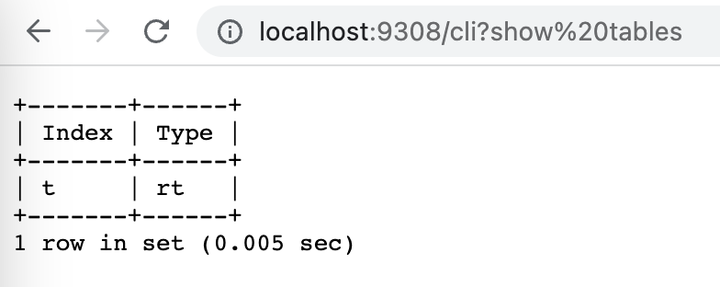

# HTTP
您可以通过 HTTP/HTTPS 连接到 Manticore Search。
## 配置
<!-- example HTTP -->
默认情况下，Manticore 在 9308 和 9312 端口上监听 HTTP、HTTPS 和二进制请求。
在配置文件的 "searchd" 部分，您可以使用 `listen` 指令定义 HTTP 端口，如下所示：
两行都是有效的，且具有相同的含义（除了端口号）。它们都定义了将为所有 API/HTTP/HTTPS 协议提供服务的监听器。没有特殊要求，任何 HTTP 客户端都可以用于连接到 Manticore。
<!-- request HTTP -->
```ini
searchd {
...
   listen = 127.0.0.1:9308
   listen = 127.0.0.1:9312:http
...
}
```
<!-- end -->
所有 HTTP 端点返回 `application/json` 内容类型。在大多数情况下，端点使用 JSON 有效负载进行请求。然而，也有一些例外，使用 NDJSON 或简单的 URL 编码有效负载。
目前没有用户认证。因此，请确保 HTTP 接口对网络外部的任何人不可访问。由于 Manticore 的功能类似于任何其他 Web 服务器，您可以使用反向代理，如 Nginx，来实现 HTTP 认证或缓存。
<!-- example HTTPS -->
HTTP 协议还支持 [SSL 加密](../Security/SSL.md):
如果您指定 `:https` 而不是 `:http` **仅**接受安全连接。否则，在未提供有效密钥/证书的情况下，如果客户端尝试通过 https 连接，连接将被中断。如果您向 9443 发出非 HTTPS，而是 HTTP 请求，它将响应 HTTP 代码 400。
<!-- request HTTPS -->
```ini
searchd {
...
   listen = 127.0.0.1:9308
   listen = 127.0.0.1:9443:https
...
}
```
<!-- end -->
### VIP 连接
<!-- example VIP -->
可用于“VIP”连接的单独 HTTP 接口。在这种情况下，连接绕过线程池并始终创建一个新的专用线程。这在服务器可能停滞或不允许常规端口连接的严重过载期间管理 Manticore Search 时非常有用。
有关 `listen` 指令的更多信息，请参见 [本节](../Server_settings/Searchd.md#listen)。
<!-- request VIP -->
```ini
searchd {
...
   listen = 127.0.0.1:9308
   listen = 127.0.0.1:9318:_vip
...
}
```
<!-- end -->
## 通过 HTTP 的 SQL
Manticore 提供 `/sql`、`/cli` 和 `/cli_json` 端点，用于通过 HTTP 运行 SQL 查询。每个端点都针对特定用例设计：
* `/sql`: 适合来自应用程序的编程使用。
  - `/sql` 端点仅接受 SELECT 语句，并以 HTTP JSON 格式返回响应。
  - `/sql?mode=raw` 端点接受任何 SQL 查询并以原始格式返回响应，类似于您通过 mysql 收到的内容。
* `/cli`: 仅供手动使用（例如，通过 curl 或浏览器）。**不建议用于脚本。**
* `/cli_json`: 类似于 `/cli`，但以 JSON 格式返回结果。**不建议用于脚本。**
### /sql
<!-- example SQL_over_HTTP -->
通用语法：
* `curl "localhost:6780/sql[?mode=raw]&query={URL_ENCODED_QUERY}"`
* `curl localhost:6780/sql[?mode=raw] -d "[query={URL_ENCODED_QUERY}|{NOT_URL_ENCODED_QUERY}]"`
`/sql` 端点通过 HTTP JSON 接口接受 SQL 查询：
* 若不使用 `mode=raw` - 仅允许 [SELECTs](../Searching/Full_text_matching/Basic_usage.md#SQL)，以 JSON 格式返回响应。
* 使用 [mode=raw](../Connecting_to_the_server/HTTP.md#mode=raw) - 任何 SQL 查询都是允许的，以原始格式返回响应。
该端点可以使用 GET 或 POST 方法处理 HTTP 请求。发送查询时，您可以：
1. **使用 GET：** 将查询包含在 URL 的 `query` 参数中，如 `/sql?query=your_encoded_query_here`。**必须对**此参数进行 URL 编码，以避免错误，特别是当查询包含 `=` 符号时，这可能会被解释为 URL 语法的一部分，而不是查询。
2. **使用 POST：** 您还可以在 POST 请求的主体中发送查询。当使用此方法时：
   - 如果您将查询作为名为 `query` 的参数发送，**确保它是 URL 编码**。
   - 如果您将查询作为普通文本（原始 POST 主体）直接发送，**不要进行 URL 编码**。当查询很长或复杂时，或者如果查询存储在文件中并且您希望直接发送它（即通过 HTTP 客户端（例如 `curl`）指向该文件）时，这非常有用。
这种方法保持了 GET 和 POST 的用法分开，避免在单个请求中混合方法造成的混淆。
在没有 `mode=raw` 的情况下，响应是一个包含有关命中的信息和执行时间的 JSON。响应格式与 [json/search](../Searching/Full_text_matching/Basic_usage.md#HTTP-JSON) 端点相同。请注意，`/sql` 端点仅支持单次搜索请求。有关处理多查询的信息，请参见下方关于 [raw 模式](../Connecting_to_the_server/HTTP.md#mode=raw) 的部分。
<!-- request POST -->
```bash
POST /sql
select id,subject,author_id  from forum where match('@subject php manticore') group by author_id order by id desc limit 0,5
```
<!-- response POST -->
```json
{
  "took": 0,
  "timed_out": false,
  "hits": {
    "total": 2,
    "total_relation": "eq",
    "hits": [
      {
        "_id": 2,
        "_score": 2356,
        "_source": {
          "subject": "php manticore",
          "author_id": 12
        }
      },
      {
        "_id": 1,
        "_score": 2356,
        "_source": {
          "subject": "php manticore",
          "author_id": 11
        }
      }
    ]
  }
}
```
<!-- request POST URL-encoded -->
```bash
POST /sql query=select%20id%2Csubject%2Cauthor_id%20%20from%20forum%20where%20match%28%27%40subject%20php%20manticore%27%29%20group%20by%20author_id%20order%20by%20id%20desc%20limit%200%2C5
```

<!-- response POST URL-encoded -->
```json
{
  "took": 0,
  "timed_out": false,
  "hits": {
    "total": 2,
    "total_relation": "eq",
    "hits": [
      {
        "_id": 2,
        "_score": 2356,
        "_source": {
          "subject": "php manticore",
          "author_id": 12
        }
      },
      {
        "_id": 1,
        "_score": 2356,
        "_source": {
          "subject": "php manticore",
          "author_id": 11
        }
      }
    ]
  }
}
```

<!-- request GET URL-encoded -->
```bash
GET /sql?query=select%20id%2Csubject%2Cauthor_id%20%20from%20forum%20where%20match%28%27%40subject%20php%20manticore%27%29%20group%20by%20author_id%20order%20by%20id%20desc%20limit%200%2C5
```

<!-- response GET URL-encoded -->
```json
{
  "took": 0,
  "timed_out": false,
  "hits": {
    "total": 2,
    "total_relation": "eq",
    "hits": [
      {
        "_id": 2,
        "_score": 2356,
        "_source": {
          "subject": "php manticore",
          "author_id": 12
        }
      },
      {
        "_id": 1,
        "_score": 2356,
        "_source": {
          "subject": "php manticore",
          "author_id": 11
        }
      }
    ]
  }
}
```

<!-- end -->

#### mode=raw

<!-- example mode=raw -->

`/sql` 端点还包括一个特殊的“原始”模式，允许您发送**任何有效的 SQL 查询，包括多查询**。响应是一个包含一个或多个结果集的 JSON 数组。您可以通过使用选项 `mode=raw` 来激活此模式。

<!-- request POST -->
```bash
POST /sql?mode=raw
desc test
```

<!-- response POST -->
```json
[
  {
    "columns": [
      {
        "Field": {
          "type": "string"
        }
      },
      {
        "Type": {
          "type": "string"
        }
      },
      {
        "Properties": {
          "type": "string"
        }
      }
    ],
    "data": [
      {
        "Field": "id",
        "Type": "bigint",
        "Properties": ""
      },
      {
        "Field": "title",
        "Type": "text",
        "Properties": "indexed"
      },
      {
        "Field": "gid",
        "Type": "uint",
        "Properties": ""
      },
      {
        "Field": "title",
        "Type": "string",
        "Properties": ""
      },
      {
        "Field": "j",
        "Type": "json",
        "Properties": ""
      },
      {
        "Field": "new1",
        "Type": "uint",
        "Properties": ""
      }
    ],
    "total": 6,
    "error": "",
    "warning": ""
  }
]
```

<!-- request POST URL-encoded -->
```bash
POST /sql?mode=raw
query=desc%20test
```

<!-- response POST URL-encoded -->
```json
[
  {
    "columns": [
      {
        "Field": {
          "type": "string"
        }
      },
      {
        "Type": {
          "type": "string"
        }
      },
      {
        "Properties": {
          "type": "string"
        }
      }
    ],
    "data": [
      {
        "Field": "id",
        "Type": "bigint",
        "Properties": ""
      },
      {
        "Field": "title",
        "Type": "text",
        "Properties": "indexed"
      },
      {
        "Field": "gid",
        "Type": "uint",
        "Properties": ""
      },
      {
        "Field": "title",
        "Type": "string",
        "Properties": ""
      },
      {
        "Field": "j",
        "Type": "json",
        "Properties": ""
      },
      {
        "Field": "new1",
        "Type": "uint",
        "Properties": ""
      }
    ],
    "total": 6,
    "error": "",
    "warning": ""
  }
]
```

<!-- request POST URL-encoded 2nd way -->
```bash
POST /sql
mode=raw&query=desc%20test
```

<!-- response POST URL-encoded 2nd way -->
```json
[
  {
    "columns": [
      {
        "Field": {
          "type": "string"
        }
      },
      {
        "Type": {
          "type": "string"
        }
      },
      {
        "Properties": {
          "type": "string"
        }
      }
    ],
    "data": [
      {
        "Field": "id",
        "Type": "bigint",
        "Properties": ""
      },
      {
        "Field": "title",
        "Type": "text",
        "Properties": "indexed"
      },
      {
        "Field": "gid",
        "Type": "uint",
        "Properties": ""
      },
      {
        "Field": "title",
        "Type": "string",
        "Properties": ""
      },
      {
        "Field": "j",
        "Type": "json",
        "Properties": ""
      },
      {
        "Field": "new1",
        "Type": "uint",
        "Properties": ""
      }
    ],
    "total": 6,
    "error": "",
    "warning": ""
  }
]
```

<!-- request GET URL-encoded -->
```bash
GET /sql?mode=raw&query=desc%20test
```

<!-- response GET URL-encoded -->
```json
[
  {
    "columns": [
      {
        "Field": {
          "type": "string"
        }
      },
      {
        "Type": {
          "type": "string"
        }
      },
      {
        "Properties": {
          "type": "string"
        }
      }
    ],
    "data": [
      {
        "Field": "id",
        "Type": "bigint",
        "Properties": ""
      },
      {
        "字段": "title",
        "类型": "text",
        "属性": "indexed"
      },
      {
        "字段": "gid",
        "类型": "uint",
        "属性": ""
      },
      {
        "字段": "title",
        "类型": "string",
        "属性": ""
      },
      {
        "字段": "j",
        "类型": "json",
        "属性": ""
      },
      {
        "字段": "new1",
        "类型": "uint",
        "属性": ""
      }
    ],
    "总数": 6,
    "错误": "",
    "警告": ""
  }
]
```

<!-- request curl examples -->
```bash
# POST:
curl localhost:9308/sql?mode=raw -d 'SHOW TABLES'

# POST, URL-encoded:
curl localhost:9308/sql?mode=raw -d 'query=SHOW%20TABLES'

# POST, URL-encoded, 2nd way:
curl localhost:9308/sql -d 'mode=raw&query=SHOW%20TABLES'

# POST, URL-non-encoded:
curl localhost:9308/sql -d 'mode=raw&query=SHOW TABLES'
```

<!-- end -->


### /cli

<!-- example cli -->

> 注意: `/cli` 需要 [Manticore Buddy](../Installation/Manticore_Buddy.md)。如果它无法工作，确保 Buddy 已安装。

> 注意: `/cli` 端点旨在通过像 curl 或浏览器这样的工具与 Manticore 进行手动交互。它不适合用于自动化脚本中。请改用 `/sql` 端点。

虽然 `/sql` 端点对于从您的应用程序以编程方式控制 Manticore 很有用，但也有 `/cli` 端点。这使得使用 curl 或您的浏览器 **手动维护 Manticore 实例** 更加方便。它接受 POST 和 GET HTTP 方法。输入 `/cli?` 之后的所有内容都被 Manticore 理解，即使它没有通过 curl 手动转义或通过浏览器自动编码。没有 `query` 参数是必需的。重要的是，`+` 符号不被改变为空间，消除了对编码的需求。对于 POST 方法，Manticore 精确接受一切内容，毫无改动。响应以表格格式显示，类似于您在 MySQL 客户端中可能看到的 SQL 结果集。

<!-- request POST -->

```bash
POST /cli
desc test
```

<!-- response POST -->

```bash
+-------+--------+----------------+
| 字段  | 类型   | 属性          |
+-------+--------+----------------+
| id    | bigint |                |
| body  | text   | indexed stored |
| title | string |                |
+-------+--------+----------------+
3 行在集合中 (0.001 秒)
```

<!-- request GET -->

```bash
GET /cli?desc%20test
```

<!-- response GET -->

```bash
+-------+--------+----------------+
| 字段  | 类型   | 属性          |
+-------+--------+----------------+
| id    | bigint |                |
| body  | text   | indexed stored |
| title | string |                |
+-------+--------+----------------+
3 行在集合中 (0.001 秒)
```

<!-- request Browser -->



<!-- request curl example -->

```bash
curl 0:9308/cli -d 'desc test'
```

<!-- response curl example -->

```sql
+-------+--------+----------------+
| 字段  | 类型   | 属性          |
+-------+--------+----------------+
| id    | bigint |                |
| title | text   | indexed stored |
+-------+--------+----------------+
2 行在集合中 (0.001 秒)
```

<!-- end -->

### /cli_json
> 注意: `/cli_json` 端点旨在通过像 curl 或浏览器这样的工具与 Manticore 进行手动交互。它不适合用于自动化脚本中。请改用 `/sql` 端点。

<!-- example cli_json -->
`/cli_json` 端点提供与 `/cli` 相同的功能，但响应格式为 JSON。它包括：
- 描述架构的 `columns` 部分。
- 包含实际数据的 `data` 部分。
- 包含 "total"、"error" 和 "warning" 的摘要部分。

<!-- request POST -->

```bash
POST /cli_json
desc test
```

<!-- response POST -->

```json
[
   {
      "columns":[
         {
            "字段":{
               "类型":"string"
            }
         },
         {
            "类型":{
               "类型":"string"
            }
         },
         {
            "属性":{
               "类型":"string"
            }
         }
      ],
      "data":[
         {
            "字段":"id",
            "类型":"bigint",
            "属性":""
         },
         {
            "字段":"body",
            "类型":"text",
            "属性":"indexed stored"
         },
         {
            "字段":"title",
            "类型":"string",
            "属性":""
         }
      ],
      "总数":3,
      "错误":"",
      "警告":""
   }
]
```

<!-- request GET -->

```bash
GET /cli_json?desc%20test
```

<!-- response GET -->

```json
[
   {
      "columns":[
         {
            "字段":{
               "类型":"string"
            }
         },
         {
            "类型":{
               "类型":"string"
            }
         },
         {
            "属性":{
               "类型":"string"
            }
         }
      ],
      "data":[
         {
            "字段":"id",
            "类型":"bigint",
            "属性":""
         },
         {
            "字段":"body",
            "类型":"text",
            "属性":"indexed stored"
         },
         {
            "字段":"title",
            "类型":"string",
            "属性":""
         }
      ],
      "总数":3,
      "错误":"",
      "警告":""
   }
]
```

<!-- request curl example -->

```bash
curl 0:9308/cli_json -d 'desc test'
```
<!-- response curl example -->

```json
[{

"columns":[{"Field":{"type":"string"}},{"Type":{"type":"string"}},{"Properties":{"type":"string"}}],

"data":[

{"Field":"id","Type":"bigint","Properties":""},

{"Field":"body","Type":"text","Properties":"indexed stored"},

{"Field":"title","Type":"string","Properties":""}

],

"total":3,

"error":"",

"warning":""

}]

```

<!-- end -->

### 保持活动

HTTP保持活动支持 `/sql`、`/sql?mode=raw` 和 `/cli_json` 端点，但不支持 `/cli` 端点。此功能通过HTTP JSON接口实现有状态交互，前提是客户端也支持保持活动。例如，使用 [/cli_json](../Connecting_to_the_server/HTTP.md#/cli_json) 端点，您可以在执行 `SELECT` 查询后运行一个 `SHOW META` 命令，并且它的行为类似于通过MySQL客户端与Manticore的交互。

<!-- proofread -->


