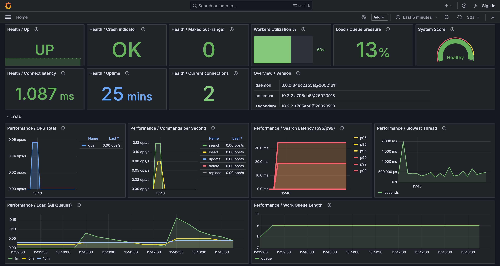

# 与 Grafana 的集成

> 注意：某些仪表板面板和指标需要 [Manticore Buddy](../Installation/Manticore_Buddy.md)。如果某些面板显示为空，请确保已安装Buddy。

[Grafana](https://grafana.com/) 是一个用于数据可视化和监控的开源平台，它支持创建交互式仪表板和图表。Manticore Search 可以通过两种主要方式与Grafana集成：

1. **监控Manticore性能**：使用Prometheus从Manticore收集指标并在Grafana仪表板中进行可视化。这种方法专注于搜索引擎本身的系统健康状况、性能监控和告警。
2. **可视化搜索数据**：通过MySQL连接器查询并显示存储在Manticore表中的数据，类似于Kibana用于Elasticsearch数据可视化的方式。这对于分析趋势、聚合和基于索引数据的自定义可视化非常理想。

目前，Grafana 10.0 到 12.4 版本经过测试并受支持。

## 使用Prometheus和Grafana监控Manticore

Manticore 在专用仓库 [manticoresoftware/grafana-dashboard](https://github.com/manticoresoftware/grafana-dashboard) 中提供了预构建的Grafana仪表板和Prometheus告警规则。这些资源可以与您现有的Grafana和Prometheus设置独立使用，使您能够监控Manticore的操作指标（如延迟、资源使用情况和错误），而无需运行单独的实例。



- 其他截图：https://github.com/manticoresoftware/grafana-dashboard
- 仪表板JSON：[grafana/dashboards/manticore-dashboard.json](https://github.com/manticoresoftware/grafana-dashboard/blob/main/grafana/dashboards/manticore-dashboard.json)
- 告警规则（Prometheus/Alertmanager）：[prometheus/rules/manticore-alerts.yml](https://github.com/manticoresoftware/grafana-dashboard/blob/main/prometheus/rules/manticore-alerts.yml)

### 快速入门（Docker镜像）

对于完全预配置的设置，该仓库包含一个专为Manticore监控定制的Grafana和Prometheus一体化Docker镜像。如果您没有现有设置或想要一个快速测试环境，这非常理想：

```bash
docker run -e MANTICORE_TARGETS=localhost:9308 -p 3000:3000 manticoresearch/dashboard:latest
```

`MANTICORE_TARGETS` 是逗号分隔的Manticore指标端点（Prometheus目标）列表。默认情况下，镜像期望作业标签为 `manticoresearch`。

如果您已经有运行中的Grafana和Prometheus，可以跳过Docker镜像，直接导入仪表板和告警规则，如下面所述。

### 导入仪表板

将Manticore仪表板添加到现有的Grafana实例中：

1. 在Grafana中，导航到 **Dashboards** → **New** → **Import**。
2. 上传 `manticore-dashboard.json` 文件（或粘贴其JSON内容）。
3. 在提示时选择您的Prometheus数据源。
4. 如有必要，验证并调整 `job` 仪表板变量（默认预期标签值为 `manticoresearch`）。

### 使用告警规则

将Manticore告警规则集成到现有的Prometheus设置中：

1. 下载 `manticore-alerts.yml` 并将其添加到Prometheus的 `rule_files` 配置中。
2. 如果您的抓取作业名称与 `manticoresearch` 不同，请相应地更新规则中的 `{job="manticoresearch"}` 匹配器。
3. 重新加载或重启Prometheus以应用更改。

### 告警规则（其含义）

`manticore-alerts.yml` 文件旨在关注与可用性、过载和资源耗尽相关的关键信号——这些问题通常直接影响用户。阈值设置为安全默认值；根据您的具体工作负载进行调整。

- **Manticore目标不可达** (`严重`): Prometheus 无法抓取 Manticore (`up == 0` 持续 2 分钟)。这通常表示指标端点已关闭、无法访问或抓取配置不正确。
- **Manticore最近重启** (`警告`): 运行时间在 5 分钟内持续低于 5 分钟。这通常表明不稳定，例如崩溃循环、内存不足终止或编排器重启。
- **Manticore达到错误上限** (`警告`): `manticore_maxed_out_error_count` 在过去 5 分钟内增加。Manticore 因达到容量、并发性或资源限制而拒绝请求。
- **Manticore搜索延迟P95过高** (`警告`): P95 搜索延迟超过 500 毫秒持续 10 分钟。许多用户可能会觉得搜索速度变慢。
- **Manticore搜索延迟P99过高** (`严重`): P99 搜索延迟超过 1,000 毫秒持续 10 分钟。尾部延迟严重升高，表明最坏情况下的请求非常缓慢。
- **Manticore工作队列积压** (`警告`): 工作队列长度超过 100 持续 5 分钟。请求正在累积，通常会导致延迟增加。
- **Manticore工作线程饱和** (`警告`): 超过 90% 的工作线程处于活动状态持续 10 分钟。工作线程接近满负荷，可能会导致更高的延迟和排队。
- **Manticore查询缓存接近限制** (`警告`): 查询缓存使用率超过其配置最大值的 90% 持续 10 分钟。这会增加缓存抖动和驱逐的风险，可能减慢查询；考虑扩展缓存或优化查询模式。
- **Manticore代理重试次数高** (`警告`): `manticore_agent_retry_count` 在 5 分钟内增加超过 10 次。这通常指向远程代理的连接问题（例如网络问题、超时或分布式查询失败）。
- **Manticore当前连接数高** (`警告`): 当前连接数超过 500 持续 10 分钟。这可能表明流量激增、连接泄漏或慢客户端。
- **Manticore最慢线程时间高** (`警告`): `manticore_slowest_thread_seconds` 超过 30 秒持续 10 分钟。存在长时间运行或卡住的查询；调查慢查询和资源竞争。
- **Manticore连接时间高** (`警告`): `manticore_connect_time_seconds` 超过 0.2 秒持续 5 分钟。连接建立延迟（例如由于网络问题、TLS 开销或服务器过载）。
- **Manticore搜索d最近崩溃** (`严重`): `manticore_searchd_crashes_total` 在过去 10 分钟内增加。已发生崩溃；检查日志、核心转储和内存不足事件。
- **Manticore二进制日志文件数高** (`警告`): 二进制日志文件数超过 1,000 持续 10 分钟。这表明二进制日志未正确轮换或清理；检查二进制日志设置和磁盘使用情况。
- **Manticore搜索d文件描述符数高** (`警告`): `searchd` 文件描述符数超过 4,096 持续 10 分钟。这可能会达到操作系统限制；验证 `ulimit -n`、连接、打开文件和潜在泄漏。
- **Manticore伙伴文件描述符数高** (`警告`): 伙伴文件描述符数超过 4,096 持续 10 分钟。与上述类似，但针对伙伴进程。
- **Manticore搜索d匿名RSS高** (`警告`): `searchd` 匿名 RSS 超过 8 GiB 持续 10 分钟。高非文件后备内存使用；检查内存增长、查询/索引模式和容器限制。
- **Manticore伙伴匿名RSS高** (`警告`): 伙伴匿名 RSS 超过 8 GiB 持续 10 分钟。伙伴内存使用量升高；检查伙伴日志和工作负载。
- **Manticore未服务的表** (`警告`): `manticore.json` 中列出的一个或多个表在 `SHOW TABLES` 中缺失持续 10 分钟。这通常意味着表加载失败或被删除/移动；检查启动日志和表路径。
- **Manticore磁盘映射缓存低** (`警告`): 磁盘映射缓存比率低于 50% 持续 15 分钟。可能增加磁盘 I/O，如果工作集超过 RAM，可能会减慢搜索。
- **Manticore磁盘映射缓存非常低** (`严重`): 磁盘映射缓存比率低于 20% 持续 15 分钟。严重的缓存未命中；预计磁盘 I/O 重和高延迟。

### 仪表板面板（显示内容）

仪表板按主题组织面板。关键亮点包括：

- **健康 / 运行时间**：自上次重启以来的时间；频繁下降表明重启或崩溃。
- **性能 / 搜索延迟（P95/P99）**：尾部延迟指标；持续增加通常表明过载或慢查询。
- **性能 / 工作队列长度** 和 **负载 / 队列压力**：积压和排队指标；增长的队列表明系统滞后。
- **工作线程利用率 %** 和 **负载 / 活动/总工作线程**：工作线程饱和度；值接近 100% 通常与更高延迟相关。
- **性能 / 查询缓存使用率** 和 **性能 / 查询缓存命中率**：缓存压力和效果；高使用率与低命中率可能表明效率低下。
- **表 / 磁盘映射缓存比率（最差 10 个）**：低比率意味着更多磁盘读取和潜在的较慢查询。

## 在 Grafana 中可视化 Manticore 数据

此方法使用 Grafana 的 MySQL 连接器直接查询 Manticore 表，从而可视化您的搜索数据，例如时间序列趋势或聚合。

### 先决条件

在设置数据可视化之前：

1. 确保已安装并配置 Manticore Search（版本 6.2.0 或更高版本）。有关详细信息，请参阅 [官方 Manticore Search 安装指南](../Installation/Installation.md)。
2. 在您的系统上安装 Grafana。有关说明，请参阅 [官方 Grafana 安装指南](https://grafana.com/docs/grafana/latest/setup-grafana/installation/)。

### 将 Manticore Search 连接到 Grafana

连接 Manticore Search 到 Grafana 的步骤：

1. 登录 Grafana 仪表盘，在左侧边栏点击“配置”（齿轮图标）。
2. 选择“数据源”，然后点击“添加数据源”。
3. 从可用数据源列表中选择“MySQL”。
4. 在设置页面填写以下信息：
   - **名称**：数据源名称（例如，“Manticore Search”）
   - **主机**：Manticore Search 服务器的主机名或 IP 地址（及 MySQL 端口，默认：`localhost:9306`）
   - **数据库**：留空或指定数据库名
   - **用户**：有权限访问 Manticore Search 的用户名（默认：`root`）
   - **密码**：指定用户的密码（默认为空）
5. 点击“保存并测试”以验证连接。

### 创建可视化和仪表板

连接 Manticore Search 到 Grafana 后，您可以创建仪表盘和可视化：

1. 在 Grafana 仪表盘左侧边栏点击“+”图标，选择“新建仪表盘”。
2. 点击“添加可视化”按钮，开始配置您的图表。
3. 选择通过 MySQL 连接器连接的 Manticore Search 数据源。
4. 选择您要创建的图表类型（例如，时间序列、条形图、蜡烛图、饼图）。
5. 使用 Grafana 的查询生成器或编写 SQL 查询，从 Manticore Search 表中获取数据。
6. 根据需要自定义图表的外观、标签和其他设置。
7. 点击“应用”，将您的可视化保存至仪表盘。

### 示例用例

以下是一个使用时间序列数据的简单示例。首先，创建表并加载示例数据：

```sql
CREATE TABLE btc_usd_trading (
  id bigint,
  time timestamp,
  open float,
  high float,
  low float,
  close float
);
```

加载数据：
```bash
curl -sSL https://gist.githubusercontent.com/donhardman/df109ba6c5e690f73198b95f3768e73f/raw/0fab3aee69d7007fad012f4e97f38901a64831fb/btc_usd_trading.sql | mysql -h0 -P9306
```

在 Grafana 中，您可以创建：
- **时间序列图表**：可视化价格随时间的变化
- **蜡烛图**：显示金融数据的开盘价、最高价、最低价、收盘价
- **聚合图表**：使用 COUNT、AVG、MAX、MIN 函数

示例查询：
```sql
-- Time series query
SELECT time, close FROM btc_usd_trading ORDER BY time;

-- Aggregation query
SELECT DATE(time) as date, AVG(close) as avg_price
FROM btc_usd_trading
GROUP BY date
ORDER BY date;
```

### 支持的功能

通过 Grafana 使用 Manticore Search，您可以：

- 对 Manticore Search 表执行 SQL 查询
- 使用聚合函数：COUNT、AVG、MAX、MIN
- 应用 GROUP BY 和 ORDER BY 操作
- 使用 WHERE 子句过滤数据
- 通过 `information_schema.tables` 访问表元数据
- 创建 Grafana 支持的各种可视化类型

### 限制

- 在通过 Grafana 使用 Manticore Search 时，某些高级 MySQL 功能可能不可用。
- 仅支持 Manticore Search 支持的功能。详细信息请参阅[SQL 参考](../Searching/Full_text_matching/Basic_usage.md)。

## 参考资料

更多信息和详细教程：
- [Grafana 集成博客文章](https://manticoresearch.com/blog/manticoresearch-grafana-integration/)
- [官方 Grafana 文档](https://grafana.com/docs/)
