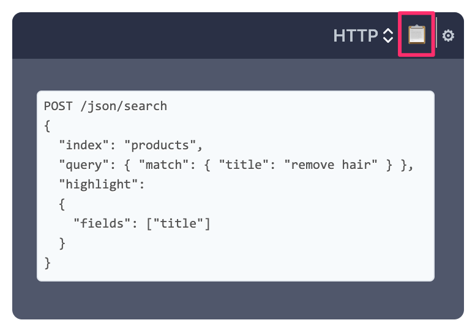
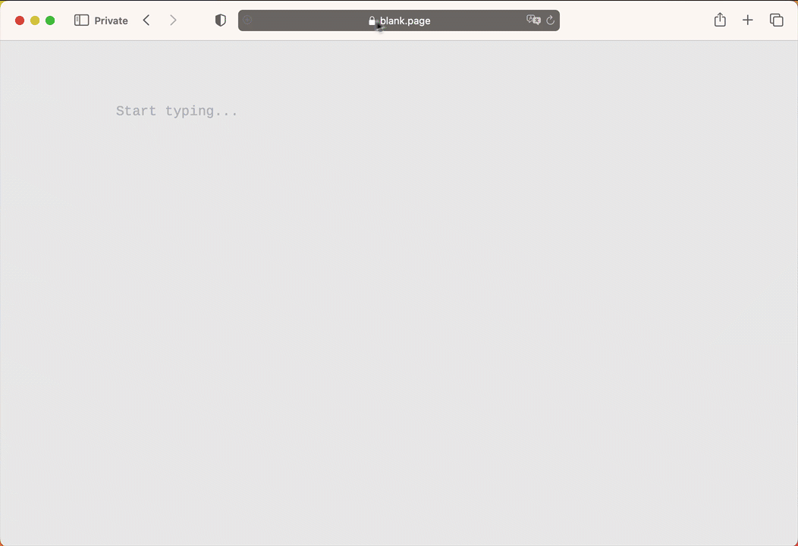

# 先读这里

## 关于本手册

本手册的编排反映了您使用 Manticore 的最可能路径：

* 从其基本信息及如何安装和连接开始
* 重点内容如添加文档和运行搜索
* 性能优化技巧、窍门以及通过插件和自定义函数扩展 Manticore

##### 不要跳过 1️⃣ 2️⃣ 3️⃣
手册中的关键章节在菜单中用 1️⃣、2️⃣、3️⃣ 等标记，便于您的使用，因为这些功能是最常用的。如果您是 Manticore 新手，**我们强烈建议不要跳过它们**。

##### 快速入门指南
如果您想快速了解 Manticore 的工作原理，[⚡ 快速入门指南](Quick_start_guide.md) 是一个不错的起点。

##### 使用示例
每个查询示例右上角都有一个小图标 📋：

您可以使用它将示例复制到剪贴板。**如果查询是 HTTP 请求，则会以 CURL 命令的形式复制。**您可以按 ⚙️ 配置主机/端口。

##### 在本手册中搜索

我们热爱搜索，并尽最大努力让本手册的搜索功能尽可能方便。当然，这是依托 Manticore Search 实现的。除了使用需要先打开手册的搜索栏外，还有一个非常简单的方法，只需打开 **mnt.cr/your-search-keyword** 即可查找内容：

## 最佳实践
您需要了解 Manticore Search 的一些内容，有助于您遵循最佳使用实践。

#### 实时表与普通表
* **[实时表](Creating_a_table/Local_tables/Real-time_table.md)** 允许添加、更新和删除文档，且更改立即可用。
* **[普通表](Creating_a_table/Local_tables/Plain_table.md)** 是一个大部分不可变的数据结构，是实时表使用的基本元素。普通表存储一组文档、它们共有的字典和索引设置。一个实时表可以由多个普通表（块）组成，但**除此之外，Manticore 还提供了使用工具 [indexer](Data_creation_and_modification/Adding_data_from_external_storages/Plain_tables_creation.md#Indexer-tool) 直接构建普通表。** 当您的数据大多不可变时，这很有意义，因此您不需要实时表。

#### 实时模式与普通模式
Manticore Search 有两种工作模式：
* **实时模式** (RT 模式)。这是默认模式，允许**以命令式方式**管理数据架构：
  * 允许通过 SQL 命令 `CREATE`/`ALTER`/`DROP TABLE` 及非 SQL 客户端的等效命令在线管理数据架构
  * 在配置文件中只需定义服务器相关设置，包括 [data_dir](Server_settings/Searchd.md#data_dir)
* **普通模式** 允许在配置文件中定义数据架构，即提供一种**声明式**架构管理。这适用于三种情况：
  * 仅处理普通表时
  * 或数据架构非常稳定且不需要复制（复制功能仅在 RT 模式下可用）
  * 当您必须使数据架构可移植（如便于在新服务器上部署）

您不能同时使用两种模式，需通过配置文件中的 [data_dir](Server_settings/Searchd.md#data_dir) 指定（这是默认行为）来决定使用哪种模式。如果不确定，**我们推荐使用 RT 模式**，因为即使您需要普通表，也可以通过单独的普通表配置[构建](Data_creation_and_modification/Adding_data_from_external_storages/Plain_tables_creation.md)，并将其[导入](Data_creation_and_modification/Adding_data_from_external_storages/Adding_data_to_tables/Importing_table.md)到主 Manticore 实例中。

实时表可用于 RT 模式和普通模式。在 RT 模式下实时表通过 `CREATE TABLE` 命令定义，而在普通模式下在配置文件中定义。普通（离线）表仅支持普通模式。普通表无法在 RT 模式下创建，但普通模式创建的普通表可以[转换](Data_creation_and_modification/Adding_data_from_external_storages/Adding_data_to_tables/Attaching_one_table_to_another.md)为实时表，并在 RT 模式下[导入](Data_creation_and_modification/Adding_data_from_external_storages/Adding_data_to_tables/Importing_table.md)。

#### SQL 与 JSON
Manticore 提供多种方式和接口管理您的架构和数据，但主要有两种：
* **SQL**。这是 Manticore 的原生语言，支持所有 Manticore 功能。**最佳实践使用 SQL 来**：
  * 管理架构及执行其他 DBA 例行操作，因为这是最简便的方式
  * 设计您的查询，因为 SQL 比 JSON DSL 更接近自然语言，这在设计新东西时很重要。您可以通过任何 MySQL 客户端或 [/sql](Connecting_to_the_server/MySQL_protocol.md) 使用 Manticore SQL。
* **JSON**。大部分功能也可通过 JSON 领域特定语言实现。当您需要和应用程序集成时，JSON 特别有用，因为它比 SQL 更容易以编程方式实现。最佳实践是**先了解如何通过 SQL 实现某功能，再使用 JSON 集成到您的应用中。**

<!-- proofread -->

