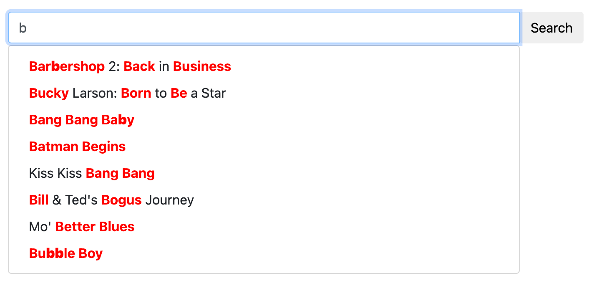
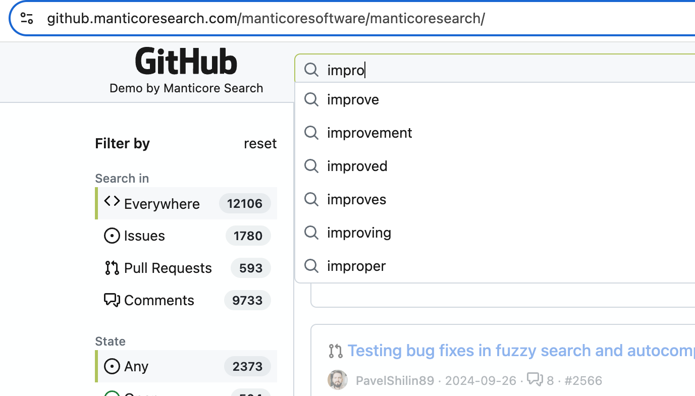

# 自动完成

自动完成，或称词语补全，是在你输入时预测并建议单词或短语的结尾。它常用于：
- 网站上的搜索框
- 搜索引擎中的建议
- 应用程序中的文本字段

Manticore 提供了一个高级的自动完成功能，在你输入时给出建议，类似于知名搜索引擎中的功能。这有助于加快搜索速度，让用户更快找到所需内容。

除了基本的自动完成功能外，Manticore 还包含增强用户体验的高级功能：

1. **拼写纠正（模糊匹配）：** Manticore 的自动完成通过使用识别和修正常见错误的算法，帮助纠正拼写错误。这意味着即使你输入错误，也能找到你想要的内容。
2. **键盘布局自动检测：** Manticore 能够识别你使用的键盘布局。这在多语言环境中非常有用，或者当你不小心使用了错误的语言输入时。例如，如果你错误地输入了“ghbdtn”，Manticore 会知道你想输入的是“привет”（俄语中的“你好”），并建议正确的单词。

Manticore 的自动完成可以根据不同需求和设置进行定制，是许多应用的灵活工具。



## 调用自动完成

> 注意：`CALL AUTOCOMPLETE` 和 `/autocomplete` 需要 [Manticore Buddy](../Installation/Manticore_Buddy.md)。如果无法使用，请确保已安装 Buddy。

<!-- example call_autocomplete -->
要在 Manticore 中使用自动完成，请使用 `CALL AUTOCOMPLETE` SQL 语句或其 JSON 等价的 `/autocomplete`。此功能基于你的索引数据提供词语补全建议。

在继续之前，请确保你打算用于自动完成的表已启用 [infixes](../Creating_a_table/NLP_and_tokenization/Wildcard_searching_settings.md#min_infix_len)。

**注意：** 表设置中有一个针对 `min_infix_len` 的自动检查，使用 30 秒缓存以提升 `CALL AUTOCOMPLETE` 的性能。修改表后，首次使用 `CALL AUTOCOMPLETE` 可能会有短暂延迟（通常不明显）。只有成功的结果会被缓存，因此如果你删除表或禁用 `min_infix_len`，`CALL AUTOCOMPLETE` 可能暂时返回错误结果，直到最终显示与 `min_infix_len` 相关的错误。

### 通用语法

#### SQL
```sql
CALL AUTOCOMPLETE('query_beginning', 'table', [...options]);
```

#### JSON
```json
POST /autocomplete
{
	"table":"table_name",
	"query":"query_beginning"
	[,"options": {<autocomplete options>}]
}
```

#### 选项
- `layouts`：逗号分隔的键盘布局代码字符串，用于检测因键盘布局不匹配导致的输入错误（例如使用错误布局时输入“ghbdtn”而非“привет”）。Manticore 会比较不同布局中字符的位置以建议纠正。至少需要 2 个布局才能有效检测不匹配。可用选项：us, ru, ua, se, pt, no, it, gr, uk, fr, es, dk, de, ch, br, bg, be（更多详情见[这里](../Searching/Spell_correction.md#Options)）。默认：无
- `fuzziness`：`0`、`1` 或 `2`（默认：`2`）。查找拼写错误的最大 Levenshtein 距离。设置为 `0` 禁用模糊匹配
- `preserve`：`0` 或 `1`（默认：`0`）。设置为 `1` 时，保留搜索结果中没有模糊匹配的词（例如，“hello wrld”返回“hello wrld”和“hello world”）。设置为 `0` 时，仅返回有成功模糊匹配的词（例如，“hello wrld”仅返回“hello world”）。对保留短词或可能不存在于 Manticore Search 中的专有名词特别有用
- `prepend`：布尔值（SQL 中为 0/1）。若为 true(1)，在最后一个词前添加星号以进行前缀扩展（例如，`*word`）
- `append`：布尔值（SQL 中为 0/1）。若为 true(1)，在最后一个词后添加星号以进行后缀扩展（例如，`word*`）
- `expansion_len`：最后一个词扩展的字符数。默认：`10`
- `force_bigrams`：布尔值（SQL 中为 0/1）。强制对所有词长使用二元组（2 字符 n-gram）而非三元组，这可以改善对字符调换错误的匹配。默认：`0`（对长度≥6的词使用三元组）

<!-- request SQL -->

```sql
mysql> CALL AUTOCOMPLETE('hello', 'comment');
+------------+
| query      |
+------------+
| hello      |
| helio      |
| hell       |
| shell      |
| nushell    |
| powershell |
| well       |
| help       |
+------------+
```

<!-- request SQL with no fuzzy search -->

```sql
mysql> CALL AUTOCOMPLETE('hello', 'comment', 0 as fuzziness);
+-------+
| query |
+-------+
| hello |
+-------+
```

<!-- request JSON -->

```json
POST /autocomplete
{
	"table":"comment",
	"query":"hello"
}
```

<!-- response JSON -->
```json
[
  {
    "total": 8,
    "error": "",
    "warning": "",
    "columns": [
      {
        "query": {
          "type": "string"
        }
      }
    ],
    "data": [
      {
        "query": "hello"
      },
      {
        "query": "helio"
      },
      {
        "query": "hell"
      },
      {
        "query": "shell"
      },
      {
        "query": "nushell"
      },
      {
        "query": "powershell"
      },
      {
        "query": "well"
      },
      {
        "query": "help"
      }
    ]
  }
]
```

<!-- request SQL with preserve option -->

```sql
mysql> CALL AUTOCOMPLETE('hello wrld', 'comment', 1 as preserve);
+------------+
| query      |
+------------+
| hello wrld |
| hello world|
+------------+
```

<!-- request JSON with preserve option -->

```json
POST /autocomplete
{
	"table":"comment",
	"query":"hello wrld",
	"options": {
		"preserve": 1
	}
}
```

<!-- response JSON with preserve option -->
```json
[
  {
    "total": 2,
    "error": "",
    "warning": "",
    "columns": [
      {
        "query": {
          "type": "string"
        }
      }
    ],
    "data": [
      {
        "query": "hello wrld"
      },
      {
        "query": "hello world"
      }
    ]
  }
]
```

<!-- end -->

<!-- example force_bigrams option -->
##### 使用 force_bigrams 改善字符调换处理
`force_bigrams` 选项可以帮助处理字符调换错误的词，例如“ipohne”与“iphone”。通过使用二元组而非三元组，算法能更好地处理字符调换。

<!-- request SQL -->
```sql
mysql> CALL AUTOCOMPLETE('ipohne', 'products', 1 as force_bigrams);
```

<!-- response SQL -->
```
+--------+
| query  |
+--------+
| iphone |
+--------+
```

<!-- request JSON -->
```json
POST /autocomplete
{
	"table":"products",
	"query":"ipohne",
	"options": {
		"force_bigrams": 1
	}
}
```

<!-- response JSON -->
```json
[
  {
    "total": 1,
    "error": "",
    "warning": "",
    "columns": [
      {
        "query": {
          "type": "string"
        }
      }
    ],
    "data": [
      {
        "query": "iphone"
      }
    ]
  }
]
```

<!-- end -->

#### 链接
* [此演示](https://github.manticoresearch.com/manticoresoftware/manticoresearch) 展示了自动完成功能：
  {.scale-0.7}
* 关于模糊搜索和自动完成的博客文章 - https://manticoresearch.com/blog/new-fuzzy-search-and-autocomplete/

## 其他自动完成方法

虽然 `CALL AUTOCOMPLETE` 是大多数用例推荐的方法，Manticore 还支持其他可控且可定制的方式来实现自动完成功能：

##### 自动完成句子
要自动完成句子，可以使用 [中缀搜索](../Creating_a_table/NLP_and_tokenization/Wildcard_searching_settings.md#min_infix_len)。你可以通过提供文档字段的开头并：
* 使用 [全文通配符操作符](../Searching/Full_text_matching/Operators.md) `*` 匹配任意字符
* 可选地使用 `^` 从字段开头开始
* 可选地使用 `""` 进行短语匹配
* 并使用 [结果高亮](../Searching/Highlighting.md)

我们的博客中有一篇[相关文章](https://manticoresearch.com/blog/simple-autocomplete-with-manticore/)，还有一个[互动课程](https://play.manticoresearch.com/simpleautocomplete/)。一个快速示例如下：
* 假设你有一篇文档：`My cat loves my dog. The cat (Felis catus) is a domestic species of small carnivorous mammal.`
* 然后你可以使用 `^`、`""` 和 `*`，当用户输入时，你可以发起类似这样的查询：`^"m*"`、`^"my *"`、`^"my c*"`、`^"my ca*"` 等等
* 它会找到该文档，如果你还使用了[高亮](../Searching/Highlighting.md)，你将得到类似这样的结果：`<b>My cat</b> loves my dog. The cat ( ...`

##### 自动补全一个单词
在某些情况下，你只需要自动补全一个单词或几个单词。这时，你可以使用 `CALL KEYWORDS`。

### CALL KEYWORDS
`CALL KEYWORDS` 通过 SQL 接口提供，可以用来检查关键词是如何被分词的，或者获取特定关键词的分词形式。如果表启用了[infixes](../Creating_a_table/NLP_and_tokenization/Wildcard_searching_settings.md#min_infix_len)，它允许你快速找到给定关键词的可能结尾，非常适合自动补全功能。

这是通用中缀搜索的一个很好的替代方案，因为它性能更高，只需要表的字典，而不需要文档本身。

### 通用语法
<!-- example keywords -->
```sql
CALL KEYWORDS(text, table [, options])
```
`CALL KEYWORDS` 语句将文本拆分为关键词。它返回关键词的分词和规范化形式，如果需要，还会返回关键词统计信息。此外，当表启用了[词形还原器](../Creating_a_table/NLP_and_tokenization/Morphology.md)时，还会提供查询中每个关键词的位置以及所有分词关键词的形式。

| 参数 | 描述 |
| - | - |
| text | 要拆分成关键词的文本 |
| table | 用于获取文本处理设置的表名 |
| 0/1 as stats | 是否显示关键词统计，默认是 0 |
| 0/1 as fold_wildcards | 是否折叠通配符，默认是 0 |
| 0/1 as fold_lemmas | 是否折叠形态词形，默认是 0 |
| 0/1 as fold_blended | 是否折叠混合词，默认是 0 |
| N as expansion_limit | 覆盖服务器配置中定义的[expansion_limit](../Creating_a_table/NLP_and_tokenization/Wildcard_searching_settings.md#expansion_limit)，默认是 0（使用配置中的值） |
| docs/hits as sort_mode | 按 'docs' 或 'hits' 对输出结果排序。默认不排序。 |
| jieba_mode | 查询的结巴分词模式。详情见[jieba_mode](../Creating_a_table/NLP_and_tokenization/Morphology.md#jieba_mode) |

示例展示了如果假设用户想要获取“my cat ...”的自动补全结果时的工作方式。因此，在应用端你只需要为每个新词从“normalized”列建议用户可能的结尾。通常使用 `'hits' as sort_mode` 或 `'docs' as sort_mode` 按点击数或文档数排序是有意义的。

<!-- intro -->
##### 示例：

<!-- request Examples -->

```sql
MySQL [(none)]> CALL KEYWORDS('m*', 't', 1 as stats);
+------+-----------+------------+------+------+
| qpos | tokenized | normalized | docs | hits |
+------+-----------+------------+------+------+
| 1    | m*        | my         | 1    | 2    |
| 1    | m*        | mammal     | 1    | 1    |
+------+-----------+------------+------+------+

MySQL [(none)]> CALL KEYWORDS('my*', 't', 1 as stats);
+------+-----------+------------+------+------+
| qpos | tokenized | normalized | docs | hits |
+------+-----------+------------+------+------+
| 1    | my*       | my         | 1    | 2    |
+------+-----------+------------+------+------+

MySQL [(none)]> CALL KEYWORDS('c*', 't', 1 as stats, 'hits' as sort_mode);
+------+-----------+-------------+------+------+
| qpos | tokenized | normalized  | docs | hits |
+------+-----------+-------------+------+------+
| 1    | c*        | cat         | 1    | 2    |
| 1    | c*        | carnivorous | 1    | 1    |
| 1    | c*        | catus       | 1    | 1    |
+------+-----------+-------------+------+------+

MySQL [(none)]> CALL KEYWORDS('ca*', 't', 1 as stats, 'hits' as sort_mode);
+------+-----------+-------------+------+------+
| qpos | tokenized | normalized  | docs | hits |
+------+-----------+-------------+------+------+
| 1    | ca*       | cat         | 1    | 2    |
| 1    | ca*       | carnivorous | 1    | 1    |
| 1    | ca*       | catus       | 1    | 1    |
+------+-----------+-------------+------+------+

MySQL [(none)]> CALL KEYWORDS('cat*', 't', 1 as stats, 'hits' as sort_mode);
+------+-----------+------------+------+------+
| qpos | tokenized | normalized | docs | hits |
+------+-----------+------------+------+------+
| 1    | cat*      | cat        | 1    | 2    |
| 1    | cat*      | catus      | 1    | 1    |
+------+-----------+------------+------+------+
```
<!-- end -->

<!-- example bigram -->
这里有一个很好的技巧可以改进上述算法——使用[bigram_index](../Creating_a_table/NLP_and_tokenization/Low-level_tokenization.md#bigram_index)。当你为表启用它时，索引中不仅包含单个词，还包含相邻的每对词作为单独的标记。

这不仅可以预测当前词的结尾，还可以预测下一个词，这对于自动补全功能尤其有益。

<!-- intro -->
##### 示例：

<!-- request Examples -->

```sql
MySQL [(none)]> CALL KEYWORDS('m*', 't', 1 as stats, 'hits' as sort_mode);
+------+-----------+------------+------+------+
| qpos | tokenized | normalized | docs | hits |
+------+-----------+------------+------+------+
| 1    | m*        | my         | 1    | 2    |
| 1    | m*        | mammal     | 1    | 1    |
| 1    | m*        | my cat     | 1    | 1    |
| 1    | m*        | my dog     | 1    | 1    |
+------+-----------+------------+------+------+

MySQL [(none)]> CALL KEYWORDS('my*', 't', 1 as stats, 'hits' as sort_mode);
+------+-----------+------------+------+------+
| qpos | tokenized | normalized | docs | hits |
+------+-----------+------------+------+------+
| 1    | my*       | my         | 1    | 2    |
| 1    | my*       | my cat     | 1    | 1    |
| 1    | my*       | my dog     | 1    | 1    |
+------+-----------+------------+------+------+

MySQL [(none)]> CALL KEYWORDS('c*', 't', 1 as stats, 'hits' as sort_mode);
+------+-----------+--------------------+------+------+
| qpos | tokenized | normalized         | docs | hits |
+------+-----------+--------------------+------+------+
| 1    | c*        | cat                | 1    | 2    |
| 1    | c*        | carnivorous        | 1    | 1    |
| 1    | c*        | carnivorous mammal | 1    | 1    |
| 1    | c*        | cat felis          | 1    | 1    |
| 1    | c*        | cat loves          | 1    | 1    |
| 1    | c*        | catus              | 1    | 1    |
| 1    | c*        | catus is           | 1    | 1    |
+------+-----------+--------------------+------+------+

MySQL [(none)]> CALL KEYWORDS('ca*', 't', 1 as stats, 'hits' as sort_mode);
+------+-----------+--------------------+------+------+
| qpos | tokenized | normalized         | docs | hits |
+------+-----------+--------------------+------+------+
| 1    | ca*       | cat                | 1    | 2    |
| 1    | ca*       | carnivorous        | 1    | 1    |
| 1    | ca*       | carnivorous mammal | 1    | 1    |
| 1    | ca*       | cat felis          | 1    | 1    |
| 1    | ca*       | cat loves          | 1    | 1    |
| 1    | ca*       | catus              | 1    | 1    |
| 1    | ca*       | catus is           | 1    | 1    |
+------+-----------+--------------------+------+------+

MySQL [(none)]> CALL KEYWORDS('cat*', 't', 1 as stats, 'hits' as sort_mode);
+------+-----------+------------+------+------+
| qpos | tokenized | normalized | docs | hits |
+------+-----------+------------+------+------+
| 1    | cat*      | cat        | 1    | 2    |
| 1    | cat*      | cat felis  | 1    | 1    |
| 1    | cat*      | cat loves  | 1    | 1    |
| 1    | cat*      | catus      | 1    | 1    |
| 1    | cat*      | catus is   | 1    | 1    |
+------+-----------+------------+------+------+
```
<!-- end -->

`CALL KEYWORDS` 支持分布式表，因此无论你的数据集多大，都可以从中受益。
<!-- proofread -->

