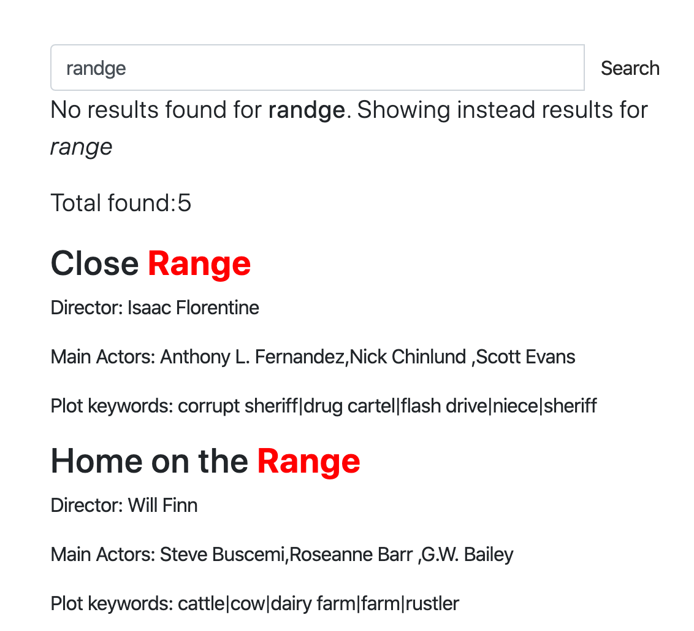

# 拼写校正

拼写校正，也称为：

* 自动更正
* 文本校正
* 修正拼写错误
* 键入容错
* “您是否是指？”

等等，是一种软件功能，可以建议或自动更正您输入的文本的替代方案。校正输入文本的概念可以追溯到1960年代，当时计算机科学家Warren Teitelman（也是“撤销”命令的发明者）引入了一种称为D.W.I.M.（“Do What I Mean”，即“按我的意图执行”）的计算哲学。Teitelman认为，计算机不应该仅被编程为接受格式完美的指令，而应该被编程为识别明显的错误。

第一个提供拼写校正功能的知名产品是1993年发布的Microsoft Word 6.0。

### 工作原理

拼写校正可以通过几种方式实现，但需要注意的是，没有纯粹的程序化方法可以将您误输入的“ipone”高质量地转换为“iphone”。大多数情况下，系统必须基于某个数据集。数据集可以是：

* 一个正确拼写的单词字典，该字典可以是：
  * 基于您的真实数据。这里的思路是，字典中大部分拼写是正确的，系统会尝试找到与输入单词最相似的单词（我们稍后将讨论如何使用Manticore实现这一点）。
  * 或者基于与您的数据无关的外部字典。这里可能出现的问题是，您的数据和外部字典可能差异太大：字典中可能缺少一些单词，而您的数据中可能缺少其他单词。
* 不仅基于字典，还具备上下文感知能力，例如“white ber”会被校正为“white bear”，而“dark ber”会被校正为“dark beer”。上下文可能不仅仅是查询中的相邻单词，还可能包括您的位置、时间、当前句子的语法（例如是否将“there”更正为“their”）、您的搜索历史，以及几乎所有可能影响您意图的其他因素。
* 另一种经典方法是使用之前的搜索查询作为拼写校正的数据集。这在[自动补全](../Searching/Autocomplete.md)功能中被更广泛地使用，但对自动更正也适用。其思路是，用户在拼写上大多是正确的，因此我们可以使用他们搜索历史中的单词作为事实来源，即使我们没有在文档中使用这些单词或使用外部字典。此处也可以实现上下文感知。

Manticore提供了模糊搜索选项以及可用于自动拼写校正的命令`CALL QSUGGEST`和`CALL SUGGEST`。

## 模糊搜索

模糊搜索功能通过考虑搜索查询中的细微变化或拼写错误，允许更灵活的匹配。它的工作方式类似于普通的`SELECT` SQL语句或`/search` JSON请求，但提供了额外的参数来控制模糊匹配行为。

> 注意：`fuzzy`选项需要[Manticore Buddy](../Installation/Manticore_Buddy.md)。如果不起作用，请确保已安装Buddy。

> 注意：`fuzzy`选项不适用于[多查询](../Searching/Multi-queries.md)。

## 通用语法

### SQL

<!-- example Fuzzy_Search_SQL -->

```sql
SELECT
  ...
  MATCH('...')
  ...
  OPTION fuzzy={0|1}
  [, distance=N]
  [, preserve={0|1}]
  [, layouts='{be,bg,br,ch,de,dk,es,fr,uk,gr,it,no,pt,ru,se,ua,us}']
}
```

注意：通过SQL进行模糊搜索时，MATCH子句不应包含任何全文本运算符，除了[短语搜索运算符](../Searching/Full_text_matching/Operators.md#Phrase-search-operator)，并且应仅包含您打算匹配的单词。

<!-- intro -->
##### SQL:

<!-- request SQL -->

```sql
SELECT * FROM mytable WHERE MATCH('someting') OPTION fuzzy=1, layouts='us,ua', distance=2;
```

<!-- request SQL with additional filters -->
带有附加筛选器的更复杂模糊搜索查询示例：

```sql
SELECT * FROM mytable WHERE MATCH('someting') OPTION fuzzy=1 AND (category='books' AND price < 20);
```

<!-- request JSON -->

```json
POST /search
{
  "table": "test",
  "query": {
    "bool": {
      "must": [
        {
          "match": {
            "*": "ghbdtn"
          }
        }
      ]
    }
  },
  "options": {
    "fuzzy": true,
    "layouts": ["us", "ru"],
    "distance": 2
  }
}
```

<!-- response SQL -->

```sql
+------+-------------+
| id   | content     |
+------+-------------+
|    1 | something   |
|    2 | some thing  |
+------+-------------+
2 rows in set (0.00 sec)
```

<!-- request SQL with preserve option -->

```sql
SELECT * FROM mytable WHERE MATCH('hello wrld') OPTION fuzzy=1, preserve=1;
```

<!-- request JSON with preserve option -->

```json
POST /search
{
  "table": "test",
  "query": {
    "bool": {
      "must": [
        {
          "match": {
            "*": "hello wrld"
          }
        }
      ]
    }
  },
  "options": {
    "fuzzy": true,
    "preserve": 1
  }
}
```

<!-- response SQL with preserve option -->

```sql
+------+-------------+
| id   | content     |
+------+-------------+
|    1 | hello wrld  |
|    2 | hello world |
+------+-------------+
2 rows in set (0.00 sec)
```

<!-- end -->

### JSON

```json
POST /search
{
  "table": "table_name",
  "query": {
    <full-text query>
  },
  "options": {
    "fuzzy": {true|false}
    [,"layouts": ["be","bg","br","ch","de","dk","es","fr","uk","gr","it","no","pt","ru","se","ua","us"]]
    [,"distance": N]
    [,"preserve": {0|1}]
  }
}
```

注意：如果您使用[query_string](../Searching/Full_text_matching/Basic_usage.md#query_string)，请注意它不支持除[短语搜索运算符](../Searching/Full_text_matching/Operators.md#Phrase-search-operator)以外的全文本运算符。查询字符串应仅包含您希望匹配的单词。

### 选项

- `fuzzy`：启用或关闭模糊搜索。
- `distance`：设置匹配的莱文斯坦距离。默认值为`2`。
- `preserve`：`0`或`1`（默认：`0`）。当设置为`1`时，在搜索结果中保留没有模糊匹配的单词（例如，“hello wrld”返回“hello wrld”和“hello world”）。当设置为`0`时，仅返回成功模糊匹配的单词（例如，“hello wrld”仅返回“hello world”）。对于保留可能在Manticore Search中不存在的短单词或专有名词特别有用。
- `layouts`：用于检测键盘布局不匹配导致的打字错误的键盘布局（例如，使用错误布局时输入“ghbdtn”而不是“привет”）。Manticore会比较不同布局中的字符位置以建议更正。要有效检测不匹配，至少需要2种布局。默认情况下不使用任何布局。使用空字符串`''`（SQL）或数组`[]`（JSON）来关闭此功能。支持的布局包括：
  - `be` - 比利时AZERTY布局
  - `bg` - 标准保加利亚布局
  - `br` - 巴西QWERTY布局
  - `ch` - 瑞士QWERTZ布局
  - `de` - 德国QWERTZ布局
  - `dk` - 丹麦QWERTY布局
  - `es` - 西班牙QWERTY布局
  - `fr` - 法国AZERTY布局
  - `uk` - 英国QWERTY布局
  - `gr` - 希腊QWERTY布局
  - `it` - 意大利QWERTY布局
  - `no` - 挪威QWERTY布局
  - `pt` - 葡萄牙QWERTY布局
  - `ru` - 俄语JCUKEN布局
  - `se` - 瑞典QWERTY布局
  - `ua` - 乌克兰JCUKEN布局
  - `us` - 美国QWERTY布局


### 链接

* <a href="https://github.manticoresearch.com/manticoresoftware/manticoresearch?query=fature&filters%5Bcomment%5D%5B%5D=28798446&filters%5Bcommon%5D%5Brepo_id%5D%5B%5D=95614931&sort=&search=keyword-search-fuzzy-layouts">此演示</a> 展示了模糊搜索功能：
  {.scale-0.7}
* 关于模糊搜索和自动补全的博客文章 - https://manticoresearch.com/blog/new-fuzzy-search-and-autocomplete/

## 调用 QSUGGEST，调用 SUGGEST

这两个命令都可以通过 SQL 访问，并支持查询本地（普通和实时）和分布式表。语法如下：
```sql
CALL QSUGGEST(<word or words>, <table name> [,options])
CALL SUGGEST(<word or words>, <table name> [,options])

options: N as option_name[, M as another_option, ...]
```

这些命令为给定单词提供字典中的所有建议。它们仅在启用了 [前缀匹配](../Creating_a_table/NLP_and_tokenization/Wildcard_searching_settings.md#min_infix_len) 并且 [dict=keywords](../Creating_a_table/NLP_and_tokenization/Low-level_tokenization.md#dict) 的表上工作。它们返回建议的关键词、建议关键词与原始关键词之间的莱文斯坦距离，以及建议关键词的文档统计信息。

如果第一个参数包含多个单词，则：
* `CALL QSUGGEST` 将仅返回 **最后一个** 单词的建议，忽略其余部分。
* `CALL SUGGEST` 将仅返回 **第一个** 单词的建议。

这是它们之间唯一的区别。支持以下选项进行自定义：

| 选项 | 描述 | 默认 |
| - | - | - |
| limit | 返回 N 个最佳匹配 | 5 |
| max_edits | 仅保留与原始关键词的莱文斯坦距离小于或等于 N 的字典单词 | 4 |
| result_stats | 提供找到的单词的莱文斯坦距离和文档数量 | 1（启用） |
| delta_len | 仅保留与原始单词长度差异小于 N 的字典单词 | 3 |
| max_matches | 保留的匹配数 | 25 |
| reject | 被拒绝的单词是那些不如匹配队列中已有单词的匹配项。它们被放入一个被拒绝队列中，如果其中一个实际上可以进入匹配队列，该队列会被重置。此参数定义了被拒绝队列的大小（作为 reject*max(max_matched,limit)）。如果被拒绝队列已满，引擎将停止寻找潜在匹配 | 4 |
| result_line | 通过返回所有建议、距离和文档每行显示数据的替代模式 | 0 |
| non_char | 不跳过包含非字母符号的字典单词 | 0（跳过此类单词） |
| sentence | 返回原始句子，同时将最后一个单词替换为匹配项 | 0（不返回完整句子） |
| force_bigrams | 强制使用二元组（2字符 n-gram）而不是三元组来处理所有单词长度，这可以改善具有换位错误的单词的匹配 | 0（对长度≥6的单词使用三元组） |
| search_mode | 通过在索引上执行搜索来细化建议。接受 `'phrase'` 用于精确短语匹配或 `'words'` 用于词袋匹配。启用时，添加一个 `found_docs` 列显示文档数量，并按 `found_docs` 降序、然后按 `distance` 升序重新排序结果 | N/A（默认禁用） |

为了展示其工作方式，让我们创建一个表并向其中添加几个文档。

```sql
create table products(title text) min_infix_len='2';
insert into products values (0,'Crossbody Bag with Tassel'), (0,'microfiber sheet set'), (0,'Pet Hair Remover Glove');
```
<!-- example single -->
##### 单词示例
如您所见，拼写错误的单词 "crossb**U**dy" 会被更正为 "crossbody"。默认情况下，`CALL SUGGEST/QSUGGEST` 返回：

* `distance` - 莱文斯坦距离，表示将给定单词转换为建议所需进行的编辑次数
* `docs` - 包含建议单词的文档数量

要禁用这些统计信息的显示，可以使用选项 `0 as result_stats`。


<!-- intro -->
##### 示例：

<!-- request Example -->

```sql
call suggest('crossbudy', 'products');
```
<!-- response Example -->

```sql
+-----------+----------+------+
| suggest   | distance | docs |
+-----------+----------+------+
| crossbody | 1        | 1    |
+-----------+----------+------+
```
<!-- end -->
<!-- example first -->
##### CALL SUGGEST 仅取第一个单词
如果第一个参数不是单个单词，而是多个单词，则 `CALL SUGGEST` 将仅返回第一个单词的建议。


<!-- intro -->
##### 示例：

<!-- request Example -->

```sql
call suggest('bagg with tasel', 'products');
```
<!-- response Example -->

```sql
+---------+----------+------+
| suggest | distance | docs |
+---------+----------+------+
| bag     | 1        | 1    |
+---------+----------+------+
```
<!-- end -->
<!-- example last -->
##### CALL QSUGGEST 仅取最后一个单词
如果第一个参数不是单个单词，而是多个单词，则 `CALL SUGGEST` 将仅返回最后一个单词的建议。


<!-- intro -->
##### 示例：

<!-- request Example -->

```sql
CALL QSUGGEST('bagg with tasel', 'products');
```
<!-- response Example -->

```sql
+---------+----------+------+
| suggest | distance | docs |
+---------+----------+------+
| tassel  | 1        | 1    |
+---------+----------+------+
```
<!-- end -->

<!-- example last2 -->

添加 `1 as sentence` 会使 `CALL QSUGGEST` 返回整个句子，其中最后一个单词被更正。

<!-- request Example -->
```sql
CALL QSUGGEST('bag with tasel', 'products', 1 as sentence);
```
<!-- response Example -->
```sql
+-------------------+----------+------+
| suggest           | distance | docs |
+-------------------+----------+------+
| bag with tassel   | 1        | 1    |
+-------------------+----------+------+
```
<!-- end -->

##### 不同的显示模式
`1 as result_line` 选项会改变建议在输出中的显示方式。与其在单独的行中显示每个建议，它会在单行中显示所有建议、距离和文档。以下是一个示例来演示这一点：

<!-- intro -->
##### 示例：

<!-- request Example -->

```sql
CALL QSUGGEST('bagg with tasel', 'products', 1 as result_line);
```
<!-- response Example -->

```sql
+----------+--------+
| name     | value  |
+----------+--------+
| suggests | tassel |
| distance | 1      |
| docs     | 1      |
+----------+--------+
```
<!-- end -->

##### 使用 force_bigrams 以更好地处理换位错误
`force_bigrams` 选项可以帮助处理具有换位错误的单词，例如 "ipohne" 与 "iphone"。通过使用二元组而不是三元组，算法可以更好地处理字符换位。

<!-- intro -->
##### 示例：

<!-- request Example -->

```sql
CALL SUGGEST('ipohne', 'products', 1 as force_bigrams);
```
<!-- response Example -->

```sql
+--------+----------+------+
| suggest| distance | docs |
+--------+----------+------+
| iphone | 2        | 1    |
+--------+----------+------+
```
<!-- end -->

##### 使用 search_mode 优化建议
`search_mode` 选项通过在索引上执行实际搜索来增强建议，以计算每个建议短语或单词组合包含多少文档。这有助于根据实际文档的相关性而不是仅字典统计信息对建议进行排序。

该选项接受两个值：
- `'phrase'` - 执行精确短语搜索。例如，当建议“带流苏的包”时，它会搜索精确短语 `"bag with tassel"` 并统计包含这些词作为相邻短语的文档数量。
- `'words'` - 执行词袋搜索。例如，当建议“带流苏的包”时，它会搜索 `bag with tassel`（不带引号），并统计包含所有这些词的文档数量，无论顺序或中间是否有其他词。

> 注意：当 `sentence` 被启用时（即输入包含多个词时），`search_mode` 选项才起作用。对于单词查询，`search_mode` 被忽略。

> 注意：**性能考虑**：每个建议候选都会触发一次独立的搜索查询。如果您需要评估许多候选，请考虑使用较低的 `limit` 值以减少执行的搜索次数。

当启用 `search_mode` 时，结果会包含一个 `found_docs` 列，显示每个建议的文档数量，并按 `found_docs` 降序重新排序，然后按 `distance` 升序排序。

<!-- intro -->
##### 带短语匹配的示例：

<!-- request Example -->

```sql
CALL QSUGGEST('bag with tasel', 'products', 1 as sentence, 'phrase' as search_mode);
```

<!-- response Example -->

```sql
+-------------------+----------+------+-------------+
| suggest           | distance | docs | found_docs  |
+-------------------+----------+------+-------------+
| bag with tassel   | 1        | 13   | 10          |
| bag with tazer    | 2        | 27   | 3           |
+-------------------+----------+------+-------------+
```

<!-- end -->

<!-- intro -->
##### 比较短语与词袋匹配的示例：

<!-- request Example -->

```sql
-- With phrase matching: finds exact phrases only
CALL QSUGGEST('test carp', 'products', 1 as sentence, 'phrase' as search_mode);

-- With words matching: finds documents with all words regardless of order
CALL QSUGGEST('test carp', 'products', 1 as sentence, 'words' as search_mode);
```

<!-- response Example -->

```sql
-- Phrase mode results:
+----------------+----------+------+-------------+
| suggest        | distance | docs | found_docs  |
+----------------+----------+------+-------------+
| test car       | 1        | 17   | 5           |
| test carpet    | 2        | 19   | 4           |
+----------------+----------+------+-------------+

-- Words mode results (more matches for "test carpet" due to word separation):
+----------------+----------+------+-------------+
| suggest        | distance | docs | found_docs  |
+----------------+----------+------+-------------+
| test carpet    | 2        | 19   | 19          |
| test car       | 1        | 17   | 5           |
+----------------+----------+------+-------------+
```

<!-- end -->

**理解差异**：
- **短语匹配** (`'phrase'`)：搜索精确序列。查询 `"test carpet"` 仅匹配包含这些词按此精确顺序出现的文档（例如，“test carpet cleaning”匹配，但“test the carpet”或“carpet test”不匹配）。
- **词袋匹配** (`'words'`)：搜索文档中包含所有词，顺序无关。查询 `test carpet` 匹配任何包含“test”和“carpet”的文档（例如，“test the carpet”、“test red carpet”、“carpet test”均匹配）。

### 示例演示

* [这个交互式课程](https://play.manticoresearch.com/didyoumean/) 展示了 `CALL SUGGEST` 在小型网络应用中的工作方式。

{.scale-0.5}


<!-- proofread -->

