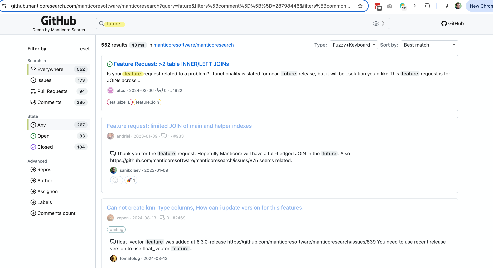

# 词纠正

词纠正，也被称为：

* 自动纠正
* 文本纠正
* 修正拼写错误
* 键入错误容忍
* "您是想说？"

等等，是一种软件功能，建议您输入文本的替代词或自动纠正您输入的文本。纠正键入文本的概念可以追溯到20世纪60年代，当时计算机科学家沃伦·泰特曼（Warren Teitelman）提出了“D.W.I.M.”（Do What I Mean）的计算哲学，他发明了“撤销”命令。泰特曼认为，计算机应该被编程为识别明显的错误，而不是只接受完美格式化的指令。

第一个提供词纠正功能的产品是1993年发布的Microsoft Word 6.0。

### 它是如何工作的

词纠正可以有几种方式，但需要注意的是，没有纯粹的程序化方式可以将您键入的“ipone”转换为“iphone”并保持高质量。大多数情况下，系统需要基于一个数据集。这个数据集可以是：

* 一个正确拼写的词典，这又可以是：
  * 基于您的实际数据。这里的理念是，词典中的大部分拼写是正确的，系统尝试找到与您键入的词最相似的词（我们稍后将用Manticore讨论如何做到这一点）。
  * 或者基于与您的数据无关的外部词典。这里可能出现的问题是，您的数据和外部词典可能差别太大：一些词可能在词典中缺失，而另一些词可能在您的数据中缺失。
* 不仅仅是基于词典，还可以是上下文感知的，例如，“white ber”会被纠正为“white bear”，而“dark ber”会被纠正为“dark beer”。上下文不仅可能是查询中的相邻词，还可以是您的位置、时间、当前句子的语法（是否需要将“there”改为“their”）、您的搜索历史，以及任何其他可能影响您意图的因素。
* 另一种经典的方法是使用之前的搜索查询作为词纠正的数据集。这在自动补全[功能](../Searching/Autocomplete.md)中更常用，但在自动纠正中也很有意义。理念是用户大多数时候拼写正确，因此我们可以使用他们搜索历史中的词作为事实来源，即使我们没有这些词在我们的文档中或使用外部词典。上下文感知也是可能的。

Manticore 提供了模糊搜索选项和 `CALL QSUGGEST` 和 `CALL SUGGEST` 命令，可以用于自动词纠正的目的。

## 模糊搜索

模糊搜索功能通过考虑搜索查询中的轻微变化或拼写错误，提供了更灵活的匹配。它的工作方式类似于标准的 `SELECT` SQL 语句或 `/search` JSON 请求，但提供了额外的参数来控制模糊匹配的行为。

> 注意：`fuzzy` 选项需要 [Manticore Buddy](../Installation/Manticore_Buddy.md)。如果不起作用，请确保已安装 Buddy。

> 注意：`fuzzy` 选项不适用于 [多查询](../Searching/Multi-queries.md)。

## 通用语法

### SQL

<!-- example Fuzzy_Search_SQL -->

```sql
SELECT
  ...
  MATCH('...')
  ...
  OPTION fuzzy={0|1}
  [, distance=N]
  [, preserve={0|1}]
  [, layouts='{be,bg,br,ch,de,dk,es,fr,uk,gr,it,no,pt,ru,se,ua,us}']
}
```

注意：通过 SQL 进行模糊搜索时，`MATCH` 子句不应包含任何全文本操作符，仅应包含您打算匹配的词。

<!-- intro -->
##### SQL：

<!-- request SQL -->

```sql
SELECT * FROM mytable WHERE MATCH('someting') OPTION fuzzy=1, layouts='us,ua', distance=2;
```

<!-- request SQL with additional filters -->
具有附加过滤器的更复杂的模糊搜索查询示例：

```sql
SELECT * FROM mytable WHERE MATCH('someting') OPTION fuzzy=1 AND (category='books' AND price < 20);
```

<!-- request JSON -->

```json
POST /search
{
  "table": "test",
  "query": {
    "bool": {
      "must": [
        {
          "match": {
            "*": "ghbdtn"
          }
        }
      ]
    }
  },
  "options": {
    "fuzzy": true,
    "layouts": ["us", "ru"],
    "distance": 2
  }
}
```

<!-- response SQL -->

```sql
+------+-------------+
| id   | content     |
+------+-------------+
|    1 | something   |
|    2 | some thing  |
+------+-------------+
2 rows in set (0.00 sec)
```

<!-- request SQL with preserve option -->

```sql
SELECT * FROM mytable WHERE MATCH('hello wrld') OPTION fuzzy=1, preserve=1;
```

<!-- request JSON with preserve option -->

```json
POST /search
{
  "table": "test",
  "query": {
    "bool": {
      "must": [
        {
          "match": {
            "*": "hello wrld"
          }
        }
      ]
    }
  },
  "options": {
    "fuzzy": true,
    "preserve": 1
  }
}
```

<!-- response SQL with preserve option -->

```sql
+------+-------------+
| id   | content     |
+------+-------------+
|    1 | hello wrld  |
|    2 | hello world |
+------+-------------+
2 rows in set (0.00 sec)
```

<!-- end -->

### JSON

```json
POST /search
{
  "table": "table_name",
  "query": {
    <full-text query>
  },
  "options": {
    "fuzzy": {true|false}
    [,"layouts": ["be","bg","br","ch","de","dk","es","fr","uk","gr","it","no","pt","ru","se","ua","us"]]
    [,"distance": N]
    [,"preserve": {0|1}]
  }
}
```

注意：如果您使用了 [query_string](../Searching/Full_text_matching/Basic_usage.md#query_string)，请意识到它不支持任何全文本操作符，除了 [短语搜索操作符](../Searching/Full_text_matching/Operators.md#Phrase-search-operator)。query_string 应仅包含您希望匹配的词。

### 选项

- `fuzzy`：开启或关闭模糊搜索。
- `distance`：设置匹配的 Levenshtein 距离。默认值为 `2`。
- `preserve`：`0` 或 `1`（默认值：`0`）。设置为 `1` 时，保留没有模糊匹配的词（例如，“hello wrld”返回“hello wrld”和“hello world”）。设置为 `0` 时，仅返回成功匹配的词（例如，“hello wrld”仅返回“hello world”）。特别适用于保留短词或可能不存在于 Manticore Search 中的专有名词。
- `layouts`：键盘布局，用于检测由于键盘布局错误引起的输入错误（例如，使用错误布局时键入“ghbdtn”而不是“привет”）。Manticore 比较不同布局中的字符位置以提出建议的纠正。至少需要两个布局才能有效检测错误。默认不使用任何布局。使用空字符串 `''`（SQL）或数组 `[]`（JSON）关闭此功能。支持的布局包括：
  - `be` - 比利时 AZERTY 布局
  - `bg` - 标准保加利亚布局
  - `br` - 巴西 QWERTY 布局
  - `ch` - 瑞士 QWERTZ 布局
  - `de` - 德国 QWERTZ 布局
  - `dk` - 丹麦 QWERTY 布局
  - `es` - 西班牙 QWERTY 布局
  - `fr` - 法国 AZERTY 布局
  - `uk` - 英国 QWERTY 布局
  - `gr` - 希腊 QWERTY 布局
  - `it` - 意大利 QWERTY 布局
  - `no` - 挪威 QWERTY 布局
  - `pt` - 葡萄牙 QWERTY 布局
  - `ru` - 俄罗斯 JCUKEN 布局
  - `se` - 瑞典 QWERTY 布局
  - `ua` - 乌克兰 JCUKEN 布局
  - `us` - 美国 QWERTY 布局


### 链接

* <a href="https://github.manticoresearch.com/manticoresoftware/manticoresearch?query=fature&filters%5Bcomment%5D%5B%5D=28798446&filters%5Bcommon%5D%5Brepo_id%5D%5B%5D=95614931&sort=&search=keyword-search-fuzzy-layouts">此演示</a>展示了模糊搜索功能：
  {.scale-0.7}
* 关于模糊搜索和自动补全的博客文章 - <https://manticoresearch.com/blog/new-fuzzy-search-and-autocomplete/>

## 调用 QSUGGEST，调用 SUGGEST

这两个命令可以通过 SQL 访问，并支持查询本地（普通和实时）和分布式表。语法如下：
```sql
CALL QSUGGEST(<word or words>, <table name> [,options])
CALL SUGGEST(<word or words>, <table name> [,options])

options: N as option_name[, M as another_option, ...]
```

这些命令为给定单词提供字典中的所有建议。它们仅在启用了 [前缀匹配](../Creating_a_table/NLP_and_tokenization/Wildcard_searching_settings.md#min_infix_len) 和 [dict=keywords](../Creating_a_table/NLP_and_tokenization/Low-level_tokenization.md#dict) 的表上工作。它们返回建议的关键词、建议关键词与原始关键词之间的莱文斯坦距离以及建议关键词的文档统计信息。

如果第一个参数包含多个单词，则：
* `CALL QSUGGEST` 将仅返回最后一个单词的建议，忽略其余单词。
* `CALL SUGGEST` 将仅返回第一个单词的建议。

这就是它们之间的唯一区别。支持以下几种自定义选项：

| 选项 | 描述 | 默认值 |
| - | - | - |
| limit | 返回前 N 个匹配项 | 5 |
| max_edits | 仅保留莱文斯坦距离小于或等于 N 的字典词 | 4 |
| result_stats | 提供找到的词的莱文斯坦距离和文档计数 | 1（启用） |
| delta_len | 仅保留长度差异小于 N 的字典词 | 3 |
| max_matches | 保留的匹配项数量 | 25 |
| reject | 被拒绝的词是那些不如匹配队列中已有的词好的词。它们被放入一个被拒绝的队列中，如果一个词实际上可以进入匹配队列，则该队列会被重置。此参数定义了被拒绝队列的大小（即 reject*max(max_matched,limit)）。如果被拒绝队列已满，则引擎停止寻找潜在匹配项 | 4 |
| result_line | 通过返回所有建议、距离和文档每行一个来显示数据的替代模式 | 0 |
| non_char | 不跳过包含非字母符号的字典词 | 0（跳过此类词） |
| sentence | 返回原始句子以及最后一个词被匹配词替换后的句子。 | 0（不返回完整句子） |
| force_bigrams | 强制使用大词组（2 字符 n-gram）而不是三元组，这可以提高对于字符移位错误的词的匹配效果 | 0（对于长度≥6 的词使用三元组） |

为了展示如何使用这些命令，让我们创建一个表并为其添加一些文档。

```sql
create table products(title text) min_infix_len='2';
insert into products values (0,'Crossbody Bag with Tassel'), (0,'microfiber sheet set'), (0,'Pet Hair Remover Glove');
```
<!-- example single -->
##### 单词示例
如您所见，拼写错误的单词 "crossb**U**dy" 被纠正为 "crossbody"。默认情况下，`CALL SUGGEST/QSUGGEST` 返回：

* `distance` - 莱文斯坦距离，表示将给定单词转换为建议词需要进行多少次编辑
* `docs` - 包含建议词的文档数量

要禁用这些统计信息的显示，可以使用 `0 as result_stats` 选项。


<!-- intro -->
##### 示例：

<!-- request Example -->

```sql
call suggest('crossbudy', 'products');
```
<!-- response Example -->

```sql
+-----------+----------+------+
| suggest   | distance | docs |
+-----------+----------+------+
| crossbody | 1        | 1    |
+-----------+----------+------+
```
<!-- end -->
<!-- example first -->
##### CALL SUGGEST 只处理第一个单词
如果第一个参数不是一个单个单词，而是多个单词，则 `CALL SUGGEST` 将仅返回第一个单词的建议。


<!-- intro -->
##### 示例：

<!-- request Example -->

```sql
call suggest('bagg with tasel', 'products');
```
<!-- response Example -->

```sql
+---------+----------+------+
| suggest | distance | docs |
+---------+----------+------+
| bag     | 1        | 1    |
+---------+----------+------+
```
<!-- end -->
<!-- example last -->
##### CALL QSUGGEST 只处理最后一个单词
如果第一个参数不是一个单个单词，而是多个单词，则 `CALL SUGGEST` 将仅返回最后一个单词的建议。


<!-- intro -->
##### 示例：

<!-- request Example -->

```sql
CALL QSUGGEST('bagg with tasel', 'products');
```
<!-- response Example -->

```sql
+---------+----------+------+
| suggest | distance | docs |
+---------+----------+------+
| tassel  | 1        | 1    |
+---------+----------+------+
```
<!-- end -->

<!-- example last2 -->

添加 `1 as sentence` 使 `CALL QSUGGEST` 返回整个句子，最后一个词被纠正。

<!-- request Example -->
```sql
CALL QSUGGEST('bag with tasel', 'products', 1 as sentence);
```
<!-- response Example -->
```sql
+-------------------+----------+------+
| suggest           | distance | docs |
+-------------------+----------+------+
| bag with tassel   | 1        | 1    |
+-------------------+----------+------+
```
<!-- end -->

##### 不同的显示模式
`1 as result_line` 选项改变了输出中建议的显示方式。不再每行显示一个建议，而是将所有建议、距离和文档信息显示在一行中。这里有一个示例来演示这一点：

<!-- intro -->
##### 示例：

<!-- request Example -->

```sql
CALL QSUGGEST('bagg with tasel', 'products', 1 as result_line);
```
<!-- response Example -->

```sql
+----------+--------+
| name     | value  |
+----------+--------+
| suggests | tassel |
| distance | 1      |
| docs     | 1      |
+----------+--------+
```
<!-- end -->

##### 使用 force_bigrams 以更好地处理字符移位
`force_bigrams` 选项可以帮助处理具有字符移位错误的词，例如 "ipohne" 与 "iphone"。通过使用大词组而不是三元组，算法可以更好地处理字符移位。

<!-- intro -->
##### 示例：

<!-- request Example -->

```sql
CALL SUGGEST('ipohne', 'products', 1 as force_bigrams);
```
<!-- response Example -->

```sql
+--------+----------+------+
| suggest| distance | docs |
+--------+----------+------+
| iphone | 2        | 1    |
+--------+----------+------+
```
<!-- end -->

### 演示

* [此互动课程](https://play.manticoresearch.com/didyoumean/)展示了 `CALL SUGGEST` 在一个小型网络应用中的工作方式。

{.scale-0.5}


<!-- proofread -->

