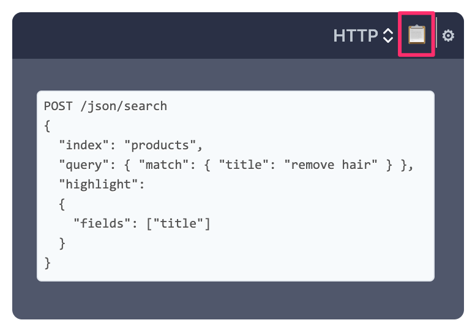

# पहले यह पढ़ें

## इस मैनुअल के बारे में

यह मैनुअल इस तरह से व्यवस्थित किया गया है ताकि आप Manticore का उपयोग कैसे करेंगे:

* इसके बारे में मूल जानकारी और इसे इंस्टाल और कनेक्ट करने के तरीके से शुरू करना

* महत्वपूर्ण चीजें जैसे दस्तावेज़ों को जोड़ना और खोजें चलाना

* प्रदर्शन अनुकूलन टिप्स, ट्रिक्स और प्लगइन्स और कस्टम फ़ंक्शनों की मदद से Manticore को विस्तारित करना

##### 1️⃣ 2️⃣ 3️⃣ छोड़ें नहीं

मैनुअल के मुख्य अनुभागों को आपकी सुविधा के लिए मेनू में 1️⃣, 2️⃣, 3️⃣ आदि के साथ चिह्नित किया गया है क्योंकि उनकी संबंधित कार्यक्षमता सबसे अधिक उपयोग की जाती है। यदि आप Manticore के नए उपयोगकर्ता हैं **हम अत्यधिक अनुशंसा करते हैं कि उन्हें छोड़ें नहीं**।

##### त्वरित प्रारंभ गाइड

यदि आप सामान्य रूप से Manticore कैसे काम करता है, इसकी त्वरित समझ की तलाश में हैं [⚡ त्वरित प्रारंभ गाइड](Quick_start_guide.md) एक अच्छा जगह है शुरू करने के लिए।

##### उदाहरण का उपयोग करना

प्रत्येक क्वेरी उदाहरण के शीर्ष-दाईं कोने में एक छोटा आइकन 📋 है:

आप इसका उपयोग उदाहरणों को क्लिपबोर्ड पर कॉपी करने के लिए कर सकते हैं। **यदि क्वेरी एक HTTP अनुरोध है, तो इसे CURL कमांड के रूप में कॉपी किया जाएगा**। यदि आप ⚙️ दबाते हैं तो आप होस्ट/पोर्ट को कॉन्फ़िगर कर सकते हैं।

##### इस मैनुअल में खोजें

हमें खोज पसंद है और हमने इस मैनुअल में खोज को यथासंभव सुविधाजनक बनाने के लिए अपनी ओर से सबसे अच्छा किया है। बेशक, यह Manticore खोज द्वारा समर्थित है। मैनुअल को पहले खोलने की आवश्यकता के बिना कुछ खोजने का एक बहुत आसान तरीका है **mnt.cr/your-search-keyword** खोलकर:

## सर्वोत्तम प्रथाएँ

Manticore Search के बारे में कुछ चीजें हैं जिन्हें आपको समझने की आवश्यकता है जो आपको इसका उपयोग करने की सर्वोत्तम प्रथाओं का पालन करने में मदद कर सकती हैं।

#### वास्तविक-समय तालिका बनाम सामान्य तालिका

* **[वास्तविक-समय तालिका](Creating_a_table/Local_tables/Real-time_table.md)** दस्तावेज़ों को तुरंत उपलब्धता के साथ जोड़ने, अपडेट करने और हटाने की अनुमति देती है।

* **[साधारण तालिका](Creating_a_table/Local_tables/Plain_table.md)** एक मुख्यतः अपरिवर्तनीय डेटा संरचना है और वास्तविक-समय की तालिकाओं द्वारा उपयोग किए जाने वाले मूल तत्व है। साधारण तालिका एक सेट दस्तावेजों, उनके सामान्य शब्दकोश और अनुक्रमण सेटिंग्स को संग्रहीत करती है। एक वास्तविक-समय तालिका कई साधारण तालिकाओं (चंक) का निर्माण कर सकती है, लेकिन **इसके अलावा Manticore साधारण तालिकाओं के निर्माण के लिए सीधे पहुँच प्रदान करती है** जिसमें टूल [इंडेक्सर](Data_creation_and_modification/Adding_data_from_external_storages/Plain_tables_creation.md#Indexer-tool) शामिल है। यह तब समझ में आता है जब आपका डेटा मुख्यतः अपरिवर्तनीय हो, इसलिए इसके लिए आपको वास्तविक-समय तालिका की आवश्यकता नहीं है।

