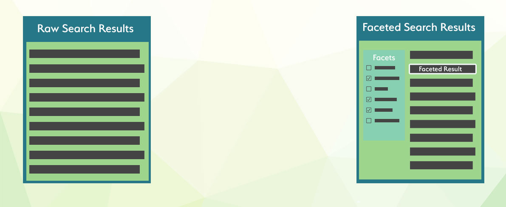

# फ़ैसटेड खोज

फ़ैसटेड खोज एक आधुनिक खोज एप्लिकेशन के लिए उतनी ही महत्वपूर्ण है जितनी कि [ऑटोकम्प्लीट](../Searching/Autocomplete.md), [वर्तनी सुधार](../Searching/Spell_correction.md), और खोज कीवर्ड [हाइलाइटिंग](../Searching/Highlighting.md), विशेष रूप से ई-कॉमर्स उत्पादों में।



फ़ैसटेड खोज तब मददगार साबित होती है जब बड़ी मात्रा में डेटा और विभिन्न आपस में जुड़े गुणों, जैसे आकार, रंग, निर्माता या अन्य कारकों के साथ काम करना होता है। विशाल मात्रा में डेटा को क्वेरी करते समय, खोज परिणाम अक्सर कई प्रविष्टियाँ शामिल करते हैं जो उपयोगकर्ता की अपेक्षाओं से मेल नहीं खातीं। फ़ैसटेड खोज अंतिम उपयोगकर्ता को स्पष्ट रूप से परिभाषित करने की अनुमति देती है कि वे अपने खोज परिणामों में क्या संतोषजनक मानते हैं।

Manticore Search में, एक ऑप्टिमाइजेशन है जो मूल क्वेरी के परिणाम सेट को बनाए रखता है और प्रत्येक फ़ैसट गणना के लिए इसे फिर से उपयोग करता है। चूँकि संकलन पहले से गणना की गई दस्तावेजों के उपसेट पर लागू होते हैं, ये तेज होते हैं, और कुल निष्पादन समय अक्सर प्रारंभिक क्वेरी से केवल थोड़ा लंबा हो सकता है। किसी भी क्वेरी में फ़ैसट जोड़ा जा सकता है, और फ़ैसट किसी भी गुण या अभिव्यक्ति हो सकता है। फ़ैसट परिणाम में फ़ैसट मान और फ़ैसट गिनती शामिल होती है। फ़ैसट को SQL `SELECT` स्टेटमेंट का उपयोग करके क्वेरी के अंत में घोषित करके एक्सेस किया जा सकता है।

## संकलन

<!-- उदाहरण संकलन -->
### SQL
फ़ैसट मान एक गुण, JSON गुण के भीतर एक JSON गुण या एक अभिव्यक्ति से उत्पन्न हो सकते हैं। फ़ैसट मानों को उपनामित भी किया जा सकता है, लेकिन **उपनाम सभी परिणाम सेटों (मुख्य क्वेरी परिणाम सेट और अन्य फ़ैसट परिणाम सेटों) में अद्वितीय होना चाहिए**। फ़ैसट मान संकलित गुण/अभिव्यक्ति से व्युत्पन्न होता है, लेकिन यह किसी अन्य गुण/अभिव्यक्ति से भी आ सकता है।

```sql
FACET {expr_list} [BY {expr_list} ] [DISTINCT {field_name}] [ORDER BY {expr | FACET()} {ASC | DESC}] [LIMIT [offset,] count]
```

एक से अधिक फ़ैसट घोषणाओं को एक रिक्त स्थान से अलग किया जाना चाहिए।

### HTTP JSON

फ़ैसट को `aggs` नोड में परिभाषित किया जा सकता है:

``` json
     "aggs" :
     {
        "group name" :
         {
            "terms" :
             {
              "field":"attribute name",
              "size": 1000
             }
             "sort": [ {"attribute name": { "order":"asc" }} ]
         }
     }
```

जहाँ:
* `group name` एक उपनाम है जो संकलन को सौंपा गया है
* `field` मान में उस गुण या अभिव्यक्ति का नाम होना चाहिए जिसे फ़ैसट किया जा रहा है
* वैकल्पिक `size` परिणाम में शामिल करने के लिए अधिकतम बाल्टियों की संख्या निर्दिष्ट करता है। जब निर्दिष्ट नहीं किया जाता है, तो यह मुख्य क्वेरी की सीमा को विरासत में ले लेता है। अधिक विवरण [फ़ैसट परिणाम का आकार](../Searching/Faceted_search.md#Size-of-facet-result) अनुभाग में पाया जा सकता है।
* वैकल्पिक `sort` गुणों और/या अतिरिक्त गुणों का एक ऐरे निर्दिष्ट करता है, जो मुख्य क्वेरी में ["sort" पैरामीटर](../Searching/Sorting_and_ranking.md#Sorting-via-JSON) जैसा ही सिंटैक्स का उपयोग करता है।

परिणाम सेट में लौटाए गए फ़ैसट के साथ एक `aggregations` नोड शामिल होगा, जहाँ `key` संकलित मान है और `doc_count` संकलन की गिनती है।

``` json
    "aggregations": {
        "group name": {
        "buckets": [
            {
                "key": 10,
                "doc_count": 1019
            },
            {
                "key": 9,
                "doc_count": 954
            },
            {
                "key": 8,
                "doc_count": 1021
            },
            {
                "key": 7,
                "doc_count": 1011
            },
            {
                "key": 6,
                "doc_count": 997
            }
            ]
        }
    }   
```

<!-- परिचय -->
##### SQL:

<!-- अनुरोध SQL -->

```sql
SELECT *, price AS aprice FROM facetdemo LIMIT 10 FACET price LIMIT 10 FACET brand_id LIMIT 5;
```

<!-- उत्तर SQL -->

```sql
+------+-------+----------+---------------------+------------+-------------+---------------------------------------+------------+--------+
| id   | price | brand_id | title               | brand_name | property    | j                                     | categories | aprice |
+------+-------+----------+---------------------+------------+-------------+---------------------------------------+------------+--------+
|    1 |   306 |        1 | Product Ten Three   | Brand One  | Six_Ten     | {"prop1":66,"prop2":91,"prop3":"One"} | 10,11      |    306 |
|    2 |   400 |       10 | Product Three One   | Brand Ten  | Four_Three  | {"prop1":69,"prop2":19,"prop3":"One"} | 13,14      |    400 |
...
|    9 |   560 |        6 | Product Two Five    | Brand Six  | Eight_Two   | {"prop1":90,"prop2":84,"prop3":"One"} | 13,14      |    560 |
|   10 |   229 |        9 | Product Three Eight | Brand Nine | Seven_Three | {"prop1":84,"prop2":39,"prop3":"One"} | 12,13      |    229 |
+------+-------+----------+---------------------+------------+-------------+---------------------------------------+------------+--------+
10 rows in set (0.00 sec)
+-------+----------+
| price | count(*) |
+-------+----------+
|   306 |        7 |
|   400 |       13 |
...
|   229 |        9 |
|   595 |       10 |
+-------+----------+
10 rows in set (0.00 sec)
+----------+----------+
| brand_id | count(*) |
+----------+----------+
|        1 |     1013 |
|       10 |      998 |
|        5 |     1007 |
|        8 |     1033 |
|        7 |      965 |
+----------+----------+
5 rows in set (0.00 sec)
```
<!-- परिचय -->
##### JSON:

<!-- अनुरोध JSON -->

```json
POST /search -d '
    {
     "table" : "facetdemo",
     "query" : {"match_all" : {} },
     "limit": 5,
     "aggs" :
     {
        "group_property" :
         {
            "terms" :
             {
              "field":"price"
             }
         },
        "group_brand_id" :
         {
            "terms" :
             {
              "field":"brand_id"
             }
         }
     }
    }
'
```

<!-- response JSON -->

```json
{
  "took": 3,
  "timed_out": false,
  "hits": {
    "total": 10000,
    "hits": [
      {
        "_id": 1,
        "_score": 1,
        "_source": {
          "price": 197,
          "brand_id": 10,
          "brand_name": "Brand Ten",
          "categories": [
            10
          ]
        }
      },
 ...
      {
        "_id": 5,
        "_score": 1,
        "_source": {
          "price": 805,
          "brand_id": 7,
          "brand_name": "Brand Seven",
          "categories": [
            11,
            12,
            13
          ]
        }
      }
    ]
  },
  "aggregations": {
    "group_property": {
      "buckets": [
        {
          "key": 1000,
          "doc_count": 11
        },
        {
          "key": 999,
          "doc_count": 12
        },
...
        {
          "key": 991,
          "doc_count": 7
        }
      ]
    },
    "group_brand_id": {
      "buckets": [
        {
          "key": 10,
          "doc_count": 1019
        },
        {
          "key": 9,
          "doc_count": 954
        },
        {
          "key": 8,
          "doc_count": 1021
        },
        {
          "key": 7,
          "doc_count": 1011
        },
        {
          "key": 6,
          "doc_count": 997
        }
      ]
    }
  }
}
```

<!-- intro -->
##### PHP:

<!-- request PHP -->
```php
$index->setName('facetdemo');
$search = $index->search('');
$search->limit(5);
$search->facet('price','price');
$search->facet('brand_id','group_brand_id');
$results = $search->get();
```
<!-- response PHP -->
```php
Array
(
    [price] => Array
        (
            [buckets] => Array
                (
                    [0] => Array
                        (
                            [key] => 1000
                            [doc_count] => 11
                        )
                    [1] => Array
                        (
                            [key] => 999
                            [doc_count] => 12
                        )
                    [2] => Array
                        (
                            [key] => 998
                            [doc_count] => 7
                        )
                    [3] => Array
                        (
                            [key] => 997
                            [doc_count] => 14
                        )
                    [4] => Array
                        (
                            [key] => 996
                            [doc_count] => 8
                        )
                )
        )
    [group_brand_id] => Array
        (
            [buckets] => Array
                (
                    [0] => Array
                        (
                            [key] => 10
                            [doc_count] => 1019
                        )
                    [1] => Array
                        (
                            [key] => 9
                            [doc_count] => 954
                        )
                    [2] => Array
                        (
                            [key] => 8
                            [doc_count] => 1021
                        )
                    [3] => Array
                        (
                            [key] => 7
                            [doc_count] => 1011
                        )
                    [4] => Array
                        (
                            [key] => 6
                            [doc_count] => 997
                        )
                )
        )
)
```

<!-- intro -->
##### Python:

<!-- request Python -->
```python
res =searchApi.search({"table":"facetdemo","query":{"match_all":{}},"limit":5,"aggs":{"group_property":{"terms":{"field":"price",}},"group_brand_id":{"terms":{"field":"brand_id"}}}})
```
<!-- response Python -->
```python
{'aggregations': {u'group_brand_id': {u'buckets': [{u'doc_count': 1019,
                                                    u'key': 10},
                                                   {u'doc_count': 954,
                                                    u'key': 9},
                                                   {u'doc_count': 1021,
                                                    u'key': 8},
                                                   {u'doc_count': 1011,
                                                    u'key': 7},
                                                   {u'doc_count': 997,
                                                    u'key': 6}]},
                  u'group_property': {u'buckets': [{u'doc_count': 11,
                                                    u'key': 1000},
                                                   {u'doc_count': 12,
                                                    u'key': 999},
                                                   {u'doc_count': 7,
                                                    u'key': 998},
                                                   {u'doc_count': 14,
                                                    u'key': 997},
                                                   {u'doc_count': 8,
                                                    u'key': 996}]}},
 'hits': {'hits': [{u'_id': u'1',
                    u'_score': 1,
                    u'_source': {u'brand_id': 10,
                                 u'brand_name': u'Brand Ten',
u'categories': [10],
                                 u'price': 197,
                                 u'property': u'छह',
                                 u'title': u'उत्पाद आठ एक'}},
                   {u'_id': u'2',
                    u'_score': 1,
                    u'_source': {u'brand_id': 6,
                                 u'brand_name': u'ब्रांड छह',
                                 u'categories': [12, 13, 14],
                                 u'price': 671,
                                 u'property': u'चार',
                                 u'title': u'उत्पाद नौ सात'}},
                   {u'_id': u'3',
                    u'_score': 1,
                    u'_source': {u'brand_id': 3,
                                 u'brand_name': u'ब्रांड तीन',
                                 u'categories': [13, 14, 15],
                                 u'price': 92,
                                 u'property': u'छह',
                                 u'title': u'उत्पाद पांच चार'}},
                   {u'_id': u'4',
                    u'_score': 1,
                    u'_source': {u'brand_id': 10,
                                 u'brand_name': u'ब्रांड दस',
                                 u'categories': [11],
                                 u'price': 713,
                                 u'property': u'पांच',
                                 u'title': u'उत्पाद आठ नौ'}},
                   {u'_id': u'5',
                    u'_score': 1,
                    u'_source': {u'brand_id': 7,
                                 u'brand_name': u'ब्रांड सात',
                                 u'categories': [11, 12, 13],
                                 u'price': 805,
                                 u'property': u'दो',
                                 u'title': u'उत्पाद दस तीन'}}],
          'max_score': None,
          'total': 10000},
 'profile': None,
 'timed_out': False,
 'took': 4}

```

<!-- intro -->
##### Python-asyncio:

<!-- request Python-asyncio -->
```python
res = await searchApi.search({"table":"facetdemo","query":{"match_all":{}},"limit":5,"aggs":{"group_property":{"terms":{"field":"price",}},"group_brand_id":{"terms":{"field":"brand_id"}}}})
```
<!-- response Python-asyncio -->
```python
{'aggregations': {u'group_brand_id': {u'buckets': [{u'doc_count': 1019,
                                                    u'key': 10},
                                                   {u'doc_count': 954,
                                                    u'key': 9},
                                                   {u'doc_count': 1021,
                                                    u'key': 8},
                                                   {u'doc_count': 1011,
                                                    u'key': 7},
                                                   {u'doc_count': 997,
                                                    u'key': 6}]},
                  u'group_property': {u'buckets': [{u'doc_count': 11,
                                                    u'key': 1000},
                                                   {u'doc_count': 12,
                                                    u'key': 999},
                                                   {u'doc_count': 7,
                                                    u'key': 998},
                                                   {u'doc_count': 14,
                                                    u'key': 997},
                                                   {u'doc_count': 8,
                                                    u'key': 996}]}},
 'hits': {'hits': [{u'_id': u'1',
                    u'_score': 1,
                    u'_source': {u'brand_id': 10,
                                 u'brand_name': u'ब्रांड दस',
                                 u'categories': [10],
                                 u'price': 197,
                                 u'property': u'छह',
                                 u'title': u'उत्पाद आठ एक'}},
                   {u'_id': u'2',
                    u'_score': 1,
                    u'_source': {u'brand_id': 6,
                                 u'brand_name': u'ब्रांड छह',
                                 u'categories': [12, 13, 14],
                                 u'price': 671,
                                 u'property': u'चार',
                                 u'title': u'उत्पाद नौ सात'}},
                   {u'_id': u'3',
                    u'_score': 1,
                    u'_source': {u'brand_id': 3,
                                 u'brand_name': u'ब्रांड तीन',
                                 u'categories': [13, 14, 15],
                                 u'price': 92,
                                 u'property': u'छह',
                                 u'title': u'उत्पाद पांच चार'}},
                   {u'_id': u'4',
                    u'_score': 1,
                    u'_source': {u'brand_id': 10,
                                 u'brand_name': u'ब्रांड दस',
                                 u'categories': [11],
                                 u'price': 713,
                                 u'property': u'पांच',
                                 u'title': u'उत्पाद आठ नौ'}},
                   {u'_id': u'5',
                    u'_score': 1,
                    u'_source': {u'brand_id': 7,
                                 u'brand_name': u'ब्रांड सात',
                                 u'categories': [11, 12, 13],
                                 u'price': 805,
                                 u'property': u'दो',
                                 u'title': u'उत्पाद दस तीन'}}],
          'max_score': None,
          'total': 10000},
 'profile': None,
 'timed_out': False,
 'took': 4}

```

<!-- intro -->
##### जावास्क्रिप्ट:

<!-- request Javascript -->
```javascript
res =  await searchApi.search({"table":"facetdemo","query":{"match_all":{}},"limit":5,"aggs":{"group_property":{"terms":{"field":"price",}},"group_brand_id":{"terms":{"field":"brand_id"}}}});
```
<!-- response Javascript -->
```javascript
{"took":0,"timed_out":false,"hits":{"total":10000,"hits":[{"_id": 1,"_score":1,"_source":{"price":197,"brand_id":10,"brand_name":"Brand Ten","categories":[10],"title":"Product Eight One","property":"Six"}},{"_id": 2,"_score":1,"_source":{"price":671,"brand_id":6,"brand_name":"Brand Six","categories":[12,13,14],"title":"Product Nine Seven","property":"Four"}},{"_id": 3,"_score":1,"_source":{"price":92,"brand_id":3,"brand_name":"Brand Three","categories":[13,14,15],"title":"Product Five Four","property":"Six"}},{"_id": 4,"_score":1,"_source":{"price":713,"brand_id":10,"brand_name":"Brand Ten","categories":[11],"title":"Product Eight Nine","property":"Five"}},{"_id": 5,"_score":1,"_source":{"price":805,"brand_id":7,"brand_name":"Brand Seven","categories":[11,12,13],"title":"Product Ten Three","property":"Two"}}]}}

```

<!-- intro -->
##### जावा:

<!-- request Java -->
```java
aggs = new HashMap<String,Object>(){{
    put("group_property", new HashMap<String,Object>(){{
        put("terms", new HashMap<String,Object>(){{
                put("field","price");


        }});
    }});
    put("group_brand_id", new HashMap<String,Object>(){{
        put("terms", new HashMap<String,Object>(){{
                put("field","brand_id");


        }});
    }});            
}};

searchRequest = new SearchRequest();
searchRequest.setIndex("facetdemo");        
searchRequest.setLimit(5);
query = new HashMap<String,Object>();
query.put("match_all",null);
searchRequest.setQuery(query);
searchRequest.setAggs(aggs);
searchResponse = searchApi.search(searchRequest);

```
<!-- response Java -->
```java
class SearchResponse {
    took: 0
    timedOut: false
    aggregations: {group_property={buckets=[{key=1000, doc_count=11}, {key=999, doc_count=12}, {key=998, doc_count=7}, {key=997, doc_count=14}, {key=996, doc_count=8}]}, group_brand_id={buckets=[{key=10, doc_count=1019}, {key=9, doc_count=954}, {key=8, doc_count=1021}, {key=7, doc_count=1011}, {key=6, doc_count=997}]}}
    hits: class SearchResponseHits {
        maxScore: null
        total: 10000
        hits: [{_id=1, _score=1, _source={price=197, brand_id=10, brand_name=Brand Ten, categories=[10], title=Product Eight One, property=Six}}, {_id=2, _score=1, _source={price=671, brand_id=6, brand_name=Brand Six, categories=[12, 13, 14], title=Product Nine Seven, property=Four}}, {_id=3, _score=1, _source={price=92, brand_id=3, brand_name=Brand Three, categories=[13, 14, 15], title=Product Five Four, property=Six}}, {_id=4, _score=1, _source={price=713, brand_id=10, brand_name=Brand Ten, categories=[11], title=Product Eight Nine, property=Five}}, {_id=5, _score=1, _source={price=805, brand_id=7, brand_name=Brand Seven, categories=[11, 12, 13], title=Product Ten Three, property=Two}}]
    }
    profile: null
}
```

<!-- intro -->
##### सी#:

<!-- request C# -->
```clike
var agg1 = new Aggregation("group_property", "price");
var agg2 = new Aggregation("group_brand_id", "brand_id");
object query = new { match_all=null };
var searchRequest = new SearchRequest("facetdemo", query);
searchRequest.Limit = 5;
searchRequest.Aggs = new List<Aggregation> {agg1, agg2};
var searchResponse = searchApi.Search(searchRequest);

```
<!-- response C# -->
```clike
class SearchResponse {
    took: 0
    timedOut: false
    aggregations: {group_property={buckets=[{key=1000, doc_count=11}, {key=999, doc_count=12}, {key=998, doc_count=7}, {key=997, doc_count=14}, {key=996, doc_count=8}]}, group_brand_id={buckets=[{key=10, doc_count=1019}, {key=9, doc_count=954}, {key=8, doc_count=1021}, {key=7, doc_count=1011}, {key=6, doc_count=997}]}}
    hits: class SearchResponseHits {
        maxScore: null
        total: 10000
        hits: [{_id=1, _score=1, _source={price=197, brand_id=10, brand_name=Brand Ten, categories=[10], title=Product Eight One, property=Six}}, {_id=2, _score=1, _source={price=671, brand_id=6, brand_name=Brand Six, categories=[12, 13, 14], title=Product Nine Seven, property=Four}}, {_id=3, _score=1, _source={price=92, brand_id=3, brand_name=Brand Three, categories=[13, 14, 15], title=Product Five Four, property=Six}}, {_id=4, _score=1, _source={price=713, brand_id=10, brand_name=Brand Ten, categories=[11], title=Product Eight Nine, property=Five}}, {_id=5, _score=1, _source={price=805, brand_id=7, brand_name=Brand Seven, categories=[11, 12, 13], title=Product Ten Three, property=Two}}]
    }
    profile: null
}
```

<!-- intro -->
##### रस्ट:

<!-- request Rust -->
```rust
let query = SearchQuery::new();
let aggTerms1 = AggTerms::new("price");
let agg1 = Aggregation {
    terms: Some(Box::new(aggTerms1)),
    ..Default::default(),
};
let aggTerms2 = AggTerms::new("brand_id");
let agg2 = Aggregation {
    terms: Some(Box::new(aggTerms2)),
    ..Default::default(),
};
let mut aggs = HashMap::new();
aggs.insert("group_property".to_string(), agg1); 
aggs.insert("group_brand_id".to_string(), agg2);

let search_req = SearchRequest {
    table: "facetdemo".to_string(),
    query: Some(Box::new(query)),
    aggs: serde_json::json!(aggs),
    limit: serde_json::json!(5),
    ..Default::default(),
};
let search_res = search_api.search(search_req).await;
```
<!-- response Rust -->
```rust
class SearchResponse {
    took: 0
    timedOut: false
    aggregations: {group_property={buckets=[{key=1000, doc_count=11}, {key=999, doc_count=12}, {key=998, doc_count=7}, {key=997, doc_count=14}, {key=996, doc_count=8}]}, group_brand_id={buckets=[{key=10, doc_count=1019}, {key=9, doc_count=954}, {key=8, doc_count=1021}, {key=7, doc_count=1011}, {key=6, doc_count=997}]}}
    hits: class SearchResponseHits {
        maxScore: null
        total: 10000
        hits: [{_id=1, _score=1, _source={price=197, brand_id=10, brand_name=Brand Ten, categories=[10], title=Product Eight One, property=Six}}, {_id=2, _score=1, _source={price=671, brand_id=6, brand_name=Brand Six, categories=[12, 13, 14], title=Product Nine Seven, property=Four}}, {_id=3, _score=1, _source={price=92, brand_id=3, brand_name=Brand Three, categories=[13, 14, 15], title=Product Five Four, property=Six}}, {_id=4, _score=1, _source={price=713, brand_id=10, brand_name=Brand Ten, categories=[11], title=Product Eight Nine, property=Five}}, {_id=5, _score=1, _source={price=805, brand_id=7, brand_name=Brand Seven, categories=[11, 12, 13], title=Product Ten Three, property=Two}}]
    }
    profile: null
}
```

<!-- request TypeScript -->
```typescript
res =  await searchApi.search({
  index: 'test',
  query: { match_all:{} },
  aggs: {
    name_group: {
      terms: { field : 'name' }
    },
    cat_group: {
      terms: { field: 'cat' }
    }
  }
});
```
<!-- response TypeScript -->
```typescript
{
  "took": 0,
  "timed_out": false,
  "hits": {
    "total": 5,
    "hits": [
      {
        "_id": 1,
        "_score": 1,
        "_source": {
          "content": "Text 1",
          "name": "Doc 1",
          "cat": 1
        }
      },
 ...
      {
        "_id": 5,
        "_score": 1,
        "_source": {
          "content": "Text 5",
          "name": "Doc 5",
          "cat": 4
        }
      }
    ]
  },
  "aggregations": {
    "name_group": {
      "buckets": [
        {
          "key": "Doc 1",
          "doc_count": 1
        },
...
        {
          "key": "Doc 5",
          "doc_count": 1
        }
      ]
    },
    "cat_group": {
      "buckets": [
        {
          "key": 1,
          "doc_count": 2
        },
...        
        {
          "key": 4,
          "doc_count": 1
        }
      ]
    }
  }
}
```

<!-- request Go -->
```go
query := map[string]interface{} {}
searchRequest.SetQuery(query)

aggByName := manticoreclient.NewAggregation()
aggTerms := manticoreclient.NewAggregationTerms()
aggTerms.SetField("name")
aggByName.SetTerms(aggTerms)
aggByCat := manticoreclient.NewAggregation()
aggTerms.SetField("cat")
aggByCat.SetTerms(aggTerms)
aggs := map[string]Aggregation{} { "name_group": aggByName, "cat_group": aggByCat }
searchRequest.SetAggs(aggs)

res, _, _ := apiClient.SearchAPI.Search(context.Background()).SearchRequest(*searchRequest).Execute()
```
<!-- response Go -->
```go
{
  "took": 0,
  "timed_out": false,
  "hits": {
    "total": 5,
    "hits": [
      {
        "_id": 1,
        "_score": 1,
        "_source": {
          "content": "Text 1",
          "name": "Doc 1",
          "cat": 1
        }
      },
 ...
      {
        "_id": 5,
        "_score": 1,
        "_source": {
          "content": "Text 5",
          "name": "Doc 5",
          "cat": 4
        }
      }
    ]
  },
  "aggregations": {
    "name_group": {
      "buckets": [
        {
          "key": "Doc 1",
          "doc_count": 1
        },
...
        {
          "key": "Doc 5",
          "doc_count": 1
        }
      ]
    },
    "cat_group": {
      "buckets": [
        {
          "key": 1,
          "doc_count": 2
        },
...        
        {
          "key": 4,
          "doc_count": 1
        }
      ]
    }
  }
}
```

<!-- end -->

<!-- example Another_attribute -->

### Faceting by aggregation over another attribute

डेटा को किसी अन्य विशेषता या अभिव्यक्ति को संकलित करके फैसेट किया जा सकता है। उदाहरण के लिए, यदि दस्तावेज़ों में ब्रांड आईडी और नाम दोनों शामिल हैं, तो हम फैसेट में ब्रांड नाम लौटाकर ब्रांड आईडी को संकलित कर सकते हैं। यह `FACET {expr1} BY {expr2}` का उपयोग करके किया जा सकता है।


<!-- intro -->
##### SQL:

<!-- request SQL -->

```sql
SELECT * FROM facetdemo FACET brand_name by brand_id;
```

<!-- response SQL -->

```sql
+------+-------+----------+---------------------+-------------+-------------+---------------------------------------+------------+
| id   | price | brand_id | title               | brand_name  | property    | j                                     | categories |
+------+-------+----------+---------------------+-------------+-------------+---------------------------------------+------------+
|    1 |   306 |        1 | Product Ten Three   | Brand One   | Six_Ten     | {"prop1":66,"prop2":91,"prop3":"One"} | 10,11      |
|    2 |   400 |       10 | Product Three One   | Brand Ten   | Four_Three  | {"prop1":69,"prop2":19,"prop3":"One"} | 13,14      |
....
|   19 |   855 |        1 | Product Seven Two   | Brand One   | Eight_Seven | {"prop1":63,"prop2":78,"prop3":"One"} | 10,11,12   |
|   20 |    31 |        9 | Product Four One    | Brand Nine  | Ten_Four    | {"prop1":79,"prop2":42,"prop3":"One"} | 12,13,14   |
+------+-------+----------+---------------------+-------------+-------------+---------------------------------------+------------+
20 rows in set (0.00 sec)
+-------------+----------+
| brand_name  | count(*) |
+-------------+----------+
| Brand One   |     1013 |
| Brand Ten   |      998 |
| Brand Five  |     1007 |
| Brand Nine  |      944 |
| Brand Two   |      990 |
| Brand Six   |     1039 |
| ब्रांड तीन |     1016 |
| ब्रांड चार  |      994 |
| ब्रांड आठ |     1033 |
| ब्रांड सात |      965 |
+-------------+----------+
10 पंक्तियाँ सेट में (0.00 सेकंड)
```

<!-- end -->

<!-- example Distinct -->

### डुप्लिकेट्स के बिना फैसिंग

यदि आपको FACET द्वारा लौटाए गए बकेट से डुप्लिकेट हटाने की आवश्यकता है, तो आप `DISTINCT field_name` का उपयोग कर सकते हैं, जहां `field_name` वह क्षेत्र है जिसके द्वारा आप डीडुप्लीकेशन करना चाहते हैं। यदि आप किसी वितरित तालिका के खिलाफ FACET क्वेरी करते हैं और सुनिश्चित नहीं हैं कि तालिकाओं में आपके पास अद्वितीय आईडी हैं या नहीं (तालिकाएँ स्थानीय होनी चाहिए और एक ही स्कीमा होनी चाहिए) तो यह भी `id` हो सकता है (जो डिफ़ॉल्ट है)।

यदि आपकी क्वेरी में कई FACET घोषणाएँ हैं, तो `field_name` सभी में समान होना चाहिए।

`DISTINCT` अतिरिक्त कॉलम `count(distinct ...)` कॉलम `count(*)` से पहले लौटाता है, जिससे आप बिना एक और क्वेरी किए दोनों परिणाम प्राप्त कर सकते हैं।

<!-- intro -->
##### SQL:

<!-- request SQL -->

```sql
SELECT brand_name, property FROM facetdemo FACET brand_name distinct property;
```

<!-- response SQL -->

```sql
+-------------+----------+
| brand_name  | property |
+-------------+----------+
| ब्रांड नौ  | चार     |
| ब्रांड दस   | चार     |
| ब्रांड एक   | पांच     |
| ब्रांड सात | नौ     |
| ब्रांड सात | सात    |
| ब्रांड तीन | सात    |
| ब्रांड नौ  | पांच     |
| ब्रांड तीन | आठ    |
| ब्रांड दो   | आठ    |
| ब्रांड छह   | आठ    |
| ब्रांड दस   | चार     |
| ब्रांड दस   | दो      |
| ब्रांड चार  | दस      |
| ब्रांड एक   | नौ     |
| ब्रांड चार  | आठ    |
| ब्रांड नौ  | सात    |
| ब्रांड चार  | पांच     |
| ब्रांड तीन | चार     |
| ब्रांड चार  | दो      |
| ब्रांड चार  | आठ    |
+-------------+----------+
20 पंक्तियाँ सेट में (0.00 सेकंड)

+-------------+--------------------------+----------+
| brand_name  | count(distinct property) | count(*) |
+-------------+--------------------------+----------+
| ब्रांड नौ  |                        3 |        3 |
| ब्रांड दस   |                        2 |        3 |
| ब्रांड एक   |                        2 |        2 |
| ब्रांड सात |                        2 |        2 |
| ब्रांड तीन |                        3 |        3 |
| ब्रांड दो   |                        1 |        1 |
| ब्रांड छह   |                        1 |        1 |
| ब्रांड चार  |                        4 |        5 |
+-------------+--------------------------+----------+
8 पंक्तियाँ सेट में (0.00 सेकंड)
```

<!-- intro -->
##### JSON:

<!-- request JSON -->

```json
POST /sql -d 'SELECT brand_name, property FROM facetdemo FACET brand_name distinct property'
```

<!-- response JSON -->

```json
{
  "took": 0,
  "timed_out": false,
  "hits": {
    "total": 20,
    "total_relation": "eq",
    "hits": [
      {
        "_score": 1,
        "_source": {
          "brand_name": "ब्रांड नौ",
          "property": "चार"
        }
      },
      {
        "_score": 1,
        "_source": {
          "brand_name": "ब्रांड दस",
          "property": "चार"
        }
      },
 ...
      {
        "_score": 1,
        "_source": {
          "brand_name": "ब्रांड चार",
          "property": "आठ"
        }
      }
    ]
  },
  "aggregations": {
    "brand_name": {
      "buckets": [
        {
          "key": "ब्रांड नौ",
          "doc_count": 3,
          "count(distinct property)": 3
        },
        {
          "key": "ब्रांड दस",
          "doc_count": 3,
          "count(distinct property)": 2
        },
...
        {
          "key": "ब्रांड दो",
          "doc_count": 1,
          "count(distinct property)": 1
        },
        {
          "key": "ब्रांड छह",
          "doc_count": 1,
          "count(distinct property)": 1
        },
        {
          "key": "ब्रांड चार",
          "doc_count": 5,
          "count(distinct property)": 4
        }
      ]
    }
  }
}
```

<!-- end -->

<!-- example Expressions -->
### एक्सप्रेशन्स पर फैसिंग

फैसट्स एक्सप्रेशन्स पर एग्रीगेट कर सकते हैं। एक क्लासिक उदाहरण विशिष्ट रेंज द्वारा कीमतों का वर्गीकरण है:

<!-- request SQL -->

```sql
SELECT * FROM facetdemo FACET INTERVAL(price,200,400,600,800) AS price_range ;
```

<!-- response SQL -->

```sql
+------+-------+----------+---------------------+-------------+-------------+---------------------------------------+------------+-------------+
| id   | price | brand_id | title               | brand_name  | property    | j                                     | categories | price_range |
+------+-------+----------+---------------------+-------------+-------------+---------------------------------------+------------+-------------+
|    1 |   306 |        1 | प्रोडक्ट दस तीन   | ब्रांड एक   | छह_दस     | {"prop1":66,"prop2":91,"prop3":"एक"} | 10,11      |           1 |
...
+------+-------+----------+---------------------+-------------+-------------+---------------------------------------+------------+-------------+
20 पंक्तियाँ सेट में (0.00 सेकंड)

+-------------+----------+
| price_range | count(*) |
+-------------+----------+
|           0 |     1885 |
|           3 |     1973 |
|           4 |     2100 |
|           2 |     1999 |
|           1 |     2043 |
+-------------+----------+
5 पंक्तियाँ सेट में (0.01 सेकंड)
```

<!-- request JSON -->

``` json
POST /search -d '
    {
     "table": "facetdemo",
     "query":
     {
        "match_all": {}
     },
     "expressions":
     {
        "price_range": "INTERVAL(price,200,400,600,800)"
     },
    "aggs":
    {
      "group_property":
      {
        "terms":
        {
            "field": "price_range"
        }
      }
    }
}
```

<!-- प्रतिक्रिया JSON -->

``` json
{
  "took": 3,
  "timed_out": false,
  "hits": {
    "total": 10000,
    "hits": [
      {
        "_id": 1,
        "_score": 1,
        "_source": {
          "price": 197,
          "brand_id": 10,
          "brand_name": "ब्रांड दस",
          "categories": [
            10
          ],
          "price_range": 0
        }
      },
 ...
      {
        "_id": 20,
        "_score": 1,
        "_source": {
          "price": 227,
          "brand_id": 3,
          "brand_name": "ब्रांड तीन",
          "categories": [
            12,
            13
          ],
          "price_range": 1
        }
      }
    ]
  },
  "aggregations": {
    "group_property": {
      "buckets": [
        {
          "key": 4,
          "doc_count": 2100
        },
        {
          "key": 3,
          "doc_count": 1973
        },
        {
          "key": 2,
          "doc_count": 1999
        },
        {
          "key": 1,
          "doc_count": 2043
        },
        {
          "key": 0,
          "doc_count": 1885
        }
      ]
    }
  }
}
```
<!-- अनुरोध PHP -->
```php
$index->setName('facetdemo');
$search = $index->search('');
$search->limit(5);
$search->expression('price_range','INTERVAL(price,200,400,600,800)');
$search->facet('price_range','group_property');
$results = $search->get();
print_r($results->getFacets());
```
<!-- प्रतिक्रिया PHP -->
```php
Array
(
    [group_property] => Array
        (
            [buckets] => Array
                (
                    [0] => Array
                        (
                            [key] => 4
                            [doc_count] => 2100
                        )
                    [1] => Array
                        (
                            [key] => 3
                            [doc_count] => 1973
                        )
                    [2] => Array
                        (
                            [key] => 2
                            [doc_count] => 1999
                        )
                    [3] => Array
                        (
                            [key] => 1
                            [doc_count] => 2043
                        )
                    [4] => Array
                        (
                            [key] => 0
                            [doc_count] => 1885
                        )
                )
        )
)
```
<!-- अनुरोध Python -->
```python
res =searchApi.search({"table":"facetdemo","query":{"match_all":{}},"expressions":{"price_range":"INTERVAL(price,200,400,600,800)"},"aggs":{"group_property":{"terms":{"field":"price_range"}}}})
```
<!-- प्रतिक्रिया Python -->
```python
{'aggregations': {u'group_brand_id': {u'buckets': [{u'doc_count': 1019,
                                                    u'key': 10},
                                                   {u'doc_count': 954,
                                                    u'key': 9},
                                                   {u'doc_count': 1021,
                                                    u'key': 8},
                                                   {u'doc_count': 1011,
                                                    u'key': 7},
                                                   {u'doc_count': 997,
                                                    u'key': 6}]},
                  u'group_property': {u'buckets': [{u'doc_count': 11,
                                                    u'key': 1000},
                                                   {u'doc_count': 12,
                                                    u'key': 999},
                                                   {u'doc_count': 7,
                                                    u'key': 998},
                                                   {u'doc_count': 14,
                                                    u'key': 997},
                                                   {u'doc_count': 8,
                                                    u'key': 996}]}},
 'hits': {'hits': [{u'_id': u'1',
                    u'_score': 1,
                    u'_source': {u'brand_id': 10,
                                 u'brand_name': u'ब्रांड दस',
                                 u'categories': [10],
                                 u'price': 197,
                                 u'property': u'Six',
                                 u'title': u'उत्पाद आठ एक'}},
                   {u'_id': u'2',
                    u'_score': 1,
                    u'_source': {u'brand_id': 6,
                                 u'brand_name': u'ब्रांड छह',
                                 u'categories': [12, 13, 14],
                                 u'price': 671,
                                 u'property': u'चार',
                                 u'title': u'उत्पाद नौ सात'}},
                   {u'_id': u'3',
                    u'_score': 1,
                    u'_source': {u'brand_id': 3,
                                 u'brand_name': u'ब्रांड तीन',
                                 u'categories': [13, 14, 15],
                                 u'price': 92,
                                 u'property': u'Six',
                                 u'title': u'उत्पाद पांच चार'}},
                   {u'_id': u'4',
                    u'_score': 1,
                    u'_source': {u'brand_id': 10,
                                 u'brand_name': u'ब्रांड दस',
                                 u'categories': [11],
                                 u'price': 713,
                                 u'property': u'पाँच',
                                 u'title': u'उत्पाद आठ नौ'}},
                   {u'_id': u'5',
                    u'_score': 1,
                    u'_source': {u'brand_id': 7,
                                 u'brand_name': u'ब्रांड सात',
                                 u'categories': [11, 12, 13],
                                 u'price': 805,
                                 u'property': u'दो',
                                 u'title': u'उत्पाद दस तीन'}}],
          'max_score': None,
          'total': 10000},
 'profile': None,
 'timed_out': False,
 'took': 0}
```

<!-- request Python-asyncio -->
```python
res = await searchApi.search({"table":"facetdemo","query":{"match_all":{}},"expressions":{"price_range":"INTERVAL(price,200,400,600,800)"},"aggs":{"group_property":{"terms":{"field":"price_range"}}}})
```
<!-- response Python-asyncio -->
```python
{'aggregations': {u'group_brand_id': {u'buckets': [{u'doc_count': 1019,
                                                    u'key': 10},
                                                   {u'doc_count': 954,
                                                    u'key': 9},
                                                   {u'doc_count': 1021,
                                                    u'key': 8},
                                                   {u'doc_count': 1011,
                                                    u'key': 7},
                                                   {u'doc_count': 997,
                                                    u'key': 6}]},
                  u'group_property': {u'buckets': [{u'doc_count': 11,
                                                    u'key': 1000},
                                                   {u'doc_count': 12,
                                                    u'key': 999},
                                                   {u'doc_count': 7,
                                                    u'key': 998},
                                                   {u'doc_count': 14,
                                                    u'key': 997},
                                                   {u'doc_count': 8,
                                                    u'key': 996}]}},
 'hits': {'hits': [{u'_id': u'1',
                    u'_score': 1,
                    u'_source': {u'brand_id': 10,
                                 u'brand_name': u'ब्रांड दस',
                                 u'categories': [10],
                                 u'price': 197,
                                 u'property': u'छह',
                                 u'title': u'उत्पाद आठ एक'}},
                   {u'_id': u'2',
                    u'_score': 1,
                    u'_source': {u'brand_id': 6,
                                 u'brand_name': u'ब्रांड छह',
                                 u'categories': [12, 13, 14],
                                 u'price': 671,
                                 u'property': u'चार',
                                 u'title': u'उत्पाद नौ सात'}},
                   {u'_id': u'3',
                    u'_score': 1,
                    u'_source': {u'brand_id': 3,
                                 u'brand_name': u'ब्रांड तीन',
                                 u'categories': [13, 14, 15],
                                 u'price': 92,
                                 u'property': u'छह',
                                 u'title': u'उत्पाद पाँच चार'}},
                   {u'_id': u'4',
                    u'_score': 1,
                    u'_source': {u'brand_id': 10,
                                 u'brand_name': u'ब्रांड दस',
                                 u'categories': [11],
                                 u'price': 713,
                                 u'property': u'पाँच',
                                 u'title': u'उत्पाद आठ नौ'}},
                   {u'_id': u'5',
                    u'_score': 1,
                    u'_source': {u'brand_id': 7,
                                 u'brand_name': u'ब्रांड सात',
                                 u'categories': [11, 12, 13],
                                 u'price': 805,
                                 u'property': u'दो',
                                 u'title': u'उत्पाद दस तीन'}}],
          'max_score': None,
          'total': 10000},
 'profile': None,
 'timed_out': False,
 'took': 0}
```

<!-- request Javascript -->
```javascript
res =  await searchApi.search({"table":"facetdemo","query":{"match_all":{}},"expressions":{"price_range":"INTERVAL(price,200,400,600,800)"},"aggs":{"group_property":{"terms":{"field":"price_range"}}}});
```
<!-- response Javascript -->
```javascript
{"took":0,"timed_out":false,"hits":{"total":10000,"hits":[{"_id": 1,"_score":1,"_source":{"price":197,"brand_id":10,"brand_name":"Brand Ten","categories":[10],"title":"Product Eight One","property":"Six","price_range":0}},{"_id": 2,"_score":1,"_source":{"price":671,"brand_id":6,"brand_name":"Brand Six","categories":[12,13,14],"title":"Product Nine Seven","property":"Four","price_range":3}},{"_id": 3,"_score":1,"_source":{"price":92,"brand_id":3,"brand_name":"Brand Three","categories":[13,14,15],"title":"Product Five Four","property":"Six","price_range":0}},{"_id": 4,"_score":1,"_source":{"price":713,"brand_id":10,"brand_name":"Brand Ten","categories":[11],"title":"Product Eight Nine","property":"Five","price_range":3}},{"_id": 5,"_score":1,"_source":{"price":805,"brand_id":7,"brand_name":"Brand Seven","categories":[11,12,13],"title":"Product Ten Three","property":"Two","price_range":4}},{"_id": 6,"_score":1,"_source":{"price":420,"brand_id":2,"brand_name":"Brand Two","categories":[10,11],"title":"Product Two One","property":"Six","price_range":2}},{"_id": 7,"_score":1,"_source":{"price":412,"brand_id":9,"brand_name":"Brand Nine","categories":[10],"title":"Product Four Nine","property":"Eight","price_range":2}},{"_id": 8,"_score":1,"_source":{"price":300,"brand_id":9,"brand_name":"Brand Nine","categories":[13,14,15],"title":"Product Eight Four","property":"Five","price_range":1}},{"_id": 9,"_score":1,"_source":{"price":728,"brand_id":1,"brand_name":"Brand One","categories":[11],"title":"Product Nine Six","property":"Four","price_range":3}},{"_id": 10,"_score":1,"_source":{"price":622,"brand_id":3,"brand_name":"Brand Three","categories":[10,11],"title":"Product Six Seven","property":"Two","price_range":3}},{"_id": 11,"_score":1,"_source":{"price":462,"brand_id":5,"brand_name":"Brand Five","categories":[10,11],"title":"Product Ten Two","property":"Eight","price_range":2}},{"_id": 12,"_score":1,"_source":{"price":939,"brand_id":7,"brand_name":"Brand Seven","categories":[12,13],"title":"Product Nine Seven","property":"Six","price_range":4}},{"_id": 13,"_score":1,"_source":{"price":948,"brand_id":8,"brand_name":"Brand Eight","categories":[12],"title":"Product Ten One","property":"Six","price_range":4}},{"_id": 14,"_score":1,"_source":{"price":900,"brand_id":9,"brand_name":"Brand Nine","categories":[12,13,14],"title":"Product Ten Nine","property":"Three","price_range":4}},{"_id": 15,"_score":1,"_source":{"price":224,"brand_id":3,"brand_name":"Brand Three","categories":[13],"title":"Product Two Six","property":"Four","price_range":1}},{"_id": 16,"_score":1,"_source":{"price":713,"brand_id":10,"brand_name":"Brand Ten","categories":[12],"title":"Product Two Four","property":"Six","price_range":3}},{"_id": 17,"_score":1,"_source":{"price":510,"brand_id":2,"brand_name":"Brand Two","categories":[10],"title":"Product Ten Two","property":"Seven","price_range":2}},{"_id": 18,"_score":1,"_source":{"price":702,"brand_id":10,"brand_name":"Brand Ten","categories":[12,13],"title":"Product Nine One","property":"Three","price_range":3}},{"_id": 19,"_score":1,"_source":{"price":836,"brand_id":4,"brand_name":"Brand Four","categories":[10,11,12],"title":"Product Four Five","property":"Two","price_range":4}},{"_id": 20,"_score":1,"_source":{"price":227,"brand_id":3,"brand_name":"Brand Three","categories":[12,13],"title":"Product Three Four","property":"Ten","price_range":1}}]}}
```

<!-- request Java -->
```java
searchRequest = new SearchRequest();
expressions = new HashMap<String,Object>(){{
    put("price_range","INTERVAL(price,200,400,600,800)");
}};
searchRequest.setExpressions(expressions);
aggs = new HashMap<String,Object>(){{
    put("group_property", new HashMap<String,Object>(){{
        put("terms", new HashMap<String,Object>(){{
                put("field","price_range");


        }});
    }});

}};
searchRequest.setIndex("facetdemo");        
searchRequest.setLimit(5);
query = new HashMap<String,Object>();
query.put("match_all",null);
searchRequest.setQuery(query);
searchRequest.setAggs(aggs);
searchResponse = searchApi.search(searchRequest);

```
<!-- response Java -->
```java
class SearchResponse {
    took: 0
    timedOut: false
    aggregations: {group_property={buckets=[{key=4, doc_count=2100}, {key=3, doc_count=1973}, {key=2, doc_count=1999}, {key=1, doc_count=2043}, {key=0, doc_count=1885}]}}
    hits: class SearchResponseHits {
        maxScore: null
        total: 10000
        hits: [{_id=1, _score=1, _source={price=197, brand_id=10, brand_name=Brand Ten, categories=[10], title=Product Eight One, property=Six, price_range=0}}, {_id=2, _score=1, _source={price=671, brand_id=6, brand_name=Brand Six, categories=[12, 13, 14], title=Product Nine Seven, property=Four, price_range=3}}, {_id=3, _score=1, _source={price=92, brand_id=3, brand_name=Brand Three, categories=[13, 14, 15], title=Product Five Four, property=Six, price_range=0}}, {_id=4, _score=1, _source={price=713, brand_id=10, brand_name=Brand Ten, categories=[11], title=Product Eight Nine, property=Five, price_range=3}}, {_id=5, _score=1, _source={price=805, brand_id=7, brand_name=Brand Seven, categories=[11, 12, 13], title=Product Ten Three, property=Two, price_range=4}}]
    }
    profile: null
}
```

<!-- request C# -->
```clike
var expr = new Dictionary<string, string> { {"price_range", "INTERVAL(price,200,400,600,800"} } ;
var agg = new Aggregation("group_property", "price_range");
object query = new { match_all=null };
var searchRequest = new SearchRequest("facetdemo", query);
searchRequest.Limit = 5;
searchRequest.Expressions = new List<Object> {expr};
searchRequest.Aggs = new List<Aggregation> {agg};
var searchResponse = searchApi.Search(searchRequest);

```
<!-- response C# -->
```clike
class SearchResponse {
    took: 0
    timedOut: false
    aggregations: {group_property={buckets=[{key=4, doc_count=2100}, {key=3, doc_count=1973}, {key=2, doc_count=1999}, {key=1, doc_count=2043}, {key=0, doc_count=1885}]}}
    hits: class SearchResponseHits {
        maxScore: null
        total: 10000
        hits: [{_id=1, _score=1, _source={price=197, brand_id=10, brand_name=Brand Ten, categories=[10], title=Product Eight One, property=Six, price_range=0}}, {_id=2, _score=1, _source={price=671, brand_id=6, brand_name=Brand Six, categories=[12, 13, 14], title=Product Nine Seven, property=Four, price_range=3}}, {_id=3, _score=1, _source={price=92, brand_id=3, brand_name=Brand Three, categories=[13, 14, 15], title=Product Five Four, property=Six, price_range=0}}, {_id=4, _score=1, _source={price=713, brand_id=10, brand_name=Brand Ten, categories=[11], title=Product Eight Nine, property=Five, price_range=3}}, {_id=5, _score=1, _source={price=805, brand_id=7, brand_name=Brand Seven, categories=[11, 12, 13], title=Product Ten Three, property=Two, price_range=4}}]
    }
    profile: null
}
```

<!-- request Rust -->
```rust
let query = SearchQuery::new();
let aggTerms1 = AggTerms::new("price_range");
let agg1 = Aggregation {
    terms: Some(Box::new(aggTerms1)),
    ..Default::default(),
};
let mut aggs = HashMap::new();
aggs.insert("group_property".to_string(), agg1);
let mut expr = HashMap::new(); 
expr.insert("price_range".to_string(), "INTERVAL(price,200,400,600,800");
let expressions: [HashMap; 1] = [expr];

let search_req = SearchRequest {
    table: "facetdemo".to_string(),
    query: Some(Box::new(query)),
    expressions: serde_json::json!(expressions),
    aggs: serde_json::json!(aggs),
    limit: serde_json::json!(5),
    ..Default::default(),
};
let search_res = search_api.search(search_req).await;
```
<!-- response Rust -->
```rust
class SearchResponse {
    took: 0
    timedOut: false
    aggregations: {group_property={buckets=[{key=4, doc_count=2100}, {key=3, doc_count=1973}, {key=2, doc_count=1999}, {key=1, doc_count=2043}, {key=0, doc_count=1885}]}}
    hits: class SearchResponseHits {
        maxScore: null
        total: 10000
        hits: [{_id=1, _score=1, _source={price=197, brand_id=10, brand_name=Brand Ten, categories=[10], title=Product Eight One, property=Six, price_range=0}}, {_id=2, _score=1, _source={price=671, brand_id=6, brand_name=Brand Six, categories=[12, 13, 14], title=Product Nine Seven, property=Four, price_range=3}}, {_id=3, _score=1, _source={price=92, brand_id=3, brand_name=Brand Three, categories=[13, 14, 15], title=Product Five Four, property=Six, price_range=0}}, {_id=4, _score=1, _source={price=713, brand_id=10, brand_name=Brand Ten, categories=[11], title=Product Eight Nine, property=Five, price_range=3}}, {_id=5, _score=1, _source={price=805, brand_id=7, brand_name=Brand Seven, categories=[11, 12, 13], title=Product Ten Three, property=Two, price_range=4}}]
    }
    profile: null
}
```

<!-- request TypeScript -->
```typecript
res =  await searchApi.search({
  index: 'test',
  query: { match_all:{} },
  expressions: { cat_range: "INTERVAL(cat,1,3)" }
  aggs: {
    expr_group: {
      terms: { field : 'cat_range' }
    }
  }
});
```

<!-- response TypeScript -->
```typescript
{
  "took": 0,
  "timed_out": false,
  "hits": {
    "total": 5,
    "hits": [
      {
        "_id": 1,
        "_score": 1,
        "_source": {
          "content": "Text 1",
          "name": "Doc 1",
          "cat": 1,
          "cat_range": 1
        }
      },
 ...
      {
        "_id": 5,
        "_score": 1,
        "_source": {
          "content": "Text 5",
          "name": "Doc 5",
          "cat": 4,
          "cat_range": 2,
        }
      }
    ]
  },
  "aggregations": {
    "expr_group": {
      "buckets": [
        {
          "key": 0,
          "doc_count": 0
        },

{
          "key": 1,
          "doc_count": 3
        },
        {
          "key": 2,
          "doc_count": 2
        }
      ]
    }
  }
}
```

<!-- request Go -->
```go
query := map[string]interface{} {}
searchRequest.SetQuery(query)

exprs := map[string]string{} { "cat_range": "INTERVAL(cat,1,3)" }
searchRequest.SetExpressions(exprs)

aggByExpr := manticoreclient.NewAggregation()
aggTerms := manticoreclient.NewAggregationTerms()
aggTerms.SetField("cat_range")
aggByExpr.SetTerms(aggTerms)
aggs := map[string]Aggregation{} { "expr_group": aggByExpr }
searchRequest.SetAggs(aggs)

res, _, _ := apiClient.SearchAPI.Search(context.Background()).SearchRequest(*searchRequest).Execute()
```

<!-- response Go -->
```go
{
  "took": 0,
  "timed_out": false,
  "hits": {
    "total": 5,
    "hits": [
      {
        "_id": 1,
        "_score": 1,
        "_source": {
          "content": "Text 1",
          "name": "Doc 1",
          "cat": 1,
          "cat_range": 1
        }
      },
 ...
      {
        "_id": 5,
        "_score": 1,
        "_source": {
          "content": "Text 5",
          "name": "Doc 5",
          "cat": 4,
          "cat_range": 2
        }
      }
    ]
  },
  "aggregations": {
    "expr_group": {
      "buckets": [
        {
          "key": 0,
          "doc_count": 0
        },

{
          "key": 1,
          "doc_count": 3
        },
        {
          "key": 2,
          "doc_count": 2
        }
      ]
    }
  }
}
```

<!-- end -->

<!-- example Multi-level -->

### Facet over multi-level grouping

Facets can aggregate over multi-level grouping, with the result set being the same as if the query performed a multi-level grouping:

<!-- request SQL -->

```sql
SELECT *,INTERVAL(price,200,400,600,800) AS price_range FROM facetdemo
FACET price_range AS price_range,brand_name ORDER BY brand_name asc;
```

<!-- response SQL -->

```sql
+------+-------+----------+---------------------+-------------+-------------+---------------------------------------+------------+-------------+
| id   | price | brand_id | title               | brand_name  | property    | j                                     | categories | price_range |
+------+-------+----------+---------------------+-------------+-------------+---------------------------------------+------------+-------------+
|    1 |   306 |        1 | Product Ten Three   | Brand One   | Six_Ten     | {"prop1":66,"prop2":91,"prop3":"One"} | 10,11      |           1 |
...
+------+-------+----------+---------------------+-------------+-------------+---------------------------------------+------------+-------------+
20 rows in set (0.00 sec)

+--------------+-------------+----------+
| fprice_range | brand_name  | count(*) |
+--------------+-------------+----------+
|            1 | Brand Eight |      197 |
|            4 | Brand Eight |      235 |
|            3 | Brand Eight |      203 |
|            2 | Brand Eight |      201 |
|            0 | Brand Eight |      197 |
|            4 | Brand Five  |      230 |
|            2 | Brand Five  |      197 |
|            1 | Brand Five  |      204 |
|            3 | Brand Five  |      193 |
|            0 | Brand Five  |      183 |
|            1 | Brand Four  |      195 |
...
```
<!-- end -->

<!-- example histogram -->

### Facet over histogram values

Facets can aggregate over histogram values by constructing fixed-size buckets over the values.
The key function is:

```sql
key_of_the_bucket = interval + offset * floor ( ( value - offset ) / interval )
```

The histogram argument `interval` must be positive, and the histogram argument `offset` must be positive and less than `interval`. By default, the buckets are returned as an array. The histogram argument `keyed` makes the response a dictionary with the bucket keys.

<!-- request SQL -->

```sql
SELECT COUNT(*), HISTOGRAM(price, {hist_interval=100}) as price_range FROM facets GROUP BY price_range ORDER BY price_range ASC;
```

<!-- response SQL -->

```sql
+----------+-------------+
| count(*) | price_range |
+----------+-------------+
|        5 |           0 |
|        5 |         100 |
|        1 |         300 |
|        4 |         400 |
|        1 |         500 |
|        3 |         700 |
|        1 |         900 |
+----------+-------------+
```
<!-- request JSON -->

``` json
POST /search -d '
{
  "size": 0,
  "table": "facets",
  "aggs": {
    "price_range": {
      "histogram": {
        "field": "price",
        "interval": 300
      }
    }
  }
}'
```

<!-- response JSON -->
``` json
{
  "took": 0,
  "timed_out": false,
  "hits": {
    "total": 20,
    "total_relation": "eq",
    "hits": []
  },
  "aggregations": {
    "price_range": {
      "buckets": [
        {
          "key": 0,
          "doc_count": 10
        },
        {
          "key": 300,
          "doc_count": 6
        },
        {
          "key": 600,
          "doc_count": 3
        },
        {
          "key": 900,
          "doc_count": 1
        }
      ]
    }
  }
}
```
<!-- request JSON 2 -->

``` json
POST /search -d '
{
  "size": 0,
  "table": "facets",
  "aggs": {
    "price_range": {
      "histogram": {
        "field": "price",
        "interval": 300,
        "keyed": true
      }
    }
  }
}'
```

<!-- response JSON 2 -->
``` json
{
  "took": 0,
  "timed_out": false,
  "hits": {
    "total": 20,
    "total_relation": "eq",
    "hits": []
  },
  "aggregations": {
    "price_range": {
      "buckets": {
        "0": {
          "key": 0,
          "doc_count": 10
        },
        "300": {
          "key": 300,
          "doc_count": 6
        },
        "600": {
          "key": 600,
          "doc_count": 3
        },
        "900": {
          "key": 900,
          "doc_count": 1
        }
      }
    }
  }
}
```
<!-- end -->

<!-- example histogram_date -->

### Facet over histogram date values

Facets can aggregate over histogram date values, which is similar to the normal histogram. The difference is that the interval is specified using a date or time expression. Such expressions require special support because the intervals are not always of fixed length. Values are rounded to the closest bucket using the following key function:

```sql
key_of_the_bucket = interval * floor ( value / interval )
```

The histogram parameter `calendar_interval` understands months to have different amounts of days.
Unlike `calendar_interval`, the `fixed_interval` parameter uses a fixed number of units and does not deviate, regardless of where it falls on the calendar. However `fixed_interval` cannot process units such as months because a month is not a fixed quantity. Attempting to specify units like weeks or months for `fixed_interval` will result in an error.
The accepted intervals are described in the [date_histogram](../Functions/Date_and_time_functions.md#DATE_HISTOGRAM%28%29) expression. By default, the buckets are returned as an array. The histogram argument `keyed` makes the response a dictionary with the bucket keys.

<!-- request SQL -->

```sql
SELECT count(*), DATE_HISTOGRAM(tm, {calendar_interval='month'}) AS months FROM idx_dates GROUP BY months ORDER BY months ASC
```

<!-- response SQL -->

```sql
+----------+------------+
| count(*) | months     |
+----------+------------+
|      442 | 1485907200 |
|      744 | 1488326400 |
|      720 | 1491004800 |
|      230 | 1493596800 |
+----------+------------+
```
<!-- request JSON -->

``` json
POST /search -d '
{
  "table": "idx_dates",
  "size": 0,
  "aggs": {
    "months": {
      "date_histogram": {
        "field": "tm",
        "keyed": true,
        "calendar_interval": "month"
      }
    }
  }
}'
```

<!-- response JSON -->
``` json
{
    "timed_out": false,
    "hits": {
        "total": 2136,
        "total_relation": "eq",
        "hits": []
    },
    "aggregations": {
        "months": {
            "buckets": {
                "2017-02-01T00:00:00": {
                    "key": 1485907200,
                    "key_as_string": "2017-02-01T00:00:00",
                    "doc_count": 442
                },
                "2017-03-01T00:00:00": {
                    "key": 1488326400,
                    "key_as_string": "2017-03-01T00:00:00",
                    "doc_count": 744
                },
                "2017-04-01T00:00:00": {
                    "key": 1491004800,
                    "key_as_string": "2017-04-01T00:00:00",
                    "doc_count": 720
                },
                "2017-05-01T00:00:00": {
                    "key": 1493596800,
                    "key_as_string": "2017-05-01T00:00:00",
                    "doc_count": 230
                }
            }
        }
    }
}
```
<!-- end -->


<!-- example facet range -->

### Facet over set of ranges

Facets can aggregate over a set of ranges. The values are checked against the bucket range, where each bucket includes the `from` value and excludes the `to` value from the range.
Setting the `keyed` property to `true` makes the response a dictionary with the bucket keys rather than an array.

<!-- request SQL -->

```sql
SELECT COUNT(*), RANGE(price, {range_to=150},{range_from=150,range_to=300},{range_from=300}) price_range FROM facets GROUP BY price_range ORDER BY price_range ASC;
```

<!-- response SQL -->

```sql
+----------+-------------+
| count(*) | price_range |
+----------+-------------+
|        8 |           0 |
|        2 |           1 |
|       10 |           2 |
+----------+-------------+
```
<!-- request JSON -->

``` json
POST /search -d '
{
  "size": 0,
  "table": "facets",
  "aggs": {
    "price_range": {
      "range": {
        "field": "price",
        "ranges": [
          {
            "to": 99
          },
          {
            "from": 99,
            "to": 550
          },
          {
            "from": 550
          }
        ]
      }
    }
  }
}'
```

<!-- response JSON -->
``` json
{
  "took": 0,
  "timed_out": false,
  "hits": {
    "total": 20,
    "total_relation": "eq",
    "hits": []
  },
  "aggregations": {
    "price_range": {
      "buckets": [
        {
          "key": "*-99",
          "to": 99,
          "doc_count": 5
        },
        {
          "key": "99-550",
          "from": 99,
          "to": 550,
          "doc_count": 11
        },
        {
          "key": "550-*",
          "from": 550,
          "doc_count": 4
        }
      ]
    }
  }
}
```
<!-- request JSON 2 -->

``` json
POST /search -d '
{
  "size":0,
  "table":"facets",
  "aggs":{
    "price_range":{
      "range":{
        "field":"price",
        "keyed":true,
        "ranges":[
          {
            "from":100,
            "to":399
          },
          {
            "from":399
          }
        ]
      }
    }
  }
}'
```

<!-- response JSON 2 -->
``` json
{
  "took": 0,
  "timed_out": false,
  "hits": {
    "total": 20,
    "total_relation": "eq",
    "hits": []
  },
  "aggregations": {
    "price_range": {
      "buckets": {
        "100-399": {
          "from": 100,
          "to": 399,
          "doc_count": 6
        },
        "399-*": {
          "from": 399,
          "doc_count": 9
        }
      }
    }
  }
}
```
<!-- end -->

<!-- example facet range_date -->

### Facet over set of date ranges

Facets can aggregate over a set of date ranges, which is similar to the normal range. The difference is that the `from` and `to` values can be expressed in [Date math](../Functions/Date_and_time_functions.md#Date-math) expressions. This aggregation includes the `from` value and excludes the `to` value for each range. Setting the `keyed` property to `true` makes the response a dictionary with the bucket keys rather than an array.

<!-- request SQL -->

```sql
SELECT COUNT(*), DATE_RANGE(tm, {range_to='2017||+2M/M'},{range_from='2017||+2M/M',range_to='2017||+5M/M'},{range_from='2017||+5M/M'}) AS points FROM idx_dates GROUP BY points ORDER BY points ASC;
```

<!-- response SQL -->

```sql
+----------+--------+
| count(*) | points |
+----------+--------+
|      442 |      0 |
|     1464 |      1 |
|      230 |      2 |
+----------+--------+
```
<!-- request JSON -->

``` json
POST /search -d '
{
  "table": "idx_dates",
  "size": 0,
  "aggs": {
    "points": {
      "date_range": {
        "field": "tm",
        "keyed": true,
        "ranges": [
          {
            "to": "2017||+2M/M"
          },
          {
            "from": "2017||+2M/M",
            "to": "2017||+4M/M"
          },
          {
            "from": "2017||+4M/M",
            "to": "2017||+5M/M"
          },
          {
            "from": "2017||+5M/M"
          }
        ]
      }
    }
  }
}'
```

<!-- response JSON -->
``` json
{
    "timed_out": false,
    "hits": {
        "total": 2136,
        "total_relation": "eq",
        "hits": []
    },
    "aggregations": {
        "points": {
            "buckets": {
                "*-2017-03-01T00:00:00": {
                    "to": "2017-03-01T00:00:00",
                    "doc_count": 442
                },
                "2017-03-01T00:00:00-2017-04-01T00:00:00": {
                    "from": "2017-03-01T00:00:00",
                    "to": "2017-04-01T00:00:00",
                    "doc_count": 744
                },
                "2017-04-01T00:00:00-2017-05-01T00:00:00": {
                    "from": "2017-04-01T00:00:00",
                    "to": "2017-05-01T00:00:00",
                    "doc_count": 720
                },
                "2017-05-01T00:00:00-*": {
                    "from": "2017-05-01T00:00:00",
                    "doc_count": 230
                }
            }
        }
    }
}
```
<!-- end -->

<!-- example Ordering -->
### फ़ैसेट परिणाम में क्रमबद्धता

फ़ैसेट `ORDER BY` क्लॉज़ का समर्थन करते हैं जैसे कि एक मानक क्वेरी। प्रत्येक фасेट की अपनी क्रमबद्धता हो सकती है, और фасेट क्रमबद्धता मुख्य परिणाम सेट की क्रमबद्धता को प्रभावित नहीं करती है, जिसे मुख्य क्वेरी के `ORDER BY` द्वारा निर्धारित किया जाता है। क्रमबद्धता को विशेषता नाम, गिनती ( `COUNT(*)`, `COUNT(DISTINCT attribute_name)` का उपयोग करके), या विशेष `FACET()` फ़ंक्शन पर किया जा सकता है, जो संचित डेटा मान प्रदान करता है। डिफ़ॉल्ट रूप से, `ORDER BY COUNT(*)` के साथ एक क्वेरी अवनति क्रम में क्रमबद्ध करेगी।


<!-- intro -->
##### SQL:

<!-- request SQL -->

```sql
SELECT * FROM facetdemo
FACET brand_name BY brand_id ORDER BY FACET() ASC
FACET brand_name BY brand_id ORDER BY brand_name ASC
FACET brand_name BY brand_id order BY COUNT(*) DESC;
FACET brand_name BY brand_id order BY COUNT(*);
```

<!-- response SQL -->

```sql
+------+-------+----------+---------------------+-------------+-------------+---------------------------------------+------------+
| id   | price | brand_id | title               | brand_name  | property    | j                                     | categories |
+------+-------+----------+---------------------+-------------+-------------+---------------------------------------+------------+
|    1 |   306 |        1 | Product Ten Three   | Brand One   | Six_Ten     | {"prop1":66,"prop2":91,"prop3":"One"} | 10,11      |
...
|   20 |    31 |        9 | Product Four One    | Brand Nine  | Ten_Four    | {"prop1":79,"prop2":42,"prop3":"One"} | 12,13,14   |
+------+-------+----------+---------------------+-------------+-------------+---------------------------------------+------------+
20 rows in set (0.01 sec)

+-------------+----------+
| brand_name  | count(*) |
+-------------+----------+
| Brand One   |     1013 |
| Brand Two   |      990 |
| Brand Three |     1016 |
| Brand Four  |      994 |
| Brand Five  |     1007 |
| Brand Six   |     1039 |
| Brand Seven |      965 |
| Brand Eight |     1033 |
| Brand Nine  |      944 |
| Brand Ten   |      998 |
+-------------+----------+
10 rows in set (0.01 sec)

+-------------+----------+
| brand_name  | count(*) |
+-------------+----------+
| Brand Eight |     1033 |
| Brand Five  |     1007 |
| Brand Four  |      994 |
| Brand Nine  |      944 |
| Brand One   |     1013 |
| Brand Seven |      965 |
| Brand Six   |     1039 |
| Brand Ten   |      998 |
| Brand Three |     1016 |
| Brand Two   |      990 |
+-------------+----------+
10 rows in set (0.01 sec)

+-------------+----------+
| brand_name  | count(*) |
+-------------+----------+
| Brand Six   |     1039 |
| Brand Eight |     1033 |
| Brand Three |     1016 |
| Brand One   |     1013 |
| Brand Five  |     1007 |
| Brand Ten   |      998 |
| Brand Four  |      994 |
| Brand Two   |      990 |
| Brand Seven |      965 |
| Brand Nine  |      944 |
+-------------+----------+
10 rows in set (0.01 sec)
```

<!-- intro -->
##### JSON:

<!-- request JSON -->

```json
POST /search -d '
{
   "table":"table_name",
   "aggs":{
      "group_property":{
         "terms":{
            "field":"a"
         },
         "sort":[
            {
               "count(*)":{
                  "order":"desc"
               }
            }
         ]
      }
   }
}'

```

<!-- response JSON -->

```json
{
  "took": 0,
  "timed_out": false,
  "hits": {
    "total": 6,
    "total_relation": "eq",
    "hits": [
      {
        "_id": 1515697460415037554,
        "_score": 1,
        "_source": {
          "a": 1
        }
      },
      {
        "_id": 1515697460415037555,
        "_score": 1,
        "_source": {
          "a": 2
        }
      },
      {
        "_id": 1515697460415037556,
        "_score": 1,
        "_source": {
          "a": 2
        }
      },
      {
        "_id": 1515697460415037557,
        "_score": 1,
        "_source": {
          "a": 3
        }
      },
      {
        "_id": 1515697460415037558,
        "_score": 1,
        "_source": {
          "a": 3
        }
      },
      {
        "_id": 1515697460415037559,
        "_score": 1,
        "_source": {
          "a": 3
        }
      }
    ]
  },
  "aggregations": {
    "group_property": {
      "buckets": [
        {
          "key": 3,
          "doc_count": 3
        },
        {
          "key": 2,
          "doc_count": 2
        },
        {
          "key": 1,
          "doc_count": 1
        }
      ]
    }
  }
}
```

<!-- end -->


<!-- example Size -->
### फ़ेसट परिणाम का आकार

डिफ़ॉल्ट रूप से, प्रत्येक फ़ेसट परिणाम सेट 20 मानों तक सीमित है। फ़ेसट मानों की संख्या को `LIMIT` क्लॉज़ के साथ व्यक्तिगत रूप से प्रत्येक फ़ेसट के लिए नियंत्रण में रखा जा सकता है, या तो `LIMIT count` स्वरूप में लौटाने के लिए मानों की संख्या प्रदान करके या `LIMIT offset, count` के रूप में एक ऑफ़सेट के साथ।

अधिकतम फ़ेसट मान जिनका लौटाया जा सकता है को क्वेरी के `max_matches` सेटिंग द्वारा सीमित किया गया है। यदि आप गतिशील `max_matches` (बेहतर प्रदर्शन के लिए `max_matches` को ऑफ़सेट + प्रति पृष्ठ में सीमित करना) लागू करना चाहते हैं, तो ध्यान में लेना आवश्यक है कि एक बहुत कम `max_matches` मान फ़ेसट मानों की संख्या को प्रभावित कर सकता है। इस मामले में, एक न्यूनतम `max_matches` मान का उपयोग किया जाना चाहिए जो फ़ेसट मानों की संख्या को कवर करने के लिए पर्याप्त हो।

<!-- intro -->
##### SQL:

<!-- request SQL -->

```sql
SELECT * FROM facetdemo
FACET brand_name BY brand_id ORDER BY FACET() ASC  LIMIT 0,1
FACET brand_name BY brand_id ORDER BY brand_name ASC LIMIT 2,4
FACET brand_name BY brand_id order BY COUNT(*) DESC LIMIT 4;
```

<!-- response SQL -->

```sql
+------+-------+----------+---------------------+-------------+-------------+---------------------------------------+------------+
| id   | price | brand_id | title               | brand_name  | property    | j                                     | categories |
+------+-------+----------+---------------------+-------------+-------------+---------------------------------------+------------+
|    1 |   306 |        1 | प्रोडक्ट टेन थ्री   | ब्रांड वन   | सिक्स_टेन   | {"prop1":66,"prop2":91,"prop3":"One"} | 10,11      |
...
|   20 |    31 |        9 | प्रोडक्ट फोर वन    | ब्रांड नाइन  | टेन_फोर    | {"prop1":79,"prop2":42,"prop3":"One"} | 12,13,14   |
+------+-------+----------+---------------------+-------------+-------------+---------------------------------------+------------+
20 पंक्तियाँ सेट में (0.01 सेकंड)

+-------------+----------+
| brand_name  | count(*) |
+-------------+----------+
| ब्रांड वन   |     1013 |
+-------------+----------+
1 पंक्ति सेट में (0.01 सेकंड)

+-------------+----------+
| brand_name  | count(*) |
+-------------+----------+
| ब्रांड फोर  |      994 |
| ब्रांड नाइन  |      944 |
| ब्रांड वन   |     1013 |
| ब्रांड सेवन |      965 |
+-------------+----------+
4 पंक्तियाँ सेट में (0.01 सेकंड)

+-------------+----------+
| brand_name  | count(*) |
+-------------+----------+
| ब्रांड सिक्स   |     1039 |
| ब्रांड एट      |     1033 |
| ब्रांड थ्री    |     1016 |
+-------------+----------+
3 पंक्तियाँ सेट में (0.01 सेकंड)
```
<!-- request JSON -->

``` json
POST /search -d '
    {
     "table" : "facetdemo",
     "query" : {"match_all" : {} },
     "limit": 5,
     "aggs" :
     {
        "group_property" :
         {
            "terms" :
             {
              "field":"price",
              "size":1,
             }
         },
        "group_brand_id" :
         {
            "terms" :
             {
              "field":"brand_id",
              "size":3
             }
         }
     }
    }
'
```

<!-- response JSON -->

``` json
{
  "took": 3,
  "timed_out": false,
  "hits": {
    "total": 10000,
    "hits": [
      {
        "_id": 1,
        "_score": 1,
        "_source": {
          "price": 197,
          "brand_id": 10,
          "brand_name": "ब्रांड टेन",
          "categories": [
            10
          ]
        }
      },
 ...
      {
        "_id": 5,
        "_score": 1,
        "_source": {
          "price": 805,
          "brand_id": 7,
          "brand_name": "ब्रांड सेवन",
          "categories": [
            11,
            12,
            13
          ]
        }
      }
    ]
  },
  "aggregations": {
    "group_property": {
      "buckets": [
        {
          "key": 1000,
          "doc_count": 11
        }
      ]
    },
    "group_brand_id": {
      "buckets": [
        {
          "key": 10,
          "doc_count": 1019
        },
        {
          "key": 9,
          "doc_count": 954
        },
        {
          "key": 8,
          "doc_count": 1021
        }
      ]
    }
  }
}
```
<!-- request PHP -->
```php
$index->setName('facetdemo');
$search = $index->search('');
$search->limit(5);
$search->facet('price','price',1);
$search->facet('brand_id','group_brand_id',3);
$results = $search->get();
print_r($results->getFacets());
```
<!-- response PHP -->
```php

Array
(
    [price] => Array
        (
            [buckets] => Array
                (
                    [0] => Array
                        (
                            [key] => 1000
                            [doc_count] => 11
                        )
                )
        )
    [group_brand_id] => Array
        (
            [buckets] => Array
                (
                    [0] => Array
                        (
                            [key] => 10
                            [doc_count] => 1019
                        )
                    [1] => Array
                        (
                            [key] => 9
                            [doc_count] => 954
                        )
                    [2] => Array
                        (
                            [key] => 8
                            [doc_count] => 1021
                        )
                )
        )
)
```
<!-- request Python -->
```python
res =searchApi.search({"table":"facetdemo","query":{"match_all":{}},"limit":5,"aggs":{"group_property":{"terms":{"field":"price","size":1,}},"group_brand_id":{"terms":{"field":"brand_id","size":3}}}})
```
<!-- response Python -->
```python
{'aggregations': {u'group_brand_id': {u'buckets': [{u'doc_count': 1019,
                                                    u'key': 10},
                                                   {u'doc_count': 954,
                                                    u'key': 9},
                                                   {u'doc_count': 1021,
                                                    u'key': 8}]},
                  u'group_property': {u'buckets': [{u'doc_count': 11,
                                                    u'key': 1000}]}},
 'hits': {'hits': [{u'_id': u'1',
                    u'_score': 1,
                    u'_source': {u'brand_id': 10,
                                 u'brand_name': u'ब्रांड दस',
                                 u'categories': [10],
                                 u'price': 197,
                                 u'property': u'छह',
                                 u'title': u'उत्पाद आठ एक'}},
                   {u'_id': u'2',
                    u'_score': 1,
                    u'_source': {u'brand_id': 6,
                                 u'brand_name': u'ब्रांड छह',
                                 u'categories': [12, 13, 14],
                                 u'price': 671,
                                 u'property': u'चार',
                                 u'title': u'उत्पाद नौ सात'}},
                   {u'_id': u'3',
                    u'_score': 1,
                    u'_source': {u'brand_id': 3,
                                 u'brand_name': u'ब्रांड तीन',
                                 u'categories': [13, 14, 15],
                                 u'price': 92,
                                 u'property': u'छह',
                                 u'title': u'उत्पाद पांच चार'}},
                   {u'_id': u'4',
                    u'_score': 1,
                    u'_source': {u'brand_id': 10,
                                 u'brand_name': u'ब्रांड दस',
                                 u'categories': [11],
                                 u'price': 713,
                                 u'property': u'पांच',
                                 u'title': u'उत्पाद आठ नौ'}},
                   {u'_id': u'5',
                    u'_score': 1,
                    u'_source': {u'brand_id': 7,
                                 u'brand_name': u'ब्रांड सात',
                                 u'categories': [11, 12, 13],
                                 u'price': 805,
                                 u'property': u'दो',
                                 u'title': u'उत्पाद दस तीन'}}],
          'max_score': None,
          'total': 10000},
 'profile': None,
 'timed_out': False,
 'took': 0}
```

<!-- request Python-asyncio -->
```python
res = await searchApi.search({"table":"facetdemo","query":{"match_all":{}},"limit":5,"aggs":{"group_property":{"terms":{"field":"price","size":1,}},"group_brand_id":{"terms":{"field":"brand_id","size":3}}}})
```
<!-- response Python-asyncio -->
```python
{'aggregations': {u'group_brand_id': {u'buckets': [{u'doc_count': 1019,
                                                    u'key': 10},
                                                   {u'doc_count': 954,
                                                    u'key': 9},
                                                   {u'doc_count': 1021,
                                                    u'key': 8}]},
                  u'group_property': {u'buckets': [{u'doc_count': 11,
                                                    u'key': 1000}]}},
 'hits': {'hits': [{u'_id': u'1',
                    u'_score': 1,
                    u'_source': {u'brand_id': 10,
                                 u'brand_name': u'ब्रांड दस',
                                 u'categories': [10],
                                 u'price': 197,
                                 u'property': u'छह',
                                 u'title': u'उत्पाद आठ एक'}},
                   {u'_id': u'2',
                    u'_score': 1,
                    u'_source': {u'brand_id': 6,
                                 u'brand_name': u'ब्रांड छह',
                                 u'categories': [12, 13, 14],
                                 u'price': 671,
                                 u'property': u'चार',
                                 u'title': u'उत्पाद नौ सात'}},
                   {u'_id': u'3',
                    u'_score': 1,
                    u'_source': {u'brand_id': 3,
                                 u'brand_name': u'ब्रांड तीन',
                                 u'categories': [13, 14, 15],
                                 u'price': 92,
                                 u'property': u'छह',
                                 u'title': u'उत्पाद पांच चार'}},
                   {u'_id': u'4',
                    u'_score': 1,
                    u'_source': {u'brand_id': 10,
                                 u'brand_name': u'ब्रांड दस',
                                 u'categories': [11],
                                 u'price': 713,
                                 u'property': u'पांच',
                                 u'title': u'उत्पाद आठ नौ'}},
                   {u'_id': u'5',
                    u'_score': 1,
                    u'_source': {u'brand_id': 7,
                                 u'brand_name': u'ब्रांड सात',
                                 u'categories': [11, 12, 13],
                                 u'price': 805,
                                 u'property': u'दो',
                                 u'title': u'उत्पाद दस तीन'}}],
          'max_score': None,
          'total': 10000},
 'profile': None,
 'timed_out': False,
 'took': 0}
```

<!-- request Javascript -->
```javascript
res =  await searchApi.search({"table":"facetdemo","query":{"match_all":{}},"limit":5,"aggs":{"group_property":{"terms":{"field":"price","size":1,}},"group_brand_id":{"terms":{"field":"brand_id","size":3}}}});
```
<!-- response Javascript -->
```javascript
{"took":0,"timed_out":false,"hits":{"total":10000,"hits":[{"_id": 1,"_score":1,"_source":{"price":197,"brand_id":10,"brand_name":"Brand Ten","categories":[10],"title":"Product Eight One","property":"Six"}},{"_id": 2,"_score":1,"_source":{"price":671,"brand_id":6,"brand_name":"Brand Six","categories":[12,13,14],"title":"Product Nine Seven","property":"Four"}},{"_id": 3,"_score":1,"_source":{"price":92,"brand_id":3,"brand_name":"Brand Three","categories":[13,14,15],"title":"Product Five Four","property":"Six"}},{"_id": 4,"_score":1,"_source":{"price":713,"brand_id":10,"brand_name":"Brand Ten","categories":[11],"title":"Product Eight Nine","property":"Five"}},{"_id": 5,"_score":1,"_source":{"price":805,"brand_id":7,"brand_name":"Brand Seven","categories":[11,12,13],"title":"Product Ten Three","property":"Two"}}]}}

```

<!-- request Java -->
```java
searchRequest = new SearchRequest();
aggs = new HashMap<String,Object>(){{
    put("group_property", new HashMap<String,Object>(){{
        put("terms", new HashMap<String,Object>(){{
                put("field","price");
                put("size",1);


        }});
    }});
    put("group_brand_id", new HashMap<String,Object>(){{
        put("terms", new HashMap<String,Object>(){{
                put("field","brand_id");
                put("size",3);


        }});
    }});            
}};
searchRequest.setIndex("facetdemo");        
searchRequest.setLimit(5);
query = new HashMap<String,Object>();
query.put("match_all",null);
searchRequest.setQuery(query);
searchRequest.setAggs(aggs);
searchResponse = searchApi.search(searchRequest);
```
<!-- response Java -->
```java
class SearchResponse {
    took: 0
    timedOut: false
    aggregations: {group_property={buckets=[{key=1000, doc_count=11}]}, group_brand_id={buckets=[{key=10, doc_count=1019}, {key=9, doc_count=954}, {key=8, doc_count=1021}]}}
    hits: class SearchResponseHits {
        maxScore: null
        total: 10000
        hits: [{_id=1, _score=1, _source={price=197, brand_id=10, brand_name=Brand Ten, categories=[10], title=Product Eight One, property=Six}}, {_id=2, _score=1, _source={price=671, brand_id=6, brand_name=Brand Six, categories=[12, 13, 14], title=Product Nine Seven, property=Four}}, {_id=3, _score=1, _source={price=92, brand_id=3, brand_name=Brand Three, categories=[13, 14, 15], title=Product Five Four, property=Six}}, {_id=4, _score=1, _source={price=713, brand_id=10, brand_name=Brand Ten, categories=[11], title=Product Eight Nine, property=Five}}, {_id=5, _score=1, _source={price=805, brand_id=7, brand_name=Brand Seven, categories=[11, 12, 13], title=Product Ten Three, property=Two}}]
    }
    profile: null
}
```

<!-- request C# -->
```clike
var agg1 = new Aggregation("group_property", "price");
agg1.Size = 1;
var agg2 = new Aggregation("group_brand_id", "brand_id");
agg2.Size = 3;
agg2.Size = 100;
object query = new { match_all=null };
var searchRequest = new SearchRequest("facetdemo", query);
searchRequest.Aggs = new List<Aggregation> {agg1, agg2};
var searchResponse = searchApi.Search(searchRequest);
```
<!-- response C# -->
```clike
class SearchResponse {
    took: 0
    timedOut: false
    aggregations: {group_property={buckets=[{key=1000, doc_count=11}]}, group_brand_id={buckets=[{key=10, doc_count=1019}, {key=9, doc_count=954}, {key=8, doc_count=1021}]}}
    hits: class SearchResponseHits {
        maxScore: null
        total: 10000
        hits: [{_id=1, _score=1, _source={price=197, brand_id=10, brand_name=Brand Ten, categories=[10], title=Product Eight One, property=Six}}, {_id=2, _score=1, _source={price=671, brand_id=6, brand_name=Brand Six, categories=[12, 13, 14], title=Product Nine Seven, property=Four}}, {_id=3, _score=1, _source={price=92, brand_id=3, brand_name=Brand Three, categories=[13, 14, 15], title=Product Five Four, property=Six}}, {_id=4, _score=1, _source={price=713, brand_id=10, brand_name=Brand Ten, categories=[11], title=Product Eight Nine, property=Five}}, {_id=5, _score=1, _source={price=805, brand_id=7, brand_name=Brand Seven, categories=[11, 12, 13], title=Product Ten Three, property=Two}}]
    }
    profile: null
}
```

<!-- request Rust -->
```rust
let query = SearchQuery::new();
let aggTerms1 = AggTerms {
    field: "price".to_string(),
    size: Some(1),
};
let agg1 = Aggregation {
    terms: Some(Box::new(aggTerms1)),
    ..Default::default(),
};
let aggTerms1 = AggTerms {
    field: "brand_id".to_string(),
    size: Some(3),
};
let agg2 = Aggregation {
    terms: Some(Box::new(aggTerms2)),
    ..Default::default(),
};
let mut aggs = HashMap::new();
aggs.insert("group_property".to_string(), agg1); 
aggs.insert("group_brand_id".to_string(), agg2);

let search_req = SearchRequest {
    table: "facetdemo".to_string(),
    query: Some(Box::new(query)),
    aggs: serde_json::json!(aggs),
    limit: serde_json::json!(5),
    ..Default::default(),
};
let search_res = search_api.search(search_req).await;
```
<!-- response Rust -->
```rust
class SearchResponse {
    took: 0
    timedOut: false
    aggregations: {group_property={buckets=[{key=1000, doc_count=11}]}, group_brand_id={buckets=[{key=10, doc_count=1019}, {key=9, doc_count=954}, {key=8, doc_count=1021}]}}
    hits: class SearchResponseHits {
        maxScore: null
        total: 10000
        hits: [{_id=1, _score=1, _source={price=197, brand_id=10, brand_name=ब्रांड दस, categories=[10], title=उत्पाद आठ एक, property=छह}}, {_id=2, _score=1, _source={price=671, brand_id=6, brand_name=ब्रांड छह, categories=[12, 13, 14], title=उत्पाद नौ सात, property=चार}}, {_id=3, _score=1, _source={price=92, brand_id=3, brand_name=ब्रांड तीन, categories=[13, 14, 15], title=उत्पाद पांच चार, property=छह}}, {_id=4, _score=1, _source={price=713, brand_id=10, brand_name=ब्रांड दस, categories=[11], title=उत्पाद आठ नौ, property=पांच}}, {_id=5, _score=1, _source={price=805, brand_id=7, brand_name=ब्रांड सात, categories=[11, 12, 13], title=उत्पाद दस तीन, property=दो}}]
    }
    profile: null
}
```

<!-- request TypeScript -->
```typescript
res =  await searchApi.search({
  index: 'test',
  query: { match_all:{} },
  aggs: {
    name_group: {
      terms: { field : 'name', size: 1 }
    },
    cat_group: {
      terms: { field: 'cat' }
    }
  }
});
```
<!-- response TypeScript -->
```typescript
{
  "took": 0,
  "timed_out": false,
  "hits": {
    "total": 5,
    "hits": [
      {
        "_id": 1,
        "_score": 1,
        "_source": {
          "content": "पाठ 1",
          "name": "Doc 1",
          "cat": 1
        }
      },
 ...
      {
        "_id": 5,
        "_score": 1,
        "_source": {
          "content": "पाठ 5",
          "name": "Doc 5",
          "cat": 4
        }
      }
    ]
  },
  "aggregations": {
    "name_group": {
      "buckets": [
        {
          "key": "Doc 1",
          "doc_count": 1
        }
      ]
    },
    "cat_group": {
      "buckets": [
        {
          "key": 1,
          "doc_count": 2
        },
...        
        {
          "key": 4,
          "doc_count": 1
        }
      ]
    }
  }
}
```

<!-- request Go -->
```go
query := map[string]interface{} {}
searchRequest.SetQuery(query)

aggByName := manticoreclient.NewAggregation()
aggTerms := manticoreclient.NewAggregationTerms()
aggTerms.SetField("name")
aggByName.SetTerms(aggTerms)
aggByName.SetSize(1)
aggByCat := manticoreclient.NewAggregation()
aggTerms.SetField("cat")
aggByCat.SetTerms(aggTerms)
aggs := map[string]Aggregation{} { "name_group": aggByName, "cat_group": aggByCat }
searchRequest.SetAggs(aggs)

res, _, _ := apiClient.SearchAPI.Search(context.Background()).SearchRequest(*searchRequest).Execute()
```
<!-- response Go -->
```go
{
  "took": 0,
  "timed_out": false,
  "hits": {
    "total": 5,
    "hits": [
      {
        "_id": 1,
        "_score": 1,
        "_source": {
          "content": "पाठ 1",
          "name": "Doc 1",
          "cat": 1
        }
      },
 ...
      {
        "_id": 5,
        "_score": 1,
        "_source": {
          "content": "पाठ 5",
          "name": "Doc 5",
          "cat": 4
        }
      }
    ]
  },
  "aggregations": {
    "name_group": {
      "buckets": [
        {
          "key": "Doc 1",
          "doc_count": 1
        }
      ]
    },
    "cat_group": {
      "buckets": [
        {
          "key": 1,
          "doc_count": 2
        },
...        
        {
          "key": 4,
          "doc_count": 1
        }
      ]
    }
  }
}
```

<!-- end -->
### Returned result set

जब SQL का उपयोग किया जाता है, तो विशेषताओं के साथ खोज कई परिणाम सेट लौटाती है। उपयोग किया गया MySQL क्लाइंट/लाइब्रेरी/कनेक्टर **जरूर** कई परिणाम सेट का समर्थन करना चाहिए ताकि विशेषता परिणाम सेट तक पहुंचा जा सके।

<!-- example Performance -->
### Performance

आंतरिक रूप से, `FACET` एक बहु-प्रश्न निष्पादित करने के लिए एक संक्षिप्त रूप है जहां पहला प्रश्न मुख्य खोज प्रश्न है और बैच में बाकी प्रश्नों में से प्रत्येक में एक क्लस्टरिंग होती है। मल्टी-क्वेरी के मामले की तरह, एक विशेषता खोज के लिए सामान्य प्रश्न अनुकूलन सक्रिय हो सकता है, जिसका अर्थ है कि खोज प्रश्न केवल एक बार निष्पादित होता है, और विशेषताएँ खोज प्रश्न के परिणाम पर कार्य करती हैं, प्रत्येक विशेषता कुल प्रश्न के समय में केवल एक अंश जोड़ती है।


यह जांचने के लिए कि क्या विशेषता खोज अनुकूली मोड में चली, आप [query log](../Logging/Query_logging.md) में देख सकते हैं, जहां सभी लॉग किए गए प्रश्नों में एक `xN` स्ट्रिंग होगी, जहां `N` अनुकूलित समूह में चले प्रश्नों की संख्या है। वैकल्पिक रूप से, आप [SHOW META](../Node_info_and_management/SHOW_META.md) कथन के आउटपुट को देख सकते हैं, जो एक `multiplier` मीट्रिक प्रदर्शित करेगा:

<!-- request SQL -->

```sql
SELECT * FROM facetdemo FACET brand_id FACET price FACET categories;
SHOW META LIKE 'multiplier';
```

<!-- response SQL -->

```sql
+------+-------+----------+---------------------+-------------+-------------+---------------------------------------+------------+
| id   | price | brand_id | title               | brand_name  | property    | j                                     | categories |
+------+-------+----------+---------------------+-------------+-------------+---------------------------------------+------------+
|    1 |   306 |        1 | उत्पाद दस तीन     | ब्रांड एक   | छह_दस      | {"prop1":66,"prop2":91,"prop3":"एक"} | 10,11      |
...

+----------+----------+
| brand_id | count(*) |
+----------+----------+
|        1 |     1013 |
...

+-------+----------+
| price | count(*) |
+-------+----------+
|   306 |        7 |
...

+------------+----------+
| categories | count(*) |
+------------+----------+
|         10 |     2436 |
...

+---------------+-------+
| Variable_name | Value |
+---------------+-------+
| multiplier    | 4     |
+---------------+-------+
1 row in set (0.00 sec)
```

# Faceted search

फैसटेड खोज एक आधुनिक खोज अनुप्रयोग के लिए उतनी ही महत्वपूर्ण है जितनी कि [autocomplete](../Searching/Autocomplete.md), [spell correction](../Searching/Spell_correction.md), और खोज कीवर्ड [highlighting](../Searching/Highlighting.md), विशेष रूप से ई-कॉमर्स उत्पादों में।


फैसटेड खोज तब उपयोगी होती है जब बड़ी मात्रा में डेटा और विभिन्न आपस में जुड़े गुणों जैसे आकार, रंग, निर्माता, या अन्य कारकों के साथ काम करना होता है। विशाल मात्रा में डेटा को क्वेरी करते समय, खोज परिणाम अक्सर कई प्रविष्टियों को शामिल करते हैं जो उपयोगकर्ता की अपेक्षाओं से मेल नहीं खातीं। फैसटेड खोज अंत उपयोगकर्ता को स्पष्ट रूप से उन मानदंडों को परिभाषित करने की अनुमति देती है जिन्हें वे अपने खोज परिणामों को संतुष्ट करना चाहते हैं।

Manticore Search में, एक ऑप्टिमाइज़ेशन है जो मूल क्वेरी का परिणाम सेट बनाए रखता है और प्रत्येक फैसट गणना के लिए इसका पुन: उपयोग करता है। चूंकि समेकन पहले से ज्ञात दस्तावेजों के उपसमुच्चय पर लागू होते हैं, वे तेज़ होते हैं, और कुल निष्पादन समय अक्सर प्रारंभिक क्वेरी से केवल थोड़ा अधिक लंबा हो सकता है। किसी भी क्वेरी में फैक्ट्स जोड़े जा सकते हैं, और फैक्ट किसी भी विशेषता या अभिव्यक्ति हो सकती है। एक फैसट परिणाम में फैसट मान और फैसट गिनती शामिल होती है। फैसट को SQL `SELECT` वक्तव्य का उपयोग करके अंतिम समय पर घोषित करके एक्सेस किया जा सकता है।

## Aggregations

<!-- example Aggregations -->
### SQL
फैसट मान किसी विशेषता, JSON विशेषता के भीतर JSON संपत्ति, या एक अभिव्यक्ति से उत्पन्न हो सकते हैं। फैसट मानों को उपनामित भी किया जा सकता है, लेकिन **उपनाम सभी परिणाम सेटों (मुख्य क्वेरी परिणाम सेट और अन्य फैसट परिणाम सेट) में अद्वितीय होना चाहिए**। फैसट मान संगठित विशेषता/अभिव्यक्ति से व्युत्पन्न होता है, लेकिन यह किसी अन्य विशेषता/अभिव्यक्ति से भी आ सकता है।

```sql
FACET {expr_list} [BY {expr_list} ] [DISTINCT {field_name}] [ORDER BY {expr | FACET()} {ASC | DESC}] [LIMIT [offset,] count]
```

एकाधिक फैसट घोषणाएँ एक श्वेत स्थान द्वारा अलग की जानी चाहिए।

### HTTP JSON

फैसट को `aggs` नोड में परिभाषित किया जा सकता है:

``` json
     "aggs" :
     {
        "group name" :
         {
            "terms" :
             {
              "field":"attribute name",
              "size": 1000
             }
             "sort": [ {"attribute name": { "order":"asc" }} ]
         }
     }
```

जहाँ:
* `group name` एक उपनाम है जो समेकन को सौंपा गया है
* `field` मान में वह विशेषता या अभिव्यक्ति का नाम होना चाहिए जिसे फैसट किया जा रहा है
* वैकल्पिक `size` अधिकतम मात्रा केBuckets को निर्दिष्ट करता है जो परिणाम में शामिल किए जाने हैं। जब निर्दिष्ट नहीं किया जाता है, तो यह मुख्य क्वेरी की सीमा को विरासत में लेता है। अधिक विवरण [Size of facet result](../Searching/Faceted_search.md#Size-of-facet-result) अनुभाग में पाया जा सकता है।
* वैकल्पिक `sort` विशेषताओं और/या अतिरिक्त गुणों का एक संग्रह निर्दिष्ट करता है जो मुख्य क्वेरी में ["sort" पैरामीटर](../Searching/Sorting_and_ranking.md#Sorting-via-JSON) की तरह ही सिंटैक्स का उपयोग करता है।

परिणाम सेट में `aggregations` नोड होगा जिसमें लौटाए गए फैसट्स होंगे, जहाँ `key` संगठित मान है और `doc_count` समेकन गणना है।

``` json
    "aggregations": {
        "group name": {
        "buckets": [
            {
                "key": 10,
                "doc_count": 1019
            },
            {
                "key": 9,
                "doc_count": 954
            },
            {
                "key": 8,
                "doc_count": 1021
            },
            {
                "key": 7,
                "doc_count": 1011
            },
            {
                "key": 6,
                "doc_count": 997
            }
            ]
        }
    }   
```

<!-- intro -->
##### SQL:

<!-- request SQL -->

```sql
SELECT *, price AS aprice FROM facetdemo LIMIT 10 FACET price LIMIT 10 FACET brand_id LIMIT 5;
```

<!-- response SQL -->

```sql
+------+-------+----------+---------------------+------------+-------------+---------------------------------------+------------+--------+
| id   | price | brand_id | title               | brand_name | property    | j                                     | categories | aprice |
+------+-------+----------+---------------------+------------+-------------+---------------------------------------+------------+--------+
|    1 |   306 |        1 | Product Ten Three   | Brand One  | Six_Ten     | {"prop1":66,"prop2":91,"prop3":"One"} | 10,11      |    306 |
|    2 |   400 |       10 | Product Three One   | Brand Ten  | Four_Three  | {"prop1":69,"prop2":19,"prop3":"One"} | 13,14      |    400 |
...
|    9 |   560 |        6 | Product Two Five    | Brand Six  | Eight_Two   | {"prop1":90,"prop2":84,"prop3":"One"} | 13,14      |    560 |
|   10 |   229 |        9 | Product Three Eight | Brand Nine | Seven_Three | {"prop1":84,"prop2":39,"prop3":"One"} | 12,13      |    229 |
+------+-------+----------+---------------------+------------+-------------+---------------------------------------+------------+--------+
10 rows in set (0.00 sec)
+-------+----------+
| price | count(*) |
+-------+----------+
|   306 |        7 |
|   400 |       13 |
...
|   229 |        9 |
|   595 |       10 |
+-------+----------+
10 rows in set (0.00 sec)
+----------+----------+
| brand_id | count(*) |
+----------+----------+
|        1 |     1013 |
|       10 |      998 |
|        5 |     1007 |
|        8 |     1033 |
|        7 |      965 |
+----------+----------+
5 rows in set (0.00 sec)
```
<!-- intro -->
##### JSON:

<!-- request JSON -->

```json
POST /search -d '
    {
     "table" : "facetdemo",
     "query" : {"match_all" : {} },
     "limit": 5,
     "aggs" :
     {
        "group_property" :
         {
            "terms" :
             {
              "field":"price"
             }
         },
        "group_brand_id" :
         {
            "terms" :
             {
              "field":"brand_id"
             }
         }
     }
    }
'
```

<!-- response JSON -->

```json
{
  "took": 3,
  "timed_out": false,
  "hits": {
    "total": 10000,
    "hits": [
      {
        "_id": 1,
        "_score": 1,
        "_source": {
          "price": 197,
          "brand_id": 10,
          "brand_name": "Brand Ten",
          "categories": [
            10
          ]
        }
      },
 ...
      {
        "_id": 5,
        "_score": 1,
        "_source": {
          "price": 805,
          "brand_id": 7,
          "brand_name": "Brand Seven",
          "categories": [
            11,
            12,
            13
          ]
        }
      }
    ]
  },
  "aggregations": {
    "group_property": {
      "buckets": [
        {
          "key": 1000,
          "doc_count": 11
        },
        {
          "key": 999,
          "doc_count": 12
        },
...
        {
          "key": 991,
          "doc_count": 7
        }
      ]
    },
    "group_brand_id": {
      "buckets": [
        {
          "key": 10,
          "doc_count": 1019
        },
        {
          "key": 9,
          "doc_count": 954
        },
        {
          "key": 8,
          "doc_count": 1021
        },
        {
          "key": 7,
          "doc_count": 1011
        },
        {
          "key": 6,
          "doc_count": 997
        }
      ]
    }
  }
}
```

<!-- intro -->
##### PHP:

<!-- request PHP -->
```php
$index->setName('facetdemo');
$search = $index->search('');
$search->limit(5);
$search->facet('price','price');
$search->facet('brand_id','group_brand_id');
$results = $search->get();
```
<!-- response PHP -->
```php
Array
(
    [price] => Array
        (
            [buckets] => Array
                (
                    [0] => Array
                        (
                            [key] => 1000
                            [doc_count] => 11
                        )
                    [1] => Array
                        (
                            [key] => 999
                            [doc_count] => 12
                        )
                    [2] => Array
                        (
                            [key] => 998
                            [doc_count] => 7
                        )
                    [3] => Array
                        (
                            [key] => 997
                            [doc_count] => 14
                        )
                    [4] => Array
                        (
                            [key] => 996
                            [doc_count] => 8
                        )
                )
        )
    [group_brand_id] => Array
        (
            [buckets] => Array
                (
                    [0] => Array
                        (
                            [key] => 10
                            [doc_count] => 1019
                        )
                    [1] => Array
                        (
                            [key] => 9
                            [doc_count] => 954
                        )
                    [2] => Array
                        (
                            [key] => 8
                            [doc_count] => 1021
                        )
                    [3] => Array
                        (
                            [key] => 7
                            [doc_count] => 1011
                        )
                    [4] => Array
                        (
                            [key] => 6
                            [doc_count] => 997
                        )
                )
        )
)
```

<!-- intro -->
##### Python:

<!-- request Python -->
```python
res =searchApi.search({"table":"facetdemo","query":{"match_all":{}},"limit":5,"aggs":{"group_property":{"terms":{"field":"price",}},"group_brand_id":{"terms":{"field":"brand_id"}}}})
```
<!-- response Python -->
```python
{'aggregations': {u'group_brand_id': {u'buckets': [{u'doc_count': 1019,
                                                    u'key': 10},
                                                   {u'doc_count': 954,
                                                    u'key': 9},
                                                   {u'doc_count': 1021,
                                                    u'key': 8},
                                                   {u'doc_count': 1011,
                                                    u'key': 7},
                                                   {u'doc_count': 997,
                                                    u'key': 6}]},
                  u'group_property': {u'buckets': [{u'doc_count': 11,
                                                    u'key': 1000},
                                                   {u'doc_count': 12,
                                                    u'key': 999},
                                                   {u'doc_count': 7,
                                                    u'key': 998},
                                                   {u'doc_count': 14,
                                                    u'key': 997},
                                                   {u'doc_count': 8,
                                                    u'key': 996}]}},
 'hits': {'hits': [{u'_id': u'1',
                    u'_score': 1,
                    u'_source': {u'brand_id': 10,
                                 u'brand_name': u'Brand Ten',
                                 u'categories': [10],
                                 u'price': 197,
                                 u'property': u'Six',
                                 u'title': u'Product Eight One'}},
                   {u'_id': u'2',
                    u'_score': 1,
                    u'_source': {u'brand_id': 6,
                                 u'brand_name': u'Brand Six',
                                 u'categories': [12, 13, 14],
                                 u'price': 671,
                                 u'property': u'Four',
                                 u'title': u'Product Nine Seven'}},
                   {u'_id': u'3',
                    u'_score': 1,
                    u'_source': {u'brand_id': 3,
                                 u'brand_name': u'Brand Three',
                                 u'categories': [13, 14, 15],
                                 u'price': 92,
                                 u'property': u'Six',
                                 u'title': u'Product Five Four'}},
                   {u'_id': u'4',
                    u'_score': 1,
                    u'_source': {u'brand_id': 10,
                                 u'brand_name': u'Brand Ten',
                                 u'categories': [11],
                                 u'price': 713,
                                 u'property': u'Five',
                                 u'title': u'Product Eight Nine'}},
                   {u'_id': u'5',
                    u'_score': 1,
                    u'_source': {u'brand_id': 7,
                                 u'brand_name': u'Brand Seven',
                                 u'categories': [11, 12, 13],
                                 u'price': 805,
                                 u'property': u'Two',
                                 u'title': u'Product Ten Three'}}],
          'max_score': None,
          'total': 10000},
 'profile': None,
 'timed_out': False,
 'took': 4}

```

<!-- intro -->
##### Javascript:

<!-- request Javascript -->
```javascript
res =  await searchApi.search({"table":"facetdemo","query":{"match_all":{}},"limit":5,"aggs":{"group_property":{"terms":{"field":"price",}},"group_brand_id":{"terms":{"field":"brand_id"}}}});
```
<!-- response Javascript -->
```javascript
{"took":0,"timed_out":false,"hits":{"total":10000,"hits":[{"_id": 1,"_score":1,"_source":{"price":197,"brand_id":10,"brand_name":"Brand Ten","categories":[10],"title":"Product Eight One","property":"Six"}},{"_id": 2,"_score":1,"_source":{"price":671,"brand_id":6,"brand_name":"Brand Six","categories":[12,13,14],"title":"Product Nine Seven","property":"Four"}},{"_id": 3,"_score":1,"_source":{"price":92,"brand_id":3,"brand_name":"Brand Three","categories":[13,14,15],"title":"Product Five Four","property":"Six"}},{"_id": 4,"_score":1,"_source":{"price":713,"brand_id":10,"brand_name":"Brand Ten","categories":[11],"title":"Product Eight Nine","property":"Five"}},{"_id": 5,"_score":1,"_source":{"price":805,"brand_id":7,"brand_name":"Brand Seven","categories":[11,12,13],"title":"Product Ten Three","property":"Two"}}]}}

```

<!-- intro -->
##### Java:

<!-- request Java -->
```java
aggs = new HashMap<String,Object>(){{
    put("group_property", new HashMap<String,Object>(){{
        put("terms", new HashMap<String,Object>(){{
                put("field","price");


        }});
    }});
    put("group_brand_id", new HashMap<String,Object>(){{
        put("terms", new HashMap<String,Object>(){{
                put("field","brand_id");


        }});
    }});            
}};

searchRequest = new SearchRequest();
searchRequest.setIndex("facetdemo");        
searchRequest.setLimit(5);
query = new HashMap<String,Object>();
query.put("match_all",null);
searchRequest.setQuery(query);
searchRequest.setAggs(aggs);
searchResponse = searchApi.search(searchRequest);

```
<!-- response Java -->
```java
class SearchResponse {
    took: 0
    timedOut: false
    aggregations: {group_property={buckets=[{key=1000, doc_count=11}, {key=999, doc_count=12}, {key=998, doc_count=7}, {key=997, doc_count=14}, {key=996, doc_count=8}]}, group_brand_id={buckets=[{key=10, doc_count=1019}, {key=9, doc_count=954}, {key=8, doc_count=1021}, {key=7, doc_count=1011}, {key=6, doc_count=997}]}}
    hits: class SearchResponseHits {
        maxScore: null
        total: 10000
        hits: [{_id=1, _score=1, _source={price=197, brand_id=10, brand_name=Brand Ten, categories=[10], title=Product Eight One, property=Six}}, {_id=2, _score=1, _source={price=671, brand_id=6, brand_name=Brand Six, categories=[12, 13, 14], title=Product Nine Seven, property=Four}}, {_id=3, _score=1, _source={price=92, brand_id=3, brand_name=Brand Three, categories=[13, 14, 15], title=Product Five Four, property=Six}}, {_id=4, _score=1, _source={price=713, brand_id=10, brand_name=Brand Ten, categories=[11], title=Product Eight Nine, property=Five}}, {_id=5, _score=1, _source={price=805, brand_id=7, brand_name=Brand Seven, categories=[11, 12, 13], title=Product Ten Three, property=Two}}]
    }
    profile: null
}
```

<!-- intro -->
##### C#:

<!-- request C# -->
```clike
var agg1 = new Aggregation("group_property", "price");
var agg2 = new Aggregation("group_brand_id", "brand_id");
object query = new { match_all=null };
var searchRequest = new SearchRequest("facetdemo", query);
searchRequest.Limit = 5;
searchRequest.Aggs = new List<Aggregation> {agg1, agg2};
var searchResponse = searchApi.Search(searchRequest);

```
<!-- response C# -->
```clike
class SearchResponse {
    took: 0
    timedOut: false
    aggregations: {group_property={buckets=[{key=1000, doc_count=11}, {key=999, doc_count=12}, {key=998, doc_count=7}, {key=997, doc_count=14}, {key=996, doc_count=8}]}, group_brand_id={buckets=[{key=10, doc_count=1019}, {key=9, doc_count=954}, {key=8, doc_count=1021}, {key=7, doc_count=1011}, {key=6, doc_count=997}]}}
    hits: class SearchResponseHits {
        maxScore: null
        total: 10000
        hits: [{_id=1, _score=1, _source={price=197, brand_id=10, brand_name=Brand Ten, categories=[10], title=Product Eight One, property=Six}}, {_id=2, _score=1, _source={price=671, brand_id=6, brand_name=Brand Six, categories=[12, 13, 14], title=Product Nine Seven, property=Four}}, {_id=3, _score=1, _source={price=92, brand_id=3, brand_name=Brand Three, categories=[13, 14, 15], title=Product Five Four, property=Six}}, {_id=4, _score=1, _source={price=713, brand_id=10, brand_name=Brand Ten, categories=[11], title=Product Eight Nine, property=Five}}, {_id=5, _score=1, _source={price=805, brand_id=7, brand_name=Brand Seven, categories=[11, 12, 13], title=Product Ten Three, property=Two}}]
    }
    profile: null
}
```

<!-- request TypeScript -->
```typescript
res =  await searchApi.search({
  index: 'test',
  query: { match_all:{} },
  aggs: {
    name_group: {
      terms: { field : 'name' }
    },
    cat_group: {
      terms: { field: 'cat' }
    }
  }
});
```
<!-- response TypeScript -->
```typescript
{
  "took": 0,
  "timed_out": false,
  "hits": {
    "total": 5,
    "hits": [
      {
        "_id": 1,
        "_score": 1,
        "_source": {
          "content": "Text 1",
          "name": "Doc 1",
          "cat": 1
        }
      },
 ...
      {
        "_id": 5,
        "_score": 1,
        "_source": {
          "content": "Text 5",
          "name": "Doc 5",
          "cat": 4
        }
      }
    ]
  },
  "aggregations": {
    "name_group": {
      "buckets": [
        {
          "key": "Doc 1",
          "doc_count": 1
        },
...
        {
          "key": "Doc 5",
          "doc_count": 1
        }
      ]
    },
    "cat_group": {
      "buckets": [
        {
          "key": 1,
          "doc_count": 2
        },
...        
        {
          "key": 4,
          "doc_count": 1
        }
      ]
    }
  }
}
```

<!-- request Go -->
```go
query := map[string]interface{} {}
searchRequest.SetQuery(query)

aggByName := manticoreclient.NewAggregation()
aggTerms := manticoreclient.NewAggregationTerms()
aggTerms.SetField("name")
aggByName.SetTerms(aggTerms)
aggByCat := manticoreclient.NewAggregation()
aggTerms.SetField("cat")
aggByCat.SetTerms(aggTerms)
aggs := map[string]Aggregation{} { "name_group": aggByName, "cat_group": aggByCat }
searchRequest.SetAggs(aggs)

res, _, _ := apiClient.SearchAPI.Search(context.Background()).SearchRequest(*searchRequest).Execute()
```
<!-- response Go -->
```go
{
  "took": 0,
  "timed_out": false,
  "hits": {
    "total": 5,
    "hits": [
      {
        "_id": 1,
        "_score": 1,
        "_source": {
          "content": "Text 1",
          "name": "Doc 1",
          "cat": 1
        }
      },
 ...
      {
        "_id": 5,
        "_score": 1,
        "_source": {
          "content": "Text 5",
          "name": "Doc 5",
          "cat": 4
        }
      }
    ]
  },
  "aggregations": {
    "name_group": {
      "buckets": [
        {
          "key": "Doc 1",
          "doc_count": 1
        },
...
        {
          "key": "Doc 5",
          "doc_count": 1
        }
      ]
    },
    "cat_group": {
      "buckets": [
        {
          "key": 1,
          "doc_count": 2
        },
...        
        {
          "key": 4,
          "doc_count": 1
        }
      ]
    }
  }
}
```

<!-- end -->

<!-- example Another_attribute -->

### Faceting by aggregation over another attribute

डेटा को किसी अन्य विशेषता या अभिव्यक्ति पर समेकित करके फैसट किया जा सकता है। उदाहरण के लिए, यदि दस्तावेजों में ब्रांड आईडी और नाम दोनों शामिल हैं, तो हम फैसट में ब्रांड नाम लौटा सकते हैं, लेकिन ब्रांड आईडी पर समेकित कर सकते हैं। यह `FACET {expr1} BY {expr2}` का उपयोग करके किया जा सकता है।


<!-- intro -->
##### SQL:

<!-- request SQL -->

```sql
SELECT * FROM facetdemo FACET brand_name by brand_id;
```

<!-- response SQL -->

```sql
+------+-------+----------+---------------------+-------------+-------------+---------------------------------------+------------+
| id   | price | brand_id | title               | brand_name  | property    | j                                     | categories |
+------+-------+----------+---------------------+-------------+-------------+---------------------------------------+------------+
|    1 |   306 |        1 | Product Ten Three   | Brand One   | Six_Ten     | {"prop1":66,"prop2":91,"prop3":"One"} | 10,11      |
|    2 |   400 |       10 | Product Three One   | Brand Ten   | Four_Three  | {"prop1":69,"prop2":19,"prop3":"One"} | 13,14      |
....
|   19 |   855 |        1 | Product Seven Two   | Brand One   | Eight_Seven | {"prop1":63,"prop2":78,"prop3":"One"} | 10,11,12   |
|   20 |    31 |        9 | Product Four One    | Brand Nine  | Ten_Four    | {"prop1":79,"prop2":42,"prop3":"One"} | 12,13,14   |
+------+-------+----------+---------------------+-------------+-------------+---------------------------------------+------------+
20 rows in set (0.00 sec)
+-------------+----------+
| brand_name  | count(*) |
+-------------+----------+
| Brand One   |     1013 |
| Brand Ten   |      998 |
| Brand Five  |     1007 |
| Brand Nine  |      944 |
| Brand Two   |      990 |
| Brand Six   |     1039 |
| Brand Three |     1016 |
| Brand Four  |      994 |
| Brand Eight |     1033 |
| Brand Seven |      965 |
+-------------+----------+
10 rows in set (0.00 sec)
```

<!-- end -->

<!-- example Distinct -->

### Faceting without duplicates

यदि आपको FACET द्वारा लौटाए गए बकेट से डुप्लिकेट्स को हटाने की जरूरत है, तो आप `DISTINCT field_name` उपयोग कर सकते हैं, जहाँ `field_name` वह फ़ील्ड है जिसके द्वारा आप डिडुप्लीकेशन करना चाहते हैं। यदि आप वितरित तालिका के खिलाफ FACET क्वेरी करते हैं और सुनिश्चित नहीं हैं कि तालिकाओं में अद्वितीय आईडी हैं या नहीं (तालिकाएँ स्थानीय होनी चाहिए और समान स्कीमा होनी चाहिए) तो यह `id` भी हो सकता है (जो डिफ़ॉल्ट है)।

यदि आपकी क्वेरी में एक से अधिक FACET घोषणाएँ हैं, तो `field_name` सभी में समान होना चाहिए।

`DISTINCT` एक अतिरिक्त कॉलम `count(distinct ...)` कॉलम `count(*)` से पहले लौटाता है, जिससे आपको दूसरी क्वेरी किए बिना दोनों परिणाम प्राप्त करने की अनुमति मिलती है।

<!-- intro -->
##### SQL:

<!-- request SQL -->

```sql
SELECT brand_name, property FROM facetdemo FACET brand_name distinct property;
```

<!-- response SQL -->

```sql
+-------------+----------+
| brand_name  | property |
+-------------+----------+
| Brand Nine  | Four     |
| Brand Ten   | Four     |
| Brand One   | Five     |
| Brand Seven | Nine     |
| Brand Seven | Seven    |
| Brand Three | Seven    |
| Brand Nine  | Five     |
| Brand Three | Eight    |
| Brand Two   | Eight    |
| Brand Six   | Eight    |
| Brand Ten   | Four     |
| Brand Ten   | Two      |
| Brand Four  | Ten      |
| Brand One   | Nine     |
| Brand Four  | Eight    |
| Brand Nine  | Seven    |
| Brand Four  | Five     |
| Brand Three | Four     |
| Brand Four  | Two      |
| Brand Four  | Eight    |
+-------------+----------+
20 rows in set (0.00 sec)

+-------------+--------------------------+----------+
| brand_name  | count(distinct property) | count(*) |
+-------------+--------------------------+----------+
| Brand Nine  |                        3 |        3 |
| Brand Ten   |                        2 |        3 |
| Brand One   |                        2 |        2 |
| Brand Seven |                        2 |        2 |
| Brand Three |                        3 |        3 |
| Brand Two   |                        1 |        1 |
| Brand Six   |                        1 |        1 |
| Brand Four  |                        4 |        5 |
+-------------+--------------------------+----------+
8 rows in set (0.00 sec)
```

<!-- intro -->
##### JSON:

<!-- request JSON -->

```json
POST /sql -d 'SELECT brand_name, property FROM facetdemo FACET brand_name distinct property'
```

<!-- response JSON -->

```json
{
  "took": 0,
  "timed_out": false,
  "hits": {
    "total": 20,
    "total_relation": "eq",
    "hits": [
      {
        "_score": 1,
        "_source": {
          "brand_name": "Brand Nine",
          "property": "Four"
        }
      },
      {
        "_score": 1,
        "_source": {
          "brand_name": "Brand Ten",
          "property": "Four"
        }
      },
 ...
      {
        "_score": 1,
        "_source": {
          "brand_name": "Brand Four",
          "property": "Eight"
        }
      }
    ]
  },
  "aggregations": {
    "brand_name": {
      "buckets": [
        {
          "key": "Brand Nine",
          "doc_count": 3,
          "count(distinct property)": 3
        },
        {
          "key": "Brand Ten",
          "doc_count": 3,
          "count(distinct property)": 2
        },
...
        {
          "key": "Brand Two",
          "doc_count": 1,
          "count(distinct property)": 1
        },
        {
          "key": "Brand Six",
          "doc_count": 1,
          "count(distinct property)": 1
        },
        {
          "key": "Brand Four",
          "doc_count": 5,
          "count(distinct property)": 4
        }
      ]
    }
  }
}
```

<!-- end -->

<!-- example Expressions -->
### Facet over expressions

फैसट अभिव्यक्तियों पर समेकित कर सकते हैं। एक क्लासिक उदाहरण विशिष्ट रेंज के द्वारा कीमतों का विभाजन है:

<!-- request SQL -->

```sql
SELECT * FROM facetdemo FACET INTERVAL(price,200,400,600,800) AS price_range ;
```

<!-- response SQL -->

```sql
+------+-------+----------+---------------------+-------------+-------------+---------------------------------------+------------+-------------+
| id   | price | brand_id | title               | brand_name  | property    | j                                     | categories | price_range |
+------+-------+----------+---------------------+-------------+-------------+---------------------------------------+------------+-------------+
|    1 |   306 |        1 | Product Ten Three   | Brand One   | Six_Ten     | {"prop1":66,"prop2":91,"prop3":"One"} | 10,11      |           1 |
...
+------+-------+----------+---------------------+-------------+-------------+---------------------------------------+------------+-------------+
20 rows in set (0.00 sec)

+-------------+----------+
| price_range | count(*) |
+-------------+----------+
|           0 |     1885 |
|           3 |     1973 |
|           4 |     2100 |
|           2 |     1999 |
|           1 |     2043 |
+-------------+----------+
5 rows in set (0.01 sec)
```

<!-- request JSON -->

``` json
POST /search -d '
    {
     "table": "facetdemo",
     "query":
     {
        "match_all": {}
     },
     "expressions":
     {
        "price_range": "INTERVAL(price,200,400,600,800)"
     },
    "aggs":
    {
      "group_property":
      {
        "terms":
        {
            "field": "price_range"
        }
      }
    }
}
```

<!-- response JSON -->

``` json
{
  "took": 3,
  "timed_out": false,
  "hits": {
    "total": 10000,
    "hits": [
      {
        "_id": 1,
        "_score": 1,
        "_source": {
          "price": 197,
          "brand_id": 10,
          "brand_name": "Brand Ten",
          "categories": [
            10
          ],
          "price_range": 0
        }
      },
 ...
      {
        "_id": 20,
        "_score": 1,
        "_source": {
          "price": 227,
          "brand_id": 3,
          "brand_name": "Brand Three",
          "categories": [
            12,
            13
          ],
          "price_range": 1
        }
      }
    ]
  },
  "aggregations": {
    "group_property": {
      "buckets": [
        {
          "key": 4,
          "doc_count": 2100
        },
        {
          "key": 3,
          "doc_count": 1973
        },
        {
          "key": 2,
          "doc_count": 1999
        },
        {
          "key": 1,
          "doc_count": 2043
        },
        {
          "key": 0,
          "doc_count": 1885
        }
      ]
    }
  }
}
```
<!-- request PHP -->
```php
$index->setName('facetdemo');
$search = $index->search('');
$search->limit(5);
$search->expression('price_range','INTERVAL(price,200,400,600,800)');
$search->facet('price_range','group_property');
$results = $search->get();
print_r($results->getFacets());
```
<!-- response PHP -->
```php
Array
(
    [group_property] => Array
        (
            [buckets] => Array
                (
                    [0] => Array
                        (
                            [key] => 4
                            [doc_count] => 2100
                        )
                    [1] => Array
                        (
                            [key] => 3
                            [doc_count] => 1973
                        )
                    [2] => Array
                        (
                            [key] => 2
                            [doc_count] => 1999
                        )
                    [3] => Array
                        (
                            [key] => 1
                            [doc_count] => 2043
                        )
                    [4] => Array
                        (
                            [key] => 0
                            [doc_count] => 1885
                        )
                )
        )
)
```
<!-- request Python -->
```python
res =searchApi.search({"table":"facetdemo","query":{"match_all":{}},"expressions":{"price_range":"INTERVAL(price,200,400,600,800)"},"aggs":{"group_property":{"terms":{"field":"price_range"}}}})
```
<!-- response Python -->
```python
{'aggregations': {u'group_brand_id': {u'buckets': [{u'doc_count': 1019,
                                                    u'key': 10},
                                                   {u'doc_count': 954,
                                                    u'key': 9},
                                                   {u'doc_count': 1021,
                                                    u'key': 8},
                                                   {u'doc_count': 1011,
                                                    u'key': 7},
                                                   {u'doc_count': 997,
                                                    u'key': 6}]},
                  u'group_property': {u'buckets': [{u'doc_count': 11,
                                                    u'key': 1000},
                                                   {u'doc_count': 12,
                                                    u'key': 999},
                                                   {u'doc_count': 7,
                                                    u'key': 998},
                                                   {u'doc_count': 14,
                                                    u'key': 997},
                                                   {u'doc_count': 8,
                                                    u'key': 996}]}},
 'hits': {'hits': [{u'_id': u'1',
                    u'_score': 1,
                    u'_source': {u'brand_id': 10,
                                 u'brand_name': u'Brand Ten',
                                 u'categories': [10],
                                 u'price': 197,
                                 u'property': u'Six',
                                 u'title': u'Product Eight One'}},
                   {u'_id': u'2',
                    u'_score': 1,
                    u'_source': {u'brand_id': 6,
                                 u'brand_name': u'Brand Six',
                                 u'categories': [12, 13, 14],
                                 u'price': 671,
                                 u'property': u'Four',
                                 u'title': u'Product Nine Seven'}},
                   {u'_id': u'3',
                    u'_score': 1,
                    u'_source': {u'brand_id': 3,
                                 u'brand_name': u'Brand Three',
                                 u'categories': [13, 14, 15],
                                 u'price': 92,
                                 u'property': u'Six',
                                 u'title': u'Product Five Four'}},
                   {u'_id': u'4',
                    u'_score': 1,
                    u'_source': {u'brand_id': 10,
                                 u'brand_name': u'Brand Ten',
                                 u'categories': [11],
                                 u'price': 713,
                                 u'property': u'Five',
                                 u'title': u'Product Eight Nine'}},
                   {u'_id': u'5',
                    u'_score': 1,
                    u'_source': {u'brand_id': 7,
                                 u'brand_name': u'Brand Seven',
                                 u'categories': [11, 12, 13],
                                 u'price': 805,
                                 u'property': u'Two',
                                 u'title': u'Product Ten Three'}}],
          'max_score': None,
          'total': 10000},
 'profile': None,
 'timed_out': False,
 'took': 0}
```

<!-- request Javascript -->
```javascript
res =  await searchApi.search({"table":"facetdemo","query":{"match_all":{}},"expressions":{"price_range":"INTERVAL(price,200,400,600,800)"},"aggs":{"group_property":{"terms":{"field":"price_range"}}}});
```
<!-- response Javascript -->
```javascript
{"took":0,"timed_out":false,"hits":{"total":10000,"hits":[{"_id": 1,"_score":1,"_source":{"price":197,"brand_id":10,"brand_name":"Brand Ten","categories":[10],"title":"Product Eight One","property":"Six","price_range":0}},{"_id": 2,"_score":1,"_source":{"price":671,"brand_id":6,"brand_name":"Brand Six","categories":[12,13,14],"title":"Product Nine Seven","property":"Four","price_range":3}},{"_id": 3,"_score":1,"_source":{"price":92,"brand_id":3,"brand_name":"Brand Three","categories":[13,14,15],"title":"Product Five Four","property":"Six","price_range":0}},{"_id": 4,"_score":1,"_source":{"price":713,"brand_id":10,"brand_name":"Brand Ten","categories":[11],"title":"Product Eight Nine","property":"Five","price_range":3}},{"_id": 5,"_score":1,"_source":{"price":805,"brand_id":7,"brand_name":"Brand Seven","categories":[11,12,13],"title":"Product Ten Three","property":"Two","price_range":4}},{"_id": 6,"_score":1,"_source":{"price":420,"brand_id":2,"brand_name":"Brand Two","categories":[10,11],"title":"Product Two One","property":"Six","price_range":2}},{"_id": 7,"_score":1,"_source":{"price":412,"brand_id":9,"brand_name":"Brand Nine","categories":[10],"title":"Product Four Nine","property":"Eight","price_range":2}},{"_id": 8,"_score":1,"_source":{"price":300,"brand_id":9,"brand_name":"Brand Nine","categories":[13,14,15],"title":"Product Eight Four","property":"Five","price_range":1}},{"_id": 9,"_score":1,"_source":{"price":728,"brand_id":1,"brand_name":"Brand One","categories":[11],"title":"Product Nine Six","property":"Four","price_range":3}},{"_id": 10,"_score":1,"_source":{"price":622,"brand_id":3,"brand_name":"Brand Three","categories":[10,11],"title":"Product Six Seven","property":"Two","price_range":3}},{"_id": 11,"_score":1,"_source":{"price":462,"brand_id":5,"brand_name":"Brand Five","categories":[10,11],"title":"Product Ten Two","property":"Eight","price_range":2}},{"_id": 12,"_score":1,"_source":{"price":939,"brand_id":7,"brand_name":"Brand Seven","categories":[12,13],"title":"Product Nine Seven","property":"Six","price_range":4}},{"_id": 13,"_score":1,"_source":{"price":948,"brand_id":8,"brand_name":"Brand Eight","categories":[12],"title":"Product Ten One","property":"Six","price_range":4}},{"_id": 14,"_score":1,"_source":{"price":900,"brand_id":9,"brand_name":"Brand Nine","categories":[12,13,14],"title":"Product Ten Nine","property":"Three","price_range":4}},{"_id": 15,"_score":1,"_source":{"price":224,"brand_id":3,"brand_name":"Brand Three","categories":[13],"title":"Product Two Six","property":"Four","price_range":1}},{"_id": 16,"_score":1,"_source":{"price":713,"brand_id":10,"brand_name":"Brand Ten","categories":[12],"title":"Product Two Four","property":"Six","price_range":3}},{"_id": 17,"_score":1,"_source":{"price":510,"brand_id":2,"brand_name":"Brand Two","categories":[10],"title":"Product Ten Two","property":"Seven","price_range":2}},{"_id": 18,"_score":1,"_source":{"price":702,"brand_id":10,"brand_name":"Brand Ten","categories":[12,13],"title":"Product Nine One","property":"Three","price_range":3}},{"_id": 19,"_score":1,"_source":{"price":836,"brand_id":4,"brand_name":"Brand Four","categories":[10,11,12],"title":"Product Four Five","property":"Two","price_range":4}},{"_id": 20,"_score":1,"_source":{"price":227,"brand_id":3,"brand_name":"Brand Three","categories":[12,13],"title":"Product Three Four","property":"Ten","price_range":1}}]}}
```

<!-- request Java -->
```java
searchRequest = new SearchRequest();
expressions = new HashMap<String,Object>(){{
    put("price_range","INTERVAL(price,200,400,600,800)");
}};
searchRequest.setExpressions(expressions);
aggs = new HashMap<String,Object>(){{
    put("group_property", new HashMap<String,Object>(){{
        put("terms", new HashMap<String,Object>(){{
                put("field","price_range");


        }});
    }});

}};
searchRequest.setIndex("facetdemo");        
searchRequest.setLimit(5);
query = new HashMap<String,Object>();
query.put("match_all",null);
searchRequest.setQuery(query);
searchRequest.setAggs(aggs);
searchResponse = searchApi.search(searchRequest);

```
<!-- response Java -->
```java
class SearchResponse {
    took: 0
    timedOut: false
    aggregations: {group_property={buckets=[{key=4, doc_count=2100}, {key=3, doc_count=1973}, {key=2, doc_count=1999}, {key=1, doc_count=2043}, {key=0, doc_count=1885}]}}
    hits: class SearchResponseHits {
        maxScore: null
        total: 10000
        hits: [{_id=1, _score=1, _source={price=197, brand_id=10, brand_name=Brand Ten, categories=[10], title=Product Eight One, property=Six, price_range=0}}, {_id=2, _score=1, _source={price=671, brand_id=6, brand_name=Brand Six, categories=[12, 13, 14], title=Product Nine Seven, property=Four, price_range=3}}, {_id=3, _score=1, _source={price=92, brand_id=3, brand_name=Brand Three, categories=[13, 14, 15], title=Product Five Four, property=Six, price_range=0}}, {_id=4, _score=1, _source={price=713, brand_id=10, brand_name=Brand Ten, categories=[11], title=Product Eight Nine, property=Five, price_range=3}}, {_id=5, _score=1, _source={price=805, brand_id=7, brand_name=Brand Seven, categories=[11, 12, 13], title=Product Ten Three, property=Two, price_range=4}}]
    }
    profile: null
}
```

<!-- request C# -->
```clike
var expr = new Dictionary<string, string> { {"price_range", "INTERVAL(price,200,400,600,800"} } ;
var agg = new Aggregation("group_property", "price_range");
object query = new { match_all=null };
var searchRequest = new SearchRequest("facetdemo", query);
searchRequest.Limit = 5;
searchRequest.Expressions = new List<Object> {expr};
searchRequest.Aggs = new List<Aggregation> {agg};
var searchResponse = searchApi.Search(searchRequest);

```
<!-- response C# -->
```clike
class SearchResponse {
    took: 0
    timedOut: false
    aggregations: {group_property={buckets=[{key=4, doc_count=2100}, {key=3, doc_count=1973}, {key=2, doc_count=1999}, {key=1, doc_count=2043}, {key=0, doc_count=1885}]}}
    hits: class SearchResponseHits {
        maxScore: null
        total: 10000
        hits: [{_id=1, _score=1, _source={price=197, brand_id=10, brand_name=Brand Ten, categories=[10], title=Product Eight One, property=Six, price_range=0}}, {_id=2, _score=1, _source={price=671, brand_id=6, brand_name=Brand Six, categories=[12, 13, 14], title=Product Nine Seven, property=Four, price_range=3}}, {_id=3, _score=1, _source={price=92, brand_id=3, brand_name=Brand Three, categories=[13, 14, 15], title=Product Five Four, property=Six, price_range=0}}, {_id=4, _score=1, _source={price=713, brand_id=10, brand_name=Brand Ten, categories=[11], title=Product Eight Nine, property=Five, price_range=3}}, {_id=5, _score=1, _source={price=805, brand_id=7, brand_name=Brand Seven, categories=[11, 12, 13], title=Product Ten Three, property=Two, price_range=4}}]
    }
    profile: null
}
```

<!-- request TypeScript -->
```typecript
res =  await searchApi.search({
  index: 'test',
  query: { match_all:{} },
  expressions: { cat_range: "INTERVAL(cat,1,3)" }
  aggs: {
    expr_group: {
      terms: { field : 'cat_range' }
    }
  }
});
```

<!-- response TypeScript -->
```typescript
{
  "took": 0,
  "timed_out": false,
  "hits": {
    "total": 5,
    "hits": [
      {
        "_id": 1,
        "_score": 1,
        "_source": {
          "content": "Text 1",
          "name": "Doc 1",
          "cat": 1,
          "cat_range": 1
        }
      },
 ...
      {
        "_id": 5,
        "_score": 1,
        "_source": {
          "content": "Text 5",
          "name": "Doc 5",
          "cat": 4,
          "cat_range": 2,
        }
      }
    ]
  },
  "aggregations": {
    "expr_group": {
      "buckets": [
        {
          "key": 0,
          "doc_count": 0
        },
		{
          "key": 1,
          "doc_count": 3
        },
        {
          "key": 2,
          "doc_count": 2
        }
      ]
    }
  }
}
```

<!-- request Go -->
```go
query := map[string]interface{} {}
searchRequest.SetQuery(query)

exprs := map[string]string{} { "cat_range": "INTERVAL(cat,1,3)" }
searchRequest.SetExpressions(exprs)

aggByExpr := manticoreclient.NewAggregation()
aggTerms := manticoreclient.NewAggregationTerms()
aggTerms.SetField("cat_range")
aggByExpr.SetTerms(aggTerms)
aggs := map[string]Aggregation{} { "expr_group": aggByExpr }
searchRequest.SetAggs(aggs)

res, _, _ := apiClient.SearchAPI.Search(context.Background()).SearchRequest(*searchRequest).Execute()
```

<!-- response Go -->
```go
{
  "took": 0,
  "timed_out": false,
  "hits": {
    "total": 5,
    "hits": [
      {
        "_id": 1,
        "_score": 1,
        "_source": {
          "content": "Text 1",
          "name": "Doc 1",
          "cat": 1,
          "cat_range": 1
        }
      },
 ...
      {
        "_id": 5,
        "_score": 1,
        "_source": {
          "content": "Text 5",
          "name": "Doc 5",
          "cat": 4,
          "cat_range": 2
        }
      }
    ]
  },
  "aggregations": {
    "expr_group": {
      "buckets": [
        {
          "key": 0,
          "doc_count": 0
        },
		{
          "key": 1,
          "doc_count": 3
        },
        {
          "key": 2,
          "doc_count": 2
        }
      ]
    }
  }
}
```

<!-- end -->

<!-- example Multi-level -->

### Facet over multi-level grouping

फैसट मल्टी-लेवल ग्रुपिंग पर समेकित कर सकते हैं, परिणाम सेट उसी तरह होगा जैसे कि क्वेरी ने मल्टी-लेवल ग्रुपिंग की थी:

<!-- request SQL -->

```sql
SELECT *,INTERVAL(price,200,400,600,800) AS price_range FROM facetdemo
FACET price_range AS price_range,brand_name ORDER BY brand_name asc;
```

<!-- response SQL -->

```sql
+------+-------+----------+---------------------+-------------+-------------+---------------------------------------+------------+-------------+
| id   | price | brand_id | title               | brand_name  | property    | j                                     | categories | price_range |
+------+-------+----------+---------------------+-------------+-------------+---------------------------------------+------------+-------------+
|    1 |   306 |        1 | Product Ten Three   | Brand One   | Six_Ten     | {"prop1":66,"prop2":91,"prop3":"One"} | 10,11      |           1 |
...
+------+-------+----------+---------------------+-------------+-------------+---------------------------------------+------------+-------------+
20 rows in set (0.00 sec)

+--------------+-------------+----------+
| fprice_range | brand_name  | count(*) |
+--------------+-------------+----------+
|            1 | Brand Eight |      197 |
|            4 | Brand Eight |      235 |
|            3 | Brand Eight |      203 |
|            2 | Brand Eight |      201 |
|            0 | Brand Eight |      197 |
|            4 | Brand Five  |      230 |
|            2 | Brand Five  |      197 |
|            1 | Brand Five  |      204 |
|            3 | Brand Five  |      193 |
|            0 | Brand Five  |      183 |
|            1 | Brand Four  |      195 |
...
```
<!-- end -->

<!-- example histogram -->

### हिस्टोग्राम मानों पर फैसेट

फैसेट्स मानों पर स्थिर आकार की बाल्टियाँ बनाकर हिस्टोग्राम मानों को समेकित कर सकते हैं।
मुख्य कार्य यह है:

```sql
key_of_the_bucket = interval + offset * floor ( ( value - offset ) / interval )
```

हिस्टोग्राम तर्क `interval` सकारात्मक होना चाहिए, और हिस्टोग्राम तर्क `offset` सकारात्मक होना चाहिए और `interval` से कम होना चाहिए। डिफ़ॉल्ट के रूप में, बाल्टियाँ एक सरणी के रूप में लौटाई जाती हैं। हिस्टोग्राम तर्क `keyed` प्रतिक्रिया को बाल्टी कुंजियों के साथ एक श्रेणी में बदलता है।

<!-- request SQL -->

```sql
SELECT COUNT(*), HISTOGRAM(price, {hist_interval=100}) as price_range FROM facets GROUP BY price_range ORDER BY price_range ASC;
```

<!-- response SQL -->

```sql
+----------+-------------+
| count(*) | price_range |
+----------+-------------+
|        5 |           0 |
|        5 |         100 |
|        1 |         300 |
|        4 |         400 |
|        1 |         500 |
|        3 |         700 |
|        1 |         900 |
+----------+-------------+
```
<!-- request JSON -->

``` json
POST /search -d '
{
  "size": 0,
  "table": "facets",
  "aggs": {
    "price_range": {
      "histogram": {
        "field": "price",
        "interval": 300
      }
    }
  }
}'
```

<!-- response JSON -->
``` json
{
  "took": 0,
  "timed_out": false,
  "hits": {
    "total": 20,
    "total_relation": "eq",
    "hits": []
  },
  "aggregations": {
    "price_range": {
      "buckets": [
        {
          "key": 0,
          "doc_count": 10
        },
        {
          "key": 300,
          "doc_count": 6
        },
        {
          "key": 600,
          "doc_count": 3
        },
        {
          "key": 900,
          "doc_count": 1
        }
      ]
    }
  }
}
```
<!-- request JSON 2 -->

``` json
POST /search -d '
{
  "size": 0,
  "table": "facets",
  "aggs": {
    "price_range": {
      "histogram": {
        "field": "price",
        "interval": 300,
        "keyed": true
      }
    }
  }
}'
```

<!-- response JSON 2 -->
``` json
{
  "took": 0,
  "timed_out": false,
  "hits": {
    "total": 20,
    "total_relation": "eq",
    "hits": []
  },
  "aggregations": {
    "price_range": {
      "buckets": {
        "0": {
          "key": 0,
          "doc_count": 10
        },
        "300": {
          "key": 300,
          "doc_count": 6
        },
        "600": {
          "key": 600,
          "doc_count": 3
        },
        "900": {
          "key": 900,
          "doc_count": 1
        }
      }
    }
  }
}
```
<!-- end -->

<!-- example histogram_date -->

### हिस्टोग्राम दिनांक मानों पर फैसेट

फैसेट्स हिस्टोग्राम दिनांक मानों पर समेकित कर सकते हैं, जो सामान्य हिस्टोग्राम के समान है। अंतर यह है कि अंतराल को एक दिनांक या समय अभिव्यक्ति का उपयोग करके निर्दिष्ट किया जाता है। ऐसी अभिव्यक्तियों के लिए विशेष समर्थन की आवश्यकता होती है क्योंकि अंतराल हमेशा निश्चित लंबाई के नहीं होते। मानों को निकटतम बाल्टी में गोल किया जाता है निम्नलिखित प्रमुख कार्य का उपयोग करके:

```sql
key_of_the_bucket = interval * floor ( value / interval )
```

हिस्टोग्राम पैरामीटर `calendar_interval` समझता है कि महीनों में विभिन्न दिनों की संख्या होती है।
`calendar_interval` के विपरीत, `fixed_interval` पैरामीटर एक निश्चित संख्या में इकाइयों का उपयोग करता है और इसके अनुसार भिन्न नहीं होता, चाहे यह कैलेंडर पर कहां भी हो। हालाँकि, `fixed_interval` महीनों जैसी इकाइयों को संसाधित नहीं कर सकता क्योंकि एक महीना एक निश्चित मात्रा नहीं है। `fixed_interval` के लिए हफ्तों या महीनों जैसी इकाइयों को निर्दिष्ट करने का प्रयास करने पर त्रुटि होगी।
स्वीकृत अंतराल को [date_histogram](../Functions/Date_and_time_functions.md#DATE_HISTOGRAM%28%29) अभिव्यक्ति में वर्णित किया गया है। डिफ़ॉल्ट रूप से, बाल्टियाँ एक सरणी के रूप में लौटाई जाती हैं। हिस्टोग्राम तर्क `keyed` प्रतिक्रिया को बाल्टी कुंजियों के साथ एक श्रेणी में बदलता है।

<!-- request SQL -->

```sql
SELECT count(*), DATE_HISTOGRAM(tm, {calendar_interval='month'}) AS months FROM idx_dates GROUP BY months ORDER BY months ASC
```

<!-- response SQL -->

```sql
+----------+------------+
| count(*) | months     |
+----------+------------+
|      442 | 1485907200 |
|      744 | 1488326400 |
|      720 | 1491004800 |
|      230 | 1493596800 |
+----------+------------+
```
<!-- request JSON -->

``` json
POST /search -d '
{
  "table": "idx_dates",
  "size": 0,
  "aggs": {
    "months": {
      "date_histogram": {
        "field": "tm",
        "keyed": true,
        "calendar_interval": "month"
      }
    }
  }
}'
```

<!-- response JSON -->
``` json
{
    "timed_out": false,
    "hits": {
        "total": 2136,
        "total_relation": "eq",
        "hits": []
    },
    "aggregations": {
        "months": {
            "buckets": {
                "2017-02-01T00:00:00": {
                    "key": 1485907200,
                    "key_as_string": "2017-02-01T00:00:00",
                    "doc_count": 442
                },
                "2017-03-01T00:00:00": {
                    "key": 1488326400,
                    "key_as_string": "2017-03-01T00:00:00",
                    "doc_count": 744
                },
                "2017-04-01T00:00:00": {
                    "key": 1491004800,
                    "key_as_string": "2017-04-01T00:00:00",
                    "doc_count": 720
                },
                "2017-05-01T00:00:00": {
                    "key": 1493596800,
                    "key_as_string": "2017-05-01T00:00:00",
                    "doc_count": 230
                }
            }
        }
    }
}
```
<!-- end -->


<!-- example facet range -->

### श्रेणियों के सेट पर फैसेट

फैसेट्स एक सेट के भीतर श्रेणियों पर समेकित कर सकते हैं। मानों की तुलना बाल्टी श्रेणी के खिलाफ की जाती है, जहाँ प्रत्येक बाल्टी में `from` मान शामिल होता है और `to` मान को इस श्रेणी से बाहर किया जाता है।
`keyed` प्रॉपर्टी को `true` पर सेट करने से प्रतिक्रिया एक श्रेणी में बदल जाती है जिसमें बाल्टी कुंजियाँ होती हैं, न कि एक सरणी।

<!-- request SQL -->

```sql
SELECT COUNT(*), RANGE(price, {range_to=150},{range_from=150,range_to=300},{range_from=300}) price_range FROM facets GROUP BY price_range ORDER BY price_range ASC;
```

<!-- response SQL -->

```sql
+----------+-------------+
| count(*) | price_range |
+----------+-------------+
|        8 |           0 |
|        2 |           1 |
|       10 |           2 |
+----------+-------------+
```
<!-- request JSON -->

``` json
POST /search -d '
{
  "size": 0,
  "table": "facets",
  "aggs": {
    "price_range": {
      "range": {
        "field": "price",
        "ranges": [
          {
            "to": 99
          },
          {
            "from": 99,
            "to": 550
          },
          {
            "from": 550
          }
        ]
      }
    }
  }
}'
```

<!-- response JSON -->
``` json
{
  "took": 0,
  "timed_out": false,
  "hits": {
    "total": 20,
    "total_relation": "eq",
    "hits": []
  },
  "aggregations": {
    "price_range": {
      "buckets": [
        {
          "key": "*-99",
          "to": 99,
          "doc_count": 5
        },
        {
          "key": "99-550",
          "from": 99,
          "to": 550,
          "doc_count": 11
        },
        {
          "key": "550-*",
          "from": 550,
          "doc_count": 4
        }
      ]
    }
  }
}
```
<!-- request JSON 2 -->

``` json
POST /search -d '
{
  "size":0,
  "table":"facets",
  "aggs":{
    "price_range":{
      "range":{
        "field":"price",
        "keyed":true,
        "ranges":[
          {
            "from":100,
            "to":399
          },
          {
            "from":399
          }
        ]
      }
    }
  }
}'
```

<!-- response JSON 2 -->
``` json
{
  "took": 0,
  "timed_out": false,
  "hits": {
    "total": 20,
    "total_relation": "eq",
    "hits": []
  },
  "aggregations": {
    "price_range": {
      "buckets": {
        "100-399": {
          "from": 100,
          "to": 399,
          "doc_count": 6
        },
        "399-*": {
          "from": 399,
          "doc_count": 9
        }
      }
    }
  }
}
```
<!-- end -->

<!-- example facet range_date -->

### दिनांक श्रेणियों के सेट पर फैसेट

फैसेट्स एक सेट के भीतर दिनांक श्रेणियों पर समेकित कर सकते हैं, जो सामान्य श्रेणी के समान है। अंतर यह है कि `from` और `to` मानों को [Date math](../Functions/Date_and_time_functions.md#Date-math) अभिव्यक्तियों में व्यक्त किया जा सकता है। यह समेकन प्रत्येक श्रेणी के लिए `from` मान को शामिल करता है और `to` मान को बाहर करता है। `keyed` प्रॉपर्टी को `true` पर सेट करने से प्रतिक्रिया एक श्रेणी में बदल जाती है जिसमें बाल्टी कुंजियाँ होती हैं, न कि एक सरणी।

<!-- request SQL -->

```sql
SELECT COUNT(*), DATE_RANGE(tm, {range_to='2017||+2M/M'},{range_from='2017||+2M/M',range_to='2017||+5M/M'},{range_from='2017||+5M/M'}) AS points FROM idx_dates GROUP BY points ORDER BY points ASC;
```

<!-- response SQL -->

```sql
+----------+--------+
| count(*) | points |
+----------+--------+
|      442 |      0 |
|     1464 |      1 |
|      230 |      2 |
+----------+--------+
```
<!-- request JSON -->

``` json
POST /search -d '
{
  "table": "idx_dates",
  "size": 0,
  "aggs": {
    "points": {
      "date_range": {
        "field": "tm",
        "keyed": true,
        "ranges": [
          {
            "to": "2017||+2M/M"
          },
          {
            "from": "2017||+2M/M",
            "to": "2017||+4M/M"
          },
          {
            "from": "2017||+4M/M",
            "to": "2017||+5M/M"
          },
          {
            "from": "2017||+5M/M"
          }
        ]
      }
    }
  }
}'
```

<!-- response JSON -->
``` json
{
    "timed_out": false,
    "hits": {
        "total": 2136,
        "total_relation": "eq",
        "hits": []
    },
    "aggregations": {
        "points": {
            "buckets": {
                "*-2017-03-01T00:00:00": {
                    "to": "2017-03-01T00:00:00",
                    "doc_count": 442
                },
                "2017-03-01T00:00:00-2017-04-01T00:00:00": {
                    "from": "2017-03-01T00:00:00",
                    "to": "2017-04-01T00:00:00",
                    "doc_count": 744
                },
                "2017-04-01T00:00:00-2017-05-01T00:00:00": {
                    "from": "2017-04-01T00:00:00",
                    "to": "2017-05-01T00:00:00",
                    "doc_count": 720
                },
                "2017-05-01T00:00:00-*": {
                    "from": "2017-05-01T00:00:00",
                    "doc_count": 230
                }
            }
        }
    }
}
```
<!-- end -->

<!-- example Ordering -->
### फैसेट परिणाम में क्रम

फैसेट `ORDER BY` क्लॉज का समर्थन करते हैं जैसे कि एक मानक क्वेरी। प्रत्येक फैसेट का अपना क्रम हो सकता है, और फैसेट क्रम मुख्य परिणाम सेट के क्रम को प्रभावित नहीं करता है, जो मुख्य क्वेरी के `ORDER BY` द्वारा निर्धारित होता है। सॉर्टिंग गुणों के नाम, गणना (जो `COUNT(*)`, `COUNT(DISTINCT attribute_name)` का उपयोग करते हैं), या विशेष `FACET()` फ़ंक्शन पर की जा सकती है, जो समेकित डेटा मूल्यों को प्रदान करती है। डिफ़ॉल्ट रूप से, `ORDER BY COUNT(*)` के साथ क्वेरी अवरोही क्रम में सॉर्ट करेगी।


<!-- intro -->
##### SQL:

<!-- request SQL -->

```sql
SELECT * FROM facetdemo
FACET brand_name BY brand_id ORDER BY FACET() ASC
FACET brand_name BY brand_id ORDER BY brand_name ASC
FACET brand_name BY brand_id order BY COUNT(*) DESC;
FACET brand_name BY brand_id order BY COUNT(*);
```

<!-- response SQL -->

```sql
+------+-------+----------+---------------------+-------------+-------------+---------------------------------------+------------+
| id   | price | brand_id | title               | brand_name  | property    | j                                     | categories |
+------+-------+----------+---------------------+-------------+-------------+---------------------------------------+------------+
|    1 |   306 |        1 | Product Ten Three   | Brand One   | Six_Ten     | {"prop1":66,"prop2":91,"prop3":"One"} | 10,11      |
...
|   20 |    31 |        9 | Product Four One    | Brand Nine  | Ten_Four    | {"prop1":79,"prop2":42,"prop3":"One"} | 12,13,14   |
+------+-------+----------+---------------------+-------------+-------------+---------------------------------------+------------+
20 rows in set (0.01 sec)

+-------------+----------+
| brand_name  | count(*) |
+-------------+----------+
| Brand One   |     1013 |
| Brand Two   |      990 |
| Brand Three |     1016 |
| Brand Four  |      994 |
| Brand Five  |     1007 |
| Brand Six   |     1039 |
| Brand Seven |      965 |
| Brand Eight |     1033 |
| Brand Nine  |      944 |
| Brand Ten   |      998 |
+-------------+----------+
10 rows in set (0.01 sec)

+-------------+----------+
| brand_name  | count(*) |
+-------------+----------+
| Brand Eight |     1033 |
| Brand Five  |     1007 |
| Brand Four  |      994 |
| Brand Nine  |      944 |
| Brand One   |     1013 |
| Brand Seven |      965 |
| Brand Six   |     1039 |
| Brand Ten   |      998 |
| Brand Three |     1016 |
| Brand Two   |      990 |
+-------------+----------+
10 rows in set (0.01 sec)

+-------------+----------+
| brand_name  | count(*) |
+-------------+----------+
| Brand Six   |     1039 |
| Brand Eight |     1033 |
| Brand Three |     1016 |
| Brand One   |     1013 |
| Brand Five  |     1007 |
| Brand Ten   |      998 |
| Brand Four  |      994 |
| Brand Two   |      990 |
| Brand Seven |      965 |
| Brand Nine  |      944 |
+-------------+----------+
10 rows in set (0.01 sec)
```

<!-- intro -->
##### JSON:

<!-- request JSON -->

```json
POST /search -d '
{
   "table":"table_name",
   "aggs":{
      "group_property":{
         "terms":{
            "field":"a"
         },
         "sort":[
            {
               "count(*)":{
                  "order":"desc"
               }
            }
         ]
      }
   }
}'

```

<!-- response JSON -->

```json
{
  "took": 0,
  "timed_out": false,
  "hits": {
    "total": 6,
    "total_relation": "eq",
    "hits": [
      {
        "_id": 1515697460415037554,
        "_score": 1,
        "_source": {
          "a": 1
        }
      },
      {
        "_id": 1515697460415037555,
        "_score": 1,
        "_source": {
          "a": 2
        }
      },
      {
        "_id": 1515697460415037556,
        "_score": 1,
        "_source": {
          "a": 2
        }
      },
      {
        "_id": 1515697460415037557,
        "_score": 1,
        "_source": {
          "a": 3
        }
      },
      {
        "_id": 1515697460415037558,
        "_score": 1,
        "_source": {
          "a": 3
        }
      },
      {
        "_id": 1515697460415037559,
        "_score": 1,
        "_source": {
          "a": 3
        }
      }
    ]
  },
  "aggregations": {
    "group_property": {
      "buckets": [
        {
          "key": 3,
          "doc_count": 3
        },
        {
          "key": 2,
          "doc_count": 2
        },
        {
          "key": 1,
          "doc_count": 1
        }
      ]
    }
  }
}
```

<!-- end -->


<!-- example Size -->
### फैसेट परिणाम का आकार

डिफ़ॉल्ट रूप से, प्रत्येक फैसेट परिणाम सेट की सीमाएँ 20 मानों पर होती हैं। फैसेट मानों की संख्या को `LIMIT` क्लॉज के साथ व्यक्तिगत रूप से प्रत्येक फैसेट के लिए नियंत्रित किया जा सकता है, या तो `LIMIT count` प्रारूप में लौटाने के लिए मानों की संख्या प्रदान करके या `LIMIT offset, count` के साथ एक ऑफ़सेट के साथ।

रिटर्न की जाने वाली अधिकतम फैसेट मानों की सीमा क्वेरी के `max_matches` सेटिंग द्वारा सीमित होती है। यदि आप गतिशील `max_matches` कार्यान्वित करना चाहते हैं (प्रदर्शन में सुधार के लिए `max_matches` को ऑफ़सेट + प्रति पृष्ठ सीमित करना), तो यह ध्यान में रखना आवश्यक है कि बहुत कम `max_matches` मूल्य फैसेट मानों की संख्या को प्रभावित कर सकता है। इस मामले में, एक न्यूनतम `max_matches` मूल्य का उपयोग करना चाहिए जो फैसेट मानों की संख्या को कवर करने के लिए पर्याप्त हो।

<!-- intro -->
##### SQL:

<!-- request SQL -->

```sql
SELECT * FROM facetdemo
FACET brand_name BY brand_id ORDER BY FACET() ASC  LIMIT 0,1
FACET brand_name BY brand_id ORDER BY brand_name ASC LIMIT 2,4
FACET brand_name BY brand_id order BY COUNT(*) DESC LIMIT 4;
```

<!-- response SQL -->

```sql
+------+-------+----------+---------------------+-------------+-------------+---------------------------------------+------------+
| id   | price | brand_id | title               | brand_name  | property    | j                                     | categories |
+------+-------+----------+---------------------+-------------+-------------+---------------------------------------+------------+
|    1 |   306 |        1 | Product Ten Three   | Brand One   | Six_Ten     | {"prop1":66,"prop2":91,"prop3":"One"} | 10,11      |
...
|   20 |    31 |        9 | Product Four One    | Brand Nine  | Ten_Four    | {"prop1":79,"prop2":42,"prop3":"One"} | 12,13,14   |
+------+-------+----------+---------------------+-------------+-------------+---------------------------------------+------------+
20 rows in set (0.01 sec)

+-------------+----------+
| brand_name  | count(*) |
+-------------+----------+
| Brand One   |     1013 |
+-------------+----------+
1 rows in set (0.01 sec)

+-------------+----------+
| brand_name  | count(*) |
+-------------+----------+
| Brand Four  |      994 |
| Brand Nine  |      944 |
| Brand One   |     1013 |
| Brand Seven |      965 |
+-------------+----------+
4 rows in set (0.01 sec)

+-------------+----------+
| brand_name  | count(*) |
+-------------+----------+
| Brand Six   |     1039 |
| Brand Eight |     1033 |
| Brand Three |     1016 |
+-------------+----------+
3 rows in set (0.01 sec)
```
<!-- request JSON -->

``` json
POST /search -d '
    {
     "table" : "facetdemo",
     "query" : {"match_all" : {} },
     "limit": 5,
     "aggs" :
     {
        "group_property" :
         {
            "terms" :
             {
              "field":"price",
              "size":1,
             }
         },
        "group_brand_id" :
         {
            "terms" :
             {
              "field":"brand_id",
              "size":3
             }
         }
     }
    }
'
```

<!-- response JSON -->

``` json
{
  "took": 3,
  "timed_out": false,
  "hits": {
    "total": 10000,
    "hits": [
      {
        "_id": 1,
        "_score": 1,
        "_source": {
          "price": 197,
          "brand_id": 10,
          "brand_name": "Brand Ten",
          "categories": [
            10
          ]
        }
      },
 ...
      {
        "_id": 5,
        "_score": 1,
        "_source": {
          "price": 805,
          "brand_id": 7,
          "brand_name": "Brand Seven",
          "categories": [
            11,
            12,
            13
          ]
        }
      }
    ]
  },
  "aggregations": {
    "group_property": {
      "buckets": [
        {
          "key": 1000,
          "doc_count": 11
        }
      ]
    },
    "group_brand_id": {
      "buckets": [
        {
          "key": 10,
          "doc_count": 1019
        },
        {
          "key": 9,
          "doc_count": 954
        },
        {
          "key": 8,
          "doc_count": 1021
        }
      ]
    }
  }
}
```
<!-- request PHP -->
```php
$index->setName('facetdemo');
$search = $index->search('');
$search->limit(5);
$search->facet('price','price',1);
$search->facet('brand_id','group_brand_id',3);
$results = $search->get();
print_r($results->getFacets());
```
<!-- response PHP -->
```php

Array
(
    [price] => Array
        (
            [buckets] => Array
                (
                    [0] => Array
                        (
                            [key] => 1000
                            [doc_count] => 11
                        )
                )
        )
    [group_brand_id] => Array
        (
            [buckets] => Array
                (
                    [0] => Array
                        (
                            [key] => 10
                            [doc_count] => 1019
                        )
                    [1] => Array
                        (
                            [key] => 9
                            [doc_count] => 954
                        )
                    [2] => Array
                        (
                            [key] => 8
                            [doc_count] => 1021
                        )
                )
        )
)
```
<!-- request Python -->
```python
res =searchApi.search({"table":"facetdemo","query":{"match_all":{}},"limit":5,"aggs":{"group_property":{"terms":{"field":"price","size":1,}},"group_brand_id":{"terms":{"field":"brand_id","size":3}}}})
```
<!-- response Python -->
```python
{'aggregations': {u'group_brand_id': {u'buckets': [{u'doc_count': 1019,
                                                    u'key': 10},
                                                   {u'doc_count': 954,
                                                    u'key': 9},
                                                   {u'doc_count': 1021,
                                                    u'key': 8}]},
                  u'group_property': {u'buckets': [{u'doc_count': 11,
                                                    u'key': 1000}]}},
 'hits': {'hits': [{u'_id': u'1',
                    u'_score': 1,
                    u'_source': {u'brand_id': 10,
                                 u'brand_name': u'Brand Ten',
                                 u'categories': [10],
                                 u'price': 197,
                                 u'property': u'Six',
                                 u'title': u'Product Eight One'}},
                   {u'_id': u'2',
                    u'_score': 1,
                    u'_source': {u'brand_id': 6,
                                 u'brand_name': u'Brand Six',
                                 u'categories': [12, 13, 14],
                                 u'price': 671,
                                 u'property': u'Four',
                                 u'title': u'Product Nine Seven'}},
                   {u'_id': u'3',
                    u'_score': 1,
                    u'_source': {u'brand_id': 3,
                                 u'brand_name': u'Brand Three',
                                 u'categories': [13, 14, 15],
                                 u'price': 92,
                                 u'property': u'Six',
                                 u'title': u'Product Five Four'}},
                   {u'_id': u'4',
                    u'_score': 1,
                    u'_source': {u'brand_id': 10,
                                 u'brand_name': u'Brand Ten',
                                 u'categories': [11],
                                 u'price': 713,
                                 u'property': u'Five',
                                 u'title': u'Product Eight Nine'}},
                   {u'_id': u'5',
                    u'_score': 1,
                    u'_source': {u'brand_id': 7,
                                 u'brand_name': u'Brand Seven',
                                 u'categories': [11, 12, 13],
                                 u'price': 805,
                                 u'property': u'Two',
                                 u'title': u'Product Ten Three'}}],
          'max_score': None,
          'total': 10000},
 'profile': None,
 'timed_out': False,
 'took': 0}
```
<!-- request Javascript -->
```javascript
res =  await searchApi.search({"table":"facetdemo","query":{"match_all":{}},"limit":5,"aggs":{"group_property":{"terms":{"field":"price","size":1,}},"group_brand_id":{"terms":{"field":"brand_id","size":3}}}});
```
<!-- response Javascript -->
```javascript
{"took":0,"timed_out":false,"hits":{"total":10000,"hits":[{"_id": 1,"_score":1,"_source":{"price":197,"brand_id":10,"brand_name":"Brand Ten","categories":[10],"title":"Product Eight One","property":"Six"}},{"_id": 2,"_score":1,"_source":{"price":671,"brand_id":6,"brand_name":"Brand Six","categories":[12,13,14],"title":"Product Nine Seven","property":"Four"}},{"_id": 3,"_score":1,"_source":{"price":92,"brand_id":3,"brand_name":"Brand Three","categories":[13,14,15],"title":"Product Five Four","property":"Six"}},{"_id": 4,"_score":1,"_source":{"price":713,"brand_id":10,"brand_name":"Brand Ten","categories":[11],"title":"Product Eight Nine","property":"Five"}},{"_id": 5,"_score":1,"_source":{"price":805,"brand_id":7,"brand_name":"Brand Seven","categories":[11,12,13],"title":"Product Ten Three","property":"Two"}}]}}

```

<!-- request Java -->
```java
searchRequest = new SearchRequest();
aggs = new HashMap<String,Object>(){{
    put("group_property", new HashMap<String,Object>(){{
        put("terms", new HashMap<String,Object>(){{
                put("field","price");
                put("size",1);


        }});
    }});
    put("group_brand_id", new HashMap<String,Object>(){{
        put("terms", new HashMap<String,Object>(){{
                put("field","brand_id");
                put("size",3);


        }});
    }});            
}};
searchRequest.setIndex("facetdemo");        
searchRequest.setLimit(5);
query = new HashMap<String,Object>();
query.put("match_all",null);
searchRequest.setQuery(query);
searchRequest.setAggs(aggs);
searchResponse = searchApi.search(searchRequest);
```
<!-- response Java -->
```java
class SearchResponse {
    took: 0
    timedOut: false
    aggregations: {group_property={buckets=[{key=1000, doc_count=11}]}, group_brand_id={buckets=[{key=10, doc_count=1019}, {key=9, doc_count=954}, {key=8, doc_count=1021}]}}
    hits: class SearchResponseHits {
        maxScore: null
        total: 10000
        hits: [{_id=1, _score=1, _source={price=197, brand_id=10, brand_name=Brand Ten, categories=[10], title=Product Eight One, property=Six}}, {_id=2, _score=1, _source={price=671, brand_id=6, brand_name=Brand Six, categories=[12, 13, 14], title=Product Nine Seven, property=Four}}, {_id=3, _score=1, _source={price=92, brand_id=3, brand_name=Brand Three, categories=[13, 14, 15], title=Product Five Four, property=Six}}, {_id=4, _score=1, _source={price=713, brand_id=10, brand_name=Brand Ten, categories=[11], title=Product Eight Nine, property=Five}}, {_id=5, _score=1, _source={price=805, brand_id=7, brand_name=Brand Seven, categories=[11, 12, 13], title=Product Ten Three, property=Two}}]
    }
    profile: null
}
```

<!-- request C# -->
```clike
var agg1 = new Aggregation("group_property", "price");
agg1.Size = 1;
var agg2 = new Aggregation("group_brand_id", "brand_id");
agg2.Size = 3;
agg2.Size = 100;
object query = new { match_all=null };
var searchRequest = new SearchRequest("facetdemo", query);
searchRequest.Aggs = new List<Aggregation> {agg1, agg2};
var searchResponse = searchApi.Search(searchRequest);
```
<!-- response C# -->
```clike
class SearchResponse {
    took: 0
    timedOut: false
    aggregations: {group_property={buckets=[{key=1000, doc_count=11}]}, group_brand_id={buckets=[{key=10, doc_count=1019}, {key=9, doc_count=954}, {key=8, doc_count=1021}]}}
    hits: class SearchResponseHits {
        maxScore: null
        total: 10000
        hits: [{_id=1, _score=1, _source={price=197, brand_id=10, brand_name=Brand Ten, categories=[10], title=Product Eight One, property=Six}}, {_id=2, _score=1, _source={price=671, brand_id=6, brand_name=Brand Six, categories=[12, 13, 14], title=Product Nine Seven, property=Four}}, {_id=3, _score=1, _source={price=92, brand_id=3, brand_name=Brand Three, categories=[13, 14, 15], title=Product Five Four, property=Six}}, {_id=4, _score=1, _source={price=713, brand_id=10, brand_name=Brand Ten, categories=[11], title=Product Eight Nine, property=Five}}, {_id=5, _score=1, _source={price=805, brand_id=7, brand_name=Brand Seven, categories=[11, 12, 13], title=Product Ten Three, property=Two}}]
    }
    profile: null
}
```

<!-- request TypeScript -->
```typescript
res =  await searchApi.search({
  index: 'test',
  query: { match_all:{} },
  aggs: {
    name_group: {
      terms: { field : 'name', size: 1 }
    },
    cat_group: {
      terms: { field: 'cat' }
    }
  }
});
```
<!-- response TypeScript -->
```typescript
{
  "took": 0,
  "timed_out": false,
  "hits": {
    "total": 5,
    "hits": [
      {
        "_id": 1,
        "_score": 1,
        "_source": {
          "content": "Text 1",
          "name": "Doc 1",
          "cat": 1
        }
      },
 ...
      {
        "_id": 5,
        "_score": 1,
        "_source": {
          "content": "Text 5",
          "name": "Doc 5",
          "cat": 4
        }
      }
    ]
  },
  "aggregations": {
    "name_group": {
      "buckets": [
        {
          "key": "Doc 1",
          "doc_count": 1
        }
      ]
    },
    "cat_group": {
      "buckets": [
        {
          "key": 1,
          "doc_count": 2
        },
...        
        {
          "key": 4,
          "doc_count": 1
        }
      ]
    }
  }
}
```

<!-- request Go -->
```go
query := map[string]interface{} {}
searchRequest.SetQuery(query)

aggByName := manticoreclient.NewAggregation()
aggTerms := manticoreclient.NewAggregationTerms()
aggTerms.SetField("name")
aggByName.SetTerms(aggTerms)
aggByName.SetSize(1)
aggByCat := manticoreclient.NewAggregation()
aggTerms.SetField("cat")
aggByCat.SetTerms(aggTerms)
aggs := map[string]Aggregation{} { "name_group": aggByName, "cat_group": aggByCat }
searchRequest.SetAggs(aggs)

res, _, _ := apiClient.SearchAPI.Search(context.Background()).SearchRequest(*searchRequest).Execute()
```
<!-- response Go -->
```go
{
  "took": 0,
  "timed_out": false,
  "hits": {
    "total": 5,
    "hits": [
      {
        "_id": 1,
        "_score": 1,
        "_source": {
          "content": "Text 1",
          "name": "Doc 1",
          "cat": 1
        }
      },
 ...
      {
        "_id": 5,
        "_score": 1,
        "_source": {
          "content": "Text 5",
          "name": "Doc 5",
          "cat": 4
        }
      }
    ]
  },
  "aggregations": {
    "name_group": {
      "buckets": [
        {
          "key": "Doc 1",
          "doc_count": 1
        }
      ]
    },
    "cat_group": {
      "buckets": [
        {
          "key": 1,
          "doc_count": 2
        },
...        
        {
          "key": 4,
          "doc_count": 1
        }
      ]
    }
  }
}
```

<!-- end -->
### लौटाया गया परिणाम सेट

जब SQL का उपयोग किया जाता है, तो फैसेट के साथ एक खोज कई परिणाम सेट लौटाती है। उपयोग किए गए MySQL क्लाइंट/लाइब्रेरी/कनेक्टर को फैसेट परिणाम सेट तक पहुँचने के लिए **बहु परिणाम सेट** का समर्थन करना चाहिए।

<!-- example Performance -->
### प्रदर्शन

Internally, the `FACET` is a shorthand for executing a multi-query where the first query contains the main search query and the rest of the queries in the batch have each a clustering. As in the case of multi-query, the common query optimization can kick in for a faceted search, meaning the search query is executed only once, and the facets operate on the search query result, with each facet adding only a fraction of time to the total query time.


To check if the faceted search ran in an optimized mode, you can look in the [query log](../Logging/Query_logging.md), where all logged queries will contain an `xN` string, where `N` is the number of queries that ran in the optimized group. Alternatively, you can check the output of the [SHOW META](../Node_info_and_management/SHOW_META.md) statement, which will display a `multiplier` metric:

<!-- request SQL -->

```sql
SELECT * FROM facetdemo FACET brand_id FACET price FACET categories;
SHOW META LIKE 'multiplier';
```

<!-- response SQL -->

```sql
+------+-------+----------+---------------------+-------------+-------------+---------------------------------------+------------+
| id   | price | brand_id | title               | brand_name  | property    | j                                     | categories |
+------+-------+----------+---------------------+-------------+-------------+---------------------------------------+------------+
|    1 |   306 |        1 | Product Ten Three   | Brand One   | Six_Ten     | {"prop1":66,"prop2":91,"prop3":"One"} | 10,11      |
...

+----------+----------+
| brand_id | count(*) |
+----------+----------+
|        1 |     1013 |
...

+-------+----------+
| price | count(*) |
+-------+----------+
|   306 |        7 |
...

+------------+----------+
| categories | count(*) |
+------------+----------+
|         10 |     2436 |
...

+---------------+-------+
| Variable_name | Value |
+---------------+-------+
| multiplier    | 4     |
+---------------+-------+
1 row in set (0.00 sec)
```

<!-- end -->
<!-- proofread -->
