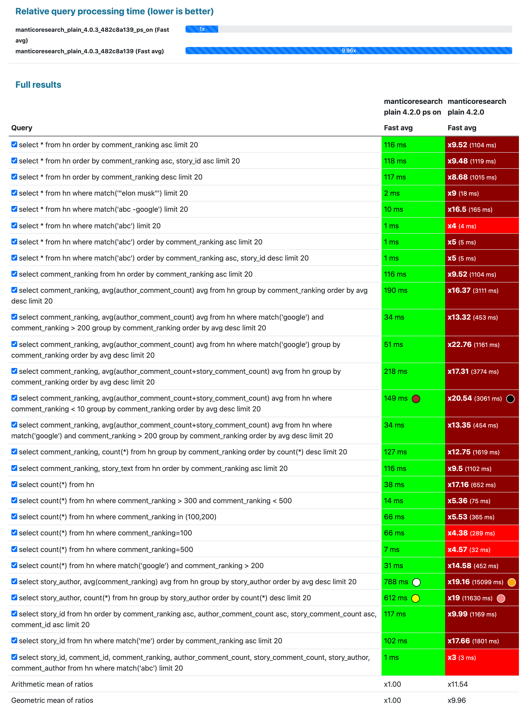

# Журнал изменений

## Версия 13.13.0
**Выпущена**: 7 октября 2025 года

### Рекомендуемые библиотеки
- Рекомендуемая версия [MCL](https://github.com/manticoresoftware/columnar): 8.1.0
- Рекомендуемая версия [Buddy](Installation/Manticore_Buddy.md#Manticore-Buddy): 3.35.1

Если вы следуете [официальному руководству по установке](https://manticoresearch.com/install/), вам не о чем беспокоиться.


Поскольку файл конфигурации был обновлен, **во время обновления в Linux вы можете увидеть предупреждение с вопросом, оставить ли вашу версию или использовать новую** из пакета. Если у вас кастомная (не по умолчанию) конфигурация, рекомендуется сохранить вашу версию и обновить путь `pid_file` на `/run/manticore/searchd.pid`. Однако, даже если вы не измените путь, всё должно работать нормально.

### Новые возможности и улучшения
* 🆕 [v13.13.0](https://github.com/manticoresoftware/manticoresearch/releases/tag/13.13.0) Добавлена поддержка MCL 8.1.0 с кэшем блоков SI.

### Исправления ошибок
* 🪲 [v13.11.8](https://github.com/manticoresoftware/manticoresearch/releases/tag/13.11.8) [ Issue #3791](https://github.com/manticoresoftware/manticoresearch/issues/3791) Исправлена гонка состояния между проверкой и вызовом сработавшего таймера.
* 🪲 [v13.11.7](https://github.com/manticoresoftware/manticoresearch/releases/tag/13.11.7) [ Issue #1045](https://github.com/manticoresoftware/manticoresearch/issues/1045) Исправлено предупреждение systemctl на RHEL 8 при обновлениях systemd путём замены устаревшего пути `/var/run/manticore` на корректный `/run/manticore` в конфигурации. Поскольку файл конфигурации обновлён, при обновлении вы можете увидеть предупреждение с вопросом, оставить ли вашу версию или использовать новую из пакета. Если у вас кастомная (не по умолчанию) конфигурация, рекомендуется сохранить вашу версию и обновить путь `pid_file` на `/run/manticore/searchd.pid`.
* 🪲 [v13.11.6](https://github.com/manticoresoftware/manticoresearch/releases/tag/13.11.6) [ PR #3766](https://github.com/manticoresoftware/manticoresearch/pull/3766) Добавлена поддержка MCL версии 8.0.6.
* 🪲 [v13.11.5](https://github.com/manticoresoftware/manticoresearch/releases/tag/13.11.5) [ PR #3767](https://github.com/manticoresoftware/manticoresearch/pull/3767) Улучшены переводы документации на китайский и обновлены подмодули.
* 🪲 [v13.11.4](https://github.com/manticoresoftware/manticoresearch/releases/tag/13.11.4) [ PR #3765](https://github.com/manticoresoftware/manticoresearch/pull/3765) Исправлена обработка псевдонимных объединённых атрибутов.
* 🪲 [v13.11.3](https://github.com/manticoresoftware/manticoresearch/releases/tag/13.11.3) [ PR #3763](https://github.com/manticoresoftware/manticoresearch/pull/3763) Исправлен сбой, который мог происходить при пакетных объединениях по строковым атрибутам, и решена проблема с фильтрами, которые иногда не работали с LEFT JOIN.
* 🪲 [v13.11.2](https://github.com/manticoresoftware/manticoresearch/releases/tag/13.11.2) [ Issue #3065](https://github.com/manticoresoftware/manticoresearch/issues/3065) Исправлен сбой при вставке данных в колонарную таблицу с включённым параметром index_field_lengths.

## Версия 13.13.0
**Релиз**: 7 октября 2025

### Рекомендуемые библиотеки
- Рекомендуемая версия [MCL](https://github.com/manticoresoftware/columnar): 8.1.0
- Рекомендуемая версия [Buddy](Installation/Manticore_Buddy.md#Manticore-Buddy): 3.35.1

Если вы следуете [официальному руководству по установке](https://manticoresearch.com/install/), вам не нужно об этом беспокоиться.

### ⚠️ Важно
Главное новшество этого релиза — [Автоматические эмбеддинги](Searching/KNN.md#Auto-Embeddings-%28Recommended%29) — новая функция, делающая семантический поиск таким же простым, как SQL.

Так как файл конфигурации был обновлен, **вы можете увидеть предупреждение во время обновления на Linux с вопросом о том, сохранить вашу версию или использовать новую** из пакета. Если у вас есть кастомная (не по умолчанию) конфигурация, рекомендуется сохранить вашу версию и обновить путь `pid_file` на `/run/manticore/searchd.pid`. Однако, система должна работать нормально, даже если путь не менять.

### Новые возможности и улучшения
* 🆕 [v13.13.0](https://github.com/manticoresoftware/manticoresearch/releases/tag/13.13.0) Добавлена поддержка MCL 8.1.0 с кэшем блоков SI.
- **Автоматическая генерация эмбеддингов** непосредственно из вашего текста
- **Запросы на естественном языке**, понимающие смысл, а не только ключевые слова
- **Поддержка нескольких моделей** (OpenAI, Hugging Face, Voyage, Jina)
- **Бесшовная интеграция** с SQL и JSON API
* 🆕 [v13.12.0](https://github.com/manticoresoftware/manticoresearch/releases/tag/13.12.0) Реализована опция [secondary_index_block_cache](../Server_settings/Searchd.md#secondary_index_block_cache), обновлено API вторичного индекса и встроены аксессоры сортировки.

### Исправления ошибок
* 🪲 [v13.11.8](https://github.com/manticoresoftware/manticoresearch/releases/tag/13.11.8) [Issue #3791](https://github.com/manticoresoftware/manticoresearch/issues/3791) Исправлена гонка данных между проверкой и вызовом сработавшего таймера.
* 🪲 [v13.11.7](https://github.com/manticoresoftware/manticoresearch/releases/tag/13.11.7) [Issue #1045](https://github.com/manticoresoftware/manticoresearch/issues/1045) Исправлено предупреждение systemctl на RHEL 8 при обновлениях systemd путем замены устаревшего пути `/var/run/manticore` на правильный `/run/manticore` в конфигурации. Так как файл конфигурации был обновлен, вы можете увидеть предупреждение при обновлении с вопросом о сохранении вашей версии или использовании новой из пакета. Если у вас кастомная (не по умолчанию) конфигурация, рекомендовано сохранить вашу версию и обновить путь `pid_file` на `/run/manticore/searchd.pid`.
* 🪲 [v13.11.6](https://github.com/manticoresoftware/manticoresearch/releases/tag/13.11.6) [PR #3766](https://github.com/manticoresoftware/manticoresearch/pull/3766) Добавлена поддержка MCL версии 8.0.6.
Если вы следуете [официальному руководству по установке](https://manticoresearch.com/install/), вам не о чем беспокоиться.
* 🪲 [v13.11.5](https://github.com/manticoresoftware/manticoresearch/releases/tag/13.11.5) [PR #3767](https://github.com/manticoresoftware/manticoresearch/pull/3767) Улучшены переводы китайской документации и обновлены сабмодули.
* 🪲 [v13.11.4](https://github.com/manticoresoftware/manticoresearch/releases/tag/13.11.4) [PR #3765](https://github.com/manticoresoftware/manticoresearch/pull/3765) Исправлена обработка алиасов присоединенных атрибутов.
* 🪲 [v13.11.3](https://github.com/manticoresoftware/manticoresearch/releases/tag/13.11.3) [PR #3763](https://github.com/manticoresoftware/manticoresearch/pull/3763) Исправлен сбой, который мог происходить при пакетных соединениях по строковым атрибутам и решена проблема, при которой фильтры иногда не работали с LEFT JOIN.
* 🪲 [v13.11.1](https://github.com/manticoresoftware/manticoresearch/releases/tag/13.11.1) [Issue #3751](https://github.com/manticoresoftware/manticoresearch/issues/3751) Исправлен сбой, который происходил при удалении документа с включёнными эмбеддингами.

## Версия 13.11.1

### Исправления ошибок
* 🪲 [v13.11.1](https://github.com/manticoresoftware/manticoresearch/releases/tag/13.11.1) [Issue #3751](https://github.com/manticoresoftware/manticoresearch/issues/3751) Исправлен сбой при удалении документа с включёнными эмбеддингами.

## Версия 13.11.0
**Релиз**: 13 сентября 2025

Главным событием этого релиза является [Auto Embeddings](Searching/KNN.md#Auto-Embeddings-%28Recommended%29) — новая функция, которая делает семантический поиск таким же простым, как и SQL.
Не нужны внешние сервисы или сложные пайплайны: просто вставляйте текст и ищите с помощью естественного языка.

### Что предлагают Auto Embeddings

- **Автоматическое создание эмбеддингов** прямо из вашего текста
- **Запросы на естественном языке**, которые понимают смысл, а не только ключевые слова
- **Поддержка нескольких моделей** (OpenAI, Hugging Face, Voyage, Jina)
- **Бесшовная интеграция** с SQL и JSON API

### Рекомендуемые библиотеки
- Рекомендуемая версия [MCL](https://github.com/manticoresoftware/columnar): 8.0.3
- Рекомендуемая версия [Buddy](Installation/Manticore_Buddy.md#Manticore-Buddy): 3.35.1

Если вы следуете [официальному руководству по установке](https://manticoresearch.com/install/), вам не нужно об этом беспокоиться.

Рекомендуемая версия [MCL](https://github.com/manticoresoftware/columnar): 8.0.1
Рекомендуемая версия [Buddy](Installation/Manticore_Buddy.md#Manticore-Buddy): 3.34.2
### Новые возможности и улучшения
* 🆕 [v13.11.0](https://github.com/manticoresoftware/manticoresearch/releases/tag/13.11.0) [PR #3746](https://github.com/manticoresoftware/manticoresearch/pull/3746) Добавлена поддержка "query" в JSON-запросах для генерации эмбеддингов.
Если вы следуете [официальному руководству по установке](https://manticoresearch.com/install/), вам не о чем беспокоиться.
* 🆕 [v13.10.0](https://github.com/manticoresoftware/manticoresearch/releases/tag/13.10.0) [Issue #3709](https://github.com/manticoresoftware/manticoresearch/issues/3709) RPM-пакет manticore-server больше не владеет `/run`.
* 🆕 [v13.9.0](https://github.com/manticoresoftware/manticoresearch/releases/tag/13.9.0) [PR #3716](https://github.com/manticoresoftware/manticoresearch/pull/3716) Добавлена поддержка `boolean_simplify` в конфигурации.
* 🆕 [v13.8.0](https://github.com/manticoresoftware/manticoresearch/releases/tag/13.8.0) [Issue #3253](https://github.com/manticoresoftware/manticoresearch/issues/3253) Установлена конфигурация sysctl для увеличения vm.max_map_count для больших наборов данных.

### Исправления ошибок
* 🪲 [v13.10.5](https://github.com/manticoresoftware/manticoresearch/releases/tag/13.10.5) [ PR #3737](https://github.com/manticoresoftware/manticoresearch/pull/3737) Опция scroll теперь корректно возвращает все документы с большими 64-битными ID.
* 🪲 [v13.10.4](https://github.com/manticoresoftware/manticoresearch/releases/tag/13.10.4) [ PR #3736](https://github.com/manticoresoftware/manticoresearch/pull/3736) Исправлен сбой при использовании KNN с деревом фильтров.
* 🪲 [v13.10.3](https://github.com/manticoresoftware/manticoresearch/releases/tag/13.10.3) [ Issue #3520](https://github.com/manticoresoftware/manticoresearch/issues/3520) Эндпоинт `/sql` больше не позволяет выполнять команду SHOW VERSION.
* 🪲 [v13.10.2](https://github.com/manticoresoftware/manticoresearch/releases/tag/13.10.2) [ PR #3637](https://github.com/manticoresoftware/manticoresearch/pull/3637) Обновлен скрипт установщика для Windows.
* 🪲 [v13.10.1](https://github.com/manticoresoftware/manticoresearch/releases/tag/13.10.1) Исправлено определение локального часового пояса на Linux.
* 🪲 [v13.9.2](https://github.com/manticoresoftware/manticoresearch/releases/tag/13.9.2) [ PR #3726](https://github.com/manticoresoftware/manticoresearch/pull/3726) Дублирующиеся ID в колонковом режиме теперь корректно вызывают ошибку.
* 🪲 [v13.9.1](https://github.com/manticoresoftware/manticoresearch/releases/tag/13.9.1) [ PR #3333](https://github.com/manticoresoftware/manticoresearch/pull/3333) Руководство теперь автоматически переводится.
* 🪲 [v13.8.6](https://github.com/manticoresoftware/manticoresearch/releases/tag/13.8.6) [ PR #3715](https://github.com/manticoresoftware/manticoresearch/pull/3715) Исправлена проблема генерации встраиваний, когда все документы в партии были пропущены.
* 🪲 [v13.8.5](https://github.com/manticoresoftware/manticoresearch/releases/tag/13.8.5) [ PR #3711](https://github.com/manticoresoftware/manticoresearch/pull/3711) Добавлены модели встраиваний Jina и Voyage, а также другие изменения, связанные с автоматическими встраиваниями.
* 🪲 [v13.8.4](https://github.com/manticoresoftware/manticoresearch/releases/tag/13.8.4) [ PR #3710](https://github.com/manticoresoftware/manticoresearch/pull/3710) Исправлен сбой при объединённых запросах с несколькими фасетами.
* 🪲 [v13.8.3](https://github.com/manticoresoftware/manticoresearch/releases/tag/13.8.3) Исправлена проблема, при которой коммиты удаления/обновления в транзакции с несколькими операциями на _bulk эндпоинте не считались ошибками.
* 🪲 [v13.8.2](https://github.com/manticoresoftware/manticoresearch/releases/tag/13.8.2) [ PR #3705](https://github.com/manticoresoftware/manticoresearch/pull/3705) Исправлен сбой при соединении по неколонковым строковым атрибутам и улучшено сообщение об ошибках.
* 🪲 [v13.8.1](https://github.com/manticoresoftware/manticoresearch/releases/tag/13.8.1) [ PR #3704](https://github.com/manticoresoftware/manticoresearch/pull/3704) Исправлен сбой в встраиваниях запросов при отсутствии указанной модели; добавлена строка встраивания в коммуникацию между master и agent; добавлены тесты.
* 🪲 [v13.7.2](https://github.com/manticoresoftware/manticoresearch/releases/tag/13.7.2) [ PR #Buddy#589](https://github.com/manticoresoftware/manticoresearch-buddy/pull/589) Убран хак по умолчанию для IDF при нечетком поиске.
* 🪲 [v13.7.1](https://github.com/manticoresoftware/manticoresearch/releases/tag/13.7.1) [ Issue #3454](https://github.com/manticoresoftware/manticoresearch/issues/3454) Исправлена некорректная декодировка scroll с большими 64-битными ID.
* 🪲 [v13.6.9](https://github.com/manticoresoftware/manticoresearch/releases/tag/13.6.9) [ Issue #3674](https://github.com/manticoresoftware/manticoresearch/issues/3674) Исправлена проблема с JDBC+MySQL драйвером/пулом соединений при настройке transaction_read_only.
* 🪲 [v13.6.8](https://github.com/manticoresoftware/manticoresearch/releases/tag/13.6.8) [ PR #3676](https://github.com/manticoresoftware/manticoresearch/pull/3676) Исправлен сбой при пустом наборе результатов, возвращаемом моделью встраиваний.

## Version 13.6.7
**Released**: August 8th 2025

Recommended [MCL](https://github.com/manticoresoftware/columnar) version: 8.0.1  
Recommended [Buddy](Installation/Manticore_Buddy.md#Manticore-Buddy) version: 3.34.2  

If you follow the [official installation guide](https://manticoresearch.com/install/), you don't need to worry about this.
* ⚠️ [PR #3586](https://github.com/manticoresoftware/manticoresearch/pull/3586) Поддержка Debian 10 (Buster) прекращена. Debian 10 достиг конца жизненного цикла 30 июня 2024 года. Пользователям рекомендуется обновиться на Debian 11 (Bullseye) или Debian 12 (Bookworm).
* ⚠️ [v13.0.0](https://github.com/manticoresoftware/manticoresearch/releases/tag/13.0.0) Обновлено API библиотеки KNN для поддержки пустых значений [float_vector](https://manual.manticoresearch.com/Creating_a_table/Data_types#Float-vector). Это обновление не изменяет формат данных, но увеличивает версию API Manticore Search / MCL.
* ⚠️ [v12.0.0](https://github.com/manticoresoftware/manticoresearch/releases/tag/12.0.0) [ PR #3516](https://github.com/manticoresoftware/manticoresearch/pull/3516) Исправлена ошибка с некорректными идентификаторами строк источника и назначения при обучении и построении KNN-индекса. Это обновление не изменяет формат данных, но увеличивает версию API Manticore Search / MCL.

### New Features and Improvements
* 🆕 [v13.6.0](https://github.com/manticoresoftware/manticoresearch/releases/tag/13.6.0) [ Issue #2226](https://github.com/manticoresoftware/manticoresearch/issues/2226) Поддержка явного '|' (ИЛИ) в операторах PHRASE, PROXIMITY и QUОРUM.
* 🆕 [v13.5.0](https://github.com/manticoresoftware/manticoresearch/releases/tag/13.5.0) [ PR #3591](https://github.com/manticoresoftware/manticoresearch/pull/3591) Автоматическая генерация встраиваний в запросах (В разработке, пока не готово для продакшена).
* 🆕 [v13.4.0](https://github.com/manticoresoftware/manticoresearch/releases/tag/13.4.0) [ PR #3585](https://github.com/manticoresoftware/manticoresearch/pull/3585) Исправлена логика предпочтения количества потоков buddy из конфигурации buddy_path, если она задана, вместо использования значения демона.
* 🆕 [v13.3.0](https://github.com/manticoresoftware/manticoresearch/releases/tag/13.3.0) [ PR #3577](https://github.com/manticoresoftware/manticoresearch/pull/3577) Поддержка джойнов с локальными распределёнными таблицами.
* 🆕 [#3647](https://github.com/manticoresoftware/manticoresearch/issues/3647) Добавлена поддержка Debian 13 "Trixie"

### Bug Fixes
* 🪲 [v13.6.7](https://github.com/manticoresoftware/manticoresearch/releases/tag/13.6.7) [ Issue #3524](https://github.com/manticoresoftware/manticoresearch/issues/3524) Исправлена проблема сохранения сгенерированных встраиваний в построчном хранении.
* 🪲 [v13.6.6](https://github.com/manticoresoftware/manticoresearch/releases/tag/13.6.6) [ Issue #3563](https://github.com/manticoresoftware/manticoresearch/issues/3563) Исправлены ошибки с Sequel Ace и другими интеграциями из-за ошибок "unknown sysvar".
* 🪲 [v13.6.5](https://github.com/manticoresoftware/manticoresearch/releases/tag/13.6.5) [ Issue #3467](https://github.com/manticoresoftware/manticoresearch/issues/3467) Исправлены проблемы с DBeaver и другими интеграциями, которые не работали из-за ошибок "unknown sysvar".
* 🪲 [v13.6.4](https://github.com/manticoresoftware/manticoresearch/releases/tag/13.6.4) [ Issue #3524](https://github.com/manticoresoftware/manticoresearch/issues/3524) Исправлена проблема concat много полей embeddings; также исправлена генерация embeddings из запросов.
* 🪲 [v13.6.3](https://github.com/manticoresoftware/manticoresearch/releases/tag/13.6.3) [ Issue #3641](https://github.com/manticoresoftware/manticoresearch/issues/3641) Исправлена ошибка в версии 13.6.0, где фраза теряла все ключевые слова в скобках, кроме первого.
* 🪲 [v13.6.2](https://github.com/manticoresoftware/manticoresearch/releases/tag/13.6.2) Исправлена утечка памяти в transform_phrase.
* 🪲 [v13.6.1](https://github.com/manticoresoftware/manticoresearch/releases/tag/13.6.1) Исправлена утечка памяти в версии 13.6.0.
* 🪲 [v13.5.2](https://github.com/manticoresoftware/manticoresearch/releases/tag/13.5.2) [ Issue #3651](https://github.com/manticoresoftware/manticoresearch/issues/3651) Исправлены дополнительные проблемы, связанные с fuzz тестированием полнотекстового поиска.
* 🪲 [v13.5.1](https://github.com/manticoresoftware/manticoresearch/releases/tag/13.5.1) [ Issue #3560](https://github.com/manticoresoftware/manticoresearch/issues/3560) Исправлен случай, когда OPTIMIZE TABLE мог зависать бесконечно при использовании данных KNN.
* 🪲 [v13.4.2](https://github.com/manticoresoftware/manticoresearch/releases/tag/13.4.2) [ Issue #2544](https://github.com/manticoresoftware/manticoresearch/issues/2544) Исправлена проблема, при которой добавление столбца float_vector могло повредить индексы.
* 🪲 [v13.4.1](https://github.com/manticoresoftware/manticoresearch/releases/tag/13.4.1) [ Issue #3651](https://github.com/manticoresoftware/manticoresearch/issues/3651) Добавлено fuzz тестирование парсинга полнотекстовых запросов и исправлены несколько ошибок, найденных в процессе тестирования.
* 🪲 [v13.3.1](https://github.com/manticoresoftware/manticoresearch/releases/tag/13.3.1) [ Issue #3583](https://github.com/manticoresoftware/manticoresearch/issues/3583) Исправлен сбой при использовании сложных булевых фильтров с подсветкой.
* 🪲 [v13.2.7](https://github.com/manticoresoftware/manticoresearch/releases/tag/13.2.7) [ Issue #3481](https://github.com/manticoresoftware/manticoresearch/issues/3481) Исправлен сбой при одновременном использовании HTTP-обновления, распределённой таблицы и неправильного кластера репликации.
* 🪲 [v13.2.6](https://github.com/manticoresoftware/manticoresearch/releases/tag/13.2.6) [ PR #3567](https://github.com/manticoresoftware/manticoresearch/pull/3567) Обновлена зависимость manticore-backup до версии 1.9.6.
* 🪲 [v13.2.5](https://github.com/manticoresoftware/manticoresearch/releases/tag/13.2.5) [ PR #3565](https://github.com/manticoresoftware/manticoresearch/pull/3565) Исправлена настройка CI для улучшения совместимости Docker-образа.
* 🪲 [v13.2.4](https://github.com/manticoresoftware/manticoresearch/releases/tag/13.2.4) Исправлена обработка длинных токенов. Некоторые специальные токены (например, regex-шаблоны) могли создавать слишком длинные слова, теперь они сокращаются перед использованием.

## Version 13.2.3
**Released**: July 8th 2025

### Breaking Changes
* ⚠️ [v13.0.0](https://github.com/manticoresoftware/manticoresearch/releases/tag/13.0.0)  Обновлено API библиотеки KNN для поддержки пустых значений [float_vector](https://manual.manticoresearch.com/Creating_a_table/Data_types#Float-vector). Это обновление не меняет формат данных, но увеличивает версию API Manticore Search / MCL.
* ⚠️ [v12.0.0](https://github.com/manticoresoftware/manticoresearch/releases/tag/12.0.0) [ PR #3516](https://github.com/manticoresoftware/manticoresearch/pull/3516) Исправлена ошибка с некорректными исходными и целевыми ID строк при обучении и построении KNN индекса. Это обновление не меняет формат данных, но увеличивает версию API Manticore Search / MCL.
* ⚠️ [v11.0.0](https://github.com/manticoresoftware/manticoresearch/releases/tag/11.0.0)  Добавлена поддержка новых функций векторного поиска KNN, таких как квантизация, пересчёт и увеличение выборки. Эта версия меняет формат данных KNN и синтаксис SQL [KNN_DIST()](https://manual.manticoresearch.com/Searching/KNN?client=SQL#KNN-vector-search). Новая версия может читать старые данные, но старые версии не смогут читать новый формат.

### New Features and Improvements
* 🆕 [v13.2.0](https://github.com/manticoresoftware/manticoresearch/releases/tag/13.2.0) [ PR #3549](https://github.com/manticoresoftware/manticoresearch/issues/3525) Исправлена проблема с `@@collation_database`, вызывавшая несовместимость с некоторыми версиями mysqldump
* 🆕 [v13.1.0](https://github.com/manticoresoftware/manticoresearch/releases/tag/13.1.0) [ Issue #3489](https://github.com/manticoresoftware/manticoresearch/issues/3489) Исправлена ошибка в Fuzzy Search, препятствовавшая разбору некоторых SQL-запросов
* 🆕 [v12.1.0](https://github.com/manticoresoftware/manticoresearch/releases/tag/12.1.0) [ Issue #3426](https://github.com/manticoresoftware/manticoresearch/issues/3426) Добавлена поддержка операционных систем RHEL 10
* 🆕 [v11.1.0](https://github.com/manticoresoftware/manticoresearch/releases/tag/11.1.0)  Добавлена поддержка пустых float векторов в [KNN поиске](https://manual.manticoresearch.com/Searching/KNN#KNN-vector-search)
* 🆕 [v10.2.0](https://github.com/manticoresoftware/manticoresearch/releases/tag/10.2.0) [ Issue #3252](https://github.com/manticoresoftware/manticoresearch/issues/3252) Переменная [log_level](https://manual.manticoresearch.com/Server_settings/Setting_variables_online#SET) теперь также регулирует уровень логирования Buddy

### Bug Fixes
* 🪲 [v13.2.3](https://github.com/manticoresoftware/manticoresearch/releases/tag/13.2.3) [ PR #3556](https://github.com/manticoresoftware/manticoresearch/pull/3556) Исправлен разбор опции "oversampling" в JSON-запросах
* 🪲 [v13.2.2](https://github.com/manticoresoftware/manticoresearch/releases/tag/13.2.2)  Исправлена ошибка логирования сбоев на Linux и FreeBSD путём удаления использования Boost stacktrace
* 🪲 [v13.2.1](https://github.com/manticoresoftware/manticoresearch/releases/tag/13.2.1) [ Issue #3298](https://github.com/manticoresoftware/manticoresearch/issues/3298) Исправлен сбой при логировании во время работы внутри контейнера
* 🪲 [v12.0.2](https://github.com/manticoresoftware/manticoresearch/releases/tag/12.0.2)  Улучшена точность статистики по таблицам за счет учета в микросекундах
* 🪲 [v12.0.1](https://github.com/manticoresoftware/manticoresearch/releases/tag/12.0.1) [ PR #3522](https://github.com/manticoresoftware/manticoresearch/pull/3522) Исправлен сбой при фасетировании по MVA в объединенном запросе
* 🪲 [v11.0.3](https://github.com/manticoresoftware/manticoresearch/releases/tag/11.0.3) [ Issue #3502](https://github.com/manticoresoftware/manticoresearch/issues/3502) Исправлен сбой, связанный с квантованием векторного поиска
* 🪲 [v11.0.2](https://github.com/manticoresoftware/manticoresearch/releases/tag/11.0.2) [ Issue #3493](https://github.com/manticoresoftware/manticoresearch/issues/3493) Изменено отображение CPU в команде `SHOW THREADS` на целочисленное значение
* 🪲 [v11.0.1](https://github.com/manticoresoftware/manticoresearch/releases/tag/11.0.1)  Исправлены пути для колоннарных и вторичных библиотек
* 🪲 [v10.2.7](https://github.com/manticoresoftware/manticoresearch/releases/tag/10.2.7)  Добавлена поддержка MCL 5.0.5, включая исправление имени файла библиотеки эмбеддингов
* 🪲 [v10.2.6](https://github.com/manticoresoftware/manticoresearch/releases/tag/10.2.6) [ Issue #3469](https://github.com/manticoresoftware/manticoresearch/issues/3469) Применено дополнительное исправление, связанное с issue #3469
* 🪲 [v10.2.4](https://github.com/manticoresoftware/manticoresearch/releases/tag/10.2.4) [ Issue #3469](https://github.com/manticoresoftware/manticoresearch/issues/3469) Исправлена проблема, когда HTTP-запросы с булевыми запросами возвращали пустые результаты
* 🪲 [v10.2.5](https://github.com/manticoresoftware/manticoresearch/releases/tag/10.2.5)  Изменено имя файла библиотеки эмбеддингов по умолчанию и добавлены проверки поля 'from' в KNN-векторах
* 🪲 [v10.2.3](https://github.com/manticoresoftware/manticoresearch/releases/tag/10.2.3) [ PR #3464](https://github.com/manticoresoftware/manticoresearch/pull/3464) Обновлен Buddy до версии 3.30.2, включающей [PR #565 по использованию памяти и логированию ошибок](https://github.com/manticoresoftware/manticoresearch-buddy/pull/565)
* 🪲 [v10.2.2](https://github.com/manticoresoftware/manticoresearch/releases/tag/10.2.2) [ Issue #3470](https://github.com/manticoresoftware/manticoresearch/pull/3470) Исправлены фильтры строк JSON, null-фильтры и проблемы с сортировкой в JOIN-запросах
* 🪲 [v10.2.1](https://github.com/manticoresoftware/manticoresearch/releases/tag/10.2.1)  Исправлена ошибка в `dist/test_kit_docker_build.sh`, из-за которой отсутствовал коммит Buddy
* 🪲 [v10.1.4](https://github.com/manticoresoftware/manticoresearch/releases/tag/10.1.4)  Исправлен сбой при группировке по MVA в объединенном запросе
* 🪲 [v10.1.3](https://github.com/manticoresoftware/manticoresearch/releases/tag/10.1.3) [ Issue #3434](https://github.com/manticoresoftware/manticoresearch/issues/3434) Исправлена ошибка с фильтрацией пустых строк
* 🪲 [v10.1.2](https://github.com/manticoresoftware/manticoresearch/releases/tag/10.1.2) [ PR #3452](https://github.com/manticoresoftware/manticoresearch/pull/3452) Обновлен Buddy до версии 3.29.7, решающей [Buddy #507 - ошибка на много-запросных вызовах с нечетким поиском](https://github.com/manticoresoftware/manticoresearch-buddy/issues/507) и [Buddy #561 - исправление метрики rate](https://github.com/manticoresoftware/manticoresearch-buddy/pull/561), требуется для [Helm релиза 10.1.0](https://github.com/manticoresoftware/manticoresearch-helm/releases/tag/manticoresearch-10.1.0)
* 🪲 [v10.1.1](https://github.com/manticoresoftware/manticoresearch/releases/tag/10.1.1)  Обновлен Buddy до версии 3.29.4, исправляющей [#3388 - "Неопределённый ключ массива 'Field'"](https://github.com/manticoresoftware/manticoresearch/issues/3388) и [Buddy #547 - layouts='ru' может не работать](https://github.com/manticoresoftware/manticoresearch-buddy/issues/547)

## Версия 10.1.0
**Выпущено**: 9 июня 2025

Эта версия представляет обновление с новыми функциями, одним критическим изменением и многочисленными улучшениями стабильности и исправлениями ошибок. Изменения сосредоточены на расширении возможностей мониторинга, улучшении функционала поиска и исправлении различных критических проблем, влияющих на стабильность и производительность системы.

**Начиная с версии 10.1.0, поддержка CentOS 7 прекращена. Пользователям рекомендуется перейти на поддерживаемую операционную систему.**

### Критические изменения
* ⚠️ [v10.0.0](https://github.com/manticoresoftware/manticoresearch/releases/tag/10.0.0) [ Issue #540](https://github.com/manticoresoftware/manticoresearch-buddy/issues/540) КРИТИЧЕСКОЕ ИЗМЕНЕНИЕ: установлено `layouts=''` по умолчанию для [нечеткого поиска](Searching/Spell_correction.md#Fuzzy-Search)

### Новые функции и улучшения
* 🆕 [v10.1.0](https://github.com/manticoresoftware/manticoresearch/releases/tag/10.1.0) [ Issue #537](https://github.com/manticoresoftware/manticoresearch-buddy/issues/537) Добавлен встроенный [экспортер Prometheus](Node_info_and_management/Node_status.md#Prometheus-Exporter)
* 🆕 [v9.8.0](https://github.com/manticoresoftware/manticoresearch/releases/tag/9.8.0) [ Issue #3409](https://github.com/manticoresoftware/manticoresearch/issues/3409) Добавлена команда [ALTER TABLE tbl REBUILD KNN](Updating_table_schema_and_settings.md#Rebuilding-a-KNN-index)
* 🆕 [v9.7.0](https://github.com/manticoresoftware/manticoresearch/releases/tag/9.7.0) [ Issue #1778](https://github.com/manticoresoftware/manticoresearch/issues/1778) Добавлено автоматическое создание эмбеддингов (пока официально не объявлено, так как код в основной ветке, но требует дополнительного тестирования)
* 🆕 [v9.6.0](https://github.com/manticoresoftware/manticoresearch/releases/tag/9.6.0)  Обновлена версия API KNN для поддержки автоэмбеддингов
* 🆕 [v9.5.0](https://github.com/manticoresoftware/manticoresearch/releases/tag/9.5.0) [ Issue #1894](https://github.com/manticoresoftware/manticoresearch/issues/1894) Улучшено восстановление кластера: периодически сохраняется `seqno` для ускорения перезапуска узла после сбоя
* 🆕 [v9.4.0](https://github.com/manticoresoftware/manticoresearch/releases/tag/9.4.0) [ Issue #2400](https://github.com/manticoresoftware/manticoresearch/issues/2400) Добавлена поддержка последней версии [Logstash](Integration/Logstash.md#Integration-with-Logstash) и Beats

### Исправления ошибок
* 🪲 [v10.0.1](https://github.com/manticoresoftware/manticoresearch/releases/tag/10.0.1)  Исправлена обработка форм слов: формы, определяемые пользователем, теперь имеют приоритет над автоматически сгенерированными; добавлены тесты в test 22
* 🪲 [v9.8.2](https://github.com/manticoresoftware/manticoresearch/releases/tag/9.8.2)  Исправление: обновлён deps.txt для включения исправлений упаковки в MCL, связанных с библиотекой эмбеддингов
* 🪲 [v9.8.1](https://github.com/manticoresoftware/manticoresearch/releases/tag/9.8.1)  Исправление: обновлён deps.txt с исправлениями упаковки для MCL и библиотеки эмбеддингов
* 🪲 [v9.7.3](https://github.com/manticoresoftware/manticoresearch/releases/tag/9.7.3) [ Issue #3306](https://github.com/manticoresoftware/manticoresearch/issues/3306) Исправлен сбой с сигналом 11 во время индексации
* 🪲 [v9.7.2](https://github.com/manticoresoftware/manticoresearch/releases/tag/9.7.2) [ Issue #3109](https://github.com/manticoresoftware/manticoresearch/issues/3109) Исправлена проблема, когда несуществующие `@@variables` всегда возвращали 0
* 🪲 [v9.7.1](https://github.com/manticoresoftware/manticoresearch/releases/tag/9.7.1) [ Issue #3377](https://github.com/manticoresoftware/manticoresearch/issues/3377) Исправлен сбой, связанный с [remove_repeats()](Functions/Searching_and_ranking_functions.md#REMOVE_REPEATS%28%29)
* 🪲 [v9.6.3](https://github.com/manticoresoftware/manticoresearch/releases/tag/9.6.3) [ PR #3411](https://github.com/manticoresoftware/manticoresearch/pull/3411) Исправление: использована динамическая детекция версий для метрик телеметрии
* 🪲 [v9.6.2](https://github.com/manticoresoftware/manticoresearch/releases/tag/9.6.2)  Исправление: небольшое исправление в выводе [SHOW VERSION](Node_info_and_management/SHOW_VERSION.md#SHOW-VERSION)
* 🪲 [v9.6.1](https://github.com/manticoresoftware/manticoresearch/releases/tag/9.6.1)  Исправление: сбой при создании таблицы с атрибутом KNN без модели
* 🪲 [v9.5.16](https://github.com/manticoresoftware/manticoresearch/releases/tag/9.5.16) [ Issue #3342](https://github.com/manticoresoftware/manticoresearch/issues/3342) Исправлена проблема, когда `SELECT ... FUZZY=0` не всегда отключал нечеткий поиск
* 🪲 [v9.5.15](https://github.com/manticoresoftware/manticoresearch/releases/tag/9.5.15) [ PR #3397](https://github.com/manticoresoftware/manticoresearch/pull/3397) Добавлена поддержка [MCL](https://github.com/manticoresoftware/columnar) 4.2.2; исправлены ошибки с более старыми форматами хранения
* 🪲 [v9.5.14](https://github.com/manticoresoftware/manticoresearch/releases/tag/9.5.14) [ Issue #3392](https://github.com/manticoresoftware/manticoresearch/issues/3392) Исправлена неправильная обработка строк в HTTP JSON ответах
* 🪲 [v9.5.13](https://github.com/manticoresoftware/manticoresearch/releases/tag/9.5.13) [ Issue #3356](https://github.com/manticoresoftware/manticoresearch/issues/3356) Исправлен сбой в сложном случае полнотекстового запроса (common-sub-term)
* 🪲 [v9.5.12](https://github.com/manticoresoftware/manticoresearch/releases/tag/9.5.12)  Исправлена опечатка в сообщении об ошибке автоматической записи чанков на диск
* 🪲 [v9.5.11](https://github.com/manticoresoftware/manticoresearch/releases/tag/9.5.11) [ Issue #3195](https://github.com/manticoresoftware/manticoresearch/issues/3195) Улучшена [автоматическая запись чанков на диск](Securing_and_compacting_a_table/Flushing_RAM_chunk_to_disk.md#Flushing-RAM-chunk-to-disk): пропуск сохранения, если идет оптимизация
* 🪲 [v9.5.10](https://github.com/manticoresoftware/manticoresearch/releases/tag/9.5.10) [ Issue #3313](https://github.com/manticoresoftware/manticoresearch/issues/3313) Исправлена проверка дубликатов ID для всех чанков на диске в RT таблице с помощью [indextool](Miscellaneous_tools.md#indextool)
* 🪲 [v9.5.9](https://github.com/manticoresoftware/manticoresearch/releases/tag/9.5.9) [ Issue #3132](https://github.com/manticoresoftware/manticoresearch/issues/3132) Добавлена поддержка сортировки `_random` в JSON API
* 🪲 [v9.5.8](https://github.com/manticoresoftware/manticoresearch/releases/tag/9.5.8) [ Issue #3382](https://github.com/manticoresoftware/manticoresearch/issues/3382) Исправлена проблема: нельзя было использовать uint64 ID документа через JSON HTTP API
* 🪲 [v9.5.7](https://github.com/manticoresoftware/manticoresearch/releases/tag/9.5.7) [ Issue #3385](https://github.com/manticoresoftware/manticoresearch/issues/3385) Исправлены некорректные результаты при фильтрации по `id != value`
* 🪲 [v9.5.6](https://github.com/manticoresoftware/manticoresearch/releases/tag/9.5.6) [ PR #538](https://github.com/manticoresoftware/manticoresearch-buddy/pull/538) Исправлена критическая ошибка с нечетким сопоставлением в некоторых случаях
* 🪲 [v9.5.5](https://github.com/manticoresoftware/manticoresearch/releases/tag/9.5.5) [ Issue #3199](https://github.com/manticoresoftware/manticoresearch/issues/3199) Исправлена декодировка пробелов в HTTP параметрах Buddy (например, `%20` и `+`)
* 🪲 [v9.5.4](https://github.com/manticoresoftware/manticoresearch/releases/tag/9.5.4) [ Issue #3133](https://github.com/manticoresoftware/manticoresearch/issues/3133) Исправлена некорректная сортировка по `json.field` при фасетном поиске
* 🪲 [v9.5.3](https://github.com/manticoresoftware/manticoresearch/releases/tag/9.5.3) [ Issue #3091](https://github.com/manticoresoftware/manticoresearch/issues/3091) Исправлены непоследовательные результаты поиска для разделителей в SQL и JSON API
* 🪲 [v9.5.2](https://github.com/manticoresoftware/manticoresearch/releases/tag/9.5.2) [ Issue #2819](https://github.com/manticoresoftware/manticoresearch/issues/2819) Улучшена производительность: заменён `DELETE FROM` на `TRUNCATE` для распределённых таблиц
* 🪲 [v9.5.1](https://github.com/manticoresoftware/manticoresearch/releases/tag/9.5.1) [ Issue #3080](https://github.com/manticoresoftware/manticoresearch/issues/3080) Исправлен сбой при фильтрации с псевдонимом `geodist()` с JSON атрибутами

## Версия 9.3.2
Выпущено: 2 мая 2025

Этот релиз включает множество исправлений ошибок и улучшений стабильности, лучшую отслеживаемость использования таблиц, а также улучшения управления памятью и ресурсами.

❤️ Особая благодарность [@cho-m](https://github.com/cho-m) за исправление совместимости сборки с Boost 1.88.0 и [@benwills](https://github.com/benwills) за улучшение документации по `stored_only_fields`.

* 🪲 [v9.3.2](https://github.com/manticoresoftware/manticoresearch/releases/tag/9.3.2)  Исправлена проблема, когда в колонке "Show Threads" отображалась активность CPU в виде числа с плавающей точкой вместо строки; также исправлена ошибка парсинга результата PyMySQL из-за неправильного типа данных.
* 🪲 [v9.3.1](https://github.com/manticoresoftware/manticoresearch/releases/tag/9.3.1) [ Issue #3343](https://github.com/manticoresoftware/manticoresearch/issues/3343) Исправлено оставление файлов `tmp.spidx` после прерывания процесса оптимизации.
* 🆕 [v9.3.0](https://github.com/manticoresoftware/manticoresearch/releases/tag/9.3.0) [ PR #3337](https://github.com/manticoresoftware/manticoresearch/pull/3337) Добавлен счётчик команд на таблицу и подробная статистика использования таблиц.
* 🪲 [v9.2.39](https://github.com/manticoresoftware/manticoresearch/releases/tag/9.2.39) [ Issue #3236](https://github.com/manticoresoftware/manticoresearch/issues/3236) Исправление: предотвращение повреждения таблиц за счёт удаления сложных обновлений чанков. Использование функций ожидания внутри последовательного воркера ломало последовательную обработку, что могло повредить таблицы.
	Переосмыслен autoflush. Удалена внешняя очередь опроса для избежания ненужных блокировок таблиц. Добавлено условие "малой таблицы": если количество документов меньше 'small table limit' (8192) и не используется вторичный индекс (SI), то сброс пропускается.

* 🪲 [v9.2.38](https://github.com/manticoresoftware/manticoresearch/releases/tag/9.2.38)  Исправление: пропуск создания вторичного индекса (SI) для фильтров с `ALL`/`ANY` по спискам строк, без влияния на JSON-атрибуты.
* 🪲 [v9.2.37](https://github.com/manticoresoftware/manticoresearch/releases/tag/9.2.37) [ Issue #2898](https://github.com/manticoresoftware/manticoresearch/issues/2898) Добавлена поддержка обратных апострофов для системных таблиц.
* 🪲 [v9.2.36](https://github.com/manticoresoftware/manticoresearch/releases/tag/9.2.36)  Исправление: использование плейсхолдера для операций с кластерами в наследуемом коде. В парсере теперь чётко разделяются поля для имён таблиц и кластеров.
* 🪲 [v9.2.35](https://github.com/manticoresoftware/manticoresearch/releases/tag/9.2.35)  Исправление: сбой при удалении кавычек с одиночной `'`.
* 🪲 [v9.2.34](https://github.com/manticoresoftware/manticoresearch/releases/tag/9.2.34) [ Issue #3090](https://github.com/manticoresoftware/manticoresearch/issues/3090) Исправление: обработка больших ID документов (раньше могли не находиться).
* 🪲 [v9.2.33](https://github.com/manticoresoftware/manticoresearch/releases/tag/9.2.33)  Исправление: использование беззнаковых целых для размеров битовых векторов.
* 🪲 [v9.2.32](https://github.com/manticoresoftware/manticoresearch/releases/tag/9.2.32)  Исправление: снижение пикового потребления памяти во время слияния. Поиск docid-to-rowid теперь использует 12 байт на документ вместо 16. Пример: 24 ГБ ОЗУ для 2 миллиардов документов вместо 36 ГБ.
* 🪲 [v9.2.31](https://github.com/manticoresoftware/manticoresearch/releases/tag/9.2.31) [ Issue #3238](https://github.com/manticoresoftware/manticoresearch/issues/3238) Исправление: некорректное значение `COUNT(*)` в больших таблицах реального времени.
* 🪲 [v9.2.30](https://github.com/manticoresoftware/manticoresearch/releases/tag/9.2.30)  Исправление: неопределённое поведение при обнулении строковых атрибутов.
* 🪲 [v9.2.29](https://github.com/manticoresoftware/manticoresearch/releases/tag/9.2.29)  Мелкое исправление: улучшено текст предупреждения.
* 🪲 [v9.2.28](https://github.com/manticoresoftware/manticoresearch/releases/tag/9.2.28) [ Issue #3290](https://github.com/manticoresoftware/manticoresearch/issues/3290) Улучшение: расширена команда `indextool --buildidf`
* 🪲 [v9.2.27](https://github.com/manticoresoftware/manticoresearch/releases/tag/9.2.27) [ Issue #3032](https://github.com/manticoresoftware/manticoresearch/issues/3032) С интеграцией Kafka теперь можно создавать источник для конкретного раздела Kafka.
* 🪲 [v9.2.26](https://github.com/manticoresoftware/manticoresearch/releases/tag/9.2.26) [ Issue #3301](https://github.com/manticoresoftware/manticoresearch/issues/3301) Исправление: `ORDER BY` и `WHERE` по `id` могли вызвать ошибки OOM (Out Of Memory).
* 🪲 [v9.2.25](https://github.com/manticoresoftware/manticoresearch/releases/tag/9.2.25) [ Issue #3171](https://github.com/manticoresoftware/manticoresearch/issues/3171) Исправление: сбой из-за ошибки сегментации при использовании grouper с несколькими JSON-атрибутами в RT-таблице, имеющей несколько дисковых чанков.
* 🪲 [v9.2.24](https://github.com/manticoresoftware/manticoresearch/releases/tag/9.2.24) [ Issue #3246](https://github.com/manticoresoftware/manticoresearch/issues/3246) Исправление: запросы `WHERE string ANY(...)` не работали после сброса RAM чанка.
* 🪲 [v9.2.23](https://github.com/manticoresoftware/manticoresearch/releases/tag/9.2.23) [ PR #518](https://github.com/manticoresoftware/manticoresearch-buddy/pull/518) Мелкие улучшения синтаксиса автошардинга.
* 🪲 [v9.2.22](https://github.com/manticoresoftware/manticoresearch/releases/tag/9.2.22) [ Issue #2763](https://github.com/manticoresoftware/manticoresearch/issues/2763) Исправление: глобальный idf файл не загружался при использовании `ALTER TABLE`.
* 🪲 [v9.2.21](https://github.com/manticoresoftware/manticoresearch/releases/tag/9.2.21)  Исправление: глобальные idf файлы могут быть большими. Теперь таблицы освобождаются раньше, чтобы не удерживать лишние ресурсы.
* 🪲 [v9.2.20](https://github.com/manticoresoftware/manticoresearch/releases/tag/9.2.20) [ PR #3277](https://github.com/manticoresoftware/manticoresearch/pull/3277) Улучшение: лучшая валидация параметров шардинга.

* 🪲 [v9.2.19](https://github.com/manticoresoftware/manticoresearch/releases/tag/9.2.19) [ PR #3275](https://github.com/manticoresoftware/manticoresearch/pull/3275) Исправление: совместимость сборки с Boost 1.88.0.
* 🪲 [v9.2.18](https://github.com/manticoresoftware/manticoresearch/releases/tag/9.2.18) [ Issue #3228](https://github.com/manticoresoftware/manticoresearch/issues/3228) Исправление: сбой при создании распределённой таблицы (проблема с недопустимым указателем).

* 🪲 [v9.2.17](https://github.com/manticoresoftware/manticoresearch/releases/tag/9.2.17) [ PR #3272](https://github.com/manticoresoftware/manticoresearch/pull/3272) Исправление: проблема с многострочным нечетким `FACET`.
* 🪲 [v9.2.16](https://github.com/manticoresoftware/manticoresearch/releases/tag/9.2.16) [ Issue #3063](https://github.com/manticoresoftware/manticoresearch/issues/3063) Исправление: ошибка в вычислении дистанции при использовании функции `GEODIST`.
* 🪲 [v9.2.15](https://github.com/manticoresoftware/manticoresearch/releases/tag/9.2.15) [ Issue #3027](https://github.com/manticoresoftware/manticoresearch/issues/3027) Незначительное улучшение: поддержка формата фильтра `query_string` от Elastic.

## Версия 9.2.14
Выпущено: 28 марта 2025

### Незначительные изменения
* [Commit ](https://github.com/manticoresoftware/manticoresearch/commit/fe9473dc3f4fcfa0eaae748b538fe853f4ce078b) Реализован флаг `--mockstack` для расчета требований к стеку рекурсивных операций. Новый режим `--mockstack` анализирует и выводит необходимые размеры стека для вычисления рекурсивных выражений, операций сопоставления паттернов, обработки фильтров. Расчёт требований к стеку выводится в консоль для отладки и оптимизации.
* [Issue #3058](https://github.com/manticoresoftware/manticoresearch/pull/3058) По умолчанию включена опция [boolean_simplify](Searching/Options.md#boolean_simplify).
* [Issue #3172](https://github.com/manticoresoftware/manticoresearch/issues/3172) Добавлен новый параметр конфигурации: `searchd.kibana_version_string`, полезный при использовании Manticore с определёнными версиями Kibana или OpenSearch Dashboards, ожидающими конкретную версию Elasticsearch.
* [Issue #3211](https://github.com/manticoresoftware/manticoresearch/issues/3211) Исправлена работа [CALL SUGGEST](Searching/Spell_correction.md#CALL-QSUGGEST,-CALL-SUGGEST) с двухсимвольными словами.
* [Issue #490](https://github.com/manticoresoftware/manticoresearch-buddy/issues/490) Улучшен [нечеткий поиск](Searching/Spell_correction.md#Fuzzy-Search): ранее иногда не находил "defghi" при поиске "def ghi", если существовал другой совпадающий документ.
* ⚠️ Критическое изменение [Issue #3165](https://github.com/manticoresoftware/manticoresearch/issues/3165) В некоторых HTTP JSON ответах изменено `_id` на `id` для единообразия. Обязательно обновите ваше приложение.
* ⚠️ Критическое изменение [Issue #3186](https://github.com/manticoresoftware/manticoresearch/issues/3186) Добавлена проверка `server_id` при присоединении к кластеру, чтобы обеспечить уникальность ID узлов. Операция `JOIN CLUSTER` теперь может завершиться ошибкой с сообщением о дублировании [server_id](Server_settings/Searchd.md#server_id), если присоединяемый узел имеет такой же `server_id`, как и существующий в кластере. Для решения проблемы убедитесь, что у каждого узла в кластере репликации уникальный [server_id](Server_settings/Searchd.md#server_id). Вы можете изменить стандартный [server_id](Server_settings/Searchd.md#server_id) в разделе "searchd" вашего конфигурационного файла на уникальное значение перед присоединением к кластеру. Это изменение обновляет протокол репликации. Если у вас работает кластер репликации, вам нужно:
  - Сначала корректно остановить все узлы
  - Затем запустить последний остановленный узел с ключом `--new-cluster`, используя утилиту `manticore_new_cluster` в Linux.
  - Подробнее о [перезапуске кластера](Creating_a_cluster/Setting_up_replication/Restarting_a_cluster.md#Restarting-a-cluster).

### Исправления ошибок
* [Commit 6fda](https://github.com/manticoresoftware/manticoresearch/commit/6fdad3923dd6953f4b781943eed5ec5c28b7f808) Исправлен сбой, вызванный потерей планировщика после ожидания; теперь конкретные планировщики, такие как `serializer`, корректно восстанавливаются.
* [Commit c333](https://github.com/manticoresoftware/manticoresearch/commit/c333b277d4a504de5fe298e9ab570a9f9ea31e0a) Исправлена ошибка, из-за которой веса из таблицы правого соединения не могли использоваться в `ORDER BY`.
* [Issue #2644](https://github.com/manticoresoftware/manticoresearch/issues/2644) gcc 14.2.0: исправлена ошибка вызова `lower_bound` с `const knn::DocDist_t*&`. ❤️ Спасибо [@Azq2](https://github.com/Azq2) за PR.
* [Issue #3018](https://github.com/manticoresoftware/manticoresearch/issues/3018) Исправлена проблема с обработкой названий таблиц в верхнем регистре при авто-схеме вставок.
* [Issue #3119](https://github.com/manticoresoftware/manticoresearch/issues/3119) Исправлен сбой при декодировании неверного base64 ввода.
* [Issue #3121](https://github.com/manticoresoftware/manticoresearch/issues/3121) Исправлены две связанные проблемы индекса KNN при `ALTER`: вектор с плавающей точкой сохраняет исходные размеры, а индексы KNN генерируются корректно.
* [Issue #3123](https://github.com/manticoresoftware/manticoresearch/issues/3123) Исправлен сбой при создании вторичного индекса на пустом JSON столбце.
* [Issue #3138](https://github.com/manticoresoftware/manticoresearch/issues/3138) Исправлен сбой, вызванный дублирующими записями.
* [Issue #3151](https://github.com/manticoresoftware/manticoresearch/issues/3151) Исправлено: опция `fuzzy=1` не работала с `ranker` или `field_weights`.
* [Issue #3163](https://github.com/manticoresoftware/manticoresearch/issues/3163) Исправлена ошибка, из-за которой `SET GLOBAL timezone` не влиял на настройки.
* [Issue #3181](https://github.com/manticoresoftware/manticoresearch/issues/3181) Исправлена проблема потери значений текстовых полей при использовании ID больше 2^63.
* [Issue #3189](https://github.com/manticoresoftware/manticoresearch/issues/3189) Исправлено: запросы `UPDATE` теперь корректно учитывают настройку `query_log_min_msec`.
* [Issue #3247](https://github.com/manticoresoftware/manticoresearch/issues/3247) Исправлена гонка при сохранении дисковых чанков в реальном времени, из-за которой могла неудаваться операция `JOIN CLUSTER`.


## Версия 7.4.6
Выпущено: 28 февраля 2025

### Основные изменения
* [Issue #832](https://github.com/manticoresoftware/manticoresearch/issues/832) Интеграция с [Kibana](Integration/Kibana.md) для более простого и эффективного отображения данных.

### Незначительные изменения
* [Issue #1727](https://github.com/manticoresoftware/manticoresearch/issues/1727) Исправлены различия в точности чисел с плавающей точкой между arm64 и x86_64.
* [Issue #2995](https://github.com/manticoresoftware/manticoresearch/issues/2995) Реализованы оптимизации производительности пакетной обработки join.
* [Issue #3039](https://github.com/manticoresoftware/manticoresearch/issues/3039) Реализованы оптимизации производительности для EstimateValues в гистограммах.
* [Issue #3099](https://github.com/manticoresoftware/manticoresearch/issues/3099) Добавлена поддержка Boost 1.87.0. ❤️ Спасибо, [@cho-m](https://github.com/cho-m) за PR.
* [Issue #77](https://github.com/manticoresoftware/columnar/issues/77) Оптимизировано повторное использование блоков данных при создании фильтров с несколькими значениями; добавлены min/max в метаданные атрибутов; реализована предварительная фильтрация значений фильтра на основе min/max.

### Исправления ошибок
* [Commit 73ac](https://github.com/manticoresoftware/manticoresearch/commit/73ac22f358a7a0e734b332c3943c86e6294c06c3) Исправлена обработка выражений в объединённых запросах при использовании атрибутов из обеих таблиц; исправлена опция index_weights для правой таблицы.
* [Issue #2915](https://github.com/manticoresoftware/manticoresearch/issues/2915) Использование `avg()` в запросе `SELECT ... JOIN` могло приводить к некорректным результатам; сейчас исправлено.
* [Issue #2996](https://github.com/manticoresoftware/manticoresearch/issues/2996) Исправлен неправильный набор результатов, вызванный неявным ограничением при включённом пакетировании join.
* [Issue #3031](https://github.com/manticoresoftware/manticoresearch/issues/3031) Исправлен сбой демона при завершении работы, если выполнялось слияние активного чанка.
* [Issue #3037](http://github.com/manticoresoftware/manticoresearch/issues/3037) Исправлена проблема, при которой `IN(...)` мог возвращать некорректные результаты.
* [Issue #3038](https://github.com/manticoresoftware/manticoresearch/issues/3038) Установка `max_iops` / `max_iosize` в версии 7.0.0 могла ухудшать производительность индексирования; теперь исправлено.
* [Issue #3042](https://github.com/manticoresoftware/manticoresearch/issues/3042) Исправлена утечка памяти в кеше запросов join.
* [Issue #3052](https://github.com/manticoresoftware/manticoresearch/issues/3052) Исправлена обработка опций запросов в объединённых JSON-запросах.
* [Issue #3054](https://github.com/manticoresoftware/manticoresearch/issues/3054) Исправлена проблема с командой ATTACH TABLE.
* [Issue #3079](https://github.com/manticoresoftware/manticoresearch/issues/3079) Исправлены несоответствия в сообщениях об ошибках.
* [Issue #3087](https://github.com/manticoresoftware/manticoresearch/issues/3087) Установка `diskchunk_flush_write_timeout=-1` для отдельной таблицы не отключала сброс индекса; теперь исправлено.
* [Issue #3088](https://github.com/manticoresoftware/manticoresearch/issues/3088) Решена проблема с дублирующимися записями после массовой замены больших ID.
* [Issue #3126](https://github.com/manticoresoftware/manticoresearch/issues/3126) Исправлен сбой демона, вызванный полнотекстовым запросом с единственным оператором `NOT` и ранжировщиком выражений.
* [Issue #3128](https://github.com/manticoresoftware/manticoresearch/pull/3128) Исправлена потенциальная уязвимость в библиотеке CJSON. ❤️ Спасибо, [@tabudz](https://github.com/tabudz) за PR.

## Версия 7.0.0
Выпущено: 30 января 2025 года

### Основные изменения
* [Issue #1497](https://github.com/manticoresoftware/manticoresearch/issues/1497) Добавлены новые функции [Fuzzy Search](Searching/Spell_correction.md#Fuzzy-Search) и [Autocomplete](Searching/Autocomplete.md#CALL-AUTOCOMPLETE) для упрощённого поиска.
* [Issue #1500](https://github.com/manticoresoftware/manticoresearch/issues/1500) [Интеграция с Kafka](Integration/Kafka.md#Syncing-from-Kafka).
* [Issue #1928](https://github.com/manticoresoftware/manticoresearch/issues/1928) Внедрены [вторичные индексы для JSON](Creating_a_table/Local_tables/Plain_and_real-time_table_settings.md#json_secondary_indexes).
* [Issue #2361](https://github.com/manticoresoftware/manticoresearch/issues/2361) Обновления и поиски во время обновления больше не блокируются слиянием чанков.
* [Issue #2787](https://github.com/manticoresoftware/manticoresearch/issues/2787) Автоматический [сброс дискового чанка](Server_settings/Searchd.md#diskchunk_flush_write_timeout) для RT-таблиц для улучшения производительности; теперь мы автоматически сбрасываем RAM-чанки в дисковые чанки, предотвращая проблемы с производительностью из-за отсутствия оптимизаций в RAM-чанках, что иногда приводило к нестабильности в зависимости от размера чанка.
* [Issue #2811](https://github.com/manticoresoftware/manticoresearch/issues/2811) Опция [Scroll](Searching/Pagination.md#Scroll-Search-Option) для удобной пагинации.
* [Issue #931](https://github.com/manticoresoftware/manticoresearch/issues/931) Интеграция с [Jieba](https://github.com/fxsjy/jieba) для лучшей [токенизации китайского языка](Creating_a_table/NLP_and_tokenization/Languages_with_continuous_scripts.md).

### Мелкие изменения
* ⚠️ BREAKING [Issue #1111](https://github.com/manticoresoftware/manticoresearch/issues/1111) Исправлена поддержка `global_idf` в RT-таблицах. Требуется пересоздание таблицы.
* ⚠️ BREAKING [Issue #2103](https://github.com/manticoresoftware/manticoresearch/issues/2103) Удалены тайские символы из внутреннего набора символов `cjk`. Обновите определения наборов символов соответственно: если у вас есть `cjk,non_cjk` и тайские символы важны, измените его на `cjk,thai,non_cjk` или `cont,non_cjk`, где `cont` — новое обозначение для всех языков с непрерывным письмом (т.е. `cjk` + `thai`). Изменяйте существующие таблицы с помощью [ALTER TABLE](Updating_table_schema_and_settings.md#Updating-table-FT-settings-in-RT-mode).
* ⚠️ BREAKING [Issue #2468](https://github.com/manticoresoftware/manticoresearch/issues/2468) [CALL SUGGEST / QSUGGEST](Searching/Spell_correction.md#CALL-QSUGGEST,-CALL-SUGGEST) теперь совместимы с распределёнными таблицами. Это увеличивает версию протокола master/agent. Если вы запускаете Manticore Search в распределённой среде с несколькими инстансами, убедитесь, что сначала обновили агенты, а затем мастера.
* ⚠️ BREAKING [Issue #2889](https://github.com/manticoresoftware/manticoresearch/issues/2889) Изменено имя столбца с `Name` на `Variable name` для PQ [SHOW META](Node_info_and_management/SHOW_META.md#SHOW-META-for-PQ-tables).
* ⚠️ BREAKING [Issue #879](https://github.com/manticoresoftware/manticoresearch/issues/879) Введена [поблочная бинарная логика](Logging/Binary_logging.md#Per-table-binary-logging-configuration) с новыми опциями: [binlog_common](Logging/Binary_logging.md#Binary-logging-strategies), [binlog](Logging/Binary_logging.md#Per-table-binary-logging-configuration) для `create table` / `alter table`. Перед обновлением до новой версии необходимо корректно завершить работу экземпляра Manticore.
* ⚠️ BREAKING [Issue #1789](https://github.com/manticoresoftware/manticoresearch/issues/1789) Исправлено некорректное сообщение об ошибке при присоединении узла к кластеру с неправильной версией протокола репликации. Это изменение обновляет протокол репликации. Если вы используете кластер репликации, необходимо:
  - Сначала корректно остановить все узлы
  - Затем запустить последний остановленный узел с параметром `--new-cluster`, используя инструмент `manticore_new_cluster` на Linux.
  - Дополнительную информацию см. в разделе [перезапуск кластера](Creating_a_cluster/Setting_up_replication/Restarting_a_cluster.md#Restarting-a-cluster).
* ⚠️ BREAKING [Issue #2308](https://github.com/manticoresoftware/manticoresearch/issues/2308) Добавлена поддержка нескольких таблиц в [`ALTER CLUSTER ADD` и `DROP`](Creating_a_cluster/Setting_up_replication/Adding_and_removing_a_table_from_a_replication_cluster.md#Adding-and-removing-a-table-from-a-replication-cluster). Это изменение также затрагивает протокол репликации. Для обновления следуйте рекомендациям предыдущего пункта.
* [Issue #2997](https://github.com/manticoresoftware/manticoresearch/issues/2997) Исправлена проблема с dlopen на Macos.
* [Commit 4954](https://github.com/manticoresoftware/manticoresearch/commit/4954b5de7341a29902a9b8fbb9a040f7942c77c4) Изменён стандартный порог для OPTIMIZE TABLE на таблицах с индексами KNN для повышения производительности поиска.
* [Commit cfc8](https://github.com/manticoresoftware/manticoresearch/commit/cfc87ecb6e33a8163c2235243b6b40e699dbf526) Добавлена поддержка `COUNT(DISTINCT)` для `ORDER BY` в `FACET` и `GROUP BY`.
* [Issue #1103](https://github.com/manticoresoftware/manticoresearch/issues/1103) Улучшена информативность сообщений о слиянии чанков в [логах](Logging/Server_logging.md#Server-logging).
* [Issue #1130](https://github.com/manticoresoftware/manticoresearch/issues/1130) Добавлена поддержка [DBeaver](Integration/DBeaver.md).
* [Issue #1546](https://github.com/manticoresoftware/manticoresearch/issues/1546) Реализованы вторичные индексы для функций [POLY2D()](Functions/Geo_spatial_functions.md#POLY2D%28%29)/[GEOPOLY2D()](Functions/Geo_spatial_functions.md#GEOPOLY2D%28%29).
* [Issue #1630](https://github.com/manticoresoftware/manticoresearch/issues/1630) HTTP-запросы теперь поддерживают `Content-Encoding: gzip`.
* [Issue #1831](https://github.com/manticoresoftware/manticoresearch/issues/1831) Добавлена команда `SHOW LOCKS`.
* [Issue #2187](https://github.com/manticoresoftware/manticoresearch/issues/2197) Разрешён запрос Buddy к демону, обходящий ограничение [searchd.max_connections](Server_settings/Searchd.md#max_connections).
* [Issue #2208](https://github.com/manticoresoftware/manticoresearch/issues/2208) Добавлена поддержка объединения таблиц через JSON HTTP интерфейс.
* [Issue #2235](https://github.com/manticoresoftware/manticoresearch/issues/2235) Журналируются успешно обработанные запросы через Buddy в их исходном виде.
* [Issue #2249](https://github.com/manticoresoftware/manticoresearch/issues/2249) Добавлен специальный режим для запуска `mysqldump` для реплицируемых таблиц.
* [Issue #2268](https://github.com/manticoresoftware/manticoresearch/issues/2268) Улучшено переименование внешних файлов при копировании для операторов `CREATE TABLE` и `ALTER TABLE`.
* [Issue #2402](https://github.com/manticoresoftware/manticoresearch/issues/2402) Обновлено значение по умолчанию [searchd.max_packet_size](Server_settings/Searchd.md#max_packet_size) до 128MB.
* [Issue #2419](https://github.com/manticoresoftware/manticoresearch/issues/2419) Добавлена поддержка [модификатора усиления IDF](Searching/Full_text_matching/Operators.md#IDF-boost-modifier) в JSON ["match"](Searching/Full_text_matching/Basic_usage.md#match).
* [Issue #2430](https://github.com/manticoresoftware/manticoresearch/issues/2430) Усилена синхронизация записи [binlog](Logging/Binary_logging.md#Binary-logging) для предотвращения ошибок.
* [Issue #2458](https://github.com/manticoresoftware/manticoresearch/issues/2458) Интегрирована поддержка zlib в пакеты для Windows.
* [Issue #2479](https://github.com/manticoresoftware/manticoresearch/issues/2479) Добавлена поддержка команды SHOW TABLE INDEXES.
* [Issue #2485](https://github.com/manticoresoftware/manticoresearch/issues/2485) Установлены метаданные сессии для ответов Buddy.
* [Issue #2490](https://github.com/manticoresoftware/manticoresearch/issues/2490) Разрешение в миллисекундах для агрегаций на совместимых конечных точках.
* [Issue #2500](https://github.com/manticoresoftware/manticoresearch/issues/2500) Изменены сообщения об ошибках для операций кластера при сбое запуска репликации.
* [Issue #2584](https://github.com/manticoresoftware/manticoresearch/pull/2584) Новые [метрики производительности в SHOW STATUS](Node_info_and_management/Node_status.md#Query-Time-Statistics): min/max/avg/95-й/99-й перцентиль по типу запроса за последние 1, 5 и 15 минут.
* [Issue #2639](https://github.com/manticoresoftware/manticoresearch/pull/2639) Все упоминания `index` заменены на `table` в запросах и ответах.
* [Issue #2643](https://github.com/manticoresoftware/manticoresearch/issues/2643) Добавлен столбец `distinct` в результаты агрегации HTTP `/sql` эндпоинта.
* [Issue #268](https://github.com/manticoresoftware/manticoresearch-buddy/issues/268) Внедрено автоопределение типов данных при импорте из Elasticsearch.
* [Issue #2744](https://github.com/manticoresoftware/manticoresearch/issues/2744) Добавлена поддержка сравнения строк с учётом сортировки (collation) в выражениях сравнения JSON полей.
* [Issue #2752](https://github.com/manticoresoftware/manticoresearch/issues/2752) Добавлена поддержка выражения `uuid_short` в списке выбора.
* [Issue #2783](https://github.com/manticoresoftware/manticoresearch/issues/2783) Manticore Search теперь запускает Buddy напрямую без обертки `manticore-buddy`.
* [Issue #2785](https://github.com/manticoresoftware/manticoresearch/issues/2785) Различные сообщения об ошибках для отсутствующих таблиц и таблиц, не поддерживающих операции вставки.
* [Issue #2789](https://github.com/manticoresoftware/manticoresearch/issues/2789) OpenSSL 3 теперь статически встроен в `searchd`.
* [Issue #2790](https://github.com/manticoresoftware/manticoresearch/issues/2790) Добавлена инструкция `CALL uuid_short` для генерации последовательностей с несколькими значениями `uuid_short`.
* [Issue #2803](https://github.com/manticoresoftware/manticoresearch/issues/2803) Добавлены отдельные опции для правой таблицы в операции JOIN.
* [Issue #2810](https://github.com/manticoresoftware/manticoresearch/issues/2810) Улучшена производительность HTTP JSON агрегации до уровня `GROUP BY` в SphinxQL.
* [Issue #2854](https://github.com/manticoresoftware/manticoresearch/issues/2854) Добавлена поддержка `fixed_interval` в запросах, связанных с датами в Kibana.
* [Issue #2909](https://github.com/manticoresoftware/manticoresearch/issues/2909) Реализована пакетная обработка для запросов JOIN, что улучшает производительность некоторых JOIN запросов на сотни и даже тысячи раз.
* [Issue #2937](https://github.com/manticoresoftware/manticoresearch/issues/2937) Включена возможность использования веса присоединённой таблицы в запросах fullscan.
* [Issue #2953](https://github.com/manticoresoftware/manticoresearch/issues/2953) Исправлена запись логов для join-запросов.
* [Issue #337](https://github.com/manticoresoftware/manticoresearch-buddy/issues/337) Исключения Buddy скрыты из лога `searchd` в режиме без отладки.
* [Issue #2931](https://github.com/manticoresoftware/manticoresearch/issues/2931) Завершение работы демона с сообщением об ошибке, если пользователь указал неправильные порты для слушателя репликации.

### Исправления ошибок
* [Commit 0c6b](https://github.com/manticoresoftware/manticoresearch/commit/0c6bdaf41ea3684e05952e1a8273893535b923f5) Исправлено: некорректные результаты в JOIN запросах с более чем 32 столбцами.
* [Issue #2335](https://github.com/manticoresoftware/manticoresearch/issues/2335) Решена проблема, когда соединение таблиц не работало при использовании двух json-атрибутов в условии.
* [Issue #2338](https://github.com/manticoresoftware/manticoresearch/issues/2338) Исправлен некорректный total_relation в мультизапросах с [cutoff](Searching/Options.md#cutoff).
* [Issue #2366](https://github.com/manticoresoftware/manticoresearch/issues/2366) Исправлен фильтр по `json.string` в правой таблице при [соединении таблиц](Searching/Joining.md).
* [Issue #2406](https://github.com/manticoresoftware/manticoresearch/issues/2406) Разрешено использовать `null` для всех значений в любых HTTP JSON эндпоинтах с POST (insert/replace/bulk). В этом случае используется значение по умолчанию.
* [Issue #2418](https://github.com/manticoresoftware/manticoresearch/issues/2418) Оптимизировано потребление памяти за счёт настройки выделения сетевого буфера [max_packet_size](Server_settings/Searchd.md#max_packet_size) при первоначальном опросе сокета.
* [Issue #2420](https://github.com/manticoresoftware/manticoresearch/issues/2420) Исправлена вставка unsigned int в атрибут bigint через JSON интерфейс.
* [Issue #2422](https://github.com/manticoresoftware/manticoresearch/issues/2422) Исправлена работа вторичных индексов с exclude фильтрами и включённым pseudo_sharding.
* [Issue #2423](https://github.com/manticoresoftware/manticoresearch/issues/2423) Исправлена ошибка в [manticore_new_cluster](Starting_the_server/Manually.md#searchd-command-line-options).
* [Issue #2448](https://github.com/manticoresoftware/manticoresearch/issues/2448) Исправлен сбой демона при ошибочном запросе `_update`.
* [Issue #2452](https://github.com/manticoresoftware/manticoresearch/issues/2452) Исправлена неспособность гистограмм обрабатывать фильтры значений с исключениями.
* [Issue #55](https://github.com/manticoresoftware/columnar/issues/55) Исправлены [knn](Searching/KNN.md#KNN-vector-search) запросы к распределённым таблицам.
* [Issue #68](https://github.com/manticoresoftware/columnar/issues/68) Улучшена обработка exclude фильтров при кодировании таблиц в columnar accessor.
* [Commit 0eb1](https://github.com/manticoresoftware/manticoresearch/commit/0eb1579462013cb134bcaf74e06f6eeb0c2ecc4d) Исправлен парсер выражений, который не учитывал переопределённое значение `thread_stack`.
* [Commit c304](https://github.com/manticoresoftware/manticoresearch/commit/c3041fd1d3e14773f3c5aa635343915a71f5cb95) Исправлен сбой при клонировании колонного выражения IN.
* [Commit edad](https://github.com/manticoresoftware/columnar/commit/edadc694c68d6022bdd13134263667430a42cc1d) Исправлена ошибка инверсии в итераторе bitmap, вызывавшая сбой.
* [Commit fc30](https://github.com/manticoresoftware/executor/commit/fc302ff1117b0b835a6f5a3c07057baf5fba14d9) Исправлена проблема, когда некоторые пакеты Manticore автоматически удалялись `unattended-upgrades`.
* [Issue #1019](https://github.com/manticoresoftware/manticoresearch/issues/1019) Улучшена обработка запросов из MySQL инструмента DbForge.
* [Issue #1107](https://github.com/manticoresoftware/manticoresearch/issues/1107) Исправлено экранирование специальных символов в `CREATE TABLE` и `ALTER TABLE`.  ❤️ Спасибо, [@subnix](https://github.com/subnix) за PR.
* [Issue #116](https://github.com/manticoresoftware/manticoresearch-backup/issues/116#issuecomment-2216597206) Исправлена взаимная блокировка при обновлении blob-атрибута в замороженном индексе. Взаимная блокировка возникала из-за конфликтующих замков при попытке разморозить индекс. Это могло привести к сбоям в manticore-backup.
* [Issue #1818](https://github.com/manticoresoftware/manticoresearch/issues/1818) `OPTIMIZE` теперь выдает ошибку при работе с замороженной таблицей.
* [Issue #2001](https://github.com/manticoresoftware/manticoresearch/issues/2001) Допущено использование имён функций в качестве имён столбцов.
* [Issue #2153](https://github.com/manticoresoftware/manticoresearch/issues/2153) Исправлен сбой демона при запросе настроек таблицы с неизвестным дисковым чанком.
* [Issue #2184](https://github.com/manticoresoftware/manticoresearch/issues/2184) Исправлена проблема, из-за которой `searchd` зависал при остановке после `FREEZE` и `FLUSH RAMCHUNK`.
* [Issue #2228](https://github.com/manticoresoftware/manticoresearch/issues/2228) Удалены связанные с датой/временем токены (и regex) из зарезервированных слов.
* [Issue #2255](https://github.com/manticoresoftware/manticoresearch/issues/2255) Исправлен сбой при использовании `FACET` с более чем 5 полями сортировки.
* [Issue #2265](https://github.com/manticoresoftware/manticoresearch/issues/2265) Исправлена ошибка восстановления `mysqldump` с включённым `index_field_lengths`.
* [Issue #2291](https://github.com/manticoresoftware/manticoresearch/issues/2291) Исправлен сбой при выполнении команды `ALTER TABLE`.
* [Issue #2333](https://github.com/manticoresoftware/manticoresearch/issues/2333) Исправлена DLL MySQL в пакете для Windows, чтобы индексатор работал корректно.
* [Issue #2393](https://github.com/manticoresoftware/manticoresearch/issues/2393) Исправлена ошибка компиляции GCC. ❤️ Спасибо, [@animetosho](https://github.com/animetosho), за PR.
* [Issue #2447](https://github.com/manticoresoftware/manticoresearch/issues/2447) Исправлена проблема с экранированием в [_update](Data_creation_and_modification/Updating_documents/REPLACE.md?client=Elasticsearch-like+partial).
* [Issue #2460](https://github.com/manticoresoftware/manticoresearch/issues/2460) Исправлен сбой индексатора при объявлении нескольких атрибутов или полей с одинаковым именем.
* [Issue #2467](https://github.com/manticoresoftware/manticoresearch/issues/2467) Исправлен сбой демона при неправильном преобразовании для вложенных bool-запросов для связанных с поиском "compat" конечных точек.
* [Issue #2493](https://github.com/manticoresoftware/manticoresearch/issues/2493) Исправлено расширение в фразах с модификаторами.
* [Issue #2535](https://github.com/manticoresoftware/manticoresearch/issues/2535) Разрешён сбой демона при использовании полнотекстового оператора [ZONE](Searching/Full_text_matching/Operators.md#ZONE-limit-operator) или [ZONESPAN](Searching/Full_text_matching/Operators.md#ZONESPAN-limit-operator).
* [Issue #2552](https://github.com/manticoresoftware/manticoresearch/issues/2552) Исправлена генерация инфикса для обычных и RT таблиц с словарём ключевых слов.
* [Issue #2571](https://github.com/manticoresoftware/manticoresearch/issues/2571) Исправлен ошибочный ответ в запросах `FACET`; установлен порядок сортировки по умолчанию `DESC` для `FACET` с `COUNT(*)`.
* [Issue #2580](https://github.com/manticoresoftware/manticoresearch/issues/2580) Исправлен сбой демона на Windows при запуске.
* [Issue #2603](https://github.com/manticoresoftware/manticoresearch/issues/2603) Исправлено усечение запроса для HTTP конечных точек `/sql` и `/sql?mode=raw`; сделаны запросы с этих конечных точек согласованными без необходимости заголовка `query=`.
* [Issue #2623](https://github.com/manticoresoftware/manticoresearch/issues/2623) Исправлена проблема, когда авто-схема создаёт таблицу, но одновременно даёт сбой.
* [Issue #2627](https://github.com/manticoresoftware/manticoresearch/issues/2627) Исправлена библиотека HNSW для поддержки загрузки нескольких KNN-индексов.
* [Issue #2630](https://github.com/manticoresoftware/manticoresearch/issues/2630) Исправлена проблема зависания при одновременном возникновении нескольких условий.
* [Issue #2645](https://github.com/manticoresoftware/manticoresearch/issues/2645) Исправлен сбой с фатальной ошибкой при использовании `OR` с поиском KNN.
* [Issue #2647](https://github.com/manticoresoftware/manticoresearch/issues/2647) Исправлена проблема, когда `indextool --mergeidf *.idf --out global.idf` удалял выходной файл после создания.
* [Issue #2658](https://github.com/manticoresoftware/manticoresearch/issues/2658) Исправлен сбой демона при подзапросе с `ORDER BY` строкой во внешнем запросе.
* [Issue #2686](https://github.com/manticoresoftware/manticoresearch/issues/2686) Исправлен сбой при обновлении атрибута с плавающей точкой вместе со строковым атрибутом.
* [Issue #2704](https://github.com/manticoresoftware/manticoresearch/issues/2704) Исправлена проблема, когда несколько стоп-слов из токенизаторов `lemmatize_xxx_all` увеличивают `hitpos` у последующих токенов.
* [Issue #2708](https://github.com/manticoresoftware/manticoresearch/issues/2708) Исправлен сбой при `ALTER ... ADD COLUMN ... TEXT`.
* [Issue #2737](https://github.com/manticoresoftware/manticoresearch/issues/2737) Исправлена проблема, когда обновление blob-атрибута в замороженной таблице с хотя бы одним RAM чанком вызывает ожидание последующих запросов `SELECT` до разморозки таблицы.
* [Issue #2742](https://github.com/manticoresoftware/manticoresearch/issues/2742) Исправлен пропуск кэша запросов для запросов с упакованными факторами.
* [Issue #2775](https://github.com/manticoresoftware/manticoresearch/issues/2775) Manticore теперь сообщает об ошибке при неизвестном действии вместо сбоя при запросах `_bulk`.
* [Issue #2791](https://github.com/manticoresoftware/manticoresearch/issues/2791) Исправлен возврат ID вставленного документа для HTTP конечной точки `_bulk`.
* [Issue #2797](https://github.com/manticoresoftware/manticoresearch/issues/2797) Исправлен сбой в grouper при обработке нескольких таблиц, одна из которых пуста, а другая содержит разное количество совпадающих записей.
* [Issue #2835](https://github.com/manticoresoftware/manticoresearch/issues/2835) Исправлен сбой в сложных запросах `SELECT`.
* [Issue #2872](https://github.com/manticoresoftware/manticoresearch/issues/2872) Добавлено сообщение об ошибке, если аргумент `ALL` или `ANY` в выражении `IN` не является JSON-атрибутом.
* [Issue #2882](https://github.com/manticoresoftware/manticoresearch/issues/2882) Исправлен сбой демона при обновлении MVA в больших таблицах.
* [Issue #2888](https://github.com/manticoresoftware/manticoresearch/issues/2888) Исправлен сбой при неудачной токенизации с `libstemmer`. ❤️ Спасибо, [@subnix](https://github.com/subnix), за PR.
* [Issue #2919](https://github.com/manticoresoftware/manticoresearch/issues/2919) Исправлена проблема, когда объединённый вес из правой таблицы неправильно работал в выражениях.
* [Issue #2919](https://github.com/manticoresoftware/manticoresearch/issues/2919) Исправлена проблема, при которой вес таблицы с правым соединением не работал в выражениях.
* [Issue #325](https://github.com/manticoresoftware/manticoresearch-buddy/issues/325) Исправлена ошибка `CREATE TABLE IF NOT EXISTS ... WITH DATA`, возникавшая при уже существующей таблице.
* [Issue #351](https://github.com/manticoresoftware/manticoresearch-buddy/issues/351) Исправлена ошибка неопределённого ключа массива "id" при подсчёте по KNN с использованием ID документа.
* [Issue #359](https://github.com/manticoresoftware/manticoresearch-buddy/issues/359) Исправлена работа команды `REPLACE INTO cluster_name:table_name`.
* [Issue #67](https://github.com/manticoresoftware/docker/issues/67) Исправлена критическая ошибка при запуске Docker контейнера Manticore с флагом `--network=host`.

## Версия 6.3.8
Выпущено: 22 ноября 2024

Версия 6.3.8 продолжает серию 6.3 и содержит только исправления ошибок.

### Исправления ошибок

* [PR #2777](https://github.com/manticoresoftware/manticoresearch/pull/2777) Исправлен расчёт доступных потоков при ограничении параллелизма запросов настройками `threads` или `max_threads_per_query`.

## manticore-extra v1.1.20

Выпущено: 7 октября 2024

### Исправления ошибок

* [Issue #64](https://github.com/manticoresoftware/executor/issues/64) Решена проблема, при которой утилита `unattended-upgrades`, автоматически устанавливающая обновления пакетов в системах на основе Debian, некорректно помечала на удаление несколько пакетов Manticore, включая `manticore-galera`, `manticore-executor` и `manticore-columnar-lib`. Это происходило из-за того, что `dpkg` ошибочно считал виртуальный пакет `manticore-extra` избыточным. Были внесены изменения, чтобы `unattended-upgrades` больше не пытался удалять важные компоненты Manticore.

## Версия 6.3.6
Выпущено: 2 августа 2024

Версия 6.3.6 продолжает серию 6.3 и содержит только исправления ошибок.

### Исправления ошибок

* [Issue #2477](https://github.com/manticoresoftware/manticoresearch/issues/2477) Исправлен сбой, возникший в версии 6.3.4 при работе с выражениями и распределёнными или несколькими таблицами.
* [Issue #2352](https://github.com/manticoresoftware/manticoresearch/issues/2352) Исправлен сбой демона или внутренняя ошибка при преждевременном выходе из-за `max_query_time` при запросах к нескольким индексам.

## Версия 6.3.4
Выпущено: 31 июля 2024

Версия 6.3.4 продолжает серию 6.3 и содержит незначительные улучшения и исправления ошибок.

### Незначительные изменения
* [Issue #1130](https://github.com/manticoresoftware/manticoresearch/issues/1130) Добавлена поддержка [DBeaver](Integration/DBeaver.md#Integration-with-DBeaver).
* [Issue #2146](https://github.com/manticoresoftware/manticoresearch/issues/2146) Улучшено экранирование разделителей в формах слов и исключениях.
* [Issue #2315](https://github.com/manticoresoftware/manticoresearch/issues/2315) Добавлены операторы сравнения строк в выражениях списка SELECT.
* [Issue #2363](https://github.com/manticoresoftware/manticoresearch/issues/2363) Добавлена поддержка null-значений в bulk-запросах, похожих на Elastic.
* [Issue #2374](https://github.com/manticoresoftware/manticoresearch/issues/2374) Добавлена поддержка mysqldump версии 9.
* [Issue #2375](https://github.com/manticoresoftware/manticoresearch/issues/2375) Улучшена обработка ошибок в HTTP JSON запросах с указанием пути JSON к узлу, где произошла ошибка.

### Исправления ошибок
* [Issue #2280](https://github.com/manticoresoftware/manticoresearch/issues/2280) Исправлено ухудшение производительности в запросах с шаблонами (wildcard) с большим количеством совпадений при disk_chunks > 1.
* [Issue #2332](https://github.com/manticoresoftware/manticoresearch/issues/2332) Исправлен сбой в выражениях MVA MIN или MAX в списках SELECT для пустых массивов MVA.
* [Issue #2339](https://github.com/manticoresoftware/manticoresearch/issues/2339) Исправлена некорректная обработка бесконечного диапазона запросов Kibana.
* [Issue #2342](https://github.com/manticoresoftware/manticoresearch/issues/2342) Исправлен фильтр соединения по столбцовым атрибутам из правой таблицы, если атрибут не в списке SELECT.
* [Issue #2343](https://github.com/manticoresoftware/manticoresearch/issues/2343) Исправлено дублирование спецификатора 'static' в Manticore 6.3.2.
* [Issue #2344](https://github.com/manticoresoftware/manticoresearch/issues/2344) Исправлен случай, когда LEFT JOIN возвращал несопоставленные записи при использовании MATCH() по правой таблице.
* [Issue #2350](https://github.com/manticoresoftware/manticoresearch/issues/2350) Исправлено сохранение chunk диска в RT индексе с `hitless_words`.
* [Issue #2364](https://github.com/manticoresoftware/manticoresearch/issues/2364) Свойство 'aggs_node_sort' теперь можно добавлять в любом порядке среди других свойств.
* [Issue #2368](https://github.com/manticoresoftware/manticoresearch/issues/2368) Исправлена ошибка порядка "full-text vs filter" в JSON запросе.
* [Issue #2376](https://github.com/manticoresoftware/manticoresearch/issues/2376) Исправлена ошибка, связанная с некорректным JSON ответом на длинные UTF-8 запросы.
* [Issue #2684](https://github.com/manticoresoftware/dev/issues/2684) Исправлен расчёт presort/prefilter выражений, зависящих от присоединённых атрибутов.
* [Issue #301](https://github.com/manticoresoftware/manticoresearch-buddy/issues/301) Изменён метод подсчёта размера данных для метрик — теперь читается из файла `manticore.json` вместо проверки общего размера каталога данных.
* [Issue #302](https://github.com/manticoresoftware/manticoresearch-buddy/issues/302) Добавлена обработка запросов валидации от Vector.dev.

## Версия 6.3.2
Выпущено: 26 июня 2024

Версия 6.3.2 продолжает серию 6.3 и содержит несколько исправлений ошибок, некоторые из которых были обнаружены после выпуска версии 6.3.0.

### Критические изменения
* ⚠️[Issue #2305](https://github.com/manticoresoftware/manticoresearch/issues/2305) Значения aggs.range обновлены для использования числового типа.

### Исправления ошибок
* [Commit c51c](https://github.com/manticoresoftware/manticoresearch/commit/c51c7fa4bd0ec4ad8d53188b888461bff29f1417) Исправлена группировка при проверке сохранённых данных по сравнению с объединением rset.
* [Commit 0e85](https://github.com/manticoresoftware/manticoresearch/commit/0e85b9d5682f51681750d798aef6a11cfb93d69e) Исправлен сбой в демоне при выполнении запросов с подстановочными символами в RT-индексе с использованием CRC-словаря и включённым `local_df`.
* [Issue #2200](https://github.com/manticoresoftware/manticoresearch/issues/2200) Исправлен сбой в JOIN при использовании `count(*)` без GROUP BY.
* [Issue #2201](https://github.com/manticoresoftware/manticoresearch/issues/2201) Исправлено отсутствие предупреждения в JOIN при попытке группировки по полнотекстовому полю.
* [Issue #2230](https://github.com/manticoresoftware/manticoresearch/issues/2230) Исправлена проблема, когда добавление атрибута через `ALTER TABLE` не учитывало опции KNN.
* [Issue #2231](https://github.com/manticoresoftware/manticoresearch/issues/2231) Исправлен сбой при удалении пакета `manticore-tools` для Redhat в версии 6.3.0.
* [Issue #2242](https://github.com/manticoresoftware/manticoresearch/issues/2242) Исправлены ошибки с JOIN и несколькими операторами FACET, возвращавшими некорректные результаты.
* [Issue #2250](https://github.com/manticoresoftware/manticoresearch/issues/2250) Исправлена ошибка генерации ошибки в ALTER TABLE, если таблица находится в кластере.
* [Issue #2252](https://github.com/manticoresoftware/manticoresearch/issues/2252) Исправлена передача исходного запроса в buddy из интерфейса SphinxQL.
* [Issue #2267](https://github.com/manticoresoftware/manticoresearch/issues/2267) Улучшено раскрытие подстановочных символов в `CALL KEYWORDS` для RT-индекса с дисковыми чанками.
* [Issue #271](https://github.com/manticoresoftware/manticoresearch-buddy/issues/271) Исправлена зависание при некорректных запросах `/cli`.
* [Issue #274](https://github.com/manticoresoftware/manticoresearch-buddy/issues/274) Решены проблемы с зависанием при одновременных запросах к Manticore.
* [Issue #275](https://github.com/manticoresoftware/manticoresearch-buddy/issues/275) Исправлено зависание при выполнении `drop table if exists t; create table t` через `/cli`.

### Связано с репликацией
* [Issue #2270](https://github.com/manticoresoftware/manticoresearch/issues/2270) Добавлена поддержка формата `cluster:name` в HTTP эндпойнте `/_bulk`.

## Версия 6.3.0
Выпущена: 23 мая 2024 года

### Крупные изменения
* [Issue #839](https://github.com/manticoresoftware/manticoresearch/issues/839) Реализован тип данных [float_vector](Creating_a_table/Data_types.md#Float-vector); реализован [поиск по векторам](Searching/KNN.md#KNN-vector-search).
* [Issue #1673](https://github.com/manticoresoftware/manticoresearch/issues/1673) [INNER/LEFT JOIN](Searching/Joining.md) (**бета-версия**).
* [Issue #1744](https://github.com/manticoresoftware/manticoresearch/issues/1744) Реализовано автодетектирование форматов даты для полей [timestamp](Creating_a_table/Data_types.md#Timestamps).
* [Issue #1720](https://github.com/manticoresoftware/manticoresearch/pull/1720) Лицензия Manticore Search изменена с GPLv2-or-later на GPLv3-or-later.
* [Commit 7a55](https://github.com/manticoresoftware/manticoresearch/commit/7a5508424) Для работы Manticore на Windows теперь требуется Docker для запуска Buddy.
* [Issue #1541](https://github.com/manticoresoftware/manticoresearch/issues/1541) Добавлен полнотекстовый оператор [REGEX](Searching/Full_text_matching/Operators.md#REGEX-operator).
* [Issue #2091](https://github.com/manticoresoftware/manticoresearch/issues/2091) Добавлена поддержка Ubuntu Noble 24.04.
* [Commit 514d](https://github.com/manticoresoftware/manticoresearch/commit/514d35b497f4bdb20b6473ff963752a978a4bb8d) Переработка операций с датой и временем для повышения производительности и добавления новых функций даты/времени:
  - [CURDATE()](Functions/Date_and_time_functions.md#CURDATE%28%29) - Возвращает текущую дату в локальной временной зоне
  - [QUARTER()](Functions/Date_and_time_functions.md#QUARTER%28%29) - Возвращает номер квартала года из аргумента типа timestamp
  - [DAYNAME()](Functions/Date_and_time_functions.md#DAYNAME%28%29) - Возвращает название дня недели для данного аргумента timestamp
  - [MONTHNAME()](Functions/Date_and_time_functions.md#MONTHNAME%28%29) - Возвращает название месяца для данного аргумента timestamp
  - [DAYOFWEEK()](Functions/Date_and_time_functions.md#DAYOFWEEK%28%29) - Возвращает числовой индекс дня недели для данного аргумента timestamp
  - [DAYOFYEAR()](Functions/Date_and_time_functions.md#DAYOFYEAR%28%29) - Возвращает порядковый номер дня в году для данного аргумента timestamp
  - [YEARWEEK()](Functions/Date_and_time_functions.md#YEARWEEK%28%29) - Возвращает число, состоящее из года и кода первого дня текущей недели, для данного аргумента timestamp
  - [DATEDIFF()](Functions/Date_and_time_functions.md#DATEDIFF%28%29) - Возвращает количество дней между двумя timestamp
  - [DATE()](Functions/Date_and_time_functions.md#DATE%28%29) - Форматирует дату из аргумента типа timestamp
  - [TIME()](Functions/Date_and_time_functions.md#TIME%28%29) - Форматирует время из аргумента типа timestamp
  - [timezone](Server_settings/Searchd.md#timezone) - Часовой пояс, используемый функциями, связанными с датой/временем.
* [Commit 30e7](https://github.com/manticoresoftware/manticoresearch/commit/30e789d9657f9b3093c280c6e5b0e46a021f6dc7) Добавлены агрегаты [range](Searching/Faceted_search.md#Facet-over-set-of-ranges), [histogram](Searching/Faceted_search.md#Facet-over-histogram-values), [date_range](Searching/Faceted_search.md#Facet-over-set-of-date-ranges) и [date_histogram](Searching/Faceted_search.md#Facet-over-histogram-date-values) в HTTP интерфейс и аналогичные выражения в SQL.

### Мелкие изменения
* [Issue #1285](https://github.com/manticoresoftware/manticoresearch/issues/1285) Поддержка версий Filebeat 8.10 - 8.11.
* [Issue #1771](https://github.com/manticoresoftware/manticoresearch/issues/1771) [ALTER TABLE ... type='distributed'](Updating_table_schema_and_settings.md#Changing-a-distributed-table).
* [Issue #1788](https://github.com/manticoresoftware/manticoresearch/issues/1788) Добавлена возможность копирования таблиц с помощью SQL-оператора [CREATE TABLE ... LIKE ... WITH DATA](Creating_a_table/Local_tables/Real-time_table.md#CREATE-TABLE-LIKE:).
* [Issue #2072](https://github.com/manticoresoftware/manticoresearch/issues/2072) Оптимизирован [алгоритм уплотнения таблицы](Securing_and_compacting_a_table/Compacting_a_table.md#Compacting-a-Table): Ранее как ручной [OPTIMIZE](Securing_and_compacting_a_table/Compacting_a_table.md#OPTIMIZE-TABLE), так и автоматический [auto_optimize](Server_settings/Searchd.md#auto_optimize) процесс сначала объединяли чанки, чтобы количество не превышало лимит, а затем удаляли документы с пометкой удалённых из всех других чанков, содержащих удалённые документы. Этот подход иногда был слишком ресурсоёмким и был отключён. Теперь объединение чанков происходит исключительно согласно настройке [progressive_merge](Server_settings/Common.md#progressive_merge). Однако чанки с большим количеством удалённых документов объединяются с большей вероятностью.
* [Commit ce6c](https://github.com/manticoresoftware/columnar/commit/ce6c5d3381edcdc411a00a5923d13d56dd9b3010) Добавлена защита от загрузки вторичного индекса более новой версии.
* [Issue #1417](https://github.com/manticoresoftware/manticoresearch/issues/1417) Частичная замена через [REPLACE INTO ... SET](Data_creation_and_modification/Updating_documents/REPLACE.md#SQL-REPLACE).
* [Commit 7c16](https://github.com/manticoresoftware/manticoresearch/commit/7c167b934ce416d3dfbd658744a231e638b14d9a) Обновлены размеры буферов слияния по умолчанию: `.spa` (скалярные атрибуты): 256KB -> 8MB; `.spb` (blob-атрибуты): 256KB -> 8MB; `.spc` (колоночные атрибуты): 1MB, без изменений; `.spds` (docstore): 256KB -> 8MB; `.spidx` (вторичные индексы): буфер 256KB -> лимит памяти 128MB; `.spi` (словарь): 256KB -> 16MB; `.spd` (doclists): 8MB, без изменений; `.spp` (списки попаданий): 8MB, без изменений; `.spe` (списки пропусков): 256KB -> 8MB.
* [Issue #1859](https://github.com/manticoresoftware/manticoresearch/issues/1859) Добавлена [композитная агрегация](Searching/Grouping.md#GROUP-BY-multiple-fields-at-once) через JSON.
* [Commit 216b](https://github.com/manticoresoftware/manticoresearch-buddy/commit/216b824) Отключён PCRE.JIT из-за проблем с некоторыми паттернами регулярных выражений и отсутствия заметного выигрыша во времени.
* [Commit 55cd](https://github.com/manticoresoftware/manticoresearch/commit/55cdce32) Добавлена поддержка vanilla Galera v.3 (api v25) (`libgalera_smm.so` из MySQL 5.x).
* [Commit 86f9](https://github.com/manticoresoftware/manticoresearch-buddy/commit/86f98ab) Изменён суффикс метрики с `_rate` на `_rps`.
* [Commit c0c1](https://github.com/manticoresoftware/manticoresearch-helm/commit/c0c1cff780031412ef57cefab987dfd16613368e) Улучшена документация по поддержке HA балансировщика.
* [Commit d1d2](https://github.com/manticoresoftware/manticoresearch/commit/d1d2ca18857c68106e89743756260e73285be739) В сообщениях об ошибках изменено `index` на `table`; исправлена корректировка сообщений об ошибках bison-парсера.
* [Commit fd26](https://github.com/manticoresoftware/manticoresearch/commit/fd26671b) Добавлена поддержка `manticore.tbl` в качестве имени таблицы.
* [Issue #1105](https://github.com/manticoresoftware/manticoresearch/issues/1105) Добавлена возможность запуска индексатора через systemd ([документация](Data_creation_and_modification/Adding_data_from_external_storages/Plain_tables_creation.md#Schedule-indexer-via-systemd)). ❤️ Спасибо, [@subnix](https://github.com/subnix) за PR.
* [Issue #1294](https://github.com/manticoresoftware/manticoresearch/issues/1294) Поддержка вторичных индексов в GEODIST().
* [Issue #1394](https://github.com/manticoresoftware/manticoresearch/issues/1394) Упрощён [SHOW THREADS](Node_info_and_management/SHOW_THREADS.md#SHOW-THREADS).
* [Issue #1424](https://github.com/manticoresoftware/manticoresearch/issues/1424) Добавлена поддержка значений по умолчанию (`agent_connect_timeout` и `agent_query_timeout`) для оператора `create distributed table`.
* [Issue #1442](https://github.com/manticoresoftware/manticoresearch/issues/1442) Добавлен поисковый параметр запроса [expansion_limit](Searching/Options.md#expansion_limit), который перекрывает `searchd.expansion_limit`.
* [Issue #1448](https://github.com/manticoresoftware/manticoresearch/issues/1448) Реализована команда [ALTER TABLE](Updating_table_schema_and_settings.md#Updating-table-schema-in-RT-mode) для преобразования int в bigint.
* [Issue #1456](https://github.com/manticoresoftware/manticoresearch/issues/1456) Добавлена метаинформация в ответ MySQL.
* [Issue #1494](https://github.com/manticoresoftware/manticoresearch/issues/1494) [SHOW VERSION](Node_info_and_management/SHOW_VERSION.md#SHOW-VERSION).
* [Issue #1582](https://github.com/manticoresoftware/manticoresearch/issues/1582) Поддержка [удаления документов по массиву id](Data_creation_and_modification/Deleting_documents.md?client=JSON#Deleting-documents) через JSON.
* [Issue #1589](https://github.com/manticoresoftware/manticoresearch/issues/1589) Улучшено сообщение об ошибке "unsupported value type".
* [Issue #1634](https://github.com/manticoresoftware/manticoresearch/issues/1634) Добавлена версия Buddy в `SHOW STATUS`.
* [Issue #1641](https://github.com/manticoresoftware/manticoresearch/issues/1641) Оптимизация запросов match в случае отсутствия документов для ключевого слова.
* [Issue #1712](https://github.com/manticoresoftware/manticoresearch/issues/1712) Добавлено преобразование атрибута типа bool из строковых значений "true" и "false" при отправке данных.
* [Issue #1713](https://github.com/manticoresoftware/manticoresearch/issues/1713) Добавлены таблица и опция searchd [access_dict](Server_settings/Searchd.md#access_dict).
* [Issue #1767](https://github.com/manticoresoftware/manticoresearch/issues/1767) Добавлены новые опции: [expansion_merge_threshold_docs](Server_settings/Searchd.md#expansion_merge_threshold_docs) и [expansion_merge_threshold_hits](Server_settings/Searchd.md#expansion_merge_threshold_hits) в секцию searchd конфига; сделан порог слияния для малых терминов развернутых терминов настраиваемым.
* [Issue #1768](https://github.com/manticoresoftware/manticoresearch/issues/1768) Добавлен показ времени последней команды в `@@system.sessions`.
* [Issue #1806](https://github.com/manticoresoftware/manticoresearch/issues/1806) Обновлён протокол Buddy до версии 2.
* [Issue #1810](https://github.com/manticoresoftware/manticoresearch/issues/1810) Реализованы дополнительные форматы запросов к эндпоинту `/sql` для упрощения интеграции с библиотеками.
* [Issue #1825](https://github.com/manticoresoftware/manticoresearch/pull/1825) Добавлен раздел Info в SHOW BUDDY PLUGINS.
* [Issue #1837](https://github.com/manticoresoftware/manticoresearch/issues/1837) Улучшено потребление памяти в `CALL PQ` при работе с большими пакетами.
* [Issue #1853](https://github.com/manticoresoftware/manticoresearch/pull/1853) Переключение компилятора с Clang 15 на Clang 16.
* [Issue #1857](https://github.com/manticoresoftware/manticoresearch/issues/1857) Добавлено сравнение строк. ❤️ Спасибо, [@etcd](https://github.com/etcd) за PR.
* [Issue #1915](https://github.com/manticoresoftware/manticoresearch/issues/1915) Добавлена поддержка присоединённых хранимых полей.
* [Issue #1937](https://github.com/manticoresoftware/manticoresearch/issues/1937) Логирование хоста:порта клиента в query-log.
* [Issue #1981](https://github.com/manticoresoftware/manticoresearch/issues/1981) Исправлена неправильная ошибка.
* [Issue #1983](https://github.com/manticoresoftware/manticoresearch/issues/1983) Введена поддержка уровней детализации для [плана запроса через JSON](Node_info_and_management/Profiling/Query_plan.md?client=JSON#Query-plan).
* [Issue #2010](https://github.com/manticoresoftware/manticoresearch/issues/2010) Отключено логирование запросов от Buddy, если не установлен `log_level=debug`.
* [Issue #2035](https://github.com/manticoresoftware/manticoresearch/issues/2035) Поддержка Linux Mint 21.3.
* [Issue #2056](https://github.com/manticoresoftware/manticoresearch/issues/2056) Manticore не мог собираться с Mysql 8.3+.
* [Issue #2112](https://github.com/manticoresoftware/manticoresearch/issues/2112) Команда `DEBUG DEDUP` для чанков таблиц real-time, которые могут содержать дублирующиеся записи после присоединения plain-таблицы с дубликатами.
* [Issue #212](https://github.com/manticoresoftware/manticoresearch-buddy/issues/212) Добавлено время в [SHOW QUERIES](Node_info_and_management/SHOW_QUERIES.md#SHOW-QUERIES).
* [Issue #218](https://github.com/manticoresoftware/manticoresearch-buddy/issues/218) Обработка колонки `@timestamp` как временной метки.
* [Issue #252](https://github.com/manticoresoftware/manticoresearch-buddy/issues/250) Реализована логика включения/выключения плагинов buddy.
* [Issue #254](https://github.com/manticoresoftware/manticoresearch-buddy/issues/254) Обновлён composer до более свежей версии с исправленными последними CVE.
* [Issue #340](https://github.com/manticoresoftware/manticoresearch/issues/340) Небольшая оптимизация systemd-юнита Manticore, связанная с `RuntimeDirectory`.
* [Issue #51](https://github.com/manticoresoftware/executor/issues/51) Добавлена поддержка rdkafka и обновление до PHP 8.3.3.
* [Issue #527](https://github.com/manticoresoftware/manticoresearch/issues/527) Поддержка [присоединения](Data_creation_and_modification/Adding_data_from_external_storages/Adding_data_to_tables/Attaching_one_table_to_another.md#Attaching-one-table-to-another) RT-таблицы. Новая команда [ALTER TABLE ... RENAME](Updating_table_schema_and_settings.md#Renaming-a-real-time-table).

### Ломающие изменения и устаревшие функции
* ⚠️[Issue #1436](https://github.com/manticoresoftware/manticoresearch/issues/1436) Исправлена проблема с расчётом IDF. `local_df` теперь значение по умолчанию. Улучшен протокол поиска master-agent (обновлена версия). Если вы используете Manticore Search в распределённой среде с несколькими инстансами, сначала обновите агенты, затем мастера.
* ⚠️[Issue #1572](https://github.com/manticoresoftware/manticoresearch/issues/1572) Добавлена репликация распределённых таблиц и обновлён протокол репликации. Если у вас используется кластер репликации, необходимо:
  - Сначала корректно остановить все узлы
  - Затем запустить последний остановленный узел с `--new-cluster` с использованием инструмента `manticore_new_cluster` в Linux.
  - Подробнее читайте про [перезапуск кластера](Creating_a_cluster/Setting_up_replication/Restarting_a_cluster.md#Restarting-a-cluster).
* ⚠️[Issue #1763](https://github.com/manticoresoftware/manticoresearch/pull/1763) Алиасы HTTP API эндпоинтов `/json/*` устарели.
* ⚠️[Issue #1982](https://github.com/manticoresoftware/manticoresearch/issues/1982) Изменено название [profile](Node_info_and_management/Profiling/Query_profile.md#Query-profile) на [plan](Node_info_and_management/Profiling/Query_plan.md#Query-plan) в JSON, добавлено профилирование запросов для JSON.
* ⚠️[Commit e235](https://github.com/manticoresoftware/manticoresearch-backup/commit/e23585a) manticore-backup больше не резервирует `plugin_dir`.
* ⚠️[Issue #171](https://github.com/manticoresoftware/manticoresearch-buddy/issues/155) Миграция Buddy на Swoole для повышения производительности и стабильности. При обновлении до новой версии убедитесь, что все пакеты Manticore обновлены.
* ⚠️[Issue #196](https://github.com/manticoresoftware/manticoresearch-buddy/pull/205) Объединены все основные плагины в Buddy и изменена основная логика.
* ⚠️[Issue #2107](https://github.com/manticoresoftware/manticoresearch/issues/2107) Обработка ID документов как чисел в ответах `/search`.
* ⚠️[Issue #38](https://github.com/manticoresoftware/executor/issues/38) Добавлен Swoole, отключён ZTS, удалено расширение parallel.
* ⚠️[Issue #1929](https://github.com/manticoresoftware/manticoresearch/issues/1929) Перекрытие в `charset_table` не работало в некоторых случаях.

### Изменения, связанные с репликацией
* [Commit 3376](https://github.com/manticoresoftware/manticoresearch/commit/3376351f73db3ff0cb6cb708a304a7bd83e69cfb) Исправлена ошибка репликации при SST больших файлов.
* [Commit 6d36](https://github.com/manticoresoftware/manticoresearch/commit/6d36c68fb7ce3cb274b467aac435788905084952) Добавлен механизм повторных попыток для команд репликации; исправлен сбой соединения репликации в условиях загруженной сети с потерей пакетов.
* [Commit 842e](https://github.com/manticoresoftware/manticoresearch/commit/842e27e71790833ab4125d49103d2933d5df60c3) Сообщение FATAL в репликации изменено на WARNING.
* [Commit 8c32](https://github.com/manticoresoftware/manticoresearch/commit/8c32bce7db39d8ed3b1a06aaa1d2c3ec372084f0) Исправлен расчет `gcache.page_size` для репликационных кластеров без таблиц или с пустыми таблицами; также исправлено сохранение и загрузка опций Galera.
* [Commit a2af](https://github.com/manticoresoftware/manticoresearch/commit/a2af06ca36abcbf893e43c8803853130b397c54b) Добавлена функция пропуска команды обновления нод репликации на ноде, которая присоединяется к кластеру.
* [Commit c054](https://github.com/manticoresoftware/manticoresearch/commit/c0541e6892f5116b1f957b40060ba8ecd01a5afb) Исправлена взаимная блокировка при репликации при обновлении атрибутов blob и замене документов.
* [Commit e80d](https://github.com/manticoresoftware/manticoresearch/commit/e80d505b963999016033613c40c1cf3151d648e7) Добавлены параметры конфигурации searchd [replication_connect_timeout](Server_settings/Searchd.md#replication_connect_timeout), [replication_query_timeout](Server_settings/Searchd.md#replication_query_timeout), [replication_retry_delay](Server_settings/Searchd.md#replication_retry_delay), [replication_retry_count](Server_settings/Searchd.md#replication_retry_count) для управления сетью во время репликации, аналогично `searchd.agent_*`, но с другими значениями по умолчанию.
* [Issue #1356](https://github.com/manticoresoftware/manticoresearch/issues/1356) Исправлена повторная попытка подключения репликационных нод после пропуска некоторых нод и сбоя разрешения имен этих нод.
* [Issue #1445](https://github.com/manticoresoftware/manticoresearch/issues/1445) Исправлен уровень подробности ведения журнала репликации в `show variables`.
* [Issue #1482](https://github.com/manticoresoftware/manticoresearch/issues/1482) Исправлена проблема репликации для присоединяющейся ноды при подключении к кластеру после перезапуска пода в Kubernetes.
* [Issue #1962](https://github.com/manticoresoftware/manticoresearch/issues/1962) Исправлено долгое ожидание команды alter репликации на пустом кластере с некорректным именем ноды.

### Исправления ошибок
* [Commit 8a48](https://github.com/manticoresoftware/manticoresearch/commit/8a486c7ba1a293879cdecc41fb52eb7ab0cbf832) Исправлена очистка неиспользуемых совпадений в `count distinct`, которая могла привести к сбою.
* [Issue #1569](https://github.com/manticoresoftware/manticoresearch/issues/1569) Бинарный лог теперь записывается с гранулярностью транзакций.
* [Issue #2089](https://github.com/manticoresoftware/manticoresearch/issues/2089) Исправлена ошибка, связанная с 64-битными ID, которая могла вызвать ошибку "Malformed packet" при вставке через MySQL, приводя к [повреждению таблиц и дубликатам ID](https://github.com/manticoresoftware/manticoresearch/issues/2090).
* [Issue #2160](https://github.com/manticoresoftware/manticoresearch/issues/2160) Исправлена вставка дат, которые обрабатывались как UTC вместо локального часового пояса.
* [Issue #2177](https://github.com/manticoresoftware/manticoresearch/issues/2177) Исправлен сбой, возникавший при поиске в таблице реального времени с непустым `index_token_filter`.
* [Issue #2209](https://github.com/manticoresoftware/manticoresearch/issues/2209) Изменена фильтрация дубликатов в колонковом хранении RT для исправления сбоев и неправильных результатов запросов.
* [Commit 001d](https://github.com/manticoresoftware/manticoresearch/commit/001d82904e4b887c49387308291aeefb07c0fbc4) Исправлен html stipper, портящий память после обработки объединённого поля.
* [Commit 00eb](https://github.com/manticoresoftware/manticoresearch/commit/00eb2ebf) Избежан откат потока после flush для предотвращения проблем с коммуникацией с mysqldump.
* [Commit 0553](https://github.com/manticoresoftware/manticoresearch/commit/05534114acf08c70ffcc41a23d558dec09a34373) Не ждать завершения preread, если он не начался.
* [Commit 055a](https://github.com/manticoresoftware/manticoresearch/commit/055aac09f877570cd29b6594cb283182eba7f73b) Исправлена разбивка длинной строки вывода Buddy на несколько строк в лог searchd.
* [Commit 0a88](https://github.com/manticoresoftware/manticoresearch/commit/0a88056307f82c50fcdc458ad6dbc307a00e3f92) Перемещено предупреждение интерфейса MySQL о неудаче заголовка уровня подробности `debugv`.
* [Commit 150a](https://github.com/manticoresoftware/manticoresearch/commit/150a20286b7d98d24b844ae577d7fda4a444798d) Исправлена гонка условий при операциях управления несколькими кластерами; запрещено создавать несколько кластеров с одинаковым именем или путем.
* [Commit 2e40](https://github.com/manticoresoftware/manticoresearch/commit/2e405c1c9ebac6f46206e3df17ac1c19129c9aa3) Исправлен неявный cutoff в fulltext запросах; MatchExtended разделён на шаблонную часть D.
* [Commit 75f5](https://github.com/manticoresoftware/manticoresearch/commit/75f51421542a2a0658f9e2f9f31048c8c5224479) Исправлено несоответствие `index_exact_words` между индексированием и загрузкой таблицы в демон.
* [Commit 7643](https://github.com/manticoresoftware/manticoresearch/commit/7643976bea142e08535d701000eff0d09a99fda2) Исправлено пропущенное сообщение об ошибке при удалении некорректного кластера.
* [Commit 7a03](https://github.com/manticoresoftware/manticoresearch/commit/7a034ac990d5ec9344320c05a6a2315583b9b858) Исправлена ошибка CBO vs очередь union; исправлен CBO против имитации шардирования RT.
* [Commit 7b4e](https://github.com/manticoresoftware/manticoresearch/commit/7b4ea95e) При запуске без библиотеки вторичных индексов (SI) и параметров в конфигурации появлялось вводящее в заблуждение предупреждение 'WARNING: secondary_indexes set but failed to initialize secondary library'.
* [Commit 8496](https://github.com/manticoresoftware/manticoresearch/commit/8496317f099fade8d2db463fb88483e7fcdfe85b) Исправлена сортировка совпадений в кворуме.
* [Commit 8973](https://github.com/manticoresoftware/manticoresearch-buddy/commit/8973ad3) Исправлена проблема с опциями в верхнем регистре в плагине ModifyTable.
* [Commit 9935](https://github.com/manticoresoftware/manticoresearch-buddy/commit/99350d4c184379b19f3efa9751d9b5be5e6edfb5) Исправлено восстановление из дампа с пустыми значениями json (представленными как NULL).
* [Commit a28f](https://github.com/manticoresoftware/manticoresearch/commit/a28f6e087b3d957e48816070be17d0823904936a) Исправлен таймаут SST на присоединяющемся узле при получении SST с использованием pcon.
* [Commit b5a5](https://github.com/manticoresoftware/manticoresearch/commit/b5a55cc26debcddcda5d9caef8366a707e0dd763) Исправлена ошибка при выборе атрибута строкового псевдонима.
* [Commit c556](https://github.com/manticoresoftware/manticoresearch/commit/c556e7ed8b6da8eac8ef094650df5f0a8977916b) Добавлено преобразование термина запроса в `=term` полнотекстового запроса с использованием поля `morphology_skip_fields`.
* [Commit cdc3](https://github.com/manticoresoftware/manticoresearch/commit/cdc38085145cd1025b96fcac2a46188a0425d9e1) Добавлен отсутствующий ключ конфигурации (skiplist_cache_size).
* [Commit cf6e](https://github.com/manticoresoftware/manticoresearch/commit/cf6ec3bfdc3f0990fb31ff53822b2331a6667727) Исправлена ошибка при ранжировании выражения с большой сложной запросом.
* [Commit e513](https://github.com/manticoresoftware/manticoresearch/commit/e5139ba75eef7223df375ae3cc3f138fa7d925f1) Исправлена ошибка CBO полнотекста в отношении некорректных подсказок индекса.
* [Commit eb05](https://github.com/manticoresoftware/manticoresearch/commit/eb0514b3a6f57f278252b0724eebd112ec116e0f) Прекращена предварительная загрузка при завершении работы для ускорения завершения.
* [Commit f945](https://github.com/manticoresoftware/manticoresearch/commit/f94555a293cfa51004ff81135b8bd8500b955115) Изменён расчёт стека для полнотекстовых запросов во избежание сбоя при сложном запросе.
* [Issue #1262](https://github.com/manticoresoftware/manticoresearch/issues/1262) Исправлен сбой индексатора при индексации SQL-источника с несколькими столбцами с одинаковым именем.
* [Issue #1273](https://github.com/manticoresoftware/manticoresearch/issues/1273) Возвращается 0 вместо <empty> для несуществующих системных переменных.
* [Issue #1289](https://github.com/manticoresoftware/manticoresearch/issues/1289) Исправлена ошибка indextool при проверке внешних файлов RT таблицы.
* [Issue #1335](https://github.com/manticoresoftware/manticoresearch/issues/1335) Исправлена ошибка парсинга запроса из-за многословной формы внутри фразы.
* [Issue #1364](https://github.com/manticoresoftware/manticoresearch/issues/1364) Добавлено воспроизведение пустых binlog файлов со старыми версиями binlog.
* [Issue #1365](https://github.com/manticoresoftware/manticoresearch/issues/1365) Исправлено удаление последнего пустого binlog файла.
* [Issue #1372](https://github.com/manticoresoftware/manticoresearch/issues/1372) Исправлены некорректные относительные пути (преобразованные в абсолютные из каталога запуска демона) после изменений в `data_dir`, влияющие на текущий рабочий каталог при запуске демона.
* [Issue #1393](https://github.com/manticoresoftware/manticoresearch/issues/1393) Медленное ухудшение времени в hn_small: кэширование информации о CPU при запуске демона.
* [Issue #1395](https://github.com/manticoresoftware/manticoresearch/issues/1395) Исправлено предупреждение о пропавшем внешнем файле при загрузке индекса.
* [Issue #1402](https://github.com/manticoresoftware/manticoresearch/issues/1402) Исправлен сбой в глобальных группировщиках при освобождении атрибутов указателей на данные.
* [Issue #1403](https://github.com/manticoresoftware/manticoresearch/issues/1403) _ADDITIONAL_SEARCHD_PARAMS не работает.
* [Issue #1427](https://github.com/manticoresoftware/manticoresearch/issues/1427) Исправлено замещение параметра `agent_query_timeout` для каждой таблицы параметром по умолчанию `agent_query_timeout`.
* [Issue #1444](https://github.com/manticoresoftware/manticoresearch/issues/1444) Исправлен сбой в группировщике и ранжировщике при использовании `packedfactors()` с множественными значениями для каждого совпадения.
* [Issue #1458](https://github.com/manticoresoftware/manticoresearch/issues/1458) Manticore аварийно завершается при частых обновлениях индекса.
* [Issue #1481](https://github.com/manticoresoftware/manticoresearch/issues/1481) Исправлен сбой при очистке распарсенного запроса после ошибки парсинга.
* [Issue #1484](https://github.com/manticoresoftware/manticoresearch/issues/1484) Исправлены HTTP JSON запросы, которые не направлялись к buddy.
* [Issue #1499](https://github.com/manticoresoftware/manticoresearch/issues/1499) root-значение JSON атрибута не могло быть массивом. Исправлено.
* [Issue #1507](https://github.com/manticoresoftware/manticoresearch/issues/1507) Исправлен сбой при пересоздании таблицы внутри транзакции.
* [Issue #1515](https://github.com/manticoresoftware/manticoresearch/issues/1515) Исправлено расширение коротких форм русских лемм.
* [Issue #1579](https://github.com/manticoresoftware/manticoresearch/issues/1579) Исправлено использование JSON и STRING атрибутов в выражении [date_format](Functions/Date_and_time_functions.md#DATE_FORMAT()).
* [Issue #1580](https://github.com/manticoresoftware/manticoresearch/issues/1580) Исправлен группировщик для нескольких псевдонимов JSON полей.
* [Issue #1594](https://github.com/manticoresoftware/manticoresearch/issues/1594) Некорректное значение total_related в dev: исправлен неявный cutoff против limit; добавлено лучшее определение полного сканирования в JSON запросах.
* [Issue #1603](https://github.com/manticoresoftware/manticoresearch/issues/1603) Исправлено использование JSON и STRING атрибутов во всех датированных выражениях.
* [Issue #1609](https://github.com/manticoresoftware/manticoresearch/issues/1609) сбой при использовании LEVENSHTEIN().
* [Issue #1612](https://github.com/manticoresoftware/manticoresearch/issues/1612) Исправлено повреждение памяти после ошибки парсинга поискового запроса с подсветкой.
* [Issue #1614](https://github.com/manticoresoftware/manticoresearch/issues/1614) Отключено расширение подстановочных знаков для терминов короче `min_prefix_len` / `min_infix_len`.
* [Issue #1617](https://github.com/manticoresoftware/manticoresearch/issues/1617) Изменено поведение: ошибка не логируется, если Buddy успешно обрабатывает запрос.
* [Issue #1635](https://github.com/manticoresoftware/manticoresearch/issues/1635) Исправлено поле total в метаданных поискового запроса для запросов с установленным лимитом.
* [Issue #1640](https://github.com/manticoresoftware/manticoresearch/issues/1640) Невозможно использовать таблицу с заглавной буквой через JSON в plain режиме.
* [Issue #1643](https://github.com/manticoresoftware/manticoresearch/issues/1643) Предоставлено значение по умолчанию для `SPH_EXTNODE_STACK_SIZE`.
* [Issue #1646](https://github.com/manticoresoftware/manticoresearch/issues/1646) Исправлен лог SphinxQL для отрицательного фильтра с ALL/ANY на атрибуте MVA.
* [Issue #1660](https://github.com/manticoresoftware/manticoresearch/issues/1660) Исправлена ошибка применения списков удаления docid из других индексов. ❤️ Спасибо, [@raxoft](https://github.com/raxoft), за PR.
* [Issue #1668](https://github.com/manticoresoftware/manticoresearch/issues/1668) Исправлены пропущенные совпадения из-за преждевременного выхода при полном сканировании сырого индекса (без итераторов индексов); убран cutoff из простого итератора строк.
* [Issue #1671](https://github.com/manticoresoftware/manticoresearch/issues/1671) Исправлена ошибка `FACET` при запросе распределенной таблицы с агентом и локальными таблицами.
* [Issue #1690](https://github.com/manticoresoftware/manticoresearch/issues/1690) Исправлен сбой при оценке гистограммы для больших значений.
* [Issue #1692](https://github.com/manticoresoftware/manticoresearch/issues/1692) Сбой при выполнении alter table tbl add column col uint.
* [Issue #1710](https://github.com/manticoresoftware/manticoresearch/issues/1710) Пустой результат для условия `WHERE json.array IN (<value>)`.
* [Issue #172](https://github.com/manticoresoftware/manticoresearch-buddy/issues/172) Исправлена проблема с TableFormatter при отправке запроса в `/cli`.
* [Issue #1742](https://github.com/manticoresoftware/manticoresearch/issues/1742) `CREATE TABLE` не выдавал ошибку при отсутствии файла wordforms.
* [Issue #1762](https://github.com/manticoresoftware/manticoresearch/issues/1762) Порядок атрибутов в RT таблицах теперь соответствует порядку в конфигурации.
* [Issue #1765](https://github.com/manticoresoftware/manticoresearch/issues/1765) HTTP bool запрос с условием 'should' возвращает некорректные результаты.
* [Issue #1769](https://github.com/manticoresoftware/manticoresearch/issues/1769) Сортировка по строковым атрибутам не работает с `SPH_SORT_ATTR_DESC` и `SPH_SORT_ATTR_ASC`.
* [Issue #177](https://github.com/manticoresoftware/manticoresearch-buddy/issues/177) Отключен HTTP заголовок `Expect: 100-continue` для curl-запросов к Buddy.
* [Issue #1791](https://github.com/manticoresoftware/manticoresearch/issues/1791) Сбой, вызванный alias в GROUP BY.
* [Issue #1792](https://github.com/manticoresoftware/manticoresearch/issues/1792) SQL meta summary показывает неправильное время на Windows.
* [Issue #1794](https://github.com/manticoresoftware/manticoresearch/issues/1794) Исправлено падение производительности при однотерминовых запросах JSON.
* [Issue #1798](https://github.com/manticoresoftware/manticoresearch/issues/1798) Несовместимые фильтры не выдавали ошибку на `/search`.
* [Issue #1802](https://github.com/manticoresoftware/manticoresearch/issues/1802) Исправлены операции `ALTER CLUSTER ADD` и `JOIN CLUSTER`, теперь они ожидают друг друга, предотвращая проблему гонки, когда `ALTER` добавляет таблицу в кластер, а донор отправляет таблицы на узел присоединения.
* [Issue #1811](https://github.com/manticoresoftware/manticoresearch/issues/1811) Некорректная обработка запросов `/pq/{table}/*`.
* [Issue #1816](https://github.com/manticoresoftware/manticoresearch/issues/1816) `UNFREEZE` не работал в некоторых случаях.
* [Issue #183](https://github.com/manticoresoftware/manticoresearch-buddy/pull/183) Исправлена проблема с восстановлением MVA в некоторых случаях.
* [Issue #1849](https://github.com/manticoresoftware/manticoresearch/issues/1849) Исправлен сбой indextool при завершении работы, если использовать с MCL.
* [Issue #1866](https://github.com/manticoresoftware/manticoresearch/issues/1866) Исправлено ненужное декодирование URL для запросов `/cli_json`.
* [Issue #1872](https://github.com/manticoresoftware/manticoresearch/issues/1872) Изменена логика установки plugin_dir при запуске демона.
* [Issue #1874](https://github.com/manticoresoftware/manticoresearch/issues/1874) Ошибки при alter table ... exceptions.
* [Issue #1891](https://github.com/manticoresoftware/manticoresearch/issues/1891#issuecomment-2051941200) Manticore падает с `signal 11` при вставке данных.
* [Issue #1920](https://github.com/manticoresoftware/manticoresearch/issues/1920) Снижено ограничение пропускной способности для [low_priority](Searching/Options.md#low_priority).
* [Issue #1924](https://github.com/manticoresoftware/manticoresearch/issues/1924) Ошибка mysqldump + mysql restore.
* [Issue #1951](https://github.com/manticoresoftware/manticoresearch/issues/1951) Исправлено неверное создание распределенной таблицы при отсутствии локальной таблицы или некорректном описании агента; теперь выдается сообщение об ошибке.
* [Issue #1972](https://github.com/manticoresoftware/manticoresearch/issues/1972) Реализован счетчик `FREEZE`, чтобы избежать проблем с freeze/unfreeze.
* [Issue #1980](https://github.com/manticoresoftware/manticoresearch/issues/1980) Соблюдение тайм-аута запроса в OR-узлах. Ранее `max_query_time` мог не работать в некоторых случаях.
* [Issue #1986](https://github.com/manticoresoftware/manticoresearch/issues/1986) Не удалось переименовать new в current [manticore.json].
* [Issue #1988](https://github.com/manticoresoftware/manticoresearch/issues/1988) Полнотекстовый запрос мог игнорировать подсказку CBO `SecondaryIndex`.
* [Issue #1990](https://github.com/manticoresoftware/manticoresearch/issues/1990) Исправлен `expansion_limit` для среза итогового набора результатов при вызове ключевых слов из нескольких дисковых или RAM чанков.
* [Issue #1994](https://github.com/manticoresoftware/manticoresearch/issues/1994) Неправильные внешние файлы.
* [Issue #2021](https://github.com/manticoresoftware/manticoresearch/issues/2021) После остановки Manticore могло оставаться несколько процессов manticore-executor.
* [Issue #2029](https://github.com/manticoresoftware/manticoresearch/issues/2029) Сбой при использовании Levenshtein Distance.
* [Issue #2037](https://github.com/manticoresoftware/manticoresearch/issues/2037) Ошибка после многократного запуска max оператора на пустом индексе.
* [Issue #2052](https://github.com/manticoresoftware/manticoresearch/issues/2052) Сбой при multi-group с JSON.field.
* [Issue #2067](https://github.com/manticoresoftware/manticoresearch/issues/2067) Manticore падал при некорректном запросе к _update.
* [Issue #2069](https://github.com/manticoresoftware/manticoresearch/issues/2069) Исправлена проблема с компараторами фильтра строк для закрытых диапазонов в JSON интерфейсе.
* [Проблема #2082](https://github.com/manticoresoftware/manticoresearch/issues/2082) `alter` не работал, если путь data_dir находился на символической ссылке.
* [Проблема #2102](https://github.com/manticoresoftware/manticoresearch/pull/2102) Улучшена специальная обработка SELECT-запросов в mysqldump для обеспечения совместимости создаваемых INSERT-запросов с Manticore.
* [Проблема #2103](https://github.com/manticoresoftware/manticoresearch/issues/2103) Тайские символы были в неправильных наборах символов.
* [Проблема #2124](https://github.com/manticoresoftware/manticoresearch/issues/2124) Сбой при использовании SQL с зарезервированным словом.
* [Проблема #2154](https://github.com/manticoresoftware/manticoresearch/issues/2154) Таблицы с wordforms не могли быть импортированы.
* [Проблема #2176](https://github.com/manticoresoftware/manticoresearch/issues/2176) Исправлен сбой, который происходил при установке параметра engine в 'columnar' и добавлении дублирующихся ID через JSON.
* [Проблема #223](https://github.com/manticoresoftware/manticoresearch-buddy/issues/223) Корректная ошибка при попытке вставить документ без схемы и без имен колонок.
* [Проблема #239](https://github.com/manticoresoftware/manticoresearch-buddy/issues/239) Автосхема при многострочной вставке могла завершаться неудачно.
* [Проблема #399](https://github.com/manticoresoftware/manticoresearch/issues/399) Добавлено сообщение об ошибке при индексации, если атрибут id объявлен в источнике данных.
* [Проблема #59](https://github.com/manticoresoftware/manticoresearch-helm/issues/59) Сбой кластера Manticore.
* [Проблема #68](https://github.com/manticoresoftware/manticoresearch-helm/issues/68) optimize.php аварийно завершался, если была таблица percolate.
* [Проблема #77](https://github.com/manticoresoftware/manticoresearch-helm/issues/77) Исправлены ошибки при деплое на Kubernetes.
* [Проблема #274](https://github.com/manticoresoftware/manticoresearch-buddy/issues/274) Исправлена некорректная обработка параллельных запросов к Buddy.

### Связано с manticore-backup
* [Проблема #97](https://github.com/manticoresoftware/manticoresearch-backup/pull/97) Установлен VIP HTTP порт по умолчанию, если доступен.
Различные улучшения: улучшена проверка версий и потоковая декомпрессия ZSTD; добавлены подсказки пользователю при несоответствии версий во время восстановления; исправлено неправильное поведение подсказок для разных версий при восстановлении; улучшена логика декомпрессии для чтения напрямую из потока без загрузки в оперативную память; добавлен флаг `--force`
* [Коммит 3b35](https://github.com/manticoresoftware/manticoresearch-backup/commit/3b357ea) Добавлен вывод версии резервной копии после запуска Manticore search для выявления проблем на этом этапе.
* [Коммит ad2e](https://github.com/manticoresoftware/manticoresearch-backup/commit/ad2e5da) Обновлено сообщение об ошибке при неудачном подключении к демону.
* [Коммит ce5e](https://github.com/manticoresoftware/manticoresearch-backup/commit/ce5ea85) Исправлена проблема преобразования абсолютных корневых путей резервной копии в относительные и удалена проверка доступности на запись при восстановлении для возможности восстановления из разных путей.
* [Коммит db7e](https://github.com/manticoresoftware/manticoresearch-backup/commit/db7e2b9) Добавлена сортировка в итератор файлов для обеспечения консистентности в различных ситуациях.
* [Проблема #106](https://github.com/manticoresoftware/manticoresearch-backup/issues/105) Резервное копирование и восстановление нескольких конфигураций.
* [Проблема #91](https://github.com/manticoresoftware/manticoresearch-backup/pull/91) Добавлен defattr для предотвращения нестандартных прав пользователя на файлы после установки в RHEL.
* [Проблема #91](https://github.com/manticoresoftware/manticoresearch-backup/pull/91) Добавлен дополнительный chown для обеспечения установки файлов с владельцем root по умолчанию в Ubuntu.

### Связано с MCL (columnar, secondary, knn libs)
* [Коммит f104](https://github.com/manticoresoftware/columnar/commit/f104a4709bbb144140d09a09bc0fc1db1895e331) Поддержка поиска векторного типа.
* [Коммит 2169](https://github.com/manticoresoftware/columnar/commit/216953beef6676f7e34c9f6f1a30c5980d746710) Исправлена очистка временных файлов при прерывании настройки построения вторичного индекса. Это решает проблему с превышением демоном лимита открытых файлов при создании файлов `tmp.spidx`.
* [Коммит 709b](https://github.com/manticoresoftware/columnar/commit/709b9acaaac97d9a1ca8796892f9ad432021c785) Использование отдельной библиотеки streamvbyte для columnar и SI.
* [Коммит 1c26](https://github.com/manticoresoftware/manticoresearch/commit/1c2623763ced14bb94ad624dde9614a938408d89) Добавлено предупреждение, что columnar storage не поддерживает json-атрибуты.
* [Коммит 3acd](https://github.com/manticoresoftware/columnar/commit/3acd6714ffce103447d7931dfc75bb1a7449f340) Исправлена распаковка данных в SI.
* [Коммит 574c](https://github.com/manticoresoftware/manticoresearch/commit/574c023152564fa72092c18ebd1f594abfd4b6d7) Исправлен сбой при сохранении дискового чанка с комбинированным хранением построчно и columnar.
* [Коммит e87f](https://github.com/manticoresoftware/columnar/commit/e87f088b458d4c5b1b6159fc72ed0d57b786891a) Исправлен итератор SI, который указывал на уже обработанный блок.
* [Проблема #1474](https://github.com/manticoresoftware/manticoresearch/issues/1474) Обновление сломано для столбца rowwise MVA с движком columnar.
* [Проблема #1510](https://github.com/manticoresoftware/manticoresearch/issues/1510) Исправлен сбой при агрегации по columnar-атрибуту, используемому в `HAVING`.
* [Проблема #1519](https://github.com/manticoresoftware/manticoresearch/issues/1519) Исправлен сбой в ранжировщике `expr` при использовании columnar-атрибута.

### Связано с Docker
* ❗[Проблема #42](https://github.com/manticoresoftware/docker/issues/42) Поддержка [plain indexation](https://github.com/manticoresoftware/docker#building-plain-tables) через переменные окружения.
* ❗[Проблема #47](https://github.com/manticoresoftware/docker/issues/47) Улучшена гибкость конфигурации через переменные окружения.
* [Проблема #54](https://github.com/manticoresoftware/docker/pull/54) Улучшены процессы [backup and restore](https://github.com/manticoresoftware/docker#backup-and-restore) для Docker.
* [Проблема #77](https://github.com/manticoresoftware/docker/issues/76) Улучшен entrypoint для обработки восстановления из резервной копии только при первом запуске.
* [Commit a27c](https://github.com/manticoresoftware/docker/commit/a27c048dd9e73d8d6bea8d9a4830cafb486b82c5) Исправлен вывод логов запросов в stdout.
* [Issue #38](https://github.com/manticoresoftware/docker/issues/38) Отключены предупреждения BUDDY, если не установлен EXTRA.
* [Issue #71](https://github.com/manticoresoftware/docker/pull/71) Исправлено имя хоста в `manticore.conf.sh`.

## Версия 6.2.12
Выпущено: 23 августа 2023

Версия 6.2.12 продолжает серию 6.2 и исправляет выявленные после релиза 6.2.0 проблемы.

### Исправления ошибок
* ❗[Issue #1351](https://github.com/manticoresoftware/manticoresearch/issues/1351) "Manticore 6.2.0 не запускается через systemctl на Centos 7": Изменено значение `TimeoutStartSec` с `infinity` на `0` для лучшей совместимости с Centos 7.
* ❗[Issue #1364](https://github.com/manticoresoftware/manticoresearch/issues/1364) "Сбой после обновления с 6.0.4 до 6.2.0": Добавлена функция воспроизведения для пустых binlog-файлов из старых версий binlog.
* [PR #1334](https://github.com/manticoresoftware/manticoresearch/pull/1334) "исправлена опечатка в searchdreplication.cpp": Исправлена опечатка в `searchdreplication.cpp`: beggining -> beginning.
* [Issue #1337](https://github.com/manticoresoftware/manticoresearch/issues/1337) "Manticore 6.2.0 WARNING: conn (local)(12), sock=8088: bailing on failed MySQL header, AsyncNetInputBuffer_c::AppendData: error 11 (Resource temporarily unavailable) return -1": Понижена детализация предупреждения MySQL интерфейса о заголовке до logdebugv.
* [Issue #1355](https://github.com/manticoresoftware/manticoresearch/issues/1355) "Зависание join cluster, когда node_address не разрешается": Улучшена повторная попытка репликации при недоступности некоторых узлов и сбоях разрешения их имен. Это решает проблемы в Kubernetes и Docker-узлах связанные с репликацией. Улучшено сообщение об ошибке при неудачном старте репликации и обновлена тестовая модель 376. Дополнительно добавлено более понятное сообщение об ошибке при сбоях разрешения имен.
* [Issue #1361](https://github.com/manticoresoftware/manticoresearch/issues/1361) "Нет отображения в нижний регистр для "Ø" в charset non_cjk": Скорректировано отображение символа 'Ø'.
* [Issue #1365](https://github.com/manticoresoftware/manticoresearch/issues/1365) "searchd оставляет binlog.meta и binlog.001 после корректной остановки": Гарантировано правильное удаление последнего пустого binlog-файла.
* [Commit 0871](https://github.com/manticoresoftware/manticoresearch/commit/0871070845e93ad702ae0dfb89b35e5f24cd0851): Исправлена проблема сборки `Thd_t` на Windows, связанная с ограничениями атомарного копирования.
* [Commit 1cc0](https://github.com/manticoresoftware/manticoresearch/commit/1cc04bedc174737118fd5a3663e35f4e95bd4f8c): Исправлена проблема с FT CBO против `ColumnarScan`.
* [Commit c6bf](https://github.com/manticoresoftware/manticoresearch/commit/c6bfb30d53e3f4b67f17769667733677a661c95b): Внесены исправления в тест 376 и добавлена замена для ошибки `AF_INET` в тесте.
* [Commit cbc3](https://github.com/manticoresoftware/manticoresearch/commit/cbc38705e0b4dcc9665e3e8cf64826290ebd11cf): Решена проблема взаимной блокировки при репликации при обновлении blob-атрибутов против замены документов. Также удалена блокировка индекса во время коммита, так как она уже удерживается на более низком уровне.

### Незначительные изменения
* [Commit 4f91](https://github.com/manticoresoftware/manticoresearch/commit/4f913a36e84e01f950b2797051222b0b1094d6fe) Обновлена информация о конечных точках `/bulk` в руководстве.

### MCL
* Поддержка [Manticore Columnar Library](https://github.com/manticoresoftware/columnar) версии 2.2.4

## Версия 6.2.0
Выпущено: 4 августа 2023

### Основные изменения
* Оптимизатор запросов был улучшен для поддержки полнотекстовых запросов, что значительно повысило эффективность и производительность поиска.
* Интеграции с:
  - [mysqldump](https://dev.mysql.com/doc/refman/8.0/en/mysqldump.html) — для [создания логических резервных копий](Securing_and_compacting_a_table/Backup_and_restore.md#Backup-and-restore-with-mysqldump) с помощью `mysqldump`
  - [Apache Superset](https://manticoresearch.com/blog/manticoresearch-apache-superset-integration/) и [Grafana](https://manticoresearch.com/blog/manticoresearch-grafana-integration/) для визуализации данных, хранящихся в Manticore
  - [HeidiSQL](https://www.heidisql.com/) и [DBForge](https://www.devart.com/dbforge/) для упрощения разработки с Manticore
* Мы начали использовать [GitHub workflows](https://github.com/manticoresoftware/manticoresearch/actions), что позволяет участникам проще использовать тот же процесс непрерывной интеграции (CI), который применяет основная команда при подготовке пакетов. Все задачи могут выполняться на хостах GitHub, что облегчает беспрепятственное тестирование изменений в вашей форк-версии Manticore Search.
* Мы начали использовать [CLT](https://github.com/manticoresoftware/clt) для тестирования сложных сценариев. Например, теперь можно гарантировать, что пакет, собранный после коммита, корректно устанавливается на всех поддерживаемых версиях Linux. Command Line Tester (CLT) предоставляет удобный способ записи тестов в интерактивном режиме и их простого воспроизведения.
* Существенное улучшение производительности при операции подсчёта уникальных значений благодаря использованию комбинации хеш-таблиц и HyperLogLog.
* Включено многопоточное выполнение запросов, содержащих вторичные индексы, при этом количество потоков ограничено физическим количеством ядер CPU. Это должно значительно повысить скорость выполнения запросов.
* Опция `pseudo_sharding` была настроена таким образом, чтобы ограничивать количество потоков до числа свободных потоков. Это обновление значимо улучшает производительность пропускной способности.
* Пользователи теперь могут задавать [движок хранения атрибутов по умолчанию](Server_settings/Searchd.md#engine) через конфигурационные настройки, что позволяет лучше адаптировать систему к конкретным требованиям нагрузки.
* Поддержка [Manticore Columnar Library 2.2.0](https://github.com/manticoresoftware/columnar/) с многочисленными исправлениями ошибок и улучшениями в [вторичных индексах](Server_settings/Searchd.md#secondary_indexes).

### Незначительные изменения
* [Buddy #153](https://github.com/manticoresoftware/manticoresearch-buddy/issues/153): HTTP-эндпоинт [/pq](Data_creation_and_modification/Adding_documents_to_a_table/Adding_rules_to_a_percolate_table.md?client=JSON#Adding-rules-to-a-percolate-table) теперь служит псевдонимом для HTTP-эндпоинта `/json/pq`.
* [Commit 0bf1](https://github.com/manticoresoftware/manticoresearch/commit/0bf17d9e): Мы обеспечили многобайтовую совместимость для `upper()` и `lower()`.
* [Commit 2bb9](https://github.com/manticoresoftware/manticoresearch/commit/2bb92765): Вместо сканирования индекса для запросов `count(*)` теперь возвращается предварительно рассчитанное значение.
* [Commit 3c84](https://github.com/manticoresoftware/manticoresearch/commit/3c84091f): Теперь возможно использовать `SELECT` для произвольных вычислений и отображения `@@sysvars`. В отличие от предыдущего, теперь вы не ограничены одним вычислением. Следовательно, запросы вида `select user(), database(), @@version_comment, version(), 1+1 as a limit 10` вернут все столбцы. Обратите внимание, что опциональный 'limit' всегда будет игнорироваться.
* [Commit 6aca](https://github.com/manticoresoftware/manticoresearch/commit/6aca32f0): Реализован заглушечный запрос `CREATE DATABASE`.
* [Commit 9dc1](https://github.com/manticoresoftware/manticoresearch/commit/9dc12334): При выполнении `ALTER TABLE table REBUILD SECONDARY` вторичные индексы теперь всегда перестраиваются, даже если атрибуты не обновлялись.
* [Commit 46ed](https://github.com/manticoresoftware/manticoresearch/commit/46edb089): Сортировщики, использующие предварительно рассчитанные данные, теперь идентифицируются до использования CBO, чтобы избежать ненужных вычислений CBO.
* [Commit 102a](https://github.com/manticoresoftware/manticoresearch/commit/102ac604): Реализация мок-версии и использование стека полнотекстовых выражений для предотвращения сбоев демона.
* [Commit 979f](https://github.com/manticoresoftware/manticoresearch/commit/979fa27c): Добавлен быстрый путь выполнения для клонирования сопоставлений, не использующих строковые/массивные/json атрибуты.
* [Commit a073](https://github.com/manticoresoftware/manticoresearch/commit/a0735ffe): Добавлена поддержка команды `SELECT DATABASE()`. Однако она всегда возвращает `Manticore`. Это важно для интеграций с различными MySQL-инструментами.
* [Commit bc04](https://github.com/manticoresoftware/manticoresearch/commit/bc04908): Изменён формат ответа эндпоинта [/cli](Connecting_to_the_server/HTTP.md#/cli), добавлен эндпоинт `/cli_json` с функциями прежнего `/cli`.
* [Commit d70b](https://github.com/manticoresoftware/manticoresearch/commit/d70b0d58): Значение `thread_stack` теперь можно изменять во время выполнения с помощью оператора `SET`. Поддерживаются как сессионные, так и общесистемные варианты. Текущие значения можно посмотреть в выводе `show variables`.
* [Commit d96e](https://github.com/manticoresoftware/manticoresearch/commit/d96ec6b9): В код CBO интегрировано более точное оценивание сложности фильтров по строковым атрибутам.
* [Commit e77d](https://github.com/manticoresoftware/manticoresearch/commit/e77dd72f5a04531c352fad0d7afcd2a1cbae2510): Улучшены расчёты стоимости DocidIndex, что повысило общую производительность.
* [Commit f3ae](https://github.com/manticoresoftware/manticoresearch/commit/f3ae8bea): Метрики нагрузки, аналогичные 'uptime' в Linux, теперь видны в команде `SHOW STATUS`.
* [Commit f3cc](https://github.com/manticoresoftware/manticoresearch/commit/f3cc0971): Порядок полей и атрибутов для `DESC` и `SHOW CREATE TABLE` теперь совпадает с порядком `SELECT * FROM`.
* [Commit f3d2](https://github.com/manticoresoftware/manticoresearch/commit/f3d248a6): Разные внутренние парсеры теперь при ошибках передают свой внутренний мнемонический код (например, `P01`). Это помогает определить, какой парсер вызвал ошибку, и скрывает несущественные внутренние детали.
* [Issue #271](https://github.com/manticoresoftware/manticoresearch/issues/271) "Иногда CALL SUGGEST не предлагает исправление однобуквенной опечатки": Улучшено поведение [SUGGEST/QSUGGEST](Searching/Spell_correction.md#CALL-QSUGGEST,-CALL-SUGGEST) для коротких слов: добавлена опция `sentence` для отображения полного предложения.
* [Issue #696](https://github.com/manticoresoftware/manticoresearch/issues/696) "Индекс перколации некорректно ищет по точной фразе при включённом стемминге": Запрос перколации модифицирован для поддержки точного модификатора терма, что улучшает функциональность поиска.
* [Issue #829](https://github.com/manticoresoftware/manticoresearch/issues/829) "Методы форматирования даты": добавлено выражение списка select [date_format()](Functions/Date_and_time_functions.md#DATE_FORMAT()), раскрывающее функцию `strftime()`.
* [Issue #961](https://github.com/manticoresoftware/manticoresearch/issues/961) "Сортировка бакетов через HTTP JSON API": введено необязательное свойство [sort](Searching/Faceted_search.md#HTTP-JSON) для каждого бакета агрегатов в HTTP-интерфейсе.
* [Issue #1062](https://github.com/manticoresoftware/manticoresearch/issues/1062) "Улучшить логирование ошибок JSON insert api - "unsupported value type"": Эндпоинт `/bulk` теперь сообщает количество обработанных и необработанных строк (документов) при ошибке.
* [Issue #1070](https://github.com/manticoresoftware/manticoresearch/issues/1070) "CBO hints не поддерживают несколько атрибутов": Включена поддержка подсказок индекса для нескольких атрибутов.
* [Issue #1106](https://github.com/manticoresoftware/manticoresearch/issues/1106) "Добавить теги к HTTP поисковому запросу": Теги добавлены к [HTTP PQ ответам](Data_creation_and_modification/Adding_documents_to_a_table/Adding_rules_to_a_percolate_table.md?client=JSON#Adding-rules-to-a-percolate-table).
* [Issue #1301](https://github.com/manticoresoftware/manticoresearch/issues/1301) "buddy не должен создавать таблицу параллельно": Исправлена проблема, приводившая к сбоям при параллельных операциях CREATE TABLE. Теперь одновременно может выполняться только одна операция `CREATE TABLE`.
* [Issue #1303](https://github.com/manticoresoftware/manticoresearch/issues/1303) «добавлена поддержка @ в именах столбцов».
* [Issue #1316](https://github.com/manticoresoftware/manticoresearch/issues/1316) «Запросы к набору данных такси медленные при ps=1»: логика CBO была уточнена, и разрешение гистограммы по умолчанию установлено в 8k для лучшей точности по атрибутам со случайно распределёнными значениями.
* [Issue #1317](https://github.com/manticoresoftware/manticoresearch/issues/1317) «Исправление CBO vs полнотекстового поиска на hn dataset»: улучшена логика определения, когда использовать пересечение итераторов битовых карт, а когда использовать очередь с приоритетом.
* [Issue #1318](https://github.com/manticoresoftware/manticoresearch/issues/1318) «columnar: изменение интерфейса итератора на одноразовый вызов»: итераторы columnar теперь используют один вызов `Get`, заменяющий предыдущие двухшаговые вызовы `AdvanceTo` + `Get` для получения значения.
* [Issue #1319](https://github.com/manticoresoftware/manticoresearch/issues/1319) «Ускорение вычисления агрегаций (удалить CheckReplaceEntry?)»: вызов `CheckReplaceEntry` был удалён из сортировщика групп для ускорения вычисления агрегатных функций.
* [Issue #1320](https://github.com/manticoresoftware/manticoresearch/issues/1320) «create table read_buffer_docs/hits не поддерживает синтаксис k/m/g»: опции `CREATE TABLE` `read_buffer_docs` и `read_buffer_hits` теперь поддерживают синтаксис k/m/g.
* Языковые пакеты для английского, немецкого и русского теперь можно легко установить на Linux командой `apt/yum install manticore-language-packs`. На macOS используйте команду `brew install manticoresoftware/tap/manticore-language-packs`.
* Порядок полей и атрибутов теперь согласован между операциями `SHOW CREATE TABLE` и `DESC`.
* Если при выполнении запросов `INSERT` не хватает места на диске, новые запросы `INSERT` будут завершаться с ошибкой, пока не освободится достаточно места.
* Добавлена функция преобразования типов [UINT64()](Functions/Type_casting_functions.md#UINT64%28%29).
* Эндпоинт `/bulk` теперь обрабатывает пустые строки как команду [commit](Data_creation_and_modification/Transactions.md#BEGIN,-COMMIT,-and-ROLLBACK). Подробнее [здесь](Data_creation_and_modification/Adding_documents_to_a_table/Adding_documents_to_a_real-time_table.md?client=JSON#Bulk-adding-documents).
* Введены предупреждения для [недопустимых подсказок индекса](Searching/Options.md#Query-optimizer-hints), что повышает прозрачность и позволяет предотвратить ошибки.
* При использовании `count(*)` с одним фильтром запросы теперь используют предвычисленные данные из вторичных индексов, если они доступны, что значительно ускоряет выполнение запросов.

### ⚠️ Обратимо несовместимые изменения
* ⚠️ Таблицы, созданные или изменённые в версии 6.2.0, не могут быть прочитаны более старыми версиями.
* ⚠️ Идентификаторы документов теперь обрабатываются как беззнаковые 64-битные целые числа при индексировании и операциях INSERT.
* ⚠️ Синтаксис подсказок оптимизатора запросов обновлён. Новый формат: `/*+ SecondaryIndex(uid) */`. Старый синтаксис больше не поддерживается.
* ⚠️ [Issue #1160](https://github.com/manticoresoftware/manticoresearch/issues/1160): использование `@` в именах таблиц запрещено во избежание конфликтов синтаксиса.
* ⚠️ Строковые поля/атрибуты, помеченные как `indexed` и `attribute`, теперь считаются единым полем при операциях `INSERT`, `DESC` и `ALTER`.
* ⚠️ [Issue #1057](https://github.com/manticoresoftware/manticoresearch/issues/1057): библиотеки MCL больше не загружаются на системах без поддержки SSE 4.2.
* ⚠️ [Issue #1143](https://github.com/manticoresoftware/manticoresearch/issues/1143): [agent_query_timeout](Creating_a_table/Creating_a_distributed_table/Remote_tables.md#agent_query_timeout) был сломан. Исправлено, теперь работает корректно.

### Исправления ошибок
* [Commit 2a6e](https://github.com/manticoresoftware/manticoresearch/commit/2a6ea8f7) «Сбой при DROP TABLE»: устранена проблема, вызывавшая длительное ожидание завершения операций записи (оптимизация, сохранение на диск) в RT таблице при выполнении DROP TABLE. Добавлено предупреждение о непустой директории таблицы после DROP TABLE.
* [Commit 2ebd](https://github.com/manticoresoftware/manticoresearch/commit/2ebd424d): добавлена поддержка столбцовых атрибутов, отсутствовавшая в коде группировки по нескольким атрибутам.
* [Commit 3be4](https://github.com/manticoresoftware/manticoresearch/commit/3be4503f752216b37b8cde8e47fd2d77bbce63ae) Исправлена ошибка, потенциально вызывающая сбой при исчерпании места на диске, корректной обработкой ошибок записи в binlog.
* [Commit 6adb](https://github.com/manticoresoftware/manticoresearch/commit/6adb0934): исправлен сбой, возникавший иногда при использовании нескольких итераторов columnar scan (или вторичных индексов) в запросе.
* [Commit 6bd9](https://github.com/manticoresoftware/manticoresearch/commit/6bd9f709): исправлена ошибка, из-за которой фильтры не удалялись при использовании сортировщиков с предвычисленными данными.
* [Commit 6d03](https://github.com/manticoresoftware/manticoresearch/commit/6d03566a): обновлён код CBO для более точных оценок запросов с фильтрами по построчным атрибутам, выполняемым в многопоточном режиме.
* [Commit 6dd3](https://github.com/manticoresoftware/manticoresearch/commit/6dd3964), [Helm #56](https://github.com/manticoresoftware/manticoresearch-helm/issues/56) «фатальный сбой дампа в Kubernetes кластере»: исправлен дефектный фильтр Блума для корневого объекта JSON; исправлен сбой демона при фильтрации по полю JSON.
* [Commit 6e1b](https://github.com/manticoresoftware/manticoresearch/commit/6e1b849) Исправлен сбой демона, вызванный неверной конфигурацией `manticore.json`.
* [Commit 6fbc](https://github.com/manticoresoftware/manticoresearch/commit/6fbc4189) Исправлен json range filter для поддержки значений int64.
* [Commit 9c67](https://github.com/manticoresoftware/manticoresearch/commit/9c677426) Файлы `.sph` могли повредиться при `ALTER`. Исправлено.
* [Commit 77cc](https://github.com/manticoresoftware/manticoresearch/commit/77ccd8f): Добавлен общий ключ для репликации оператора replace, чтобы устранить ошибку `pre_commit`, возникающую при репликации replace с нескольких мастер-узлов.
* [Commit 2884](https://github.com/manticoresoftware/manticoresearch/commit/2884519e) решены проблемы с проверками bigint в функциях вроде 'date_format()'.
* [Commit 9513](https://github.com/manticoresoftware/manticoresearch/commit/9513aca5): Итераторы больше не отображаются в [SHOW META](Node_info_and_management/SHOW_META.md#SHOW-META), когда сортировщики используют предвычисленные данные.
* [Commit a2a7](https://github.com/manticoresoftware/manticoresearch/commit/a2a70555): Размер стека полнотекстового узла обновлён для предотвращения сбоев при выполнении сложных полнотекстовых запросов.
* [Commit a062](https://github.com/manticoresoftware/manticoresearch/commit/a0626d7e): Исправлена ошибка, вызывавшая сбой при репликации обновлений с атрибутами JSON и строковыми атрибутами.
* [Commit b3e6](https://github.com/manticoresoftware/manticoresearch/commit/b3e63e5d): Строитель строк обновлён для использования 64-битных целых, чтобы избежать сбоев при работе с большими наборами данных.
* [Commit c472](https://github.com/manticoresoftware/manticoresearch/commit/c472e5b): Исправлен сбой, возникавший при подсчёте distinct по нескольким индексам.
* [Commit d073](https://github.com/manticoresoftware/manticoresearch/commit/d0730272): Исправлена проблема, из-за которой запросы по дисковым чанкам RT-индексов могли выполняться в нескольких потоках, даже если `pseudo_sharding` был отключён.
* [Commit d205](https://github.com/manticoresoftware/manticoresearch/commit/d205508e) Набор значений, возвращаемых командой `show index status`, был изменён и теперь зависит от типа используемого индекса.
* [Commit e9bc](https://github.com/manticoresoftware/manticoresearch/commit/e9bc2f9) Исправлена ошибка HTTP при обработке массовых запросов и проблема, при которой ошибка не возвращалась клиенту из сетевого цикла.
* [Commit f77c](https://github.com/manticoresoftware/manticoresearch/commit/f77ce0e6) использование расширенного стека для PQ.
* [Commit fac2](https://github.com/manticoresoftware/manticoresearch/commit/fac2d9687a20582765aaa89be9597804c4f845af) Обновлён вывод ранкера экспорта в соответствии с [packedfactors()](Functions/Searching_and_ranking_functions.md#PACKEDFACTORS%28%29).
* [Commit ff87](https://github.com/manticoresoftware/manticoresearch/commit/ff87cc4): Исправлена проблема со списком строк в фильтре журнала запросов SphinxQL.
* [Issue #589](https://github.com/manticoresoftware/manticoresearch/issues/589) "Определение набора символов зависит от порядка кодов": Исправлено неверное сопоставление набора символов для дубликатов.
* [Issue #811](https://github.com/manticoresoftware/manticoresearch/issues/811) "Сопоставление нескольких слов в формах слов мешает поиску фраз с межсловной пунктуацией CJK": Исправлена позиция токена ngram внутри фразового запроса с формами слов.
* [Issue #834](https://github.com/manticoresoftware/manticoresearch/issues/834) "Знак равенства в поисковом запросе нарушает запрос": Обеспечено возможность экранирования точного символа и исправлено двойное точное расширение опцией `expand_keywords`.
* [Issue #864](https://github.com/manticoresoftware/manticoresearch/issues/864) "Конфликт exceptions/stopwords"
* [Issue #910](https://github.com/manticoresoftware/manticoresearch/issues/910) "Сбой Manticore при вызове call snippets() с libstemmer_fr и index_exact_words": Исправлены внутренние конфликты, вызывавшие сбои при вызове `SNIPPETS()`.
* [Issue #946](https://github.com/manticoresoftware/manticoresearch/issues/946) "Дубликаты записей при SELECT": Исправлена проблема с дублирующимися документами в результате запроса с опцией `not_terms_only_allowed` для RT-индекса с удалёнными документами.
* [Issue #967](https://github.com/manticoresoftware/manticoresearch/issues/967) "Использование JSON-аргументов в UDF-функциях приводит к сбою": Исправлен сбой демона при обработке поиска с включенным pseudo-sharding и UDF с JSON-аргументом.
* [Issue #1050](https://github.com/manticoresoftware/manticoresearch/issues/1050) "count(*) в FEDERATED": Исправлен сбой демона при выполнении запроса через движок `FEDERATED` с агрегатом.
* [Issue #1052](https://github.com/manticoresoftware/manticoresearch/issues/1052) Исправлена несовместимость столбца `rt_attr_json` с колоночным хранением.
* [Issue #1072](https://github.com/manticoresoftware/manticoresearch/issues/1072) "* удаляется из поискового запроса опцией ignore_chars": Исправлено, чтобы подстановочные знаки в запросе не затрагивались `ignore_chars`.
* [Issue #1075](https://github.com/manticoresoftware/manticoresearch/issues/1075) "indextool --check не работает, если есть распределённая таблица": indextool теперь совместим с инстансами, имеющими 'distributed' и 'template' индексы в json-конфиге.
* [Issue #1081](https://github.com/manticoresoftware/manticoresearch/issues/1081) "Определённый select на определённом RT-наборе данных приводит к сбою searchd": Исправлен сбой демона при запросе с packedfactors и большим внутренним буфером.
* [Issue #1095](https://github.com/manticoresoftware/manticoresearch/issues/1095) "Удалённые документы игнорируются с опцией not_terms_only_allowed"
* [Issue #1099](https://github.com/manticoresoftware/manticoresearch/issues/1099) "indextool --dumpdocids не работает": Восстановлена работоспособность команды `--dumpdocids`.
* [Issue #1100](https://github.com/manticoresoftware/manticoresearch/issues/1100) "indextool --buildidf не работает": indextool теперь закрывает файл после завершения globalidf.
* [Issue #1104](https://github.com/manticoresoftware/manticoresearch/issues/1104) "Count(*) пытается обрабатываться как набор схемы в удалённых таблицах": Исправлена ошибка отправки сообщения демоном при запросах в распределённый индекс, когда агент возвращал пустой набор результатов.
* [Issue #1109](https://github.com/manticoresoftware/manticoresearch/issues/1109) "FLUSH ATTRIBUTES зависает с threads=1".
* [Issue #1126](https://github.com/manticoresoftware/manticoresearch/issues/1126) "Потеряно соединение с MySQL сервером во время запроса - manticore 6.0.5": Исправлены сбои, возникавшие при использовании нескольких фильтров по колоннарным атрибутам.
* [Issue #1135](https://github.com/manticoresoftware/manticoresearch/issues/1135) "Чувствительность к регистру при фильтрации JSON строк": Скорректирована сортировка для корректной работы фильтров, используемых в HTTP поисковых запросах.
* [Issue #1140](https://github.com/manticoresoftware/manticoresearch/issues/1140) "Совпадение в неправильном поле": Исправлены проблемы, связанные с `morphology_skip_fields`.
* [Issue #1155](https://github.com/manticoresoftware/manticoresearch/issues/1155) "Системные удалённые команды через API должны передавать g_iMaxPacketSize": Внесены обновления, позволяющие обходить проверку `max_packet_size` для команд репликации между узлами. Дополнительно добавлена последняя ошибка кластера в отображение статуса.
* [Issue #1302](https://github.com/manticoresoftware/manticoresearch/issues/1302) "Временные файлы остаются при неудачной оптимизации": Исправлена ошибка, при которой временные файлы оставались после сбоев во время процесса слияния или оптимизации.
* [Issue #1304](https://github.com/manticoresoftware/manticoresearch/issues/1304) "Добавлена переменная окружения для таймаута запуска buddy": Добавлена переменная окружения `MANTICORE_BUDDY_TIMEOUT` (по умолчанию 3 секунды) для контроля времени ожидания сообщения buddy при запуске демона.
* [Issue #1305](https://github.com/manticoresoftware/manticoresearch/issues/1305) "Переполнение int при сохранении PQ метаданных": Смягчено чрезмерное потребление памяти демоном при сохранении большого PQ индекса.
* [Issue #1306](https://github.com/manticoresoftware/manticoresearch/issues/1306) "Невозможно воссоздать RT таблицу после изменения её внешнего файла": Исправлена ошибка alter с пустой строкой для внешних файлов; исправлены внешние файлы RT индекса, оставшиеся после изменения внешних файлов.
* [Issue #1307](https://github.com/manticoresoftware/manticoresearch/issues/1307) "Выражение SELECT sum(value) as value работает некорректно": Исправлена проблема, когда выражение с алиасом в списке select могло скрыть атрибут индекса; также исправлен подсчёт суммы на count для int64 типа.
* [Issue #1308](https://github.com/manticoresoftware/manticoresearch/issues/1308) "Избегать привязки к localhost в репликации": Обеспечена невозможность привязки репликации к localhost для имён хостов с несколькими IP.
* [Issue #1309](https://github.com/manticoresoftware/manticoresearch/issues/1309) "Ответ клиенту mysql не удался для данных больше 16Mb": Исправлен возврат пакета SphinxQL размером более 16Mb клиенту.
* [Issue #1310](https://github.com/manticoresoftware/manticoresearch/issues/1310) "Неправильная ссылка в 'пути к внешним файлам должны быть абсолютными'": Исправлено отображение полного пути к внешним файлам в `SHOW CREATE TABLE`.
* [Issue #1311](https://github.com/manticoresoftware/manticoresearch/issues/1311) "Отладочная сборка падает на длинных строках в сниппетах": Теперь разрешены длинные строки (>255 символов) в тексте, обрабатываемом функцией `SNIPPET()`.
* [Issue #1312](https://github.com/manticoresoftware/manticoresearch/issues/1312) "Ложный сбой из-за use-after-delete в kqueue polling (master-agent)": Исправлены сбои при невозможности мастера подключиться к агенту на системах с kqueue (FreeBSD, MacOS и др.).
* [Issue #1313](https://github.com/manticoresoftware/manticoresearch/issues/1313) "Слишком долгое подключение к самому себе": При подключении с мастера к агентам на MacOS/BSD теперь используется единый таймаут на соединение и запрос вместо одного только подключения.
* [Issue #1314](https://github.com/manticoresoftware/manticoresearch/issues/1314) "pq (json meta) с неиспользованными встроенными синонимами не загружается": Исправлен флаг встроенных синонимов в pq.
* [Issue #1315](https://github.com/manticoresoftware/manticoresearch/issues/1315) "Разрешить некоторым функциям (sint, fibonacci, second, minute, hour, day, month, year, yearmonth, yearmonthday) использовать неявно повышенные значения аргументов".
* [Issue #1321](https://github.com/manticoresoftware/manticoresearch/issues/1321) "Включена многопоточная SI в fullscan, но с ограничением по потокам": Реализован код в CBO для лучшего прогнозирования производительности многопоточных вторичных индексов при использовании в полнотекстовом запросе.
* [Issue #1322](https://github.com/manticoresoftware/manticoresearch/issues/1322) "Запросы count(*) всё ещё медленные после использования precalc sorters": Итераторы теперь не инициализируются при использовании сортировщиков с предрассчитанными данными, что предотвращает ухудшение производительности.
* [Issue #1411](https://github.com/manticoresoftware/manticoresearch/issues/1141) "Журнал запросов в sphinxql не сохраняет оригинальные запросы для MVA": Теперь логируются функции `all()/any()`.

## Версия 6.0.4
Выпущена: 15 марта 2023

### Новые возможности
* Улучшена интеграция с Logstash, Beats и др., включая:
  - Поддержку версий Logstash 7.6 - 7.15, Filebeat 7.7 - 7.12
  - Поддержку автоматической схемы.
  - Добавлена обработка bulk запросов в формате, похожем на Elasticsearch.
* [Buddy commit ce90](https://github.com/manticoresoftware/manticoresearch-buddy/commit/ce907ea) Логирование версии Buddy при старте Manticore.

### Исправления ошибок
* [Issue #588](https://github.com/manticoresoftware/manticoresearch/issues/588), [Issue #942](https://github.com/manticoresoftware/manticoresearch/issues/942) Исправлен некорректный символ в метаинформации поиска и ключевые слова для биграммного индекса.
* [Issue #1027](https://github.com/manticoresoftware/manticoresearch/issues/1027) Отклоняются HTTP заголовки в нижнем регистре.
* ❗[Issue #1039](https://github.com/manticoresoftware/manticoresearch/issues/1039) Исправлена утечка памяти в демоне при чтении вывода консоли Buddy.
* [Issue #1056](https://github.com/manticoresoftware/manticoresearch/issues/1056) Исправлено неожиданное поведение знака вопроса.
* [Issue #1064](https://github.com/manticoresoftware/manticoresearch/issues/1064) - Исправлена гонка в таблицах преобразования регистра токенизатора, приводившая к сбою.
* [Commit 59bb](https://github.com/manticoresoftware/manticoresearch/commit/59bb54c) Исправлена обработка bulk записей в JSON интерфейсе для документов с явно заданным id равным null.
* [Commit 7b6b](https://github.com/manticoresoftware/manticoresearch/commit/7b6b25f) Исправлена статистика терминов в CALL KEYWORDS для нескольких одинаковых терминов.
* [Commit f381](https://github.com/manticoresoftware/manticoresearch/commit/f381ad2) По умолчанию конфигурация теперь создается установщиком Windows; пути больше не подставляются во время выполнения.
* [Commit 6940](https://github.com/manticoresoftware/manticoresearch/commit/6940e95), [Commit cc5a](https://github.com/manticoresoftware/manticoresearch/commit/cc5a480) Исправлены проблемы репликации для кластера с узлами в нескольких сетях.
* [Commit 4972](https://github.com/manticoresoftware/manticoresearch/commit/49722ab) Исправлена HTTP конечная точка `/pq`, теперь она является псевдонимом HTTP конечной точки `/json/pq`.
* [Commit 3b53](https://github.com/manticoresoftware/manticoresearch/commit/3b5385a) Исправлен сбой демона при перезапуске Buddy.
* [Buddy commit fba9](https://github.com/manticoresoftware/manticoresearch-buddy/commit/fba9c8c) Отображение оригинальной ошибки при получении некорректного запроса.
* [Buddy commit db95](https://github.com/manticoresoftware/manticoresearch-buddy/commit/db9532c) Разрешены пробелы в пути для резервных копий и добавлена поддержка одинарных кавычек в регулярных выражениях.

## Version 6.0.2
Выпущено: 10 февраля 2023

### Исправления ошибок
* [Issue #1024 crash 2](https://github.com/manticoresoftware/manticoresearch/issues/1024) Сбой / ошибочный доступ (Segmentation Fault) при поиске с фасетами с большим количеством результатов
* ❗[Issue #1029](https://github.com/manticoresoftware/manticoresearch/issues/1029) - ВНИМАНИЕ: Значение KNOWN_CREATE_SIZE (16), скомпилированное в коде, меньше измеренного (208). Рекомендуется исправить значение!
* ❗[Issue #1032](https://github.com/manticoresoftware/manticoresearch/issues/1032) - Сбой plain индекса в Manticore 6.0.0
* ❗[Issue #1033](https://github.com/manticoresoftware/manticoresearch/issues/1033) - потеря нескольких распределенных индексов при перезапуске демона
* ❗[Issue #1064](https://github.com/manticoresoftware/manticoresearch/issues/1064) - состояние гонки в таблицах преобразования токенизатора в нижний регистр

## Version 6.0.0
Выпущено: 7 февраля 2023

Начиная с этого релиза, в Manticore Search входит Manticore Buddy — демон-сайдкар, написанный на PHP, который обрабатывает функции высокого уровня, не требующие сверхнизкой задержки или высокой пропускной способности. Manticore Buddy работает в фоновом режиме, и вы можете даже не заметить его работы. Несмотря на то что он невидим для конечного пользователя, реализация Manticore Buddy с простой установкой и совместимостью с основным демоном на C++ была серьёзным вызовом. Это крупное изменение позволит команде развивать широкий спектр новых функций высокого уровня, таких как организация шардирования, контроль доступа и аутентификация, а также различные интеграции, например mysqldump, DBeaver, MySQL коннектор Grafana. Уже сейчас он обрабатывает [SHOW QUERIES](Node_info_and_management/SHOW_QUERIES.md#SHOW-QUERIES), [BACKUP](Securing_and_compacting_a_table/Backup_and_restore.md#BACKUP-SQL-command-reference) и [Автоматическую схему](Data_creation_and_modification/Adding_documents_to_a_table/Adding_documents_to_a_real-time_table.md#Auto-schema).

Этот релиз также включает более 130 исправлений багов и множество новых функций, многие из которых можно считать значительными.

### Основные изменения
* 🔬 Экспериментально: теперь можно выполнять совместимые с Elasticsearch [insert](Data_creation_and_modification/Adding_documents_to_a_table/Adding_documents_to_a_real-time_table.md?example=Elasticsearch#Adding-documents-to-a-real-time-table) и [replace](Data_creation_and_modification/Updating_documents/REPLACE.md?example=Elasticsearch#REPLACE) JSON-запросы, что позволяет использовать Manticore с такими инструментами, как Logstash (версия < 7.13), Filebeat и другими из семейства Beats. Включено по умолчанию. Можно отключить с помощью `SET GLOBAL ES_COMPAT=off`.
* Поддержка [Manticore Columnar Library 2.0.0](https://github.com/manticoresoftware/columnar/) с множеством исправлений и улучшений в [вторичных индексах](Server_settings/Searchd.md#secondary_indexes). **⚠️ Критическое изменение**: вторичные индексы включены по умолчанию с этого релиза. При обновлении с Manticore 5 обязательно выполните [ALTER TABLE table_name REBUILD SECONDARY](Updating_table_schema_and_settings.md#Rebuilding-a-secondary-index). Подробнее ниже.
* [Commit c436](https://github.com/manticoresoftware/manticoresearch/commit/c436f9023536f767610451911955ae36d90aa638) Автоматическая схема: теперь можно пропустить создание таблицы и просто вставить первый документ, после чего Manticore автоматически создаст таблицу на основе его полей. Подробнее см. [здесь](Data_creation_and_modification/Adding_documents_to_a_table/Adding_documents_to_a_real-time_table.md#Auto-schema). Включается/выключается через [searchd.auto_schema](Data_creation_and_modification/Adding_documents_to_a_table/Adding_documents_to_a_real-time_table.md#Auto-schema).
* Полный пересмотр [оптимизатора на основе стоимости (CBO)](Searching/Cost_based_optimizer.md), что снижает время отклика запросов во многих случаях.
  - [Issue #1008](https://github.com/manticoresoftware/manticoresearch/issues/1008) Оценка производительности параллелизации в CBO.
  - [Issue #1014](https://github.com/manticoresoftware/manticoresearch/issues/1014) CBO теперь учитывает [вторичные индексы](Server_settings/Searchd.md#secondary_indexes) и может работать умнее.
  - [Commit cef9](https://github.com/manticoresoftware/columnar/commit/cef9b54dc3a4ee9138ebc4df3a671715b996d6b3) Статистика кодирования колоннарных таблиц/полей теперь хранится в метаданных, чтобы помочь CBO принимать более умные решения.
  - [Commit 2b95](https://github.com/manticoresoftware/manticoresearch/commit/2b95fb8c2ba422c9c5a66e2b61c1f7922f31c7aa) Добавлены подсказки для точной настройки поведения CBO.
* [Телеметрия](Telemetry.md#Telemetry): рады сообщить о добавлении телеметрии в этот релиз. Эта функция позволяет собирать анонимные и деперсонализированные метрики, которые помогут улучшить производительность и удобство использования продукта. Будьте уверены, все данные собираются **полностью анонимно и не связываются с личной информацией**. При желании эту функцию можно [легко отключить](Telemetry.md#Telemetry) в настройках.
* [Коммит 5aaf](https://github.com/manticoresoftware/manticoresearch/commit/5aafb17d81b601e399e212a344a4738f65576cdd) [ALTER TABLE table_name REBUILD SECONDARY](Updating_table_schema_and_settings.md#Rebuilding-a-secondary-index) для перестройки вторичных индексов в любое время, например:
  - когда вы мигрируете с Manticore 5 на новую версию,
  - когда вы сделали [UPDATE](Data_creation_and_modification/Updating_documents/UPDATE.md#UPDATE) (то есть [обновление на месте, а не замену](Data_creation_and_modification/Updating_documents/REPLACE_vs_UPDATE.md)) атрибута в индексе
* [Issue #821](https://github.com/manticoresoftware/manticoresearch/issues/821) Новый инструмент `manticore-backup` для [резервного копирования и восстановления экземпляра Manticore](Securing_and_compacting_a_table/Backup_and_restore.md)
* SQL команда [BACKUP](Securing_and_compacting_a_table/Backup_and_restore.md#BACKUP-SQL-command-reference) для создания резервных копий изнутри Manticore.
* SQL команда [SHOW QUERIES](Node_info_and_management/SHOW_QUERIES.md#SHOW-QUERIES) как простой способ увидеть выполняющиеся запросы, а не потоки.
* [Issue #551](https://github.com/manticoresoftware/manticoresearch/issues/551) SQL команда `KILL` для прерывания длительного выполнения `SELECT`.
* Динамический `max_matches` для агрегатных запросов для повышения точности и уменьшения времени отклика.

### Мелкие изменения
* [Issue #822](https://github.com/manticoresoftware/manticoresearch/issues/822) SQL команды [FREEZE/UNFREEZE](Securing_and_compacting_a_table/Freezing_a_table.md) для подготовки таблицы реального времени/простой таблицы к резервному копированию.
* [Коммит c470](https://github.com/manticoresoftware/manticoresearch/commit/c47052f18ad4868134de1a97e8d7da570e531dfa) Новые настройки `accurate_aggregation` и `max_matches_increase_threshold` для контролируемой точности агрегирования.
* [Issue #718](https://github.com/manticoresoftware/manticoresearch/issues/718) Поддержка знаковых отрицательных 64-битных ID. Обратите внимание, что использовать ID > 2^63 по-прежнему нельзя, но теперь можно использовать ID в диапазоне от -2^63 до 0.
* Поскольку мы недавно добавили поддержку вторичных индексов, возникла путаница, так как "индекс" мог относиться к вторичному индексу, полнотекстовому индексу или простой/реальной `index`. Чтобы уменьшить путаницу, мы переименовываем последнее в "таблица". На следующие SQL/командные строки повлияло это изменение. Старые версии устарели, но всё ещё работают:
  - `index <название таблицы>` => `table <название таблицы>`,
  - `searchd -i / --index` => `searchd -t / --table`,
  - `SHOW INDEX STATUS` => `SHOW TABLE STATUS`,
  - `SHOW INDEX SETTINGS` => `SHOW TABLE SETTINGS`,
  - `FLUSH RTINDEX` => `FLUSH TABLE`,
  - `OPTIMIZE INDEX` => `OPTIMIZE TABLE`,
  - `ATTACH TABLE plain TO RTINDEX rt` => `ATTACH TABLE plain TO TABLE rt`,
  - `RELOAD INDEX` => `RELOAD TABLE`,
  - `RELOAD INDEXES` => `RELOAD TABLES`.

  Мы не планируем делать старые формы устаревшими, но для совместимости с документацией рекомендуем изменить названия в вашем приложении. Что будет изменено в будущем релизе — это переименование "index" в "table" в выводе различных SQL и JSON команд.
* Запросы с состоянием UDF теперь принудительно выполняются в одном потоке.
* [Issue #1011](https://github.com/manticoresoftware/manticoresearch/issues/1011) Рефакторинг всего, что касается планирования времени, как предпосылка для параллельного слияния чанков.
* **⚠️ ИЗМЕНЕНИЕ СОВМЕСТИМОСТИ**: Формат колоночного хранилища изменён. Вам нужно перестроить таблицы, в которых есть колоночные атрибуты.
* **⚠️ ИЗМЕНЕНИЕ СОВМЕСТИМОСТИ**: Формат файлов вторичных индексов изменён, поэтому если вы используете вторичные индексы для поиска и у вас в конфигурационном файле стоит `searchd.secondary_indexes = 1`, имейте в виду, что новая версия Manticore **пропустит загрузку таблиц с вторичными индексами**. Рекомендуется:
  - Перед обновлением измените `searchd.secondary_indexes` на 0 в файле конфигурации.
  - Запустите экземпляр. Manticore загрузит таблицы с предупреждением.
  - Выполните `ALTER TABLE <название таблицы> REBUILD SECONDARY` для каждого индекса, чтобы перестроить вторичные индексы.

  Если у вас кластер с репликацией, нужно выполнить `ALTER TABLE <название таблицы> REBUILD SECONDARY` на всех узлах или следовать [этой инструкции](Securing_and_compacting_a_table/Compacting_a_table.md#Optimizing-clustered-tables), только вместо `OPTIMIZE` выполнять `ALTER .. REBUILD SECONDARY`.
* **⚠️ ИЗМЕНЕНИЕ СОВМЕСТИМОСТИ**: Версия binlog обновлена, поэтому любой binlog из предыдущих версий не будет воспроизведён. Важно, чтобы Manticore Search был корректно остановлен во время процесса обновления. Это означает, что после остановки предыдущего экземпляра не должно быть файлов binlog в `/var/lib/manticore/binlog/`, кроме `binlog.meta`.
* [Issue #849](https://github.com/manticoresoftware/manticoresearch/issues/849) `SHOW SETTINGS`: теперь изнутри Manticore можно видеть настройки из конфигурационного файла.
* [Issue #1007](https://github.com/manticoresoftware/manticoresearch/issues/1007) [SET GLOBAL CPUSTATS=1/0](Server_settings/Setting_variables_online.md#SET) включает/выключает отслеживание времени процессора; [SHOW THREADS](Node_info_and_management/SHOW_THREADS.md) теперь не показывает статистику CPU, когда отслеживание выключено.
* [Issue #1009](https://github.com/manticoresoftware/manticoresearch/issues/1009) Сегменты RAM-чанков таблицы RT теперь могут сливаться, пока RAM-чанк сбрасывается.
* [Issue #1012](https://github.com/manticoresoftware/manticoresearch/issues/1012) Добавлен прогресс вторичного индекса в вывод [indexer](Data_creation_and_modification/Adding_data_from_external_storages/Plain_tables_creation.md#Indexer-tool).
* [Issue #1013](https://github.com/manticoresoftware/manticoresearch/issues/1013) Ранее запись таблицы могла быть удалена из списка индекса, если Manticore не мог начать её обслуживать при запуске. Новое поведение — сохранять её в списке, чтобы попытаться загрузить при следующем запуске.
* [indextool --docextract](Miscellaneous_tools.md#indextool) возвращает все слова и попадания, относящиеся к запрошенному документу.
* [Commit 2b29](https://github.com/manticoresoftware/manticoresearch/commit/2b296ee20e520b85bcbb4383e87095d31e7165dc) Переменная окружения `dump_corrupt_meta` включает запись в лог поврежденных метаданных таблицы, если searchd не может загрузить индекс.
* [Commit c7a3](https://github.com/manticoresoftware/manticoresearch/commit/c7a3136eefe0eb2f69e3d99fae9c10beb5821ea6) `DEBUG META` теперь может показывать `max_matches` и статистику псевдо-шардинга.
* [Commit 6bca](https://github.com/manticoresoftware/manticoresearch/commit/6bca4848dc5c8396dbc1e057be4b9b2d579794e8) Улучшено сообщение об ошибке вместо сбивающего с толку "Index header format is not json, will try it as binary...".
* [Commit bef3](https://github.com/manticoresoftware/lemmatizer-uk/commit/bef3ff0386d3ee87ec57619782100972c1122e47) Изменен путь для украинского лемматизатора.
* [Commit 4ae7](https://github.com/manticoresoftware/manticoresearch/commit/4ae789595329a2951e194d1191ddb3121459a560) В статистику [SHOW META](Node_info_and_management/SHOW_META.md#SHOW-META) добавлена статистика вторичных индексов.
* [Commit 2e7c](https://github.com/manticoresoftware/manticoresearch/commit/2e7c585e) JSON интерфейс теперь можно легко визуализировать с помощью Swagger Editor https://manual.manticoresearch.com/Openapi#OpenAPI-specification.
* **⚠️ BREAKING CHANGE**: Протокол репликации изменен. Если у вас есть кластер реплики, при обновлении до Manticore 5 необходимо:
  - сначала корректно остановить все узлы
  - затем запустить последний остановленный узел с флагом `--new-cluster` (или использовать инструмент `manticore_new_cluster` в Linux).
  - для подробностей смотрите [перезапуск кластера](Creating_a_cluster/Setting_up_replication/Restarting_a_cluster.md#Restarting-a-cluster).

### Изменения, связанные с библиотекой Manticore Columnar
* Рефакторинг интеграции вторичных индексов с колоннарным хранилищем.
* [Commit efe2](https://github.com/manticoresoftware/columnar/commit/efe26b2a) Оптимизация Manticore Columnar Library, снижающая время отклика за счет частичной предварительной оценки min/max.
* [Commit 2757](https://github.com/manticoresoftware/columnar/commit/2757b99b) Если слияние дискового чанка прерывается, демон теперь очищает временные файлы, связанные с MCL.
* [Commit e9c6](https://github.com/manticoresoftware/manticoresearch/commit/e9c672014b63e2b49e7a5a53880583af86c3ab4e) Версии библиотек Columnar и secondary выводятся в лог при падении.
* [Commit f5e8](https://github.com/manticoresoftware/columnar/commit/f5e84eeb8b6cb102f13e3468246702427527fef9) Добавлена поддержка быстрого перемотки списка документов для вторичных индексов.
* [Commit 06df](https://github.com/manticoresoftware/manticoresearch/commit/06dfdd2e668933495dd6cb52d5ba2e0aa9b26e58) Запросы типа `select attr, count(*) from plain_index` (без фильтрации) теперь работают быстрее при использовании MCL.
* [Commit 0a76](https://github.com/manticoresoftware/manticoresearch/commit/0a76ecb9adbe886868b962dd425de5f475bbf55e) @@autocommit в HandleMysqlSelectSysvar для совместимости с .net коннектором для MySQL версии выше 8.25
* **⚠️ BREAKING CHANGE**: [MCL Issue #17](https://github.com/manticoresoftware/columnar/issues/17) MCL: добавлен SSE-код для колоннарного сканирования. Теперь MCL требует как минимум SSE4.2.

### Изменения, связанные с упаковкой
* [Commit 4d19](https://github.com/manticoresoftware/manticoresearch/commit/4d19f5cbe49a31228aa09253f061165bfe80e51b) **⚠️ BREAKING CHANGE**: Прекращена поддержка Debian Stretch и Ubuntu Xenial.
* Добавлена поддержка RHEL 9 включая Centos 9, Alma Linux 9 и Oracle Linux 9.
* [Issue #924](https://github.com/manticoresoftware/manticoresearch/issues/924) Поддержка Debian Bookworm.
* [Issue #636](https://github.com/manticoresoftware/manticoresearch/issues/636) Пакетирование: сборки arm64 для Linux и MacOS.
* [PR #26](https://github.com/manticoresoftware/docker/pull/26) Мультиархитектурный (x86_64 / arm64) Docker-образ.
* [Упрощённая сборка пакетов для участников](Installation/Compiling_from_sources.md#Building-using-CI-Docker).
* Теперь можно устанавливать конкретную версию через APT.
* [Commit a6b8](https://github.com/manticoresoftware/manticoresearch/commit/51fddca5c2a3ebb8576fae4c18660656ba22de0f) Установщик для Windows (раньше предоставлялся только архив).
* Переход на компиляцию с использованием CLang 15.
* **⚠️ BREAKING CHANGE**: Кастомные формулы Homebrew, включая формулу для Manticore Columnar Library. Для установки Manticore, MCL и других необходимых компонентов используйте команду `brew install manticoresoftware/manticore/manticoresearch manticoresoftware/manticore/manticore-extra`.

### Исправления ошибок
* [Issue #479](https://github.com/manticoresoftware/manticoresearch/issues/479) Поле с именем `text`
* [Issue #501](https://github.com/manticoresoftware/manticoresearch/issues/501) id не может быть не bigint
* [Issue #646](https://github.com/manticoresoftware/manticoresearch/issues/646) ALTER против поля с именем "text"
* ❗[Issue #652](https://github.com/manticoresoftware/manticoresearch/issues/652) Возможный баг: смещение и лимит в HTTP (JSON) влияют на результаты фасета
* ❗[Issue #827](https://github.com/manticoresoftware/manticoresearch/issues/827) Searchd зависает/падает при интенсивной нагрузке
* ❗[Issue #996](https://github.com/manticoresoftware/manticoresearch/issues/996) Индекс PQ переполняет память
* ❗[Commit 1041](https://github.com/manticoresoftware/manticoresearch/commit/10416ef7dddf06c0d759e32ccd6ebaa2468f7cbf) `binlog_flush = 1` была сломана с Sphinx. Исправлено.
* [MCL Issue #14](https://github.com/manticoresoftware/columnar/issues/14) MCL: падение на select при слишком большом числе ft-полей
* [Issue #470](https://github.com/manticoresoftware/manticoresearch/issues/470) sql_joined_field не может быть сохранено
* [Issue #713](https://github.com/manticoresoftware/manticoresearch/issues/713) Сбой при использовании LEVENSHTEIN()
* [Issue #743](https://github.com/manticoresoftware/manticoresearch/issues/743) Неожиданный сбой Manticore и невозможность нормального перезапуска
* [Issue #788](https://github.com/manticoresoftware/manticoresearch/issues/788) CALL KEYWORDS через /sql возвращает управляющий символ, который ломает json
* [Issue #789](https://github.com/manticoresoftware/manticoresearch/issues/789) mariadb не может создать таблицу FEDERATED
* [Issue #796](https://github.com/manticoresoftware/manticoresearch/issues/796) WARNING: dlopen() failed: /usr/bin/lib_manticore_columnar.so: невозможно открыть файл общих объектов: Нет такого файла или директории
* [Issue #797](https://github.com/manticoresoftware/manticoresearch/issues/797) Manticore аварийно завершается при выполнении поиска с ZONESPAN через api
* [Issue #799](https://github.com/manticoresoftware/manticoresearch/issues/799) неправильный вес при использовании нескольких индексов и distinct фасета
* [Issue #801](https://github.com/manticoresoftware/manticoresearch/issues/801) Запрос группы SphinxQL зависает после перепроцессинга SQL индекса
* [Issue #802](https://github.com/manticoresoftware/manticoresearch/issues/802) MCL: Индексатор падает в 5.0.2 и manticore-columnar-lib 1.15.4
* [Issue #813](https://github.com/manticoresoftware/manticoresearch/issues/813) Manticore 5.0.2 FEDERATED возвращает пустой набор (MySQL 8.0.28)
* [Issue #824](https://github.com/manticoresoftware/manticoresearch/issues/824) select COUNT DISTINCT по 2 индексам при нулевом результате вызывает внутреннюю ошибку
* [Issue #826](https://github.com/manticoresoftware/manticoresearch/issues/826) Аварийное завершение при запросе delete
* [Issue #843](https://github.com/manticoresoftware/manticoresearch/issues/843) MCL: Ошибка с длинным текстовым полем
* [Issue #856](https://github.com/manticoresoftware/manticoresearch/issues/856) 5.0.2 rtindex: Поведение ограничения агрегированного поиска не соответствует ожиданиям
* [Issue #863](https://github.com/manticoresoftware/manticoresearch/issues/863) Hits возвращается объектом Nonetype даже для поисков, возвращающих несколько результатов
* [Issue #870](https://github.com/manticoresoftware/manticoresearch/issues/870) Аварийное завершение при использовании Attribute и Stored Field в выражении SELECT
* [Issue #872](https://github.com/manticoresoftware/manticoresearch/issues/872) таблица становится невидимой после сбоя
* [Issue #877](https://github.com/manticoresoftware/manticoresearch/issues/877) Два отрицательных терма в поисковом запросе вызывают ошибку: запрос не вычислим
* [Issue #878](https://github.com/manticoresoftware/manticoresearch/issues/878) a -b -c не работает через json query_string
* [Issue #886](https://github.com/manticoresoftware/manticoresearch/issues/886) pseudo_sharding с query match
* [Issue #893](https://github.com/manticoresoftware/manticoresearch/issues/893) Manticore 5.0.2 функция min/max работает не так, как ожидается...
* [Issue #896](https://github.com/manticoresoftware/manticoresearch/issues/896) Поле "weight" парсится некорректно
* [Issue #897](https://github.com/manticoresoftware/manticoresearch/issues/897) Сервис Manticore падает при запуске и постоянно перезапускается
* [Issue #900](https://github.com/manticoresoftware/manticoresearch/issues/900) group by j.a, smth работает неправильно
* [Issue #913](https://github.com/manticoresoftware/manticoresearch/issues/913) Searchd падает, когда в ranker используется expr, но только для запросов с двумя proximity
* [Issue #916](https://github.com/manticoresoftware/manticoresearch/issues/916) net_throttle_action не работает
* [Issue #919](https://github.com/manticoresoftware/manticoresearch/issues/919) MCL: Manticore падает при выполнении запроса и другие сбои при восстановлении кластера.
* [Issue #925](https://github.com/manticoresoftware/manticoresearch/issues/925) SHOW CREATE TABLE выводится без обратных кавычек
* [Issue #930](https://github.com/manticoresoftware/manticoresearch/issues/930) Теперь можно выполнять запросы к Manticore из Java через JDBC коннектор
* [Issue #933](https://github.com/manticoresoftware/manticoresearch/issues/933) Проблемы с ранжированием bm25f
* [Issue #934](https://github.com/manticoresoftware/manticoresearch/issues/934) Индексы без конфигурации застревают в watchdog в состоянии первого запуска
* [Issue #937](https://github.com/manticoresoftware/manticoresearch/issues/937) Ошибка сегментации при сортировке данных фасета
* [Issue #940](https://github.com/manticoresoftware/manticoresearch/issues/940) сбой при CONCAT(TO_STRING)
* [Issue #947](https://github.com/manticoresoftware/manticoresearch/issues/947) В некоторых случаях один простой select может вызвать зависание всей инстанции, из-за чего нельзя было войти в нее или выполнить любой другой запрос, пока выполняется текущий select.
* [Issue #948](https://github.com/manticoresoftware/manticoresearch/issues/948) Сбой индексатора
* [Issue #950](https://github.com/manticoresoftware/manticoresearch/issues/950) неправильный счетчик из facet distinct
* [Issue #953](https://github.com/manticoresoftware/manticoresearch/issues/953) LCS рассчитывается неверно в встроенном sph04 ranker
* [Issue #955](https://github.com/manticoresoftware/manticoresearch/issues/955) 5.0.3 dev сбои
* [Issue #963](https://github.com/manticoresoftware/manticoresearch/issues/963) FACET с json в движке columnar вызывает сбой
* [Issue #982](https://github.com/manticoresoftware/manticoresearch/issues/982) MCL: 5.0.3 сбой из-за вторичного индекса
* [PR #984](https://github.com/manticoresoftware/manticoresearch/pull/984) @@autocommit в HandleMysqlSelectSysvar
* [PR #985](https://github.com/manticoresoftware/manticoresearch/pull/985) Исправление распределения потоков и чанков в RT индексах
* [Issue #985](https://github.com/manticoresoftware/manticoresearch/issues/985) Исправление распределения потоков и чанков в RT индексах
* [Issue #986](https://github.com/manticoresoftware/manticoresearch/issues/986) неправильное значение по умолчанию max_query_time
* [Issue #987](https://github.com/manticoresoftware/manticoresearch/issues/987) Сбой при использовании регулярного выражения в многопоточном выполнении
* [Issue #988](https://github.com/manticoresoftware/manticoresearch/issues/988) Ломанная обратно совместимость индексов
* [Issue #989](https://github.com/manticoresoftware/manticoresearch/issues/989) indextool сообщает об ошибке при проверке атрибутов columnar
* [Issue #990](https://github.com/manticoresoftware/manticoresearch/issues/990) Утечка памяти json grouper клонов
* [Issue #991](https://github.com/manticoresoftware/manticoresearch/issues/991) Утечка памяти при клонировании функции levenshtein
* [Issue #992](https://github.com/manticoresoftware/manticoresearch/issues/992) Сообщение об ошибке теряется при загрузке метаданных
* [Issue #993](https://github.com/manticoresoftware/manticoresearch/issues/993) Пропаганда ошибок из динамических индексов/подключей и системных переменных
* [Issue #994](https://github.com/manticoresoftware/manticoresearch/issues/994) Сбой при count distinct по столбцовому строковому полю в столбцовом хранилище
* [Issue #995](https://github.com/manticoresoftware/manticoresearch/issues/995) MCL: min(pickup_datetime) из taxi1 приводит к сбою
* [Issue #997](https://github.com/manticoresoftware/manticoresearch/issues/997) пустой excludes JSON запрос удаляет столбцы из списка select
* [Issue #998](https://github.com/manticoresoftware/manticoresearch/issues/998) Вторичные задачи, запускаемые на текущем планировщике, иногда вызывают необычные побочные эффекты
* [Issue #999](https://github.com/manticoresoftware/manticoresearch/issues/999) сбой с facet distinct и разными схемами
* [Issue #1000](https://github.com/manticoresoftware/manticoresearch/issues/1000) MCL: столбцовый rt индекс повреждён после запуска без столбцовой библиотеки
* [Issue #1001](https://github.com/manticoresoftware/manticoresearch/issues/1001) неявный cutoff не работает в json
* [Issue #1002](https://github.com/manticoresoftware/manticoresearch/issues/1002) проблема с группировщиком Columnar
* [Issue #1003](https://github.com/manticoresoftware/manticoresearch/issues/1003) Невозможно удалить последнее поле из индекса
* [Issue #1004](https://github.com/manticoresoftware/manticoresearch/issues/1004) неправильное поведение после --new-cluster
* [Issue #1005](https://github.com/manticoresoftware/manticoresearch/issues/1005) "columnar library not loaded", хотя она не требуется
* [Issue #1006](https://github.com/manticoresoftware/manticoresearch/issues/1006) нет ошибки для запроса DELETE
* [Issue #1010](https://github.com/manticoresoftware/manticoresearch/issues/1010) Исправлено расположение ICU data файла в сборках для Windows
* [PR #1018](https://github.com/manticoresoftware/manticoresearch/pull/1018) Проблема с отправкой рукопожатия
* [Issue #1020](https://github.com/manticoresoftware/manticoresearch/issues/1020) Отображение id в show create table
* [Issue #1024 crash 1](https://github.com/manticoresoftware/manticoresearch/issues/1024) Сбой / Ошибка сегментации при Facet поиске с большим количеством результатов.
* [Issue #1026](https://github.com/manticoresoftware/manticoresearch/issues/1026) RT индекс: searchd "зависает" навсегда, когда вставляется много документов и RAMchunk заполняется
* [Commit 4739](https://github.com/manticoresoftware/manticoresearch/commit/4739dafd) Поток зависает при завершении работы, пока репликация занята между узлами
* [Commit ab87](https://github.com/manticoresoftware/manticoresearch/commit/ab87836782e7ae43fe5f9dea739eed0d336b42c1) Смешивание float и int в JSON range фильтре могло привести к игнорированию фильтра Manticore
* [Commit d001](https://github.com/manticoresoftware/manticoresearch/commit/d00101c2905f6393ce3fca23c4f6dcb2506f4bd9) Float фильтры в JSON были неточными
* [Commit 4092](https://github.com/manticoresoftware/manticoresearch/commit/4092c6a8) Отбрасывать неподтверждённые транзакции, если индекс был изменён (или это может привести к сбою)
* [Commit 9692](https://github.com/manticoresoftware/manticoresearch/commit/9692a840) Синтаксическая ошибка запроса при использовании обратного слэша
* [Commit 0c19](https://github.com/manticoresoftware/manticoresearch/commit/0c19ad8d) workers_clients могли быть неправильными в SHOW STATUS
* [Commit 1772](https://github.com/manticoresoftware/manticoresearch/commit/17720e1e2f2ec38337df565bee78f7ce9d9c744a) Исправлен сбой при слиянии ram сегментов без docstores
* [Commit f45b](https://github.com/manticoresoftware/manticoresearch/commit/f45b337b5c265433bb7d6262ad65d02f65edbaf3) Исправлено пропущенное условие ALL/ANY для равенства JSON фильтра
* [Commit 3e83](https://github.com/manticoresoftware/manticoresearch/commit/3e83c1f0c0e6e7a9d4297113f69a112cbabd9e64) Репликация могла завершиться с ошибкой `got exception while reading ist stream: mkstemp(./gmb_pF6TJi) failed: 13 (Permission denied)`, если searchd запускался из каталога, в который он не может писать.
* [Commit 92e5](https://github.com/manticoresoftware/manticoresearch/commit/92e5629f7150f62524b385fca670a01ba9590f5b) С версии 4.0.2 журнал сбоев включал только оффсеты. Этот коммит исправляет это.

## Версия 5.0.2
Выпущена: 30 мая 2022

### Исправления ошибок
* ❗[Issue #791](https://github.com/manticoresoftware/manticoresearch/issues/791) - неправильный размер стека мог вызывать сбой.

## Версия 5.0.0
Выпущена: 18 мая 2022


### Основные новые возможности
* 🔬 Поддержка [Manticore Columnar Library 1.15.2](https://github.com/manticoresoftware/columnar/), которая включает бета-версию [Вторичных индексов](Server_settings/Searchd.md#secondary_indexes). Создание вторичных индексов включено по умолчанию для обычных и real-time столбцовых и строчных индексов (если используется [Manticore Columnar Library](https://github.com/manticoresoftware/columnar)), но для включения поиска по ним нужно задать `secondary_indexes = 1` либо в конфигурационном файле, либо с помощью [SET GLOBAL](Server_settings/Setting_variables_online.md). Новая функциональность поддерживается во всех операционных системах, кроме старых Debian Stretch и Ubuntu Xenial.
* [Режим только для чтения](Security/Read_only.md): теперь вы можете указать слушателей, которые обрабатывают только запросы на чтение, игнорируя любые записи.
* Новый эндпоинт [/cli](Connecting_to_the_server/HTTP.md#/cli) для ещё более простого выполнения SQL запросов через HTTP.
* Более быстрая массовая вставка/замена/удаление через JSON по HTTP: ранее можно было отправлять несколько команд записи через протокол JSON по HTTP, но они обрабатывались по одной, теперь они обрабатываются как одна транзакция.
* [#720](https://github.com/manticoresoftware/manticoresearch/issues/720) Поддержка [Вложенных фильтров](Searching/Filters.md#Nested-bool-query) в JSON протоколе. Ранее нельзя было кодировать запросы вроде `a=1 and (b=2 or c=3)` в JSON: `must` (AND), `should` (OR) и `must_not` (NOT) работали только на верхнем уровне. Теперь их можно вкладывать.
* Поддержка [Chunked transfer encoding](https://en.wikipedia.org/wiki/Chunked_transfer_encoding) в HTTP-протоколе. Теперь вы можете использовать chunked transfer в вашем приложении для передачи больших партий с меньшим расходом ресурсов (так как вычисление `Content-Length` не требуется). На серверной стороне Manticore теперь всегда обрабатывает входящие HTTP-данные в поточном режиме, без ожидания полной передачи всей партии данных, как было раньше, что:
  - снижает максимальное использование оперативной памяти, уменьшая риск OOM
  - сокращает время отклика (наш тест показал снижение времени на 11% при обработке партии размером 100МБ)
  - позволяет обходить [max_packet_size](Server_settings/Searchd.md#max_packet_size) и передавать партии значительно больших размеров, чем максимальное допускаемое значение `max_packet_size` (128МБ), например, по 1ГБ за раз.
* [#719](https://github.com/manticoresoftware/manticoresearch/issues/719) Поддержка HTTP интерфейса `100 Continue`: теперь вы можете передавать большие пакеты из `curl` (включая библиотеки curl, используемые в различных языках программирования), который по умолчанию делает `Expect: 100-continue` и ждет некоторое время перед фактической отправкой данных. Ранее приходилось добавлять заголовок `Expect: `, теперь это не требуется.

  <details>

  Ранее (обратите внимание на время отклика):

  ```bash
  $ time curl -v -sX POST http://localhost:9318/bulk -H "Content-Type: application/x-ndjson" --data '{"insert": {"index": "user", "doc":  {"name":"Prof. Matt Heaney IV","email":"ibergnaum@yahoo.com","description":"Tempora ullam eaque consequatur. Vero aut minima ut et ut omnis officiis vel. Molestiae quis voluptatum sint numquam.","age":15,"active":1}}}
  {"insert": {"index": "user", "doc":  {"name":"Prof. Boyd McKenzie","email":"carlotta11@hotmail.com","description":"Blanditiis maiores odio corporis eaque illum. Aut et rerum iste. Neque et ullam quisquam officia dignissimos quo cumque.","age":84,"active":1}}}
  {"insert": {"index": "user", "doc":  {"name":"Mr. Johann Smith","email":"stiedemann.tristin@ziemann.com","description":"Temporibus amet magnam consequatur omnis consequatur illo fugit. Debitis natus doloremque est tempore deserunt vero. Harum eos corrupti nemo ut.","age":89,"active":1}}}
  {"insert": {"index": "user", "doc":  {"name":"Hector Pouros","email":"hickle.mafalda@hotmail.com","description":" as voluptatem inventore sit. Aliquam fugit perferendis est id aut odio et sapiente.","age":64,"active":1}}}'
  *   Trying 127.0.0.1...
  * Connected to localhost (127.0.0.1) port 9318 (#0)
  > POST /bulk HTTP/1.1
  > Host: localhost:9318
  > User-Agent: curl/7.47.0
  > Accept: */*
  > Content-Type: application/x-ndjson
  > Content-Length: 1025
  > Expect: 100-continue
  >
  * Done waiting for 100-continue
  * We are completely uploaded and fine
  < HTTP/1.1 200 OK
  < Server: 4.2.0 15e927b@211223 release (columnar 1.11.4 327b3d4@211223)
  < Content-Type: application/json; charset=UTF-8
  < Content-Length: 434
  <
  * Connection #0 to host localhost left intact
  {"items":[{"insert":{"table":"user","_id":2811798918248005633,"created":true,"result":"created","status":201}},{"insert":{"table":"user","_id":2811798918248005634,"created":true,"result":"created","status":201}},{"insert":{"table":"user","_id":2811798918248005635,"created":true,"result":"created","status":201}},{"insert":{"table":"user","_id":2811798918248005636,"created":true,"result":"created","status":201}}],"errors":false}
  real	0m1.022s
  user	0m0.001s
  sys	0m0.010s
  ```

  Теперь:
  ```bash
  $ time curl -v -sX POST http://localhost:9318/bulk -H "Content-Type: application/x-ndjson" --data '{"insert": {"index": "user", "doc":  {"name":"Prof. Matt Heaney IV","email":"ibergnaum@yahoo.com","description":"Tempora ullam eaque consequatur. Vero aut minima ut et ut omnis officiis vel. Molestiae quis voluptatum sint numquam.","age":15,"active":1}}}
  {"insert": {"index": "user", "doc":  {"name":"Prof. Boyd McKenzie","email":"carlotta11@hotmail.com","description":"Blanditiis maiores odio corporis eaque illum. Aut et rerum iste. Neque et ullam quisquam officia dignissimos quo cumque.","age":84,"active":1}}}
  {"insert": {"index": "user", "doc":  {"name":"Mr. Johann Smith","email":"stiedemann.tristin@ziemann.com","description":"Temporibus amet magnam consequatur omnis consequatur illo fugit. Debitis natus doloremque est tempore deserunt vero. Harum eos corrupti nemo ut.","age":89,"active":1}}}
  {"insert": {"index": "user", "doc":  {"name":"Hector Pouros","email":"hickle.mafalda@hotmail.com","description":" as voluptatem inventore sit. Aliquam fugit perferendis est id aut odio et sapiente.","age":64,"active":1}}}'
  *   Trying 127.0.0.1...
  * Connected to localhost (127.0.0.1) port 9318 (#0)
  > POST /bulk HTTP/1.1
  > Host: localhost:9318
  > User-Agent: curl/7.47.0
  > Accept: */*
  > Content-Type: application/x-ndjson
  > Content-Length: 1025
  > Expect: 100-continue
  >
  < HTTP/1.1 100 Continue
  < Server: 4.2.1 63e5749@220405 dev
  < Content-Type: application/json; charset=UTF-8
  < Content-Length: 0
  * We are completely uploaded and fine
  < HTTP/1.1 200 OK
  < Server: 4.2.1 63e5749@220405 dev
  < Content-Type: application/json; charset=UTF-8
  < Content-Length: 147
  <
  * Connection #0 to host localhost left intact
  {"items":[{"bulk":{"table":"user","_id":2811798919590182916,"created":4,"deleted":0,"updated":0,"result":"created","status":201}}],"errors":false}
  real	0m0.015s
  user	0m0.005s
  sys	0m0.004s
  ```

  </details>

* **⚠️ НАРУШЕНИЕ СОВМЕСТИМОСТИ**: [Pseudo sharding](Server_settings/Searchd.md#pseudo_sharding) включён по умолчанию. Если вы хотите отключить его, убедитесь, что добавили `pseudo_sharding = 0` в секцию `searchd` вашего конфигурационного файла Manticore.
* Теперь наличие хотя бы одного полнотекстового поля в real-time/plain индексе не является обязательным. Вы можете использовать Manticore даже в случаях, не связанных с полнотекстовым поиском.
* [Быстрая выборка](Creating_a_table/Data_types.md#fast_fetch) для атрибутов, поддерживаемых [Manticore Columnar Library](https://github.com/manticoresoftware/columnar): запросы типа `select * from <columnar table>` теперь работают значительно быстрее, чем раньше, особенно если в схеме много полей.
* **⚠️ КРУПНЫЕ ИЗМЕНЕНИЯ**: Неявный [cutoff](Searching/Options.md#cutoff). Теперь Manticore не тратит время и ресурсы на обработку данных, которые не нужны в возвращаемом наборе результатов. Недостатком является то, что это влияет на `total_found` в [SHOW META](Node_info_and_management/SHOW_META.md#SHOW-META) и [hits.total](Searching/Full_text_matching/Basic_usage.md#HTTP-JSON) в JSON-выводе. Он теперь точен только в случае, если вы видите `total_relation: eq`, в то время как `total_relation: gte` означает, что фактическое количество совпадающих документов больше, чем значение `total_found`, которое вы получили. Чтобы сохранить прежнее поведение, можно использовать опцию поиска `cutoff=0`, которая заставляет `total_relation` всегда быть `eq`.
* **⚠️ КРУПНЫЕ ИЗМЕНЕНИЯ**: Теперь все поля полнотекстового поиска [хранятся](Creating_a_table/Local_tables/Plain_and_real-time_table_settings.md#stored_fields) по умолчанию. Чтобы сделать все поля не хранимыми (т.е. вернуть прежнее поведение), нужно использовать `stored_fields = ` (пустое значение).
* [#715](https://github.com/manticoresoftware/manticoresearch/issues/715) HTTP JSON теперь поддерживает [опции поиска](Searching/Options.md#General-syntax).

### Незначительные изменения
* **⚠️ КРУПНЫЕ ИЗМЕНЕНИЯ**: Изменение формата файла метаданных индекса. Ранее файлы метаданных (`.meta`, `.sph`) были в бинарном формате, теперь это просто json. Новая версия Manticore будет автоматически конвертировать старые индексы, но:
  - вы можете получить предупреждение типа `WARNING: ... syntax error, unexpected TOK_IDENT`
  - вы не сможете запустить индекс в предыдущих версиях Manticore, убедитесь, что у вас есть резервная копия
* **⚠️ КРУПНЫЕ ИЗМЕНЕНИЯ**: Поддержка состояния сессии с помощью [HTTP keep-alive](Connecting_to_the_server/HTTP.md#Keep-alive). Это делает HTTP состояние сессии, когда клиент тоже это поддерживает. Например, используя новый эндпоинт [/cli](Connecting_to_the_server/HTTP.md#/cli) и HTTP keep-alive (который по умолчанию включён во всех браузерах), вы можете вызвать `SHOW META` после `SELECT`, и это будет работать так же, как через mysql. Ранее заголовок HTTP `Connection: keep-alive` поддерживался тоже, но он просто обеспечивал повторное использование одного соединения. С этой версии он также делает сессию состояние.
* Теперь можно указать `columnar_attrs = *`, чтобы определить все ваши атрибуты как колоннарные в [plain режиме](Read_this_first.md#Real-time-mode-vs-plain-mode), что удобно, если список длинный.
* Более быстрая репликация SST
* **⚠️ КРУПНЫЕ ИЗМЕНЕНИЯ**: Протокол репликации изменён. Если у вас запущен кластер репликации, то при обновлении до Manticore 5 необходимо:
  - сначала корректно остановить все узлы
  - затем запустить последний остановленный узел с параметром `--new-cluster` (на Linux используйте утилиту `manticore_new_cluster`).
  - подробности см. в разделе [перезапуск кластера](Creating_a_cluster/Setting_up_replication/Restarting_a_cluster.md#Restarting-a-cluster).
* Улучшения репликации:
  - Быстрее SST
  - Устойчивость к шуму, что полезно при нестабильной сети между узлами репликации
  - Улучшено логирование
* Улучшения безопасности: Теперь Manticore слушает на `127.0.0.1`, если в конфиге вообще не указан параметр `listen`. Хотя в стандартной конфигурации, которая идет с Manticore Search, настройка `listen` всегда есть, и обычно конфигурации без этого параметра не встречаются, это всё ещё возможно. Ранее Manticore слушал на `0.0.0.0`, что небезопасно, теперь слушает на `127.0.0.1`, что обычно не доступно из Интернета.
* Быстрее агрегация по колоннарным атрибутам.
* Повышена точность `AVG()`: ранее Manticore использовал `float` для агрегаций, теперь используется `double`, что значительно увеличивает точность.
* Улучшена поддержка JDBC драйвера MySQL.
* Поддержка `DEBUG malloc_stats` для [jemalloc](https://github.com/jemalloc/jemalloc).
* [optimize_cutoff](Creating_a_table/Local_tables/Plain_and_real-time_table_settings.md#optimize_cutoff) теперь доступен как настройка на таблицу, которую можно устанавливать при создании CREATE или изменении ALTER таблицы.
* **⚠️ КРУПНЫЕ ИЗМЕНЕНИЯ**: [query_log_format](Server_settings/Searchd.md#query_log_format) теперь по умолчанию **`sphinxql`**. Если вы привыкли к формату `plain`, нужно добавить в конфигурационный файл `query_log_format = plain`.
* Значительные улучшения по потреблению памяти: Manticore теперь значительно меньше потребляет оперативной памяти при длительных и интенсивных операциях insert/replace/optimize, если используются хранимые поля.
* Значение по умолчанию для [shutdown_timeout](Server_settings/Searchd.md#shutdown_timeout) увеличено с 3 секунд до 60 секунд.
* [Коммит ffd0](https://github.com/manticoresoftware/manticoresearch/commit/ffd0499d329d2c383f14c8a44c4cc84338ab56e7) Поддержка Java mysql connector >= 6.0.3: в [Java mysql connection 6.0.3](https://mvnrepository.com/artifact/mysql/mysql-connector-java/6.0.3) изменён способ подключения к mysql, что ломало совместимость с Manticore. Новое поведение теперь поддерживается.
* [Коммит 1da6](https://github.com/manticoresoftware/manticoresearch/commit/1da6dbec) отключено сохранение нового дискового чанка при загрузке индекса (например, при старте searchd).
* [Issue #746](https://github.com/manticoresoftware/manticoresearch/issues/746) Поддержка glibc >= 2.34.
* [Issue #784](https://github.com/manticoresoftware/manticoresearch/issues/784) Подсчёт «VIP» подключений отдельно от обычных (не VIP). Ранее VIP подключения включались в лимит `max_connections`, что могло вызывать ошибку «maxed out» для обычных подключений. Теперь VIP подключения не учитываются в лимите. Текущее число VIP подключений можно также увидеть в `SHOW STATUS` и `status`.
* [ID](Creating_a_table/Data_types.md#Document-ID) теперь можно задавать явно.
* [Issue #687](https://github.com/manticoresoftware/manticoresearch/issues/687) поддержка сжатия zstd для mysql proto

### ⚠️ Другие небольшие изменения, ломающие совместимость
* ⚠️ Формула BM25F была немного обновлена для улучшения релевантности поиска. Это затрагивает только результаты поиска в случае использования функции [BM25F()](Functions/Searching_and_ranking_functions.md#BM25F%28%29), поведение стандартной формулы ранжирования не изменилось.
* ⚠️ Изменено поведение REST [/sql](Connecting_to_the_server/HTTP.md#mode=raw) эндпоинта: теперь `/sql?mode=raw` требует экранирования и возвращает массив.
* ⚠️ Изменён формат ответа на `/bulk` запросы INSERT/REPLACE/DELETE:
  - ранее каждый подзапрос составлял отдельную транзакцию и приводил к отдельному ответу
  - теперь вся партия рассматривается как одна транзакция, которая возвращает один ответ
* ⚠️ Опции поиска `low_priority` и `boolean_simplify` теперь требуют значение (`0/1`): ранее можно было писать `SELECT ... OPTION low_priority, boolean_simplify`, теперь нужно писать `SELECT ... OPTION low_priority=1, boolean_simplify=1`.
* ⚠️ Если вы используете старые клиенты [php](https://github.com/manticoresoftware/manticoresearch/blob/master/api/sphinxapi.php), [python](https://github.com/manticoresoftware/manticoresearch/blob/master/api/sphinxapi.py) или [java](https://github.com/manticoresoftware/manticoresearch/tree/master/api/java), пожалуйста, перейдите по соответствующей ссылке и найдите обновлённую версию. **Старые версии полностью не совместимы с Manticore 5.**
* ⚠️ HTTP JSON запросы теперь логируются в другом формате в режиме `query_log_format=sphinxql`. Ранее логировалась только часть полнотекстового запроса, теперь логируются целиком.

### Новые пакеты
* **⚠️ ОБРЫВ СОВМЕСТИМОСТИ**: из-за новой структуры при обновлении до Manticore 5 рекомендуется удалить старые пакеты перед установкой новых:
  - Для RPM-систем: `yum remove manticore*`
  - Для Debian и Ubuntu: `apt remove manticore*`
* Новая структура deb/rpm пакетов. Ранее версии предоставляли:
  - `manticore-server` с `searchd` (основной демон поиска) и всем необходимым для него
  - `manticore-tools` с `indexer` и `indextool`
  - `manticore` включающий всё
  - `manticore-all` RPM как мета-пакет ссылающийся на `manticore-server` и `manticore-tools`

  Новая структура:
  - `manticore` — deb/rpm мета-пакет, который устанавливает все вышеуказанные зависимости
  - `manticore-server-core` — `searchd` и всё для его автономной работы
  - `manticore-server` — systemd-файлы и прочие вспомогательные скрипты
  - `manticore-tools` — `indexer`, `indextool` и другие инструменты
  - `manticore-common` — файл конфигурации по умолчанию, стандартный каталог данных, стандартный список стоп-слов
  - `manticore-icudata`, `manticore-dev`, `manticore-converter` изменений почти не претерпели
  - `.tgz` пакет, включающий все пакеты
* Поддержка Ubuntu Jammy
* Поддержка Amazon Linux 2 через [YUM репозиторий](Installation/RHEL_and_Centos.md#YUM-repository)

### Исправления ошибок
* [Issue #815](https://github.com/manticoresoftware/manticoresearch/issues/815) Случайный сбой при использовании UDF функции
* [Issue #287](https://github.com/manticoresoftware/manticoresearch/issues/287) Ошибка нехватки памяти при индексировании RT индекса
* [Issue #604](https://github.com/manticoresoftware/manticoresearch/issues/604) Обрыв совместимости версии 3.6.0, 4.2.0 sphinxql-parser
* [Issue #667](https://github.com/manticoresoftware/manticoresearch/issues/667) FATAL: нехватка памяти (невозможно выделить 9007199254740992 байт)
* [Issue #676](https://github.com/manticoresoftware/manticoresearch/issues/676) Неправильная передача строк в UDF
* ❗[Issue #698](https://github.com/manticoresoftware/manticoresearch/issues/698) Сбой searchd после попытки добавить текстовый столбец в rt индекс
* [Issue #705](https://github.com/manticoresoftware/manticoresearch/issues/705) Indexer не мог найти все столбцы
* ❗[Issue #709](https://github.com/manticoresoftware/manticoresearch/issues/705) Группировка по json.boolean работает неправильно
* [Issue #716](https://github.com/manticoresoftware/manticoresearch/issues/716) Ошибки команд indextool связанных с индексом (например, --dumpdict)
* ❗[Issue #724](https://github.com/manticoresoftware/manticoresearch/issues/724) Поля исчезают из выборки
* [Issue #727](https://github.com/manticoresoftware/manticoresearch/issues/727) Несовместимость заголовка Content-Type в .NET HttpClient при использовании `application/x-ndjson`
* [Issue #729](https://github.com/manticoresoftware/manticoresearch/issues/729) Вычисление длины поля
* ❗[Issue #730](https://github.com/manticoresoftware/manticoresearch/issues/730) create/insert into/drop columnar таблицы имеет утечку памяти
* [Issue #731](https://github.com/manticoresoftware/manticoresearch/issues/731) Пустой столбец в результатах при определённых условиях
* ❗[Issue #749](https://github.com/manticoresoftware/manticoresearch/issues/749) Краш демона при старте
* ❗[Issue #750](https://github.com/manticoresoftware/manticoresearch/issues/750) Зависание демона при старте
* ❗[Issue #751](https://github.com/manticoresoftware/manticoresearch/issues/751) Сбой при SST
* [Issue #752](https://github.com/manticoresoftware/manticoresearch/issues/752) JSON атрибут помечен как columnar при engine='columnar'
* [Issue #753](https://github.com/manticoresoftware/manticoresearch/issues/753) Репликация слушает на 0
* [Issue #754](https://github.com/manticoresoftware/manticoresearch/issues/754) columnar_attrs = * не работает с csvpipe
* ❗[Issue #755](https://github.com/manticoresoftware/manticoresearch/issues/755) Сбой при выборе float в columnar в rt
* ❗[Issue #756](https://github.com/manticoresoftware/manticoresearch/issues/756) Indextool изменяет rt индекс во время проверки
* [Issue #757](https://github.com/manticoresoftware/manticoresearch/issues/757) Необходима проверка пересечения портов слушателей
* [Issue #758](https://github.com/manticoresoftware/manticoresearch/issues/758) Логирование оригинальной ошибки при неудаче сохранения дискового чанка RT индекса
* [Issue #759](https://github.com/manticoresoftware/manticoresearch/issues/759) Сообщается только одна ошибка для конфигурации RE2
* ❗[Issue #760](https://github.com/manticoresoftware/manticoresearch/issues/760) Изменения потребления оперативной памяти в коммите 5463778558586d2508697fa82e71d657ac36510f
* [Issue #761](https://github.com/manticoresoftware/manticoresearch/issues/761) Третий узел не создает непервичный кластер после грязной перезагрузки
* [Issue #762](https://github.com/manticoresoftware/manticoresearch/issues/762) Счетчик обновлений увеличивается на 2
* [Issue #763](https://github.com/manticoresoftware/manticoresearch/issues/763) Новая версия 4.2.1 повреждает индекс, созданный в 4.2.0 с использованием морфологии
* [Issue #764](https://github.com/manticoresoftware/manticoresearch/issues/764) Отсутствует экранирование в ключах json /sql?mode=raw
* ❗[Issue #765](https://github.com/manticoresoftware/manticoresearch/issues/765) Использование функции скрывает другие значения
* ❗[Issue #766](https://github.com/manticoresoftware/manticoresearch/issues/766) Утечка памяти вызвана строкой в FixupAttrForNetwork
* ❗[Issue #767](https://github.com/manticoresoftware/manticoresearch/issues/767) Утечка памяти в 4.2.0 и 4.2.1 связанная с кэшем docstore
* [Issue #768](https://github.com/manticoresoftware/manticoresearch/issues/768) Странный пинг-понг с сохранёнными полями по сети
* [Issue #769](https://github.com/manticoresoftware/manticoresearch/issues/769) lemmatizer_base сбрасывается в пустой, если не указан в разделе 'common'
* [Issue #770](https://github.com/manticoresoftware/manticoresearch/issues/770) pseudo_sharding замедляет SELECT по id
* [Issue #771](https://github.com/manticoresoftware/manticoresearch/issues/771) DEBUG malloc_stats выводит нули при использовании jemalloc
* [Issue #772](https://github.com/manticoresoftware/manticoresearch/issues/772) Удаление/добавление колонки делает значение невидимым
* [Issue #773](https://github.com/manticoresoftware/manticoresearch/issues/773) Невозможно добавить колонку bit(N) в columnar таблицу
* [Issue #774](https://github.com/manticoresoftware/manticoresearch/issues/774) "cluster" становится пустым при запуске в manticore.json
* ❗[Commit 1da4](https://github.com/manticoresoftware/manticoresearch/commits/1da4ce891e4ff13727cfd3331d72771c64ee7949) HTTP действия не отображаются в SHOW STATUS
* [Commit 3810](https://github.com/manticoresoftware/manticoresearch/commits/381000ab4af4c3c98ec8c730699ad7f39039cec8) отключена pseudo_sharding для низкочастотных запросов с одним ключевым словом
* [Commit 8003](https://github.com/manticoresoftware/manticoresearch/commits/800325cca283a87801b28929d82420fafc76a0ee) исправлена проблема с хранением атрибутов при слиянии индексов
* [Commit cddf](https://github.com/manticoresoftware/manticoresearch/commits/cddfeed6296f2041c6aae18414e5cd9cabf08281) обобщены фетчеры distinct значений; добавлены специализированные distinct фетчеры для columnar строк
* [Commit fba4](https://github.com/manticoresoftware/manticoresearch/commits/fba4bb4f) исправлен fetch null integer атрибутов из docstore
* [Commit f300](https://github.com/manticoresoftware/manticoresearch/commit/f3009a9242fa16956adf871c4887e6e0303ba364) `ranker` мог быть указан дважды в логе запросов

## Версия 4.2.0, 23 декабря 2021

### Основные новые возможности
* **Поддержка псевдо-шардинга для индексов с реальным временем и полнотекстовых запросов**. В предыдущем релизе была добавлена ограниченная поддержка псевдо-шардинга. Начиная с этой версии вы можете получить все преимущества псевдо-шардинга и многопроцессорной системы, просто включив [searchd.pseudo_sharding](Server_settings/Searchd.md#pseudo_sharding). Самое классное — вам ничего не нужно делать с индексами или запросами, просто включите его, и если у вас есть свободный CPU, он будет использован для снижения времени отклика. Поддерживаются обычные и real-time индексы для полнотекстового поиска, фильтрации и аналитических запросов. Например, вот как включение псевдо-шардинга может снизить **среднее время ответа большинства запросов примерно в 10 раз** на [Hacker news curated comments dataset](https://zenodo.org/record/45901/) умноженном в 100 раз (116 миллионов документов в обычном индексе).



* Теперь поддерживается [**Debian Bullseye**](https://manticoresearch.com/install/).

<!-- example pq_transactions_4.2.0 -->
* Транзакции PQ теперь атомарны и изолированы. Ранее поддержка транзакций PQ была ограничена. Это позволяет намного **быстрее выполнять REPLACE в PQ**, особенно если нужно заменить много правил одновременно. Детали производительности:

<!-- intro -->
#### 4.0.2

<!-- request 4.0.2 -->

Вставка 1 миллиона правил PQ занимает **48 секунд**, а REPLACE всего 40K правил блоками по 10K — **406 секунд**.

```sql
root@perf3 ~ # mysql -P9306 -h0 -e "drop table if exists pq; create table pq (f text, f2 text, j json, s string) type='percolate';"; date; for m in `seq 1 1000`; do (echo -n "insert into pq (id,query,filters,tags) values "; for n in `seq 1 1000`; do echo -n "(0,'@f (cat | ( angry dog ) | (cute mouse)) @f2 def', 'j.json.language=\"en\"', '{\"tag1\":\"tag1\",\"tag2\":\"tag2\"}')"; [ $n != 1000 ] && echo -n ","; done; echo ";")|mysql -P9306 -h0; done; date; mysql -P9306 -h0 -e "select count(*) from pq"

Wed Dec 22 10:24:30 AM CET 2021
Wed Dec 22 10:25:18 AM CET 2021
+----------+
| count(*) |
+----------+
|  1000000 |
+----------+

root@perf3 ~ # date; (echo "begin;"; for offset in `seq 0 10000 30000`; do n=0; echo "replace into pq (id,query,filters,tags) values "; for id in `mysql -P9306 -h0 -NB -e "select id from pq limit $offset, 10000 option max_matches=1000000"`; do echo "($id,'@f (tiger | ( angry bear ) | (cute panda)) @f2 def', 'j.json.language=\"de\"', '{\"tag1\":\"tag1\",\"tag2\":\"tag2\"}')"; n=$((n+1)); [ $n != 10000 ] && echo -n ","; done; echo ";"; done; echo "commit;") > /tmp/replace.sql; date
Wed Dec 22 10:26:23 AM CET 2021
Wed Dec 22 10:26:27 AM CET 2021
root@perf3 ~ # time mysql -P9306 -h0 < /tmp/replace.sql

real	6m46.195s
user	0m0.035s
sys	0m0.008s
```

<!-- intro -->

#### 4.2.0

<!-- request 4.2.0 -->

Вставка 1 миллиона правил PQ занимает **34 секунды**, а их REPLACE блоками по 10K — **23 секунды**.

```sql
root@perf3 ~ # mysql -P9306 -h0 -e "drop table if exists pq; create table pq (f text, f2 text, j json, s string) type='percolate';"; date; for m in `seq 1 1000`; do (echo -n "insert into pq (id,query,filters,tags) values "; for n in `seq 1 1000`; do echo -n "(0,'@f (cat | ( angry dog ) | (cute mouse)) @f2 def', 'j.json.language=\"en\"', '{\"tag1\":\"tag1\",\"tag2\":\"tag2\"}')"; [ $n != 1000 ] && echo -n ","; done; echo ";")|mysql -P9306 -h0; done; date; mysql -P9306 -h0 -e "select count(*) from pq"

Wed Dec 22 10:06:38 AM CET 2021
Wed Dec 22 10:07:12 AM CET 2021
+----------+
| count(*) |
+----------+
|  1000000 |
+----------+

root@perf3 ~ # date; (echo "begin;"; for offset in `seq 0 10000 990000`; do n=0; echo "replace into pq (id,query,filters,tags) values "; for id in `mysql -P9306 -h0 -NB -e "select id from pq limit $offset, 10000 option max_matches=1000000"`; do echo "($id,'@f (tiger | ( angry bear ) | (cute panda)) @f2 def', 'j.json.language=\"de\"', '{\"tag1\":\"tag1\",\"tag2\":\"tag2\"}')"; n=$((n+1)); [ $n != 10000 ] && echo -n ","; done; echo ";"; done; echo "commit;") > /tmp/replace.sql; date
Wed Dec 22 10:12:31 AM CET 2021
Wed Dec 22 10:14:00 AM CET 2021
root@perf3 ~ # time mysql -P9306 -h0 < /tmp/replace.sql

real	0m23.248s
user	0m0.891s
sys	0m0.047s
```

<!-- end -->

### Мелкие изменения
*  [optimize_cutoff](Server_settings/Searchd.md#optimize_cutoff) теперь доступна как параметр конфигурации в разделе `searchd`. Это полезно, если хотите ограничить количество RT чанков во всех ваших индексах на заданное число глобально.
* [Commit 0087](https://github.com/manticoresoftware/manticoresearch/commit/00874743823eaf43e2a09a088392fd7e0a617f47) точный подсчет [count(distinct ...)](Searching/Grouping.md#COUNT%28DISTINCT-field%29) и [FACET ... distinct](Searching/Faceted_search.md#Faceting-without-duplicates) по нескольким локальным физическим индексам (real-time/plain) с одинаковым набором/порядком полей.
* [PR #598](https://github.com/manticoresoftware/manticoresearch/pull/598) поддержка bigint для `YEAR()` и других временных функций.
* [Commit 8e85](https://github.com/manticoresoftware/manticoresearch/commit/8e85d4bce596cc88f9d9615ea243a27e4afde0f7) Адаптивный [rt_mem_limit](Creating_a_table/Local_tables/Plain_and_real-time_table_settings.md#rt_mem_limit). Ранее Manticore Search собирал ровно до `rt_mem_limit` данных перед сохранением нового дискового чанка на диск, а во время сохранения продолжал собирать до 10% дополнительных данных (так называемый двойной буфер), чтобы минимизировать возможные задержки вставки. Если и этот лимит исчерпывался, добавление новых документов блокировалось до полного сохранения дискового чанка на диск. Новый адаптивный лимит основан на том, что теперь у нас есть [auto-optimize](Server_settings/Searchd.md#auto_optimize), поэтому нет большой проблемы, если дисковые чанки не полностью соответствуют `rt_mem_limit` и начинают сброс раньше. Теперь мы собираем до 50% от `rt_mem_limit` и сохраняем это как дисковый чанк. При сохранении мы смотрим на статистику (сколько мы сохранили, сколько новых документов поступило во время сохранения) и пересчитываем исходный коэффициент, который будет использован в следующий раз. Например, если мы сохранили 90 миллионов документов и во время сохранения поступило еще 10 миллионов, коэффициент составляет 90%, и мы знаем, что в следующий раз можем собрать до 90% от `rt_mem_limit` перед началом сброса следующего дискового чанка. Значение коэффициента рассчитывается автоматически от 33,3% до 95%.
* [Issue #628](https://github.com/manticoresoftware/manticoresearch/issues/628) unpack_zlib для источника PostgreSQL. Спасибо, [Dmitry Voronin](https://github.com/dimv36), за [вклад](https://github.com/manticoresoftware/manticoresearch/pull/630).
* [Commit 6d54](https://github.com/manticoresoftware/manticoresearch/commit/6d54cf2b319b131970c29410cc21abcbdf8083b1) `indexer -v` и `--version`. Ранее версия индексатора была видна, но опции `-v`/`--version` не поддерживались.
* [Issue #662](https://github.com/manticoresoftware/manticoresearch/issues/662) бесконечный лимит mlock по умолчанию при запуске Manticore через systemd.
* [Commit 63c8](https://github.com/manticoresoftware/manticoresearch/commit/63c8cd05cf399e705c2c14939411a92cb784735a) spinlock -> очередь оп для coro rwlock.
* [Commit 4113](https://github.com/manticoresoftware/manticoresearch/commit/41130ce30d1734bbf8e6b8b63c4e815caf9464f2) переменная окружения `MANTICORE_TRACK_RT_ERRORS` полезна для отладки повреждений RT сегментов.

### Ломающее изменения
* Версия binlog была увеличена, binlog из предыдущей версии не будет воспроизведен, поэтому убедитесь, что вы корректно остановили Manticore Search во время обновления: после остановки предыдущего экземпляра в `/var/lib/manticore/binlog/` не должно быть файлов binlog, кроме `binlog.meta`.
* [Commit 3f65](https://github.com/manticoresoftware/manticoresearch/commit/3f659f36e87d99ee262205a8eae4663a255be630) новая колонка "chain" в `show threads option format=all`. Показывает стек некоторых информационных билетов задач, наиболее полезна для профилирования, так что если вы парсите вывод `show threads`, будьте в курсе новой колонки.
* `searchd.workers` устарел с версии 3.5.0, теперь он депрекейчен, если он у вас все еще есть в конфигурационном файле, при старте будет выводиться предупреждение. Manticore Search запустится, но с предупреждением.
* Если вы используете PHP и PDO для доступа к Manticore, вам необходимо установить `PDO::ATTR_EMULATE_PREPARES`

### Исправления багов
* ❗[Issue #650](https://github.com/manticoresoftware/manticoresearch/issues/650) Manticore 4.0.2 работает медленнее, чем Manticore 3.6.3. Версия 4.0.2 была быстрее предыдущих при пакетных вставках, но значительно медленнее при вставке одиночных документов. Исправлено в версии 4.2.0.
* ❗[Commit 22f4](https://github.com/manticoresoftware/manticoresearch/commit/22f4141bed1411c83684ae6e0bae832071cce3df) RT индекс мог быть поврежден под интенсивной загрузкой REPLACE или мог аварийно завершиться.
* [Commit 03be](https://github.com/manticoresoftware/manticoresearch/commit/03be91e4f720a3f20bee0278dd8f0d44abd3ef0e) исправлена средняя при слиянии группировщиков и сортировщика group N; исправлено слияние агрегатов.
* [Commit 2ea5](https://github.com/manticoresoftware/manticoresearch/commit/2ea575d34efe38661f14d858f2b552456f29fe42) `indextool --check` мог завершаться аварией.
* [Commit 7ec7](https://github.com/manticoresoftware/manticoresearch/commit/7ec76d4abf01b5fca6f10a0000fe64d5d8e5fa52) проблема с исчерпанием ОЗУ из-за UPDATE.
* [Commit 658a](https://github.com/manticoresoftware/manticoresearch/commit/658a727e41f3c3fbcde9754149528f34ed76ba19) демон мог зависать при INSERT.
* [Commit 46e4](https://github.com/manticoresoftware/manticoresearch/commit/46e42b9b386e31e53247ed634e158b533e28063e) демон мог зависать при завершении работы.
* [Commit f8d7](https://github.com/manticoresoftware/manticoresearch/commit/f8d7d5177cc83d250b493b4cfc619732b29cf072) демон мог аварийно завершаться при завершении работы.
* [Commit 733a](https://github.com/manticoresoftware/manticoresearch/commit/733accf165142a1d1574689525ccca8907971158) демон мог зависать при аварии.
* [Commit f7f8](https://github.com/manticoresoftware/manticoresearch/commit/f7f8bd8c0dbb23a59a88502dcba16b0918fb2330) демон мог аварийно завершаться при старте, пытаясь присоединиться к кластеру с неправильным списком нод.
* [Commit 1401](https://github.com/manticoresoftware/manticoresearch/commit/140155613821ecaddcd1a3dfc4f7369b0df6aef7) распределенный индекс мог полностью забыться в режиме RT, если не удавалось разрешить одного из его агентов при старте.
* [Issue #683](https://github.com/manticoresoftware/manticoresearch/issues/683) атрибут bit(N) с engine='columnar' выдает ошибку.
* [Issue #682](https://github.com/manticoresoftware/manticoresearch/issues/682) создание таблицы завершается неудачей, но оставляет директорию.
* [Issue #663](https://github.com/manticoresoftware/manticoresearch/issues/663) конфигурация завершается с ошибкой: неизвестное имя ключа 'attr_update_reserve'.
* [Issue #632](https://github.com/manticoresoftware/manticoresearch/issues/632) сбой Manticore при пакетных запросах.
* [Issue #679](https://github.com/manticoresoftware/manticoresearch/issues/679) пакетные запросы снова вызывают сбои в версии v4.0.3.
* [Коммит f7f8](https://github.com/manticoresoftware/manticoresearch/commit/f7f8bd8c0dbb23a59a88502dcba16b0918fb2330) исправил сбой демона при запуске при попытке повторного присоединения к кластеру с неверным списком узлов
* [Проблема #643](https://github.com/manticoresoftware/manticoresearch/issues/643) Manticore 4.0.2 не принимает подключения после серии вставок
* [Проблема #635](https://github.com/manticoresoftware/manticoresearch/issues/635) FACET-запрос с ORDER BY JSON.field или строковым атрибутом мог привести к сбою
* [Проблема #634](https://github.com/manticoresoftware/manticoresearch/issues/634) Сбой SIGSEGV при запросе с packedfactors
* [Коммит 4165](https://github.com/manticoresoftware/manticoresearch/commits/41657f15f8fcf1e93cfad7f835bcf705d6e8349e) morphology_skip_fields не поддерживался командой create table

## Версия 4.0.2, 21 сентября 2021

### Основные новшества
- **Полная поддержка [Manticore Columnar Library](https://github.com/manticoresoftware/columnar)**. Ранее Manticore Columnar Library поддерживалась только для простых индексов. Теперь поддерживается:
  - в индексах реального времени для `INSERT`, `REPLACE`, `DELETE`, `OPTIMIZE`
  - в репликации
  - в `ALTER`
  - в `indextool --check`
- **Автоматическая компактация индексов** ([Проблема #478](https://github.com/manticoresoftware/manticoresearch/issues/478)). Наконец, вам не нужно вызывать OPTIMIZE вручную, через crontask или другую автоматизацию. Manticore теперь делает это автоматически и по умолчанию. Вы можете установить порог компактации по умолчанию через глобальную переменную [optimize_cutoff](Server_settings/Setting_variables_online.md).
- **Переработка системы снимков чанков и блокировок**. Эти изменения на первый взгляд могут быть невидимы снаружи, но значительно улучшают поведение многих операций в индексах реального времени. Короче говоря, ранее большинство операций по манипуляции данными в Manticore сильно полагались на блокировки, теперь мы используем снимки дисковых чанков.
- **Значительно более высокая производительность массовых INSERT в индекс реального времени**. Например, на [сервере Hetzner AX101](https://www.hetzner.com/dedicated-rootserver/ax101) с SSD, 128 ГБ ОЗУ и AMD Ryzen™ 9 5950X (16*2 ядра) **с версией 3.6.0 можно было получить 236K документов в секунду** при вставке в таблицу со схемой `name text, email string, description text, age int, active bit(1)` (по умолчанию `rt_mem_limit`, размер пакета 25000, 16 параллельных потоков вставки, всего вставлено 16 млн документов). В версии 4.0.2 с такими же параметрами одновременно/пакетом/количеством достигается **357K документов в секунду**.

  <details>

  - операции чтения (например, SELECT, репликация) выполняются с использованием снимков
  - операции, которые изменяют только внутреннюю структуру индекса без изменений схемы/документов (например, слияние сегментов в RAM, сохранение дисковых чанков, слияние дисковых чанков) выполняются с использованием снимков для чтения и в конце заменяют существующие чанки
  - UPDATE и DELETE выполняются на существующих чанках, но в случае слияния записи накапливаются и затем применяются к новым чанкам
  - UPDATE захватывает эксклюзивную блокировку последовательно для каждого чанка. Слияния захватывают разделяемую блокировку при начале сбора атрибутов из чанка. Таким образом, одновременно только одна операция (слияние или обновление) имеет доступ к атрибутам чанка.
  - при переходе слияния к фазе, когда нужны атрибуты, оно устанавливает специальный флаг. После завершения UPDATE проверяет этот флаг, и если он установлен, всё обновление сохраняется в специальной коллекции. В итоге, когда слияние завершается, обновления применяются к новому дисковому чанку.
  - ALTER выполняется с эксклюзивной блокировкой
  - репликация работает как обычная операция чтения, но дополнительно сохраняет атрибуты перед SST и запрещает обновления во время SST

  </details>

- **[ALTER](Updating_table_schema_and_settings.md) может добавлять/удалять полнотекстовое поле** (в режиме RT). Ранее он мог только добавлять/удалять атрибут.
- 🔬 **Экспериментально: псевдошардинг для полносканирующих запросов** — позволяет параллелить любые не полнотекстовые поисковые запросы. Вместо ручной подготовки шард можно просто включить новую опцию [searchd.pseudo_sharding](Server_settings/Searchd.md#pseudo_sharding) и рассчитывать на сокращение времени отклика не полнотекстовых запросов в несколько раз по числу ядер CPU. Учтите, что это может занять все доступные ядра, поэтому если важна не только задержка, но и пропускная способность — используйте с осторожностью.

### Мелкие изменения
<!-- example -->
- Поддержка Linux Mint и Ubuntu Hirsute Hippo через [APT-репозиторий](Installation/Debian_and_Ubuntu.md#APT-repository)
- более быстрая обновление по id через HTTP в больших индексах в некоторых случаях (зависит от распределения id)
- [671e65a2](https://github.com/manticoresoftware/lemmatizer-uk/commit/671e65a296800537123a3f8b324eeaa3f58b9632) — добавлено кэширование в lemmatizer-uk


<!-- intro -->
#### 3.6.0

<!-- request 3.6.0 -->
```
time curl -X POST -d '{"update":{"index":"idx","id":4611686018427387905,"doc":{"mode":0}}}' -H "Content-Type: application/x-ndjson" http://127.0.0.1:6358/json/bulk

real    0m43.783s
user    0m0.008s
sys     0m0.007s
```

<!-- intro -->
#### 4.0.2

<!-- request 4.0.2 -->
```
time curl -X POST -d '{"update":{"index":"idx","id":4611686018427387905,"doc":{"mode":0}}}' -H "Content-Type: application/x-ndjson" http://127.0.0.1:6358/json/bulk

real    0m0.006s
user    0m0.004s
sys     0m0.001s
```
<!-- end -->
- [специальные флаги запуска для systemd](Starting_the_server/Linux.md#Custom-startup-flags-using-systemd). Теперь не нужно запускать searchd вручную в случае необходимости запуска Manticore с конкретным флагом запуска
- новая функция [LEVENSHTEIN()](Functions/String_functions.md#LEVENSHTEIN%28%29), вычисляющая расстояние Левенштейна
- добавлены новые [флаги запуска searchd](Starting_the_server/Manually.md#searchd-command-line-options) `--replay-flags=ignore-trx-errors` и `--replay-flags=ignore-all-errors`, позволяющие запустить searchd если бинарный журнал повреждён
- [Проблема #621](https://github.com/manticoresoftware/manticoresearch/issues/621) — отображение ошибок из RE2
- более точное [COUNT(DISTINCT)](Searching/Grouping.md#COUNT%28DISTINCT-field%29) для распределённых индексов, состоящих из локальных простых индексов
- [FACET DISTINCT](Searching/Faceted_search.md#Faceting-without-duplicates) для удаления дубликатов при фасетном поиске
- [модификатор exact form](Searching/Full_text_matching/Operators.md#Exact-form-modifier) теперь не требует [морфологии](Creating_a_table/NLP_and_tokenization/Morphology.md#morphology) и работает для индексов с включённым [infix/prefix](Creating_a_table/NLP_and_tokenization/Morphology.md#morphology) поиском

### Ломанные изменения
- новая версия может читать более старые индексы, но более старые версии не могут читать индексы Manticore 4
- удалена неявная сортировка по id. Сортируйте явно, если это необходимо
- значение по умолчанию для `charset_table` изменено с `0..9, A..Z->a..z, _, a..z, U+410..U+42F->U+430..U+44F, U+430..U+44F, U+401->U+451, U+451` на `non_cjk`
- `OPTIMIZE` происходит автоматически. Если он вам не нужен, убедитесь, что установили `auto_optimize=0` в секции `searchd` в конфигурационном файле
- [Issue #616](https://github.com/manticoresoftware/manticoresearch/issues/616) `ondisk_attrs_default` устарели, теперь они удалены
- для контрибьюторов: теперь мы используем компилятор Clang для сборок в Linux, так как по нашим тестам он может собрать более быструю Manticore Search и Manticore Columnar Library
- если [max_matches](Searching/Options.md#max_matches) не указан в поисковом запросе, он автоматически обновляется до наименьшего необходимого значения ради производительности нового колоннарного хранилища. Это может повлиять на метрику `total` в [SHOW META](Node_info_and_management/SHOW_META.md#SHOW-META), но не на `total_found`, который отражает фактическое количество найденных документов.

### Миграция с Manticore 3
- убедитесь, что вы корректно остановили Manticore 3:
  - в `/var/lib/manticore/binlog/` не должно быть файлов binlog (в директории должен быть только `binlog.meta`)
  - иначе индексы, для которых Manticore 4 не может воспроизвести binlog, не будут запущены
- новая версия может читать более старые индексы, но более старые версии не могут читать индексы Manticore 4, поэтому сделайте резервную копию, если хотите иметь возможность легко откатиться на старую версию
- если вы запускаете кластер репликации, убедитесь, что вы:
  - сначала корректно остановили все ваши узлы
  - затем запустили узел, который был остановлен последним, с опцией `--new-cluster` (используйте утилиту `manticore_new_cluster` в Linux)
  - прочитайте о [перезапуске кластера](Creating_a_cluster/Setting_up_replication/Restarting_a_cluster.md#Restarting-a-cluster) для подробностей

### Исправления ошибок
- Исправлено множество проблем с репликацией:
  - [Commit 696f](https://github.com/manticoresoftware/manticoresearch/commit/696f8649535f2b5285b878c9581c0d2b1139ae09) - исправлен краш во время SST на присоединяющемся узле с активным индексом; добавлена проверка sha1 на присоединяющемся узле при записи файловых чанков для ускорения загрузки индекса; добавлена ротация изменённых файлов индекса на присоединяющемся узле при загрузке индекса; добавлено удаление файлов индекса на присоединяющемся узле, когда активный индекс заменяется новым индексом с узла-донорa; добавлены контрольные точки логов репликации на узле-доноре для отправки файлов и чанков
  - [Commit b296](https://github.com/manticoresoftware/manticoresearch/commit/b296c55af68314a8fc66f8b104e7301d673c3b68) - краш при JOIN CLUSTER в случае некорректного адреса
  - [Commit 418b](https://github.com/manticoresoftware/manticoresearch/commit/418bf880a5e05ffbb68f311a1c23006a9df3220e) - при первоначальной репликации большого индекса узел, присоединяющийся к кластеру, мог выйти с ошибкой `ERROR 1064 (42000): invalid GTID, (null)`, донор мог перестать отвечать, пока другой узел присоединялся
  - [Commit 6fd3](https://github.com/manticoresoftware/manticoresearch/commit/6fd350d28e4905211cf8a7298cbf7cdda101c83d) - хэш мог рассчитываться неправильно для большого индекса, что могло привести к сбоям репликации
  - [Issue #615](https://github.com/manticoresoftware/manticoresearch/issues/615) - сбой репликации при перезапуске кластера
- [Issue #574](https://github.com/manticoresoftware/manticoresearch/issues/574) - `indextool --help` не отображал параметр `--rotate`
- [Issue #578](https://github.com/manticoresoftware/manticoresearch/issues/578) - высокая загрузка CPU у searchd в простое примерно через день
- [Issue #587](https://github.com/manticoresoftware/manticoresearch/issues/587) - немедленная фиксация .meta файлов
- [Issue #617](https://github.com/manticoresoftware/manticoresearch/issues/617) - файл manticore.json опустошался
- [Issue #618](https://github.com/manticoresoftware/manticoresearch/issues/618) - searchd --stopwait не работал под root. Также исправлено поведение systemctl (ранее он показывал сбой ExecStop и не ждал достаточно долго остановки searchd)
- [Issue #619](https://github.com/manticoresoftware/manticoresearch/issues/619) - INSERT/REPLACE/DELETE против SHOW STATUS. `command_insert`, `command_replace` и другие показывали неправильные метрики
- [Issue #620](https://github.com/manticoresoftware/manticoresearch/issues/620) - неправильное значение по умолчанию для `charset_table` у простого индекса
- [Commit 8f75](https://github.com/manticoresoftware/manticoresearch/commit/8f7536887d4b58a5bab5647fc067b2d0482c2038) - новые дисковые чанки не блокировались в памяти (mlocked)
- [Issue #607](https://github.com/manticoresoftware/manticoresearch/issues/607) - краш узла кластера Manticore при невозможности разрешить имя узла
- [Issue #623](https://github.com/manticoresoftware/manticoresearch/issues/623) - репликация обновленного индекса могла привести к неопределённому состоянию
- [Commit ca03](https://github.com/manticoresoftware/manticoresearch/commit/ca03d2280c5197e9b311f0f03f551e3b702a8130) - indexer мог зависнуть при индексировании простого источника с JSON-атрибутом
- [Commit 53c7](https://github.com/manticoresoftware/manticoresearch/commit/53c753054558ff3f82c7af365273d32537c5338b) - исправлен фильтр выражением "не равно" для PQ индекса
- [Commit ccf9](https://github.com/manticoresoftware/manticoresearch/commit/ccf94e022ba6763d6286ab5bac767b6f6a846846) - исправлен выбор окон в запросах списка с количеством результатов выше 1000. Например, `SELECT * FROM pq ORDER BY id desc LIMIT 1000 , 100 OPTION max_matches=1100` ранее не работал
- [Commit a048](https://github.com/manticoresoftware/manticoresearch/commit/a0483fe9bef3c45dffe96f5df4f4382aee29c072) - HTTPS-запрос к Manticore мог вызывать предупреждение "max packet size(8388608) exceeded"
- [Issue #648](https://github.com/manticoresoftware/manticoresearch/issues/648) - Manticore 3 мог зависать после нескольких обновлений строковых атрибутов


## Версия 3.6.0, 3 мая 2021
**Релиз обслуживания перед Manticore 4**

### Основные новые функции
- Поддержка [Manticore Columnar Library](https://github.com/manticoresoftware/columnar/) для plain-индексов. Новая настройка [columnar_attrs](Creating_a_table/Local_tables/Plain_and_real-time_table_settings.md#columnar_attrs) для plain-индексов
- Поддержка [Украинского лемматизатора](https://github.com/manticoresoftware/lemmatizer-uk)
- Полностью переработаны гистограммы. При построении индекса Manticore также строит гистограммы для каждого поля, которые затем используются для более быстрого фильтрования. В версии 3.6.0 алгоритм был полностью переработан, и вы можете получить более высокую производительность, если у вас много данных и вы часто фильтруете.

### Небольшие изменения
- утилита `manticore_new_cluster [--force]`, полезная для перезапуска кластера репликации через systemd
- [--drop-src](Data_creation_and_modification/Adding_data_from_external_storages/Adding_data_to_tables/Merging_tables.md#Merging-tables) для `indexer --merge`
- [новый режим](Creating_a_table/NLP_and_tokenization/Morphology.md#morphology) `blend_mode='trim_all'`
- добавлена [поддержка экранирования пути JSON](Searching/Full_text_matching/Escaping.md#Escaping-json-node-names-in-SQL) с помощью обратных кавычек
- [indextool --check](Miscellaneous_tools.md#indextool) может работать в режиме RT
- [FORCE/IGNORE INDEX(id)](Data_creation_and_modification/Updating_documents/UPDATE.md#Updates-via-SQL) для SELECT/UPDATE
- идентификатор чанка для объединенного дискового чанка теперь уникален
- [indextool --check-disk-chunk CHUNK_NAME](Miscellaneous_tools.md#indextool)

### Оптимизации
- [ускоренный парсинг JSON](https://github.com/manticoresoftware/manticoresearch/commit/0c25fc1788e3f77f60cb7fb8f1623d8466bba606), наши тесты показывают снижение задержки на 3-4% для запросов вида `WHERE json.a = 1`
- недокументированная команда `DEBUG SPLIT` как предпосылка для автоматического шардинга/ребалансировки

### Исправления ошибок
- [Issue #584](https://github.com/manticoresoftware/manticoresearch/issues/524) - неточные и нестабильные результаты FACET
- [Issue #506](https://github.com/manticoresoftware/manticoresearch/issues/506) - странное поведение при использовании MATCH: для решения проблемы необходимо перестроить индекс, так как ошибка была на стадии построения индекса
- [Issue #387](https://github.com/manticoresoftware/manticoresearch/issues/387) - прерывистый дамп ядра при выполнении запроса с функцией SNIPPET()
- Оптимизации стека, полезные для обработки сложных запросов:
  - [Issue #469](https://github.com/manticoresoftware/manticoresearch/issues/469) - SELECT приводит к CRASH DUMP
  - [e8420cc7](https://github.com/manticoresoftware/manticoresearch/tree/e8420cc789149c84731be0874be916e33b263bd6) - обнаружение размера стека для деревьев фильтрации
- [Issue #461](https://github.com/manticoresoftware/manticoresearch/issues/461) - Обновление с условием IN некорректно применяется
- [Issue #464](https://github.com/manticoresoftware/manticoresearch/issues/464) - SHOW STATUS сразу после CALL PQ возвращает - [Issue #481](https://github.com/manticoresoftware/manticoresearch/issues/481) - Исправлена статическая сборка бинарника
- [Issue #502](https://github.com/manticoresoftware/manticoresearch/issues/502) - ошибка в мультизапросах
- [Issue #514](https://github.com/manticoresoftware/manticoresearch/issues/514) - Невозможность использовать нестандартные названия столбцов при использовании 'create table'
- [Commit d1db](https://github.com/manticoresoftware/manticoresearch/commit/d1dbe771288328c963ca8512f564c6b7cf4f466c) - падение демона при воспроизведении binlog с обновлением строкового атрибута; установка версии binlog в 10
- [Commit 775d](https://github.com/manticoresoftware/manticoresearch/commit/775d0555562f121911d3c30085947e743fadac2d)  - исправлено время обнаружения фрейма стека выражения (тест 207)
- [Commit 4795](https://github.com/manticoresoftware/manticoresearch/commit/4795dc49194c7745761bb5006ecb266e8a9224fa)  - фильтр и теги percolate индекса были пустыми для пустого сохраненного запроса (тест 369)
- [Commit c3f0](https://github.com/manticoresoftware/manticoresearch/commit/c3f0bf4dca0e4eae6ea899dd566878df57eba085)  - сбои потока SST репликации при работе в сети с большой задержкой и высоким уровнем ошибок (репликация между разными дата-центрами); обновлена версия команды репликации до 1.03
- [Commit ba2d](https://github.com/manticoresoftware/manticoresearch/commit/ba2d6619b8107f3fb177741bbdff3709bac248cd)  - блокировка joiner кластера при операциях записи после присоединения к кластеру (тест 385)
- [Commit de4d](https://github.com/manticoresoftware/manticoresearch/commit/de4dcb9ff6c316bc2a9ef6c62eb64769f04ee103)  - сопоставление с подстановочными знаками с модификатором exact (тест 321)
- [Commit 6524](https://github.com/manticoresoftware/manticoresearch/commit/6524fc6af032a0932bd42c37874a619e1fb7f075)  - контрольные точки docid и docstore
- [Commit f4ab](https://github.com/manticoresoftware/manticoresearch/commit/f4ab83c291e65a5873d271c67b5491f629544f1d)  - непоследовательное поведение indexer при разборе некорректного xml
- [Commit 7b72](https://github.com/manticoresoftware/manticoresearch/commit/7b727e22fe01b1a180d4a8d3a3fea92c18eac707)  - сохраненный percolate запрос с NOTNEAR выполняется бесконечно (тест 349)
- [Commit 812d](https://github.com/manticoresoftware/manticoresearch/commit/812dab745f0c972ecde5d5b3d4a313cd6e1e143e)  - неправильный вес для фразы, начинающейся с подстановочного знака
- [Commit 1771](https://github.com/manticoresoftware/manticoresearch/commit/1771afc669c75670b3511bf02ab9bfc8982b94d2)  - percolate запрос с подстановочными знаками генерирует термы без полезной нагрузки при сопоставлении, что вызывает перемешивание совпадений и сбой сопоставления (тест 417)
- [Commit aa0d](https://github.com/manticoresoftware/manticoresearch/commit/aa0d8c2bcb41428d41dbfb66e42a872a79a4ee4b)  - исправлен расчет 'total' в случае параллельного запроса
- [Commit 18d8](https://github.com/manticoresoftware/manticoresearch/commit/18d81b3cfbb930b7361dae645fe13283d4fbf6ef)  - сбой на Windows при множественных одновременных сессиях в демоне
- [Commit 8443](https://github.com/manticoresoftware/manticoresearch/commit/84432f23d6fbf7a7d0b67c8c9412eb5933b03596)  - некоторые настройки индекса не реплицировались
- [Commit 9341](https://github.com/manticoresoftware/manticoresearch/commit/93411fe6af4246ca4acce758944d513a1660b92b)  - При высокой скорости добавления новых событий netloop иногда зависает из-за того, что атомарное событие 'kick' обрабатывается единожды для нескольких событий одновременно и теряет фактические действия из них
статус запроса, а не статус сервера
- [Commit d805](https://github.com/manticoresoftware/manticoresearch/commit/d805fc125244ef08d14fb3d1826e2c356862d539)  - Новый сброшенный на диск сегмент может быть потерян при коммите
- [Commit 63cb](https://github.com/manticoresoftware/manticoresearch/commit/63cbf008d50979cdf7062664fb02a672a3bb1131)  - неточная информация 'net_read' в профилировщике
- [Commit f537](https://github.com/manticoresoftware/manticoresearch/commit/f5379bb27234b25919966c50ccb6f469ead646e2)  - Проблема Percolate с арабским языком (тексты справа налево)
- [Commit 49ee](https://github.com/manticoresoftware/manticoresearch/commit/49eeb4202d4ce4875c07c35087d7108c1e177328)  - id некорректно выбирался при дублировании имени столбца
- [Commit refa](https://github.com/manticoresoftware/manticoresearch/commit/4b7df262bbfec9b9e95a44e72ad326ac8a786c49) событий сети для устранения сбоя в редких случаях
- [e8420cc7](https://github.com/manticoresoftware/manticoresearch/tree/e8420cc789149c84731be0874be916e33b263bd6) исправление в `indextool --dumpheader`
- [Commit ff71](https://github.com/manticoresoftware/manticoresearch/commit/ff7163532ed39042c0d3c3c2b902ff41f94d7f0c) - Некорректная работа TRUNCATE WITH RECONFIGURE с сохранёнными полями

### Критические изменения:
- Новый формат binlog: перед обновлением необходимо корректно остановить Manticore
- Формат индекса слегка изменился: новая версия может корректно читать существующие индексы, но если решите понизить версию с 3.6.0 на более старую, новые индексы станут нечитаемыми
- Изменение формата репликации: не реплицируйте с более старой версии на 3.6.0 и обратно, переключайтесь на новую версию сразу на всех узлах
- `reverse_scan` устарел. Убедитесь, что не используете эту опцию в запросах с версии 3.6.0, иначе они будут выдавать ошибку
- С этого релиза мы больше не предоставляем сборки для RHEL6, Debian Jessie и Ubuntu Trusty. Если поддержка этих систем для вас критична, [свяжитесь с нами](https://manticoresearch.com/contact-us/)

### Устаревшие возможности
- Больше нет неявной сортировки по id. Если вы на неё полагаетесь, обновите соответствующим образом свои запросы
- Опция поиска `reverse_scan` теперь устарела

## Версия 3.5.4, 10 декабря 2020

### Новые возможности
- Новые клиенты для Python, Javascript и Java теперь официально доступны и подробно описаны в данном руководстве.
- автоматическое удаление дискового сегмента реального времени. Эта оптимизация позволяет автоматически удалять дисковый сегмент при [OPTIMIZING](Securing_and_compacting_a_table/Compacting_a_table.md#OPTIMIZE-TABLE) индекса реального времени, если сегмент явно больше не нужен (все документы удалены). Ранее это требовало слияния, теперь сегмент можно сразу удалить. Опция [cutoff](Securing_and_compacting_a_table/Compacting_a_table.md#Number-of-optimized-disk-chunks) игнорируется, то есть даже если ничего не было слито, устаревший дисковый сегмент удаляется. Это полезно при поддержании срока хранения документов и удалении старых документов. Теперь сжатие таких индексов будет быстрее.
- [standalone NOT](Searching/Options.md#not_terms_only_allowed) как опция для SELECT

### Незначительные изменения
- [Issue #453](https://github.com/manticoresoftware/manticoresearch/issues/453) Новая опция [indexer.ignore_non_plain=1](Data_creation_and_modification/Adding_data_from_external_storages/Plain_tables_creation.md#ignore_non_plain) полезна, если вы запускаете `indexer --all` и у вас в конфигурации есть не только plain индексы. Без `ignore_non_plain=1` появится предупреждение и соответствующий код выхода.
- [SHOW PLAN ... OPTION format=dot](Node_info_and_management/Profiling/Query_plan.md#Dot-format-for-SHOW-PLAN) и [EXPLAIN QUERY ... OPTION format=dot](Searching/Full_text_matching/Profiling.md#Profiling-without-running-a-query) включают визуализацию плана выполнения полнотекстового запроса. Полезно для понимания сложных запросов.

### Устаревшие возможности
- `indexer --verbose` устарел, так как не добавлял никакой полезной информации к выводу indexer
- Для сброса бэктрейса watchdog теперь используется сигнал `USR2` вместо `USR1`

### Исправления ошибок
- [Issue #423](https://github.com/manticoresoftware/manticoresearch/issues/423) кириллический символ точка в режиме вызова сниппетов не подсвечивается
- [Issue #435](https://github.com/manticoresoftware/manticoresearch/issues/435) RTINDEX - GROUP N BY expression select = фатальный сбой
- [Commit 2b3b](https://github.com/manticoresoftware/manticoresearch/commit/2b3b62bd0ce2b54544733d524a169e81f71b5388) статус searchd показывает Segmentation fault при работе в кластере
- [Commit 9dd2](https://github.com/manticoresoftware/manticoresearch/commit/9dd25c193ed2a53750a0e0e68566fd2b833fcb0c) команда 'SHOW INDEX index.N SETTINGS' не обрабатывает чанки >9
- [Issue #389](https://github.com/manticoresoftware/manticoresearch/issues/389) Ошибка, вызывающая сбой Manticore
- [Commit fba1](https://github.com/manticoresoftware/manticoresearch/commit/fba166178ff35c73a0c70d131cf3aca4a635e961) Converter создаёт повреждённые индексы
- [Commit eecd](https://github.com/manticoresoftware/manticoresearch/commit/eecd61d861c742471175be19a5e5455034b5db5f) stopword_step=0 и вызов CALL SNIPPETS()
- [Commit ea68](https://github.com/manticoresoftware/manticoresearch/commit/ea6850e449601199190f38a387c04b8a7b7e90f6) count distinct возвращает 0 при низком max_matches на локальном индексе
- [Commit 362f](https://github.com/manticoresoftware/manticoresearch/commit/362f27db3421f09a41c6cce04b5baace00fa4c4d) При использовании агрегации сохранённые тексты не возвращаются в результатах


## Версия 3.5.2, 1 октября 2020

### Новые возможности

* OPTIMIZE уменьшает количество дисковых сегментов до определённого числа (по умолчанию `2* No. of cores`) вместо одного. Оптимальное число сегментов можно контролировать опцией [cutoff](Securing_and_compacting_a_table/Compacting_a_table.md#Number-of-optimized-disk-chunks).
* Оператор NOT теперь может использоваться автономно. По умолчанию он отключен, так как случайные одиночные запросы с NOT могут быть медленными. Его можно включить, установив новую директиву searchd [not_terms_only_allowed](Server_settings/Searchd.md#not_terms_only_allowed) в `0`.
* Новая настройка [max_threads_per_query](Server_settings/Searchd.md#max_threads_per_query) задает, сколько потоков может использовать запрос. Если директива не установлена, запрос может использовать потоки до значения [threads](Server_settings/Searchd.md#threads).
Для каждого запроса `SELECT` количество потоков можно ограничить с помощью [OPTION threads=N](Searching/Options.md#threads), переопределяющего глобальный `max_threads_per_query`.
* Индексы перколата теперь можно импортировать с помощью [IMPORT TABLE](Data_creation_and_modification/Adding_data_from_external_storages/Adding_data_to_tables/Importing_table.md).
* HTTP API `/search` получил базовую поддержку [фасетинга](Searching/Faceted_search.md#HTTP-JSON)/[группировки](Searching/Grouping.md) через новый узел запроса `aggs`.

### Незначительные изменения

* Если директива replication listen не объявлена, движок будет пытаться использовать порты после заданного порта 'sphinx', до 200.
* `listen=...:sphinx` нужно явно задавать для подключений SphinxSE или клиентов SphinxAPI.
* [SHOW INDEX STATUS](Node_info_and_management/Table_settings_and_status/SHOW_TABLE_STATUS.md) выводит новые метрики: `killed_documents`, `killed_rate`, `disk_mapped_doclists`, `disk_mapped_cached_doclists`, `disk_mapped_hitlists` и `disk_mapped_cached_hitlists`.
* SQL-команда `status` теперь выводит `Queue\Threads` и `Tasks\Threads`.

### Устаревшие возможности:

* `dist_threads` полностью устарел, searchd будет выводить предупреждение, если директива все ещё используется.

### Docker

Официальный Docker-образ теперь основан на Ubuntu 20.04 LTS

### Пакетирование

Помимо обычного пакета `manticore`, вы также можете установить Manticore Search по компонентам:

- `manticore-server-core` - предоставляет `searchd`, man-страницу, каталог логов, API и модуль galera. Также установит `manticore-common` как зависимость.
- `manticore-server` - предоставляет скрипты автоматизации для ядра (init.d, systemd) и обертку `manticore_new_cluster`. Также установит `manticore-server-core` как зависимость.
- `manticore-common` - предоставляет конфигурацию, стоп-слова, общие документы и скелетные папки (datadir, modules и др.)
- `manticore-tools` - предоставляет вспомогательные инструменты (`indexer`, `indextool` и т.п.), их man-страницы и примеры. Также установит `manticore-common` как зависимость.
- `manticore-icudata` (RPM) или `manticore-icudata-65l` (DEB) - предоставляет ICU data файл для использования морфологии icu.
- `manticore-devel` (RPM) или `manticore-dev` (DEB) - предоставляет заголовочные файлы для UDF.

### Исправления багов

1. [Commit 2a47](https://github.com/manticoresoftware/manticoresearch/commit/2a474dc1a26e8b0f8aaaae95669caf2f1d4b7746) Сбой демона в grouper при RT-индексе с разными чанками
2. [Commit 57a1](https://github.com/manticoresoftware/manticoresearch/commit/57a19e5ad5663ef0ca7436595218fb1221d28c8e) Быстрый путь для пустых удалённых документов
3. [Commit 07dd](https://github.com/manticoresoftware/manticoresearch/commit/07dd3f313c63fb82c22092f9907ef24e3475250e) Определение фрейма стека выражений во время выполнения
4. [Commit 08ae](https://github.com/manticoresoftware/manticoresearch/commit/08ae357cf1012bc8e2da54c20b205b592efda3d4) Сопоставление более 32 полей в перколате
5. [Commit 16b9](https://github.com/manticoresoftware/manticoresearch/commit/16b9390fd4cdb07a77ac4497adb935573a1710e5) Диапазон портов для replication listen
6. [Commit 5fa6](https://github.com/manticoresoftware/manticoresearch/commit/5fa671affeacb6441a59c8a88479bfd423df7c81) Показ создания таблицы на pq
7. [Commit 54d1](https://github.com/manticoresoftware/manticoresearch/commit/54d133b6449105a9fb0168db3f1fbb05fb5aa1f6) Поведение HTTPS порта
8. [Commit fdbb](https://github.com/manticoresoftware/manticoresearch/commit/fdbbe5245cc296cc5c1ae3ae2fb9cb08fb66a248) Смешивание строк docstore при замене
9. [Commit afb5](https://github.com/manticoresoftware/manticoresearch/commit/afb53f648ef4e64fa1776c58e66f6e716ac730ad) Уровень сообщения о недоступности TFO изменён на 'info'
10. [Commit 59d9](https://github.com/manticoresoftware/manticoresearch/commit/59d94cefc6e88af360b8046726a16b7eaa9f0b71) Сбой при неправильном использовании strcmp
11. [Commit 04af](https://github.com/manticoresoftware/manticoresearch/commit/04af0349c1e784c2230d204592d6272b440bb375) Добавление индекса в кластер с системными файлами (stopwords)
12. [Commit 5014](https://github.com/manticoresoftware/manticoresearch/commit/50148b4eae9f3a924082005cf5d2f9c8339af7f5) Слияние индексов с большими словарями; RT-оптимизация больших дисковых чанков
13. [Commit a2ad](https://github.com/manticoresoftware/manticoresearch/commit/a2adf1582843f63d4dcc1dab8f7598e0917094a2) Indextool может выгружать метаданные из текущей версии
14. [Commit 69f6](https://github.com/manticoresoftware/manticoresearch/commit/69f6d5f77c64b97e3f395aea8c555b11c77fb732) Проблема в порядке группировки в GROUP N
15. [Commit 24d5](https://github.com/manticoresoftware/manticoresearch/commit/24d5d80f508576794b751d70f9f9b524564e3c14) Явная очистка для SphinxSE после рукопожатия
16. [Commit 31c4](https://github.com/manticoresoftware/manticoresearch/commit/31c4d78ac03ee85d9a02b86075448a04ac80f9e2) Избежание копирования больших описаний, когда это не нужно
17. [Commit 2959](https://github.com/manticoresoftware/manticoresearch/commit/2959e2caa8610f98fcdf2e5a82160f58687f4a27) Отрицательное время в show threads
18. [Commit f0b3](https://github.com/manticoresoftware/manticoresearch/commit/f0b357102c70f3ac1d7da260c60b67322940e647) Плагин фильтра токенов и нулевые дельты позиции
19. [Commit a49e](https://github.com/manticoresoftware/manticoresearch/commit/a49e5bc13ea763e6f01dd5993e891858a84d1846) Изменение 'FAIL' на 'WARNING' при множественных совпадениях

## Версия 3.5.0, 22 июля 2020

### Основные новые возможности:
* Этот релиз занял так много времени, потому что мы усердно работали над переходом режима многозадачности с потоков на **корутины**. Это упрощает конфигурацию и делает параллелизацию запросов гораздо более прямолинейной: Manticore просто использует указанное число потоков (см. новую настройку [threads](Server_settings/Searchd.md#threads)), а новый режим гарантирует, что это сделано максимально оптимально.
* Изменения в [выделении](Searching/Highlighting.md#Highlighting-options):
  - любое выделение, работающее с несколькими полями (`highlight({},'field1, field2'`) или `highlight` в json-запросах) теперь по умолчанию применяет ограничения по каждому полю.
  - любое выделение, работающее с простым текстом (`highlight({}, string_attr)` или `snippet()`) теперь применяет ограничения ко всему документу.
  - [ограничения по полям](Searching/Highlighting.md#limits_per_field) можно переключить на глобальные ограничения с помощью опции `limits_per_field=0` (по умолчанию `1`).
  - [allow_empty](Searching/Highlighting.md#allow_empty) теперь по умолчанию равно `0` для выделения через HTTP JSON.

* Тот же порт [теперь может использоваться](Server_settings/Searchd.md#listen) для http, https и бинарного API (чтобы принимать подключения от удалённого экземпляра Manticore). `listen = *:mysql` по-прежнему требуется для соединений через протокол mysql. Manticore теперь автоматически определяет тип клиента, пытающегося подключиться к нему, за исключением MySQL (из-за ограничений протокола).

* В режиме RT поле теперь может быть одновременно [текстовым и строковым атрибутом](Creating_a_table/Data_types.md#String) - [GitHub issue #331](https://github.com/manticoresoftware/manticoresearch/issues/331).

  В [plain режиме](Read_this_first.md#Real-time-mode-vs-plain-mode) это называется `sql_field_string`. Теперь оно доступно и в [RT режиме](Read_this_first.md#Real-time-mode-vs-plain-mode) для индексов в реальном времени. Вы можете использовать его так, как показано в примере:

  <!-- more -->
  ```sql
  create table t(f string attribute indexed);
  insert into t values(0,'abc','abc');
  select * from t where match('abc');
  +---------------------+------+
  | id                  | f    |
  +---------------------+------+
  | 2810845392541843463 | abc  |
  +---------------------+------+
  1 row in set (0.01 sec)

  mysql> select * from t where f='abc';
  +---------------------+------+
  | id                  | f    |
  +---------------------+------+
  | 2810845392541843463 | abc  |
  +---------------------+------+
  1 row in set (0.00 sec)
  ```
  <!-- \more -->

### Незначительные изменения
* Теперь вы можете [выделять строковые атрибуты](Searching/Highlighting.md#Highlighting-via-SQL).
* Поддержка SSL и сжатия для SQL интерфейса
* Поддержка команды клиента mysql [`status`](Node_info_and_management/Node_status.md#STATUS).
* [Репликация](Creating_a_cluster/Setting_up_replication/Setting_up_replication.md#Setting-up-replication) теперь может реплицировать внешние файлы (стоп-слова, исключения и т.д.).
* Оператор фильтра [`in`](Searching/Filters.md#Set-filters) теперь доступен через HTTP JSON интерфейс.
* [`expressions`](Searching/Expressions.md#expressions) в HTTP JSON.
* [Теперь можно менять `rt_mem_limit` на лету](https://github.com/manticoresoftware/manticoresearch/issues/344) в режиме RT, т.е. можно выполнять `ALTER ... rt_mem_limit=<новое значение>`.
* Теперь можно использовать [отдельные таблицы кодировок CJK](Creating_a_table/NLP_and_tokenization/Morphology.md#morphology): `chinese`, `japanese` и `korean`.
* [thread_stack](Server_settings/Searchd.md#thread_stack) теперь ограничивает максимальный стек потока, а не начальный.
* Улучшен вывод `SHOW THREADS`.
* Отображение прогресса длительного `CALL PQ` в `SHOW THREADS`.
* cpustat, iostat, coredump можно менять во время выполнения с помощью [SET](Server_settings/Setting_variables_online.md#SET).
* `SET [GLOBAL] wait_timeout=NUM` реализован ,

### Ломающее изменения:
* **Формат индексов изменён.** Индексы, построенные в версии 3.5.0, не могут быть загружены версиями Manticore ниже 3.5.0, но Manticore 3.5.0 понимает старые форматы.
* [`INSERT INTO PQ VALUES()`](Data_creation_and_modification/Adding_documents_to_a_table/Adding_rules_to_a_percolate_table.md) (т.е. без указания списка столбцов) раньше ожидал ровно `(query, tags)` в качестве значений. Теперь это изменено на `(id,query,tags,filters)`. Id можно установить в 0, если хотите, чтобы он автогенерировался.
* [`allow_empty=0`](Searching/Highlighting.md#allow_empty) теперь новое значение по умолчанию для выделения через HTTP JSON интерфейс.
* Для внешних файлов (стоп-слова, исключения и т.д.) в `CREATE TABLE`/`ALTER TABLE` допускаются только абсолютные пути.

### Устаревшие возможности:
* `ram_chunks_count` был переименован в `ram_chunk_segments_count` в `SHOW INDEX STATUS`.
* `workers` устарел. Сейчас существует только один режим workers.
* `dist_threads` устарел. Все запросы теперь максимально параллельны (ограничены параметрами `threads` и `jobs_queue_size`).
* `max_children` устарел. Используйте [threads](Server_settings/Searchd.md#threads) для настройки количества потоков, которые будет использовать Manticore (по умолчанию равно количеству ядер CPU).
* `queue_max_length` устарел. Если действительно нужно, используйте вместо него [jobs_queue_size](Server_settings/Searchd.md#jobs_queue_size) для тонкой настройки размера внутренней очереди заданий (по умолчанию не ограничена).
* Все эндпоинты `/json/*` теперь доступны без префикса `/json/`, например, `/search`, `/insert`, `/delete`, `/pq` и т.д.
* Значение `field` как "поле полнотекстового поиска" было переименовано в "text" в `describe`.
  <!-- more -->
  **3.4.2:**
  ```sql
  mysql> describe t;
  +-------+--------+----------------+
  | Field | Type   | Properties     |
  +-------+--------+----------------+
  | id    | bigint |                |
  | f     | field  | indexed stored |
  +-------+--------+----------------+
  ```
  **3.5.0**:
  ```sql
  mysql> describe t;
  +-------+--------+----------------+
  | Field | Type   | Properties     |
  +-------+--------+----------------+
  | id    | bigint |                |
  | f     | text   | indexed stored |
  +-------+--------+----------------+
  ```
  <!-- \more -->
* Кириллическая `и` больше не отображается в `i` в `non_cjk` charset_table (который стоит по умолчанию), так как это слишком сильно влияло на русские стеммеры и лемматизаторы.
* `read_timeout`. Используйте вместо него [network_timeout](Server_settings/Searchd.md#network_timeout), который контролирует и чтение, и запись.


### Пакеты

* Официальный пакет Ubuntu Focal 20.04
* Имя deb-пакета изменено с `manticore-bin` на `manticore`

### Исправления ошибок:
1. [Issue #351](https://github.com/manticoresoftware/manticoresearch/issues/351) утечка памяти в searchd
2. [Commit ceab](https://github.com/manticoresoftware/manticoresearch/commit/ceabe44f) Небольшое чтение за пределы в сниппетах
3. [Commit 1c3e](https://github.com/manticoresoftware/manticoresearch/commit/1c3e84a3) Опасная запись в локальную переменную при аварийных запросах
4. [Commit 26e0](https://github.com/manticoresoftware/manticoresearch/commit/26e094ab) Небольшая утечка памяти сортировщика в тесте 226
5. [Commit d2c7](https://github.com/manticoresoftware/manticoresearch/commit/d2c7f86a) Большая утечка памяти в тесте 226
6. [Commit 0dd8](https://github.com/manticoresoftware/manticoresearch/commit/0dd80122) Кластер показывает синхронизацию узлов, но `count(*)` возвращает разные числа
7. [Commit f1c1](https://github.com/manticoresoftware/manticoresearch/commit/f1c1ac3f) Косметика: Дублирование и иногда потеря предупреждающих сообщений в журнале
8. [Commit f1c1](https://github.com/manticoresoftware/manticoresearch/commit/f1c1ac3f) Косметика: (null) имя индекса в логе
9. [Commit 359d](https://github.com/manticoresoftware/manticoresearch/commit/359dbd30) Невозможно получить больше 70 млн результатов
10. [Commit 19f3](https://github.com/manticoresoftware/manticoresearch/commit/19f328ee) Невозможно вставить правила PQ с синтаксисом no-columns
11. [Commit bf68](https://github.com/manticoresoftware/manticoresearch/commit/bf685d5d) Ошибочное сообщение при вставке документа в индекс кластера
12. [Commit 2cf1](https://github.com/manticoresoftware/manticoresearch/commit/2cf18c83) `/json/replace` и `json/update` возвращают id в экспоненциальной форме
13. [Issue #324](https://github.com/manticoresoftware/manticoresearch/issues/324) Обновление json scalar свойств и mva в одном запросе
14. [Commit d384](https://github.com/manticoresoftware/manticoresearch/commit/d38409eb) `hitless_words` не работает в RT режиме
15. [Commit 5813](https://github.com/manticoresoftware/manticoresearch/commit/5813d639) `ALTER RECONFIGURE` в RT режиме должно быть запрещено
16. [Commit 5813](https://github.com/manticoresoftware/manticoresearch/commit/5813d639) `rt_mem_limit` сбрасывается в 128M после перезапуска searchd
17. highlight() иногда зависает
18. [Commit 7cd8](https://github.com/manticoresoftware/manticoresearch/commit/7cd878f4) Ошибка использования U+code в RT режиме
19. [Commit 2b21](https://github.com/manticoresoftware/manticoresearch/commit/2b213de4) Ошибка использования wildcard в wordforms в RT режиме
20. [Commit e9d0](https://github.com/manticoresoftware/manticoresearch/commit/e9d07e68) Исправлено `SHOW CREATE TABLE` с несколькими файлами wordform
21. [Commit fc90](https://github.com/manticoresoftware/manticoresearch/commit/fc90a84f) JSON-запрос без "query" вызывает сбой searchd
22. Официальный [docker образ Manticore](https://hub.docker.com/r/manticoresearch/manticore) не индексировал из mysql 8
23. [Commit 23e0](https://github.com/manticoresoftware/manticoresearch/commit/23e05d32) HTTP /json/insert требует указания id
24. [Commit bd67](https://github.com/manticoresoftware/manticoresearch/commit/bd679af0) `SHOW CREATE TABLE` не работает для PQ
25. [Commit bd67](https://github.com/manticoresoftware/manticoresearch/commit/bd679af0) `CREATE TABLE LIKE` некорректно работает для PQ
26. [Commit 5eac](https://github.com/manticoresoftware/manticoresearch/commit/5eacf28f) Конец строки в настройках в show index status
27. [Commit cb15](https://github.com/manticoresoftware/manticoresearch/commit/cb153228) Пустой заголовок в "highlight" в HTTP JSON ответе
28. [Issue #318](https://github.com/manticoresoftware/manticoresearch/issues/318) Ошибка парсинга `CREATE TABLE LIKE`
29. [Commit 9040](https://github.com/manticoresoftware/manticoresearch/commit/9040d22c) Аварийное завершение RT под нагрузкой
30. [cd512c7d ](https://github.com/manticoresoftware/manticoresearch/commit/cd512c7d ) Потеря журнала аварийного завершения при сбое дискового чанка RT
31. [Issue #323](https://github.com/manticoresoftware/manticoresearch/issues/323) Импорт таблицы падает и закрывает соединение
32. [Commit 6275](https://github.com/manticoresoftware/manticoresearch/commit/6275316a) `ALTER reconfigure` повреждает PQ индекс
33. [Commit 9c1d](https://github.com/manticoresoftware/manticoresearch/commit/9c1d221e) Проблемы с перезагрузкой searchd после изменения типа индекса
34. [Commit 71e2](https://github.com/manticoresoftware/manticoresearch/commit/71e2b5bb) Сбой демона при импорте таблицы с отсутствующими файлами
35. [Issue #322](https://github.com/manticoresoftware/manticoresearch/issues/322) Крах при select с несколькими индексами, group by и ranker = none
36. [Commit c3f5](https://github.com/manticoresoftware/manticoresearch/commit/c3f58490) `HIGHLIGHT()` не выделяет в строковых атрибутах
37. [Issue #320](https://github.com/manticoresoftware/manticoresearch/issues/320) `FACET` не сортирует по строковому атрибуту
38. [Commit 4f1a](https://github.com/manticoresoftware/manticoresearch/commit/4f1a1f25) Ошибка при отсутствии каталога данных
39. [Commit 04f4](https://github.com/manticoresoftware/manticoresearch/commit/04f4ddd4) access_* не поддерживаются в RT режиме
40. [Commit 1c06](https://github.com/manticoresoftware/manticoresearch/commit/1c0616a2) Плохие JSON объекты в строках: 1. `CALL PQ` возвращает "Bad JSON objects in strings: 1", когда json превышает определённое значение.
41. [Commit 32f9](https://github.com/manticoresoftware/manticoresearch/commit/32f943d6) Несогласованность RT-режима. В некоторых случаях нельзя удалить индекс, так как он неизвестен, и нельзя создать его, так как директория не пустая.
42. [Issue #319](https://github.com/manticoresoftware/manticoresearch/issues/319) Аварийное завершение при select
43. [Commit 22a2](https://github.com/manticoresoftware/manticoresearch/commit/22a28dd7) `max_xmlpipe2_field`=2M выдает предупреждение на поле 2M
44. [Issue #342](https://github.com/manticoresoftware/manticoresearch/issues/342) Ошибка выполнения условий запроса
45. [Коммит dd8d](https://github.com/manticoresoftware/manticoresearch/commit/dd8dcab2) Простой поиск по 2 словам находит документ, содержащий только одно слово
46. [Коммит 9091](https://github.com/manticoresoftware/manticoresearch/commit/90919e62) В PQ было невозможно сопоставить json с заглавными буквами в ключах
47. [Коммит 56da](https://github.com/manticoresoftware/manticoresearch/commit/56da086a) Индексатор аварийно завершает работу на csv+docstore
48. [Issue #363](https://github.com/manticoresoftware/manticoresearch/issues/363) использование `[null]` в json атрибуте в centos 7 вызывает повреждение вставленных данных
49. Критическая [Issue #345](https://github.com/manticoresoftware/manticoresearch/issues/345) Записи не вставляются, count() случайно, "replace into" возвращает OK
50. max_query_time слишком сильно замедляет SELECT
51. [Issue #352](https://github.com/manticoresoftware/manticoresearch/issues/352) Сбой связи между Master-agent на Mac OS
52. [Issue #328](https://github.com/manticoresoftware/manticoresearch/issues/328) Ошибка при подключении к Manticore с Connector.Net/Mysql 8.0.19
53. [Коммит daa7](https://github.com/manticoresoftware/manticoresearch/commit/daa760d2fe83668038318f0f384ceefc0d075e18) Исправлено экранирование \0 и оптимизирована производительность
54. [Коммит 9bc5](https://github.com/manticoresoftware/manticoresearch/commit/9bc5c01a493db993b90ff6c1ad51aeae028f629c) Исправлено count distinct vs json
55. [Коммит 4f89](https://github.com/manticoresoftware/manticoresearch/commit/4f89a965a3af0db548ae9d1763731ebaebe21f5a) Исправлено сбой при удалении таблицы на другом узле
56. [Коммит 952a](https://github.com/manticoresoftware/manticoresearch/commit/952af5a5931fd72b87edc169588777778b365231) Исправлены сбои при интенсивном вызове pq


## Версия 3.4.2, 10 апреля 2020
### Критические исправления ошибок
* [Коммит 2ffe](https://github.com/manticoresoftware/manticoresearch/commit/2ffe2d261793f9681265bc4abe38d695e72c121e) исправление: индекс RT из старой версии не индексирует данные

## Версия 3.4.0, 26 марта 2020
### Основные изменения
* сервер работает в 2 режимах: rt-mode и plain-mode
   *   rt-mode требует data_dir и отсутствие определения индекса в конфиге
   *   в plain-mode индексы определяются в конфиге; data_dir не допускается
* репликация доступна только в rt-mode

### Мелкие изменения
* charset_table по умолчанию установлен на псевдоним non_cjk
* в rt-mode полнотекстовые поля по умолчанию индексируются и сохраняются
* полнотекстовые поля в rt-mode переименованы с 'field' в 'text'
* ALTER RTINDEX переименован в ALTER TABLE
* TRUNCATE RTINDEX переименован в TRUNCATE TABLE

### Возможности
* поля только для хранения
* SHOW CREATE TABLE, IMPORT TABLE

### Улучшения
* гораздо более быстрый lockless PQ
* /sql может выполнять любые типы SQL-запросов в режиме mode=raw
* псевдоним mysql для протокола mysql41
* состояние по умолчанию state.sql в data_dir

### Исправления ошибок
* [Коммит a533](https://github.com/manticoresoftware/manticoresearch/commit/a5333644e8e0c69746a9f24da8221fc965478e4a) исправлен сбой при неверном синтаксисе поля в highlight()
* [Коммит 7fbb](https://github.com/manticoresoftware/manticoresearch/commit/7fbb9f2e618096289cba7f8b834530b46aa94055) исправлен сбой сервера при репликации RT индекса с docstore
* [Коммит 24a0](https://github.com/manticoresoftware/manticoresearch/commit/24a04687eb43b4f4719c7c4a5fe3c19099240467) исправлен сбой при highlight для индекса с опциями infix или prefix и без включенных сохраненных полей
* [Коммит 3465](https://github.com/manticoresoftware/manticoresearch/commit/3465c1ce9c860c09f6ccc5b83a63e3c68c241d8d) исправлена ложная ошибка о пустом docstore и поиске по dock-id для пустого индекса
* [Коммит a707](https://github.com/manticoresoftware/manticoresearch/commit/b8601b4144b9092be43a7caa7cd6b19cb37e14c7) исправлен #314 SQL insert с завершающей точкой с запятой
* [Коммит 9562](https://github.com/manticoresoftware/manticoresearch/commit/95628c9b9b8f16fe1bd18599a84e9673575adf1a) удалено предупреждение о несоответствии слов в запросе
* [Коммит b860](https://github.com/manticoresoftware/manticoresearch/commit/b8601b4144b9092be43a7caa7cd6b19cb37e14c7) исправлены запросы в сниппетах сегментированных через ICU
* [Коммит 5275](https://github.com/manticoresoftware/manticoresearch/commit/5275516ca4631c584e6e0127fa161a18d2658fd0) исправлено состояние гонки find/add в кеше блоков docstore
* [Коммит f06e](https://github.com/manticoresoftware/manticoresearch/commit/f06ef97af5c7390427e82525c150535290e42c3e) исправлена утечка памяти в docstore
* [Коммит a725](https://github.com/manticoresoftware/manticoresearch/commit/a7258ba8340e246c0d8aaeb4a7a74129eba807eb) исправлен #316 LAST_INSERT_ID возвращает пустое значение при INSERT
* [Коммит 1ebd](https://github.com/manticoresoftware/manticoresearch/commit/1ebd5bf8d74113bcfa138ce63ce11966990a4215) исправлен #317 HTTP endpoint json/update поддерживает массив для MVA и объект для JSON атрибута
* [Коммит e426](https://github.com/manticoresoftware/manticoresearch/commit/e426950a536382a142e2a42ed207c341149ff685) исправлен сбой индексатора при дампе rt без явного id

## Версия 3.3.0, 4 февраля 2020
### Возможности
* Параллельный поиск в Real-Time индексах
* Команда EXPLAIN QUERY
* конфигурационный файл без определений индексов (альфа-версия)
* команды CREATE/DROP TABLE (альфа-версия)
* indexer --print-rt - может читать из источника и выводить INSERT для Real-Time индекса

### Улучшения
* обновлены стеммеры Snowball до версии 2.0
* фильтр LIKE для SHOW INDEX STATUS
* улучшено использование памяти при высоком max_matches
* SHOW INDEX STATUS добавляет ram_chunks_count для RT индексов
* lockless PQ
* изменено LimitNOFILE на 65536


### Исправления ошибок
* [Коммит 9c33](https://github.com/manticoresoftware/manticoresearch/commit/9c33aab8c1fd9059c8644d23d5f58f03010043c6) добавлена проверка схемы индекса на дублированные атрибуты #293
* [Коммит a008](https://github.com/manticoresoftware/manticoresearch/commit/a0085f9477e191da9e0e835b91583fb9cfde698e) исправлен сбой при hitless terms
* [Коммит 6895](https://github.com/manticoresoftware/manticoresearch/commit/68953740af8dca1833026d0f448c71416ed3044a) исправлен потерянный docstore после ATTACH
* [Коммит d6f6](https://github.com/manticoresoftware/manticoresearch/commit/d6f696edea53ea2b9a68251e4054e4816082c285) исправлена проблема с docstore в распределенной среде
* [Commit bce2](https://github.com/manticoresoftware/manticoresearch/commit/bce2b7ec883d208f31094ee42a5b6f01d18a998f) заменён FixedHash на OpenHash в сортировщике
* [Commit e0ba](https://github.com/manticoresoftware/manticoresearch/commit/e0baf7392937969e640fb5d10e8ccb312fe36446) исправлены атрибуты с дублирующимися именами в определении индекса
* [Commit ca81](https://github.com/manticoresoftware/manticoresearch/commit/ca81114bf1ac7ea7adcc8509bdc14d1f30b4f461) исправлен html_strip в HIGHLIGHT()
* [Commit 493a](https://github.com/manticoresoftware/manticoresearch/commit/493a5e916d70fd4a3f14d1ee487234434f4a7ce3) исправлен макрос passage в HIGHLIGHT()
* [Commit a82d](https://github.com/manticoresoftware/manticoresearch/commit/a82d41c775692f837f267d554d7d4a4b499d69f0) исправлены проблемы с двойным буфером при создании малых или больших дисковых чанков в RT индексе
* [Commit a404](https://github.com/manticoresoftware/manticoresearch/commit/a404c85de0d41d9d1c75b7540479d8a3af9e61aa) исправлено удаление событий для kqueue
* [Commit 8bea](https://github.com/manticoresoftware/manticoresearch/commit/8bea0f6fd1666b817995c4dd6e67f6f1c9161638) исправлено сохранение дискового чанка для большого значения rt_mem_limit в RT индексе
* [Commit 8707](https://github.com/manticoresoftware/manticoresearch/commit/8707f0395b7ace52dc0cba9c8ed92a2bc4392932) исправлен переполнение float при индексировании
* [Commit a564](https://github.com/manticoresoftware/manticoresearch/commit/a56434ce71bb7714b4d8e75278aaa075b27ece80) исправлена ошибка вставки документа с отрицательным ID в RT индекс
* [Commit bbeb](https://github.com/manticoresoftware/manticoresearch/commit/bbebfd7551a68641154761cac962053b54806759) исправлен сбой сервера при использовании ranker fieldmask
* [Commit 3809](https://github.com/manticoresoftware/manticoresearch/commit/3809cc1b0863e3a5a200dc423be3f7c38be56113) исправлен сбой при использовании кэширования запросов
* [Commit dc2a](https://github.com/manticoresoftware/manticoresearch/commit/dc2a585bc724678679e4297362200bbd49ce32bb) исправлен сбой при использовании RT индекса с RAM сегментами и параллельными вставками

## Версия 3.2.2, 19 декабря 2019
### Новые возможности
* Автоматическое увеличение ID для RT индексов
* Поддержка подсветки для docstore через новую функцию HIGHLIGHT(), доступную также в HTTP API
* SNIPPET() может использовать специальную функцию QUERY(), которая возвращает текущий MATCH запрос
* новая опция field_separator для функций подсветки.

### Улучшения и изменения
* Ленивое извлечение сохранённых полей для удалённых узлов (значительно может увеличить производительность)
* Строки и выражения больше не блокируют оптимизации multi-query и FACET
* Сборка для RHEL/CentOS 8 теперь использует mysql libclient из mariadb-connector-c-devel
* Файл ICU данных теперь поставляется в пакетах, опция icu_data_dir удалена
* Файлы служб systemd включают политику 'Restart=on-failure'
* indextool теперь может проверять RT индексы онлайн
* Конфигурация по умолчанию теперь /etc/manticoresearch/manticore.conf
* Служба на RHEL/CentOS переименована с 'searchd' в 'manticore'
* Удалены опции query_mode и exact_phrase для сниппетов

### Исправления ошибок
* [Commit 6ae4](https://github.com/manticoresoftware/manticoresearch/commit/6ae474c7894a6bee222d5b18e59a44fdbf57843a) исправлен сбой при SELECT запросе через HTTP интерфейс
* [Commit 5957](https://github.com/manticoresoftware/manticoresearch/commit/59577513a49eac5a4a3c5e2cb38394d3246b5d35) исправлено сохранение дисковых чанков RT индекса, которые не отмечали некоторые документы как удалённые
* [Commit e861](https://github.com/manticoresoftware/manticoresearch/commit/e861f0fca0e88924450695d4e9d6acff7a36558a) исправлен сбой при поиске по множественным индексам или множественным запросам с dist_threads
* [Commit 4409](https://github.com/manticoresoftware/manticoresearch/commit/440991fc977b8479800b45cdbc862eeb1ba5d965) исправлен сбой при генерации инфиксов для длинных терминов с широкими utf8 кодами
* [Commit 5fd5](https://github.com/manticoresoftware/manticoresearch/commit/5fd599b48bba527c023e6aa0b262dca51ffb8a1c) исправлена гонка при добавлении сокета в IOCP
* [Commit cf10](https://github.com/manticoresoftware/manticoresearch/commit/cf10d7d3589f77adfaefbe52a51777bc9c67cf99) исправлена проблема с bool запросами и JSON select списком
* [Commit 996d](https://github.com/manticoresoftware/manticoresearch/commit/996de77f4c3ec103d965e28c36098fd07dba50c4) исправлена проверка indextool для неверного смещения skiplist, проверка поиска doc2row
* [Commit 6e3f](https://github.com/manticoresoftware/manticoresearch/commit/6e3fc9e88941c9427410f9d0adeebb7dd09a900f) исправлена ошибка индексатора, создающего неправильный индекс с отрицательным смещением skiplist на больших данных
* [Commit faed](https://github.com/manticoresoftware/manticoresearch/commit/faed3220b423a96401982bf47117edf1f62c584e) исправлена конвертация JSON: числовые значения в строки и строки в числовые значения в выражениях
* [Commit 5331](https://github.com/manticoresoftware/manticoresearch/commit/533197200249d648ebcbdaca5d605861ee566348) исправлен выход indextool с ошибкой при установке нескольких команд в командной строке
* [Commit 7955](https://github.com/manticoresoftware/manticoresearch/commit/795520ac351d22e4497ebaf6c249bf25081842b6) исправлена ошибка #275 неверного состояния binlog при ошибке "no space left on disk"
* [Commit 2284](https://github.com/manticoresoftware/manticoresearch/commit/2284da5e3ff77bf7be4038a4d950c0580e4159c8) исправлен сбой #279 при использовании фильтра IN с JSON атрибутом
* [Commit ce2e](https://github.com/manticoresoftware/manticoresearch/commit/ce2e4b4765111a7d331ffc256911f12770a8942d) исправлен #281 неверный вызов закрытия канала
* [Commit 5355](https://github.com/manticoresoftware/manticoresearch/commit/535589ba8a37baf5c6056afb5ff969fd70476feb) исправлена зависание сервера при CALL PQ с рекурсивным JSON атрибутом, закодированным как строка
* [Commit a5fc](https://github.com/manticoresoftware/manticoresearch/commit/a5fc8a36e1644ee051632408ab8b53e79aeb9ff4) исправлено продвижение за конец doclist в узле multiand
* [Commit a362](https://github.com/manticoresoftware/manticoresearch/commit/a3628617ef4ee89a811d4ba2c4a04cbbc298c1b5) исправлено получение публичной информации о потоке
* [Commit f8d2](https://github.com/manticoresoftware/manticoresearch/commit/f8d2d7bbbb90af3d2ee97424f97b05927f09d42b) исправлены блокировки кэша docstore

## Версия 3.2.0, 17 октября 2019
### Новые возможности
* Хранение документов
* новые директивы stored_fields, docstore_cache_size, docstore_block_size, docstore_compression, docstore_compression_level

### Улучшения и изменения
* улучшена поддержка SSL
* обновлена встроенная кодировка non_cjk
* отключено логирование UPDATE/DELETE запросов как SELECT в журнале запросов
* пакеты для RHEL/CentOS 8

### Исправления ошибок
* [Commit 301a](https://github.com/manticoresoftware/manticoresearch/commit/301a806b14725e842300ee225521407464374c41) исправлен сбой при замене документа в дисковом чанке RT индекса
* [Commit 46c1](https://github.com/manticoresoftware/manticoresearch/commit/46c1cad8fa11c1fc09cc34b20d978fdfcd4e6d27) исправлено \#269 LIMIT N OFFSET M
* [Commit 92a4](https://github.com/manticoresoftware/manticoresearch/commit/92a46edaa196ef33f3ac2225fbdba2c2b88ee45d) исправлены DELETE запросы с явно заданным id или списком id для пропуска поиска
* [Commit 8ca7](https://github.com/manticoresoftware/manticoresearch/commit/8ca78c138d837caab30dc6e2343a3c4d1687bb87) исправлен неправильный индекс после удаления события в netloop в poller windows poll
* [Commit 6036](https://github.com/manticoresoftware/manticoresearch/commit/603631e2bff5cb0acf25f68b85621742490eccd9) исправлено округление float в JSON через HTTP
* [Commit 62f6](https://github.com/manticoresoftware/manticoresearch/commit/62f64cb9e75ec28fc3c29f8414ce9656f5580254) исправлена проверка пустого пути в удаленных сниппетах; исправлены тесты на Windows
* [Commit aba2](https://github.com/manticoresoftware/manticoresearch/commit/aba274c2c5abc1029894ba9f95b786bda93e8f22) исправлена перезагрузка конфигурации для работы на Windows так же, как на Linux
* [Commit 6b8c](https://github.com/manticoresoftware/manticoresearch/commit/6b8c4242ef77c3fa4d0ccb7d76d81714b6728f0b) исправлено \#194 PQ для работы с морфологией и стеммерами
* [Commit 174d](https://github.com/manticoresoftware/manticoresearch/commit/174d312905285aa5746f4f404c53e6dc669ef42f) исправлено управление устаревшими сегментами RT

## Версия 3.1.2, 22 августа 2019
### Особенности и улучшения
* экспериментальная поддержка SSL для HTTP API
* фильтр полей для CALL KEYWORDS
* max_matches для /json/search
* автоматический подбор размера по умолчанию Galera gcache.size
* улучшена поддержка FreeBSD

### Исправления ошибок
* [Commit 0a1a](https://github.com/manticoresoftware/manticoresearch/commit/0a1a2c81038794983b4e30c8aefc7cc20e89b03f) исправлена репликация RT индекса в узел, где существует такой же RT индекс с другим путем
* [Commit 4adc](https://github.com/manticoresoftware/manticoresearch/commit/4adc075294ac823289f745e2cc419f18c7dcf2e2) исправлено переназначение flush для индексов без активности
* [Commit d6c0](https://github.com/manticoresoftware/manticoresearch/commit/d6c00a6f750c04021747e9c99e0f77707a4cbfc3) улучшено переназначение сброса RT/PQ индексов
* [Commit d0a7](https://github.com/manticoresoftware/manticoresearch/commit/d0a7c95906b9b5ba33c98267d54501cfe27508d6) исправлено \#250 параметр index_field_lengths для TSV и CSV пайп источников
* [Commit 1266](https://github.com/manticoresoftware/manticoresearch/commit/1266d54800242709fbe2c34e72eb69b6595b23bd) исправлен неверный отчет indextool для проверки блок индекса на пустом индексе
* [Commit 553c](https://github.com/manticoresoftware/manticoresearch/commit/553ca73ca111f28e0888d59cd48b0d6df181ecd6) исправлен пустой список select в журнале запросов Manticore SQL
* [Commit 56c8](https://github.com/manticoresoftware/manticoresearch/commit/56c8584456293665ddd4ce4c94307d74473a78b9) исправлено отображение помощи indexer -h/--help

## Версия 3.1.0, 16 июля 2019
### Особенности и улучшения
* репликация для RealTime индексов
* ICU токенайзер для китайского
* новая опция морфологии icu_chinese
* новая директива icu_data_dir
* транзакции из нескольких запросов для репликации
* LAST_INSERT_ID() и @session.last_insert_id
* LIKE 'pattern' для SHOW VARIABLES
* множественная вставка документов для percolate индексов
* добавлены парсеры времени для конфигурации
* внутренний менеджер задач
* mlock для компонентов списков документов и хитов
* ограничение пути сниппетов

### Удаления
* поддержка библиотеки RLP удалена в пользу ICU; все директивы rlp* удалены
* обновление идентификатора документа через UPDATE отключено

### Исправления ошибок
* [Commit f047](https://github.com/manticoresoftware/manticoresearch/commit/f047222339fd0e62a07e9ca8b2a829297d5db861) исправлены ошибки в concat и group_concat
* [Commit b081](https://github.com/manticoresoftware/manticoresearch/commit/b08147ee24712b5eaa51f261626b5d16c6242fdd) исправлен тип uid запроса для percolate индекса на BIGINT
* [Commit 4cd8](https://github.com/manticoresoftware/manticoresearch/commit/4cd85afaf76eef0ce9fa1cd073f3fed160279890) исключен сбой при неудаче предварительного выделения нового дискового чанка
* [Commit 1a55](https://github.com/manticoresoftware/manticoresearch/commit/1a551227886474054111088412f2b2396f485652) добавлен пропущенный тип данных timestamp в ALTER
* [Commit f3a8](https://github.com/manticoresoftware/manticoresearch/commit/f3a8e096fd496a6b001d398aadbb781b2dbad929) исправлен сбой при неправильном чтении mmap
* [Commit 4475](https://github.com/manticoresoftware/manticoresearch/commit/447577115192db7ac7bfea70b5ba58ee2c61229f) исправлен хэш блокировки кластеров в репликации
* [Commit ff47](https://github.com/manticoresoftware/manticoresearch/commit/ff476df955f057bd38e8b6ad6056325e9d6fbb9c) исправлена утечка провайдеров в репликации
* [Commit 58dc](https://github.com/manticoresoftware/manticoresearch/commit/58dcbb779c4c30ca1560460c78e35ba114b83716) исправлено \#246 неопределенное sigmask в indexer
* [Commit 3dd8](https://github.com/manticoresoftware/manticoresearch/commit/3dd8278e747d534f69fe9c3d360eef188ab7b6d5) исправлена гонка в netloop отчетах
* [Commit a02a](https://github.com/manticoresoftware/manticoresearch/commit/a02aae05a3fa3d1caf2821f43c7e237b6de76336) устранен нулевой разрыв для балансировщика стратегий HA

## Версия 3.0.2, 31 мая 2019
### Улучшения
* добавлены mmap читатели для списков документов и хитов
* ответ HTTP эндпоинта `/sql` теперь совпадает с ответом `/json/search`
* новые директивы `access_plain_attrs`, `access_blob_attrs`, `access_doclists`, `access_hitlists`
* новая директива `server_id` для настроек репликации

### Удаления
* удален HTTP эндпоинт `/search`

### Устаревшие функции
* `read_buffer`, `ondisk_attrs`, `ondisk_attrs_default`, `mlock` заменены директивами `access_*`

### Исправления ошибок
* [Commit 849c](https://github.com/manticoresoftware/manticoresearch/commit/849c16e1040f382795ba0635cb48686f9db4f2d8) разрешить имена атрибутов, начинающиеся с цифр, в списке select
* [Commit 48e6](https://github.com/manticoresoftware/manticoresearch/commit/48e6c302ca37bec0bc49c79619c60bf787ed0708) исправлены MVAs в UDF, исправлено псевдонимование MVA
* [Commit 0555](https://github.com/manticoresoftware/manticoresearch/commit/055586a9a2ebfa8874f68099c5bc798a145fd4ef) исправлен \#187 сбой при использовании запроса с SENTENCE
* [Commit 93bf](https://github.com/manticoresoftware/manticoresearch/commit/93bf52f23f1c53c8a93a603387ca5463e1fc2ae8) исправлен \#143 поддержка () вокруг MATCH()
* [Commit 599e](https://github.com/manticoresoftware/manticoresearch/commit/599ee79ccd38cce0023a55cbce8f50c3dca62e38) исправлено сохранение состояния кластера при операторе ALTER cluster
* [Commit 230c](https://github.com/manticoresoftware/manticoresearch/commit/230c321e277514b191629538eb3f02d219113d95) исправлен сбой сервера при ALTER index с blob атрибутами
* [Commit 5802](https://github.com/manticoresoftware/manticoresearch/commit/5802b85aa93a81caea77073a3381ef912fdd677c) исправлен \#196 фильтрация по id
* [Commit 25d2](https://github.com/manticoresoftware/manticoresearch/commit/25d2dabda4a299a29bd375405862126da9b4bfac) отключён поиск по шаблонным индексам
* [Commit 2a30](https://github.com/manticoresoftware/manticoresearch/commit/2a30d5b49d76faab031d195f533974938769b8e6) исправлен столбец id для возвращаемого типа bigint в SQL ответе


## Версия 3.0.0, 6 мая 2019
### Нововведения и улучшения
* Новое хранилище индексов. Нескалярные атрибуты больше не ограничены размером 4 ГБ на индекс
* директива attr_update_reserve
* Строки, JSON и MVAs можно обновлять с помощью UPDATE
* killlist применяются при загрузке индекса
* директива killlist_target
* ускорение многократных поисков с AND
* лучшая средняя производительность и использование ОЗУ
* инструмент convert для обновления индексов, созданных с версий 2.x
* функция CONCAT()
* JOIN CLUSTER cluster AT 'nodeaddress:port'
* ALTER CLUSTER posts UPDATE nodes
* директива node_address
* список узлов выводится в SHOW STATUS

### Изменения в поведении
* в случае индексах с killlist сервер не переключает индексы в порядке, определённом в конфиге, а следует цепочке целей killlist
* порядок индексов в поиске больше не определяет порядок применения killlist
* ID документов теперь знаковые большие целые числа

### Удалённые директивы
* docinfo (теперь всегда extern), inplace_docinfo_gap, mva_updates_pool

## Версия 2.8.2 GA, 2 апреля 2019
### Нововведения и улучшения
* Репликация Galera для percolate индексов
* Опция OPTION morphology

### Заметки по компиляции
Минимальная версия Cmake теперь 3.13. Для компиляции требуются boost и libssl
библиотеки для разработки.

### Исправления ошибок
* [Commit 6967](https://github.com/manticoresoftware/manticoresearch/commit/6967fedb2ef818ec1c825d482563edd05e1c9245) исправлен сбой при множественных звёздочках в списке select для запроса в множество распределённых индексов
* [Commit 36df](https://github.com/manticoresoftware/manticoresearch/commit/36df1a407dc08263690e3492518613ace82d69ca) исправлен [\#177](https://github.com/manticoresoftware/manticoresearch/issues/177) большой пакет через интерфейс Manticore SQL
* [Commit 5793](https://github.com/manticoresoftware/manticoresearch/commit/57932aec734583fa93359faaf5034b2e2c9d352b) исправлен [\#170](https://github.com/manticoresoftware/manticoresearch/issues/170) сбой сервера при оптимизации RT с обновленным MVA
* [Commit edb2](https://github.com/manticoresoftware/manticoresearch/commit/edb24b870423add86eba471d361e0e5aff098b18) исправлен сбой сервера при удалении binlog из-за удаления RT индекса после перезагрузки конфига по SIGHUP
* [Commit bd3e](https://github.com/manticoresoftware/manticoresearch/commit/bd3e66e0085bc7e2e351b817dfc972fd8158fbce) исправлены полезные данные плагинов аутентификации mysql handshake
* [Commit 6a21](https://github.com/manticoresoftware/manticoresearch/commit/6a217f6ed82fb10f752213b15617b9cedf1e8533) исправлен [\#172](https://github.com/manticoresoftware/manticoresearch/issues/172) параметр phrase_boundary в RT индексе
* [Commit 3562](https://github.com/manticoresoftware/manticoresearch/commit/3562f652753e4091fd7b5b0f65b58341c8cbcb31) исправлен [\#168](https://github.com/manticoresoftware/manticoresearch/issues/168) дедлок при ATTACH индекса к себе же
* [Commit 250b](https://github.com/manticoresoftware/manticoresearch/commit/250b3f0e74ad18dda34ba080aa13ca87798a9ac9) исправлено сохранение пустых метаданных binlog после сбоя сервера
* [Commit 4aa6](https://github.com/manticoresoftware/manticoresearch/commit/4aa6c69ad3a181cd7c5dafb990fb528121f68e59) исправлен сбой сервера из-за строки в сортировщике от RT индекса с дисковыми чанками

## Версия 2.8.1 GA, 6 марта 2019
### Нововведения и улучшения
* SUBSTRING_INDEX()
* поддержка SENTENCE и PARAGRAPH в percolate запросах
* генератор systemd для Debian/Ubuntu; также добавлен LimitCORE для разрешения дампов памяти

### Исправления ошибок
* [Commit 84fe](https://github.com/manticoresoftware/manticoresearch/commit/84fe7405d17b59f4dcde15a6c8e8503923503def) исправлен сбой сервера в режиме match all при пустом полнотекстовом запросе
* [Commit daa8](https://github.com/manticoresoftware/manticoresearch/commit/daa88b579fa373d5d2e869e43a2e178363b0fef1) исправлен сбой при удалении статической строки
* [Commit 2207](https://github.com/manticoresoftware/manticoresearch/commit/22078537dddbd9ce81a182dcc879f235b6e87004) исправлен код выхода при сбое indextool с FATAL
* [Commit 0721](https://github.com/manticoresoftware/manticoresearch/commit/0721696d6780c200c65d596624a8187983fb7fcb) исправлен [\#109](https://github.com/manticoresoftware/manticoresearch/issues/109) отсутствие совпадений для префиксов из-за неправильной проверки точной формы
* [Commit 8af8](https://github.com/manticoresoftware/manticoresearch/commit/8af810111b8e2f87bc9f378172eff1ab9725c7e7) исправлен [\#161](https://github.com/manticoresoftware/manticoresearch/issues/161) перезагрузки настроек конфига для RT индексов
* [Commit e2d5](https://github.com/manticoresoftware/manticoresearch/commit/e2d592773f4fd702ace90070a793a842a0fec6ab) исправлен сбой сервера при доступе к большой JSON строке
* [Commit 75cd](https://github.com/manticoresoftware/manticoresearch/commit/75cd1342d05cdc352e3dd145cdbc6f79394a165b) исправлено: поле PQ в JSON-документе, измененном индексным стриппером, вызывает неправильное совпадение с соседним полем
* [Commit e2f7](https://github.com/manticoresoftware/manticoresearch/commit/e2f775437df922674d772ed4417780492502e65a) исправлена ошибка падения сервера при разборе JSON в сборках под RHEL7
* [Commit 3a25](https://github.com/manticoresoftware/manticoresearch/commit/3a25a5808feb3f8b80866991b436d6c1241618c2) исправлена ошибка падения при json unescaping, если слеш находится на краю
* [Commit be9f](https://github.com/manticoresoftware/manticoresearch/commit/be9f497872bea62dbdccd64fc28294fd7776c289) исправлена опция 'skip_empty' для пропуска пустых документов без предупреждения, что они не являются валидным json
* [Commit 266e](https://github.com/manticoresoftware/manticoresearch/commit/266e0e7b088549722a805fc837bf101ff681a5e8) исправлено [\#140](https://github.com/manticoresoftware/manticoresearch/issues/161) вывод 8 цифр для чисел с плавающей точкой, когда 6 недостаточно для точности
* [Commit 3f6d](https://github.com/manticoresoftware/manticoresearch/commit/3f6d23891064ee8e94030c4231497cdd7da33a6a) исправлено создание пустого jsonobj
* [Commit f3c7](https://github.com/manticoresoftware/manticoresearch/commit/f3c7848a59b7eedc67c3403d6d4b37ce6fa94dc8) исправлено [\#160](https://github.com/manticoresoftware/manticoresearch/issues/161) пустой mva выводит NULL вместо пустой строки
* [Commit 0afa](https://github.com/manticoresoftware/manticoresearch/commit/0afa2ed058e5759470b1d7354c722faab34f98bb) исправлен сбой сборки при отсутствии pthread_getname_np
* [Commit 9405](https://github.com/manticoresoftware/manticoresearch/commit/9405fccdeb27f0302a8d9a848981d30080216777) исправлен сбой при завершении работы сервера с потоками thread_pool

## Версия 2.8.0 GA, 28 января 2019
### Улучшения
* Распределенные индексы для перколяторных индексов
* CALL PQ новые опции и изменения:
    *   skip_bad_json
    *   mode (sparsed/sharded)
    *   JSON-документы могут передаваться в виде json-массива
    *   shift
    *   Имена столбцов 'UID', 'Documents', 'Query', 'Tags', 'Filters' переименованы в 'id', 'documents', 'query', 'tags', 'filters'
* DESCRIBE pq TABLE
* SELECT FROM pq WHERE UID больше не возможен, используйте 'id' вместо этого
* SELECT по pq индексам на уровне с обычными индексами (например, можно фильтровать правила через REGEX())
* ANY/ALL можно использовать для тегов PQ
* выражения имеют автоконвертацию для JSON полей, без необходимости явного приведения типов
* встроенный 'non_cjk' charset_table и 'cjk' ngram_chars
* встроенные коллекции стоп-слов для 50 языков
* несколько файлов в декларации стоп-слов также могут быть разделены запятыми
* CALL PQ может принимать JSON-массив документов

### Исправления ошибок
* [Commit a4e1](https://github.com/manticoresoftware/manticoresearch/commit/a4e19afee54dafdc04b0da53372dafd8c0d332d6) исправлена утечка, связанная с csjon
* [Commit 28d8](https://github.com/manticoresoftware/manticoresearch/commit/28d862774874891a03e361da1b0347ebe8066ce0) исправлен сбой из-за отсутствующего значения в json
* [Commit bf4e](https://github.com/manticoresoftware/manticoresearch/commit/bf4e9ea27c349cdc9ae4e54e960a4a17b90e38fa) исправлено сохранение пустого meta для RT индекса
* [Commit 33b4](https://github.com/manticoresoftware/manticoresearch/commit/33b4573529e7c7c7bce19bf9d54054866f30d99a) исправлен утерянный флаг формы (exact) для последовательности лемматизатора
* [Commit 6b95](https://github.com/manticoresoftware/manticoresearch/commit/6b95d48240d3b5520afade19c249d79e020a5e88) исправлено использование saturate вместо переполнения для строковых атрибутов размером > 4M
* [Commit 6214](https://github.com/manticoresoftware/manticoresearch/commit/621418b829e70af36aaa322a2f51ece3f86bc499) исправлен сбой сервера на SIGHUP при отключенном индексе
* [Commit 3f7e](https://github.com/manticoresoftware/manticoresearch/commit/3f7e35d1482966cc45d5abbcb2de5de3508d66b0) исправлен сбой сервера при одновременных командах статуса сеанса API
* [Commit cd9e](https://github.com/manticoresoftware/manticoresearch/commit/cd9e4f1709a48ddafc128c450c2d882bc11ba50e) исправлен сбой сервера при удалении запроса в RT индекс с фильтрами полей
* [Commit 9376](https://github.com/manticoresoftware/manticoresearch/commit/9376470d455fcd256c6abff79c431a6919dfa7ac) исправлен сбой сервера при CALL PQ к распределенному индексу с пустым документом
* [Commit 8868](https://github.com/manticoresoftware/manticoresearch/commit/8868b207644f4f8cc1ab0c270adb35493fed22e1) исправлено усечение сообщения об ошибке Manticore SQL, превышающего 512 символов
* [Commit de9d](https://github.com/manticoresoftware/manticoresearch/commit/de9deda9c142823d6dbf529423417b5c670fae94) исправлен сбой при сохранении перколяторного индекса без binlog
* [Commit 2b21](https://github.com/manticoresoftware/manticoresearch/commit/2b219e1a32791e7740bb210b7d408f96abc6374f) исправлен сбой http-интерфейса в OSX
* [Commit e92c](https://github.com/manticoresoftware/manticoresearch/commit/e92c60240f8f9e1756bfa14fba0bbb402586a389) исправлено ложное сообщение об ошибке indextool при проверке MVA
* [Commit 238b](https://github.com/manticoresoftware/manticoresearch/commit/238bdea59bad89f097403f1c978658ce45f16c70) исправлен блокировщик записи при FLUSH RTINDEX, чтобы не блокировать весь индекс во время сохранения и при штатной очистке по rt_flush_period
* [Commit c26a](https://github.com/manticoresoftware/manticoresearch/commit/c26a236bd42b7082db079a51a84172066d337d64) исправлено зависание ALTER перколяторного индекса при ожидании загрузки поиска
* [Commit 9ee5](https://github.com/manticoresoftware/manticoresearch/commit/9ee5703f6c28f57cd5bff5e705966d93fe30d267) исправлено использование max_children для значения 0 — теперь применяется количество потоков по умолчанию из thread_pool
* [Commit 5138](https://github.com/manticoresoftware/manticoresearch/commit/5138fc048a1bd146b271ce6a72fe954344281f69) исправлена ошибка при индексировании данных в индекс с плагином index_token_filter совместно со стоп-словами и stopword_step=0
* [Commit 2add](https://github.com/manticoresoftware/manticoresearch/commit/2add3d319ac62fe450bf60e89033100853dc2ecf) исправлен сбой при отсутствии lemmatizer_base при продолжении использования aot лемматизаторов в определениях индекса

## Версия 2.7.5 GA, 4 декабря 2018
### Улучшения
* Функция REGEX
* limit/offset для поиска через json API
* точки профилировщика для qcache

### Исправления ошибок
* [Commit eb3c](https://github.com/manticoresoftware/manticoresearch/commit/eb3c7683b9740cff4cc4cadd2ab9f990b9f7d173) исправлен сбой сервера при FACET с несколькими широкими типами атрибутов
* [Commit d915](https://github.com/manticoresoftware/manticoresearch/commit/d915cf6696514f4be365ffb5981bccaa15983e65) исправлена неявная группировка по умолчанию в основном списке SELECT запроса FACET
* [Commit 5c25](https://github.com/manticoresoftware/manticoresearch/commit/5c25dc271a8c11a1c82ca3c88e518acbc6a8c164) исправлен сбой при запросе с GROUP N BY
* [Commit 85d3](https://github.com/manticoresoftware/manticoresearch/commit/85d30a232d4ffd89916b673a9b2db946d272a945) исправлена взаимная блокировка при обработке сбоев в операциях с памятью
* [Commit 8516](https://github.com/manticoresoftware/manticoresearch/commit/85166b5ef2be38061d62f2b20f15acaa0311258a) сокращено потребление памяти indextool во время проверки
* [Commit 58fb](https://github.com/manticoresoftware/manticoresearch/commit/58fb03166830d8b23e7ab9ce56309db7ddac22f4) устранен ненужный include gmock, так как upstream решает это самостоятельно

## Version 2.7.4 GA, 1 November 2018
### Improvements
* SHOW THREADS при удалённых распределённых индексах выводит исходный запрос вместо вызова API
* SHOW THREADS новая опция `format=sphinxql` выводит все запросы в формате SQL
* SHOW PROFILE отображает дополнительный этап `clone_attrs`

### Bugfixes
* [Commit 4f15](https://github.com/manticoresoftware/manticoresearch/commit/4f155712a0bccc1bd01cc191647bc8cff814888e) исправлена ошибка сборки с libc без malloc_stats, malloc_trim
* [Commit f974](https://github.com/manticoresoftware/manticoresearch/commit/f974f20bda3214a56877c393a192be1a77150958) исправлены специальные символы внутри слов для набора результатов CALL KEYWORDS
* [Commit 0920](https://github.com/manticoresoftware/manticoresearch/commit/092083282ea8ae0b2e72fb6989c57ccec81e74ac) исправлен неработающий CALL KEYWORDS для распределённого индекса через API или удалённого агента
* [Commit fd68](https://github.com/manticoresoftware/manticoresearch/commit/fd686bfe88b720ffd7642e36897ba45161cbd7d2) исправлена передача distributed index agent_query_timeout к агентам в виде max_query_time
* [Commit 4ffa](https://github.com/manticoresoftware/manticoresearch/commit/4ffa623e9d357a3b0b441615089e211f92f8de32) исправлен счётчик общего количества документов в дисковом чанке, который был нарушен командой OPTIMIZE и ломал расчёт веса
* [Commit dcaf](https://github.com/manticoresoftware/manticoresearch/commit/dcaf4e0e3c8e9b0fbec47bbf3307feddec0936a6) исправлены множественные совпадения tail hits в RT индексе из blended
* [Commit eee3](https://github.com/manticoresoftware/manticoresearch/commit/eee381754e902a43a8f499e1c950198a2a3e6ee0) исправлена взаимная блокировка при вращении индексов

## Version 2.7.3 GA, 26 September 2018
### Improvements
* опция sort_mode для CALL KEYWORDS
* DEBUG на VIP соединении теперь может выполнять 'crash <password>' для намеренного вызова SIGEGV на сервере
* DEBUG может выполнять 'malloc_stats' для дампа статистики malloc в searchd.log и 'malloc_trim' для вызова malloc_trim()
* улучшена трассировка с учётом наличия gdb в системе

### Bugfixes
* [Commit 0f3c](https://github.com/manticoresoftware/manticoresearch/commit/0f3cc333f6129451ad1ae2c97905b6c04ba5d454) исправлен сбой или ошибка переименования на Windows
* [Commit 1455](https://github.com/manticoresoftware/manticoresearch/commit/1455ba2bf8079f03ce7f861a8d9662a360d705de) исправлены сбои сервера на 32-битных системах
* [Commit ad37](https://github.com/manticoresoftware/manticoresearch/commit/ad3710d53b5cd6a28b8c60352d0f9e285b03d9fa) исправлен сбой или зависание сервера на пустом выражении SNIPPET
* [Commit b36d](https://github.com/manticoresoftware/manticoresearch/commit/b36d79214364500252665860f000ae85343528b6) исправлена сломанная непошаговая оптимизация и исправлена пошаговая оптимизация, чтобы не создавать kill-list для самого старого дискового чанка
* [Commit 34b0](https://github.com/manticoresoftware/manticoresearch/commit/34b032499afd42ce47a4c7247814b4031094388a) исправлен неправильный ответ queue_max_length для SQL и API в режиме worker пула потоков
* [Commit ae4b](https://github.com/manticoresoftware/manticoresearch/commit/ae4b3202cbdb8014cabe2b90e269d5cf74f49871) исправлен сбой при добавлении full-scan запроса к PQ индексу с опциями regexp или rlp
* [Commit f80f](https://github.com/manticoresoftware/manticoresearch/commit/f80f8d5d7560187078868aed9a9575f4549e98aa) исправлен сбой при последовательных вызовах PQ
* [Commit 9742](https://github.com/manticoresoftware/manticoresearch/commit/9742f5f0866af73f8cd8483ecd18a507ea80dd65) рефакторинг AcquireAccum
* [Commit 39e5](https://github.com/manticoresoftware/manticoresearch/commit/39e5bc3751b7295222eb76407c5d72ce1dad545b) исправлена утечка памяти после вызова pq
* [Commit 21bc](https://github.com/manticoresoftware/manticoresearch/commit/21bcc6d17395f0f57dde79f6716ef303b7ea527d) косметический рефакторинг (c++11 стиль, конструкты c-trs, значения по умолчанию, nullptr)
* [Commit 2d69](https://github.com/manticoresoftware/manticoresearch/commit/2d690398f14c736956cfdd66feb4d3091d6b3a4d) исправлена утечка памяти при попытке вставки дубликата в PQ индекс
* [Commit 5ed9](https://github.com/manticoresoftware/manticoresearch/commit/5ed92c4b66da6423fa28f11b1fd59103ed1e1fb9) исправлен сбой при использовании поля JSON IN с большими значениями
* [Commit 4a52](https://github.com/manticoresoftware/manticoresearch/commit/4a5262e2776aa261e34ba5c914ea60804f59de3f) исправлен сбой сервера при выполнении CALL KEYWORDS на RT индексе с установленным лимитом расширения
* [Commit 5526](https://github.com/manticoresoftware/manticoresearch/commit/552646bb6fefde4e2525298e43e628839b421d3d) исправлен недопустимый фильтр в запросе PQ matches;
* [Commit 204f](https://github.com/manticoresoftware/manticoresearch/commit/204f521408b730198a5bab2c20407a3d7df94873) введён мелкий аллокатор объектов для ptr attrs
* [Commit 2545](https://github.com/manticoresoftware/manticoresearch/commit/25453e5387152c0575d1eda1b2beb89a49c7493a) рефакторинг ISphFieldFilter в вариант с подсчётом ссылок
* [Commit 1366](https://github.com/manticoresoftware/manticoresearch/commit/1366ee06e828397074b69bec9265d7147170c60e) исправлены неопределённые поведения и SIGSEGV при использовании strtod на не завершённых строках
* [Commit 94bc](https://github.com/manticoresoftware/manticoresearch/commit/94bc6fcbdae4d08bcf6da2966e3ec2966091289f) исправлена утечка памяти при обработке набора результатов json
* [Commit e78e](https://github.com/manticoresoftware/manticoresearch/commit/e78e9c948963416caff9e4e46296a58080107835) исправлено чтение за пределами блока памяти при применении добавления атрибута
* [Commit fad5](https://github.com/manticoresoftware/manticoresearch/commit/fad572fb543606b33e688eb82a485b86011545fd) исправлен рефакторинг CSphDict для flavour с подсчетом ссылок
* [Commit fd84](https://github.com/manticoresoftware/manticoresearch/commit/fd841a472b472280c93f4af3506851d19f6adc45) исправлена утечка внутреннего типа AOT за пределами
* [Commit 5ee7](https://github.com/manticoresoftware/manticoresearch/commit/5ee7f208c7685f2ebb9e5623a8802b721e2a7f0a) исправлена утечка памяти при управлении токенизатором
* [Commit 116c](https://github.com/manticoresoftware/manticoresearch/commit/116c5f1abebee9a0d99afe93546a1d8e4c6c6958) исправлена утечка памяти в grouper
* [Commit 56fd](https://github.com/manticoresoftware/manticoresearch/commit/56fdbc9ab38973a9a0ba8ccee45f71cf33c16423) специальное освобождение/копирование для динамических указателей в matches (утечка памяти в grouper)
* [Commit b1fc](https://github.com/manticoresoftware/manticoresearch/commit/31db660f378541aa0d1e7cf2e7209bb0a1f47fd8) исправлена утечка памяти динамических строк для RT
* [Commit 517b](https://github.com/manticoresoftware/manticoresearch/commit/517b9e8749f092e923cd2884b674b5bb84e20755) рефакторинг grouper
* [Commit b1fc](https://github.com/manticoresoftware/manticoresearch/commit/b1fc16140e5dc44290686330b476a254e0092107) небольшой рефакторинг (c++11 c-trs, некоторые переработки формата)
* [Commit 7034](https://github.com/manticoresoftware/manticoresearch/commit/7034e073f4cf2844762e0a464b7c3de05d3d122b) рефакторинг ISphMatchComparator под flavour с подсчетом ссылок
* [Commit b1fc](https://github.com/manticoresoftware/manticoresearch/commit/b1fc16140e5dc44290686330b476a254e0092107) приватизация cloner
* [Commit efbc](https://github.com/manticoresoftware/manticoresearch/commit/efbc0511d6809c4a57453c7283f9bf53f3fb8d97) упрощение native little-endian для MVA_UPSIZE, DOCINFO2ID_T, DOCINFOSETID
* [Commit 6da0](https://github.com/manticoresoftware/manticoresearch/commit/6da0df4ac9946fc59f98d229b90e12c9221dd4c0) добавлена поддержка valgrind в ubertests
* [Commit 1d17](https://github.com/manticoresoftware/manticoresearch/commit/1d17669cb7ec54ac80b392e101f37a688eb98080) исправлен сбой из-за гонки флага 'success' при соединении
* [Commit 5a09](https://github.com/manticoresoftware/manticoresearch/commit/5a09c32d7ded56b2c0bd3e2ad7968cb8d6362919) переключение epoll на flavour с edge-triggered
* [Commit 5d52](https://github.com/manticoresoftware/manticoresearch/commit/5d528682737fca03a4352a3093b1319ec27d598c) исправлено выражение IN с форматированием, как у фильтра at
* [Commit bd8b](https://github.com/manticoresoftware/manticoresearch/commit/bd8b3c976ff8b4667f55dfdd101b20a920137ac5) исправлен сбой в RT индексе при коммите документа с большим docid
* [Commit ce65](https://github.com/manticoresoftware/manticoresearch/commit/ce656b83b747ce7c55795b53915770c13fb99cfe) исправлены опции без аргументов в indextool
* [Commit 08c9](https://github.com/manticoresoftware/manticoresearch/commit/08c9507177820f441f534bf06a11dac5e54bebb4) исправлена утечка памяти расширенного ключевого слова
* [Commit 30c7](https://github.com/manticoresoftware/manticoresearch/commit/30c75a2f525ec9bda625d903acdc9d4d2e2413dc) исправлена утечка памяти json grouper
* [Commit 6023](https://github.com/manticoresoftware/manticoresearch/commit/6023f269b6f2080e4d380b0957605ef8107c8c9f) исправлена утечка глобальных пользовательских переменных
* [Commit 7c13](https://github.com/manticoresoftware/manticoresearch/commit/7c138f15ca23c0c8717fa12041e3db7f988fcf15) исправлена утечка динамических строк при раннем отклонении совпадений
* [Commit 9154](https://github.com/manticoresoftware/manticoresearch/commit/9154b18eaed5302e8330cb3a95bd968959ccb312) исправлена утечка при length(<expression>)
* [Commit 43fc](https://github.com/manticoresoftware/manticoresearch/commit/43fca3a4e26139765d0fac8de054200dc4875fc6) исправлена утечка памяти из-за strdup() в парсере
* [Commit 71ff](https://github.com/manticoresoftware/manticoresearch/commit/71ff77737e63d1019b7c9804dca7fa2351025dba) исправлен рефакторинг парсера выражений для точного отслеживания подсчёта ссылок

## Version 2.7.2 GA, 27 August 2018
### Improvements
* совместимость с клиентами MySQL 8
* [TRUNCATE](Emptying_a_table.md) С RECONFIGURE
* убран счётчик памяти на SHOW STATUS для RT индексов
* глобальный кеш мультиагентов
* улучшенный IOCP на Windows
* VIP-соединения для HTTP протокола
* команда Manticore SQL [DEBUG](Reporting_bugs.md#DEBUG), которая может запускать различные подкоманды
* [shutdown_token](Server_settings/Searchd.md#shutdown_token) - SHA1 хеш пароля, необходимый для вызова `shutdown` через команду DEBUG
* новые статистики в SHOW AGENT STATUS (_ping, _has_perspool, _need_resolve)
* опция --verbose для indexer теперь принимает \[debugvv\] для вывода отладочных сообщений

### Bugfixes
* [Commit 3900](https://github.com/manticoresoftware/manticoresearch/commit/390082a7be0a1f9539b30361d11d54de35c62a44) удалён wlock при оптимизации
* [Commit 4c33](https://github.com/manticoresoftware/manticoresearch/commit/4c337648329be22373be33333cbc9c5664d18b80) исправлен wlock при перезагрузке настроек индекса
* [Commit b5ea](https://github.com/manticoresoftware/manticoresearch/commit/b5ea8dc0b18a23dbd739e92c66dd93b0094df14b) исправлена утечка памяти при запросе с JSON фильтром
* [Commit 930e](https://github.com/manticoresoftware/manticoresearch/commit/930e831a43fd3d1ce996185be968d1df49a088d0) исправлены пустые документы в наборе результатов PQ
* [Commit 53de](https://github.com/manticoresoftware/manticoresearch/commit/53deecfecb374431f84f8592a1095a77407b8aea) исправлена путаница задач из-за удаления одной из них
* [Commit cad9](https://github.com/manticoresoftware/manticoresearch/commit/cad9b9c617719aad97e9f5a2ae93491153d8e504) исправлен неправильный подсчёт удалённого хоста
* [Commit 9000](https://github.com/manticoresoftware/manticoresearch/commit/90008cc15c4684d445d37a391bb4a667bbc2e365) исправлена утечка памяти разобранных дескрипторов агентов
* [Commit 978d](https://github.com/manticoresoftware/manticoresearch/commit/978d839641ad6040c22c9fc3b703b1a02685f266) исправлена утечка в поиске
* [Commit 0193](https://github.com/manticoresoftware/manticoresearch/commit/0193946105ac08913362b7d7acf0c90f9b38dc85) косметические изменения в явных/встроенных конструкторов, использовании override/final
* [Commit 943e](https://github.com/manticoresoftware/manticoresearch/commit/943e2997b33f9b2eda23d94a66068910f9476ebd) исправлена утечка json в локальной/удалённой схеме
* [Commit 02db](https://github.com/manticoresoftware/manticoresearch/commit/02dbdd6f1d0b72e7e458ebebdd2c67f989577e6b) исправлена утечка json выражения сортировки колонок в локальной/удалённой схеме
* [Commit c74d](https://github.com/manticoresoftware/manticoresearch/commit/c74d0b4035e4214510376845b22cb676a8da24a3) исправлена утечка константного псевдонима
* [Commit 6e5b](https://github.com/manticoresoftware/manticoresearch/commit/6e5b57e1d3952c9695376728a143bf5434208f53) исправлена утечка потока preread
* [Commit 39c7](https://github.com/manticoresoftware/manticoresearch/commit/39c740fef5bf71da0bee60a35f5dd9f471af850f) исправлена зависание при выходе из-за зависания ожидания в netloop
* [Commit adaf](https://github.com/manticoresoftware/manticoresearch/commit/adaf9772f95772ad6d5297acace6c5cb92b56ad5) исправлено зависание поведения 'ping' при смене HA агента на обычный хост
* [Commit 32c4](https://github.com/manticoresoftware/manticoresearch/commit/32c40eac9cdd40b15d79e58b2f15416f164f9701) отдельный GC для хранилища dashboard
* [Commit 511a](https://github.com/manticoresoftware/manticoresearch/commit/511a3cf2c1f1858f6e94fe9f8175b7216db3cbd6) исправлена ошибка с подсчётом ссылок smart pointer
* [Commit 32c4](https://github.com/manticoresoftware/manticoresearch/commit/af2326cd2927effbad7bec88e8dc238a566cf27e) исправлен сбой indextool при отсутствии индекса
* [Commit 156e](https://github.com/manticoresoftware/manticoresearch/commit/156edc717dc63d3ea120f42466eba6e022da88be) исправлено имя выходного атрибута/поля при xmlpipe индексации превышения
* [Commit cdac](https://github.com/manticoresoftware/manticoresearch/commit/cdac6d1f17d384bfc8bae49e91241b2f346c3830) исправлено значение индексатора по умолчанию, если нет секции индексатора в конфиге
* [Commit e61e](https://github.com/manticoresoftware/manticoresearch/commit/e61ec00b6b27d1d5878247e2ee817f3b1e7fde16) исправлена неправильная встраиваемая стоп-слова в дисковом чанке по RT индексу после перезапуска сервера
* [Commit 5fba](https://github.com/manticoresoftware/manticoresearch/commit/5fba49d5e28c17de4c0acbd984466127f42de6e8) исправлено пропуск фантомных (уже закрытых, но не полностью удалённых из poller) соединений
* [Commit f22a](https://github.com/manticoresoftware/manticoresearch/commit/f22ae34b623906b3c5a05a06198dad2e548dc541) исправлены смешанные (осиротевшие) сетевые задачи
* [Commit 4689](https://github.com/manticoresoftware/manticoresearch/commit/46890e70eb8dcd00c1bf1b030538b8f131c601c2) исправлен сбой при чтении действия после записи
* [Commit 03f9](https://github.com/manticoresoftware/manticoresearch/commit/03f9df904f611c438d5ebcaaeef911b0dc8d6c39) исправлены сбои searchd при запуске тестов на Windows
* [Commit e925](https://github.com/manticoresoftware/manticoresearch/commit/e9255ed2704790a3d7f5273d38b85433463cb3ff) исправлена обработка кода EINPROGRESS при обычном connect()
* [Commit 248b](https://github.com/manticoresoftware/manticoresearch/commit/248b72f1544b27e9e82773284050d44eeb1714e1) исправлены таймауты соединений при работе с TFO

## Версия 2.7.1 GA, 4 июля 2018
### Улучшения
* улучшена производительность подстановочных знаков при сопоставлении множества документов в PQ
* поддержка fullscan запросов в PQ
* поддержка атрибутов MVA в PQ
* поддержка regexp и RLP для percolate индексов

### Исправления ошибок
* [Commit 6885](https://github.com/manticoresoftware/manticoresearch/commit/68856261b41f6950666f9e5122726839fb3c71d0) исправлена потеря строки запроса
* [Commit 0f17](https://github.com/manticoresoftware/manticoresearch/commit/0f1770943cba53bfd2e0edfdf0b1495ff0dd0e89) исправлена пустая информация в SHOW THREADS
* [Commit 53fa](https://github.com/manticoresoftware/manticoresearch/commit/53faa36a916bb87868e83aa79c1a1f972fb20ca0) исправлен сбой при сопоставлении с оператором NOTNEAR
* [Commit 2602](https://github.com/manticoresoftware/manticoresearch/commit/26029a7cd77b518fb3a27588d7db6c8bffc73b0f) исправлено сообщение об ошибке при неправильном фильтре для PQ delete


## Версия 2.7.0 GA, 11 июня 2018
### Улучшения
* уменьшено число системных вызовов для снижения влияния патчей Meltdown и Spectre
* внутренний переписанный менеджмент локального индекса
* рефакторинг удалённых сниппетов
* полная перезагрузка конфигурации
* все соединения с нодами теперь независимы
* улучшения протокола
* на Windows коммуникация переключена с wsapoll на IO Completion Ports
* TFO теперь можно использовать для связи между мастером и нодами
* [SHOW STATUS](Node_info_and_management/Node_status.md#SHOW-STATUS) теперь выводит версию сервера и mysql_version_string
* добавлена опция `docs_id` для документов, вызываемых в CALL PQ
* фильтр percolate запросов теперь может содержать выражения
* распределённые индексы могут работать с FEDERATED
* фиктивные SHOW NAMES COLLATE и `SET wait_timeout` (для лучшей совместимости с ProxySQL)

### Исправления ошибок
* [Commit 5bcf](https://github.com/manticoresoftware/manticoresearch/commit/5bcff05d19e495f1a44f190885b25cbb6f217c4a) исправлены добавленные неравенства для тегов PQ
* [Commit 9ebc](https://github.com/manticoresoftware/manticoresearch/commit/9ebc58916cd515eaa88da66d0895aebf0d1f2b5f) исправлено добавление поля document id в JSON документ CALL PQ
* [Commit 8ae0](https://github.com/manticoresoftware/manticoresearch/commit/8ae0e593a286110d8505d88baa3ac9e433cb38c9) исправлены обработчики flush команды для PQ индекса
* [Commit c24b](https://github.com/manticoresoftware/manticoresearch/commit/c24b152344ecd77661566cddb803487f51d3c1aa) исправлена фильтрация PQ для JSON и строковых атрибутов
* [Commit 1b8b](https://github.com/manticoresoftware/manticoresearch/commit/1b8bdde19aaa362785ea4c33bdc019154f8fbac4) исправлен разбор пустой JSON строки
* [Commit 1ad8](https://github.com/manticoresoftware/manticoresearch/commit/1ad8a07dbfc1131913a8d92c261fbb48f934e8b7) исправлен сбой при мультизапросах с OR фильтрами
* [Commit 69b8](https://github.com/manticoresoftware/manticoresearch/commit/69b89806380a229e36287ad9daf6f0ea2b5453eb) исправлен indextool для использования общей секции конфигурации (опция lemmatizer_base) для команд (dumpheader)
* [Commit 6dbe](https://github.com/manticoresoftware/manticoresearch/commit/6dbeaf2389d2af6a9dfccb56bfc986685b9f203e) исправлена пустая строка в результирующем наборе и фильтре
* [Commit 39c4](https://github.com/manticoresoftware/manticoresearch/commit/39c4eb55ecc85f6dd54f6c8c6d6dfcf87fd8748e) исправлены отрицательные значения id документов
* [Commit 266b](https://github.com/manticoresoftware/manticoresearch/commit/266b7054f98e7d30fc2829b5c2467dc9f90def92) исправлена обрезка длины слова для очень длинных индексируемых слов
* [Commit 4782](https://github.com/manticoresoftware/manticoresearch/commit/47823b0bd06cbd016a24345c99bb8693790b43dd) исправлено совпадение нескольких документов для wildcard-запросов в PQ


## Версия 2.6.4 GA, 3 мая 2018
### Новые возможности и улучшения
* Поддержка движка MySQL FEDERATED [support](Extensions/FEDERATED.md)
* Пакеты MySQL теперь возвращают флаг SERVER_STATUS_AUTOCOMMIT, что добавляет совместимость с ProxySQL
* [listen_tfo](Server_settings/Searchd.md#listen_tfo) - включение TCP Fast Open для всех слушателей
* indexer --dumpheader теперь может также выводить RT заголовок из файла .meta
* скрипт сборки cmake для Ubuntu Bionic

### Исправления ошибок
* [Commit 355b](https://github.com/manticoresoftware/manticoresearch/commit/355b11629174813abd9cd5bf2233be0783f77745) исправлены некорректные записи кэша запросов для RT-индекса;
* [Commit 546e](https://github.com/manticoresoftware/manticoresearch/commit/546e2297a01cc2913bc0d33052d5bcefae8737eb) исправлена потеря настроек индекса после seamless rotation
* [Commit 0c45](https://github.com/manticoresoftware/manticoresearch/commit/0c4509898393993bc87194d2aca2070395ff7f83) исправлен конфликт настроек infix и prefix длины; добавлено предупреждение при неподдерживаемой длине infix
* [Commit 8054](https://github.com/manticoresoftware/manticoresearch/commit/80542fa54d727c781635918e8d4d65a20c2fbd1e) исправлен порядок автосброса RT-индексов
* [Commit 705d](https://github.com/manticoresoftware/manticoresearch/commit/705d8c5f407726ed1c6f9745ecffa375682c8969) исправлены ошибки схемы результата для индекса с множеством атрибутов и запросов к нескольким индексам
* [Commit b0ba](https://github.com/manticoresoftware/manticoresearch/commit/b0ba932fff4a082f642cb737381c8a70215d4cc9) исправлена потеря некоторых хитов при пакетной вставке с дубликатами документов
* [Commit 4510](https://github.com/manticoresoftware/manticoresearch/commit/4510fa44ad54b5bbac53c591144501565130fcae) исправлена ошибка слияния дисковых чанков RT-индекса с большим количеством документов при optimize

## Версия 2.6.3 GA, 28 марта 2018
### Улучшения
* использование jemalloc при компиляции. Если jemalloc присутствует в системе, его можно включить с помощью параметра cmake `-DUSE_JEMALLOC=1`

### Исправления ошибок
* [Commit 85a6](https://github.com/manticoresoftware/manticoresearch/commit/85a6d7e3db75f28c491042409bb677ed39eba07b) исправлена опция логирования expand_keywords в журнал запросов Manticore SQL
* [Commit caaa](https://github.com/manticoresoftware/manticoresearch/commit/caaa3842f4dbd8507fd9e20bf3371a0c8ec0c087) исправлен HTTP-интерфейс для правильной обработки больших запросов
* [Commit e386](https://github.com/manticoresoftware/manticoresearch/commit/e386d842b36195719e459b2db1fb20e402f9a51f) исправлен сбой сервера при DELETE из RT-индекса с включённым index_field_lengths
* [Commit cd53](https://github.com/manticoresoftware/manticoresearch/commit/ce528f37eb5d8284661928f6f3b340a4a1985253) исправлена опция cpustats в searchd для работы с неподдерживаемыми системами
* [Commit 8740](https://github.com/manticoresoftware/manticoresearch/commit/8740fd63ae842c2ab0e51a8fcd6180d787ed57ec) исправлено сопоставление utf8 подстрок при определённых минимальных длинах


## Версия 2.6.2 GA, 23 февраля 2018
### Улучшения
* улучшена производительность [Percolate Queries](Searching/Percolate_query.md) при использовании оператора NOT и для пакетных документов.
* [percolate_query_call](Searching/Percolate_query.md) теперь может использовать несколько потоков в зависимости от [dist_threads](Server_settings/Searchd.md#threads)
* новый оператор полнотекстового сопоставления NOTNEAR/N
* поддержка LIMIT для SELECT на percolate индексах
* [expand_keywords](Searching/Options.md#expand_keywords) теперь принимает значения 'start', 'exact' (где 'star,exact' имеет такой же эффект, как '1')
* ranged-main-query для [joined fields](Data_creation_and_modification/Adding_data_from_external_storages/Fetching_from_databases/Processing_fetched_data.md#sql_joined_field), использующий ranged query, определённый sql_query_range

### Исправления ошибок
* [Commit 72dc](https://github.com/manticoresoftware/manticoresearch/commit/72dcf669744e9b7d636dfc213d24df85ab301f6b) исправлены сбои при поиске в ram-сегментах; дедлок при сохранении дискового чанка с двойным буфером; дедлок при сохранении дискового чанка во время optimize
* [Commit 3613](https://github.com/manticoresoftware/manticoresearch/commit/36137149a1c3c0893bdda5a28fc7e8244bf2d4ae) исправлен сбой индекса при xml-схеме со встроенным пустым именем атрибута
* [Commit 48d7](https://github.com/manticoresoftware/manticoresearch/commit/48d7e8001d2a66466ca64577f27ddc5421a67251) исправлено неправильное удаление не принадлежащего pid-файла
* [Commit a556](https://github.com/manticoresoftware/manticoresearch/commit/a5563a465ddc59ef71e65f17b68bc33f9700e838) исправлены оставшиеся в папке temp孤立ные fifos
* [Commit 2376](https://github.com/manticoresoftware/manticoresearch/commit/2376e8fc4508944b96959bd10686c6d51f5145e8) исправлен пустой результат FACET с ошибочной строкой NULL
* [Commit 4842](https://github.com/manticoresoftware/manticoresearch/commit/4842b67acdd5da75672db6c08ac563b48577ddd7) исправлена поломка блокировки индекса при запуске сервера в виде службы Windows
* [Commit be35](https://github.com/manticoresoftware/manticoresearch/commit/be35feef54ded59125750916cd211e56108eddae) исправлены неправильные библиотеки iconv на mac os
* [Commit 8374](https://github.com/manticoresoftware/manticoresearch/commit/83744a977d7837d1d87cd506b88b0e7eb199efe6) исправлен неправильный count(\*)


## Версия 2.6.1 GA, 26 января 2018
### Улучшения
* [agent_retry_count](Server_settings/Searchd.md#agent_retry_count) в случае агентов с зеркалами показывает количество повторов на зеркало, а не на агента, общее количество повторов на агента равно agent_retry_count*mirrors.
* [agent_retry_count](Creating_a_table/Creating_a_distributed_table/Remote_tables.md#agent_retry_count) теперь можно указывать для каждого индекса, переопределяя глобальное значение. Добавлен псевдоним [mirror_retry_count](Creating_a_table/Creating_a_distributed_table/Remote_tables.md#mirror_retry_count).
* retry_count можно указать в определении агента, и значение будет означать количество повторов на агента.
* Запросы Percolate теперь доступны в HTTP JSON API по адресу [/json/pq](Searching/Percolate_query.md#Performing-a-percolate-query-with-CALL-PQ).
* Добавлены опции -h и -v (справка и версия) для исполняемых файлов.
* Поддержка [morphology_skip_fields](Creating_a_table/NLP_and_tokenization/Morphology.md#morphology) для индексов Real-Time.

### Исправления ошибок
* [Коммит a40b](https://github.com/manticoresoftware/manticore/commit/a40b0793feff65e40d10062568d9847c08d10f57) исправил ranged-main-query для корректной работы с sql_range_step при использовании с MVA полем.
* [Коммит f2f5](https://github.com/manticoresoftware/manticore/commit/f2f53757db45bcfb1544263ce0817e856656a621) исправил проблему зависания системного цикла blackhole и разрыв соединения агентов blackhole.
* [Коммит 84e1](https://github.com/manticoresoftware/manticore/commit/84e1f54aef25e0fce98870ad2dd784db5116f1d6) исправлен ID запроса для консистентности, исправлено дублирование ID для сохранённых запросов.
* [Коммит 1948](https://github.com/manticoresoftware/manticore/commit/19484231814fcb82b21763a3a4a9f45adc6b2d40) исправлен сбой сервера при завершении работы из разных состояний.
* [Коммит 9a70](https://github.com/manticoresoftware/manticore/commit/9a706b499a1d61a90076065a1a703029d49db958)  [Коммит 3495](https://github.com/manticoresoftware/manticore/commit/3495fd70cba8846b1a50d55d6679b039414c3d2a) тайм-ауты на длительных запросах.
* [Коммит 3359](https://github.com/manticoresoftware/manticore/commit/3359bcd89b4f79a645fe84b8cf8616ce0addff02) переработан сетевой опрос master-agent на системах с kqueue (Mac OS X, BSD).


## Версия 2.6.0, 29 декабря 2017
### Возможности и улучшения
* [HTTP JSON](Connecting_to_the_server/HTTP.md): JSON-запросы теперь могут выполнять операции равенства по атрибутам, MVA и JSON атрибуты можно использовать при вставках и обновлениях, а также выполнять обновления и удаления через JSON API на распределённых индексах.
* [Percolate Queries](Searching/Percolate_query.md)
* Удалена поддержка 32-битных docid из кода. Также удалён весь код, конвертирующий/загружающий legacy индексы с 32-битными docid.
* [Морфология только для определённых полей](https://github.com/manticoresoftware/manticore/issues/7). Новая директива индекса morphology_skip_fields позволяет определить список полей, для которых морфология не применяется.
* [expand_keywords теперь может быть директивой времени выполнения запроса, задаваемой через OPTION](https://github.com/manticoresoftware/manticore/issues/8)

### Исправления ошибок
* [Коммит 0cfa](https://github.com/manticoresoftware/manticore/commit/0cfae4c) исправлен сбой в debug-сборке сервера (и, возможно, UB в релизе) при сборке с rlp.
* [Коммит 3242](https://github.com/manticoresoftware/manticore/commit/324291e) исправлена оптимизация RT индекса с включённым progressive, когда объединялись kill-листы в неправильном порядке.
* [Коммит ac0e](https://github.com/manticoresoftware/manticore/commit/ac0efee) незначительный сбой на Mac.
* множество незначительных исправлений после тщательного статического анализа кода.
* другие мелкие исправления ошибок.

### Обновление
В этом релизе мы изменили внутренний протокол, используемый мастерами и агентами для общения друг с другом. Если вы используете Manticoresearch в распределённой среде с несколькими экземплярами, убедитесь, что сначала обновили агентов, затем мастеров.

## Версия 2.5.1, 23 ноября 2017
### Возможности и улучшения
* JSON-запросы по [HTTP API протоколу](Connecting_to_the_server/HTTP.md). Поддерживаются операции поиска, вставки, обновления, удаления, замены. Команды работы с данными можно выполнять пакетно, но есть ограничения: сейчас MVA и JSON атрибуты нельзя использовать для вставок, замен или обновлений.
* Команда [RELOAD INDEXES](Data_creation_and_modification/Adding_data_from_external_storages/Rotating_a_table.md#RELOAD-TABLES)
* Команда [FLUSH LOGS](Logging/Rotating_query_and_server_logs.md)
* [SHOW THREADS](Node_info_and_management/SHOW_THREADS.md) может показывать прогресс оптимизации, вращения или сброса.
* GROUP N BY корректно работает с MVA атрибутами.
* Агенты blackhole запускаются в отдельном потоке, чтобы больше не влиять на запросы мастера.
* Реализован подсчёт ссылок на индексы для избежания зависаний из-за вращений и высокой нагрузки.
* Реализован хеширование SHA1, пока не доступно внешне.
* исправления для компиляции на FreeBSD, macOS и Alpine.

### Исправления ошибок
* [Коммит 9897](https://github.com/manticoresoftware/manticore/commit/989752b) регрессия фильтра с блочным индексом.
* [Коммит b1c3](https://github.com/manticoresoftware/manticore/commit/b1c3864) переименование PAGE_SIZE -> ARENA_PAGE_SIZE для совместимости с musl.
* [Коммит f213](https://github.com/manticoresoftware/manticore/commit/f2133cc) отключение googletests для cmake < 3.1.0.
* [Коммит f30e](https://github.com/manticoresoftware/manticore/commit/0839de7) ошибка привязки сокета при перезапуске сервера.
* [Коммит 0807](https://github.com/manticoresoftware/manticore/commit/0807240) исправлен сбой сервера при завершении работы.
* [Коммит 3e3a](https://github.com/manticoresoftware/manticore/commit/3e3acc3) исправлен show threads для системного потока blackhole.
* [Коммит 262c](https://github.com/manticoresoftware/manticore/commit/262c3fe) переработка проверки конфигурации iconv, исправления сборки на FreeBSD и Darwin.

## Версия 2.4.1 GA, 16 октября 2017
### Возможности и улучшения
* Оператор OR в WHERE между фильтрами атрибутов.
* Режим обслуживания (SET MAINTENANCE=1).
* [CALL KEYWORDS](Searching/Autocomplete.md#CALL-KEYWORDS) доступен на распределённых индексах.
* [Группировка по UTC](Server_settings/Searchd.md#grouping_in_utc)
* [query_log_mode](Server_settings/Searchd.md#query_log_mode) для пользовательских прав доступа к файлам журналов.
* Веса полей могут быть нулевыми или отрицательными.
* [max_query_time](Searching/Options.md#max_query_time) теперь может влиять на полные сканирования
* добавлены [net_wait_tm](Server_settings/Searchd.md#net_wait_tm), [net_throttle_accept](Server_settings/Searchd.md#net_throttle_accept) и [net_throttle_action](Server_settings/Searchd.md#net_throttle_action) для тонкой настройки сетевого потока (в случае использования workers=thread_pool)
* COUNT DISTINCT работает с фасетными поисками
* IN можно использовать с JSON-массивами float
* оптимизация мультирезультатных запросов больше не ломается из-за целочисленных/числовых выражений
* [SHOW META](Node_info_and_management/SHOW_META.md) показывает строку `multiplier`, когда используется оптимизация мультирезультатных запросов

### Компиляция
Manticore Search собирается с помощью cmake, минимальная версия gcc, требуемая для компиляции — 4.7.2.

### Папки и сервис
* Manticore Search запускается от пользователя `manticore`.
* Папка данных по умолчанию теперь `/var/lib/manticore/`.
* Папка логов по умолчанию теперь `/var/log/manticore/`.
* Папка pid по умолчанию теперь `/var/run/manticore/`.

### Исправления ошибок
* [Коммит a58c](https://github.com/manticoresoftware/manticore/commit/a58c619) исправил оператор SHOW COLLATION, который ломал java-коннектор
* [Коммит 631c](https://github.com/manticoresoftware/manticore/commit/631cf4e) исправил сбои при обработке распределённых индексов; добавлены блокировки для таблицы распределённых индексов; удалены операторы перемещения и копирования из агента
* [Коммит 942b](https://github.com/manticoresoftware/manticore/commit/942bec0) исправил сбои при обработке распределённых индексов из-за параллельных переподключений
* [Коммит e5c1](https://github.com/manticoresoftware/manticore/commit/e5c1ed2) исправил сбой в обработчике сбоев при сохранении запроса в лог сервера
* [Коммит 4a4b](https://github.com/manticoresoftware/manticore/commit/4a4bda5) исправил сбой с пулом атрибутов в мультирезультатных запросах
* [Коммит 3873](https://github.com/manticoresoftware/manticore/commit/3873bfb) уменьшил размер core файла, исключив страницы индекса из core файла
* [Коммит 11e6](https://github.com/manticoresoftware/manticore/commit/11e6254) исправил сбои searchd при запуске с указанием недопустимых агентов
* [Коммит 4ca6](https://github.com/manticoresoftware/manticore/commit/4ca6350) исправил ошибку индексации, возникающую в sql_query_killlist запросе
* [Коммит 123a](https://github.com/manticoresoftware/manticore/commit/123a9f0) исправил fold_lemmas=1 со счётом попаданий
* [Коммит cb99](https://github.com/manticoresoftware/manticore/commit/cb99164) исправил неконсистентное поведение html_strip
* [Коммит e406](https://github.com/manticoresoftware/manticore/commit/e406761) исправил потерю новых настроек при оптимизации rt индекса; исправил утечки блокировок при оптимизации с опцией sync;
* [Коммит 86ae](https://github.com/manticoresoftware/manticore/commit/86aeb82) исправил обработку ошибочных мультирезультатных запросов
* [Коммит 2645](https://github.com/manticoresoftware/manticore/commit/2645230) исправил зависимость результатов от порядка мультирезультатных запросов
* [Коммит 7239](https://github.com/manticoresoftware/manticore/commit/72395d9) исправил падение сервера при мультирезультатном запросе с ошибочным запросом
* [Коммит f353](https://github.com/manticoresoftware/manticore/commit/f353326) исправил блокировку от shared к exclusive
* [Коммит 3754](https://github.com/manticoresoftware/manticore/commit/3754785) исправил падение сервера при запросе без индексов
* [Коммит 29f3](https://github.com/manticoresoftware/manticore/commit/29f360e) исправил взаимоблокировку сервера

## Версия 2.3.3, 06 июля 2017
* Брендинг Manticore

