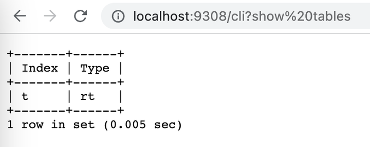

# HTTP

Вы можете подключиться к Manticore Search через HTTP/HTTPS.

## Конфигурация
<!-- example HTTP -->
По умолчанию Manticore слушает HTTP, HTTPS и бинарные запросы на портах 9308 и 9312.

В секции "searchd" вашего конфигурационного файла вы можете определить HTTP порт, используя директиву `listen`, следующим образом:

Оба варианта верны и имеют одинаковое значение (за исключением номера порта). Они оба определяют слушатели, которые будут обслуживать все API/HTTP/HTTPS протоколы. Нет специальных требований, и любой HTTP клиент может использоваться для подключения к Manticore.

<!-- request HTTP -->
```ini
searchd {
...
   listen = 127.0.0.1:9308
   listen = 127.0.0.1:9312:http
...
}
```
<!-- end -->

Все HTTP конечные точки возвращают тип содержимого `application/json`. В основном, конечные точки используют JSON полезные нагрузки для запросов. Однако есть некоторые исключения, которые используют NDJSON или простые URL-кодированные полезные нагрузки.

В настоящее время нет пользовательской аутентификации. Поэтому убедитесь, что HTTP интерфейс не доступен никому вне вашей сети. Поскольку Manticore функционирует как любой другой веб-сервер, вы можете использовать обратный прокси, такой как Nginx, для реализации HTTP аутентификации или кеширования.

<!-- example HTTPS -->
Протокол HTTP также поддерживает [SSL шифрование](../Security/SSL.md):
Если вы укажете `:https` вместо `:http`, **только** защищенные соединения будут приняты. В противном случае, в случае отсутствия действительного ключа/сертификата, но клиент пытается подключиться через https – соединение будет разорвано. Если вы сделаете не HTTPS, а HTTP запрос на 9443, он ответит кодом HTTP 400.

<!-- request HTTPS -->
```ini
searchd {
...
   listen = 127.0.0.1:9308
   listen = 127.0.0.1:9443:https
...
}
```
<!-- end -->

### VIP соединение
<!-- example VIP -->
Отдельный HTTP интерфейс может использоваться для 'VIP' соединений. В этом случае соединение огибает пул потоков и всегда создает новый специализированный поток. Это полезно для управления Manticore Search в периоды сильной перегрузки, когда сервер может зависнуть или не разрешить обычные портовые соединения.

Для получения дополнительной информации об директиве `listen`, см. [этот раздел](../Server_settings/Searchd.md#listen).

<!-- request VIP -->
```ini
searchd {
...
   listen = 127.0.0.1:9308
   listen = 127.0.0.1:9318:_vip
...
}
```
<!-- end -->

## SQL через HTTP

Manticore предоставляет конечные точки `/sql`, `/cli` и `/cli_json` для выполнения SQL запросов через HTTP. Каждая конечная точка предназначена для конкретных случаев использования:

* `/sql`: Подходит для программного использования из приложений.
  - Конечная точка `/sql` принимает только операторы SELECT и возвращает ответ в формате HTTP JSON.
  - Конечная точка `/sql?mode=raw` принимает любые SQL запросы и возвращает ответ в сыром формате, аналогично тому, что вы получите через mysql.
* `/cli`: Предназначена **только для ручного использования** (например, через curl или браузер). **Не рекомендуется для скриптов.**
* `/cli_json`: Похожа на `/cli`, но возвращает результаты в формате JSON. **Не рекомендуется для скриптов.**

### /sql

<!-- example SQL_over_HTTP -->

Общий синтаксис:
* `curl "localhost:6780/sql[?mode=raw]&query={URL_ENCODED_QUERY}"`
* `curl localhost:6780/sql[?mode=raw] -d "[query={URL_ENCODED_QUERY}|{NOT_URL_ENCODED_QUERY}]"`

Конечная точка `/sql` принимает SQL запрос через HTTP JSON интерфейс:
* Без `mode=raw` - только [SELECT](../Searching/Full_text_matching/Basic_usage.md#SQL) разрешены, возвращая ответ в формате JSON.
* С [mode=raw](../Connecting_to_the_server/HTTP.md#mode=raw) - любой SQL запрос разрешен, возвращая ответ в сыром формате.

Конечная точка может обрабатывать HTTP запросы с использованием как метода GET, так и метода POST. Для отправки запросов вы можете:
1. **Используя GET:** Включите запрос в параметр `query` URL, например, `/sql?query=your_encoded_query_here`. **Важно URL-кодировать** этот параметр, чтобы избежать ошибок, особенно если запрос включает знак `=`, который может быть интерпретирован как часть синтаксиса URL, а не запрос.
2. **Используя POST:** Вы также можете отправить запрос в теле POST запроса. При использовании этого метода:
   - Если вы отправляете запрос как параметр с именем `query`, **убедитесь, что он URL-кодирован**.
   - Если вы отправляете запрос непосредственно как обычный текст (сырое тело POST), **не URL-кодируйте его**. Это полезно, когда запрос длинный или сложный, или если запрос хранится в файле, и вы хотите отправить его в том виде, в каком он есть, указав вашему HTTP клиенту (например, `curl`) на него.

Этот подход сохраняет использование GET и POST различными и избегает путаницы с комбинированием методов в одном запросе.

Без `mode=raw` ответ представляет собой JSON, содержащий информацию о попаданиях и времени выполнения. Формат ответа такой же, как у [json/search](../Searching/Full_text_matching/Basic_usage.md#HTTP-JSON) конечной точки. Обратите внимание, что конечная точка `/sql` поддерживает только одиночные поисковые запросы. Для обработки многозапроса см. раздел ниже о [сыром режиме](../Connecting_to_the_server/HTTP.md#mode=raw).

<!-- request POST -->
```bash
POST /sql
select id,subject,author_id  from forum where match('@subject php manticore') group by author_id order by id desc limit 0,5
```

<!-- response POST -->
```json
{
  "took": 0,
  "timed_out": false,
  "hits": {
    "total": 2,
    "total_relation": "eq",
    "hits": [
      {
        "_id": 2,
        "_score": 2356,
        "_source": {
          "subject": "php manticore",
          "author_id": 12
        }
      },
      {
        "_id": 1,
        "_score": 2356,
        "_source": {
          "subject": "php manticore",
          "author_id": 11
        }
      }
    ]
  }
}
```

<!-- request POST URL-encoded -->
```bash
POST /sql query=select%20id%2Csubject%2Cauthor_id%20%20from%20forum%20where%20match%28%27%40subject%20php%20manticore%27%29%20group%20by%20author_id%20order%20by%20id%20desc%20limit%200%2C5
```

<!-- response POST URL-encoded -->
```json
{
  "took": 0,
  "timed_out": false,
  "hits": {
    "total": 2,
    "total_relation": "eq",
    "hits": [
      {
        "_id": 2,
        "_score": 2356,
        "_source": {
          "subject": "php manticore",
          "author_id": 12
        }
      },
      {
        "_id": 1,
        "_score": 2356,
        "_source": {
          "subject": "php manticore",
          "author_id": 11
        }
      }
    ]
  }
}
```

<!-- request GET URL-encoded -->
```bash
GET /sql?query=select%20id%2Csubject%2Cauthor_id%20%20from%20forum%20where%20match%28%27%40subject%20php%20manticore%27%29%20group%20by%20author_id%20order%20by%20id%20desc%20limit%200%2C5
```

<!-- response GET URL-encoded -->
```json
{
  "took": 0,
  "timed_out": false,
  "hits": {
    "total": 2,
    "total_relation": "eq",
    "hits": [
      {
        "_id": 2,
        "_score": 2356,
        "_source": {
          "subject": "php manticore",
          "author_id": 12
        }
      },
      {
        "_id": 1,
        "_score": 2356,
        "_source": {
          "subject": "php manticore",
          "author_id": 11
        }
      }
    ]
  }
}
```

<!-- end -->

#### mode=raw

<!-- example mode=raw -->

Точка доступа `/sql` также включает специальный режим "сырых" данных, который позволяет вам отправлять **любые допустимые SQL-запросы, включая многозапросы**. Ответ представляет собой массив JSON, содержащий один или несколько наборов результатов. Вы можете активировать этот режим, используя параметр `mode=raw`.

<!-- request POST -->
```bash
POST /sql?mode=raw
desc test
```

<!-- response POST -->
```json
[
  {
    "columns": [
      {
        "Field": {
          "type": "string"
        }
      },
      {
        "Type": {
          "type": "string"
        }
      },
      {
        "Properties": {
          "type": "string"
        }
      }
    ],
    "data": [
      {
        "Field": "id",
        "Type": "bigint",
        "Properties": ""
      },
      {
        "Field": "title",
        "Type": "text",
        "Properties": "indexed"
      },
      {
        "Field": "gid",
        "Type": "uint",
        "Properties": ""
      },
      {
        "Field": "title",
        "Type": "string",
        "Properties": ""
      },
      {
        "Field": "j",
        "Type": "json",
        "Properties": ""
      },
      {
        "Field": "new1",
        "Type": "uint",
        "Properties": ""
      }
    ],
    "total": 6,
    "error": "",
    "warning": ""
  }
]
```

<!-- request POST URL-encoded -->
```bash
POST /sql?mode=raw
query=desc%20test
```

<!-- response POST URL-encoded -->
```json
[
  {
    "columns": [
      {
        "Field": {
          "type": "string"
        }
      },
      {
        "Type": {
          "type": "string"
        }
      },
      {
        "Properties": {
          "type": "string"
        }
      }
    ],
    "data": [
      {
        "Field": "id",
        "Type": "bigint",
        "Properties": ""
      },
      {
        "Field": "title",
        "Type": "text",
        "Properties": "indexed"
      },
      {
        "Field": "gid",
        "Type": "uint",
        "Properties": ""
      },
      {
        "Field": "title",
        "Type": "string",
        "Properties": ""
      },
      {
        "Field": "j",
        "Type": "json",
        "Properties": ""
      },
      {
        "Field": "new1",
        "Type": "uint",
        "Properties": ""
      }
    ],
    "total": 6,
    "error": "",
    "warning": ""
  }
]
```

<!-- request POST URL-encoded 2nd way -->
```bash
POST /sql
mode=raw&query=desc%20test
```

<!-- response POST URL-encoded 2nd way -->
```json
[
  {
    "columns": [
      {
        "Field": {
          "type": "string"
        }
      },
      {
        "Type": {
          "type": "string"
        }
      },
      {
        "Properties": {
          "type": "string"
        }
      }
    ],
    "data": [
      {
        "Field": "id",
        "Type": "bigint",
        "Properties": ""
      },
      {
        "Field": "title",
        "Type": "text",
        "Properties": "indexed"
      },
      {
        "Field": "gid",
        "Type": "uint",
        "Properties": ""
      },
      {
        "Field": "title",
        "Type": "string",
        "Properties": ""
      },
      {
        "Field": "j",
        "Type": "json",
        "Properties": ""
      },
      {
        "Field": "new1",
        "Type": "uint",
        "Properties": ""
      }
    ],
    "total": 6,
    "error": "",
    "warning": ""
  }
]
```

<!-- request GET URL-encoded -->
```bash
GET /sql?mode=raw&query=desc%20test
```

<!-- response GET URL-encoded -->
```json
[
  {
    "columns": [
      {
        "Field": {
          "type": "string"
        }
      },
      {
        "Type": {
          "type": "string"
        }
      },
      {
        "Properties": {
          "type": "string"
        }
      }
    ],
    "data": [
      {
        "Field": "id",
        "Type": "bigint",
        "Properties": ""
      },
      {
        "Field": "title",
        "Type": "text",
        "Properties": "indexed"
      },
      {
        "Field": "gid",
        "Type": "uint",
        "Properties": ""
      },
      {
        "Field": "title",
        "Type": "string",
        "Properties": ""
      },
      {
        "Field": "j",
        "Type": "json",
        "Properties": ""
      },
      {
        "Field": "new1",
        "Type": "uint",
        "Properties": ""
      }
    ],
    "total": 6,
    "error": "",
    "warning": ""
  }
]
```

<!-- request curl examples -->
```bash
# POST:
curl localhost:9308/sql?mode=raw -d 'SHOW TABLES'

# POST, URL-encoded:
curl localhost:9308/sql?mode=raw -d 'query=SHOW%20TABLES'

# POST, URL-encoded, 2nd way:
curl localhost:9308/sql -d 'mode=raw&query=SHOW%20TABLES'

# POST, URL-non-encoded:
curl localhost:9308/sql -d 'mode=raw&query=SHOW TABLES'
```

<!-- end -->


### /cli

<!-- example cli -->

> ЗАМЕТКА: `/cli` требует [Manticore Buddy](../Installation/Manticore_Buddy.md). Если это не работает, убедитесь, что Buddy установлен.

> ЗАМЕТКА: Эндпоинт `/cli` предназначен для ручного взаимодействия с Manticore с использованием таких инструментов, как curl или браузер. Он не предназначен для использования в автоматических скриптах. Вместо этого используйте эндпоинт `/sql`.

Хотя эндпоинт `/sql` полезен для программного управления Manticore из вашего приложения, также есть эндпоинт `/cli`. Это упрощает **ручное обслуживание экземпляра Manticore** с использованием curl или вашего браузера. Он принимает как методы HTTP POST, так и GET. Все, что введено после `/cli?`, воспринимается Manticore, даже если это не было вручную экранировано с помощью curl или автоматически закодировано браузером. Параметр `query` не требуется. Важно, что знак `+` не изменяется на пробел, устраняя необходимость его кодирования. Для метода POST Manticore принимает все точно так, как есть, без каких-либо изменений. Ответ в табличном формате, аналогичном набору результатов SQL, который вы можете увидеть в клиенте MySQL.

<!-- request POST -->

```bash
POST /cli
desc test
```

<!-- response POST -->

```bash
+-------+--------+----------------+
| Field | Type   | Properties     |
+-------+--------+----------------+
| id    | bigint |                |
| body  | text   | indexed stored |
| title | string |                |
+-------+--------+----------------+
3 rows in set (0.001 sec)
```

<!-- request GET -->

```bash
GET /cli?desc%20test
```

<!-- response GET -->

```bash
+-------+--------+----------------+
| Field | Type   | Properties     |
+-------+--------+----------------+
| id    | bigint |                |
| body  | text   | indexed stored |
| title | string |                |
+-------+--------+----------------+
3 rows in set (0.001 sec)
```

<!-- request Browser -->



<!-- request curl example -->

```bash
curl 0:9308/cli -d 'desc test'
```

<!-- response curl example -->

```sql
+-------+--------+----------------+
| Field | Type   | Properties     |
+-------+--------+----------------+
| id    | bigint |                |
| title | text   | indexed stored |
+-------+--------+----------------+
2 rows in set (0.001 sec)
```

<!-- end -->

### /cli_json
> ЗАМЕТКА: Эндпоинт `/cli_json` предназначен для ручного взаимодействия с Manticore с использованием таких инструментов, как curl или браузер. Он не предназначен для использования в автоматических скриптах. Вместо этого используйте эндпоинт `/sql`.

<!-- example cli_json -->
Эндпоинт `/cli_json` предоставляет те же функции, что и `/cli`, но формат ответа — JSON. Он включает в себя:
- раздел `columns`, описывающий схему.
- раздел `data`, содержащий фактические данные.
- раздел сводки с "total", "error" и "warning".

<!-- request POST -->

```bash
POST /cli_json
desc test
```

<!-- response POST -->

```json
[
   {
      "columns":[
         {
            "Field":{
               "type":"string"
            }
         },
         {
            "Type":{
               "type":"string"
            }
         },
         {
            "Properties":{
               "type":"string"
            }
         }
      ],
      "data":[
         {
            "Field":"id",
            "Type":"bigint",
            "Properties":""
         },
         {
            "Field":"body",
            "Type":"text",
            "Properties":"indexed stored"
         },
         {
            "Field":"title",
            "Type":"string",
            "Properties":""
         }
      ],
      "total":3,
      "error":"",
      "warning":""
   }
]
```

<!-- request GET -->

```bash
GET /cli_json?desc%20test
```

<!-- response GET -->

```json
[
   {
      "columns":[
         {
            "Field":{
               "type":"string"
            }
         },
         {
            "Type":{
               "type":"string"
            }
         },
         {
            "Properties":{
               "type":"string"
            }
         }
      ],
      "data":[
         {
            "Field":"id",
            "Type":"bigint",
            "Properties":""
         },
         {
            "Field":"body",
            "Type":"text",
            "Properties":"indexed stored"
         },
         {
            "Field":"title",
            "Type":"string",
            "Properties":""
         }
      ],
      "total":3,
      "error":"",
      "warning":""
   }
]
```

<!-- request curl example -->

```bash
curl 0:9308/cli_json -d 'desc test'
```
<!-- response curl example -->

```json
[{
"columns":[{"Field":{"type":"string"}},{"Type":{"type":"string"}},{"Properties":{"type":"string"}}],
"data":[
{"Field":"id","Type":"bigint","Properties":""},
{"Field":"body","Type":"text","Properties":"indexed stored"},
{"Field":"title","Type":"string","Properties":""}
],
"total":3,
"error":"",
"warning":""
}]
```

<!-- end -->

### Поддержка keep-alive

HTTP keep-alive поддерживается для конечных точек `/sql`, `/sql?mode=raw` и `/cli_json`, но не для конечной точки `/cli`. Эта функция обеспечивает состоявшиеся взаимодействия через HTTP JSON интерфейс, при условии, что клиент также поддерживает keep-alive. Например, используя конечную точку [/cli_json](../Connecting_to_the_server/HTTP.md#/cli_json), вы можете выполнить команду `SHOW META` после запроса `SELECT`, и это будет вести себя аналогично взаимодействиям с Manticore через MySQL клиент.

<!-- proofread -->

