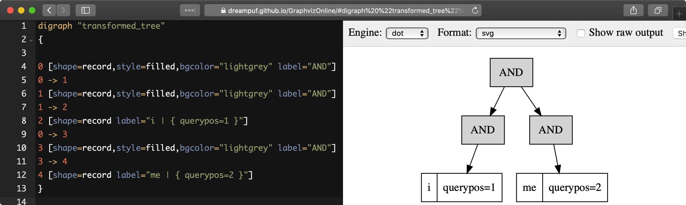

# План запроса

<!-- example SHOW PLAN -->

Инструкции SQL `SHOW PLAN` и интерфейс JSON с опцией `"plan": N` отображают план выполнения запроса. План создается и хранится во время фактического выполнения, поэтому в случае SQL профилирование должно быть включено в текущей сессии **перед** выполнением этого запроса. Это можно сделать с помощью инструкции `SET profiling=1`.

В режиме SQL возвращаются два элемента:
* `transformed_tree`, который отображает разложение запроса в текстовом формате.
* `enabled_indexes`, который предоставляет информацию об эффективных вторичных индексах.

Чтобы просмотреть план выполнения запроса в JSON, добавьте `"plan": N` к запросу. Результат появится как свойство `plan` в наборе результатов. `N` может быть одним из следующих:
* 1 - Отображает только текстовый план корневого узла, аналогичный тому, который возвращается в запросе SQL `SHOW PLAN`. Это наиболее компактная форма.
* 2 - Отображает только план в формате JSON, полезный для обработки.
* 3 - Отображает объект JSON с текстовым описанием каждого узла. Обратите внимание, что описание дочерних узлов также присутствует и повторяет часть описания родителя, что делает все представление довольно большим.


<!-- intro -->
##### SQL:
<!-- request SQL -->

```sql
set profiling=1;

select * from hn_small where match('dog|cat') limit 0;

show plan;
```

<!-- response SQL -->

```sql
*************************** 1. row ***************************
Variable: transformed_tree
   Value: OR(
  AND(KEYWORD(dog, querypos=1)),
  AND(KEYWORD(cat, querypos=2)))
*************************** 2. row ***************************
Variable: enabled_indexes
   Value:
2 rows in set (0.00 sec)
```

<!-- intro -->
##### JSON:

<!-- request JSON -->

```json
POST /search
{
  "table": "hn_small",
  "query": {"query_string": "dog|cat"},
  "_source": { "excludes":["*"] },
  "limit": 0,
  "plan": 3
}
```

<!-- response JSON -->
```json
{
  "took": 0,
  "timed_out": false,
  "hits": {
    "total": 4453,
    "total_relation": "eq",
    "hits": []
  },
  "plan": {
    "query": {
      "type": "OR",
      "description": "OR( AND(KEYWORD(dog, querypos=1)),  AND(KEYWORD(cat, querypos=2)))",
      "children": [
        {
          "type": "AND",
          "description": "AND(KEYWORD(dog, querypos=1))",
          "children": [
            {
              "type": "KEYWORD",
              "word": "dog",
              "querypos": 1
            }
          ]
        },
        {
          "type": "AND",
          "description": "AND(KEYWORD(cat, querypos=2))",
          "children": [
            {
              "type": "KEYWORD",
              "word": "cat",
              "querypos": 2
            }
          ]
        }
      ]
    }
  }
}
```

<!-- end -->

<!-- example SHOW PLAN EXPANSION -->

В некоторых случаях оцененное дерево запроса может сильно отличаться от исходного из-за развертываний и других преобразований.

<!-- intro -->
##### SQL:
<!-- request SQL -->

```sql
SET profiling=1;

SELECT id FROM forum WHERE MATCH('@title way* @content hey') LIMIT 1;

SHOW PLAN;
```

<!-- response SQL -->

```sql
Query OK, 0 rows affected (0.00 sec)

+--------+
| id     |
+--------+
| 711651 |
+--------+
1 row in set (0.04 sec)

+------------------+-------------------------------------------------------------------------------------------------------------------------------------------------------------------------------------------------------------------------------------------------------------------------------------------------------------------------------------------------------------------------------------------------------------------------+
| Variable         | Value                                                                                                                                                                                                                                                                                                                                                                                                                   |
+------------------+-------------------------------------------------------------------------------------------------------------------------------------------------------------------------------------------------------------------------------------------------------------------------------------------------------------------------------------------------------------------------------------------------------------------------+
| transformed_tree | AND(
  OR(
    OR(
      AND(fields=(title), KEYWORD(wayne, querypos=1, expanded)),
      OR(
        AND(fields=(title), KEYWORD(ways, querypos=1, expanded)),
        AND(fields=(title), KEYWORD(wayyy, querypos=1, expanded)))),
    AND(fields=(title), KEYWORD(way, querypos=1, expanded)),
    OR(fields=(title), KEYWORD(way*, querypos=1, expanded))),
  AND(fields=(content), KEYWORD(hey, querypos=2))) |
+------------------+-------------------------------------------------------------------------------------------------------------------------------------------------------------------------------------------------------------------------------------------------------------------------------------------------------------------------------------------------------------------------------------------------------------------------+
1 row in set (0.00 sec)
```

<!-- intro -->
##### JSON full format:

<!-- request JSON -->

```JSON
POST /search
{
  "table": "forum",
  "query": {"query_string": "@title way* @content hey"},
  "_source": { "excludes":["*"] },
  "limit": 1,
  "plan": 3
}
```

<!-- response JSON -->
```JSON
{
  "took":33,
  "timed_out":false,
  "hits":
  {
    "total":105,
    "hits":
    [
       {
          "_id": 711651,
          "_score":2539,
          "_source":{}
       }
    ]
  },
  "plan":
  {
    "query":
    {
      "type":"AND",
      "description":"AND( OR( OR( AND(fields=(title), KEYWORD(wayne, querypos=1, expanded)),  OR( AND(fields=(title), KEYWORD(ways, querypos=1, expanded)),  AND(fields=(title), KEYWORD(wayyy, querypos=1, expanded)))),  AND(fields=(title), KEYWORD(way, querypos=1, expanded)),  OR(fields=(title), KEYWORD(way*, querypos=1, expanded))),  AND(fields=(content), KEYWORD(hey, querypos=2)))",
      "children":
      [
        {
          "type":"OR",
          "description":"OR( OR( AND(fields=(title), KEYWORD(wayne, querypos=1, expanded)),  OR( AND(fields=(title), KEYWORD(ways, querypos=1, expanded)),  AND(fields=(title), KEYWORD(wayyy, querypos=1, expanded)))),  AND(fields=(title), KEYWORD(way, querypos=1, expanded)),  OR(fields=(title), KEYWORD(way*, querypos=1, expanded)))",
          "children":
          [
            {
               "type":"OR",
               "description":"OR( AND(fields=(title), KEYWORD(wayne, querypos=1, expanded)),  OR( AND(fields=(title), KEYWORD(ways, querypos=1, expanded)),  AND(fields=(title), KEYWORD(wayyy, querypos=1, expanded))))",
               "children":
               [
                 {
                   "type":"AND",
                   "description":"AND(fields=(title), KEYWORD(wayne, querypos=1, expanded))",
                   "fields":["title"],
                   "max_field_pos":0,
                   "children":
                   [
                     {
                       "type":"KEYWORD",
                       "word":"wayne",
                       "querypos":1,
                       "expanded":true
                     }
                   ]
                 },
                 {
                   "type":"OR",
                   "description":"OR( AND(fields=(title), KEYWORD(ways, querypos=1, expanded)),  AND(fields=(title), KEYWORD(wayyy, querypos=1, expanded)))",
                   "children":
                   [
                     {
                       "type":"AND",
                       "description":"AND(fields=(title), KEYWORD(ways, querypos=1, expanded))",
                       "fields":["title"],
                       "max_field_pos":0,
                       "children":
                       [
                         {
                           "type":"KEYWORD",
                           "word":"ways",
                           "querypos":1,
                           "expanded":true
                         }
                       ]
                     },
                     {
                       "type":"AND",
                       "description":"AND(fields=(title), KEYWORD(wayyy, querypos=1, expanded))",
                       "fields":["title"],
                       "max_field_pos":0,
                       "children":
                       [
                         {
                           "type":"KEYWORD",
                           "word":"wayyy",
                           "querypos":1,
                           "expanded":true
                         }
                       ]
                     }
                   ]
                 }
               ]
            },
            {
              "type":"AND",
              "description":"AND(fields=(title), KEYWORD(way, querypos=1, expanded))",
              "fields":["title"],
              "max_field_pos":0,
              "children":
              [
                 {
                    "type":"KEYWORD",
                    "word":"way",
                    "querypos":1,
                    "expanded":true
                 }
              ]
            },
            {
              "type":"OR",
              "description":"OR(fields=(title), KEYWORD(way*, querypos=1, expanded))",
              "fields":["title"],
              "max_field_pos":0,
              "children":
              [
                {
                  "type":"KEYWORD",
                  "word":"way*",
                  "querypos":1,
                  "expanded":true
                }
              ]
            }
          ]
        },
        {
          "type":"AND",
          "description":"AND(fields=(content), KEYWORD(hey, querypos=2))",
          "fields":["content"],
          "max_field_pos":0,
          "children":
          [
            {
              "type":"KEYWORD",
              "word":"hey",
              "querypos":2
            }
          ]
        }
      ]
    }
  }
}
```

<!-- intro -->

##### JSON объект формат:

<!-- request JSON -->

```JSON
POST /search
{
  "table": "forum",
  "query": {"query_string": "@title way* @content hey"},
  "_source": { "excludes":["*"] },
  "limit": 1,
  "plan": 2
}
```

<!-- response JSON -->

```JSON
{
  "took": 33,
  "timed_out": false,
  "hits": {
    "total": 105,
    "hits": [
      {
        "_id": 711651,
        "_score": 2539,
        "_source": {}
      }
    ]
  },
  "plan": {
    "query": {
      "type": "AND",
      "children": [
        {
          "type": "OR",
          "children": [
            {
              "type": "OR",
              "children": [
                {
                  "type": "AND",
                  "fields": [
                    "title"
                  ],
                  "max_field_pos": 0,
                  "children": [
                    {
                      "type": "KEYWORD",
                      "word": "wayne",
                      "querypos": 1,
                      "expanded": true
                    }
                  ]
                },
                {
                  "type": "OR",
                  "children": [
                    {
                      "type": "AND",
                      "fields": [
                        "title"
                      ],
                      "max_field_pos": 0,
                      "children": [
                        {
                          "type": "KEYWORD",
                          "word": "ways",
                          "querypos": 1,
                          "expanded": true
                        }
                      ]
                    },
                    {
                      "type": "AND",
                      "fields": [
                        "title"
                      ],
                      "max_field_pos": 0,
                      "children": [
                        {
                          "type": "KEYWORD",
                          "word": "wayyy",
                          "querypos": 1,
                          "expanded": true
                        }
                      ]
                    }
                  ]
                }
              ]
            },
            {
              "type": "AND",
              "fields": [
                "title"
              ],
              "max_field_pos": 0,
              "children": [
                {
                  "type": "KEYWORD",
                  "word": "way",
                  "querypos": 1,
                  "expanded": true
                }
              ]
            },
            {
              "type": "OR",
              "fields": [
                "title"
              ],
              "max_field_pos": 0,
              "children": [
                {
                  "type": "KEYWORD",
                  "word": "way*",
                  "querypos": 1,
                  "expanded": true
                }
              ]
            }
          ]
        },
        {
          "type": "AND",
          "fields": [
            "content"
          ],
          "max_field_pos": 0,
          "children": [
            {
              "type": "KEYWORD",
              "word": "hey",
              "querypos": 2
            }
          ]
        }
      ]
    }
  }
}
```

<!-- intro -->

##### JSON короткий формат:

<!-- request JSON -->

```JSON
POST /search
{
  "table": "forum",
  "query": {"query_string": "@title way* @content hey"},
  "_source": { "excludes":["*"] },
  "limit": 1,
  "plan": 1
}
```

<!-- response JSON -->

```JSON
{
  "took":33,
  "timed_out":false,
  "hits":
  {
    "total":105,
    "hits":
    [
       {
          "_id": 711651,
          "_score":2539,
          "_source":{}
       }
    ]
  },
  "plan":
  {
    "query":
    {
      "description":"AND( OR( OR( AND(fields=(title), KEYWORD(wayne, querypos=1, expanded)),  OR( AND(fields=(title), KEYWORD(ways, querypos=1, expanded)),  AND(fields=(title), KEYWORD(wayyy, querypos=1, expanded)))),  AND(fields=(title), KEYWORD(way, querypos=1, expanded)),  OR(fields=(title), KEYWORD(way*, querypos=1, expanded))),  AND(fields=(content), KEYWORD(hey, querypos=2)))"
    }
  }
}
```

<!-- end -->

See also [EXPLAIN QUERY](../../Searching/Full_text_matching/Profiling.md#Profiling-without-running-a-query). It displays the execution tree of a full-text query **без фактического выполнения запроса**. Обратите внимание, что при использовании `SHOW PLAN` после запроса к таблице в реальном времени результат будет основан на случайном дисковом/ОЗУ фрагменте. Поэтому, если вы недавно изменили настройки токенизации таблицы или если фрагменты значительно различаются по словарям и т.д., вы можете не получить ожидаемый результат. Примите это во внимание и также рассмотрите возможность использования `EXPLAIN QUERY`.

## Заметки по результатам JSON

`query` свойство содержит преобразованное дерево полнотекстового запроса. Каждый узел содержит:

* `type`: тип узла. Может быть `AND`, `OR`, `PHRASE`, `KEYWORD` и т.д.
* `description`: поддерево запроса для этого узла, показанное в виде строки (в формате `SHOW PLAN`).
* `children`: дочерние узлы, если есть.
* `max_field_pos`: максимальная позиция в поле.
* `word`: преобразованное ключевое слово. Только для узлов ключевых слов.
* `querypos`: позиция этого ключевого слова в запросе. Только для узлов ключевых слов.
* `excluded`: ключевое слово, исключенное из запроса. Только для узлов ключевых слов.
* `expanded`: ключевое слово, добавленное расширением префикса. Только для узлов ключевых слов.
* `field_start`: ключевое слово должно находиться в самом начале поля. Только для узлов ключевых слов.
* `field_end`: ключевое слово должно находиться в самом конце поля. Только для узлов ключевых слов.
* `boost`: IDF ключевого слова будет умножен на это. Только для узлов ключевых слов.

## Формат Dot для SHOW PLAN
`SHOW PLAN format=dot` позволяет возвращать дерево выполнения полнотекстового запроса в иерархическом формате, подходящем для визуализации с помощью существующих инструментов, таких как https://dreampuf.github.io/GraphvizOnline:

```sql
MySQL [(none)]> show plan option format=dot\G
*************************** 1. row ***************************
Variable: transformed_tree
   Value: digraph "transformed_tree"
{

0 [shape=record,style=filled,bgcolor="lightgrey" label="AND"]
0 -> 1
1 [shape=record,style=filled,bgcolor="lightgrey" label="AND"]
1 -> 2
2 [shape=record label="i | { querypos=1 }"]
0 -> 3
3 [shape=record,style=filled,bgcolor="lightgrey" label="AND"]
3 -> 4
4 [shape=record label="me | { querypos=2 }"]
}
```


<!-- proofread -->
