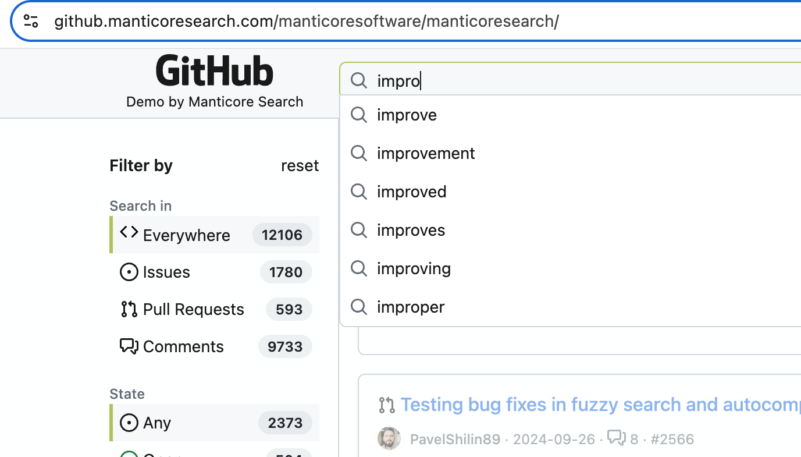

# Автозаполнение

Автозаполнение, или дополнение слова, предсказывает и предлагает окончание слова или фразы по мере ввода. Обычно используется в:
- Поисковых строках на сайтах
- Подсказках в поисковых системах
- Текстовых полях в приложениях

Manticore предлагает продвинутую функцию автозаполнения, которая дает подсказки во время ввода, аналогично известным поисковым системам. Это помогает ускорить поиск и позволяет пользователям быстрее находить нужное.

Помимо базовой функциональности автозаполнения, Manticore включает расширенные возможности для улучшения пользовательского опыта:

1. **Коррекция орфографии (Fuzziness):** Автозаполнение Manticore помогает исправлять орфографические ошибки с помощью алгоритмов, которые распознают и исправляют распространённые ошибки. Это значит, что даже если вы ошиблись при вводе, вы всё равно сможете найти то, что искали.
2. **Автоматическое определение раскладки клавиатуры:** Manticore может определить, какую раскладку клавиатуры вы используете. Это особенно полезно в местах с множеством языков или если вы случайно печатаете не на том языке. Например, если вы ошибочно ввели "ghbdtn", Manticore поймёт, что вы хотели написать "привет" и предложит правильное слово.

Автозаполнение Manticore можно настроить под разные нужды и параметры, что делает его гибким инструментом для многих приложений.


## ВЫЗОВ AUTOCOMPLETE

> ПРИМЕЧАНИЕ: `CALL AUTOCOMPLETE` и `/autocomplete` требуют [Manticore Buddy](../Installation/Manticore_Buddy.md). Если не работает, убедитесь, что Buddy установлен.

<!-- example call_autocomplete -->
Для использования автозаполнения в Manticore используйте SQL-запрос `CALL AUTOCOMPLETE` или его JSON-эквивалент `/autocomplete`. Эта функция предоставляет предложения по дополнению слов на основе ваших индексированных данных.

Перед использованием убедитесь, что в таблице, которую вы собираетесь использовать для автозаполнения, включены [инфиксы](../Creating_a_table/NLP_and_tokenization/Wildcard_searching_settings.md#min_infix_len).

**Примечание:** В настройках таблицы есть автоматическая проверка `min_infix_len`, которая использует кэш на 30 секунд для улучшения производительности `CALL AUTOCOMPLETE`. После внесения изменений в таблицу может быть небольшая задержка при первом использовании `CALL AUTOCOMPLETE` (обычно незаметная). Кэшируются только успешные результаты, поэтому если вы удалите таблицу или отключите `min_infix_len`, `CALL AUTOCOMPLETE` может временно возвращать некорректные результаты, пока не начнёт показывать ошибку, связанную с `min_infix_len`.

### Общий синтаксис

#### SQL
```sql
CALL AUTOCOMPLETE('query_beginning', 'table', [...options]);
```

#### JSON
```json
POST /autocomplete
{
	"table":"table_name",
	"query":"query_beginning"
	[,"options": {<autocomplete options>}]
}
```

#### Опции
- `layouts`: Строка с разделёнными запятыми кодами раскладок клавиатуры для обнаружения ошибок ввода из-за несоответствия раскладок (например, ввод "ghbdtn" вместо "привет" при неправильной раскладке). Manticore сравнивает позиции символов в разных раскладках для предложения исправлений. Требуется минимум 2 раскладки для эффективного обнаружения несоответствий. Доступные варианты: us, ru, ua, se, pt, no, it, gr, uk, fr, es, dk, de, ch, br, bg, be (подробнее [здесь](../Searching/Spell_correction.md#Options)). По умолчанию: none
- `fuzziness`: `0`, `1` или `2` (по умолчанию: `2`). Максимальное расстояние Левенштейна для поиска опечаток. Установите в `0` для отключения нечеткого поиска
- `preserve`: `0` или `1` (по умолчанию: `0`). При значении `1` сохраняет слова без нечетких совпадений в результатах поиска (например, "hello wrld" возвращает и "hello wrld", и "hello world"). При значении `0` возвращает только слова с успешными нечеткими совпадениями (например, "hello wrld" возвращает только "hello world"). Особенно полезно для сохранения коротких слов или собственных имён, которые могут отсутствовать в Manticore Search
- `prepend`: Булево (0/1 в SQL). Если true(1), добавляет звёздочку перед последним словом для расширения префикса (например, `*word`)
- `append`: Булево (0/1 в SQL). Если true(1), добавляет звёздочку после последнего слова для расширения суффикса (например, `word*`)
- `expansion_len`: Количество символов для расширения в последнем слове. По умолчанию: `10`
- `force_bigrams`: Булево (0/1 в SQL). Принудительно использует биграммы (2-символьные n-граммы) вместо триграмм для всех длин слов, что может улучшить совпадения для слов с ошибками перестановки символов. По умолчанию: `0` (использовать триграммы для слов длиной ≥6 символов)

<!-- request SQL -->

```sql
mysql> CALL AUTOCOMPLETE('hello', 'comment');
+------------+
| query      |
+------------+
| hello      |
| helio      |
| hell       |
| shell      |
| nushell    |
| powershell |
| well       |
| help       |
+------------+
```

<!-- request SQL with no fuzzy search -->

```sql
mysql> CALL AUTOCOMPLETE('hello', 'comment', 0 as fuzziness);
+-------+
| query |
+-------+
| hello |
+-------+
```

<!-- request JSON -->

```json
POST /autocomplete
{
	"table":"comment",
	"query":"hello"
}
```

<!-- response JSON -->
```json
[
  {
    "total": 8,
    "error": "",
    "warning": "",
    "columns": [
      {
        "query": {
          "type": "string"
        }
      }
    ],
    "data": [
      {
        "query": "hello"
      },
      {
        "query": "helio"
      },
      {
        "query": "hell"
      },
      {
        "query": "shell"
      },
      {
        "query": "nushell"
      },
      {
        "query": "powershell"
      },
      {
        "query": "well"
      },
      {
        "query": "help"
      }
    ]
  }
]
```

<!-- request SQL with preserve option -->

```sql
mysql> CALL AUTOCOMPLETE('hello wrld', 'comment', 1 as preserve);
+------------+
| query      |
+------------+
| hello wrld |
| hello world|
+------------+
```

<!-- request JSON with preserve option -->

```json
POST /autocomplete
{
	"table":"comment",
	"query":"hello wrld",
	"options": {
		"preserve": 1
	}
}
```

<!-- response JSON with preserve option -->
```json
[
  {
    "total": 2,
    "error": "",
    "warning": "",
    "columns": [
      {
        "query": {
          "type": "string"
        }
      }
    ],
    "data": [
      {
        "query": "hello wrld"
      },
      {
        "query": "hello world"
      }
    ]
  }
]
```

<!-- end -->

<!-- example force_bigrams option -->
##### Использование force_bigrams для лучшей обработки перестановок
Опция `force_bigrams` помогает с словами, в которых есть ошибки перестановки символов, например "ipohne" вместо "iphone". Используя биграммы вместо триграмм, алгоритм лучше справляется с перестановками символов.

<!-- request SQL -->
```sql
mysql> CALL AUTOCOMPLETE('ipohne', 'products', 1 as force_bigrams);
```

<!-- response SQL -->
```
+--------+
| query  |
+--------+
| iphone |
+--------+
```

<!-- request JSON -->
```json
POST /autocomplete
{
	"table":"products",
	"query":"ipohne",
	"options": {
		"force_bigrams": 1
	}
}
```

<!-- response JSON -->
```json
[
  {
    "total": 1,
    "error": "",
    "warning": "",
    "columns": [
      {
        "query": {
          "type": "string"
        }
      }
    ],
    "data": [
      {
        "query": "iphone"
      }
    ]
  }
]
```

<!-- end -->

#### Ссылки
* [Демонстрация](https://github.manticoresearch.com/manticoresoftware/manticoresearch) показывает работу автозаполнения:
  {.scale-0.7}
* Блог о нечетком поиске и автозаполнении - https://manticoresearch.com/blog/new-fuzzy-search-and-autocomplete/

## Альтернативные методы автозаполнения

Хотя `CALL AUTOCOMPLETE` является рекомендуемым методом для большинства случаев, Manticore также поддерживает другие управляемые и настраиваемые подходы для реализации функции автозаполнения:

##### Автозаполнение предложения
Для автозаполнения предложения можно использовать [инфиксный поиск](../Creating_a_table/NLP_and_tokenization/Wildcard_searching_settings.md#min_infix_len). Вы можете найти конец поля документа, указав его начало и:
* используя [оператор подстановки полного текста](../Searching/Full_text_matching/Operators.md) `*` для совпадения с любыми символами
* опционально используя `^` для начала с начала поля
* опционально используя `""` для поиска фразы
* и используя [подсветку результатов](../Searching/Highlighting.md)

В нашем блоге есть [статья об этом](https://manticoresearch.com/blog/simple-autocomplete-with-manticore/) и [интерактивный курс](https://play.manticoresearch.com/simpleautocomplete/). Быстрый пример:
* Предположим, у вас есть документ: `My cat loves my dog. The cat (Felis catus) is a domestic species of small carnivorous mammal.`
* Затем вы можете использовать `^`, `""` и `*`, чтобы по мере ввода пользователем формировать запросы, например: `^"m*"`, `^"my *"`, `^"my c*"`, `^"my ca*"` и так далее
* Он найдет документ, и если вы также используете [подсветку](../Searching/Highlighting.md), вы получите что-то вроде: `<b>My cat</b> loves my dog. The cat ( ...`

##### Автозаполнение слова
В некоторых случаях вам нужно автозаполнить одно слово или пару слов. В этом случае можно использовать `CALL KEYWORDS`.

### CALL KEYWORDS
`CALL KEYWORDS` доступна через SQL-интерфейс и предоставляет способ проверить, как ключевые слова токенизируются, или получить токенизированные формы конкретных ключевых слов. Если в таблице включены [инфиксы](../Creating_a_table/NLP_and_tokenization/Wildcard_searching_settings.md#min_infix_len), это позволяет быстро находить возможные окончания для заданных ключевых слов, что подходит для функции автозаполнения.

Это отличная альтернатива общему поиску с инфиксами, так как обеспечивает более высокую производительность, поскольку требует только словаря таблицы, а не самих документов.

### Общий синтаксис
<!-- example keywords -->
```sql
CALL KEYWORDS(text, table [, options])
```
Оператор `CALL KEYWORDS` разбивает текст на ключевые слова. Он возвращает токенизированные и нормализованные формы ключевых слов, а при необходимости — статистику по ключевым словам. Кроме того, он предоставляет позицию каждого ключевого слова в запросе и все формы токенизированных ключевых слов, если в таблице включены [лемматизаторы](../Creating_a_table/NLP_and_tokenization/Morphology.md).

| Параметр | Описание |
| - | - |
| text | Текст для разбиения на ключевые слова |
| table | Имя таблицы, из которой берутся настройки обработки текста |
| 0/1 as stats | Показать статистику по ключевым словам, по умолчанию 0 |
| 0/1 as fold_wildcards | Обрабатывать подстановочные знаки, по умолчанию 0 |
| 0/1 as fold_lemmas | Обрабатывать морфологические леммы, по умолчанию 0 |
| 0/1 as fold_blended | Обрабатывать составные слова, по умолчанию 0 |
| N as expansion_limit | Переопределить [expansion_limit](../Creating_a_table/NLP_and_tokenization/Wildcard_searching_settings.md#expansion_limit), заданный в конфигурации сервера, по умолчанию 0 (использовать значение из конфигурации) |
| docs/hits as sort_mode | Сортировать результаты по 'docs' или 'hits'. По умолчанию сортировка не применяется. |
| jieba_mode | Режим сегментации Jieba для запроса. Подробнее см. [jieba_mode](../Creating_a_table/NLP_and_tokenization/Morphology.md#jieba_mode) |

Примеры показывают, как это работает, если предположить, что пользователь пытается получить автозаполнение для "my cat ...". На стороне приложения все, что нужно — предлагать пользователю окончания из столбца "normalized" для каждого нового слова. Часто имеет смысл сортировать по hits или docs, используя `'hits' as sort_mode` или `'docs' as sort_mode`.

<!-- intro -->
##### Примеры:

<!-- request Examples -->

```sql
MySQL [(none)]> CALL KEYWORDS('m*', 't', 1 as stats);
+------+-----------+------------+------+------+
| qpos | tokenized | normalized | docs | hits |
+------+-----------+------------+------+------+
| 1    | m*        | my         | 1    | 2    |
| 1    | m*        | mammal     | 1    | 1    |
+------+-----------+------------+------+------+

MySQL [(none)]> CALL KEYWORDS('my*', 't', 1 as stats);
+------+-----------+------------+------+------+
| qpos | tokenized | normalized | docs | hits |
+------+-----------+------------+------+------+
| 1    | my*       | my         | 1    | 2    |
+------+-----------+------------+------+------+

MySQL [(none)]> CALL KEYWORDS('c*', 't', 1 as stats, 'hits' as sort_mode);
+------+-----------+-------------+------+------+
| qpos | tokenized | normalized  | docs | hits |
+------+-----------+-------------+------+------+
| 1    | c*        | cat         | 1    | 2    |
| 1    | c*        | carnivorous | 1    | 1    |
| 1    | c*        | catus       | 1    | 1    |
+------+-----------+-------------+------+------+

MySQL [(none)]> CALL KEYWORDS('ca*', 't', 1 as stats, 'hits' as sort_mode);
+------+-----------+-------------+------+------+
| qpos | tokenized | normalized  | docs | hits |
+------+-----------+-------------+------+------+
| 1    | ca*       | cat         | 1    | 2    |
| 1    | ca*       | carnivorous | 1    | 1    |
| 1    | ca*       | catus       | 1    | 1    |
+------+-----------+-------------+------+------+

MySQL [(none)]> CALL KEYWORDS('cat*', 't', 1 as stats, 'hits' as sort_mode);
+------+-----------+------------+------+------+
| qpos | tokenized | normalized | docs | hits |
+------+-----------+------------+------+------+
| 1    | cat*      | cat        | 1    | 2    |
| 1    | cat*      | catus      | 1    | 1    |
+------+-----------+------------+------+------+
```
<!-- end -->

<!-- example bigram -->
Есть хороший трюк, как улучшить описанный выше алгоритм — использовать [bigram_index](../Creating_a_table/NLP_and_tokenization/Low-level_tokenization.md#bigram_index). Если он включен для таблицы, то в нем индексируется не просто отдельное слово, а каждая пара слов, стоящих друг за другом, как отдельный токен.

Это позволяет предсказывать не только окончание текущего слова, но и следующее слово, что особенно полезно для автозаполнения.

<!-- intro -->
##### Примеры:

<!-- request Examples -->

```sql
MySQL [(none)]> CALL KEYWORDS('m*', 't', 1 as stats, 'hits' as sort_mode);
+------+-----------+------------+------+------+
| qpos | tokenized | normalized | docs | hits |
+------+-----------+------------+------+------+
| 1    | m*        | my         | 1    | 2    |
| 1    | m*        | mammal     | 1    | 1    |
| 1    | m*        | my cat     | 1    | 1    |
| 1    | m*        | my dog     | 1    | 1    |
+------+-----------+------------+------+------+

MySQL [(none)]> CALL KEYWORDS('my*', 't', 1 as stats, 'hits' as sort_mode);
+------+-----------+------------+------+------+
| qpos | tokenized | normalized | docs | hits |
+------+-----------+------------+------+------+
| 1    | my*       | my         | 1    | 2    |
| 1    | my*       | my cat     | 1    | 1    |
| 1    | my*       | my dog     | 1    | 1    |
+------+-----------+------------+------+------+

MySQL [(none)]> CALL KEYWORDS('c*', 't', 1 as stats, 'hits' as sort_mode);
+------+-----------+--------------------+------+------+
| qpos | tokenized | normalized         | docs | hits |
+------+-----------+--------------------+------+------+
| 1    | c*        | cat                | 1    | 2    |
| 1    | c*        | carnivorous        | 1    | 1    |
| 1    | c*        | carnivorous mammal | 1    | 1    |
| 1    | c*        | cat felis          | 1    | 1    |
| 1    | c*        | cat loves          | 1    | 1    |
| 1    | c*        | catus              | 1    | 1    |
| 1    | c*        | catus is           | 1    | 1    |
+------+-----------+--------------------+------+------+

MySQL [(none)]> CALL KEYWORDS('ca*', 't', 1 as stats, 'hits' as sort_mode);
+------+-----------+--------------------+------+------+
| qpos | tokenized | normalized         | docs | hits |
+------+-----------+--------------------+------+------+
| 1    | ca*       | cat                | 1    | 2    |
| 1    | ca*       | carnivorous        | 1    | 1    |
| 1    | ca*       | carnivorous mammal | 1    | 1    |
| 1    | ca*       | cat felis          | 1    | 1    |
| 1    | ca*       | cat loves          | 1    | 1    |
| 1    | ca*       | catus              | 1    | 1    |
| 1    | ca*       | catus is           | 1    | 1    |
+------+-----------+--------------------+------+------+

MySQL [(none)]> CALL KEYWORDS('cat*', 't', 1 as stats, 'hits' as sort_mode);
+------+-----------+------------+------+------+
| qpos | tokenized | normalized | docs | hits |
+------+-----------+------------+------+------+
| 1    | cat*      | cat        | 1    | 2    |
| 1    | cat*      | cat felis  | 1    | 1    |
| 1    | cat*      | cat loves  | 1    | 1    |
| 1    | cat*      | catus      | 1    | 1    |
| 1    | cat*      | catus is   | 1    | 1    |
+------+-----------+------------+------+------+
```
<!-- end -->

`CALL KEYWORDS` поддерживает распределённые таблицы, так что независимо от размера вашего набора данных вы можете использовать эту функцию.
<!-- proofread -->

