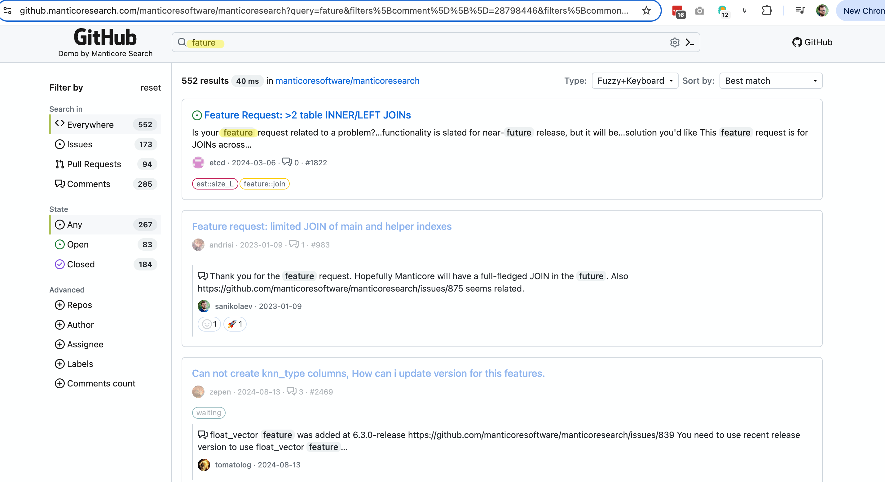
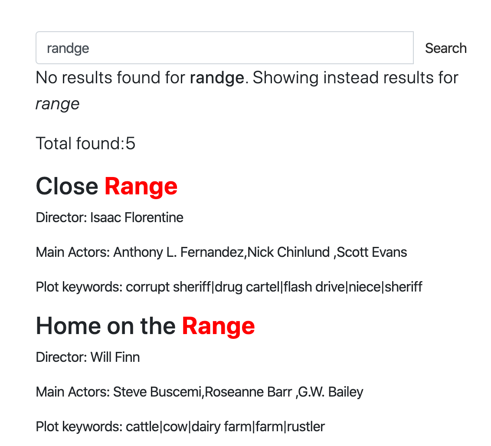

# Исправление ошибок в написании

Исправление ошибок в написании, также известное как:

* Автоматическая коррекция
* Коррекция текста
* Исправление орфографических ошибок
* Терпимость к опечаткам
* «Вы имели в виду?»

и так далее, — это программная функция, которая предлагает альтернативы или автоматически исправляет текст, который вы набрали. Концепция исправления набранного текста восходит к 1960-м годам, когда информатик Уоррен Тейтельман, также изобретший команду «отмена», ввел философию вычислений под названием D.W.I.M., или «Do What I Mean» (делай то, что я имею в виду). Вместо того чтобы программировать компьютеры на прием только идеально сформатированных инструкций, Тейтельман утверждал, что их следует программировать на распознавание очевидных ошибок.

Первым широко известным продуктом, предоставляющим функцию исправления орфографии, был Microsoft Word 6.0, выпущенный в 1993 году.

### Как это работает

Существует несколько способов выполнения исправления орфографии, но важно отметить, что нет чисто программного способа преобразовать вашу ошибочную запись «ipone» в «iphone» с приемлемым качеством. В основном система должна основываться на каком-то наборе данных. Набор данных может быть:

* Словарем правильно написанных слов, который, в свою очередь, может быть:
  * Основан на ваших реальных данных. Идея здесь в том, что, по большей части, орфография в словаре, составленном из ваших данных, корректна, и система пытается найти слово, максимально похожее на набранное (скоро мы обсудим, как это можно сделать с помощью Manticore).
  * Или может основываться на внешнем словаре, не связанном с вашими данными. Проблема, которая может возникнуть, заключается в том, что ваши данные и внешний словарь могут быть слишком разными: некоторые слова могут отсутствовать в словаре, в то время как другие отсутствуют в ваших данных.
* Не только основан на словаре, но и учитывающий контекст, например, «white ber» будет исправлено на «white bear», а «dark ber» — на «dark beer». Контекстом может быть не только соседнее слово в вашем запросе, но и ваше местоположение, время суток, грамматика текущего предложения (чтобы решить, менять ли «there» на «their» или нет), ваша история поиска и практически любые другие факторы, которые могут влиять на ваш замысел.
* Еще один классический подход — использовать предыдущие поисковые запросы в качестве набора данных для исправления орфографии. Этот способ более часто применяется в функциональности [автозаполнения](../Searching/Autocomplete.md), но имеет смысл и для автокоррекции. Идея в том, что пользователи в основном пишут правильно, поэтому можно использовать слова из их истории поиска как источник истины, даже если эти слова отсутствуют в наших документах или внешнем словаре. Здесь также возможна учет контекста.

Manticore предоставляет опцию нечеткого поиска и команды `CALL QSUGGEST` и `CALL SUGGEST`, которые можно использовать для автоматического исправления орфографии.

## Нечеткий поиск

Функция нечеткого поиска позволяет более гибко сопоставлять запросы, учитывая мелкие вариации или опечатки в поисковом запросе. Она работает аналогично обычному SQL-запросу `SELECT` или JSON-запросу `/search`, но предоставляет дополнительные параметры для управления поведением нечеткого сопоставления.

> ПРИМЕЧАНИЕ: Опция `fuzzy` требует [Manticore Buddy](../Installation/Manticore_Buddy.md). Если она не работает, убедитесь, что Buddy установлен.

## Общий синтаксис

### SQL

<!-- example Fuzzy_Search_SQL -->

```sql
SELECT
  ...
  MATCH('...')
  ...
  OPTION fuzzy={0|1}
  [, distance=N]
  [, preserve={0|1}]
  [, layouts='{be,bg,br,ch,de,dk,es,fr,uk,gr,it,no,pt,ru,se,ua,us}']
}
```

Примечание: При выполнении нечеткого поиска через SQL, в секции MATCH не должно быть полнотекстовых операторов, кроме [оператора поиска фраз](../Searching/Full_text_matching/Operators.md#Phrase-search-operator), и должны быть только слова, которые вы хотите найти.

<!-- intro -->
##### SQL:

<!-- request SQL -->

```sql
SELECT * FROM mytable WHERE MATCH('someting') OPTION fuzzy=1, layouts='us,ua', distance=2;
```

<!-- request SQL with additional filters -->
Пример более сложного запроса на нечеткий поиск с дополнительными фильтрами:

```sql
SELECT * FROM mytable WHERE MATCH('someting') OPTION fuzzy=1 AND (category='books' AND price < 20);
```

<!-- request JSON -->

```json
POST /search
{
  "table": "test",
  "query": {
    "bool": {
      "must": [
        {
          "match": {
            "*": "ghbdtn"
          }
        }
      ]
    }
  },
  "options": {
    "fuzzy": true,
    "layouts": ["us", "ru"],
    "distance": 2
  }
}
```

<!-- response SQL -->

```sql
+------+-------------+
| id   | content     |
+------+-------------+
|    1 | something   |
|    2 | some thing  |
+------+-------------+
2 rows in set (0.00 sec)
```

<!-- request SQL with preserve option -->

```sql
SELECT * FROM mytable WHERE MATCH('hello wrld') OPTION fuzzy=1, preserve=1;
```

<!-- request JSON with preserve option -->

```json
POST /search
{
  "table": "test",
  "query": {
    "bool": {
      "must": [
        {
          "match": {
            "*": "hello wrld"
          }
        }
      ]
    }
  },
  "options": {
    "fuzzy": true,
    "preserve": 1
  }
}
```

<!-- response SQL with preserve option -->

```sql
+------+-------------+
| id   | content     |
+------+-------------+
|    1 | hello wrld  |
|    2 | hello world |
+------+-------------+
2 rows in set (0.00 sec)
```

<!-- end -->

### JSON

```json
POST /search
{
  "table": "table_name",
  "query": {
    <full-text query>
  },
  "options": {
    "fuzzy": {true|false}
    [,"layouts": ["be","bg","br","ch","de","dk","es","fr","uk","gr","it","no","pt","ru","se","ua","us"]]
    [,"distance": N]
    [,"preserve": {0|1}]
  }
}
```

Примечание: Если вы используете [query_string](../Searching/Full_text_matching/Basic_usage.md#query_string), имейте в виду, что он не поддерживает полнотекстовые операторы, кроме [оператора поиска фраз](../Searching/Full_text_matching/Operators.md#Phrase-search-operator). Строка запроса должна состоять исключительно из слов, которые вы хотите найти.

### Опции

- `fuzzy`: Включение или отключение нечеткого поиска.
- `distance`: Установка расстояния Левенштейна для сопоставления. По умолчанию `2`.
- `preserve`: `0` или `1` (по умолчанию: `0`). Если установлено в `1`, сохраняет слова, которые не имеют нечетких совпадений в результатах поиска (например, «hello wrld» возвращает и «hello wrld», и «hello world»). Если `0`, возвращает только слова с успешными нечеткими совпадениями (например, «hello wrld» возвращает только «hello world»). Особенно полезно для сохранения коротких слов или имен собственных, которые могут отсутствовать в Manticore Search.
- `layouts`: Раскладки клавиатуры для обнаружения ошибок набора, вызванных несоответствием раскладки клавиатуры (например, набор «ghbdtn» вместо «привет» при неправильной раскладки). Manticore сравнивает позиции символов в разных раскладках для предложения исправлений. Для эффективного обнаружения несоответствий требуется минимум 2 раскладки. По умолчанию раскладки не используются. Используйте пустую строку `''` (SQL) или массив `[]` (JSON), чтобы отключить эту функцию. Поддерживаемые раскладки включают:
  - `be` - бельгийская раскладка AZERTY
  - `bg` - стандартная болгарская раскладка
  - `br` - бразильская раскладка QWERTY
  - `ch` - швейцарская раскладка QWERTZ
  - `de` - немецкая раскладка QWERTZ
  - `dk` - датская раскладка QWERTY
  - `es` - испанская раскладка QWERTY
  - `fr` - французская раскладка AZERTY
  - `uk` - британская раскладка QWERTY
  - `gr` - греческая раскладка QWERTY
  - `it` - итальянская раскладка QWERTY
  - `no` - норвежская раскладка QWERTY
  - `pt` - португальская раскладка QWERTY
  - `ru` - русская раскладка JCUKEN
  - `se` - шведская раскладка QWERTY
  - `ua` - украинская раскладка JCUKEN
  - `us` - американская раскладка QWERTY


### Ссылки

* <a href="https://github.manticoresearch.com/manticoresoftware/manticoresearch?query=fature&filters%5Bcomment%5D%5B%5D=28798446&filters%5Bcommon%5D%5Brepo_id%5D%5B%5D=95614931&sort=&search=keyword-search-fuzzy-layouts">Демонстрация</a> функции нечеткого поиска:
  {.scale-0.7}
* Пост в блоге о нечетком поиске и автозаполнении - https://manticoresearch.com/blog/new-fuzzy-search-and-autocomplete/

## CALL QSUGGEST, CALL SUGGEST

Обе команды доступны через SQL и поддерживают запросы как к локальным (обычным и реального времени), так и к распределённым таблицам. Синтаксис следующий:
```sql
CALL QSUGGEST(<word or words>, <table name> [,options])
CALL SUGGEST(<word or words>, <table name> [,options])

options: N as option_name[, M as another_option, ...]
```

Эти команды предоставляют все предложения из словаря для заданного слова. Они работают только на таблицах с включённым [инфиксированием](../Creating_a_table/NLP_and_tokenization/Wildcard_searching_settings.md#min_infix_len) и [dict=keywords](../Creating_a_table/NLP_and_tokenization/Low-level_tokenization.md#dict). Они возвращают предлагаемые ключевые слова, расстояние Левенштейна между предложенными и исходными словами, а также статистику документов для предложенного ключевого слова.

Если в первом параметре несколько слов, тогда:
* `CALL QSUGGEST` вернёт предложения только для **последнего** слова, игнорируя остальные.
* `CALL SUGGEST` вернёт предложения только для **первого** слова.

Это единственное отличие между ними. Поддерживается несколько опций для настройки:

| Опция | Описание | По умолчанию |
| - | - | - |
| limit | Возвращает N лучших совпадений | 5 |
| max_edits | Оставляет только словарные слова с расстоянием Левенштейна меньше или равным N | 4 |
| result_stats | Предоставляет расстояние Левенштейна и количество документов для найденных слов | 1 (включено) |
| delta_len | Оставляет только словарные слова с разницей в длине меньше N | 3 |
| max_matches | Количество совпадений для сохранения | 25 |
| reject | Отклонённые слова — это совпадения, которые не лучше уже находящихся в очереди совпадений. Они помещаются в очередь отклонённых, которая сбрасывается, если можно добавить элемент в очередь совпадений. Этот параметр задаёт размер очереди отклонённых (как reject*max(max_matched,limit)). Если очередь отклонённых заполняется, движок прекращает поиск потенциальных совпадений | 4 |
| result_line | альтернативный режим для отображения данных, возвращая все предложения, расстояния и документы по одной строке | 0 |
| non_char | не пропускать словарные слова с неалфавитными символами | 0 (пропускать такие слова) |
| sentence | Возвращает исходное предложение с заменой последнего слова на найденное совпадение. | 0 (не возвращать полное предложение) |

Чтобы показать, как это работает, создадим таблицу и добавим в неё несколько документов.

```sql
create table products(title text) min_infix_len='2';
insert into products values (0,'Crossbody Bag with Tassel'), (0,'microfiber sheet set'), (0,'Pet Hair Remover Glove');
```
<!-- example single -->
##### Пример с одним словом
Как видно, опечатанное слово "crossb**U**dy" исправляется на "crossbody". По умолчанию `CALL SUGGEST/QSUGGEST` возвращают:

* `distance` - расстояние Левенштейна, показывающее, сколько изменений пришлось сделать, чтобы преобразовать заданное слово в предложенное
* `docs` - количество документов, содержащих предложенное слово

Чтобы отключить отображение этой статистики, можно использовать опцию `0 as result_stats`.


<!-- intro -->
##### Пример:

<!-- request Example -->

```sql
call suggest('crossbudy', 'products');
```
<!-- response Example -->

```sql
+-----------+----------+------+
| suggest   | distance | docs |
+-----------+----------+------+
| crossbody | 1        | 1    |
+-----------+----------+------+
```
<!-- end -->
<!-- example first -->
##### CALL SUGGEST берёт только первое слово
Если первый параметр содержит не одно, а несколько слов, то `CALL SUGGEST` вернёт предложения только для первого слова.


<!-- intro -->
##### Пример:

<!-- request Example -->

```sql
call suggest('bagg with tasel', 'products');
```
<!-- response Example -->

```sql
+---------+----------+------+
| suggest | distance | docs |
+---------+----------+------+
| bag     | 1        | 1    |
+---------+----------+------+
```
<!-- end -->
<!-- example last -->
##### CALL QSUGGEST берёт только последнее слово
Если первый параметр содержит не одно, а несколько слов, то `CALL QSUGGEST` вернёт предложения только для последнего слова.


<!-- intro -->
##### Пример:

<!-- request Example -->

```sql
CALL QSUGGEST('bagg with tasel', 'products');
```
<!-- response Example -->

```sql
+---------+----------+------+
| suggest | distance | docs |
+---------+----------+------+
| tassel  | 1        | 1    |
+---------+----------+------+
```
<!-- end -->

<!-- example last2 -->

Добавление `1 as sentence` заставляет `CALL QSUGGEST` возвращать полное предложение с исправленным последним словом.

<!-- request Example -->
```sql
CALL QSUGGEST('bag with tasel', 'products', 1 as sentence);
```
<!-- response Example -->
```sql
+-------------------+----------+------+
| suggest           | distance | docs |
+-------------------+----------+------+
| bag with tassel   | 1        | 1    |
+-------------------+----------+------+
```
<!-- end -->

##### Другой режим отображения
Опция `1 as result_line` меняет способ отображения предложений в выводе. Вместо отображения каждого предложения в отдельной строке, все предложения, расстояния и документы показываются в одной строке. Вот пример для демонстрации:

<!-- intro -->
##### Пример:

<!-- request Example -->

```sql
CALL QSUGGEST('bagg with tasel', 'products', 1 as result_line);
```
<!-- response Example -->

```sql
+----------+--------+
| name     | value  |
+----------+--------+
| suggests | tassel |
| distance | 1      |
| docs     | 1      |
+----------+--------+
```
<!-- end -->

### Демонстрация

* [Этот интерактивный курс](https://play.manticoresearch.com/didyoumean/) показывает, как работает `CALL SUGGEST` в небольшом веб-приложении.

{.scale-0.5}


<!-- proofread -->

